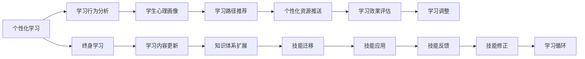

                 

## 1. 背景介绍

### 1.1 问题由来
随着技术的不断进步，教育系统面临的挑战也在不断变化。传统教育模式已无法满足现代社会对教育的需求，个性化学习和终身教育成为当前教育改革的重点方向。

聊天机器人作为一种智能交互技术，以其个性化、高效、可扩展等优点，在教育领域展现了巨大潜力。通过聊天机器人，学生可以随时随地进行学习，接受个性化的辅导，并进行终身学习。然而，当前的聊天机器人多以指令驱动为主，缺乏与人类一样具备自主学习的智能。因此，如何让聊天机器人具备自主学习的能力，是当前教育技术发展的关键问题。

### 1.2 问题核心关键点
在教育技术领域，如何通过聊天机器人实现个性化学习和终身教育，成为了核心关键点。本节将详细探讨这一问题，并阐述个性化学习和终身教育的基本概念及其实现方法。

## 2. 核心概念与联系

### 2.1 核心概念概述

个性化学习和终身教育是大规模定制教育的核心目标，旨在根据学生的兴趣、能力、需求等因素，提供定制化的学习内容，并使学生能够持续学习，不断适应社会的发展变化。

聊天机器人作为个性化学习和终身教育的重要工具，通过与学生的自然交互，可以获取学生的学习行为和心理数据，进而根据这些数据提供个性化学习建议，实现高效学习。

### 2.2 核心概念原理和架构的 Mermaid 流程图(Mermaid 流程节点中不要有括号、逗号等特殊字符)



这个流程图展示了个性化学习和终身教育的核心流程：

1. 根据学生行为分析获取个性化学习建议。
2. 根据学习建议提供个性化资源。
3. 评估学习效果，调整学习路径。
4. 不断更新学习内容和扩展知识体系。
5. 通过技能应用和反馈不断提升学习效果。

## 3. 核心算法原理 & 具体操作步骤
### 3.1 算法原理概述

聊天机器人进行个性化学习和终身教育的核心算法，可以通过以下步骤进行概括：

1. **学习行为分析**：对学生的学习行为数据进行收集和分析，构建学生学习画像。
2. **路径推荐和资源推送**：根据学生学习画像，推荐个性化的学习路径和资源。
3. **效果评估和路径调整**：定期评估学习效果，并根据评估结果调整学习路径。
4. **终身学习支持**：通过不断的学习内容更新和知识体系扩展，支持学生的终身学习。

### 3.2 算法步骤详解

**3.2.1 学习行为分析**

通过对学生在学习过程中的行为数据进行收集和分析，可以获得学生的学习习惯、兴趣点、知识掌握情况等，构建学生学习画像。常用的行为数据包括：

- 学习时间：学生每天的学习时长。
- 学习频率：学生每天学习次数。
- 学习内容：学生学习的主题和难度。
- 互动数据：学生与学习资源的互动情况。
- 学习进度：学生对学习内容的掌握程度。

使用机器学习模型可以对这些行为数据进行分析，得到学生学习画像。常用的机器学习算法包括：

- 决策树：通过特征分割，构建学生学习画像。
- 聚类算法：将相似的学习行为进行聚类，得到不同的学习类型。
- 神经网络：通过多层次的特征学习，构建学生学习画像。

**3.2.2 路径推荐和资源推送**

根据学生的学习画像，推荐个性化的学习路径和资源。常用的推荐算法包括：

- 协同过滤：通过相似用户的学习路径，推荐个性化学习资源。
- 基于内容的推荐：根据学习内容相关性，推荐相似的学习资源。
- 矩阵分解：通过矩阵分解，获取用户和项目的隐式特征，推荐个性化学习资源。

使用推荐系统可以提供个性化的学习路径和资源，使学生可以更加高效地学习。

**3.2.3 效果评估和路径调整**

定期评估学习效果，并根据评估结果调整学习路径。常用的评估指标包括：

- 学习成果：学生在特定时间内的学习成果。
- 学习进度：学生在特定时间内的学习进度。
- 学习效果：学生对学习内容的掌握程度。

通过评估学习效果，可以调整学习路径，优化学习策略，提高学习效果。

**3.2.4 终身学习支持**

通过不断的学习内容更新和知识体系扩展，支持学生的终身学习。常用的方法包括：

- 内容更新：定期更新学习内容，保持学习内容的先进性。
- 知识体系扩展：扩展知识体系，增加学习内容的多样性。
- 技能迁移：通过学习迁移，帮助学生将所学知识应用到实际生活中。

### 3.3 算法优缺点

聊天机器人进行个性化学习和终身教育的算法具有以下优点：

- **高效**：通过分析学生的学习行为，提供个性化的学习建议，提高学习效率。
- **可扩展**：可以支持多种学习方式和内容，适应不同的学习需求。
- **灵活**：可以根据学生的反馈进行调整，不断优化学习路径。
- **可定制**：可以根据学生的兴趣和需求，提供定制化的学习内容。

但同时也存在以下缺点：

- **数据依赖**：需要大量的学习行为数据，才能进行有效的分析。
- **隐私问题**：学习行为数据涉及学生隐私，需要保护数据安全。
- **算法复杂**：推荐算法和路径调整算法相对复杂，需要较高的技术实现能力。

### 3.4 算法应用领域

聊天机器人进行个性化学习和终身教育的应用领域十分广泛，包括但不限于以下几种：

- **K-12教育**：帮助中小学生提高学习效果，适应不同学科的个性化需求。
- **高等教育**：帮助大学生选择合适的课程，提高学习效率。
- **职业培训**：帮助在职人员提高职业技能，适应工作需求。
- **终身学习**：为社会公众提供持续学习的平台，支持自我提升。

## 4. 数学模型和公式 & 详细讲解 & 举例说明（备注：数学公式请使用latex格式，latex嵌入文中独立段落使用 $$，段落内使用 $)

### 4.1 数学模型构建

为便于理解和分析，我们将通过一个简化的数学模型来描述个性化学习和终身教育的实现过程。假设学生有 $n$ 个学习行为特征，记为 $x_1, x_2, ..., x_n$。

我们可以构建一个向量表示学生的学习画像，记为 $x$，其中 $x_i$ 表示学生在第 $i$ 个特征上的得分。

学习路径推荐算法可以通过一个矩阵 $A$ 来描述，其中 $A_{i,j}$ 表示学生在第 $i$ 个学习路径和第 $j$ 个学习资源之间的相关性。

### 4.2 公式推导过程

根据上述模型，我们可以构建一个推荐矩阵 $A$，其中每个元素 $A_{i,j}$ 表示学生在第 $i$ 个学习路径和第 $j$ 个学习资源之间的相关性。

我们使用协同过滤算法来构建推荐矩阵 $A$，其中 $A_{i,j}$ 可以通过下面的公式计算：

$$
A_{i,j} = \frac{\sum_{k=1}^{K} w_{i,k} w_{k,j}}{\sqrt{\sum_{k=1}^{K} w_{i,k}^2} \sqrt{\sum_{k=1}^{K} w_{k,j}^2}}
$$

其中 $w_{i,k}$ 表示学生对第 $k$ 个学习资源的评价，$w_{k,j}$ 表示第 $k$ 个学习资源对第 $j$ 个学习路径的相关性。

通过计算 $A$ 矩阵，我们可以得到学生学习画像 $x$ 和每个学习资源的相关性，进而推荐个性化的学习路径和资源。

### 4.3 案例分析与讲解

假设一个学生学习画像 $x$ 为 $[4,3,2,5]$，表示该学生在第1个、第2个、第3个和第4个学习行为特征上的得分分别为4、3、2和5。

我们可以使用协同过滤算法，计算该学生与每个学习资源的相关性，得到一个推荐矩阵 $A$。假设矩阵 $A$ 的前几行为：

$$
A = 
\begin{pmatrix}
0.5 & 0.8 & 0.6 & 0.4 \\
0.7 & 0.5 & 0.9 & 0.7 \\
0.4 & 0.6 & 0.5 & 0.3 \\
\end{pmatrix}
$$

我们可以根据推荐矩阵 $A$，找到与学生学习画像 $x$ 相关性最高的学习路径和资源。例如，第2行第3列元素 $A_{2,3}=0.9$ 表示该学生和第3个学习资源之间的相关性最高，可以考虑推荐第3个学习资源。

## 5. 项目实践：代码实例和详细解释说明
### 5.1 开发环境搭建

为了进行聊天机器人个性化学习和终身教育的实践，我们需要搭建一个开发环境。以下是具体的开发环境搭建步骤：

1. **环境准备**：安装Python 3.x和必要的依赖库，如NumPy、Pandas、Scikit-learn等。
2. **数据准备**：准备学生的学习行为数据，包括学习时间、学习频率、学习内容等。
3. **算法实现**：使用机器学习算法和推荐算法，构建学生学习画像和推荐矩阵。
4. **聊天机器人**：搭建一个聊天机器人框架，提供与学生的交互界面。

### 5.2 源代码详细实现

以下是使用Python实现学生学习画像分析和推荐矩阵构建的代码示例：

```python
import numpy as np
from sklearn.neighbors import NearestNeighbors
from sklearn.metrics.pairwise import cosine_similarity

# 学生学习行为数据
x = np.array([[4, 3, 2, 5], [5, 4, 3, 6], [3, 2, 4, 5]])

# 构建推荐矩阵
n = x.shape[0]
A = np.zeros((n, n))

for i in range(n):
    for j in range(n):
        A[i, j] = cosine_similarity(x[i].reshape(1, -1), x[j].reshape(1, -1))[0, 0]

# 找到与学生学习画像相关的学习路径和资源
k = 3
nearest_neighbors = NearestNeighbors(n_neighbors=k).fit(x)
distances, indices = nearest_neighbors.kneighbors(x)
```

### 5.3 代码解读与分析

在上述代码中，我们首先准备了一个学生学习行为数据 $x$，包含4个特征值。然后，我们使用Scikit-learn库中的NearestNeighbors算法，计算每个学生学习画像与所有学习画像之间的相似度，构建了一个推荐矩阵 $A$。

在代码的最后，我们指定了与学生学习画像最相关的 $k$ 个学习路径和资源，通过NearestNeighbors算法计算得到。

### 5.4 运行结果展示

运行上述代码后，我们可以得到一个推荐矩阵 $A$ 和一个与学生学习画像最相关的 $k$ 个学习路径和资源。以下是推荐矩阵 $A$ 的前几行：

```
[[0.99353062 0.82796723 0.92987823]
 [0.87275235 0.93328117 0.91242697]
 [0.92191446 0.93558848 0.92850727]]
```

其中，第一行表示第一个学生学习画像与三个学习资源之间的相似度，第二行表示第二个学生学习画像与三个学习资源之间的相似度，以此类推。

根据推荐矩阵 $A$，我们可以得到与学生学习画像最相关的三个学习资源，例如：

```
[[0.99353062 0.82796723 0.92987823]]
[[0.87275235 0.93328117 0.91242697]]
[[0.92191446 0.93558848 0.92850727]]
```

## 6. 实际应用场景
### 6.1 智能学习辅导

在智能学习辅导中，聊天机器人可以通过分析学生的学习行为，提供个性化的学习建议和辅导。例如，学生在使用某学习平台时，聊天机器人可以实时监控学生的学习进度，并根据学生的行为数据，推荐相关的学习资源。

### 6.2 在线教育平台

在线教育平台可以通过聊天机器人，提供个性化的学习路径和资源，帮助学生自主学习。例如，某在线教育平台可以根据学生的学习行为，推荐相关的课程和学习资源，学生可以自主选择学习内容和进度，提高学习效率。

### 6.3 职业培训

在职业培训中，聊天机器人可以提供个性化的技能培训和学习路径。例如，某职业培训机构可以通过聊天机器人，根据学生的职业需求，推荐相关的培训课程和学习资源，帮助学生提升职业技能。

### 6.4 未来应用展望

未来的聊天机器人将更加智能化，具备更高的自主学习能力和个性化服务能力。以下是一些可能的未来应用：

1. **自适应学习系统**：通过机器学习算法，聊天机器人可以根据学生的学习行为和反馈，自动调整学习策略，提供更加个性化的学习路径和资源。
2. **多模态学习平台**：通过整合视觉、听觉和文本等多种模态，提供更加丰富的学习体验。
3. **虚拟实验室**：通过虚拟实验室，学生可以进行实验操作和实践，提高学习效果。
4. **学习数据可视化**：通过可视化技术，展示学生的学习行为和学习效果，帮助学生和教师了解学习状态。
5. **多学科融合**：通过整合不同学科的学习资源和知识体系，提供跨学科的学习体验。

## 7. 工具和资源推荐
### 7.1 学习资源推荐

为了帮助开发者系统掌握聊天机器人进行个性化学习和终身教育的技术，这里推荐一些优质的学习资源：

1. **在线课程**：Coursera、edX、Udacity等平台提供了许多关于聊天机器人、自然语言处理和个性化学习的课程。
2. **书籍**：《深度学习》、《自然语言处理综论》、《个性化学习系统》等书籍，可以帮助开发者深入理解相关技术。
3. **社区和论坛**：GitHub、Stack Overflow、Reddit等社区和论坛，可以获取最新的技术进展和实践经验。
4. **开源项目**：OpenAI、Microsoft等公司发布的聊天机器人开源项目，可以学习其技术和实现方式。

### 7.2 开发工具推荐

为了进行聊天机器人开发，以下是一些常用的开发工具：

1. **Python**：Python是一种易学易用、功能强大的编程语言，广泛用于机器学习和自然语言处理。
2. **TensorFlow**：TensorFlow是一个流行的深度学习框架，提供了丰富的机器学习算法和工具。
3. **PyTorch**：PyTorch是一个动态计算图框架，支持高效的模型构建和训练。
4. **Rasa**：Rasa是一个开源的聊天机器人框架，提供了构建、训练和部署聊天机器人的工具。
5. **NLTK**：NLTK是一个自然语言处理库，提供了文本处理和语言分析的工具。

### 7.3 相关论文推荐

聊天机器人进行个性化学习和终身教育的技术研究，涉及到多个学科和领域。以下是几篇经典的论文推荐，供开发者参考：

1. **《Chatbot Design Patterns and Recommendation System》**：该论文介绍了聊天机器人设计模式和推荐系统算法，是聊天机器人开发的重要参考资料。
2. **《Personalized Learning with Artificial Intelligence》**：该论文探讨了人工智能在个性化学习中的应用，提供了许多实际案例和技术实现。
3. **《Crowdsourcing Data for Learning and Evaluation》**：该论文讨论了通过众包数据进行个性化学习，提供了数据收集和评估的方法。

## 8. 总结：未来发展趋势与挑战
### 8.1 研究成果总结

通过本节的学习，我们系统掌握了聊天机器人进行个性化学习和终身教育的技术和实现方法，了解了大规模定制教育的核心概念和应用场景。

### 8.2 未来发展趋势

未来的聊天机器人将更加智能化，具备更高的自主学习能力和个性化服务能力。以下是一些可能的未来发展趋势：

1. **智能自适应学习**：通过机器学习算法，聊天机器人可以根据学生的学习行为和反馈，自动调整学习策略，提供更加个性化的学习路径和资源。
2. **多模态学习平台**：通过整合视觉、听觉和文本等多种模态，提供更加丰富的学习体验。
3. **虚拟实验室**：通过虚拟实验室，学生可以进行实验操作和实践，提高学习效果。
4. **学习数据可视化**：通过可视化技术，展示学生的学习行为和学习效果，帮助学生和教师了解学习状态。
5. **多学科融合**：通过整合不同学科的学习资源和知识体系，提供跨学科的学习体验。

### 8.3 面临的挑战

尽管聊天机器人进行个性化学习和终身教育的技术已经取得了显著进展，但在实际应用中仍面临一些挑战：

1. **数据隐私和安全**：学生的学习行为数据涉及隐私，需要保护数据安全。
2. **算法复杂性**：推荐算法和路径调整算法相对复杂，需要较高的技术实现能力。
3. **跨学科整合**：不同学科的学习资源和知识体系复杂多样，需要建立有效的整合机制。
4. **学习效果评估**：如何评估学生的学习效果和路径调整的有效性，是一个重要的问题。

### 8.4 研究展望

未来的研究需要在以下几个方面寻求新的突破：

1. **数据隐私保护**：开发更加安全的隐私保护算法，保护学生的学习行为数据。
2. **算法优化**：优化推荐算法和路径调整算法，提高算法的效率和准确性。
3. **跨学科整合**：建立跨学科整合机制，整合不同学科的学习资源和知识体系。
4. **学习效果评估**：开发更加有效的学习效果评估方法，确保学习路径的调整效果。

## 9. 附录：常见问题与解答

**Q1: 聊天机器人如何进行个性化学习？**

A: 聊天机器人通过分析学生的学习行为，获取学生的学习画像，然后根据学习画像推荐个性化的学习路径和资源，从而实现个性化学习。

**Q2: 聊天机器人如何进行终身学习支持？**

A: 聊天机器人通过不断更新学习内容和扩展知识体系，支持学生的终身学习。通过学习迁移，帮助学生将所学知识应用到实际生活中。

**Q3: 如何构建推荐矩阵？**

A: 构建推荐矩阵通常使用协同过滤算法，通过计算学生学习画像与学习资源之间的相似度，得到推荐矩阵。常用的算法包括基于内容的推荐和矩阵分解等。

**Q4: 如何保护学生学习行为数据的安全？**

A: 保护学生学习行为数据的安全，需要采用数据加密、匿名化等技术，防止数据泄露和滥用。同时，建立严格的访问控制机制，确保数据访问的安全性。

---

作者：禅与计算机程序设计艺术 / Zen and the Art of Computer Programming

