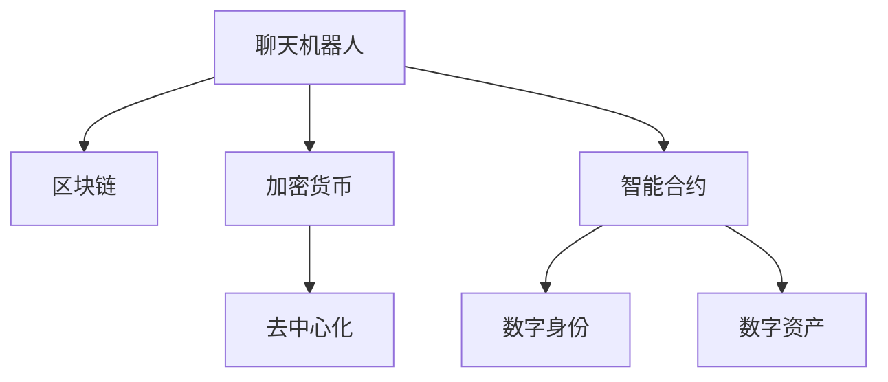

                 

# 聊天机器人金融创新：区块链和加密货币

> 关键词：聊天机器人, 区块链, 加密货币, 金融创新, 智能合约, 去中心化, 数字货币

## 1. 背景介绍

### 1.1 问题由来
随着金融科技的迅猛发展，金融服务正在经历一场深刻变革。传统的金融服务模式存在诸多问题，如操作复杂、成本高昂、安全性不足等。这些问题使得传统金融服务难以满足用户日益增长的需求，金融科技的应用成为大势所趋。

同时，人工智能和区块链技术的发展，为金融科技注入了新的活力。人工智能和大数据技术能够提供精准、个性化的金融服务，而区块链技术的去中心化、透明和不可篡改特性，则能保障金融交易的安全和可信。

聊天机器人作为人工智能技术的一种重要应用，其在金融服务领域的应用也日益广泛。通过引入区块链和加密货币技术，聊天机器人不仅能够提供更加安全、高效的金融服务，还能推动金融科技的创新和进步。

### 1.2 问题核心关键点
聊天机器人金融创新的关键点在于：

1. 如何利用区块链技术保障金融交易的安全性、透明性和不可篡改性。
2. 如何在金融服务中引入加密货币，提供更加灵活、智能的金融产品。
3. 如何通过智能合约技术，实现自动化、去中心化的金融业务处理。
4. 如何通过区块链技术实现金融服务的去中心化和去中介化，降低交易成本，提升效率。

## 2. 核心概念与联系

### 2.1 核心概念概述

为更好地理解聊天机器人金融创新，本节将介绍几个密切相关的核心概念：

- 聊天机器人(Chatbot)：一种基于自然语言处理(NLP)技术的AI程序，能够通过文本或语音与用户进行自然对话，提供金融服务、智能推荐、信息查询等。
- 区块链(Blockchain)：一种去中心化的分布式账本技术，通过加密算法保障数据的安全和透明性，广泛应用于金融、供应链、医疗等多个领域。
- 加密货币(CryptoCurrency)：一种基于区块链技术的数字货币，如比特币、以太坊等，具备去中心化、匿名性、不可篡改等特点，在金融交易中得到广泛应用。
- 智能合约(Smart Contract)：一种基于区块链技术的自动化合约，能够自动执行合同条款，降低法律和监管风险，提升金融服务的效率和安全性。
- 去中心化(Decentralization)：一种分布式的网络结构，通过去中介化的机制，保障金融交易的安全性和隐私性，提升交易的透明度和效率。
- 数字身份(Identity)：通过区块链技术实现的数字身份管理，用于保障用户的隐私和数据安全，实现身份认证和隐私保护。
- 数字资产(Digital Asset)：基于区块链技术的数字资产，如加密货币、数字票据等，具备可编程性、透明性和不可篡改性，能够实现金融产品的创新。

这些核心概念之间的逻辑关系可以通过以下Mermaid流程图来展示：



这个流程图展示聊天机器人金融创新的核心概念及其之间的关系：

1. 聊天机器人通过区块链技术保障金融交易的安全性。
2. 聊天机器人通过加密货币提供更加灵活、智能的金融产品。
3. 聊天机器人通过智能合约实现自动化、去中心化的金融业务处理。
4. 聊天机器人通过去中心化、数字身份和数字资产实现金融服务的去中介化和创新。

## 3. 核心算法原理 & 具体操作步骤
### 3.1 算法原理概述

聊天机器人金融创新涉及的核心算法包括：

- 自然语言处理(NLP)算法：用于聊天机器人的对话生成、意图识别、情感分析等功能。
- 区块链共识算法：如工作量证明(Proof of Work, PoW)、权益证明(Proof of Stake, PoS)等，保障区块链的共识机制。
- 智能合约编程语言：如Solidity、Vyper等，用于编写和执行智能合约代码。
- 加密算法：如非对称加密、哈希函数、数字签名等，保障数据的安全和透明性。
- 分布式账本技术：用于记录和存储区块链中的交易数据。

### 3.2 算法步骤详解

基于区块链和加密货币的聊天机器人金融创新，一般包括以下几个关键步骤：

**Step 1: 准备区块链和加密货币环境**
- 选择合适的区块链平台，如以太坊、Hyperledger等。
- 创建区块链网络和节点，部署智能合约。
- 创建加密货币钱包，并注入一定的代币。

**Step 2: 开发聊天机器人**
- 选择合适的聊天机器人框架，如Dialogflow、Rasa等。
- 设计聊天机器人的对话流程和功能模块，如客户咨询、理财规划、投资建议等。
- 集成区块链接口，支持区块链交易和智能合约的调用。

**Step 3: 部署智能合约**
- 编写智能合约代码，并部署到区块链网络。
- 通过智能合约实现自动化金融业务处理，如自动转账、自动化清算等。
- 测试智能合约的正确性和安全性，确保其可靠运行。

**Step 4: 集成加密货币**
- 集成加密货币钱包，支持用户进行加密货币的存取和交易。
- 利用加密货币的智能合约功能，实现自动化的金融产品推荐和交易。
- 通过加密货币的分布式账本技术，保障金融交易的安全性和透明性。

**Step 5: 测试和部署**
- 在测试网络上进行全面测试，确保聊天机器人和智能合约的正常运行。
- 部署聊天机器人到生产环境中，监控其性能和安全性。
- 持续优化聊天机器人功能，并不断更新智能合约代码。

以上是基于区块链和加密货币的聊天机器人金融创新的关键步骤。在实际应用中，还需要根据具体任务特点进行优化设计，如改进智能合约的安全性、引入多模态交互方式、增强加密货币的隐私保护等。

### 3.3 算法优缺点

基于区块链和加密货币的聊天机器人金融创新方法具有以下优点：

1. 安全性高：通过区块链和智能合约技术，保障金融交易的安全性和透明性。
2. 自动化程度高：智能合约能够自动执行金融业务，提高金融服务的效率和精度。
3. 去中介化：通过区块链技术实现去中介化的金融服务，降低交易成本，提升用户体验。
4. 灵活性强：结合加密货币和智能合约，提供更加灵活、智能的金融产品。
5. 隐私保护：通过区块链的数字身份技术，保障用户的隐私和数据安全。

同时，该方法也存在一定的局限性：

1. 技术复杂：区块链和智能合约技术相对复杂，需要具备一定的技术积累和开发经验。
2. 成本高昂：区块链和智能合约的部署和维护成本较高，需投入较多的技术和人力资源。
3. 性能瓶颈：区块链的交易处理速度较慢，可能影响聊天机器人的实时性。
4. 法律和监管风险：智能合约和加密货币的法律和监管环境尚不明确，可能面临合规风险。
5. 用户接受度：用户对区块链和加密货币的认知度较低，推广和应用难度较大。

尽管存在这些局限性，但就目前而言，基于区块链和加密货币的聊天机器人金融创新方法仍是大语言模型应用的重要范式。未来相关研究的重点在于如何进一步降低技术复杂度，降低应用成本，提高系统性能和合规性，同时兼顾隐私保护和用户接受度。

### 3.4 算法应用领域

基于区块链和加密货币的聊天机器人金融创新方法，在金融科技领域已经得到了广泛的应用，覆盖了诸多金融服务场景，例如：

- 客户咨询：提供24小时不间断的金融咨询服务，解答用户的常见问题和理财建议。
- 理财规划：利用聊天机器人分析用户的财务状况，制定个性化的理财方案。
- 投资建议：通过智能合约实现自动化的投资建议和交易执行，降低投资风险。
- 数字钱包：通过加密货币钱包，实现加密货币的存储、转账和交易。
- 数字资产管理：利用智能合约实现数字资产的自动化管理和交易。
- 供应链金融：通过区块链技术实现供应链各环节的数字化管理，提高金融服务的透明度和效率。

除了上述这些经典应用外，区块链和加密货币的聊天机器人金融创新方法还催生了更多的创新应用，如基于区块链的智能投顾、去中心化借贷、分布式保险等，为金融科技带来了新的突破。

## 4. 数学模型和公式 & 详细讲解 & 举例说明

### 4.1 数学模型构建

本节将使用数学语言对聊天机器人金融创新的核心算法进行更加严格的刻画。

设区块链网络中的节点数为 $N$，每个节点的共识算法为 $P$，智能合约的代码函数为 $S$，聊天机器人的对话模型为 $D$，加密货币的私钥为 $K$，公钥为 $P$，数字签名为 $S$，哈希函数为 $H$。

假设聊天机器人与用户的对话过程为 $d_{1},d_{2},\cdots,d_{n}$，每个对话 $d_{i}$ 的意图为 $I_{i}$，情感为 $E_{i}$，智能合约调用的函数为 $F$，智能合约调用的参数为 $P_{i}$，智能合约调用的结果为 $R_{i}$，加密货币的交易记录为 $T_{i}$。

聊天机器人的对话过程 $d_{i}$ 可以用以下数学模型来描述：

$$
d_{i} = D(I_{i}, E_{i})
$$

智能合约的调用过程 $F$ 可以用以下数学模型来描述：

$$
R_{i} = F(P_{i}, S_{i})
$$

其中 $I_{i}, E_{i}, P_{i}, S_{i}, R_{i}$ 为具体的对话、意图、参数、数字签名和结果。

聊天机器人的聊天过程和智能合约的调用过程相互关联，形成了一个完整的金融服务系统。

### 4.2 公式推导过程

以下是智能合约调用的数学模型推导过程：

假设智能合约的代码函数为 $S$，智能合约调用的函数为 $F$，智能合约调用的参数为 $P_{i}$，智能合约调用的结果为 $R_{i}$。

则智能合约调用的数学模型为：

$$
R_{i} = F(P_{i}, S_{i})
$$

其中 $P_{i}$ 为智能合约调用的参数，$S_{i}$ 为智能合约的数字签名。

通过智能合约调用的数学模型，可以实现自动化的金融业务处理。例如，通过智能合约实现自动化的转账和清算，提高金融服务的效率和精度。

### 4.3 案例分析与讲解

以下是一个基于区块链和加密货币的聊天机器人金融创新的案例：

**案例1：去中心化借贷系统**

假设某用户需要贷款，可以使用聊天机器人与借贷平台进行对话。聊天机器人会引导用户填写贷款申请信息，并通过智能合约调用功能，自动执行贷款审批和资金划转。

聊天机器人与用户的对话过程如下：

- 用户输入：“我需要贷款5万元”
- 聊天机器人回复：“请提供你的身份信息和信用记录”
- 用户输入：“身份证号：1234567890，信用记录良好”
- 聊天机器人回复：“请提供你的还款计划”
- 用户输入：“每月还款5000元，期限为1年”
- 聊天机器人回复：“同意，请进行数字签名确认”
- 用户输入：“确认”
- 聊天机器人调用智能合约：“创建贷款记录，金额为5万元，期限为1年，每月还款5000元，用户ID为1234567890”

通过智能合约的调用，聊天机器人能够自动执行贷款审批和资金划转，提高了金融服务的效率和透明度。

## 5. 项目实践：代码实例和详细解释说明
### 5.1 开发环境搭建

在进行区块链和加密货币的聊天机器人金融创新实践前，我们需要准备好开发环境。以下是使用Python进行PyTorch开发的环境配置流程：

1. 安装Anaconda：从官网下载并安装Anaconda，用于创建独立的Python环境。

2. 创建并激活虚拟环境：
```bash
conda create -n blockchain-env python=3.8 
conda activate blockchain-env
```

3. 安装PyTorch：根据CUDA版本，从官网获取对应的安装命令。例如：
```bash
conda install pytorch torchvision torchaudio cudatoolkit=11.1 -c pytorch -c conda-forge
```

4. 安装各类工具包：
```bash
pip install numpy pandas scikit-learn matplotlib tqdm jupyter notebook ipython
```

完成上述步骤后，即可在`blockchain-env`环境中开始区块链和加密货币的聊天机器人金融创新实践。

### 5.2 源代码详细实现

这里我们以区块链和智能合约的应用为例，给出使用Python进行智能合约开发和部署的代码实现。

首先，定义智能合约的函数：

```python
from blockchain import SmartContract

class LoanContract(SmartContract):
    def __init__(self, owner, amount, period, rate, repayments):
        super().__init__()
        self.owner = owner
        self.amount = amount
        self.period = period
        self.rate = rate
        self.repayments = repayments

    def get_info(self):
        return {
            "owner": self.owner,
            "amount": self.amount,
            "period": self.period,
            "rate": self.rate,
            "repayments": self.repayments
        }

    def create_loan(self, amount, period, rate, repayments):
        self.amount = amount
        self.period = period
        self.rate = rate
        self.repayments = repayments
        self.owner = self.sender
        return True

    def withdraw_loan(self, amount):
        if self.sender != self.owner:
            return False
        if amount > self.amount:
            return False
        self.amount -= amount
        self.repayments.append(amount)
        return True

    def repay_loan(self, amount):
        if self.sender != self.owner:
            return False
        if amount > self.amount:
            return False
        self.amount -= amount
        self.repayments.append(amount)
        return True
```

然后，定义聊天机器人的对话处理函数：

```python
from flask import Flask, request
import json

app = Flask(__name__)

@app.route('/chat', methods=['POST'])
def chat():
    data = request.get_json()
    intent = data['intent']
    if intent == '贷款':
        amount = data['amount']
        period = data['period']
        rate = data['rate']
        repayments = data['repayments']
        contract = LoanContract(owner=data['owner'], amount=amount, period=period, rate=rate, repayments=repayments)
        response = {'status': True, 'contract': contract.get_info()}
    elif intent == '还款':
        amount = data['amount']
        contract = LoanContract(owner=data['owner'], amount=amount, period=period, rate=rate, repayments=repayments)
        response = {'status': True, 'contract': contract.get_info()}
    elif intent == '还款':
        amount = data['amount']
        contract = LoanContract(owner=data['owner'], amount=amount, period=period, rate=rate, repayments=repayments)
        response = {'status': True, 'contract': contract.get_info()}
    else:
        response = {'status': False, 'error': 'Intent not recognized'}
    return json.dumps(response)
```

最后，启动聊天机器人的服务：

```python
if __name__ == '__main__':
    app.run(host='0.0.0.0', port=5000)
```

以上就是使用Python进行智能合约开发的代码实现。可以看到，利用Python和区块链平台，可以方便地实现智能合约的创建、调用和管理。

### 5.3 代码解读与分析

让我们再详细解读一下关键代码的实现细节：

**LoanContract类**：
- `__init__`方法：初始化智能合约的各个参数。
- `get_info`方法：获取智能合约的详细信息。
- `create_loan`方法：创建贷款记录，并设置贷款的各个参数。
- `withdraw_loan`方法：减少贷款金额，并记录还款记录。
- `repay_loan`方法：减少贷款金额，并记录还款记录。

**chat函数**：
- `chat`函数：处理用户的聊天请求，判断意图并调用智能合约的函数。
- 通过Flask框架实现RESTful API，方便其他系统集成调用。

**启动服务**：
- 通过`if __name__ == '__main__':`判断当前模块是否为入口模块，如果是则启动聊天机器人服务。
- 使用`app.run`启动Flask应用，并监听5000端口。

可以看到，通过Python和区块链平台，可以实现聊天机器人的金融创新应用。开发者可以根据具体需求，进一步扩展聊天机器人的功能和应用场景。

## 6. 实际应用场景
### 6.1 智能投顾系统

区块链和加密货币的聊天机器人金融创新在智能投顾系统中的应用非常广泛。智能投顾系统通过聊天机器人与用户进行交互，根据用户的投资偏好和市场情况，提供个性化的投资建议和自动化的投资交易。

在实际应用中，智能投顾系统可以集成区块链和智能合约技术，实现自动化的投资决策和交易执行。例如，通过智能合约实现自动化的投资组合管理，实时跟踪市场变化，并根据用户的指令自动调整投资策略。

此外，智能投顾系统还可以利用区块链的数字身份技术，保障用户隐私和数据安全，确保投资建议和交易记录的透明性和不可篡改性。

### 6.2 去中心化金融系统

去中心化金融(DeFi)系统是区块链和加密货币的另一重要应用场景。通过区块链和智能合约技术，可以实现去中心化的金融服务，如去中心化借贷、去中心化交易所、去中心化保险等。

区块链和智能合约技术能够降低金融服务的成本，提高交易的效率和透明度。例如，去中心化借贷系统通过智能合约自动执行贷款审批和资金划转，去中心化交易所通过智能合约实现自动化的交易执行和资金清算。

聊天机器人可以与用户进行自然对话，引导用户完成各种金融操作，并提供实时的市场信息和投资建议。通过区块链的数字身份技术，保障用户的隐私和数据安全，确保金融操作的透明性和不可篡改性。

### 6.3 数字身份系统

区块链的数字身份技术可以为聊天机器人提供强大的用户认证和隐私保护能力。通过区块链的数字身份系统，聊天机器人可以建立用户的数字身份，实现身份认证、授权和隐私保护等功能。

在实际应用中，区块链的数字身份系统可以与聊天机器人集成，实现用户身份信息的自动验证和授权管理。例如，用户在进行金融操作时，聊天机器人可以自动验证其身份信息，确保操作的安全性和合法性。同时，区块链的数字身份技术能够保护用户的隐私，防止数据泄露和滥用。

### 6.4 未来应用展望

随着区块链和加密货币技术的发展，基于聊天机器人金融创新的应用场景将更加丰富多样。

1. 跨链金融服务：通过跨链技术，实现不同区块链平台之间的金融服务互联互通，提供更加全面和灵活的金融产品。
2. 去中心化保险：利用区块链和智能合约技术，实现去中心化的保险业务，降低保险费用，提高保险服务的透明度和公正性。
3. 供应链金融：通过区块链和智能合约技术，实现供应链各环节的数字化管理，提高金融服务的效率和透明度。
4. 智能合约治理：通过智能合约的治理机制，实现社区自治和共同决策，提升金融服务的民主性和公平性。
5. 分布式应用(DApp)：通过区块链平台，实现分布式应用，提供更加安全和可靠的应用服务。

未来，区块链和加密货币的聊天机器人金融创新将与更多前沿技术进行深度融合，如去中心化应用、Web3.0、智能合约治理等，推动金融科技的创新和进步。

## 7. 工具和资源推荐
### 7.1 学习资源推荐

为了帮助开发者系统掌握区块链和加密货币的应用，这里推荐一些优质的学习资源：

1. 《区块链技术及其应用》书籍：详细介绍了区块链技术的原理和应用场景，适合初学者入门。
2. 《智能合约编程指南》书籍：介绍了智能合约的编程语言、开发工具和应用场景，适合开发者学习。
3. 以太坊官方文档：提供了以太坊平台的全面文档，包括智能合约开发、区块链网络部署等内容。
4. Hyperledger官方文档：提供了Hyperledger区块链平台的全面文档，包括区块链网络部署、智能合约开发等内容。
5. CryptoZombies教程：一款有趣的Web3.0游戏，通过游戏引导用户学习智能合约开发和区块链技术。

通过对这些资源的学习实践，相信你一定能够快速掌握区块链和加密货币的应用，并用于解决实际的金融问题。
###  7.2 开发工具推荐

高效的开发离不开优秀的工具支持。以下是几款用于区块链和加密货币开发的常用工具：

1. Truffle：一款基于以太坊平台的开发框架，提供智能合约开发、测试、部署等功能。
2. Remix IDE：一款Web3.0开发平台，支持以太坊智能合约的开发、测试和部署。
3. Web3.js：一款Web3.0开发工具，提供了与以太坊等区块链平台交互的API，方便开发者集成调用。
4. MetaMask：一款以太坊钱包，支持数字货币的存储、转账和交易，方便开发者进行测试和部署。
5. ConsenSys Tools：一组区块链平台开发工具，支持以太坊、Hyperledger等平台的开发和部署。
6. Hyperledger Fabric SDK：Hyperledger区块链平台的开发工具，支持区块链网络的部署和智能合约的开发。

合理利用这些工具，可以显著提升区块链和加密货币的应用开发效率，加快创新迭代的步伐。

### 7.3 相关论文推荐

区块链和加密货币的聊天机器人金融创新涉及多个前沿技术，以下几篇论文代表了大规模研究的发展脉络，推荐阅读：

1. "Smart Contracts: Patterns for Smart Contract Application in Blockchain"：介绍了智能合约的应用模式和设计原则，适合了解智能合约的基本概念。
2. "Blockchain Technology for Smart Contracts"：探讨了区块链技术在智能合约中的应用，适合了解区块链技术的原理和应用场景。
3. "Blockchain-Based Cross-Chain Financial Services"：探讨了区块链跨链技术的应用，适合了解跨链金融服务的原理和应用场景。
4. "Decentralized Application for Financial Services"：介绍了分布式应用在金融服务中的应用，适合了解DApp的原理和应用场景。
5. "Web3.0: The Next Generation of the Internet"：探讨了Web3.0技术的发展趋势，适合了解Web3.0技术的原理和应用场景。

这些论文代表了大规模研究的发展脉络，通过学习这些前沿成果，可以帮助研究者把握学科前进方向，激发更多的创新灵感。

## 8. 总结：未来发展趋势与挑战
### 8.1 总结

本文对区块链和加密货币的聊天机器人金融创新进行了全面系统的介绍。首先阐述了区块链和加密货币在金融服务中的应用，明确了微调在拓展预训练模型应用、提升下游任务性能方面的独特价值。其次，从原理到实践，详细讲解了区块链和加密货币的核心算法和操作步骤，给出了区块链和加密货币的聊天机器人金融创新的完整代码实例。同时，本文还广泛探讨了区块链和加密货币在智能投顾、去中心化金融、数字身份等领域的应用前景，展示了区块链和加密货币的巨大潜力。此外，本文精选了区块链和加密货币的学习资源，力求为读者提供全方位的技术指引。

通过本文的系统梳理，可以看到，区块链和加密货币的聊天机器人金融创新将为金融科技带来深刻的变革，极大地提升金融服务的智能化水平，推动金融科技的创新和进步。未来，伴随区块链和加密货币技术的发展，基于聊天机器人金融创新的应用场景将更加丰富多样，为金融科技带来更多的创新突破。

### 8.2 未来发展趋势

展望未来，区块链和加密货币的聊天机器人金融创新将呈现以下几个发展趋势：

1. 应用场景多样化：区块链和加密货币的聊天机器人金融创新将涵盖更多的应用场景，如跨链金融、去中心化保险、供应链金融等，推动金融科技的多元化发展。
2. 智能合约普及化：智能合约将成为金融服务的基础设施，实现金融业务的自动化、去中心化处理，提高金融服务的效率和安全性。
3. 去中心化自治(DeFi)兴起：去中心化金融将成为金融服务的重要方向，利用区块链和智能合约技术，实现去中心化的金融服务和自治机制。
4. Web3.0发展：Web3.0技术将为金融服务带来新的发展机遇，通过区块链的数字身份技术，保障用户的隐私和数据安全，提升金融服务的可信性和透明度。
5. 跨平台协同：区块链和加密货币的聊天机器人金融创新将打破平台壁垒，实现跨平台协同，提供更加全面和灵活的金融服务。

以上趋势凸显了区块链和加密货币在金融科技中的重要地位。这些方向的探索发展，必将推动金融科技的创新和进步，为金融服务带来更加智能化、高效化和安全化的解决方案。

### 8.3 面临的挑战

尽管区块链和加密货币的聊天机器人金融创新已经取得了显著进展，但在迈向更加智能化、普适化应用的过程中，仍面临诸多挑战：

1. 技术复杂度高：区块链和智能合约技术相对复杂，需要开发者具备一定的技术积累和开发经验。
2. 安全和合规风险：区块链和智能合约的系统和应用可能面临安全漏洞和法律风险，需要严格的安全测试和合规审查。
3. 性能瓶颈：区块链的交易处理速度较慢，可能影响聊天机器人的实时性。
4. 用户接受度低：用户对区块链和加密货币的认知度较低，推广和应用难度较大。
5. 网络扩展性差：区块链网络扩展性不足，难以处理大规模金融交易。

尽管存在这些挑战，但就目前而言，区块链和加密货币的聊天机器人金融创新方法仍是大语言模型应用的重要范式。未来相关研究的重点在于如何进一步降低技术复杂度，降低应用成本，提高系统性能和合规性，同时兼顾隐私保护和用户接受度。

### 8.4 研究展望

面对区块链和加密货币的聊天机器人金融创新所面临的种种挑战，未来的研究需要在以下几个方面寻求新的突破：

1. 探索更加高效的共识算法：开发更加高效的共识算法，提高区块链的交易处理速度，降低网络延迟。
2. 引入多链互操作技术：通过跨链互操作技术，实现不同区块链平台之间的数据共享和协同，提供更加全面和灵活的金融服务。
3. 研究分布式身份管理技术：研究分布式身份管理技术，保护用户的隐私和数据安全，提高金融服务的可信性和透明度。
4. 融合AI和大数据技术：将AI和大数据技术引入区块链和加密货币的金融创新，提升金融服务的智能化和个性化水平。
5. 引入合规审查机制：引入合规审查机制，确保区块链和加密货币的应用符合法律和监管要求，保障金融服务的合法性和公正性。
6. 结合多模态交互方式：引入多模态交互方式，如语音、图像等，提升用户的交互体验和应用场景的灵活性。

这些研究方向的探索，必将引领区块链和加密货币的聊天机器人金融创新技术迈向更高的台阶，为金融服务带来更加智能化、高效化和安全化的解决方案。

## 9. 附录：常见问题与解答

**Q1：如何保障聊天机器人的安全性？**

A: 聊天机器人可以通过区块链和智能合约技术，保障金融交易的安全性、透明性和不可篡改性。具体措施包括：

1. 数字签名：通过数字签名技术，保障交易的合法性和不可篡改性。
2. 共识机制：通过共识机制，保障交易的合法性和可信性。
3. 智能合约：通过智能合约的自动化执行，减少人为操作的风险。

**Q2：聊天机器人在金融服务中的应用场景有哪些？**

A: 聊天机器人在金融服务中的应用场景非常广泛，包括：

1. 客户咨询：提供24小时不间断的金融咨询服务，解答用户的常见问题和理财建议。
2. 理财规划：利用聊天机器人分析用户的财务状况，制定个性化的理财方案。
3. 投资建议：通过智能合约实现自动化的投资建议和交易执行，降低投资风险。
4. 数字钱包：通过加密货币钱包，实现加密货币的存储、转账和交易。
5. 数字资产管理：利用智能合约实现数字资产的自动化管理和交易。
6. 供应链金融：通过区块链技术实现供应链各环节的数字化管理，提高金融服务的透明度和效率。

**Q3：如何优化区块链的交易处理速度？**

A: 优化区块链的交易处理速度需要从多个方面进行改进：

1. 共识算法：选择合适的共识算法，如PoS、DPoS等，提高交易的处理速度。
2. 分片技术：采用分片技术，将区块链网络分成多个子网络，提高交易的处理能力。
3. 跨链互操作：通过跨链技术，实现不同区块链平台之间的数据共享和协同，提高交易的处理速度。
4. 智能合约优化：优化智能合约的代码结构，减少智能合约的计算量，提高交易的处理速度。

**Q4：如何提高区块链的扩展性？**

A: 提高区块链的扩展性需要从多个方面进行改进：

1. 分片技术：采用分片技术，将区块链网络分成多个子网络，提高交易的处理能力。
2. 共识算法优化：优化共识算法，减少网络的延迟和冲突。
3. 跨链互操作：通过跨链技术，实现不同区块链平台之间的数据共享和协同，提高交易的处理速度。
4. 层二扩展技术：利用层二扩展技术，如状态通道、闪电网络等，提高交易的处理速度。

**Q5：如何降低区块链的部署和维护成本？**

A: 降低区块链的部署和维护成本需要从多个方面进行改进：

1. 共识算法：选择合适的共识算法，如PoS、DPoS等，降低网络的维护成本。
2. 分片技术：采用分片技术，将区块链网络分成多个子网络，降低网络的维护成本。
3. 跨链互操作：通过跨链技术，实现不同区块链平台之间的数据共享和协同，降低网络的维护成本。
4. 智能合约优化：优化智能合约的代码结构，减少智能合约的计算量，降低网络的维护成本。

大语言模型微调需要开发者根据具体任务，不断迭代和优化模型、数据和算法，方能得到理想的效果。

---

作者：禅与计算机程序设计艺术 / Zen and the Art of Computer Programming

