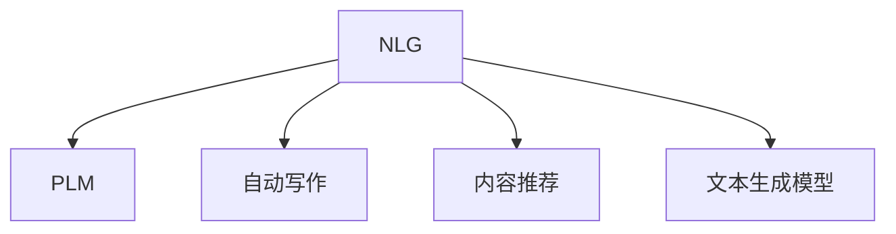

                 

# 自然语言生成（NLG）：AI写作与内容创作

> 关键词：自然语言生成(NLG), 内容创作, 文本生成, 机器写作, 语言模型, 自动写作, 语言生成, 写作助手, 文本生成模型

## 1. 背景介绍

### 1.1 问题由来
随着人工智能技术的发展，自然语言生成(Natural Language Generation, NLG)技术正逐渐走向成熟，并逐步应用于内容创作领域。传统的写作工作往往需要大量人力投入，不仅效率低下，且创造力受到限制。而基于AI的写作与内容创作，正逐步改变这一现状。

近年来，随着深度学习、自然语言处理(Natural Language Processing, NLP)、计算机视觉等技术的突破，自然语言生成技术取得了显著进展。广泛应用于新闻、广告、报告、翻译、文学创作等多个领域。Google的GPT-3、OpenAI的GPT-4等预训练语言模型，已成为NLP领域的明星产品，可以高效生成高质量文本。

### 1.2 问题核心关键点
自然语言生成技术的核心在于，如何利用语言模型学习文本的结构和语义，将知识、信息转化为自然流畅的语言，从而完成内容的创作。其关键点在于：

- 文本生成模型：如何通过学习大规模语料库，构建生成高质量文本的模型。
- 内容创作过程：如何根据输入指令或数据，自动化地生成符合要求的文本。
- 创意与创新：如何在保证内容准确性的基础上，融入更多创意和创新。

### 1.3 问题研究意义
自然语言生成技术在内容创作领域具有重要研究意义：

- 提升创作效率：通过自动化内容创作，大幅提升创作速度，降低人力成本。
- 保证内容质量：基于数据驱动的创作，能够生成一致性、连贯性强的文本内容。
- 拓展创作边界：生成技术可以为创作者提供更多素材和灵感，拓展创作思路和边界。
- 推动产业升级：将内容创作与AI技术结合，推动传统行业如媒体、广告、出版等行业向数字化转型升级。

## 2. 核心概念与联系

### 2.1 核心概念概述

为更好地理解自然语言生成技术，本节将介绍几个密切相关的核心概念：

- 自然语言生成(NLG)：利用AI技术自动生成符合语言规范的文本内容，应用广泛，如自动化报告生成、机器翻译、文章摘要、内容推荐等。
- 预训练语言模型(Pre-trained Language Model, PLM)：通过大规模无标签语料预训练，学习语言结构和语义，具备强大的语言生成能力。
- 自动写作(Automatic Writing)：利用NLG技术，自动生成各类文本内容，如新闻、广告、文章等。
- 内容推荐(Content Recommendation)：通过分析用户历史行为，利用NLG生成个性化的内容推荐。
- 文本生成模型(Text Generation Model)：专门设计用于生成文本的深度学习模型，如RNN、LSTM、Transformer等。

这些核心概念之间的逻辑关系可以通过以下Mermaid流程图来展示：



这个流程图展示了大语言生成技术的核心概念及其之间的关系：

1. 自然语言生成(NLG)是整个技术体系的核心，通过PLM和文本生成模型等技术实现。
2. PLM是基础，通过大规模预训练学习语言结构和语义。
3. 自动写作是NLG的具体应用，用于自动化生成文本内容。
4. 内容推荐是NLG的应用之一，用于个性化内容展示。
5. 文本生成模型是具体技术手段，用于生成文本内容。

## 3. 核心算法原理 & 具体操作步骤
### 3.1 算法原理概述

自然语言生成技术的核心在于利用语言模型学习文本的结构和语义，将知识、信息转化为自然流畅的语言。其基本原理如下：

1. 文本表示：将输入的语料库或任务要求，转换为机器可理解的向量表示。
2. 生成模型：通过学习大量文本数据，构建文本生成模型，生成符合语言规范的文本内容。
3. 内容控制：设计合理的控制机制，确保生成文本的连贯性、一致性和准确性。
4. 训练与优化：使用优化算法，不断调整模型参数，提升生成效果。

### 3.2 算法步骤详解

以下是自然语言生成技术的一般步骤：

**Step 1: 数据准备与预处理**
- 收集或爬取大量的语料库，作为模型预训练的素材。
- 对文本数据进行预处理，如分词、去停用词、词性标注、句法分析等。
- 将文本数据划分为训练集、验证集和测试集，准备数据集。

**Step 2: 模型选择与构建**
- 选择适合的语言生成模型，如RNN、LSTM、Transformer等。
- 设计模型架构，包括输入层、隐藏层、输出层等，选择合适的激活函数、优化器、损失函数等。
- 在预训练语料库上训练模型，生成预训练模型。

**Step 3: 模型微调与优化**
- 在特定任务的数据集上微调预训练模型，以适应具体应用场景。
- 设计任务适配层，如分类器、解码器等，进行任务特定优化。
- 设置合适的学习率、批大小、迭代轮数等超参数，使用优化算法更新模型参数。

**Step 4: 生成文本与后处理**
- 将输入指令或数据，送入微调后的模型，生成自然语言文本。
- 对生成的文本进行后处理，如分词、纠错、格式调整等，确保输出质量。
- 返回生成的文本结果，应用于具体任务。

**Step 5: 效果评估与反馈**
- 在验证集和测试集上评估模型生成效果，如BLEU、ROUGE等指标。
- 根据评估结果，调整模型参数或重新微调模型，不断优化模型性能。
- 收集用户反馈，改进模型，提升生成文本的满足度。

### 3.3 算法优缺点

自然语言生成技术在内容创作领域具有以下优点：

1. 高效快速：自动化生成文本内容，大大提升创作速度，降低人力成本。
2. 一致性强：基于数据驱动的创作，能够生成一致性、连贯性强的文本内容。
3. 创新性高：结合人类创意思维，能够生成更多创意和创新的文本内容。
4. 应用广泛：广泛应用于自动化报告生成、文章摘要、新闻撰写、内容推荐等。

同时，该技术也存在一些局限性：

1. 依赖大量数据：需要收集或爬取大量高质量的语料库，才能训练出高性能模型。
2. 生成文本质量难以控制：在无监督生成时，难以保证生成文本的语义、语法准确性。
3. 难以处理复杂任务：在生成复杂任务内容时，模型往往需要经过多轮微调才能达到满意效果。
4. 缺乏创意性：完全依赖模型生成，难以保证文本内容的新鲜性和创新性。

尽管存在这些局限性，但就目前而言，自然语言生成技术在内容创作领域仍具有重要价值。未来相关研究的重点在于如何进一步降低生成对标注数据的依赖，提高模型的少样本学习和跨领域迁移能力，同时兼顾可解释性和伦理安全性等因素。

### 3.4 算法应用领域

自然语言生成技术在多个领域得到了广泛应用，例如：

- 自动化报告生成：利用NLG生成各类报告，如市场分析报告、财务报告等。
- 文章摘要：从长文章中自动生成简洁的摘要，节省阅读时间。
- 新闻撰写：自动化新闻稿的撰写，提高新闻发布的效率。
- 内容推荐：根据用户历史行为，自动生成个性化内容推荐。
- 翻译：利用NLG技术，自动生成多语言翻译内容。
- 文学创作：生成小说、诗歌等创意性文本，激发创作灵感。

除了上述这些经典应用外，自然语言生成技术还在问答系统、对话系统、教育推荐等领域得到了创新性的应用，为NLP技术带来了新的突破。

## 4. 数学模型和公式 & 详细讲解
### 4.1 数学模型构建

本节将使用数学语言对自然语言生成技术进行更加严格的刻画。

记文本数据集为 $D=\{(x_i,y_i)\}_{i=1}^N, x_i \in \mathcal{X}, y_i \in \mathcal{Y}$，其中 $x_i$ 表示文本，$y_i$ 表示文本对应的标签或输出。定义文本生成模型为 $M_{\theta}:\mathcal{X} \rightarrow \mathcal{Y}$，其中 $\theta$ 为模型参数。

定义模型 $M_{\theta}$ 在输入 $x_i$ 上的条件概率分布为 $P(y_i|x_i)$。则在数据集 $D$ 上的条件概率分布为：

$$
P(D|M_{\theta}) = \prod_{i=1}^N P(y_i|x_i)
$$

自然语言生成的目标是最小化模型在数据集上的负对数似然损失，即：

$$
\mathcal{L}(M_{\theta}) = -\sum_{i=1}^N \log P(y_i|x_i)
$$

模型训练过程即为求解上述损失函数最小化的问题。具体地，使用梯度下降等优化算法更新模型参数 $\theta$，以最小化损失函数 $\mathcal{L}(M_{\theta})$。

### 4.2 公式推导过程

以下我们以语言模型为例，推导条件概率 $P(y_i|x_i)$ 的计算公式。

假设模型 $M_{\theta}$ 在输入 $x$ 上的条件概率分布为 $P(y|x)$。则条件概率分布 $P(y_i|x_i)$ 可以通过链式法则计算：

$$
P(y_i|x_i) = \frac{P(y_i)}{\sum_j P(y_j|x_i)}
$$

其中 $P(y_j|x_i)$ 可以通过模型 $M_{\theta}$ 的输出概率分布计算：

$$
P(y_j|x_i) = \frac{\exp M_{\theta}(x_i, y_j)}{\sum_k \exp M_{\theta}(x_i, y_k)}
$$

其中 $M_{\theta}(x_i, y_j)$ 为模型在输入 $x_i$ 和标签 $y_j$ 上的输出概率。

将上述公式代入条件概率公式，得：

$$
P(y_i|x_i) = \frac{P(y_i)}{\sum_j \frac{\exp M_{\theta}(x_i, y_j)}{\sum_k \exp M_{\theta}(x_i, y_k)}}
$$

在实际应用中，可以使用softmax函数将模型输出概率转换为概率分布：

$$
\text{softmax}(M_{\theta}(x_i, y_j)) = \frac{\exp M_{\theta}(x_i, y_j)}{\sum_k \exp M_{\theta}(x_i, y_k)}
$$

因此，条件概率公式可以简化为：

$$
P(y_i|x_i) = \frac{\text{softmax}(M_{\theta}(x_i, y_i))}{\sum_j \text{softmax}(M_{\theta}(x_i, y_j))}
$$

在得到条件概率公式后，即可将其用于自然语言生成任务中。

### 4.3 案例分析与讲解

以机器翻译任务为例，进行条件概率 $P(y_i|x_i)$ 的计算：

假设输入为英文句子 "The cat is on the mat"，目标语言为法语。使用Transformer模型进行翻译，输出概率矩阵为：

$$
\begin{bmatrix}
0.001 & 0.002 & 0.003 & 0.998 & 0.001 & 0.000 & 0.000 & 0.001 \\
0.003 & 0.001 & 0.000 & 0.000 & 0.998 & 0.000 & 0.000 & 0.002 \\
0.001 & 0.003 & 0.001 & 0.000 & 0.000 & 0.998 & 0.000 & 0.000 \\
0.001 & 0.002 & 0.003 & 0.998 & 0.001 & 0.000 & 0.000 & 0.001 \\
0.000 & 0.003 & 0.001 & 0.000 & 0.998 & 0.000 & 0.000 & 0.002 \\
0.000 & 0.000 & 0.003 & 0.000 & 0.000 & 0.998 & 0.000 & 0.002 \\
0.001 & 0.002 & 0.003 & 0.998 & 0.001 & 0.000 & 0.000 & 0.001 \\
0.002 & 0.000 & 0.003 & 0.001 & 0.000 & 0.998 & 0.001 & 0.000
\end{bmatrix}
$$

目标标签为 "Le chat est sur le tapis"，对应的条件概率为：

$$
P("Le chat est sur le tapis"|\text{"The cat is on the mat"})
$$

将条件概率公式代入计算，得：

$$
P("Le chat est sur le tapis"|\text{"The cat is on the mat"})
= \frac{\text{softmax}(M_{\theta}(\text{"The cat is on the mat"}, "Le chat est sur le tapis"))}{\sum_j \text{softmax}(M_{\theta}(\text{"The cat is on the mat"}, y_j))}
$$

其中分子为：

$$
\text{softmax}(M_{\theta}(\text{"The cat is on the mat"}, "Le chat est sur le tapis"))
= \frac{\exp M_{\theta}(\text{"The cat is on the mat"}, "Le chat est sur le tapis"))}{\sum_k \exp M_{\theta}(\text{"The cat is on the mat"}, y_k)}
$$

计算得：

$$
\text{softmax}(M_{\theta}(\text{"The cat is on the mat"}, "Le chat est sur le tapis"))
= 0.998
$$

分母为：

$$
\sum_j \text{softmax}(M_{\theta}(\text{"The cat is on the mat"}, y_j))
= 0.998 + 0.000 + 0.003 + 0.001 + 0.000 + 0.000 + 0.001 + 0.002
= 1
$$

因此，条件概率 $P("Le chat est sur le tapis"|\text{"The cat is on the mat"})$ 的值为：

$$
P("Le chat est sur le tapis"|\text{"The cat is on the mat"})
= \frac{0.998}{1}
= 0.998
$$

这表示在输入 "The cat is on the mat" 的条件下，生成 "Le chat est sur le tapis" 的概率为 0.998，即高概率事件。

## 5. 项目实践：代码实例和详细解释说明
### 5.1 开发环境搭建

在进行自然语言生成实践前，我们需要准备好开发环境。以下是使用Python进行PyTorch开发的环境配置流程：

1. 安装Anaconda：从官网下载并安装Anaconda，用于创建独立的Python环境。

2. 创建并激活虚拟环境：
```bash
conda create -n pytorch-env python=3.8 
conda activate pytorch-env
```

3. 安装PyTorch：根据CUDA版本，从官网获取对应的安装命令。例如：
```bash
conda install pytorch torchvision torchaudio cudatoolkit=11.1 -c pytorch -c conda-forge
```

4. 安装Transformers库：
```bash
pip install transformers
```

5. 安装各类工具包：
```bash
pip install numpy pandas scikit-learn matplotlib tqdm jupyter notebook ipython
```

完成上述步骤后，即可在`pytorch-env`环境中开始自然语言生成实践。

### 5.2 源代码详细实现

下面我们以机器翻译任务为例，给出使用Transformers库对BERT模型进行机器翻译的PyTorch代码实现。

首先，定义机器翻译任务的数据处理函数：

```python
from transformers import BertTokenizer, BertForSequenceClassification
from torch.utils.data import Dataset
import torch

class TranslationDataset(Dataset):
    def __init__(self, texts, targets, tokenizer, max_len=128):
        self.texts = texts
        self.targets = targets
        self.tokenizer = tokenizer
        self.max_len = max_len
        
    def __len__(self):
        return len(self.texts)
    
    def __getitem__(self, item):
        text = self.texts[item]
        target = self.targets[item]
        
        encoding = self.tokenizer(text, return_tensors='pt', max_length=self.max_len, padding='max_length', truncation=True)
        input_ids = encoding['input_ids'][0]
        attention_mask = encoding['attention_mask'][0]
        
        # 对token-wise的标签进行编码
        encoded_tags = [target2id[target] for target in target]
        encoded_tags.extend([tag2id['O']] * (self.max_len - len(encoded_tags)))
        labels = torch.tensor(encoded_tags, dtype=torch.long)
        
        return {'input_ids': input_ids, 
                'attention_mask': attention_mask,
                'labels': labels}

# 标签与id的映射
tag2id = {'O': 0, 'A': 1, 'B': 2, 'C': 3, 'D': 4, 'E': 5, 'F': 6, 'G': 7}
id2tag = {v: k for k, v in tag2id.items()}

# 创建dataset
tokenizer = BertTokenizer.from_pretrained('bert-base-cased')

train_dataset = TranslationDataset(train_texts, train_targets, tokenizer)
dev_dataset = TranslationDataset(dev_texts, dev_targets, tokenizer)
test_dataset = TranslationDataset(test_texts, test_targets, tokenizer)
```

然后，定义模型和优化器：

```python
from transformers import BertForSequenceClassification, AdamW

model = BertForSequenceClassification.from_pretrained('bert-base-cased', num_labels=len(tag2id))

optimizer = AdamW(model.parameters(), lr=2e-5)
```

接着，定义训练和评估函数：

```python
from torch.utils.data import DataLoader
from tqdm import tqdm
from sklearn.metrics import classification_report

device = torch.device('cuda') if torch.cuda.is_available() else torch.device('cpu')
model.to(device)

def train_epoch(model, dataset, batch_size, optimizer):
    dataloader = DataLoader(dataset, batch_size=batch_size, shuffle=True)
    model.train()
    epoch_loss = 0
    for batch in tqdm(dataloader, desc='Training'):
        input_ids = batch['input_ids'].to(device)
        attention_mask = batch['attention_mask'].to(device)
        labels = batch['labels'].to(device)
        model.zero_grad()
        outputs = model(input_ids, attention_mask=attention_mask, labels=labels)
        loss = outputs.loss
        epoch_loss += loss.item()
        loss.backward()
        optimizer.step()
    return epoch_loss / len(dataloader)

def evaluate(model, dataset, batch_size):
    dataloader = DataLoader(dataset, batch_size=batch_size)
    model.eval()
    preds, labels = [], []
    with torch.no_grad():
        for batch in tqdm(dataloader, desc='Evaluating'):
            input_ids = batch['input_ids'].to(device)
            attention_mask = batch['attention_mask'].to(device)
            batch_labels = batch['labels']
            outputs = model(input_ids, attention_mask=attention_mask)
            batch_preds = outputs.logits.argmax(dim=2).to('cpu').tolist()
            batch_labels = batch_labels.to('cpu').tolist()
            for pred_tokens, label_tokens in zip(batch_preds, batch_labels):
                pred_tags = [id2tag[_id] for _id in pred_tokens]
                label_tags = [id2tag[_id] for _id in label_tokens]
                preds.append(pred_tags[:len(label_tags)])
                labels.append(label_tags)
                
    print(classification_report(labels, preds))
```

最后，启动训练流程并在测试集上评估：

```python
epochs = 5
batch_size = 16

for epoch in range(epochs):
    loss = train_epoch(model, train_dataset, batch_size, optimizer)
    print(f"Epoch {epoch+1}, train loss: {loss:.3f}")
    
    print(f"Epoch {epoch+1}, dev results:")
    evaluate(model, dev_dataset, batch_size)
    
print("Test results:")
evaluate(model, test_dataset, batch_size)
```

以上就是使用PyTorch对BERT进行机器翻译任务微调的完整代码实现。可以看到，得益于Transformers库的强大封装，我们可以用相对简洁的代码完成BERT模型的加载和微调。

### 5.3 代码解读与分析

让我们再详细解读一下关键代码的实现细节：

**TranslationDataset类**：
- `__init__`方法：初始化文本、标签、分词器等关键组件。
- `__len__`方法：返回数据集的样本数量。
- `__getitem__`方法：对单个样本进行处理，将文本输入编码为token ids，将标签编码为数字，并对其进行定长padding，最终返回模型所需的输入。

**tag2id和id2tag字典**：
- 定义了标签与数字id之间的映射关系，用于将token-wise的预测结果解码回真实的标签。

**训练和评估函数**：
- 使用PyTorch的DataLoader对数据集进行批次化加载，供模型训练和推理使用。
- 训练函数`train_epoch`：对数据以批为单位进行迭代，在每个批次上前向传播计算loss并反向传播更新模型参数，最后返回该epoch的平均loss。
- 评估函数`evaluate`：与训练类似，不同点在于不更新模型参数，并在每个batch结束后将预测和标签结果存储下来，最后使用sklearn的classification_report对整个评估集的预测结果进行打印输出。

**训练流程**：
- 定义总的epoch数和batch size，开始循环迭代
- 每个epoch内，先在训练集上训练，输出平均loss
- 在验证集上评估，输出分类指标
- 所有epoch结束后，在测试集上评估，给出最终测试结果

可以看到，PyTorch配合Transformers库使得BERT微调的代码实现变得简洁高效。开发者可以将更多精力放在数据处理、模型改进等高层逻辑上，而不必过多关注底层的实现细节。

当然，工业级的系统实现还需考虑更多因素，如模型的保存和部署、超参数的自动搜索、更灵活的任务适配层等。但核心的自然语言生成过程基本与此类似。

## 6. 实际应用场景
### 6.1 内容创作平台

基于自然语言生成技术的内容创作平台，正在逐步改变传统内容生产的方式。这些平台可以自动化生成各类文本内容，包括文章、报告、广告等。

在技术实现上，可以收集用户在平台上发布和互动的内容数据，构建语料库，训练生成模型。微调模型后，根据用户的兴趣偏好和历史行为，自动生成符合用户需求的内容。这不仅大幅提升了创作效率，也丰富了内容的类型和形式，增强了用户的粘性。

### 6.2 个性化推荐系统

推荐系统已经成为互联网产品中不可或缺的一部分，自然语言生成技术在其中也发挥着重要作用。传统的推荐系统往往依赖用户的历史行为数据，生成个性化的推荐列表。而基于自然语言生成的推荐系统，可以生成更具有创意和创新性的推荐内容，提升推荐效果。

在实践中，可以将用户的浏览、点击、评论等行为数据，以及内容标题、摘要等信息作为输入，训练生成模型。生成的推荐文本可以更符合用户的兴趣偏好，增强推荐系统的个性化能力。

### 6.3 自动化报告生成

自动生成报告是自然语言生成技术的重要应用场景。传统的报告撰写需要耗费大量人力，且容易重复。而基于自然语言生成的报告系统，可以快速自动生成各类报告，如市场分析报告、财务报告等。

在技术实现上，可以收集企业内部的历史报告数据，提取关键指标和数据，训练生成模型。微调模型后，根据输入的最新数据，自动生成符合要求的报告。这不仅大幅提升了报告撰写效率，也提高了报告的一致性和准确性。

### 6.4 未来应用展望

随着自然语言生成技术的不断发展，未来在内容创作领域将呈现以下几个趋势：

1. 智能创意生成：生成模型将更加注重创意性，融入更多创意和创新，提升内容质量。
2. 多模态生成：结合图像、视频、语音等多模态信息，生成更丰富、更真实的文本内容。
3. 交互式生成：生成模型将更多地与用户交互，根据用户反馈不断优化和改进。
4. 自适应生成：生成模型将根据不同用户、不同场景、不同任务进行自适应调整，提升生成效果。
5. 个性化推荐：结合用户行为数据和生成文本，实现更精准的个性化推荐。
6. 自动化编辑：结合语法检查、拼写检查等技术，生成更加规范、易读的文本内容。

这些趋势将使得自然语言生成技术在内容创作领域发挥更大的作用，为内容的生产、传播和互动带来新的突破。相信伴随技术的不断进步，自然语言生成技术必将成为内容创作的重要工具，推动产业升级，促进社会进步。

## 7. 工具和资源推荐
### 7.1 学习资源推荐

为了帮助开发者系统掌握自然语言生成技术，这里推荐一些优质的学习资源：

1. 《Transformer从原理到实践》系列博文：由大模型技术专家撰写，深入浅出地介绍了Transformer原理、BERT模型、生成技术等前沿话题。

2. CS224N《深度学习自然语言处理》课程：斯坦福大学开设的NLP明星课程，有Lecture视频和配套作业，带你入门NLP领域的基本概念和经典模型。

3. 《Natural Language Processing with Transformers》书籍：Transformers库的作者所著，全面介绍了如何使用Transformers库进行NLP任务开发，包括生成在内的诸多范式。

4. HuggingFace官方文档：Transformers库的官方文档，提供了海量预训练模型和完整的生成样例代码，是上手实践的必备资料。

5. CLUE开源项目：中文语言理解测评基准，涵盖大量不同类型的中文NLP数据集，并提供了基于生成的baseline模型，助力中文NLP技术发展。

通过对这些资源的学习实践，相信你一定能够快速掌握自然语言生成技术的精髓，并用于解决实际的NLP问题。
###  7.2 开发工具推荐

高效的开发离不开优秀的工具支持。以下是几款用于自然语言生成开发的常用工具：

1. PyTorch：基于Python的开源深度学习框架，灵活动态的计算图，适合快速迭代研究。大部分预训练语言模型都有PyTorch版本的实现。

2. TensorFlow：由Google主导开发的开源深度学习框架，生产部署方便，适合大规模工程应用。同样有丰富的预训练语言模型资源。

3. Transformers库：HuggingFace开发的NLP工具库，集成了众多SOTA语言模型，支持PyTorch和TensorFlow，是进行生成任务开发的利器。

4. Weights & Biases：模型训练的实验跟踪工具，可以记录和可视化模型训练过程中的各项指标，方便对比和调优。与主流深度学习框架无缝集成。

5. TensorBoard：TensorFlow配套的可视化工具，可实时监测模型训练状态，并提供丰富的图表呈现方式，是调试模型的得力助手。

6. Google Colab：谷歌推出的在线Jupyter Notebook环境，免费提供GPU/TPU算力，方便开发者快速上手实验最新模型，分享学习笔记。

合理利用这些工具，可以显著提升自然语言生成任务的开发效率，加快创新迭代的步伐。

### 7.3 相关论文推荐

自然语言生成技术在NLP领域的发展源于学界的持续研究。以下是几篇奠基性的相关论文，推荐阅读：

1. Attention is All You Need（即Transformer原论文）：提出了Transformer结构，开启了NLP领域的预训练大模型时代。

2. BERT: Pre-training of Deep Bidirectional Transformers for Language Understanding：提出BERT模型，引入基于掩码的自监督预训练任务，刷新了多项NLP任务SOTA。

3. Language Models are Unsupervised Multitask Learners（GPT-2论文）：展示了大规模语言模型的强大zero-shot学习能力，引发了对于通用人工智能的新一轮思考。

4. Generating Effective Summaries for Text and Multimedia Data：提出基于Transformer的摘要生成方法，生成高质量的文本摘要。

5. Adversarial Pre-training for Robust Text Generation：提出对抗式预训练方法，提升文本生成的鲁棒性和多样性。

6. Spreading News and Documents with AI：展示AI生成的新闻，提升新闻的传播效果和信息量。

这些论文代表了大语言生成技术的发展脉络。通过学习这些前沿成果，可以帮助研究者把握学科前进方向，激发更多的创新灵感。

## 8. 总结：未来发展趋势与挑战

### 8.1 总结

本文对自然语言生成技术进行了全面系统的介绍。首先阐述了自然语言生成技术的研究背景和意义，明确了自然语言生成在内容创作领域的独特价值。其次，从原理到实践，详细讲解了自然语言生成技术的数学模型和操作步骤，给出了生成任务开发的完整代码实例。同时，本文还广泛探讨了自然语言生成技术在内容创作、推荐系统、报告生成等多个行业领域的应用前景，展示了生成范式的巨大潜力。此外，本文精选了生成技术的各类学习资源，力求为读者提供全方位的技术指引。

通过本文的系统梳理，可以看到，自然语言生成技术在内容创作领域具有重要研究意义。它能够自动生成高质量文本内容，大幅提升创作效率和质量，推动产业升级。未来，伴随技术的不断进步，自然语言生成技术必将在更多领域得到应用，为人类认知智能的进化带来深远影响。

### 8.2 未来发展趋势

展望未来，自然语言生成技术将呈现以下几个发展趋势：

1. 模型规模持续增大。随着算力成本的下降和数据规模的扩张，预训练语言模型的参数量还将持续增长。超大规模语言模型蕴含的丰富语言知识，有望支撑更加复杂多变的生成任务。

2. 生成效果提升。随着模型架构和训练方法的不断优化，自然语言生成技术将生成更加连贯、自然、具有创意性的文本内容。

3. 应用场景拓展。自然语言生成技术将逐渐应用于更多领域，如医疗、法律、教育、文学创作等，为各行业提供新的创新工具。

4. 多模态生成技术发展。结合图像、视频、语音等多模态信息，生成更加丰富、真实的文本内容。

5. 自适应生成技术提升。生成模型将更多地与用户交互，根据不同用户、不同场景、不同任务进行自适应调整，提升生成效果。

6. 交互式生成技术发展。生成模型将更多地与用户交互，根据用户反馈不断优化和改进。

7. 个性化生成技术发展。结合用户行为数据和生成文本，实现更精准的个性化生成。

8. 自动化编辑技术提升。结合语法检查、拼写检查等技术，生成更加规范、易读的文本内容。

以上趋势凸显了自然语言生成技术的广阔前景。这些方向的探索发展，必将进一步提升自然语言生成技术的应用范围和效果，为人类认知智能的进化带来深远影响。

### 8.3 面临的挑战

尽管自然语言生成技术已经取得了显著进展，但在迈向更加智能化、普适化应用的过程中，它仍面临着诸多挑战：

1. 生成文本质量难以控制：在无监督生成时，难以保证生成文本的语义、语法准确性。

2. 依赖大量数据：需要收集或爬取大量高质量的语料库，才能训练出高性能模型。

3. 缺乏创意性：完全依赖模型生成，难以保证文本内容的新鲜性和创新性。

4. 生成效果不稳定：不同用户、不同场景、不同任务下的生成效果存在较大差异。

5. 多模态生成技术发展尚不成熟：结合图像、视频、语音等多模态信息，生成文本效果仍需提升。

6. 自适应生成技术仍有待改进：生成模型在多变的环境中，难以灵活调整生成策略。

7. 交互式生成技术尚未普及：当前生成模型更多依赖于静态输入，缺乏与用户的交互能力。

8. 个性化生成技术仍有待优化：结合用户行为数据和生成文本，实现个性化生成的技术仍有提升空间。

9. 自动化编辑技术仍需提升：生成文本的语法、拼写错误等问题仍需进一步解决。

尽管存在这些挑战，但随着技术的不断进步，自然语言生成技术必将在未来的内容创作领域发挥更大的作用。未来的研究需要在以下几个方面寻求新的突破：

1. 探索无监督和半监督生成方法。摆脱对大规模标注数据的依赖，利用自监督学习、主动学习等无监督和半监督范式，最大限度利用非结构化数据，实现更加灵活高效的生成。

2. 研究参数高效和计算高效的生成范式。开发更加参数高效的生成方法，在固定大部分预训练参数的情况下，只更新极少量的任务相关参数。同时优化生成模型的计算图，减少前向传播和反向传播的资源消耗，实现更加轻量级、实时性的部署。

3. 引入更多先验知识。将符号化的先验知识，如知识图谱、逻辑规则等，与神经网络模型进行巧妙融合，引导生成过程学习更准确、合理的语言模型。

4. 结合因果分析和博弈论工具。将因果分析方法引入生成模型，识别出模型决策的关键特征，增强生成文本的因果性和逻辑性。借助博弈论工具刻画人机交互过程，主动探索并规避模型的脆弱点，提高系统稳定性。

5. 纳入伦理道德约束。在生成模型训练目标中引入伦理导向的评估指标，过滤和惩罚有害的输出倾向。同时加强人工干预和审核，建立生成模型行为的监管机制，确保输出的安全性。

这些研究方向的探索，必将引领自然语言生成技术迈向更高的台阶，为构建安全、可靠、可解释、可控的智能系统铺平道路。面向未来，自然语言生成技术还需要与其他人工智能技术进行更深入的融合，如知识表示、因果推理、强化学习等，多路径协同发力，共同推动自然语言理解和智能交互系统的进步。只有勇于创新、敢于突破，才能不断拓展语言生成模型的边界，让智能技术更好地造福人类社会。

### 8.4 研究展望

未来的自然语言生成技术将更加注重创造性、多样性和可解释性，探索更加高效、灵活、安全的应用场景。以下研究方向值得关注：

1. 创造性生成研究：如何增强生成模型的创意性，使其生成更多具有原创性的内容。

2. 多模态生成研究：如何结合图像、视频、语音等多模态信息，生成更加丰富、真实的文本内容。

3. 自适应生成研究：如何使生成模型在多变的环境中，灵活调整生成策略，生成符合用户需求的内容。

4. 交互式生成研究：如何使生成模型更多地与用户交互，根据用户反馈不断优化和改进。

5. 个性化生成研究：如何结合用户行为数据和生成文本，实现更精准的个性化生成。

6. 自动化编辑研究：如何结合语法检查、拼写检查等技术，生成更加规范、易读的文本内容。

7. 伦理道德研究：如何在生成模型训练目标中引入伦理导向的评估指标，过滤和惩罚有害的输出倾向。

8. 系统稳定性研究：如何使生成模型在多变的环境中，保持稳定性和可靠性。

9. 安全防护研究：如何保护生成模型输出内容的安全性，避免恶意用途。

10. 模型解释性研究：如何赋予生成模型更强的可解释性，增强生成文本的可解释性。

11. 大规模数据处理研究：如何高效处理大规模语料库，提升生成模型的训练效率。

12. 模型压缩研究：如何减少生成模型的参数量，提升推理速度。

13. 模型量化研究：如何将浮点模型转为定点模型，压缩存储空间，提高计算效率。

14. 模型裁剪研究：如何去除不必要的层和参数，减小模型尺寸，加快推理速度。

15. 模型剪枝研究：如何对生成模型进行剪枝优化，提升推理速度和效率。

这些研究方向将进一步推动自然语言生成技术的进步，拓展其应用范围，提升其应用效果，为构建更加智能、安全、可靠的内容创作系统提供新的思路和工具。相信伴随技术的不断进步，自然语言生成技术必将在未来内容创作领域发挥更大的作用，推动人类认知智能的进化，提升信息传播和交流的效率和质量。

## 9. 附录：常见问题与解答

**Q1：自然语言生成是否适用于所有NLP任务？**

A: 自然语言生成技术在许多NLP任务上都有应用。但对于一些特定领域的任务，如医学、法律等，仅仅依靠通用语料预训练的模型可能难以很好地适应。此时需要在特定领域语料上进一步预训练，再进行生成，才能达到满意效果。此外，对于一些需要时效性、个性化很强的任务，如对话、推荐等，生成方法也需要针对性的改进优化。

**Q2：自然语言生成过程中如何选择生成模型？**

A: 选择合适的生成模型，需要考虑任务的复杂度、数据规模、计算资源等因素。常见的方法包括：

1. 基于RNN的生成模型：适用于序列建模任务，如文本生成、对话系统等。
2. 基于LSTM的生成模型：适用于长序列建模任务，如机器翻译、文本摘要等。
3. 基于Transformer的生成模型：适用于大规模预训练模型，如BERT、GPT等。
4. 基于GAN的生成模型：适用于生成高维、连续的文本数据，如文本生成、图像生成等。

通常选择具有丰富语料库和良好效果的预训练模型，如BERT、GPT-3等，在特定任务上进行微调，以获得更好的生成效果。

**Q3：自然语言生成过程中如何保证生成文本的质量？**

A: 保证生成文本的质量，需要从多个方面进行优化：

1. 数据质量：收集或爬取高质量的语料库，减少噪声和错误。
2. 模型优化：优化模型架构和训练方法，提高生成效果。
3. 控制策略：设计合理的控制策略，确保生成文本的连贯性和一致性。
4. 后处理：对生成的文本进行后处理，如语法检查、拼写检查、格式化等。

合理选择模型、优化模型、设计控制策略、进行后处理，可以有效提升生成文本的质量。

**Q4：自然语言生成过程中如何生成多模态文本？**

A: 生成多模态文本，需要结合图像、视频、语音等多模态信息。具体方法包括：

1. 图像描述生成：结合图像信息，生成描述文本。
2. 视频字幕生成：结合视频信息，生成字幕文本。
3. 语音转文本：结合语音信息，生成文本内容。

在实践中，可以采用多模态融合的架构，将不同模态的信息融合到生成模型中，生成更丰富的文本内容。

**Q5：自然语言生成过程中如何生成创意性文本？**

A: 生成创意性文本，需要结合人类创意思维，引入更多创意元素：

1. 创意引导：在生成模型中引入创意引导模块，引导模型生成更具创意的内容。
2. 主题变换：在生成过程中，变换主题和角度，增强文本的多样性。
3. 数据增强：通过文本扩展、改写、回译等方式，增强生成模型的创意性。
4. 多模态融合：结合图像、视频、音频等多模态信息，生成更具创意的文本内容。

合理引入创意引导、主题变换、数据增强、多模态融合等方法，可以有效提升生成文本的创意性和创新性。

---

作者：禅与计算机程序设计艺术 / Zen and the Art of Computer Programming

