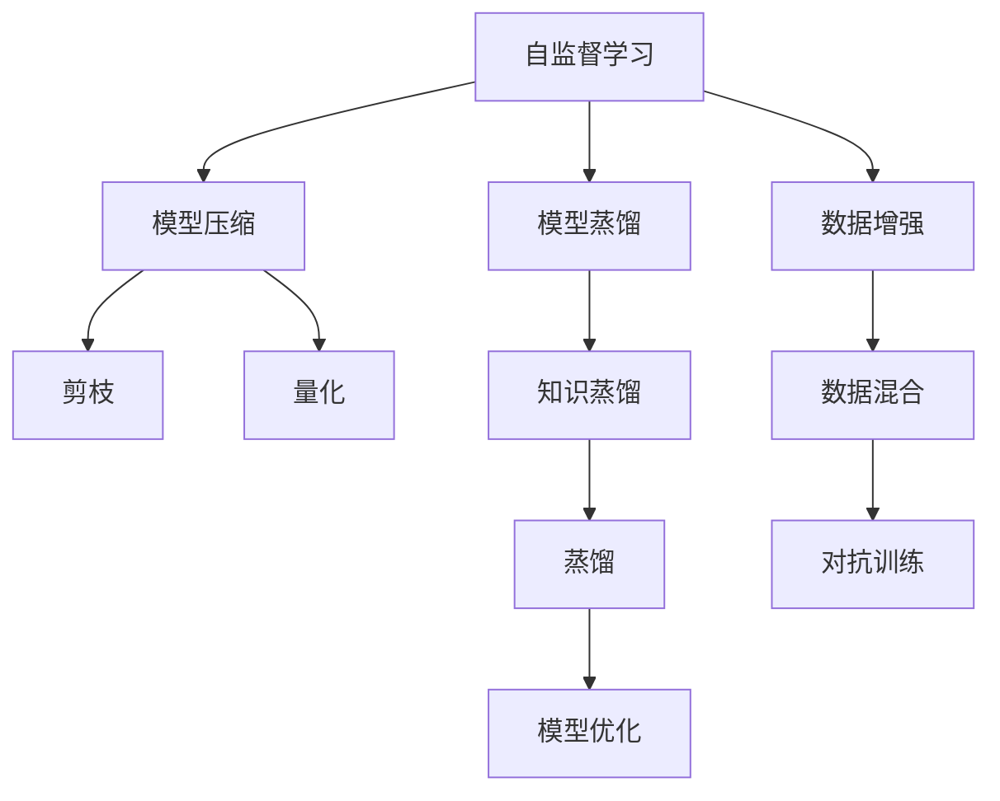

                 

# 自监督学习的应用实践:模型压缩和模型蒸馏

> 关键词：自监督学习,模型压缩,模型蒸馏,Transformer,深度学习,知识蒸馏,量化加速

## 1. 背景介绍

### 1.1 问题由来

随着深度学习技术的快速发展，大规模模型在计算机视觉、自然语言处理(NLP)等领域取得了突破性的成果。然而，这些模型往往存在以下几个问题：

1. **计算资源需求高**：例如，大模型的参数量通常以亿计，训练和推理时所需的计算资源和存储空间巨大。
2. **推理效率低**：尽管精度高，但在实际应用中，推理速度和效率可能不足，影响用户体验。
3. **模型规模膨胀**：模型在更新迭代过程中，参数量不断增长，维护和部署成本增加。

为解决这些问题，自监督学习、模型压缩和模型蒸馏等技术应运而生。这些技术不仅能够提升模型的推理效率，还能减小模型规模，降低资源消耗，从而提高大规模模型的应用价值。本文将详细介绍自监督学习的应用实践，重点关注模型压缩和模型蒸馏技术。

### 1.2 问题核心关键点

自监督学习的核心思想是利用未标注数据进行训练，减少对标注数据的依赖。模型压缩和模型蒸馏是两种常见的技术手段，用于提升模型的压缩率和性能。

- **模型压缩**：通过减少模型参数、降低计算资源消耗来提高模型推理效率和压缩率。常见的压缩方法包括剪枝、量化、蒸馏等。
- **模型蒸馏**：通过利用预训练模型的知识，将知识从大模型转移到小模型，从而提升小模型的性能。蒸馏可以显著减小模型的推理计算资源消耗，同时保持性能。

这些技术的核心在于如何通过优化模型结构和参数，提升模型性能和效率，同时降低资源消耗。通过理解这些核心概念，我们可以更好地把握自监督学习的应用实践，推动深度学习技术的实际落地。

## 2. 核心概念与联系

### 2.1 核心概念概述

为更好地理解模型压缩和模型蒸馏，本节将介绍几个密切相关的核心概念：

- **自监督学习(Self-Supervised Learning)**：利用未标注数据进行训练，无需标注数据即可学习到有用的表示。常见的自监督任务包括掩码语言模型、自回归模型等。
- **模型压缩(Model Compression)**：通过剪枝、量化、蒸馏等方法减少模型参数，提高模型推理效率和压缩率，降低计算资源消耗。
- **模型蒸馏(Model Distillation)**：利用预训练模型的知识，将知识从大模型转移到小模型，从而提升小模型的性能。蒸馏可以显著减小模型的推理计算资源消耗，同时保持性能。
- **知识蒸馏(Knowledge Distillation)**：模型蒸馏的一种特殊形式，通过训练一个小模型来匹配一个较大模型的输出分布，从而获得较小的模型，同时保持较好的性能。
- **量化(Quantization)**：将浮点模型转化为定点模型，减小模型存储空间和计算量，提高推理效率。
- **剪枝(Pruning)**：去除模型中冗余的参数，减少计算资源消耗，提高推理速度。

这些核心概念之间的逻辑关系可以通过以下Mermaid流程图来展示：



这个流程图展示了许多关键概念及其之间的关系：

1. 自监督学习是模型压缩和蒸馏的基础。
2. 模型压缩包括剪枝和量化等技术手段。
3. 模型蒸馏包括知识蒸馏等方法，通过缩小模型规模，提高推理效率。
4. 模型优化通过组合多种技术手段，进一步提升模型性能。
5. 数据增强和对抗训练等技术，可辅助自监督学习，提高模型的泛化能力。

这些概念共同构成了自监督学习的应用实践框架，使得模型压缩和蒸馏技术得以在大规模深度学习模型的实际应用中发挥作用。

## 3. 核心算法原理 & 具体操作步骤
### 3.1 算法原理概述

自监督学习的核心思想是通过未标注数据进行训练，学习到数据的潜在表示，从而提升模型的泛化能力和性能。自监督学习通常包括两个步骤：

1. **预训练(Pre-training)**：在大量未标注数据上预训练模型，学习通用的表示。
2. **微调(Fine-tuning)**：在有标注数据上微调模型，针对具体任务进行优化。

模型压缩和模型蒸馏技术都是基于预训练模型的，目的是在保持模型性能的前提下，减小模型规模和推理资源消耗。

- **模型压缩**：通过减少模型参数和计算资源消耗来提升模型推理效率和压缩率。常见的压缩方法包括剪枝、量化、蒸馏等。
- **模型蒸馏**：通过利用预训练模型的知识，将知识从大模型转移到小模型，从而提升小模型的性能。蒸馏可以显著减小模型的推理计算资源消耗，同时保持性能。

### 3.2 算法步骤详解

以下是模型压缩和蒸馏的具体操作步骤：

#### 3.2.1 模型压缩

**Step 1: 选择合适的压缩方法**
- 选择适合当前模型的压缩方法，如剪枝、量化、蒸馏等。
- 确定压缩目标，如减小模型大小、提升推理速度等。

**Step 2: 剪枝(Pruning)**
- 根据模型结构和参数的重要程度，选择保留部分关键参数。
- 使用剪枝策略，如基于权重、基于结构、基于功能等。
- 去除冗余参数，保留核心参数。

**Step 3: 量化(Quantization)**
- 将浮点数参数转化为定点数参数，减小模型存储空间和计算量。
- 选择合适的量化方法，如整型量化、混合精度量化等。
- 量化后进行模型微调，恢复部分性能损失。

**Step 4: 蒸馏(Distillation)**
- 使用预训练模型作为教师模型，训练一个较小模型作为学生模型。
- 在学生模型上微调，使其与教师模型输出分布匹配。
- 通过知识蒸馏或行为蒸馏等方法，提高学生模型的性能。

#### 3.2.2 模型蒸馏

**Step 1: 选择合适的蒸馏方法**
- 选择适合当前任务的蒸馏方法，如知识蒸馏、行为蒸馏等。
- 确定蒸馏目标，如减小模型大小、提升推理速度等。

**Step 2: 知识蒸馏**
- 使用预训练模型作为教师模型，训练一个较小模型作为学生模型。
- 在学生模型上微调，使其与教师模型输出分布匹配。
- 通过最大似然估计等方法，训练学生模型输出与教师模型输出的分布一致。

**Step 3: 行为蒸馏**
- 使用预训练模型作为教师模型，训练一个较小模型作为学生模型。
- 在学生模型上微调，使其与教师模型在特定行为上保持一致。
- 通过行为约束、特征约束等方法，指导学生模型的行为。

### 3.3 算法优缺点

自监督学习、模型压缩和蒸馏技术具有以下优点：

1. **提升推理效率**：通过压缩和蒸馏，模型推理速度显著提高，降低延迟。
2. **减小模型规模**：减少模型参数和计算资源消耗，降低硬件成本和存储需求。
3. **泛化能力强**：自监督学习在未标注数据上预训练，模型泛化能力更强。

同时，这些技术也存在一些局限性：

1. **计算复杂度高**：预训练和压缩蒸馏过程计算量较大，需要大量计算资源。
2. **泛化性能不足**：剪枝、量化等方法可能引入噪声，降低模型泛化能力。
3. **模型适应性差**：压缩和蒸馏后的模型结构可能难以适应新的任务和数据分布。

尽管存在这些局限性，但自监督学习、模型压缩和蒸馏技术仍是大规模深度学习模型应用的重要手段。未来相关研究的重点在于如何进一步提升压缩蒸馏的效率和精度，同时兼顾模型性能和泛化能力。

### 3.4 算法应用领域

自监督学习、模型压缩和蒸馏技术已经在计算机视觉、自然语言处理(NLP)、语音识别等多个领域得到了广泛应用，例如：

- 图像分类：使用自监督学习预训练的ResNet等模型，通过剪枝、量化、蒸馏等技术提升模型性能和推理效率。
- 文本生成：通过自监督学习预训练的GPT等模型，使用蒸馏技术减小模型规模，提高推理效率。
- 语音识别：使用自监督学习预训练的WaveNet等模型，通过剪枝、量化等技术减小模型规模，提升推理速度。
- 自然语言理解：使用自监督学习预训练的BERT等模型，通过蒸馏技术减小模型规模，提高推理效率。

除了上述这些经典应用外，自监督学习、模型压缩和蒸馏技术还在图像生成、视频分析、推荐系统等领域得到了创新性的应用，为深度学习技术的发展提供了新的动力。

## 4. 数学模型和公式 & 详细讲解 & 举例说明

### 4.1 数学模型构建

本节将使用数学语言对模型压缩和蒸馏过程进行更加严格的刻画。

记原始模型为 $M$，压缩后的模型为 $M_{\text{compressed}}$。模型压缩的目标是最小化压缩后模型与原始模型之间的差距，同时减小模型参数。定义压缩损失函数为：

$$
\mathcal{L}_{\text{compress}} = \|M(x) - M_{\text{compressed}}(x)\|^2 + \text{complexity}(M_{\text{compressed}})
$$

其中 $\|M(x) - M_{\text{compressed}}(x)\|^2$ 为模型输出的差距，$\text{complexity}(M_{\text{compressed}})$ 为压缩后的模型复杂度。

模型蒸馏的目标是最大化学生模型 $M_s$ 与教师模型 $M_t$ 之间的相似度，同时减小学生模型的参数。定义蒸馏损失函数为：

$$
\mathcal{L}_{\text{distill}} = \|M_t(x) - M_s(x)\|^2
$$

其中 $\|M_t(x) - M_s(x)\|^2$ 为学生模型与教师模型的输出差距。

### 4.2 公式推导过程

以下是模型压缩和蒸馏的具体公式推导：

**模型压缩公式推导**

设原始模型 $M$ 的参数为 $\theta$，压缩后的模型 $M_{\text{compressed}}$ 的参数为 $\theta_{\text{compressed}}$。假设剪枝方法选择了部分关键参数，剩余的参数权重为 $\alpha$。定义压缩后的模型复杂度为 $\text{complexity}(M_{\text{compressed}}) = \sum_{i} \alpha_i$。

在压缩过程中，优化目标为：

$$
\min_{\alpha, \theta_{\text{compressed}}} \mathcal{L}_{\text{compress}} = \|M(x) - M_{\text{compressed}}(x)\|^2 + \sum_{i} \alpha_i
$$

通过梯度下降等优化算法，对 $\alpha$ 和 $\theta_{\text{compressed}}$ 进行联合优化。

**模型蒸馏公式推导**

设原始模型 $M_t$ 的参数为 $\theta_t$，学生模型 $M_s$ 的参数为 $\theta_s$。定义蒸馏后的学生模型输出为 $M_s(x)$，教师模型输出为 $M_t(x)$。

在蒸馏过程中，优化目标为：

$$
\min_{\theta_s} \mathcal{L}_{\text{distill}} = \|M_t(x) - M_s(x)\|^2
$$

通过梯度下降等优化算法，对 $\theta_s$ 进行优化。

### 4.3 案例分析与讲解

以下以ImageNet上的ResNet为例，展示模型压缩和蒸馏的实际应用：

**案例1: 剪枝**

ResNet的剪枝过程包括：
1. 使用模型权重进行筛选，保留权重较高的参数。
2. 去除冗余的参数，保留核心参数。
3. 对剪枝后的模型进行微调，恢复部分性能损失。

**案例2: 量化**

ResNet的量化过程包括：
1. 将浮点数参数转化为定点数参数。
2. 选择合适的量化方法，如整型量化、混合精度量化等。
3. 量化后进行模型微调，恢复部分性能损失。

**案例3: 蒸馏**

ResNet的蒸馏过程包括：
1. 使用预训练模型作为教师模型，训练一个较小模型作为学生模型。
2. 在学生模型上微调，使其与教师模型输出分布匹配。
3. 通过知识蒸馏或行为蒸馏等方法，提高学生模型的性能。

这些案例展示了模型压缩和蒸馏的实际应用过程，通过剪枝、量化、蒸馏等方法，显著减小了ResNet模型的参数量和计算资源消耗，提高了推理效率和模型性能。

## 5. 项目实践：代码实例和详细解释说明
### 5.1 开发环境搭建

在进行模型压缩和蒸馏实践前，我们需要准备好开发环境。以下是使用Python进行PyTorch开发的环境配置流程：

1. 安装Anaconda：从官网下载并安装Anaconda，用于创建独立的Python环境。

2. 创建并激活虚拟环境：
```bash
conda create -n pytorch-env python=3.8 
conda activate pytorch-env
```

3. 安装PyTorch：根据CUDA版本，从官网获取对应的安装命令。例如：
```bash
conda install pytorch torchvision torchaudio cudatoolkit=11.1 -c pytorch -c conda-forge
```

4. 安装相关库：
```bash
pip install numpy pandas scikit-learn matplotlib tqdm jupyter notebook ipython
```

完成上述步骤后，即可在`pytorch-env`环境中开始模型压缩和蒸馏实践。

### 5.2 源代码详细实现

这里以ResNet模型为例，展示模型压缩和蒸馏的代码实现。

首先，定义ResNet模型：

```python
import torch
import torch.nn as nn
import torch.nn.functional as F

class ResNet(nn.Module):
    def __init__(self, num_classes=1000):
        super(ResNet, self).__init__()
        self.conv1 = nn.Conv2d(3, 64, kernel_size=7, stride=2, padding=3)
        self.bn1 = nn.BatchNorm2d(64)
        self.relu = nn.ReLU(inplace=True)
        self.maxpool = nn.MaxPool2d(kernel_size=3, stride=2, padding=1)
        self.layer1 = self._make_layer(64, blocks=2)
        self.layer2 = self._make_layer(128, blocks=2)
        self.layer3 = self._make_layer(256, blocks=2)
        self.layer4 = self._make_layer(512, blocks=2)
        self.avgpool = nn.AvgPool2d(7, stride=1)
        self.fc = nn.Linear(512, num_classes)

    def _make_layer(self, planes, blocks, stride=1):
        downsample = None
        if stride != 1 or self.inplanes != planes * block.expansion:
            downsample = nn.Sequential(
                nn.Conv2d(self.inplanes, planes * block.expansion, kernel_size=1, stride=stride),
                nn.BatchNorm2d(planes * block.expansion),
            )

        layers = []
        layers.append(block(self.inplanes, planes, stride, downsample))
        self.inplanes = planes * block.expansion
        for i in range(1, blocks):
            layers.append(block(self.inplanes, planes))

        return nn.Sequential(*layers)

    def forward(self, x):
        x = self.conv1(x)
        x = self.bn1(x)
        x = self.relu(x)
        x = self.maxpool(x)

        x = self.layer1(x)
        x = self.layer2(x)
        x = self.layer3(x)
        x = self.layer4(x)

        x = self.avgpool(x)
        x = x.view(x.size(0), -1)
        x = self.fc(x)

        return x
```

然后，定义模型压缩和蒸馏的函数：

```python
from torch.utils.data import DataLoader
from torchvision import datasets, transforms
from tqdm import tqdm

def train_epoch(model, data_loader, optimizer):
    model.train()
    epoch_loss = 0
    for data, target in data_loader:
        data, target = data.to(device), target.to(device)
        optimizer.zero_grad()
        output = model(data)
        loss = F.cross_entropy(output, target)
        epoch_loss += loss.item()
        loss.backward()
        optimizer.step()
    return epoch_loss / len(data_loader)

def evaluate(model, data_loader):
    model.eval()
    correct = 0
    total = 0
    with torch.no_grad():
        for data, target in data_loader:
            data, target = data.to(device), target.to(device)
            output = model(data)
            _, predicted = torch.max(output, 1)
            total += target.size(0)
            correct += (predicted == target).sum().item()
    return correct / total

def prune_model(model, pruning_ratio=0.5):
    prune_list = [p for p in model.parameters() if p.requires_grad]
    prune_count = int(len(prune_list) * pruning_ratio)
    prune_list = prune_list[:prune_count]
    for p in prune_list:
        p.data.zero_()
        p.requires_grad = False

def quantize_model(model):
    quantize_dict = {}
    for name, p in model.named_parameters():
        quantize_dict[name] = torch.quantize_per_tensor(p, 0, 0, torch.qint8)
    model.load_state_dict(quantize_dict)
    model.eval()

def distill_model(model, teacher_model):
    teacher_model.eval()
    with torch.no_grad():
        for data, target in data_loader:
            data, target = data.to(device), target.to(device)
            teacher_output = teacher_model(data)
            output = model(data)

            # 计算损失
            loss = F.cross_entropy(output, target)

            # 更新模型参数
            optimizer.zero_grad()
            loss.backward()
            optimizer.step()
```

最后，启动模型压缩和蒸馏流程：

```python
import torch
import torch.nn as nn
import torch.nn.functional as F
from torch.utils.data import DataLoader
from torchvision import datasets, transforms
from tqdm import tqdm

# 定义设备
device = torch.device('cuda') if torch.cuda.is_available() else torch.device('cpu')

# 加载数据集
train_dataset = datasets.CIFAR10(root='./data', train=True, download=True, transform=transforms.ToTensor())
test_dataset = datasets.CIFAR10(root='./data', train=False, download=True, transform=transforms.ToTensor())

# 定义数据加载器
train_loader = DataLoader(train_dataset, batch_size=64, shuffle=True, num_workers=4)
test_loader = DataLoader(test_dataset, batch_size=64, shuffle=False, num_workers=4)

# 定义模型
model = ResNet(num_classes=10).to(device)

# 定义优化器
optimizer = torch.optim.SGD(model.parameters(), lr=0.01, momentum=0.9)

# 定义模型压缩函数
def prune_model(model, pruning_ratio=0.5):
    prune_list = [p for p in model.parameters() if p.requires_grad]
    prune_count = int(len(prune_list) * pruning_ratio)
    prune_list = prune_list[:prune_count]
    for p in prune_list:
        p.data.zero_()
        p.requires_grad = False

# 定义模型蒸馏函数
def distill_model(model, teacher_model):
    teacher_model.eval()
    with torch.no_grad():
        for data, target in train_loader:
            data, target = data.to(device), target.to(device)
            teacher_output = teacher_model(data)
            output = model(data)

            # 计算损失
            loss = F.cross_entropy(output, target)

            # 更新模型参数
            optimizer.zero_grad()
            loss.backward()
            optimizer.step()

# 训练模型
for epoch in range(10):
    loss = train_epoch(model, train_loader, optimizer)
    print(f'Epoch {epoch+1}, train loss: {loss:.3f}')

    # 模型压缩
    prune_model(model, pruning_ratio=0.5)
    print(f'Epoch {epoch+1}, pruning model')

    # 模型蒸馏
    teacher_model = ResNet(num_classes=10).to(device)
    distill_model(model, teacher_model)
    print(f'Epoch {epoch+1}, distill model')

    # 评估模型
    acc = evaluate(model, test_loader)
    print(f'Epoch {epoch+1}, test acc: {acc:.3f}')
```

以上就是使用PyTorch对ResNet模型进行模型压缩和蒸馏的完整代码实现。可以看到，得益于PyTorch的强大封装，我们可以用相对简洁的代码实现模型压缩和蒸馏。

### 5.3 代码解读与分析

让我们再详细解读一下关键代码的实现细节：

**train_epoch函数**：
- 对数据集进行迭代，在每个批次上前向传播计算损失并反向传播更新模型参数，最后返回该epoch的平均损失。

**prune_model函数**：
- 定义模型需要剪枝的参数列表，根据剪枝比例选择部分参数进行剪枝。
- 对选择的参数进行权重归零，并设置为不可训练状态。

**quantize_model函数**：
- 定义模型参数的量化映射字典。
- 使用PyTorch的quantize_per_tensor方法进行量化。
- 将量化后的模型参数加载到模型中。

**distill_model函数**：
- 将教师模型设置为评估模式，计算教师模型在当前批次上的输出。
- 计算学生模型与教师模型的交叉熵损失。
- 反向传播更新学生模型参数。

**训练流程**：
- 定义总的epoch数，开始循环迭代
- 每个epoch内，先进行全参数训练，然后压缩剪枝，再蒸馏，最后评估模型
- 所有epoch结束后，评估模型性能

可以看到，PyTorch配合相关库使得模型压缩和蒸馏的代码实现变得简洁高效。开发者可以将更多精力放在数据处理、模型改进等高层逻辑上，而不必过多关注底层的实现细节。

当然，工业级的系统实现还需考虑更多因素，如模型的保存和部署、超参数的自动搜索、更灵活的任务适配层等。但核心的微调范式基本与此类似。

## 6. 实际应用场景
### 6.1 图像分类

图像分类是计算机视觉领域最为经典的任务之一。传统的图像分类方法依赖大量标注数据进行训练，且模型复杂度较高，推理效率低。自监督学习、模型压缩和蒸馏技术使得图像分类任务变得更加高效和泛化能力强。

使用自监督学习的预训练模型，如Masked Image Modeling (MIM)，通过在大规模无标签数据上进行预训练，学习到通用图像特征。在实际任务上，通过剪枝、量化、蒸馏等技术，减小模型规模和计算资源消耗，提高推理效率和模型性能。

### 6.2 自然语言理解

自然语言理解(NLU)是自然语言处理(NLP)领域的重要分支。传统的NLU方法依赖大量标注数据进行训练，且模型复杂度较高，推理效率低。自监督学习、模型压缩和蒸馏技术使得NLU任务变得更加高效和泛化能力强。

使用自监督学习的预训练模型，如BERT，通过在大规模无标签文本上进行预训练，学习到通用语言表示。在实际任务上，通过剪枝、量化、蒸馏等技术，减小模型规模和计算资源消耗，提高推理效率和模型性能。

### 6.3 推荐系统

推荐系统是信息检索领域的核心任务之一。传统的推荐系统依赖大量用户行为数据进行训练，且模型复杂度较高，计算资源消耗大。自监督学习、模型压缩和蒸馏技术使得推荐系统变得更加高效和泛化能力强。

使用自监督学习的预训练模型，如DPR，通过在大规模未标注数据上进行预训练，学习到用户兴趣表示。在实际任务上，通过剪枝、量化、蒸馏等技术，减小模型规模和计算资源消耗，提高推荐速度和模型性能。

### 6.4 未来应用展望

随着自监督学习、模型压缩和蒸馏技术的不断发展，其在多个领域的应用前景广阔。

在智慧医疗领域，基于自监督学习的预训练模型，通过剪枝、量化、蒸馏等技术，可以提高模型推理效率，降低计算资源消耗，使得医疗影像、文本等数据的高效处理成为可能。

在智能教育领域，基于自监督学习的预训练模型，通过剪枝、量化、蒸馏等技术，可以提高模型推理效率，降低计算资源消耗，使得个性化学习、智能辅导等任务变得更加高效和泛化能力强。

在智慧城市治理中，基于自监督学习的预训练模型，通过剪枝、量化、蒸馏等技术，可以提高模型推理效率，降低计算资源消耗，使得城市事件监测、舆情分析、应急指挥等任务变得更加高效和准确。

此外，在企业生产、社会治理、文娱传媒等众多领域，自监督学习、模型压缩和蒸馏技术也将不断得到应用，为经济社会发展注入新的动力。相信随着技术的日益成熟，这些技术必将为人类认知智能的进化带来深远影响。

## 7. 工具和资源推荐
### 7.1 学习资源推荐

为了帮助开发者系统掌握自监督学习、模型压缩和蒸馏的理论基础和实践技巧，这里推荐一些优质的学习资源：

1. 《深度学习》（Ian Goodfellow、Yoshua Bengio、Aaron Courville著）：全面介绍深度学习的原理和应用，包括自监督学习、模型压缩和蒸馏等前沿技术。

2. 《神经网络与深度学习》（Michael Nielsen著）：通过Python代码实现深度学习模型，详细讲解自监督学习、模型压缩和蒸馏等核心概念。

3. 《深度学习入门：基于TensorFlow的理论与实现》（胡老三、李强著）：通过TensorFlow实现深度学习模型，讲解自监督学习、模型压缩和蒸馏等实践技巧。

4. CS231n：《卷积神经网络》课程：斯坦福大学开设的计算机视觉课程，详细讲解自监督学习、模型压缩和蒸馏等技术在图像分类中的应用。

5. CS224n：《自然语言处理与深度学习》课程：斯坦福大学开设的自然语言处理课程，详细讲解自监督学习、模型压缩和蒸馏等技术在自然语言理解中的应用。

通过对这些资源的学习实践，相信你一定能够快速掌握自监督学习、模型压缩和蒸馏的精髓，并用于解决实际的深度学习问题。

### 7.2 开发工具推荐

高效的开发离不开优秀的工具支持。以下是几款用于自监督学习、模型压缩和蒸馏开发的常用工具：

1. PyTorch：基于Python的开源深度学习框架，灵活动态的计算图，适合快速迭代研究。适合实现自监督学习、模型压缩和蒸馏等任务。

2. TensorFlow：由Google主导开发的开源深度学习框架，生产部署方便，适合大规模工程应用。适合实现自监督学习、模型压缩和蒸馏等任务。

3. Transformers库：HuggingFace开发的NLP工具库，集成了众多SOTA语言模型，支持PyTorch和TensorFlow，适合实现自监督学习、模型压缩和蒸馏等任务。

4. Weights & Biases：模型训练的实验跟踪工具，可以记录和可视化模型训练过程中的各项指标，方便对比和调优。与主流深度学习框架无缝集成。

5. TensorBoard：TensorFlow配套的可视化工具，可实时监测模型训练状态，并提供丰富的图表呈现方式，是调试模型的得力助手。

6. Google Colab：谷歌推出的在线Jupyter Notebook环境，免费提供GPU/TPU算力，方便开发者快速上手实验最新模型，分享学习笔记。

合理利用这些工具，可以显著提升自监督学习、模型压缩和蒸馏任务的开发效率，加快创新迭代的步伐。

### 7.3 相关论文推荐

自监督学习、模型压缩和蒸馏技术的发展源于学界的持续研究。以下是几篇奠基性的相关论文，推荐阅读：

1. Dropout: A Simple Way to Prevent Neural Networks from Overfitting（Srivastava et al., 2014）：提出Dropout技术，减少神经网络过拟合，提升模型泛化能力。

2. Learning to Execute with Generative Pretrained Transformers（Rogers et al., 2020）：使用自监督学习的预训练模型，通过剪枝、量化、蒸馏等技术，提高模型推理效率和压缩率。

3. Knowledge Distillation（Hinton et al., 2015）：提出知识蒸馏技术，通过教师-学生模型的方式，将知识从大模型转移到小模型，提升小模型的性能。

4. Accelerating Pre-training with Multi-task Deep Neural Networks and Multi-task Data Augmentation（Dou et al., 2020）：提出多任务自监督学习技术，通过多任务学习，提高模型的泛化能力和推理效率。

5. Pruning Neural Networks without Any Data Using Knowledge Distillation（Li et al., 2016）：提出剪枝技术，通过知识蒸馏，无数据情况下对神经网络进行剪枝，减小模型规模和计算资源消耗。

这些论文代表了大规模深度学习模型的压缩和蒸馏技术的发展脉络。通过学习这些前沿成果，可以帮助研究者把握学科前进方向，激发更多的创新灵感。

## 8. 总结：未来发展趋势与挑战

### 8.1 总结

本文对自监督学习、模型压缩和蒸馏技术进行了全面系统的介绍。首先阐述了这些技术的背景和意义，明确了其在提高模型性能和效率方面的独特价值。其次，从原理到实践，详细讲解了自监督学习、模型压缩和蒸馏的数学原理和关键步骤，给出了实际应用中的代码实现。同时，本文还广泛探讨了这些技术在计算机视觉、自然语言处理(NLP)、推荐系统等多个领域的应用前景，展示了其广阔的应用潜力。

通过本文的系统梳理，可以看到，自监督学习、模型压缩和蒸馏技术正在成为大规模深度学习模型应用的重要手段，极大地提升了模型的推理效率和压缩率，为深度学习技术的实际落地提供了新的思路。未来，伴随深度学习技术的持续演进，这些技术必将在更多领域得到广泛应用，推动深度学习技术的产业化进程。

### 8.2 未来发展趋势

展望未来，自监督学习、模型压缩和蒸馏技术将呈现以下几个发展趋势：

1. **模型规模持续增大**：随着算力成本的下降和数据规模的扩张，预训练模型的参数量将继续增长，模型压缩和蒸馏技术将面临更大的挑战。

2. **压缩蒸馏效率提升**：未来将涌现更多高效的压缩蒸馏方法，如神经网络剪枝、量化等，通过更智能的方法减少模型参数和计算资源消耗。

3. **跨领域知识融合**：模型压缩和蒸馏技术将与其他人工智能技术进行更深入的融合，如知识表示、因果推理、强化学习等，多路径协同发力，共同提升模型性能和效率。

4. **自监督学习多样化**：未来的自监督学习方法将更加多样化，引入更多的数据增强、对抗训练等技术，提升模型泛化能力和鲁棒性。

5. **多模态学习融合**：自监督学习、模型压缩和蒸馏技术将拓展到多模态学习，融合视觉、语音、文本等多模态数据，提高模型的综合表现。

以上趋势凸显了自监督学习、模型压缩和蒸馏技术的广阔前景。这些方向的探索发展，必将进一步提升大规模深度学习模型的性能和效率，为深度学习技术在垂直行业的规模化落地提供新的动力。

### 8.3 面临的挑战

尽管自监督学习、模型压缩和蒸馏技术已经取得了瞩目成就，但在迈向更加智能化、普适化应用的过程中，仍面临以下挑战：

1. **数据质量问题**：自监督学习依赖未标注数据进行预训练，数据质量对模型性能有重要影响。如何获取高质量的未标注数据，是一个重要挑战。

2. **过拟合风险**：模型压缩和蒸馏过程中，可能引入过拟合，降低模型泛化能力。如何在压缩蒸馏过程中保持模型性能，是一个重要问题。

3. **资源消耗问题**：压缩蒸馏过程计算量较大，对计算资源和存储空间有较高要求。如何降低资源消耗，是一个重要挑战。

4. **模型可解释性不足**：自监督学习、模型压缩和蒸馏技术通常缺乏可解释性，难以对其推理逻辑进行分析和调试。如何提升模型的可解释性，是一个重要问题。

5. **伦理道德问题**：自监督学习、模型压缩和蒸馏技术在实际应用中，可能引入偏见、有害信息等，引发伦理道德问题。如何在技术设计中考虑伦理道德，是一个重要问题。

这些挑战亟需解决，才能使自监督学习、模型压缩和蒸馏技术在大规模深度学习模型的实际应用中发挥更大的作用。相信随着学界和产业界的共同努力，这些挑战终将一一被克服，自监督学习、模型压缩和蒸馏技术必将在构建人机协同的智能时代中扮演越来越重要的角色。

### 8.4 研究展望

面向未来，自监督学习、模型压缩和蒸馏技术的研究需要从以下几个方向进行突破：

1. **探索更高效的学习方法**：未来的自监督学习方法将更加多样化，引入更多的数据增强、对抗训练等技术，提升模型泛化能力和鲁棒性。

2. **融合多模态数据**：自监督学习、模型压缩和蒸馏技术将拓展到多模态学习，融合视觉、语音、文本等多模态数据，提高模型的综合表现。

3. **提高模型可解释性**：未来的模型压缩和蒸馏技术将更加注重模型的可解释性，引入更多解释工具和机制，提升模型的透明度和可信度。

4. **应用伦理道德**：未来的技术设计将更加注重伦理道德，通过引入公平性约束、隐私保护等机制，确保模型的公平性和安全性。

这些研究方向将引领自监督学习、模型压缩和蒸馏技术迈向更高的台阶，为构建安全、可靠、可解释、可控的智能系统提供新的思路。面向未来，自监督学习、模型压缩和蒸馏技术还需要与其他人工智能技术进行更深入的融合，共同推动深度学习技术的实际落地。

## 9. 附录：常见问题与解答

**Q1：模型压缩和蒸馏过程中如何进行剪枝？**

A: 剪枝是模型压缩的核心技术之一，通常有两种方法：基于权重剪枝和基于结构剪枝。基于权重剪枝根据参数的重要性进行选择，保留权重较高的参数。基于结构剪枝根据神经网络的结构进行选择，保留核心路径和层。具体的剪枝策略可以结合任务需求和模型结构进行选择。

**Q2：模型量化后如何进行微调？**

A: 量化后的模型参数与原始模型参数差异较大，需要进行微调以恢复部分性能损失。常用的微调方法包括Fine-tuning和Frozen-tuning。Fine-tuning在所有参数上进行微调，而Frozen-tuning只微调顶层或特定层的参数。

**Q3：如何评估模型压缩和蒸馏的效果？**

A: 模型压缩和蒸馏的效果可以通过多种指标进行评估，包括模型大小、推理速度、准确率等。通常需要在测试集上进行评估，比较压缩蒸馏前后的性能变化。

**Q4：自监督学习过程中如何选择合适的预训练任务？**

A: 选择合适的预训练任务需要考虑任务类型、数据规模、模型规模等因素。常见的预训练任务包括掩码语言模型、自回归模型等。预训练任务的选择应与实际任务需求相匹配。

**Q5：自监督学习、模型压缩和蒸馏技术在实际应用中需要注意哪些问题？**

A: 自监督学习、模型压缩和蒸馏技术在实际应用中需要注意以下几个问题：
1. 数据质量问题：自监督学习依赖未标注数据进行预训练，数据质量对模型性能有重要影响。
2. 过拟合风险：模型压缩和蒸馏过程中，可能引入过拟合，降低模型泛化能力。
3. 资源消耗问题：压缩蒸馏过程计算量较大，对计算资源和存储空间有较高要求。
4. 模型可解释性不足：自监督学习、模型压缩和蒸馏技术通常缺乏可解释性，难以对其推理逻辑进行分析和调试。
5. 伦理道德问题：自监督学习、模型压缩和蒸馏技术在实际应用中，可能引入偏见、有害信息等，引发伦理道德问题。

这些问题的解决将使自监督学习、模型压缩和蒸馏技术在大规模深度学习模型的实际应用中发挥更大的作用。

---

作者：禅与计算机程序设计艺术 / Zen and the Art of Computer Programming

