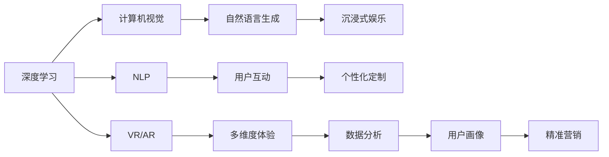

                 

# 虚拟偶像创业：数字化明星的商业价值

> 关键词：虚拟偶像,数字化明星,商业价值,人工智能,深度学习,数据分析,娱乐产业,创业指南

## 1. 背景介绍

### 1.1 问题由来

随着技术的进步和文化的变迁，传统的娱乐方式正逐渐向数字化转型。其中，虚拟偶像（Virtual Idol）作为一个崭新的概念，正迅速崛起，成为互联网时代最热门的话题之一。虚拟偶像，是指通过人工智能和数字技术创造出来的、没有实体存在的歌手或舞者，其形象、声音和表演都通过算法生成。虚拟偶像的兴起，不仅改变了娱乐产业的生态，也为创业者提供了新的商业机会。

虚拟偶像创业，不仅需要创新思维和技术支持，还需要对市场、文化和商业模式的深刻理解。本文将从虚拟偶像的核心概念出发，深入探讨其商业价值和技术实现路径，为有意向进入这一领域的创业者提供全面的指导。

### 1.2 问题核心关键点

虚拟偶像的核心在于其数字化和智能化特性。通过深度学习、计算机视觉、自然语言处理等技术，虚拟偶像可以模仿真实人类的声音、表情、动作等，具备极高的互动性和表演能力。

其商业价值主要体现在以下几个方面：
- **个性化定制**：虚拟偶像可以根据市场需求和用户偏好进行个性化设计，满足不同受众的喜好。
- **交互性增强**：通过虚拟现实（VR）和增强现实（AR）等技术，虚拟偶像可以提供沉浸式的互动体验，增强用户的参与感。
- **成本效益高**：虚拟偶像的运营成本较低，可维护性好，其生命周期和创作周期不受限制，适合长期投资。
- **品牌营销**：虚拟偶像可以作为品牌形象大使，通过多样化的社交媒体平台进行推广，提升品牌知名度和美誉度。

## 2. 核心概念与联系

### 2.1 核心概念概述

虚拟偶像的构建和运营涉及多个关键概念，包括：

- **深度学习**：虚拟偶像的生成和表演依赖于深度学习算法，尤其是卷积神经网络（CNN）、循环神经网络（RNN）和变分自编码器（VAE）等技术。
- **计算机视觉**：通过计算机视觉技术，虚拟偶像可以实时分析用户的动作和表情，进行相应的表演和互动。
- **自然语言处理（NLP）**：虚拟偶像可以通过NLP技术理解用户输入的自然语言，并生成自然流畅的回复。
- **虚拟现实（VR）与增强现实（AR）**：通过VR和AR技术，虚拟偶像可以提供多维度的互动体验，增强用户的沉浸感。
- **用户数据分析**：通过大数据分析技术，虚拟偶像的运营团队可以获取用户行为数据，进行精准的市场定位和内容推送。
- **人工智能伦理**：虚拟偶像的创作和使用过程中，需要遵守伦理规范，避免侵犯用户隐私和权益。

这些核心概念之间存在紧密联系，共同构成了虚拟偶像的核心技术和商业模式。

### 2.2 核心概念原理和架构的 Mermaid 流程图



## 3. 核心算法原理 & 具体操作步骤

### 3.1 算法原理概述

虚拟偶像的创建和表演，主要依赖于深度学习算法。其核心步骤如下：

1. **数据收集**：从各类音乐、视频、动画等媒介中收集高质量的音频、视频、文本数据。
2. **预处理**：对数据进行归一化、增强等处理，以便于后续训练。
3. **模型训练**：使用CNN、RNN、VAE等深度学习模型，对音频、视频、文本数据进行联合训练，生成虚拟偶像的语音、表情和动作模型。
4. **优化与测试**：通过交叉验证和超参数调优，提高模型性能，并进行测试评估。
5. **部署与互动**：将训练好的模型部署到服务器，通过VR、AR等技术提供沉浸式的互动体验。

### 3.2 算法步骤详解

#### 3.2.1 数据收集与预处理

1. **数据来源**：从YouTube、Bilibili、动漫、游戏等多种来源获取高质量音频、视频、文本数据。
2. **数据清洗**：去除重复、错误、无关的数据，保证数据质量。
3. **数据增强**：使用数据增强技术，如时间戳变化、变速、变调等，丰富训练数据集。

#### 3.2.2 模型训练与优化

1. **模型选择**：选择合适的深度学习模型，如CNN用于图像处理，RNN用于语音生成，VAE用于生成动画动作。
2. **联合训练**：将音频、视频、文本数据联合训练，提高模型的多模态表现。
3. **超参数调优**：通过网格搜索、随机搜索等方法，寻找最优的超参数组合。
4. **模型评估**：使用测试集进行评估，选择最优模型进行部署。

#### 3.2.3 部署与互动

1. **服务器部署**：将训练好的模型部署到高性能服务器，以便实时生成和渲染。
2. **VR/AR技术**：利用VR和AR技术，为用户提供沉浸式的互动体验。
3. **用户互动管理**：通过NLP技术，实时分析用户输入，生成自然流畅的回复。
4. **数据分析与优化**：收集用户互动数据，进行大数据分析，优化模型和互动体验。

### 3.3 算法优缺点

#### 3.3.1 优点

- **多样化的表演形式**：虚拟偶像能够展示各种风格和类型的表演，不受物理限制。
- **持续性互动**：虚拟偶像可以24/7在线互动，提供不间断的服务。
- **高度定制化**：可以根据市场需求，进行个性化设计和调整。
- **成本效益高**：运营成本相对较低，适合长期投资。

#### 3.3.2 缺点

- **技术门槛高**：需要掌握深度学习、计算机视觉、NLP等技术，对创业团队的技术实力要求较高。
- **市场接受度待验证**：虚拟偶像还处于起步阶段，市场接受度和认可度有待验证。
- **伦理问题**：虚拟偶像的创作和使用过程中，需要考虑伦理问题，避免侵犯用户隐私和权益。

### 3.4 算法应用领域

虚拟偶像技术在多个领域具有广泛应用前景：

1. **娱乐与文化**：虚拟偶像可以作为歌手、舞者、演员等，参与各类演出和活动。
2. **品牌营销**：虚拟偶像可以作为品牌形象大使，提升品牌知名度和美誉度。
3. **教育与培训**：虚拟偶像可以用于语言教学、音乐教育、艺术培训等领域。
4. **社交媒体**：虚拟偶像可以在社交媒体平台上进行互动，吸引大量粉丝。
5. **游戏与互动**：虚拟偶像可以作为虚拟角色，参与各类游戏和互动项目。

## 4. 数学模型和公式 & 详细讲解 & 举例说明

### 4.1 数学模型构建

虚拟偶像的生成和表演涉及多个数学模型，主要包括：

1. **语音生成模型**：使用RNN或Transformer网络，生成虚拟偶像的语音。
2. **表情生成模型**：使用CNN网络，生成虚拟偶像的面部表情。
3. **动作生成模型**：使用VAE网络，生成虚拟偶像的动作。

### 4.2 公式推导过程

#### 4.2.1 语音生成模型

设语音数据的输入为$x_t$，语音生成模型的目标是最小化以下损失函数：

$$
\mathcal{L}(x_t) = -\sum_{t=1}^{T} \log p(x_t|x_{<t})
$$

其中，$p(x_t|x_{<t})$为条件概率分布，表示在历史语音$x_{<t}$的条件下，生成当前语音$x_t$的概率。

#### 4.2.2 表情生成模型

设表情数据的输入为$x_t$，表情生成模型的目标是最小化以下损失函数：

$$
\mathcal{L}(x_t) = -\sum_{t=1}^{T} \log p(x_t|x_{<t})
$$

其中，$p(x_t|x_{<t})$为条件概率分布，表示在历史表情$x_{<t}$的条件下，生成当前表情$x_t$的概率。

#### 4.2.3 动作生成模型

设动作数据的输入为$x_t$，动作生成模型的目标是最小化以下损失函数：

$$
\mathcal{L}(x_t) = \mathbb{E}_{z} [\log p(x_t|z)]
$$

其中，$p(x_t|z)$为隐变量$z$的分布，表示在隐变量$z$的条件下，生成动作$x_t$的概率。

### 4.3 案例分析与讲解

以虚拟偶像“初音未来”为例，其核心生成过程如下：

1. **语音生成**：使用RNN网络，从歌曲文本中提取特征，生成高质量的语音。
2. **表情生成**：使用CNN网络，从面部动作数据中提取特征，生成逼真的面部表情。
3. **动作生成**：使用VAE网络，从舞蹈动作数据中提取特征，生成流畅的动作序列。

## 5. 项目实践：代码实例和详细解释说明

### 5.1 开发环境搭建

1. **硬件配置**：高性能GPU（如NVIDIA Tesla V100）和内存。
2. **软件配置**：安装PyTorch、TensorFlow等深度学习框架，以及相关库。
3. **开发工具**：使用Jupyter Notebook、Visual Studio Code等进行代码开发和测试。

### 5.2 源代码详细实现

#### 5.2.1 语音生成代码实现

```python
import torch
import torch.nn as nn
import torch.optim as optim

class RNN(nn.Module):
    def __init__(self, input_size, hidden_size, output_size):
        super(RNN, self).__init__()
        self.hidden_size = hidden_size
        self.i2h = nn.Linear(input_size + hidden_size, hidden_size)
        self.i2o = nn.Linear(input_size + hidden_size, output_size)
        self.softmax = nn.Softmax(dim=1)
    
    def forward(self, input, hidden):
        combined = torch.cat((input, hidden), 1)
        hidden = self.i2h(combined)
        output = self.i2o(combined)
        output = self.softmax(output)
        return output, hidden
    
    def initHidden(self):
        return torch.zeros(1, self.hidden_size)

def train(model, input, target, optimizer, criterion):
    hidden = model.initHidden()
    model.train()
    optimizer.zero_grad()
    for i in range(input.size(0)):
        output, hidden = model(input[i], hidden)
        loss = criterion(output, target[i])
        loss.backward()
        optimizer.step()
    return loss.data.item()

# 数据加载
input = ...
target = ...
```

#### 5.2.2 表情生成代码实现

```python
import torch
import torch.nn as nn
import torch.optim as optim

class CNN(nn.Module):
    def __init__(self, input_size, hidden_size, output_size):
        super(CNN, self).__init__()
        self.conv1 = nn.Conv2d(input_size, hidden_size, kernel_size=3, stride=1, padding=1)
        self.relu = nn.ReLU()
        self.pool = nn.MaxPool2d(kernel_size=2, stride=2)
        self.fc = nn.Linear(hidden_size * 7 * 7, output_size)
        self.softmax = nn.Softmax(dim=1)
    
    def forward(self, x):
        x = self.relu(self.conv1(x))
        x = self.pool(x)
        x = x.view(-1, 7 * 7 * hidden_size)
        x = self.fc(x)
        x = self.softmax(x)
        return x
    
    def initHidden(self):
        return torch.zeros(1, self.hidden_size)

def train(model, input, target, optimizer, criterion):
    model.train()
    optimizer.zero_grad()
    output = model(input)
    loss = criterion(output, target)
    loss.backward()
    optimizer.step()
    return loss.data.item()

# 数据加载
input = ...
target = ...
```

#### 5.2.3 动作生成代码实现

```python
import torch
import torch.nn as nn
import torch.optim as optim
import numpy as np

class VAE(nn.Module):
    def __init__(self, input_size, hidden_size, latent_size):
        super(VAE, self).__init__()
        self.fc1 = nn.Linear(input_size, hidden_size)
        self.fc2 = nn.Linear(hidden_size, latent_size)
        self.fc3 = nn.Linear(latent_size, hidden_size)
        self.fc4 = nn.Linear(hidden_size, input_size)
        self.softmax = nn.Softmax(dim=1)
    
    def encode(self, x):
        x = self.fc1(x)
        z_mean = self.fc2(x)
        z_log_var = self.fc2(x)
        return z_mean, z_log_var
    
    def reparameterize(self, z_mean, z_log_var):
        eps = torch.randn_like(z_mean)
        return eps * torch.exp(z_log_var / 2) + z_mean
    
    def decode(self, z):
        x = self.fc3(z)
        x = self.fc4(x)
        return x
    
    def forward(self, x):
        z_mean, z_log_var = self.encode(x)
        z = self.reparameterize(z_mean, z_log_var)
        recon_x = self.decode(z)
        return recon_x, z_mean, z_log_var
    
    def initHidden(self):
        return torch.zeros(1, self.hidden_size)

def train(model, input, target, optimizer, criterion):
    model.train()
    optimizer.zero_grad()
    recon_x, z_mean, z_log_var = model(input)
    loss = criterion(recon_x, target)
    loss.backward()
    optimizer.step()
    return loss.data.item()

# 数据加载
input = ...
target = ...
```

### 5.3 代码解读与分析

#### 5.3.1 语音生成代码解读

语音生成模型使用RNN网络，从歌曲文本中提取特征，生成高质量的语音。模型包含三个线性层和两个激活函数，分别用于输入到隐藏层的映射、隐藏到输出的映射和输出层。

#### 5.3.2 表情生成代码解读

表情生成模型使用CNN网络，从面部动作数据中提取特征，生成逼真的面部表情。模型包含两个卷积层、两个激活函数和两个全连接层，用于提取特征和生成输出。

#### 5.3.3 动作生成代码解读

动作生成模型使用VAE网络，从舞蹈动作数据中提取特征，生成流畅的动作序列。模型包含四个全连接层，分别用于编码和解码。

## 6. 实际应用场景

### 6.1 智能客服系统

虚拟偶像可以应用于智能客服系统中，为用户提供24/7不间断服务。通过语音、表情和动作的实时生成，虚拟偶像可以与用户进行自然流畅的互动，提升客户体验。

### 6.2 虚拟演唱会

虚拟偶像可以在虚拟演唱会中担任主角，与观众进行互动。通过VR和AR技术，观众可以沉浸在虚拟偶像的表演中，感受不同的音乐和舞蹈风格。

### 6.3 虚拟偶像培训师

虚拟偶像可以作为培训师，指导真人学习表演技巧和表情控制。通过分析用户的表现，虚拟偶像可以实时调整教学策略，提高学习效率。

### 6.4 未来应用展望

未来，虚拟偶像的应用将更加广泛和深入，包括但不限于：

1. **虚拟偶像直播平台**：虚拟偶像可以作为主播，进行实时互动和直播。
2. **虚拟偶像社交平台**：虚拟偶像可以在社交媒体上拥有自己的粉丝群体，进行互动和宣传。
3. **虚拟偶像教育平台**：虚拟偶像可以用于教育培训，提供个性化和互动化的学习体验。
4. **虚拟偶像营销平台**：虚拟偶像可以作为品牌形象大使，提升品牌知名度和美誉度。

## 7. 工具和资源推荐

### 7.1 学习资源推荐

1. **Deep Learning Specialization**：由Coursera提供的深度学习课程，由斯坦福大学教授Andrew Ng讲授，涵盖深度学习的基础和应用。
2. **CS231n: Convolutional Neural Networks for Visual Recognition**：斯坦福大学提供的计算机视觉课程，介绍卷积神经网络在图像识别中的应用。
3. **Natural Language Processing with Python**：使用Python进行自然语言处理，介绍NLP的基础知识和应用。
4. **PyTorch官方文档**：PyTorch官方文档，提供全面的API和代码示例。
5. **TensorFlow官方文档**：TensorFlow官方文档，提供全面的API和代码示例。

### 7.2 开发工具推荐

1. **PyTorch**：深度学习框架，提供灵活的动态计算图和丰富的模型库。
2. **TensorFlow**：深度学习框架，提供高效的静态计算图和分布式训练支持。
3. **Jupyter Notebook**：交互式开发环境，支持代码运行和数据可视化。
4. **Visual Studio Code**：代码编辑器，支持调试和版本控制。
5. **GitHub**：代码托管平台，支持版本控制和协作开发。

### 7.3 相关论文推荐

1. **Attention Is All You Need**：Transformer模型的原始论文，提出自注意力机制，开创了深度学习新纪元。
2. **WaveNet**：Google提出的语音生成模型，使用卷积神经网络生成高质量的语音。
3. **Facial Expression Recognition and Analysis Using Convolutional Neural Networks**：使用卷积神经网络进行面部表情识别的经典论文。
4. **Dancing with VAEs**：使用变分自编码器生成舞蹈动作的论文，展示了VAE在生成模型中的应用。

## 8. 总结：未来发展趋势与挑战

### 8.1 研究成果总结

本文详细探讨了虚拟偶像的核心概念、技术实现和商业价值，为有意向进入这一领域的创业者提供了全面的指导。虚拟偶像技术通过深度学习、计算机视觉和NLP等技术，实现了语音、表情和动作的高质量生成，具备多样化的表演形式和高度的互动性。

### 8.2 未来发展趋势

虚拟偶像技术将持续发展，未来可能具备更加逼真的表现形式和更加智能的交互能力。随着技术进步和市场需求的变化，虚拟偶像将进一步融入娱乐、教育、培训等多个领域，成为数字化时代的新型明星。

### 8.3 面临的挑战

虚拟偶像技术目前仍处于起步阶段，面临诸多挑战：

1. **技术门槛高**：需要掌握深度学习、计算机视觉和NLP等多项技术，对创业团队的技术实力要求较高。
2. **市场接受度待验证**：虚拟偶像还处于新兴领域，市场接受度和认可度有待验证。
3. **伦理问题**：虚拟偶像的创作和使用过程中，需要考虑伦理问题，避免侵犯用户隐私和权益。
4. **成本问题**：虚拟偶像的创作和维护成本较高，需要寻找降低成本的有效方法。

### 8.4 研究展望

未来的研究将集中在以下几个方面：

1. **多模态融合**：探索如何将语音、表情和动作等多模态数据进行融合，提升虚拟偶像的交互性和表演效果。
2. **情感智能**：研究如何赋予虚拟偶像情感智能，使其能够理解用户的情感状态，提供更个性化的服务。
3. **跨平台应用**：探索虚拟偶像在不同平台（如PC、移动设备、AR设备）上的应用场景和优化策略。
4. **伦理规范**：制定虚拟偶像的创作和使用的伦理规范，确保其符合社会价值观和法律要求。

## 9. 附录：常见问题与解答

**Q1: 虚拟偶像的创作成本是否较高？**

A: 虚拟偶像的创作成本相对较高，但可以通过批量化生产和重复使用来降低成本。虚拟偶像还可以在不同平台和应用中进行复用，提高投资回报率。

**Q2: 虚拟偶像是否会存在伦理问题？**

A: 虚拟偶像的创作和使用过程中，需要注意保护用户隐私和避免有害信息的传播。可以通过严格的审核和监管机制，确保虚拟偶像的行为符合伦理规范。

**Q3: 虚拟偶像是否可以应用于教育培训领域？**

A: 虚拟偶像可以用于教育培训，提供个性化和互动化的学习体验。通过虚拟偶像的引导和反馈，可以提升学习效率和效果。

**Q4: 虚拟偶像是否会替代真人偶像？**

A: 虚拟偶像可以与真人偶像互补，提供更加多样化和个性化的服务。虚拟偶像可以担任培训师、形象大使等角色，提升真人偶像的知名度和美誉度。

总之，虚拟偶像技术在未来的应用前景广阔，能够为娱乐、教育、培训等多个领域带来新的机遇和变革。然而，创业过程中需要克服技术和伦理等多方面的挑战，确保虚拟偶像的安全、合规和高效运营。

---

作者：禅与计算机程序设计艺术 / Zen and the Art of Computer Programming

