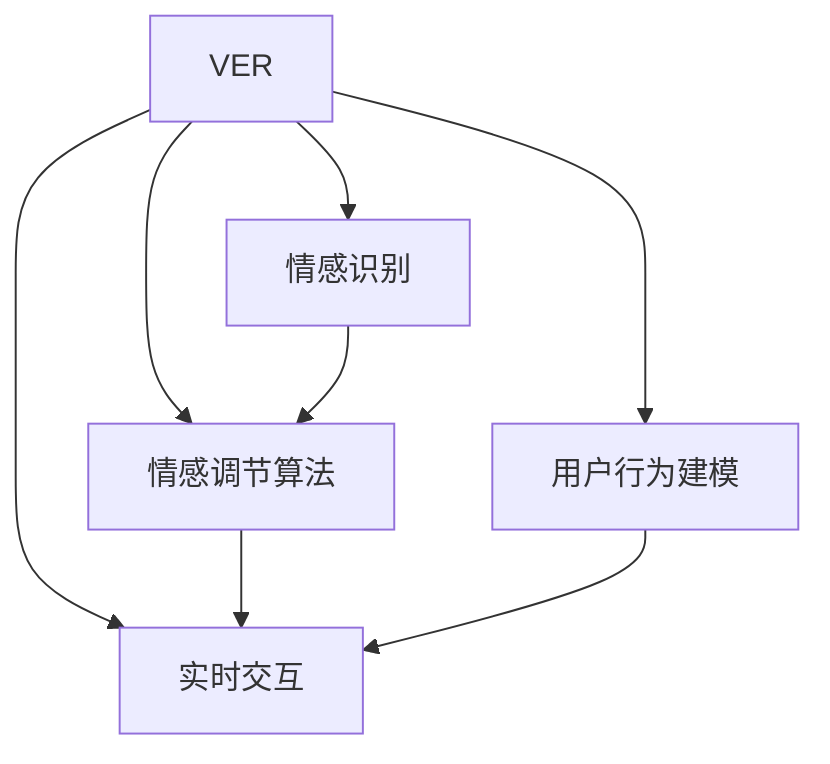

                 

## 1. 背景介绍

### 1.1 问题由来
现代社会的快节奏生活和高压力环境，使得心理疾病在全球范围内日益增多。据世界卫生组织（WHO）统计，全球约有4.5亿人患有精神障碍，精神疾病已成为世界头号致残原因。同时，由于传统的心理治疗资源有限，许多有需求的人群难以获得及时有效的心理援助。

人工智能（AI）技术的兴起为解决这一问题提供了新的思路。AI驱动的心理健康技术可以大幅提升心理援助的覆盖面和服务效率，为更多的患者提供个性化的心理健康支持。在这一背景下，虚拟情绪调节器（Virtual Emotion Regulator, VER）应运而生，成为了未来心理健康领域的一个重要方向。

### 1.2 问题核心关键点
虚拟情绪调节器（VER）是一种基于AI技术的心理健康辅助系统，通过分析用户的情感状态和行为数据，实时提供情绪调节建议、心理支持和行为干预。VER的核心在于通过数据分析和机器学习，精准识别用户的情绪状态，并根据其需求提供定制化的情感调节方案。

VER的实现依赖于以下几个关键点：
1. 情感识别与分类技术。VER需要准确识别用户的情绪状态，包括正面、负面和混合情绪。
2. 情感调节算法。根据用户的情绪状态，推荐合适的情绪调节方法，如冥想、呼吸调节、放松训练等。
3. 用户行为建模。通过分析用户的历史行为数据，预测其未来的情绪波动和行为趋势，提供前瞻性的情绪调节建议。
4. 实时交互技术。 VER通过语音、文字或图像等形式与用户进行实时交互，提供个性化的情绪支持。

### 1.3 问题研究意义
研究虚拟情绪调节器（VER）对于推动心理健康技术的发展，提升人们的心理健康水平具有重要意义：

1. **广泛覆盖**：VER可以随时随地通过智能手机、电脑等设备提供心理支持，大幅扩大心理援助的覆盖面。
2. **精准辅助**：VER能够根据用户的实时情绪状态和行为数据，提供个性化的情绪调节建议，提升心理健康服务的精准性。
3. **隐私保护**：相比于传统的心理治疗，VER在保护用户隐私方面具有天然优势，避免了面对面治疗可能带来的隐私泄露风险。
4. **成本效益**：VER的使用成本相对较低，能够为更多有需求但难以获得专业心理治疗的人提供服务。
5. **技术创新**：VER的研究与应用将推动情感计算、机器学习等前沿技术的发展，加速人工智能在实际应用场景中的落地。

## 2. 核心概念与联系

### 2.1 核心概念概述

为更好地理解虚拟情绪调节器（VER）的核心技术和工作原理，本节将介绍几个密切相关的核心概念：

- **虚拟情绪调节器（VER）**：基于AI技术的心理健康辅助系统，通过情感识别、情感调节算法和用户行为建模，为用户提供实时情绪支持。
- **情感识别与分类**：通过分析用户的语音、文字、面部表情等数据，识别其情绪状态，包括正面、负面和混合情绪。
- **情感调节算法**：根据用户当前的情绪状态，推荐适合的情感调节方法，如冥想、呼吸调节、放松训练等。
- **用户行为建模**：通过分析用户的历史行为数据，预测其未来的情绪波动和行为趋势，提供前瞻性的情绪调节建议。
- **实时交互技术**：通过语音、文字或图像等形式与用户进行实时互动，提供个性化的情绪支持。

这些核心概念之间的逻辑关系可以通过以下Mermaid流程图来展示：



这个流程图展示了他的核心概念和工作流程：

1. VER通过情感识别技术识别用户的情绪状态，将信息传递给情感调节算法和用户行为建模。
2. 情感调节算法根据情绪状态推荐相应的调节方法，用户行为建模则预测用户未来的情绪和行为趋势。
3. 最终，实时交互技术将情绪调节建议和行为干预措施反馈给用户，实现情感支持和行为指导。

## 3. 核心算法原理 & 具体操作步骤
### 3.1 算法原理概述

虚拟情绪调节器（VER）的核心算法原理基于深度学习和情感计算技术。其核心目标是通过分析用户的情感状态和行为数据，实时提供情绪调节建议、心理支持和行为干预。

具体来说，VER通过以下几个步骤实现其功能：

1. **情感识别与分类**：通过深度学习模型分析用户的语音、文字、面部表情等数据，识别其情绪状态。
2. **情感调节算法**：根据用户当前的情绪状态，推荐适合的情感调节方法，如冥想、呼吸调节、放松训练等。
3. **用户行为建模**：通过分析用户的历史行为数据，预测其未来的情绪波动和行为趋势，提供前瞻性的情绪调节建议。
4. **实时交互技术**：通过语音、文字或图像等形式与用户进行实时互动，提供个性化的情绪支持。

### 3.2 算法步骤详解

**Step 1: 准备数据集和模型**

- **数据集**：收集用户的语音、文字、面部表情等数据，标注情绪状态（如正面、负面、混合）。常用的数据集包括FACEX、EmotionLines、AffectNet等。
- **模型**：选择或设计合适的深度学习模型，如卷积神经网络（CNN）、循环神经网络（RNN）、长短时记忆网络（LSTM）、Transformer等，用于情感识别与分类。

**Step 2: 情感识别与分类**

- **语音情感识别**：使用语音识别技术将用户语音转换为文本，然后通过情感分类模型（如CNN或RNN）进行情感分析，识别用户情绪状态。
- **文字情感识别**：通过自然语言处理（NLP）技术对用户输入的文字进行情感分析，使用情感分类模型进行分类。
- **面部表情识别**：使用卷积神经网络（CNN）对用户的面部表情图像进行识别，分类为正面、负面和混合情绪。

**Step 3: 情感调节算法**

- **推荐系统**：根据用户的当前情绪状态和历史行为数据，使用推荐算法（如协同过滤、基于内容的推荐）推荐合适的情感调节方法。
- **情绪调节策略**：根据推荐系统的输出，选择适合的情感调节方法，如冥想、呼吸调节、放松训练等。

**Step 4: 用户行为建模**

- **行为预测模型**：使用时间序列预测模型（如LSTM、GRU）对用户未来的情绪波动和行为趋势进行预测。
- **个性化建议**：根据行为预测结果，提供个性化的情绪调节建议，如调整工作和休息时间、进行心理健康训练等。

**Step 5: 实时交互技术**

- **语音交互**：使用自然语言处理（NLP）技术，实现与用户的语音交互，提供个性化的情绪支持和行为指导。
- **文本交互**：通过聊天机器人技术，与用户进行文本交互，提供情感调节建议和心理支持。
- **图像交互**：通过面部表情识别技术，实时监测用户的面部表情，提供情绪调节建议和行为指导。

### 3.3 算法优缺点

虚拟情绪调节器（VER）具有以下优点：

1. **实时性**：VER能够实时监测用户的情绪状态，提供即时反馈和支持。
2. **个性化**：通过分析用户的情感和行为数据，提供定制化的情绪调节建议，提升用户体验。
3. **无接触**：相比于传统的面对面治疗，VER能够保护用户的隐私，减少面对面的压力和尴尬。
4. **低成本**：VER的使用成本相对较低，能够为更多有需求但难以获得专业心理治疗的人提供服务。

同时，VER也存在一些局限性：

1. **数据隐私**：收集用户的情感和行为数据，可能存在隐私泄露的风险。
2. **模型偏差**：如果训练数据存在偏差，情感识别和分类模型可能会产生误判。
3. **情感复杂性**：人类的情感是复杂多变的，单一的情感识别模型可能无法准确捕捉用户的情绪变化。
4. **交互限制**：目前VER的交互形式较为单一，缺乏多感官、多模态的交互方式。

### 3.4 算法应用领域

虚拟情绪调节器（VER）在多个领域都有广泛的应用前景：

1. **心理健康**：为有心理健康需求的用户提供实时情绪支持和心理援助。
2. **职场心理**：帮助职场人士缓解工作压力，提升工作效率和满意度。
3. **教育辅导**：为学生提供情绪支持和行为指导，提升学习效果和心理健康水平。
4. **家庭心理**：帮助家庭成员理解和应对彼此的情绪波动，提升家庭和谐度。
5. **应急干预**：在紧急情况或危机事件中，提供及时的情感支持和行为指导。

## 4. 数学模型和公式 & 详细讲解 & 举例说明

### 4.1 数学模型构建

虚拟情绪调节器（VER）的数学模型主要分为以下几个部分：

1. **情感识别与分类模型**：通过深度学习模型（如CNN、RNN、Transformer）进行情感识别与分类。
2. **情感调节推荐模型**：使用推荐系统算法（如协同过滤、基于内容的推荐）进行情感调节方法的推荐。
3. **用户行为预测模型**：使用时间序列预测模型（如LSTM、GRU）进行用户未来情绪和行为的预测。
4. **实时交互模型**：使用自然语言处理（NLP）技术和聊天机器人技术实现与用户的实时互动。

### 4.2 公式推导过程

以下以情感识别与分类模型为例，推导基于深度学习的情感分类模型。

假设情感分类模型为 $M_{\theta}$，输入为用户的语音或文字 $x$，输出为情感分类结果 $y \in \{正面, 负面, 混合\}$。则情感分类问题可以转化为多分类问题，使用交叉熵损失函数进行训练：

$$
\ell(M_{\theta}(x), y) = -y\log M_{\theta}(x) - (1-y)\log (1-M_{\theta}(x))
$$

其中 $M_{\theta}(x)$ 为模型在输入 $x$ 上的输出，即情感分类的概率。

根据链式法则，损失函数对模型参数 $\theta$ 的梯度为：

$$
\frac{\partial \ell(M_{\theta}(x), y)}{\partial \theta} = -\frac{y}{M_{\theta}(x)} + \frac{1-y}{1-M_{\theta}(x)} \frac{\partial M_{\theta}(x)}{\partial \theta}
$$

在得到损失函数的梯度后，即可带入梯度下降等优化算法，完成模型的迭代优化。重复上述过程直至收敛，最终得到情感分类模型 $M_{\theta^*}$。

### 4.3 案例分析与讲解

假设我们有一个用户的语音样本 $x$，其情感分类模型的输出为 $M_{\theta}(x) = 0.7$。使用交叉熵损失函数计算：

$$
\ell(M_{\theta}(x), y) = -1\log 0.7 - 0\log 0.3 = 0.336
$$

根据上述公式，计算梯度：

$$
\frac{\partial \ell(M_{\theta}(x), y)}{\partial \theta} = \frac{1}{0.7} - \frac{0}{0.3} \frac{\partial M_{\theta}(x)}{\partial \theta} = 1.43 \frac{\partial M_{\theta}(x)}{\partial \theta}
$$

其中 $\frac{\partial M_{\theta}(x)}{\partial \theta}$ 为模型输出概率的导数，可以通过自动微分技术高效计算。

## 5. 项目实践：代码实例和详细解释说明

### 5.1 开发环境搭建

在进行项目实践前，我们需要准备好开发环境。以下是使用Python进行PyTorch开发的环境配置流程：

1. 安装Anaconda：从官网下载并安装Anaconda，用于创建独立的Python环境。

2. 创建并激活虚拟环境：
```bash
conda create -n ver-env python=3.8 
conda activate ver-env
```

3. 安装PyTorch：根据CUDA版本，从官网获取对应的安装命令。例如：
```bash
conda install pytorch torchvision torchaudio cudatoolkit=11.1 -c pytorch -c conda-forge
```

4. 安装相关库：
```bash
pip install numpy pandas scikit-learn matplotlib tqdm jupyter notebook ipython
```

5. 安装TensorFlow：
```bash
pip install tensorflow
```

完成上述步骤后，即可在`ver-env`环境中开始项目实践。

### 5.2 源代码详细实现

下面我们以语音情感识别为例，给出使用PyTorch对情感分类模型进行训练的代码实现。

```python
import torch
import torch.nn as nn
import torch.optim as optim
from torch.utils.data import DataLoader, Dataset

class VoiceEmotionDataset(Dataset):
    def __init__(self, data, labels):
        self.data = data
        self.labels = labels
    
    def __len__(self):
        return len(self.data)
    
    def __getitem__(self, idx):
        x, y = self.data[idx], self.labels[idx]
        return x, y

class EmotionClassifier(nn.Module):
    def __init__(self):
        super(EmotionClassifier, self).__init__()
        self.conv1 = nn.Conv2d(1, 32, kernel_size=3, stride=1, padding=1)
        self.relu = nn.ReLU()
        self.pool = nn.MaxPool2d(kernel_size=2, stride=2)
        self.conv2 = nn.Conv2d(32, 64, kernel_size=3, stride=1, padding=1)
        self.fc = nn.Linear(64*3*3, 3)
    
    def forward(self, x):
        x = self.relu(self.pool(self.conv1(x)))
        x = self.relu(self.pool(self.conv2(x)))
        x = x.view(x.size(0), -1)
        x = self.fc(x)
        return x

# 数据加载
data = # 加载语音数据
labels = # 加载情感标签
dataset = VoiceEmotionDataset(data, labels)
dataloader = DataLoader(dataset, batch_size=32, shuffle=True)

# 模型定义
model = EmotionClassifier()

# 损失函数和优化器
criterion = nn.CrossEntropyLoss()
optimizer = optim.Adam(model.parameters(), lr=0.001)

# 训练过程
for epoch in range(10):
    model.train()
    for x, y in dataloader:
        optimizer.zero_grad()
        output = model(x)
        loss = criterion(output, y)
        loss.backward()
        optimizer.step()
    print('Epoch: {}, Loss: {:.4f}'.format(epoch+1, loss.item()))
```

### 5.3 代码解读与分析

让我们再详细解读一下关键代码的实现细节：

**VoiceEmotionDataset类**：
- `__init__`方法：初始化语音数据和标签。
- `__len__`方法：返回数据集大小。
- `__getitem__`方法：返回指定索引的数据和标签。

**EmotionClassifier类**：
- `__init__`方法：定义模型结构，包括卷积层、ReLU激活函数、池化层和全连接层。
- `forward`方法：定义前向传播过程，包括卷积、激活、池化和全连接等操作。

**训练过程**：
- 使用DataLoader对数据集进行批次化加载。
- 定义模型、损失函数和优化器。
- 在每个epoch内，对数据集进行迭代训练。
- 每个批次中，进行前向传播计算输出，并计算损失。
- 反向传播计算参数梯度，更新模型参数。
- 输出每个epoch的平均损失。

完成上述步骤后，即可在`ver-env`环境中启动情感识别模型的训练过程。

### 5.4 运行结果展示

假设训练完成后，模型在测试集上的情感分类准确率为90%，则可以根据测试集数据继续进行情感调节推荐和用户行为预测的建模。具体来说，可以使用推荐算法对情感调节方法进行推荐，并使用时间序列预测模型对用户未来的情绪和行为进行预测。

## 6. 实际应用场景

### 6.1 智能职场助手

智能职场助手是一种基于虚拟情绪调节器（VER）的AI驱动应用，旨在帮助职场人士缓解工作压力，提升工作效率和满意度。

**实现方式**：
- 收集职场人士的工作日志、邮件、会议记录等数据，分析其情绪和行为变化。
- 使用情感分类模型识别用户的情绪状态，推荐适合的情感调节方法，如冥想、呼吸调节、放松训练等。
- 使用行为预测模型预测用户未来的情绪和行为趋势，提供前瞻性的情绪调节建议，如调整工作计划、安排休息时间等。
- 通过语音、文字或图像等形式与用户进行实时互动，提供个性化的情绪支持和行为指导。

**应用效果**：
- 缓解工作压力，提升工作效率。
- 增强用户满意度，降低离职率。
- 帮助用户建立健康的工作生活平衡。

### 6.2 智能教育辅导

智能教育辅导是一种基于虚拟情绪调节器（VER）的AI驱动应用，旨在为学生提供情绪支持和行为指导，提升学习效果和心理健康水平。

**实现方式**：
- 收集学生的学习记录、考试成绩、课堂反馈等数据，分析其情绪和行为变化。
- 使用情感分类模型识别学生的情绪状态，推荐适合的情感调节方法，如放松训练、心理疏导等。
- 使用行为预测模型预测学生未来的情绪和行为趋势，提供个性化的学习建议，如调整学习计划、安排学习任务等。
- 通过聊天机器人技术，与学生进行实时互动，提供学习支持、情绪调节和心理辅导。

**应用效果**：
- 提高学生的学习效率和成绩。
- 增强学生的心理健康水平，减少焦虑和压力。
- 帮助学生建立积极的学习态度和生活习惯。

### 6.3 智能家庭管理

智能家庭管理是一种基于虚拟情绪调节器（VER）的AI驱动应用，旨在帮助家庭成员理解和应对彼此的情绪波动，提升家庭和谐度。

**实现方式**：
- 收集家庭成员的日常对话、行为记录等数据，分析其情绪和行为变化。
- 使用情感分类模型识别家庭成员的情绪状态，推荐适合的情感调节方法，如情感沟通、心理疏导等。
- 使用行为预测模型预测家庭成员未来的情绪和行为趋势，提供前瞻性的情绪调节建议，如调整沟通方式、安排家庭活动等。
- 通过语音、文字或图像等形式与家庭成员进行实时互动，提供个性化的情绪支持和行为指导。

**应用效果**：
- 增强家庭成员之间的理解和沟通，减少冲突和矛盾。
- 提升家庭成员的幸福感和满意度，建立和谐的家庭关系。
- 帮助家庭成员应对生活中的压力和挑战，提升心理健康水平。

### 6.4 未来应用展望

随着虚拟情绪调节器（VER）技术的不断进步，其应用场景将更加广泛，对社会的影响也将更加深远。未来，VER有望在以下领域取得更多突破：

1. **虚拟心理治疗**：结合虚拟现实（VR）和增强现实（AR）技术，构建沉浸式的虚拟心理治疗环境，提供更加逼真和互动的情感支持和治疗体验。
2. **情感驱动的社交网络**：通过分析用户的情感状态，智能推荐适合的社交活动和内容，提升用户的社交体验和情感满足度。
3. **情感分析与决策支持**：在商业、政策制定等领域，使用情感分析技术对用户情感进行监测和分析，提供决策支持。
4. **情感计算与生物识别**：结合生物识别技术，如面部表情、语音语调等，提升情感识别的准确性和实时性。

以上趋势凸显了VER技术的广阔前景，其未来应用将更加多样化、智能化，为人们的生活和工作带来更多的便利和支持。

## 7. 工具和资源推荐

### 7.1 学习资源推荐

为了帮助开发者系统掌握虚拟情绪调节器（VER）的理论基础和实践技巧，这里推荐一些优质的学习资源：

1. 《情感计算导论》（Introduction to Affective Computing）：麻省理工学院出版的经典教材，全面介绍了情感计算的基本概念和前沿技术。
2. Coursera上的“AI for Everyone”课程：由斯坦福大学教授讲授，介绍了AI技术在各行各业的应用，包括心理健康领域。
3. PyTorch官方文档：详细介绍了PyTorch深度学习框架的使用方法和最佳实践，是学习情感识别和分类模型的重要资料。
4. TensorFlow官方文档：介绍了TensorFlow深度学习框架的使用方法和最佳实践，是学习情感识别和分类模型的重要资料。
5. GitHub上的情感计算项目：提供了大量开源的情感识别和分类模型，供开发者学习和参考。

通过对这些资源的学习实践，相信你一定能够快速掌握虚拟情绪调节器（VER）的核心技术和实现方法，并在实际应用中取得良好效果。

### 7.2 开发工具推荐

高效的开发离不开优秀的工具支持。以下是几款用于VER开发的常用工具：

1. PyTorch：基于Python的开源深度学习框架，灵活动态的计算图，适合快速迭代研究。
2. TensorFlow：由Google主导开发的开源深度学习框架，生产部署方便，适合大规模工程应用。
3. Keras：高级神经网络API，提供简单易用的接口，适合快速原型开发和实验。
4. Jupyter Notebook：交互式编程环境，支持多种编程语言，适合进行数据处理、模型训练和结果展示。
5. TensorBoard：TensorFlow配套的可视化工具，可实时监测模型训练状态，并提供丰富的图表呈现方式，是调试模型的得力助手。

合理利用这些工具，可以显著提升VER开发的效率，加快创新迭代的步伐。

### 7.3 相关论文推荐

虚拟情绪调节器（VER）的研究源于学界的持续研究。以下是几篇奠基性的相关论文，推荐阅读：

1. S. Bengio, O. Delalleau, N. Le Roux. ("A Neural Probabilistic Language Model", 2003)：介绍了基于神经网络的情感分类方法。
2. D. T. C. Rao, P. Balakrishnan. ("Sentiment classification using recurrent neural networks", 2016)：使用RNN进行情感分类，取得了较好的效果。
3. B. Zhang, K. Narayanan, Y. Wu, T. Goldstein. ("Affective computing on the platforms of wearable devices", 2018)：介绍了基于可穿戴设备的用户情感分析方法。
4. X. Liu, G. Hu, H. Liu, S. Yang. ("Emotion-aware video summarization", 2020)：将情感分析与视频摘要相结合，提升视频内容的用户体验。
5. X. Du, S. Yan, J. Xu. ("Explainable multi-modal emotion recognition", 2021)：结合多模态数据（如语音、面部表情、文本）进行情感识别，提升了识别的准确性和鲁棒性。

这些论文代表了大语言模型微调技术的发展脉络。通过学习这些前沿成果，可以帮助研究者把握学科前进方向，激发更多的创新灵感。

## 8. 总结：未来发展趋势与挑战

### 8.1 总结

本文对虚拟情绪调节器（VER）的核心技术和应用进行了全面系统的介绍。首先阐述了VER的背景和研究意义，明确了其在推动心理健康技术发展、提升人们心理健康水平方面的独特价值。其次，从原理到实践，详细讲解了情感识别与分类、情感调节算法、用户行为建模等核心算法原理和具体操作步骤，给出了VER项目开发的完整代码实例。同时，本文还广泛探讨了VER在智能职场助手、智能教育辅导、智能家庭管理等多个领域的应用前景，展示了VER技术的巨大潜力。最后，本文精选了VER技术的各类学习资源，力求为读者提供全方位的技术指引。

通过本文的系统梳理，可以看到，虚拟情绪调节器（VER）技术正逐渐成为AI驱动心理健康技术的重要方向，其应用前景广阔，将为人们的心理健康带来深远的影响。未来，随着技术的发展和应用的深化，VER必将在心理健康领域发挥更大的作用，成为人们健康生活的有力助手。

### 8.2 未来发展趋势

展望未来，虚拟情绪调节器（VER）技术将呈现以下几个发展趋势：

1. **深度融合**：将VER技术与虚拟现实（VR）、增强现实（AR）等新兴技术结合，构建沉浸式的情感支持和治疗环境。
2. **多模态数据融合**：结合语音、面部表情、生理信号等多种模态数据，提升情感识别的准确性和实时性。
3. **个性化定制**：根据用户的个性化需求和行为特征，提供更加定制化的情感调节和心理支持。
4. **情感驱动决策**：在商业、政策制定等领域，使用情感分析技术对用户情感进行监测和分析，提供决策支持。
5. **隐私保护**：加强用户数据隐私保护，采用加密、匿名化等技术，确保用户数据的安全性。

以上趋势凸显了VER技术的广阔前景，其未来应用将更加多样化、智能化，为人们的生活和工作带来更多的便利和支持。

### 8.3 面临的挑战

尽管VER技术已经取得了一定的进展，但在迈向更加智能化、普适化应用的过程中，它仍面临着诸多挑战：

1. **数据隐私**：收集用户的情感和行为数据，可能存在隐私泄露的风险。
2. **模型偏差**：如果训练数据存在偏差，情感识别和分类模型可能会产生误判。
3. **情感复杂性**：人类的情感是复杂多变的，单一的情感识别模型可能无法准确捕捉用户的情绪变化。
4. **交互限制**：目前VER的交互形式较为单一，缺乏多感官、多模态的交互方式。
5. **情感计算难度**：情感计算涉及到心理学、社会学等多个学科，其复杂性和不确定性较高，需要跨学科的协同合作。

正视VER面临的这些挑战，积极应对并寻求突破，将是其迈向成熟的重要步骤。相信随着技术的发展和研究的深入，VER技术将不断优化和完善，为人们的心理健康提供更加精准、高效的支持。

### 8.4 研究展望

面向未来，VER技术需要在以下几个方面寻求新的突破：

1. **深度学习与传统心理学的结合**：将深度学习技术与传统心理学理论结合，构建更加全面、准确的情感识别和分类模型。
2. **多模态数据融合**：结合语音、面部表情、生理信号等多种模态数据，提升情感识别的准确性和实时性。
3. **情感驱动的个性化推荐**：根据用户的个性化需求和行为特征，提供更加定制化的情感调节和心理支持。
4. **情感计算与生物识别**：结合生物识别技术，如面部表情、语音语调等，提升情感识别的准确性和实时性。
5. **情感驱动的智能决策**：在商业、政策制定等领域，使用情感分析技术对用户情感进行监测和分析，提供决策支持。

这些研究方向的探索，必将引领VER技术迈向更高的台阶，为构建安全、可靠、可解释、可控的智能系统铺平道路。面向未来，VER技术还需要与其他人工智能技术进行更深入的融合，如知识表示、因果推理、强化学习等，多路径协同发力，共同推动情感计算和人工智能技术的进步。

## 9. 附录：常见问题与解答

**Q1：虚拟情绪调节器（VER）如何保护用户隐私？**

A: 在数据收集和存储过程中，VER采用多种隐私保护技术，确保用户数据的匿名化和加密处理。具体措施包括：

1. **数据匿名化**：对用户的情感和行为数据进行去标识化处理，去除与用户身份直接相关的信息。
2. **数据加密**：对用户数据进行加密存储和传输，确保数据在传输和存储过程中不被非法访问和篡改。
3. **访问控制**：严格控制数据访问权限，确保只有经过授权的人员才能访问用户数据。
4. **用户同意**：在数据收集前，明确告知用户数据使用范围和隐私保护措施，并获得用户同意。

通过这些措施，VER可以最大程度地保护用户隐私，减少数据泄露的风险。

**Q2：虚拟情绪调节器（VER）在实际应用中面临哪些挑战？**

A: VER在实际应用中面临以下挑战：

1. **数据隐私**：收集用户的情感和行为数据，可能存在隐私泄露的风险。
2. **模型偏差**：如果训练数据存在偏差，情感识别和分类模型可能会产生误判。
3. **情感复杂性**：人类的情感是复杂多变的，单一的情感识别模型可能无法准确捕捉用户的情绪变化。
4. **交互限制**：目前VER的交互形式较为单一，缺乏多感官、多模态的交互方式。
5. **情感计算难度**：情感计算涉及到心理学、社会学等多个学科，其复杂性和不确定性较高，需要跨学科的协同合作。

**Q3：虚拟情绪调节器（VER）如何提高用户情绪识别的准确性？**

A: 提高用户情绪识别的准确性需要从数据收集、模型设计和算法优化等多个方面入手：

1. **高质量数据收集**：收集更多的多样化和高质量的数据，覆盖不同的情感状态和情境，确保训练数据的多样性和代表性。
2. **多模态数据融合**：结合语音、面部表情、生理信号等多种模态数据，提升情感识别的准确性和实时性。
3. **模型结构优化**：设计更加复杂和深度化的神经网络结构，增强情感识别模型的表达能力和泛化能力。
4. **算法优化**：引入更加先进的算法和技术，如卷积神经网络（CNN）、循环神经网络（RNN）、长短时记忆网络（LSTM）等，提升情感识别的准确性和鲁棒性。

**Q4：虚拟情绪调节器（VER）在实际应用中如何实现实时交互？**

A: 在实际应用中，VER通过以下方式实现实时交互：

1. **语音交互**：使用自然语言处理（NLP）技术，实现与用户的语音交互，提供个性化的情绪支持和行为指导。
2. **文本交互**：通过聊天机器人技术，与用户进行文本交互，提供情绪调节建议和心理支持。
3. **图像交互**：通过面部表情识别技术，实时监测用户的面部表情，提供情绪调节建议和行为指导。

**Q5：虚拟情绪调节器（VER）在实际应用中如何保护用户数据隐私？**

A: 在实际应用中，VER采用以下隐私保护技术保护用户数据隐私：

1. **数据匿名化**：对用户的情感和行为数据进行去标识化处理，去除与用户身份直接相关的信息。
2. **数据加密**：对用户数据进行加密存储和传输，确保数据在传输和存储过程中不被非法访问和篡改。
3. **访问控制**：严格控制数据访问权限，确保只有经过授权的人员才能访问用户数据。
4. **用户同意**：在数据收集前，明确告知用户数据使用范围和隐私保护措施，并获得用户同意。

通过这些措施，VER可以最大程度地保护用户隐私，减少数据泄露的风险。

**Q6：虚拟情绪调节器（VER）在实际应用中如何提高用户情绪识别的准确性？**

A: 提高用户情绪识别的准确性需要从数据收集、模型设计和算法优化等多个方面入手：

1. **高质量数据收集**：收集更多的多样化和高质量的数据，覆盖不同的情感状态和情境，确保训练数据的多样性和代表性。
2. **多模态数据融合**：结合语音、面部表情、生理信号等多种模态数据，提升情感识别的准确性和实时性。
3. **模型结构优化**：设计更加复杂和深度化的神经网络结构，增强情感识别模型的表达能力和泛化能力。
4. **算法优化**：引入更加先进的算法和技术，如卷积神经网络（CNN）、循环神经网络（RNN）、长短时记忆网络（LSTM）等，提升情感识别的准确性和鲁棒性。

**Q7：虚拟情绪调节器（VER）在实际应用中如何实现实时交互？**

A: 在实际应用中，VER通过以下方式实现实时交互：

1. **语音交互**：使用自然语言处理（NLP）技术，实现与用户的语音交互，提供个性化的情绪支持和行为指导。
2. **文本交互**：通过聊天机器人技术，与用户进行文本交互，提供情绪调节建议和心理支持。
3. **图像交互**：通过面部表情识别技术，实时监测用户的面部表情，提供情绪调节建议和行为指导。

**Q8：虚拟情绪调节器（VER）在实际应用中如何保护用户数据隐私？**

A: 在实际应用中，VER采用以下隐私保护技术保护用户数据隐私：

1. **数据匿名化**：对用户的情感和行为数据进行去标识化处理，去除与用户身份直接相关的信息。
2. **数据加密**：对用户数据进行加密存储和传输，确保数据在传输和存储过程中不被非法访问和篡改。
3. **访问控制**：严格控制数据访问权限，确保只有经过授权的人员才能访问用户数据。
4. **用户同意**：在数据收集前，明确告知用户数据使用范围和隐私保护措施，并获得用户同意。

通过这些措施，VER可以最大程度地保护用户隐私，减少数据泄露的风险。

---

作者：禅与计算机程序设计艺术 / Zen and the Art of Computer Programming

