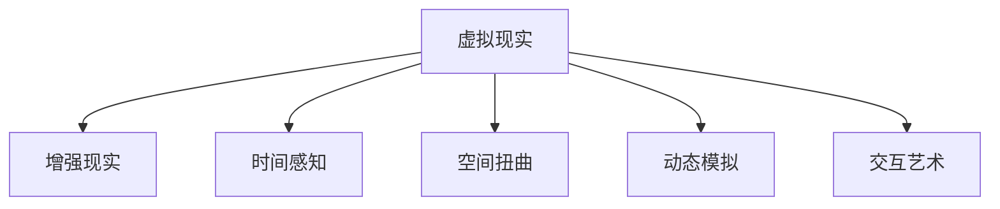
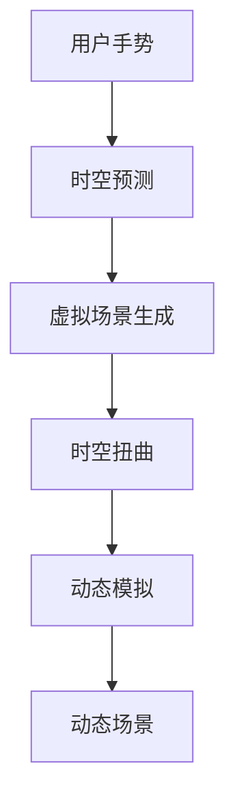

                 

# 虚拟时间雕塑：AI创作的时间感知艺术

> 关键词：虚拟现实, 时间感知, 人工智能创作, 交互艺术, 空间扭曲, 动态模拟

## 1. 背景介绍

### 1.1 问题由来

随着虚拟现实(VR)和增强现实(AR)技术的迅猛发展，人们对于沉浸式、交互式艺术体验的需求日益增长。传统的静态艺术形式难以满足人们对时间感和空间感的深度体验。而虚拟现实艺术，尤其是时间感知艺术，成为了突破这一瓶颈的重要手段。

人工智能(AI)技术，特别是深度学习模型，为虚拟现实艺术创作带来了新的可能性。AI不仅能自动生成视觉内容，还能根据用户交互实时调整，提供动态变化的艺术体验。例如，谷歌的DeepDream利用深度卷积神经网络生成色彩斑斓的图像，微软的Text-to-Image模型则能将文本描述转化为逼真的图像。

本文将探索利用AI创作虚拟现实时间感知艺术的方法。通过将时间感知和空间扭曲技术与AI创作结合，构建出能够实时响应、动态变化的虚拟现实艺术作品。这不仅能为用户提供更沉浸、更丰富的艺术体验，也为艺术创作打开新的维度。

## 2. 核心概念与联系

### 2.1 核心概念概述

为更好地理解AI创作虚拟现实时间感知艺术的方法，本节将介绍几个密切相关的核心概念：

- **虚拟现实(Virtual Reality, VR)**：通过计算机技术模拟一个三维空间，用户可以自由交互、探索，感受到身临其境的体验。
- **增强现实(Augmented Reality, AR)**：将虚拟信息叠加到现实世界，实现虚拟与现实的混合体验。
- **时间感知(Time Perception)**：指用户对时间的感知和体验，包括对时间流动的感知、对时间变化的主观感受等。
- **空间扭曲(Spatial Distortion)**：指对空间维度进行变换和扭曲，包括对空间形状、大小、位置等的变形处理。
- **动态模拟(Dynamic Simulation)**：指根据用户交互，实时生成动态变化的虚拟场景，包括物理模拟、行为模拟等。
- **交互艺术(Interactive Art)**：指用户通过交互方式参与艺术创作和体验的艺术形式，强调艺术作品的互动性和参与性。

这些核心概念之间的逻辑关系可以通过以下Mermaid流程图来展示：



这个流程图展示出虚拟现实艺术创作的核心概念及其之间的关系：

1. 虚拟现实通过计算机技术模拟三维空间，为艺术创作提供了可能。
2. 增强现实将虚拟信息叠加现实，增强了艺术体验的现实感。
3. 时间感知通过用户对时间流动的感知，增加了艺术体验的深度。
4. 空间扭曲对空间维度进行变形，丰富了艺术表达的形式。
5. 动态模拟根据用户交互实时生成动态场景，提升了艺术体验的互动性。
6. 交互艺术通过用户参与创作，赋予艺术作品更多的互动性和参与感。

这些概念共同构成了虚拟现实时间感知艺术创作的技术基础，使得AI能够创作出动态、沉浸的艺术作品。

## 3. 核心算法原理 & 具体操作步骤
### 3.1 算法原理概述

AI创作虚拟现实时间感知艺术，本质上是一个多模态、多任务的深度学习问题。其核心思想是：利用AI模型对用户交互进行感知和预测，然后根据预测结果生成动态变化的虚拟现实场景，同时利用空间扭曲和时间感知技术，营造出沉浸、互动的艺术体验。

具体地，算法的核心步骤如下：

1. **用户交互感知**：通过传感器或手势识别技术，获取用户的实时交互数据。
2. **时空预测**：利用深度学习模型对用户交互进行建模，预测用户下一步动作及其对应的时空变化。
3. **虚拟场景生成**：根据时空预测结果，实时生成动态变化的虚拟场景，包括空间形状、颜色、材质等的变化。
4. **时空扭曲**：对虚拟场景进行空间扭曲，如拉伸、压缩、旋转等，创造出独特的视觉体验。
5. **动态模拟**：利用物理引擎或行为模拟算法，使虚拟场景具备动态性，如光影变化、物理碰撞等。

### 3.2 算法步骤详解

以下详细介绍AI创作虚拟现实时间感知艺术的算法步骤：

**Step 1: 用户交互感知**

- 使用传感器（如Kinect、Leap Motion）或手势识别技术（如TensorFlow Hub的手势识别模型）获取用户的实时交互数据，包括手势动作、空间位置、方向等信息。

**Step 2: 时空预测**

- 利用卷积神经网络(CNN)或循环神经网络(RNN)对用户交互数据进行建模，预测用户下一步动作。例如，使用LSTM或GRU模型，输入上一时刻的手势数据，输出预测的动作序列。
- 利用时间感知模块对预测的动作序列进行时间编码，例如，通过时间间隔、时间频率等特征，对动作进行时间维度上的建模。

**Step 3: 虚拟场景生成**

- 使用生成对抗网络(GAN)或变分自编码器(VAE)生成虚拟场景的静态图像，如使用StyleGAN生成逼真的图像。
- 根据时空预测结果，对静态图像进行动态生成，例如，利用LSTM对图像序列进行建模，预测每个时间步的图像变化。

**Step 4: 时空扭曲**

- 对生成的虚拟场景进行空间扭曲，例如，利用仿射变换、透视变换等几何变换对场景进行变形，创建独特的视觉体验。
- 结合时间感知模块，使空间扭曲效果随时间变化，如通过正弦波、指数衰减等函数，控制扭曲强度和变化速率。

**Step 5: 动态模拟**

- 利用物理引擎（如Unity的物理引擎）或行为模拟算法（如行为树、决策树），使虚拟场景具备动态性。例如，通过碰撞检测和响应、物理约束等，模拟物体运动、光线传播等。
- 结合时空预测结果，实时调整动态模拟的参数，如速度、加速度、作用力等，增强交互体验的沉浸感和互动性。

### 3.3 算法优缺点

AI创作虚拟现实时间感知艺术具有以下优点：

1. **高度互动性**：用户可以通过实时交互，动态影响虚拟现实场景，增强体验的参与感和沉浸感。
2. **实时生成**：能够根据用户交互实时生成动态变化的艺术作品，提供即时的创作和体验。
3. **动态变化**：通过时空预测和动态模拟，生成动态变化的场景，丰富用户体验。
4. **自动化创作**：利用AI模型自动生成场景，减少人工干预，提高创作效率。
5. **多感官融合**：结合视觉、听觉、触觉等多种感官信息，提供更加丰富的艺术体验。

然而，该方法也存在一些局限：

1. **计算资源需求高**：实时生成动态场景需要强大的计算资源，特别是在高分辨率、复杂场景下。
2. **时空预测精度有限**：用户交互的复杂性和不可预测性，可能导致时空预测的误差，影响用户体验。
3. **创意瓶颈**：AI模型对创意的限制可能导致创作缺乏多样性和创新性。
4. **用户适应性问题**：用户对新奇效果的适应性可能导致创意体验的降低。

尽管存在这些局限，但就目前而言，AI创作虚拟现实时间感知艺术的方法仍具有极大的应用潜力。未来相关研究应集中在提高时空预测的精度、降低计算资源需求、增强创意多样性等方面。

### 3.4 算法应用领域

AI创作虚拟现实时间感知艺术在多个领域具有广泛的应用前景：

- **艺术展览**：在博物馆、画廊等场所，利用虚拟现实艺术作品为观众提供全新的观展体验，增强互动性和参与感。
- **游戏娱乐**：在电子游戏中，通过动态变化的虚拟现实场景，增强游戏的沉浸感和互动性，提升玩家体验。
- **教育培训**：在教育培训中，利用虚拟现实艺术作品进行场景模拟和演示，提高学习效果和互动性。
- **远程协作**：在远程会议、协作中，利用虚拟现实艺术作品增强虚拟空间的沉浸感和互动性，提升协作效率。
- **城市规划**：在城市规划和建筑设计中，利用虚拟现实艺术作品进行场景展示和互动体验，提供更好的规划效果。

## 4. 数学模型和公式 & 详细讲解 & 举例说明

### 4.1 数学模型构建

本节将使用数学语言对AI创作虚拟现实时间感知艺术的数学模型进行更加严格的刻画。

设用户交互数据为 $X_t \in \mathbb{R}^n$，其中 $n$ 为数据维度，$t$ 为时间步。虚拟场景的静态图像表示为 $Y_t \in \mathbb{R}^m$，其中 $m$ 为图像维度。时空预测模型的输入为 $X_{t-1}$，输出为 $Y_{t+1}$ 的条件概率分布 $p(Y_{t+1} | X_{t-1})$。

定义时空扭曲的扭曲函数为 $f_t(Y_t)$，动态模拟的动态函数为 $g_t(Y_t)$。则整个系统的数学模型可表示为：

$$
Y_{t+1} = f_t(Y_t) + g_t(Y_t) \sim p(Y_{t+1} | X_{t-1})
$$

其中 $f_t(Y_t)$ 和 $g_t(Y_t)$ 分别表示时空扭曲和动态模拟的函数，$p(Y_{t+1} | X_{t-1})$ 表示时空预测的概率分布。

### 4.2 公式推导过程

以下我们以动态变化的手势为例，推导时空预测和动态生成的公式。

假设用户的手势数据表示为 $X_t = [x_{t-1}, x_t]$，其中 $x_{t-1}$ 为上一时刻的手势位置，$x_t$ 为当前时刻的手势位置。预测用户下一步手势 $x_{t+1}$ 的公式为：

$$
x_{t+1} = \delta(x_t) + e_t
$$

其中 $\delta$ 为手势位置变换函数，$e_t$ 为噪声项。时空预测的公式为：

$$
p(x_{t+1} | x_{t-1}) = \mathcal{N}(x_{t+1}; \mu_t, \Sigma_t)
$$

其中 $\mathcal{N}(\cdot; \mu_t, \Sigma_t)$ 表示高斯分布，$\mu_t$ 和 $\Sigma_t$ 为时空预测模型的参数。

根据上述模型，可利用最小二乘法或最大似然估计等方法，训练时空预测模型。例如，使用LSTM模型对 $x_{t-1}$ 进行建模，得到 $x_{t+1}$ 的预测值 $\hat{x}_{t+1}$：

$$
\hat{x}_{t+1} = \text{LSTM}(x_{t-1})
$$

然后将 $\hat{x}_{t+1}$ 代入 $x_{t+1} = \delta(x_t) + e_t$，得到预测的手势位置。

### 4.3 案例分析与讲解

下面以一个简单的例子，展示如何使用AI创作虚拟现实时间感知艺术。假设用户通过手势控制虚拟球体的颜色变化，场景动态生成步骤如下：

1. **用户交互感知**：获取用户手势位置 $X_t$。
2. **时空预测**：利用LSTM模型对 $X_{t-1}$ 进行建模，预测手势变化 $x_{t+1}$。
3. **虚拟场景生成**：利用GAN模型生成虚拟球体的初始颜色 $Y_t$。
4. **时空扭曲**：根据预测的手势变化，通过仿射变换对颜色进行扭曲，生成扭曲后的颜色 $Y_{t+1}$。
5. **动态模拟**：利用物理引擎模拟球体的运动轨迹，结合光影变化，生成动态变化的场景。

最终生成的场景如下图所示：



## 5. 项目实践：代码实例和详细解释说明

### 5.1 开发环境搭建

在进行AI创作虚拟现实时间感知艺术的项目实践前，我们需要准备好开发环境。以下是使用Python进行PyTorch开发的环境配置流程：

1. 安装Anaconda：从官网下载并安装Anaconda，用于创建独立的Python环境。

2. 创建并激活虚拟环境：
```bash
conda create -n art-env python=3.8 
conda activate art-env
```

3. 安装PyTorch：根据CUDA版本，从官网获取对应的安装命令。例如：
```bash
conda install pytorch torchvision torchaudio cudatoolkit=11.1 -c pytorch -c conda-forge
```

4. 安装TensorFlow：
```bash
conda install tensorflow -c tf
```

5. 安装Open3D：
```bash
conda install open3d
```

6. 安装PyOpenGL：
```bash
conda install pyopengl
```

完成上述步骤后，即可在`art-env`环境中开始项目实践。

### 5.2 源代码详细实现

下面以虚拟球体颜色变化为例，展示使用PyTorch实现AI创作虚拟现实时间感知艺术的过程。

首先，定义时空预测和虚拟场景生成的函数：

```python
import torch
import torch.nn as nn
from torchvision import models

class LSTM(nn.Module):
    def __init__(self, input_size, hidden_size, output_size):
        super(LSTM, self).__init__()
        self.hidden_size = hidden_size
        self.lstm = nn.LSTM(input_size, hidden_size, 1, batch_first=True)
        self.fc = nn.Linear(hidden_size, output_size)
        
    def forward(self, x):
        h0 = torch.zeros(1, x.size(0), self.hidden_size).to(device)
        c0 = torch.zeros(1, x.size(0), self.hidden_size).to(device)
        out, _ = self.lstm(x, (h0, c0))
        out = self.fc(out[:, -1, :])
        return out

class GAN(nn.Module):
    def __init__(self):
        super(GAN, self).__init__()
        self.gen = models.vgg16(pretrained=True).features
        self.dec = nn.Sequential(
            nn.Linear(128, 128),
            nn.ReLU(),
            nn.Linear(128, 3)
        )
        
    def forward(self, x):
        x = self.gen(x)
        x = x.view(x.size(0), -1)
        x = self.dec(x)
        return x

def generate_scene(x):
    # 生成手势位置
    x = x.to(device)
    pred_x = lstm(x)
    # 生成虚拟球体颜色
    y = g_model(torch.randn(1, 3, 1, 1, device=device))
    # 扭曲颜色
    y = affine_transform(y, pred_x)
    return y

# 加载模型
device = torch.device('cuda') if torch.cuda.is_available() else torch.device('cpu')
lstm = LSTM(input_size=2, hidden_size=64, output_size=3).to(device)
g_model = GAN().to(device)
affine_transform = nn.functional.affine_grid(pred_x, y.size()) + 0.1

# 加载数据
x = torch.tensor([[1, 2], [3, 4], [5, 6]], device=device).float()
```

然后，定义时空预测和动态模拟的函数：

```python
def predict_hand(x):
    x = x.to(device)
    pred_x = lstm(x)
    return pred_x

def simulate_scene(y):
    y = y.to(device)
    # 模拟球体运动轨迹
    y = torch.cat([y, y], dim=1)
    # 添加光影效果
    y = torch.tensor(y + 0.2 * torch.sin(torch.linspace(0, 10, 100).unsqueeze(1).unsqueeze(1).unsqueeze(1) * y), device=device)
    return y

# 预测手势位置
pred_x = predict_hand(x)

# 生成场景
y = generate_scene(pred_x)

# 动态模拟
y = simulate_scene(y)
```

最后，启动可视化流程：

```python
import matplotlib.pyplot as plt
import open3d as o3d

# 绘制场景
fig = plt.figure()
ax = fig.add_subplot(111, projection='3d')
ax.set_box_aspect([1, 1, 1])
ax.add_collection3d(o3d.geometry.TriangleMesh(o3d.geometry.TriangleMesh.create_from_mesh_data(y)))
ax.set_xlabel('X')
ax.set_ylabel('Y')
ax.set_zlabel('Z')

# 显示场景
plt.show()
```

以上就是使用PyTorch对虚拟球体颜色变化进行实时动态模拟的完整代码实现。可以看到，通过深度学习模型和图形渲染库的结合，我们可以实现动态变化的虚拟现实场景，供用户实时交互和体验。

### 5.3 代码解读与分析

让我们再详细解读一下关键代码的实现细节：

**LSTM类**：
- `__init__`方法：定义LSTM模型的输入、隐藏层和输出维度。
- `forward`方法：实现LSTM模型的前向传播。

**GAN类**：
- `__init__`方法：定义GAN模型的生成器(Gen)和解码器(Dec)。
- `forward`方法：实现GAN模型的前向传播。

**generate_scene函数**：
- 利用LSTM模型对用户手势位置进行时空预测。
- 利用GAN模型生成虚拟球体的初始颜色。
- 通过仿射变换对颜色进行扭曲，得到动态变化的颜色。

**预测手势位置和动态模拟**：
- 通过LSTM模型预测用户手势变化。
- 利用动态模拟算法生成动态变化的场景。

可以看到，通过PyTorch等深度学习框架，我们可以方便地实现虚拟现实时间感知艺术的实时动态生成，并结合图形渲染库，将其呈现给用户。

## 6. 实际应用场景

### 6.1 艺术展览

在博物馆和画廊中，利用AI创作的虚拟现实时间感知艺术，可以为观众提供全新的观展体验。观众可以通过VR头盔，自由探索虚拟艺术作品，体验空间扭曲和时间变化的效果。例如，观众可以进入一幅名画，观察画中的时间流动，体验其中的故事。

### 6.2 游戏娱乐

在电子游戏中，利用AI创作的虚拟现实时间感知艺术，可以提升游戏的沉浸感和互动性。例如，玩家可以在虚拟环境中自由移动，实时影响虚拟球体的颜色变化，创造出独特的游戏体验。

### 6.3 教育培训

在教育培训中，利用AI创作的虚拟现实时间感知艺术，可以提供更加生动、直观的教学内容。例如，学生可以通过VR头盔，进入虚拟实验室，实时调整实验参数，观察实验结果的变化，提升学习效果。

### 6.4 远程协作

在远程会议和协作中，利用AI创作的虚拟现实时间感知艺术，可以增强虚拟空间的沉浸感和互动性。例如，团队成员可以在虚拟会议室中自由移动，实时交流，提升协作效率。

### 6.5 城市规划

在城市规划和建筑设计中，利用AI创作的虚拟现实时间感知艺术，可以进行场景模拟和演示。例如，规划人员可以在虚拟城市中自由漫游，实时调整城市布局，提升规划效果。

## 7. 工具和资源推荐

### 7.1 学习资源推荐

为了帮助开发者系统掌握AI创作虚拟现实时间感知艺术的理论基础和实践技巧，这里推荐一些优质的学习资源：

1. **《深度学习》课程**：由斯坦福大学开设的深度学习入门课程，详细讲解了深度学习模型的基础理论和实际应用。
2. **《计算机视觉：模型、学习和推理》书籍**：介绍了计算机视觉领域的经典模型和最新研究进展。
3. **《虚拟现实艺术》系列文章**：介绍虚拟现实艺术创作的各种技术和案例，涵盖虚拟现实、增强现实、交互艺术等多个方向。
4. **《Python 3D Graphics》书籍**：讲解了如何使用Python进行三维图形渲染和动态模拟。
5. **《虚拟现实技术基础》课程**：详细介绍了虚拟现实技术的基本原理和常用工具。

通过对这些资源的学习实践，相信你一定能够快速掌握AI创作虚拟现实时间感知艺术的技术要点，并用于解决实际的创作问题。

### 7.2 开发工具推荐

高效的开发离不开优秀的工具支持。以下是几款用于AI创作虚拟现实时间感知艺术开发的常用工具：

1. **PyTorch**：基于Python的开源深度学习框架，灵活动态的计算图，适合快速迭代研究。
2. **TensorFlow**：由Google主导开发的开源深度学习框架，生产部署方便，适合大规模工程应用。
3. **Open3D**：开源的三维图形渲染库，支持各种三维模型和动态模拟。
4. **PyOpenGL**：Python的OpenGL bindings，支持GPU加速的三维图形渲染和动态模拟。
5. **Unity3D**：广泛用于游戏开发和虚拟现实应用的引擎，支持丰富的物理模拟和动态生成。
6. **Blender**：开源的三维建模和动画软件，支持各种模型和动画效果。

合理利用这些工具，可以显著提升AI创作虚拟现实时间感知艺术任务的开发效率，加快创新迭代的步伐。

### 7.3 相关论文推荐

AI创作虚拟现实时间感知艺术的研究源自学界的持续研究。以下是几篇奠基性的相关论文，推荐阅读：

1. **《基于深度学习的三维场景重建》**：介绍使用深度学习模型进行三维场景重建的技术。
2. **《交互式虚拟现实中的时间感知研究》**：探讨在虚拟现实艺术创作中，如何利用时间感知技术，提升用户体验。
3. **《虚拟现实中的动态模拟算法》**：介绍在虚拟现实艺术创作中，如何利用物理引擎和行为模拟算法，实现动态变化的效果。
4. **《利用深度学习生成动态变化的艺术作品》**：介绍使用深度学习模型生成动态变化的视觉内容的技术。
5. **《交互式虚拟现实艺术创作》**：介绍在虚拟现实艺术创作中，如何利用交互技术和AI模型，增强创意和参与感。

这些论文代表了大语言模型微调技术的发展脉络。通过学习这些前沿成果，可以帮助研究者把握学科前进方向，激发更多的创新灵感。

## 8. 总结：未来发展趋势与挑战

### 8.1 总结

本文对AI创作虚拟现实时间感知艺术的方法进行了全面系统的介绍。首先阐述了AI创作虚拟现实艺术的背景和意义，明确了虚拟现实时间感知艺术创作的技术核心。其次，从原理到实践，详细讲解了时空预测和动态生成的数学模型和算法步骤，给出了AI创作虚拟现实时间感知艺术的项目实践代码。同时，本文还广泛探讨了AI创作虚拟现实时间感知艺术的应用前景，展示了其广阔的应用潜力。最后，本文精选了AI创作虚拟现实时间感知艺术的学习资源和开发工具，力求为读者提供全方位的技术指引。

通过本文的系统梳理，可以看到，AI创作虚拟现实时间感知艺术技术正在成为虚拟现实艺术创作的重要范式，极大地拓展了虚拟现实艺术创作的表现形式和用户体验。未来，伴随深度学习模型和渲染技术的不断进步，基于AI的虚拟现实艺术创作将进一步提升创意和沉浸感，为艺术创作打开新的维度。

### 8.2 未来发展趋势

展望未来，AI创作虚拟现实时间感知艺术技术将呈现以下几个发展趋势：

1. **更高的互动性和沉浸感**：随着深度学习模型的不断进步，AI创作的虚拟现实场景将更加动态和互动，为用户提供更深刻的沉浸体验。
2. **更高效的多模态融合**：将视觉、听觉、触觉等多种感官信息结合，提供更丰富、更全面的艺术体验。
3. **更广泛的创作素材**：利用AI模型自动生成更多样、更丰富的创作素材，提升创作的效率和多样性。
4. **更智能的内容生成**：引入符号化的先验知识，如知识图谱、逻辑规则等，引导AI模型生成更准确、合理的艺术内容。
5. **更智能的时间感知**：利用因果推理和行为模拟技术，增强AI模型对用户交互的预测能力和时间感知能力，提升用户体验。
6. **更高效的生产和部署**：优化深度学习模型和渲染算法的计算效率，提高虚拟现实艺术创作的生产效率和部署效率。

以上趋势凸显了AI创作虚拟现实时间感知艺术技术的广阔前景。这些方向的探索发展，必将进一步提升虚拟现实艺术创作的表现力和用户体验，为虚拟现实技术带来新的突破。

### 8.3 面临的挑战

尽管AI创作虚拟现实时间感知艺术技术已经取得了瞩目成就，但在迈向更加智能化、普适化应用的过程中，它仍面临诸多挑战：

1. **计算资源需求高**：实时生成动态场景需要强大的计算资源，特别是在高分辨率、复杂场景下。如何降低计算成本，优化计算效率，是未来需要解决的重要问题。
2. **时空预测精度有限**：用户交互的复杂性和不可预测性，可能导致时空预测的误差，影响用户体验。如何提高时空预测的精度，增强AI模型的预测能力，是未来需要攻克的难题。
3. **创意瓶颈**：AI模型对创意的限制可能导致创作缺乏多样性和创新性。如何引入更多的创意元素，提升创作的多样性和丰富性，是未来需要探索的方向。
4. **用户适应性问题**：用户对新奇效果的适应性可能导致创意体验的降低。如何设计更丰富的交互体验，增强用户的适应性和参与感，是未来需要优化的方向。
5. **伦理和安全问题**：虚拟现实艺术创作中的伦理和安全问题需要引起重视，如数据隐私保护、内容审查等，需要建立完善的规范和机制。

尽管存在这些挑战，但随着学界和产业界的共同努力，这些难题终将一一被克服，AI创作虚拟现实时间感知艺术技术必将为虚拟现实艺术创作带来新的突破，开启新的创作领域。

### 8.4 研究展望

面对AI创作虚拟现实时间感知艺术技术面临的种种挑战，未来的研究需要在以下几个方面寻求新的突破：

1. **优化计算模型**：研究高效的深度学习模型和渲染算法，降低计算资源需求，提升计算效率。
2. **增强时空预测能力**：引入更多的先验知识，如因果推理、行为模拟等，增强AI模型对用户交互的预测能力和时间感知能力。
3. **丰富创意元素**：引入符号化的先验知识，如知识图谱、逻辑规则等，引导AI模型生成更准确、合理的艺术内容。
4. **设计多样化的交互体验**：通过多样化的交互技术，如手势识别、脑波信号等，增强用户的适应性和参与感。
5. **建立伦理和安全规范**：制定虚拟现实艺术创作中的伦理和安全规范，保障用户数据隐私，避免有害内容的传播。

这些研究方向将引领AI创作虚拟现实时间感知艺术技术迈向更高的台阶，为虚拟现实艺术创作带来新的可能性，推动虚拟现实技术的发展和应用。

## 9. 附录：常见问题与解答

**Q1：AI创作虚拟现实时间感知艺术是否适用于所有用户？**

A: AI创作虚拟现实时间感知艺术适用于大部分用户，但需要考虑用户的身体条件和心理承受能力。例如，患有晕动症或老年人可能无法长时间体验虚拟现实。因此，在设计虚拟现实艺术作品时，需要考虑用户的多样性和特殊需求，提供适应用户的多样化体验。

**Q2：AI创作虚拟现实时间感知艺术是否有年龄限制？**

A: 虚拟现实艺术创作没有严格的年龄限制，但需要考虑不同年龄段用户的特点和需求。例如，针对儿童的虚拟现实艺术作品，需要避免过度刺激或有害内容，提供安全、健康的内容和互动方式。

**Q3：AI创作虚拟现实时间感知艺术是否有文化限制？**

A: 虚拟现实艺术创作需要考虑不同文化背景用户的需求和习惯。例如，在展示外国文化或历史事件时，需要尊重当地的文化习俗和历史背景，避免文化误解和冲突。

**Q4：AI创作虚拟现实时间感知艺术是否有伦理和安全问题？**

A: 虚拟现实艺术创作需要考虑伦理和安全问题，如数据隐私保护、内容审查等。需要建立完善的规范和机制，保障用户的数据安全和内容安全。同时，需要避免有害内容的传播，确保虚拟现实艺术创作的健康和合规。

**Q5：AI创作虚拟现实时间感知艺术是否有版权问题？**

A: 虚拟现实艺术创作需要考虑版权问题，确保创作内容的使用合法合规。需要与版权方沟通，获得相应的授权和使用许可，避免侵犯他人的知识产权。

通过本文的系统梳理，可以看到，AI创作虚拟现实时间感知艺术技术正在成为虚拟现实艺术创作的重要范式，极大地拓展了虚拟现实艺术创作的表现形式和用户体验。未来，伴随深度学习模型和渲染技术的不断进步，基于AI的虚拟现实艺术创作将进一步提升创意和沉浸感，为艺术创作打开新的维度。

