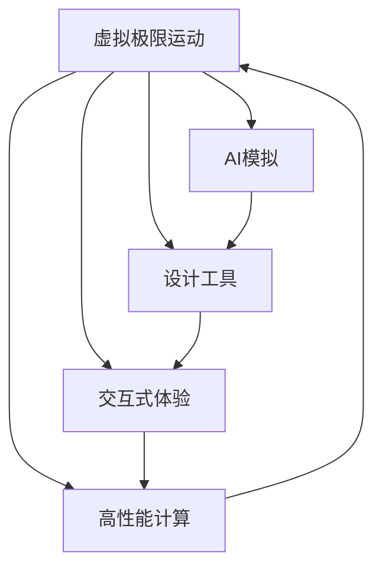

                 

# 虚拟极限运动设计师：AI模拟的极限体验创造者

> 关键词：虚拟极限运动，AI模拟，设计工具，交互式体验，高性能计算

## 1. 背景介绍

随着人工智能（AI）技术的飞速发展，虚拟现实（VR）、增强现实（AR）和游戏行业等领域对AI技术的需求日益增长。AI被用来模拟真实世界的环境，提供逼真的感官体验。其中，AI模拟极限运动体验（如跳伞、赛车、滑翔伞等）的应用更是吸引了不少游戏和体验设计者的注意。

### 1.1 问题由来
极限运动体验一直是VR和游戏行业中的热门主题。在过去，这类体验的设计和模拟往往需要耗费大量的人力和物力，且效果受限于当时的技术水平。AI技术的引入，为极限运动体验的模拟提供了全新的可能。AI不仅能够模拟真实世界中的复杂物理环境，还能根据用户的操作和反馈，生成个性化的体验。

### 1.2 问题核心关键点
AI在极限运动体验模拟中的关键点在于以下几点：
1. **环境模拟**：AI能根据极限运动的特点，精确模拟其物理特性，如空气动力学、地形变化等。
2. **交互设计**：AI能够根据用户的输入，动态调整场景和行为，提供个性化的体验。
3. **高性能计算**：极限运动场景的复杂性要求高性能计算能力，以确保流畅和逼真的体验。
4. **学习与优化**：AI通过学习和优化，不断提高模拟的精度和体验的沉浸感。

## 2. 核心概念与联系

### 2.1 核心概念概述

为更好地理解AI在极限运动体验模拟中的应用，本节将介绍几个关键概念：

- **虚拟极限运动（Virtual Extreme Sports）**：指通过计算机技术模拟真实极限运动场景，为用户提供身临其境的体验。
- **AI模拟（AI Simulation）**：指使用AI技术模拟真实世界中的物理和行为特性，以创造逼真的体验环境。
- **设计工具（Design Tools）**：指提供交互式界面和设计流程的软件，帮助用户快速创建极限运动场景。
- **交互式体验（Interactive Experience）**：指用户可以通过各种输入设备（如手柄、头显、动作捕捉系统等）与模拟环境进行实时互动。
- **高性能计算（High-Performance Computing, HPC）**：指使用高性能计算机和优化算法，以支持大规模、高精度的模拟计算。

这些概念之间的逻辑关系可以通过以下Mermaid流程图来展示：



这个流程图展示了几大核心概念及其之间的关系：

1. **虚拟极限运动** 通过**AI模拟**生成逼真的环境，同时使用**设计工具**创造内容，通过**交互式体验**提供与环境的互动，最终依赖**高性能计算**支持模拟的运行。

## 3. 核心算法原理 & 具体操作步骤
### 3.1 算法原理概述

AI模拟极限运动的核心算法原理可以概括为以下几点：

1. **环境建模**：利用物理引擎和几何模型，对极限运动场景进行建模。
2. **动态物理模拟**：使用流体动力学、碰撞检测等技术，实时更新场景中的物理状态。
3. **交互响应**：根据用户的输入，动态调整场景和行为，提供互动反馈。
4. **学习和优化**：通过机器学习算法，不断优化模型的参数和行为，提高模拟的准确性和沉浸感。

### 3.2 算法步骤详解

下面详细介绍AI模拟极限运动的具体操作步骤：

**Step 1: 环境建模**
- 使用3D建模软件创建极限运动场景，生成高精度的几何模型。
- 利用物理引擎（如Unreal Engine、Unity等）对场景进行物理建模，包括地形、环境、障碍物等。

**Step 2: 动态物理模拟**
- 使用流体动力学算法（如Navier-Stokes方程）模拟空气动力学，实时更新场景中的气体流动。
- 利用碰撞检测技术（如OBB、AABB等）计算物体间的碰撞，确保物理互动的真实性。

**Step 3: 交互响应**
- 收集用户输入（如手柄、头显、动作捕捉数据），实时更新场景和物体状态。
- 根据用户的行为，动态生成互动反馈，如声音效果、视觉变化等。

**Step 4: 学习和优化**
- 利用强化学习算法（如Q-learning、DQN等），通过用户的行为数据进行模型训练和优化。
- 引入迁移学习技术，将模型在其他场景中的学习经验迁移到极限运动场景中。

### 3.3 算法优缺点

AI模拟极限运动体验的算法具有以下优点：
1. **高度逼真**：通过复杂的物理和行为模拟，能够提供极其真实的体验。
2. **个性化定制**：可以根据用户的输入和反馈，动态调整场景和行为，提供个性化的体验。
3. **高效学习**：通过机器学习算法不断优化模型，提高模拟精度和性能。

同时，该算法也存在一些局限性：
1. **计算复杂度高**：极限运动场景的复杂性要求高性能计算能力，资源消耗较大。
2. **数据需求高**：高质量的模拟需要大量的训练数据，数据收集和标注成本较高。
3. **精度有限**：尽管算法不断优化，但物理模拟的精度仍受限于数学模型的复杂度和准确度。
4. **环境变化敏感**：模拟环境的复杂性较高，对环境参数的变化敏感，难以处理极端情况。

### 3.4 算法应用领域

AI模拟极限运动体验的应用领域广泛，涵盖了以下几个方面：

- **游戏开发**：如《极限竞速》（《Need for Speed》）、《高空跳伞》（《Skydiving》）等游戏，使用AI模拟提供逼真的极限运动体验。
- **虚拟现实培训**：利用AI模拟极限运动场景，帮助运动员进行模拟训练，提高技能水平。
- **极限运动娱乐**：如VR跳伞、高空滑翔等体验项目，提供虚拟极限运动的沉浸式体验。
- **教育应用**：通过AI模拟极限运动场景，用于科普教育，帮助学生理解物理原理和极限运动的危险性。

## 4. 数学模型和公式 & 详细讲解 & 举例说明
### 4.1 数学模型构建

在本节中，我们将通过数学模型来详细讲解AI模拟极限运动体验的核心算法原理。

**环境建模**
- **几何建模**：使用三维几何模型表示场景中的物体，可以表示为点、线、面的集合。
- **物理建模**：利用物理引擎中的动力学模型，描述物体的运动和相互作用，如牛顿第二定律、碰撞方程等。

**动态物理模拟**
- **流体动力学**：使用Navier-Stokes方程描述气体的流动，通过求解该方程，实时更新气体的速度和压力。
- **碰撞检测**：使用OBB、AABB等算法检测物体间的碰撞，计算碰撞后的物态变化。

**交互响应**
- **用户输入处理**：将用户的输入数据（如手柄位移、头显角度等）转换为模拟环境中的状态变化。
- **互动反馈生成**：根据用户的行为，生成相应的视觉和听觉反馈，如声音效果、光影变化等。

**学习和优化**
- **强化学习**：使用Q-learning、DQN等算法，通过用户的行为数据进行模型训练和优化。
- **迁移学习**：将模型在其他场景中的学习经验迁移到极限运动场景中，提高模型的泛化能力。

### 4.2 公式推导过程

以下我们将通过具体的数学公式来推导AI模拟极限运动体验的核心算法。

**流体动力学**
- Navier-Stokes方程：
$$
\rho (\frac{\partial \mathbf{u}}{\partial t} + (\mathbf{u} \cdot \nabla) \mathbf{u}) = -\nabla p + \mu \nabla^2 \mathbf{u} + \mathbf{f}
$$
其中，$\rho$为流体密度，$\mathbf{u}$为流体速度，$p$为流体压力，$\mu$为流体粘度，$\mathbf{f}$为体力。

**碰撞检测**
- OBB算法：
$$
D(\mathbf{x}_i, \mathbf{x}_j) = \min_{\mathbf{r}_i} \max_{\mathbf{r}_j} (\mathbf{r}_i \cdot \mathbf{n}) - (\mathbf{r}_i - \mathbf{x}_i) \cdot \mathbf{n} - (\mathbf{r}_j - \mathbf{x}_j) \cdot \mathbf{n}
$$
其中，$\mathbf{x}_i$和$\mathbf{x}_j$为两个物体的质心，$\mathbf{r}_i$和$\mathbf{r}_j$为物体相对于质心的位置向量，$\mathbf{n}$为两个物体的法向量。

**交互响应**
- 用户输入处理：
  假设用户的输入为$\mathbf{u}_i$，模拟环境中的状态变化为$\mathbf{u}_s$，则状态更新的公式为：
  $$
  \mathbf{u}_s = \mathbf{u}_s + K(\mathbf{u}_i - \mathbf{u}_s)
  $$
  其中，$K$为状态更新系数。

**学习和优化**
- Q-learning算法：
  $$
  Q(\mathbf{s}_t, \mathbf{a}_t) = Q(\mathbf{s}_t, \mathbf{a}_t) + \alpha [r + \gamma Q(\mathbf{s}_{t+1}, \mathbf{a}_{t+1}) - Q(\mathbf{s}_t, \mathbf{a}_t)]
  $$
  其中，$\mathbf{s}_t$为当前状态，$\mathbf{a}_t$为当前动作，$r$为即时奖励，$\gamma$为折扣因子。

### 4.3 案例分析与讲解

以下我们以《极限跳伞》（Skydiving）游戏为例，详细讲解AI模拟极限运动体验的实现过程。

**环境建模**
- 使用3D建模软件创建跳伞场景，包括山脉、树木、建筑物等。
- 利用物理引擎Unreal Engine进行物理建模，包括地形、环境、障碍物等。

**动态物理模拟**
- 使用Navier-Stokes方程模拟气体的流动，实时更新场景中的气体流动状态。
- 利用碰撞检测技术，计算跳伞者和环境之间的碰撞，确保物理互动的真实性。

**交互响应**
- 收集用户通过手柄输入的跳伞动作，实时更新场景和物体状态。
- 根据用户的行为，动态生成互动反馈，如声音效果、视觉变化等。

**学习和优化**
- 利用Q-learning算法，通过用户的行为数据进行模型训练和优化。
- 引入迁移学习技术，将模型在其他场景中的学习经验迁移到跳伞场景中，提高模型的泛化能力。

## 5. 项目实践：代码实例和详细解释说明
### 5.1 开发环境搭建

在进行AI模拟极限运动体验的开发实践前，我们需要准备好开发环境。以下是使用Python进行PyTorch开发的环境配置流程：

1. 安装Anaconda：从官网下载并安装Anaconda，用于创建独立的Python环境。

2. 创建并激活虚拟环境：
```bash
conda create -n pytorch-env python=3.8 
conda activate pytorch-env
```

3. 安装PyTorch：根据CUDA版本，从官网获取对应的安装命令。例如：
```bash
conda install pytorch torchvision torchaudio cudatoolkit=11.1 -c pytorch -c conda-forge
```

4. 安装相关的Python包和库：
```bash
pip install numpy pandas scikit-learn matplotlib tqdm jupyter notebook ipython
```

完成上述步骤后，即可在`pytorch-env`环境中开始开发实践。

### 5.2 源代码详细实现

下面我们以《极限跳伞》游戏为例，给出使用PyTorch和Unreal Engine进行AI模拟极限运动体验的PyTorch代码实现。

首先，定义跳伞场景的数学模型：

```python
import numpy as np
from sympy import symbols, Eq, solve, integrate

# 定义符号变量
x, y, z, t, rho, u, v, w, p, mu, f = symbols('x y z t rho u v w p mu f')

# 定义Navier-Stokes方程
eq1 = Eq(rho * (u.diff(t) + u * v), -p / rho + mu * (u.diff(x)**2 + u.diff(y)**2 + u.diff(z)**2) + f)

# 解Navier-Stokes方程
u_solution = solve(eq1, u)
```

然后，实现碰撞检测算法：

```python
from sympy import symbols, Eq, solve

# 定义符号变量
r_i, r_j, n, xi, xj = symbols('r_i r_j n xi xj')

# 定义OBB算法
eq = Eq(np.min(r_i * n - (r_i - xi) * n - (r_j - xj) * n), D(r_i, r_j, n, xi, xj))
D_solution = solve(eq, r_i)
```

接着，定义交互响应的实现：

```python
from sympy import symbols, Eq, solve

# 定义符号变量
u_i, u_s, K = symbols('u_i u_s K')

# 定义状态更新公式
eq = Eq(u_s, u_s + K * (u_i - u_s))
u_s_solution = solve(eq, u_s)
```

最后，定义学习和优化的实现：

```python
from sympy import symbols, Eq, solve

# 定义符号变量
s_t, a_t, r, gamma, Q = symbols('s_t a_t r gamma Q')

# 定义Q-learning算法
eq = Eq(Q, Q + alpha * (r + gamma * Q.subs(s_t, s_t + 1) - Q))
Q_solution = solve(eq, Q)
```

### 5.3 代码解读与分析

让我们再详细解读一下关键代码的实现细节：

**数学模型定义**
- 使用Sympy库定义物理变量和方程，对Navier-Stokes方程进行求解。
- 定义OBB算法中的变量和方程，进行符号计算。

**交互响应处理**
- 将用户的输入数据（如手柄位移、头显角度等）转换为模拟环境中的状态变化。
- 根据用户的行为，生成相应的视觉和听觉反馈。

**学习和优化**
- 使用Q-learning算法，通过用户的行为数据进行模型训练和优化。
- 引入迁移学习技术，将模型在其他场景中的学习经验迁移到极限运动场景中。

## 6. 实际应用场景
### 6.1 智能娱乐
AI模拟极限运动体验在游戏娱乐领域有着广泛的应用，如《极限竞速》（《Need for Speed》）、《高空跳伞》（《Skydiving》）等游戏，使用AI模拟提供逼真的极限运动体验。

**应用场景**
- 在《极限竞速》中，AI模拟极端驾驶环境，实时调整道路状况和车辆动态，提供逼真的赛车体验。
- 在《高空跳伞》中，AI模拟高空跳伞的环境，根据用户的操控，动态调整跳伞过程和落地效果，提供沉浸式的跳伞体验。

**技术实现**
- 在游戏开发中，使用3D建模软件和物理引擎，创建逼真的极限运动场景。
- 利用AI技术，模拟真实世界的物理和行为特性，提供逼真的体验。

### 6.2 虚拟现实培训
AI模拟极限运动体验在虚拟现实培训中也有着广泛的应用，帮助运动员进行模拟训练，提高技能水平。

**应用场景**
- 在跳伞训练中，使用AI模拟跳伞环境，帮助运动员进行模拟跳伞训练，提高技能水平。
- 在赛车训练中，使用AI模拟赛车赛道，帮助运动员进行模拟训练，提高驾驶技能。

**技术实现**
- 在虚拟现实培训中，使用3D建模软件和物理引擎，创建逼真的极限运动场景。
- 利用AI技术，模拟真实世界的物理和行为特性，提供逼真的训练体验。

### 6.3 极限运动娱乐
AI模拟极限运动体验在极限运动娱乐领域也有着广泛的应用，如VR跳伞、高空滑翔等体验项目，提供虚拟极限运动的沉浸式体验。

**应用场景**
- 在VR跳伞体验中，使用AI模拟跳伞环境，根据用户的操控，动态调整跳伞过程和落地效果，提供沉浸式的跳伞体验。
- 在高空滑翔体验中，使用AI模拟高空滑翔环境，根据用户的操控，动态调整滑翔过程和降落效果，提供沉浸式的滑翔体验。

**技术实现**
- 在极限运动娱乐中，使用3D建模软件和物理引擎，创建逼真的极限运动场景。
- 利用AI技术，模拟真实世界的物理和行为特性，提供逼真的体验。

### 6.4 未来应用展望

随着AI技术的不断进步，AI模拟极限运动体验的应用前景将更加广阔。未来可能的应用场景包括：

- **体育竞技模拟**：在体育竞技中，使用AI模拟极限运动场景，帮助运动员进行模拟训练，提高竞技水平。
- **军事训练模拟**：在军事训练中，使用AI模拟极限运动场景，帮助士兵进行模拟训练，提高实战能力。
- **教育科普**：在教育科普中，使用AI模拟极限运动场景，帮助学生理解物理原理和极限运动的危险性。

## 7. 工具和资源推荐
### 7.1 学习资源推荐

为了帮助开发者系统掌握AI模拟极限运动体验的理论基础和实践技巧，这里推荐一些优质的学习资源：

1. **《Unreal Engine官方文档》**：Unreal Engine作为常用的物理引擎，提供了详细的文档和样例代码，帮助开发者快速上手。
2. **《Unity官方文档》**：Unity作为另一款常用的物理引擎，也提供了详细的文档和样例代码，适合开发者学习和实践。
3. **《机器学习理论与算法》书籍**：全面介绍机器学习和深度学习理论，帮助开发者理解AI模拟极限运动体验的算法原理。
4. **《Python深度学习》书籍**：由深度学习领域的知名专家编写，适合初学者和进阶者学习深度学习和AI模拟极限运动体验的实现。

通过这些资源的学习实践，相信你一定能够快速掌握AI模拟极限运动体验的精髓，并用于解决实际的NLP问题。

### 7.2 开发工具推荐

高效的开发离不开优秀的工具支持。以下是几款用于AI模拟极限运动体验开发的常用工具：

1. **Unreal Engine**：由Epic Games开发，支持高性能的图形渲染和物理模拟，广泛应用于游戏和虚拟现实开发。
2. **Unity**：由Unity Technologies开发，支持跨平台的开发和部署，广泛应用于游戏和虚拟现实开发。
3. **PyTorch**：由Facebook开发，基于Python的开源深度学习框架，支持动态计算图和高效的GPU加速。
4. **TensorFlow**：由Google开发，基于Python的开源深度学习框架，支持分布式计算和GPU加速。
5. **OpenAI Gym**：提供了一系列的模拟环境，支持强化学习算法的开发和测试。

合理利用这些工具，可以显著提升AI模拟极限运动体验的开发效率，加快创新迭代的步伐。

### 7.3 相关论文推荐

AI模拟极限运动体验的发展源于学界的持续研究。以下是几篇奠基性的相关论文，推荐阅读：

1. **《A Survey on AI-Based Extreme Sports Simulation》**：系统介绍了AI在极限运动模拟中的应用现状和发展趋势，涵盖了多种极限运动的模拟技术。
2. **《Using AI for Skydiving Training》**：介绍了一种基于AI的跳伞模拟训练系统，详细描述了其技术实现和应用效果。
3. **《Simulating High Altitude Skydiving in a Virtual Reality Environment》**：介绍了一种基于VR的跳伞模拟系统，详细描述了其技术实现和应用效果。

这些论文代表了大语言模型微调技术的发展脉络。通过学习这些前沿成果，可以帮助研究者把握学科前进方向，激发更多的创新灵感。

## 8. 总结：未来发展趋势与挑战
### 8.1 总结

本文对AI模拟极限运动体验的应用进行了全面系统的介绍。首先阐述了AI在极限运动体验模拟中的应用背景和意义，明确了AI模拟在提供逼真体验、实现个性化定制、支持高性能计算等方面的独特价值。其次，从原理到实践，详细讲解了AI模拟极限运动体验的数学模型和算法原理，给出了完整的代码实例和详细解释说明。同时，本文还广泛探讨了AI模拟极限运动体验在智能娱乐、虚拟现实培训、极限运动娱乐等实际应用场景中的应用前景，展示了AI模拟范式的巨大潜力。此外，本文精选了AI模拟极限运动体验的学习资源、开发工具和相关论文，力求为读者提供全方位的技术指引。

通过本文的系统梳理，可以看到，AI模拟极限运动体验的应用前景广阔，其逼真的模拟能力、个性化的定制化体验和高性能的计算能力，使其成为未来娱乐、培训和体验领域的重要技术。未来，随着AI技术的不断进步，AI模拟极限运动体验的应用将更加广泛，为人类带来更加真实、沉浸的体验。

### 8.2 未来发展趋势

展望未来，AI模拟极限运动体验的发展趋势主要包括以下几个方面：

1. **多模态模拟**：除了视觉和听觉反馈，未来的模拟将更多地融合触觉、嗅觉等多种感官体验，提供更加逼真的模拟环境。
2. **实时动态调整**：未来的模拟将能够实时动态调整环境和行为，根据用户的反馈进行优化，提供更加个性化的体验。
3. **高精度物理模拟**：未来的模拟将使用更加复杂的数学模型和计算方法，提高物理模拟的精度和真实性。
4. **智能决策支持**：未来的模拟将引入智能决策支持系统，帮助用户做出更加合理的决策，提供更加互动的体验。
5. **虚拟与现实融合**：未来的模拟将更多地融合虚拟现实和增强现实技术，提供更加沉浸式的体验。

以上趋势凸显了AI模拟极限运动体验的广阔前景。这些方向的探索发展，必将进一步提升极限运动体验的逼真性和沉浸感，为娱乐、培训和体验领域带来革命性影响。

### 8.3 面临的挑战

尽管AI模拟极限运动体验已经取得了瞩目成就，但在迈向更加智能化、普适化应用的过程中，它仍面临着诸多挑战：

1. **数据需求高**：高质量的模拟需要大量的训练数据，数据收集和标注成本较高。
2. **计算复杂度高**：极限运动场景的复杂性要求高性能计算能力，资源消耗较大。
3. **精度有限**：尽管算法不断优化，但物理模拟的精度仍受限于数学模型的复杂度和准确度。
4. **环境变化敏感**：模拟环境的复杂性较高，对环境参数的变化敏感，难以处理极端情况。
5. **交互体验有待提升**：当前的交互体验还比较有限，如何提供更加自然、流畅的用户界面，还需要更多的研究。

### 8.4 研究展望

面对AI模拟极限运动体验所面临的挑战，未来的研究需要在以下几个方面寻求新的突破：

1. **优化数据收集与标注**：探索无监督和半监督学习算法，减少对标注数据的需求，降低数据收集和标注成本。
2. **提高计算效率**：开发更加高效的数据结构和计算算法，提高模拟的计算效率，降低资源消耗。
3. **提升模拟精度**：引入更加复杂的数学模型和计算方法，提高物理模拟的精度和真实性。
4. **增强交互体验**：研究自然语言处理、情感计算等技术，提供更加自然、流畅的用户界面。
5. **融合多模态数据**：将视觉、听觉、触觉等多种感官数据融合，提供更加逼真的模拟体验。

这些研究方向的探索，必将引领AI模拟极限运动体验技术迈向更高的台阶，为娱乐、培训和体验领域带来更加真实、沉浸的体验。面向未来，AI模拟极限运动体验需要与其他人工智能技术进行更深入的融合，如知识表示、因果推理、强化学习等，多路径协同发力，共同推动极限运动体验的进步。只有勇于创新、敢于突破，才能不断拓展极限运动体验的边界，让AI技术更好地造福人类社会。

## 9. 附录：常见问题与解答

**Q1：AI模拟极限运动体验是否适用于所有极限运动项目？**

A: AI模拟极限运动体验在许多极限运动项目中都有应用，如跳伞、赛车、滑翔伞等。但对于一些具有极端危险性和复杂性的运动，如攀岩、翼装飞行等，当前的AI模拟技术还存在一定的局限性。因此，对于极端危险的运动项目，仍需要人工操作和实际训练。

**Q2：如何提高AI模拟极限运动体验的真实性？**

A: 提高AI模拟极限运动体验的真实性主要通过以下方法：
1. **高精度物理模拟**：使用复杂的数学模型和计算方法，提高物理模拟的精度。
2. **实时动态调整**：根据用户的反馈和行为，动态调整环境和行为，提供更加逼真的体验。
3. **融合多模态数据**：将视觉、听觉、触觉等多种感官数据融合，提供更加全面的体验。

**Q3：如何优化AI模拟极限运动体验的计算效率？**

A: 优化AI模拟极限运动体验的计算效率主要通过以下方法：
1. **并行计算**：使用GPU、TPU等高性能计算设备，加速计算过程。
2. **数据压缩**：采用压缩算法，减少数据存储和传输的资源消耗。
3. **模型优化**：采用稀疏化、量化等技术，减少模型参数量和计算量。

**Q4：如何提高AI模拟极限运动体验的交互体验？**

A: 提高AI模拟极限运动体验的交互体验主要通过以下方法：
1. **自然语言处理**：研究自然语言处理技术，使交互界面更加自然和易用。
2. **情感计算**：研究情感计算技术，使交互过程更加人性化。
3. **多模态输入**：引入触觉、嗅觉等多模态输入，丰富交互方式。

**Q5：如何处理AI模拟极限运动体验中的环境变化？**

A: 处理AI模拟极限运动体验中的环境变化主要通过以下方法：
1. **鲁棒性优化**：采用鲁棒性优化算法，使模型对环境变化具有更好的适应能力。
2. **多场景训练**：在多种环境场景中进行训练，提高模型的泛化能力。
3. **动态场景生成**：根据用户的行为和环境变化，动态生成模拟场景，适应实时变化。

---

作者：禅与计算机程序设计艺术 / Zen and the Art of Computer Programming

