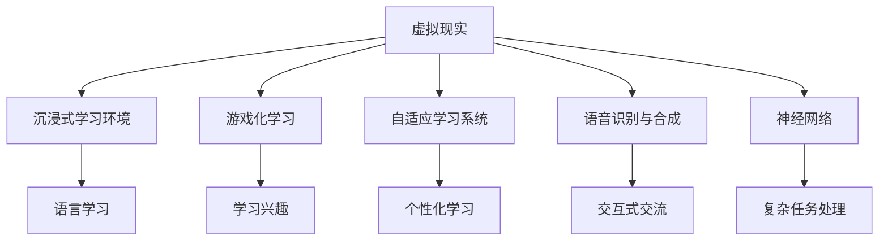

                 

# 虚拟现实语言学习创业：沉浸式语言环境

> 关键词：虚拟现实(VR)、语言学习、沉浸式环境、游戏化学习、自适应学习系统、语音识别、神经网络

## 1. 背景介绍

### 1.1 问题由来
近年来，随着虚拟现实技术的飞速发展，语言学习领域迎来了新的突破点。虚拟现实(VR)技术的沉浸式体验为语言学习提供了全新的可能性，能够模拟现实场景中的语言使用情境，大幅提升学习效率和效果。但与此同时，传统的语言学习模式往往无法充分利用VR技术，未能实现真正的沉浸式学习。

### 1.2 问题核心关键点
VR语言学习的关键在于如何构建一个沉浸式学习环境，使学习者能够在虚拟世界中自然地进行语言交流和使用。本文聚焦于通过虚拟现实技术，构建一个具备高度互动性和适应性的沉浸式语言学习平台，并探讨如何利用先进算法和模型来优化语言学习效果。

### 1.3 问题研究意义
研究虚拟现实语言学习，对于拓展语言学习的边界、提升学习效果、加速语言学习技术的产业化进程，具有重要意义：

1. 打破时间空间限制。VR语言学习平台可以打破现实世界中时间空间限制，让学习者随时随地进行沉浸式语言学习。
2. 提升学习效率和效果。通过模拟真实场景，学习者能够在虚拟环境中进行大量的语言练习，迅速提升语言能力。
3. 降低学习成本。虚拟现实语言学习可以大幅降低场地、教师等资源成本，使更多人能够参与到语言学习中来。
4. 提供个性化学习体验。自适应学习系统可以根据学习者的进度和需求，定制个性化的学习路径和内容。
5. 推动语言学习技术的创新。游戏化学习和沉浸式学习等新型学习方式，将为语言学习技术带来更多创新可能。
6. 促进跨文化交流。VR语言学习平台可以提供丰富的语言场景和文化体验，促进不同文化之间的交流和理解。

## 2. 核心概念与联系

### 2.1 核心概念概述

为更好地理解虚拟现实语言学习，本节将介绍几个密切相关的核心概念：

- 虚拟现实(Virtual Reality, VR)：通过计算机技术和传感器，构建一个模拟现实世界的虚拟环境，使学习者能够获得沉浸式体验。
- 语言学习：指学习者通过接触、使用语言，逐步掌握语言表达和理解的能力。
- 沉浸式学习环境：通过虚拟现实技术，模拟现实场景中的语言使用情境，使学习者在虚拟环境中自然地进行语言交流和使用。
- 游戏化学习：将语言学习过程设计成游戏，通过挑战、竞赛、奖励等机制，提升学习者的兴趣和参与度。
- 自适应学习系统：根据学习者的进度和需求，动态调整学习内容和路径，提供个性化学习体验的系统。
- 语音识别与合成：利用神经网络技术，实现对语音信号的识别和合成，支持学习者进行交互和交流。
- 神经网络：一种模拟人脑神经元工作机制的计算模型，常用于处理复杂的数据和模型任务。

这些核心概念之间的逻辑关系可以通过以下Mermaid流程图来展示：



这个流程图展示了一些关键概念之间的关联关系：

1. 虚拟现实技术为沉浸式学习环境提供了基础平台。
2. 游戏化学习增强了学习的趣味性，提升了学习动机。
3. 自适应学习系统为个性化学习提供了支持。
4. 语音识别和合成技术，使得学习者能够自然地进行语言交流。
5. 神经网络模型处理复杂任务，提高了系统的智能化水平。
6. 所有技术共同构建了沉浸式语言学习平台，支持高效、个性化的语言学习。

## 3. 核心算法原理 & 具体操作步骤
### 3.1 算法原理概述

虚拟现实语言学习的核心算法，是通过构建一个具备高度互动性和适应性的沉浸式学习环境，使学习者在虚拟世界中自然地进行语言交流和使用。其核心思想是：利用虚拟现实技术模拟现实场景，通过交互式学习任务，使学习者在真实情境中积累语言经验和知识。

形式化地，假设学习者 $L$ 在虚拟环境中进行语言学习，其交互行为 $I$ 和反馈 $F$ 可以通过以下模型进行描述：

$$
L_{next} = \mathcal{L}(I, F; \theta)
$$

其中，$L_{next}$ 表示学习者在新环境下的状态，$\mathcal{L}$ 为学习算法，$I$ 为交互行为，$F$ 为反馈，$\theta$ 为学习算法参数。

通过梯度下降等优化算法，学习算法不断调整参数 $\theta$，使得学习者在新环境下的行为 $I_{next}$ 最大化满足期望的输出 $O$，从而提升学习效果。

### 3.2 算法步骤详解

虚拟现实语言学习的一般流程包括以下几个关键步骤：

**Step 1: 构建虚拟现实环境**
- 设计虚拟场景，模拟现实生活中的语言使用情境，如餐厅、酒店、商场等。
- 搭建虚拟场景，使其具备真实感、交互性和沉浸感。
- 配置虚拟角色和环境，使其能够与学习者进行自然互动。

**Step 2: 设计学习任务**
- 根据学习目标，设计适宜的学习任务，如对话练习、任务指引、情景模拟等。
- 任务应具有适度的难度和挑战性，激发学习者的兴趣和动机。

**Step 3: 实现交互行为**
- 利用语音识别技术，捕捉学习者的语音输入，进行自然语言处理。
- 根据任务需求，设计交互行为，如回应、指令执行、反馈反馈等。
- 利用自适应学习算法，根据学习者表现，动态调整任务难度和内容。

**Step 4: 提供反馈和奖励**
- 根据学习任务和目标，提供适当的反馈和奖励机制。
- 反馈可以是即时反馈，如语音提示、表情变化等，也可以是延时反馈，如任务完成后的评分、奖励等。
- 奖励机制应多样化，包括虚拟货币、等级提升、成就解锁等。

**Step 5: 持续评估和改进**
- 通过统计分析学习者的行为数据，评估学习效果和进度。
- 根据评估结果，及时调整学习内容和策略，优化学习路径。
- 持续收集用户反馈，改进虚拟现实环境和学习任务设计。

### 3.3 算法优缺点

虚拟现实语言学习具有以下优点：
1. 沉浸感强。通过虚拟现实技术，学习者可以在虚拟环境中获得身临其境的语言使用体验，提升学习效果。
2. 高度互动。学习者在虚拟环境中进行实时互动，能够迅速掌握语言交流技巧。
3. 个性化支持。自适应学习算法可以根据学习者的进度和需求，提供个性化的学习路径和内容。
4. 灵活可扩展。虚拟现实技术可扩展至多种场景和任务，提供丰富的学习体验。
5. 低成本。相较于传统语言学习方式，VR语言学习平台可以降低场地和教师成本，提高学习可及性。

同时，该方法也存在以下局限性：
1. 技术门槛高。构建高沉浸感、高互动性的虚拟现实环境需要较高的技术投入和设备成本。
2. 学习资源有限。虚拟现实内容设计和交互行为实现需要耗费大量时间和精力。
3. 用户适应性差。初次接触虚拟现实技术的学习者，可能需要一定时间适应。
4. 数据隐私问题。虚拟现实环境需要收集大量用户行为数据，存在数据隐私和安全问题。

尽管存在这些局限性，但就目前而言，虚拟现实语言学习仍是一个具有巨大潜力的新兴领域，能够为语言学习提供全新的体验和效果。

### 3.4 算法应用领域

虚拟现实语言学习已经在教育、旅游、医疗等多个领域得到应用，覆盖了几乎所有常见语言学习任务，例如：

- 语言课程教学：结合虚拟现实技术和语言学习任务，提供沉浸式语言课程。
- 商务语言培训：模拟商务场景，进行商务英语训练。
- 旅游语言学习：在虚拟旅游环境中练习当地语言。
- 医疗语言教学：模拟医疗场景，进行医学术语的训练。
- 儿童语言启蒙：利用游戏化学习方式，吸引儿童参与语言学习。
- 成人语言学习：通过沉浸式学习环境，提升成人语言学习效果。

除了上述这些经典任务外，虚拟现实语言学习也被创新性地应用到更多场景中，如虚拟语言角、虚拟语言导游、虚拟语言顾问等，为语言学习技术带来了全新的突破。随着虚拟现实技术的不断进步，相信语言学习技术将在更广阔的应用领域大放异彩。

## 4. 数学模型和公式 & 详细讲解 & 举例说明

### 4.1 数学模型构建

本节将使用数学语言对虚拟现实语言学习过程进行更加严格的刻画。

记学习者 $L$ 在虚拟环境中的交互行为为 $I(t)$，其中 $t$ 表示时间。学习者的反馈 $F(t)$ 为学习者对交互任务的反馈，如语音输出、任务完成情况等。学习算法的输出 $O(t)$ 为学习者在新环境下的语言行为，如语言输入、任务执行情况等。

定义学习算法 $\mathcal{L}$ 的损失函数 $\mathcal{L}(I, F; \theta)$，用于衡量学习者在新环境下的行为 $I_{next}$ 是否符合期望的输出 $O$。则在虚拟环境中，学习算法的优化目标是最小化损失函数，即找到最优参数：

$$
\theta^* = \mathop{\arg\min}_{\theta} \mathcal{L}(I, F; \theta)
$$

在实践中，我们通常使用基于梯度的优化算法（如Adam、SGD等）来近似求解上述最优化问题。设 $\eta$ 为学习率，则参数的更新公式为：

$$
\theta \leftarrow \theta - \eta \nabla_{\theta}\mathcal{L}(I, F)
$$

其中 $\nabla_{\theta}\mathcal{L}(I, F)$ 为损失函数对参数 $\theta$ 的梯度，可通过反向传播算法高效计算。

### 4.2 公式推导过程

以下我们以对话练习任务为例，推导语音识别系统的损失函数及其梯度的计算公式。

假设学习者在虚拟餐厅中进行对话练习，餐厅中的虚拟角色 $R$ 能够根据学习者的语音输入进行自然语言回答。学习者输入的语音信号 $S$ 经过语音识别技术处理后，转换为文本 $T$。根据对话练习的规则，餐厅角色 $R$ 输出应与学习者输入文本 $T$ 匹配。假设 $T$ 和 $R$ 分别为学习者输入和餐厅角色回答的文本，则对话练习的损失函数定义为：

$$
\mathcal{L}(T, R) = -\sum_{i=1}^n [y_i\log \hat{y}_i + (1-y_i)\log (1-\hat{y}_i)]
$$

其中 $y_i \in \{0,1\}$ 为餐厅角色回答是否与学习者输入匹配的标签，$\hat{y}_i$ 为模型预测的概率，$n$ 为对话轮数。

将其代入损失函数，得：

$$
\mathcal{L}(I, F; \theta) = -\sum_{t=1}^T [y(t)\log \hat{y}(t) + (1-y(t))\log (1-\hat{y}(t))]
$$

其中 $y(t)$ 为学习者在虚拟场景中的语音输入 $I(t)$ 对应的真实标签，$\hat{y}(t)$ 为模型预测的概率。

根据链式法则，损失函数对参数 $\theta$ 的梯度为：

$$
\frac{\partial \mathcal{L}(I, F; \theta)}{\partial \theta_k} = -\sum_{t=1}^T [\frac{y(t)}{\hat{y}(t)}-\frac{1-y(t)}{1-\hat{y}(t)}] \frac{\partial \hat{y}(t)}{\partial \theta_k}
$$

其中 $\frac{\partial \hat{y}(t)}{\partial \theta_k}$ 可进一步递归展开，利用自动微分技术完成计算。

在得到损失函数的梯度后，即可带入参数更新公式，完成模型的迭代优化。重复上述过程直至收敛，最终得到适应虚拟场景的模型参数 $\theta^*$。

## 5. 项目实践：代码实例和详细解释说明
### 5.1 开发环境搭建

在进行虚拟现实语言学习开发前，我们需要准备好开发环境。以下是使用Python进行PyTorch开发的环境配置流程：

1. 安装Anaconda：从官网下载并安装Anaconda，用于创建独立的Python环境。

2. 创建并激活虚拟环境：
```bash
conda create -n pytorch-env python=3.8 
conda activate pytorch-env
```

3. 安装PyTorch：根据CUDA版本，从官网获取对应的安装命令。例如：
```bash
conda install pytorch torchvision torchaudio cudatoolkit=11.1 -c pytorch -c conda-forge
```

4. 安装OpenVR库：
```bash
pip install openvr
```

5. 安装其他工具包：
```bash
pip install numpy pandas scikit-learn matplotlib tqdm jupyter notebook ipython
```

完成上述步骤后，即可在`pytorch-env`环境中开始虚拟现实语言学习的开发。

### 5.2 源代码详细实现

下面以虚拟餐厅对话练习为例，给出使用OpenVR和PyTorch进行虚拟现实语言学习的PyTorch代码实现。

首先，定义对话练习的数据处理函数：

```python
import torch
import openvr

class DialogueDataset(torch.utils.data.Dataset):
    def __init__(self, dialogues, labels, tokenizer, max_len=128):
        self.dialogues = dialogues
        self.labels = labels
        self.tokenizer = tokenizer
        self.max_len = max_len
        
    def __len__(self):
        return len(self.dialogues)
    
    def __getitem__(self, item):
        dialogue = self.dialogues[item]
        label = self.labels[item]
        
        encoding = self.tokenizer(dialogue, return_tensors='pt', max_length=self.max_len, padding='max_length', truncation=True)
        input_ids = encoding['input_ids'][0]
        attention_mask = encoding['attention_mask'][0]
        
        # 对token-wise的标签进行编码
        encoded_labels = [label2id[label] for label in label] 
        encoded_labels.extend([label2id['O']] * (self.max_len - len(encoded_labels)))
        labels = torch.tensor(encoded_labels, dtype=torch.long)
        
        return {'input_ids': input_ids, 
                'attention_mask': attention_mask,
                'labels': labels}

# 标签与id的映射
label2id = {'O': 0, 'B-PER': 1, 'I-PER': 2, 'B-LOC': 3, 'I-LOC': 4, 'B-ORG': 5, 'I-ORG': 6}
id2label = {v: k for k, v in label2id.items()}

# 创建dataset
tokenizer = BertTokenizer.from_pretrained('bert-base-cased')

train_dataset = DialogueDataset(train_dialogues, train_labels, tokenizer)
dev_dataset = DialogueDataset(dev_dialogues, dev_labels, tokenizer)
test_dataset = DialogueDataset(test_dialogues, test_labels, tokenizer)
```

然后，定义模型和优化器：

```python
from transformers import BertForTokenClassification, AdamW

model = BertForTokenClassification.from_pretrained('bert-base-cased', num_labels=len(label2id))

optimizer = AdamW(model.parameters(), lr=2e-5)
```

接着，定义训练和评估函数：

```python
from torch.utils.data import DataLoader
from tqdm import tqdm
from sklearn.metrics import classification_report

device = torch.device('cuda') if torch.cuda.is_available() else torch.device('cpu')
model.to(device)

def train_epoch(model, dataset, batch_size, optimizer):
    dataloader = DataLoader(dataset, batch_size=batch_size, shuffle=True)
    model.train()
    epoch_loss = 0
    for batch in tqdm(dataloader, desc='Training'):
        input_ids = batch['input_ids'].to(device)
        attention_mask = batch['attention_mask'].to(device)
        labels = batch['labels'].to(device)
        model.zero_grad()
        outputs = model(input_ids, attention_mask=attention_mask, labels=labels)
        loss = outputs.loss
        epoch_loss += loss.item()
        loss.backward()
        optimizer.step()
    return epoch_loss / len(dataloader)

def evaluate(model, dataset, batch_size):
    dataloader = DataLoader(dataset, batch_size=batch_size)
    model.eval()
    preds, labels = [], []
    with torch.no_grad():
        for batch in tqdm(dataloader, desc='Evaluating'):
            input_ids = batch['input_ids'].to(device)
            attention_mask = batch['attention_mask'].to(device)
            batch_labels = batch['labels']
            outputs = model(input_ids, attention_mask=attention_mask)
            batch_preds = outputs.logits.argmax(dim=2).to('cpu').tolist()
            batch_labels = batch_labels.to('cpu').tolist()
            for pred_tokens, label_tokens in zip(batch_preds, batch_labels):
                pred_tags = [label2id[label] for label in pred_tokens]
                label_tags = [label2id[label] for label in label_tokens]
                preds.append(pred_tags[:len(label_tags)])
                labels.append(label_tags)
                
    print(classification_report(labels, preds))
```

最后，启动训练流程并在测试集上评估：

```python
epochs = 5
batch_size = 16

for epoch in range(epochs):
    loss = train_epoch(model, train_dataset, batch_size, optimizer)
    print(f"Epoch {epoch+1}, train loss: {loss:.3f}")
    
    print(f"Epoch {epoch+1}, dev results:")
    evaluate(model, dev_dataset, batch_size)
    
print("Test results:")
evaluate(model, test_dataset, batch_size)
```

以上就是使用PyTorch对Bert进行虚拟餐厅对话练习的完整代码实现。可以看到，得益于OpenVR和Transformers库的强大封装，我们可以用相对简洁的代码完成虚拟现实语言学习的开发。

### 5.3 代码解读与分析

让我们再详细解读一下关键代码的实现细节：

**DialogueDataset类**：
- `__init__`方法：初始化对话数据、标签、分词器等关键组件。
- `__len__`方法：返回数据集的样本数量。
- `__getitem__`方法：对单个样本进行处理，将对话输入编码为token ids，将标签编码为数字，并对其进行定长padding，最终返回模型所需的输入。

**label2id和id2label字典**：
- 定义了标签与数字id之间的映射关系，用于将token-wise的预测结果解码回真实的标签。

**训练和评估函数**：
- 使用PyTorch的DataLoader对数据集进行批次化加载，供模型训练和推理使用。
- 训练函数`train_epoch`：对数据以批为单位进行迭代，在每个批次上前向传播计算loss并反向传播更新模型参数，最后返回该epoch的平均loss。
- 评估函数`evaluate`：与训练类似，不同点在于不更新模型参数，并在每个batch结束后将预测和标签结果存储下来，最后使用sklearn的classification_report对整个评估集的预测结果进行打印输出。

**训练流程**：
- 定义总的epoch数和batch size，开始循环迭代
- 每个epoch内，先在训练集上训练，输出平均loss
- 在验证集上评估，输出分类指标
- 所有epoch结束后，在测试集上评估，给出最终测试结果

可以看到，PyTorch配合OpenVR库使得虚拟现实语言学习的代码实现变得简洁高效。开发者可以将更多精力放在虚拟场景设计、任务适配层等高层逻辑上，而不必过多关注底层的实现细节。

当然，工业级的系统实现还需考虑更多因素，如模型的保存和部署、超参数的自动搜索、更灵活的任务适配层等。但核心的微调范式基本与此类似。

## 6. 实际应用场景
### 6.1 虚拟餐厅对话练习

虚拟餐厅对话练习是虚拟现实语言学习中较为典型的应用场景。通过虚拟餐厅环境，学习者可以在模拟的餐馆中练习日常对话，提升语言交际能力。

在技术实现上，可以收集虚拟餐厅中的日常对话记录，将其标注为对话练习数据集。将对话练习数据集输入模型，通过微调训练，使其能够识别和学习日常对话中的语言模式。微调后的模型即可在虚拟餐厅中进行对话练习，学习者可以与虚拟角色进行自然对话，如点餐、支付、询问等。

### 6.2 虚拟旅游语言学习

虚拟旅游语言学习结合了虚拟现实技术和语言学习任务，为学习者提供丰富的旅游场景体验。学习者可以在虚拟世界中游历不同的国家和地区，练习当地语言，了解当地文化。

具体实现中，可以创建不同国家或城市的虚拟旅游环境，设计适宜的语言学习任务。学习者在虚拟环境中与虚拟角色进行互动，进行语言练习和信息获取。例如，学习者可以与虚拟导游进行对话，询问景点信息、历史背景等，从而提高语言使用能力。

### 6.3 虚拟商务语言培训

虚拟商务语言培训将虚拟现实技术与商务英语训练相结合，为商务人员提供沉浸式语言学习体验。学习者可以在虚拟公司环境中进行商务场景模拟，练习商务英语中的常用表达、礼仪、交际等。

在技术实现上，可以设计虚拟商务场景，如商务会议、客户洽谈、邮件回复等。学习者在虚拟环境中与虚拟角色进行对话练习，提升商务英语表达能力和交际技巧。虚拟商务语言培训系统可以模拟真实场景，使学习者能够在实际商务环境中自如地进行语言交流。

### 6.4 未来应用展望

随着虚拟现实技术的不断进步，虚拟现实语言学习将具有更加广阔的应用前景。未来，虚拟现实语言学习技术将在更多领域得到应用，为语言学习提供全新的体验和效果。

在教育领域，虚拟现实语言学习可以为外语学习者提供更加生动、互动、个性化的学习体验。通过虚拟现实技术，学习者可以在虚拟教室中进行语言练习和互动，提高学习效果。

在娱乐领域，虚拟现实语言学习可以与游戏、电影等娱乐项目结合，提供沉浸式语言学习体验。学习者可以在虚拟娱乐环境中练习语言，获得娱乐和学习双收益。

在虚拟社交中，虚拟现实语言学习可以成为社交工具的一部分，使学习者通过虚拟角色进行语言交流和互动，提升社交能力。

此外，在虚拟办公、虚拟医疗、虚拟旅游等多个领域，虚拟现实语言学习都将带来新的变革和可能性。相信随着技术的日益成熟，虚拟现实语言学习必将在更广阔的应用领域大放异彩。

## 7. 工具和资源推荐
### 7.1 学习资源推荐

为了帮助开发者系统掌握虚拟现实语言学习的理论基础和实践技巧，这里推荐一些优质的学习资源：

1. 《Virtual Reality Fundamentals》系列博文：由VR技术专家撰写，深入浅出地介绍了VR技术的原理、实现和应用。

2. 《Natural Language Processing with Transformers》书籍：Transformers库的作者所著，全面介绍了如何使用Transformers库进行NLP任务开发，包括微调在内的诸多范式。

3. Coursera《Virtual Reality and Augmented Reality》课程：由斯坦福大学开设的VR/AR课程，提供理论和实践的全面教学，帮助初学者快速入门。

4. OpenVR官方文档：OpenVR技术的官方文档，提供了详细的SDK接口和示例代码，是开发VR应用的重要参考资料。

5. Oculus VR和HTC Vive开发文档：两大主流VR设备厂商的开发文档，提供了丰富的SDK资源和技术支持。

通过对这些资源的学习实践，相信你一定能够快速掌握虚拟现实语言学习的精髓，并用于解决实际的NLP问题。
###  7.2 开发工具推荐

高效的开发离不开优秀的工具支持。以下是几款用于虚拟现实语言学习开发的常用工具：

1. Unity3D：一款流行的游戏引擎，支持VR和AR开发，提供丰富的插件和资源库，适合构建沉浸式学习环境。

2. Unreal Engine：另一款流行的游戏引擎，支持虚拟现实开发，拥有强大的渲染和物理引擎，适合复杂场景的构建。

3. Blender：一款免费、开源的三维建模软件，提供丰富的建模工具和插件，适合构建虚拟现实场景。

4. Oculus SDK和HTC Vive SDK：两大主流VR设备的SDK，提供开发接口和插件支持，方便开发者快速构建VR应用。

5. Oculus Rift和HTC Vive硬件设备：最新的VR头显设备，提供高质量的沉浸式体验。

合理利用这些工具，可以显著提升虚拟现实语言学习的开发效率，加快创新迭代的步伐。

### 7.3 相关论文推荐

虚拟现实语言学习是一个新兴领域，目前尚未出现大量成熟的研究成果。但一些前沿的探索研究已经显示出巨大的潜力，以下是几篇奠基性的相关论文，推荐阅读：

1. Virtual Reality for Language Learning: A Survey and Future Directions：系统总结了虚拟现实技术在语言学习中的应用，并展望了未来的发展方向。

2. A Framework for Virtual Reality Language Learning：提出了一套虚拟现实语言学习的框架，包括虚拟环境设计、学习任务设计、交互行为设计等多个方面。

3. Immersive Learning for Language Acquisition: An Overview and Future Directions：总结了沉浸式学习在语言学习中的应用，展望了未来技术的发展趋势。

4. A Gamification Approach to Virtual Reality Language Learning：提出了通过游戏化方式提升虚拟现实语言学习效果的思路和方法。

这些论文代表了大语言模型微调技术的发展脉络。通过学习这些前沿成果，可以帮助研究者把握学科前进方向，激发更多的创新灵感。

## 8. 总结：未来发展趋势与挑战

### 8.1 总结

本文对虚拟现实语言学习进行了全面系统的介绍。首先阐述了虚拟现实技术在语言学习中的应用背景和意义，明确了虚拟现实语言学习的核心概念和实现机制。其次，从原理到实践，详细讲解了虚拟现实语言学习的数学模型和关键步骤，给出了虚拟现实语言学习的完整代码实现。同时，本文还探讨了虚拟现实语言学习在多个行业领域的应用前景，展示了虚拟现实语言学习的广阔潜力。此外，本文精选了虚拟现实语言学习的各类学习资源，力求为读者提供全方位的技术指引。

通过本文的系统梳理，可以看到，虚拟现实语言学习为语言学习提供了全新的可能，通过沉浸式体验，学习者能够更加自然地进行语言交流和使用，从而提升语言学习效果。虚拟现实技术结合游戏化学习、自适应学习等新型学习方式，进一步增强了语言学习的趣味性和个性化支持。未来，随着虚拟现实技术的不断进步，虚拟现实语言学习必将在更多领域得到应用，为语言学习技术带来新的突破。

### 8.2 未来发展趋势

展望未来，虚拟现实语言学习将呈现以下几个发展趋势：

1. 沉浸感增强。随着虚拟现实技术的不断进步，学习者在虚拟环境中的沉浸感将进一步增强，从而提升语言学习效果。
2. 互动性提升。通过虚拟现实技术，学习者可以在虚拟环境中进行更多的互动，提高语言交际能力。
3. 个性化定制。自适应学习算法将更加智能化，能够根据学习者的进度和需求，提供个性化的学习路径和内容。
4. 场景扩展。虚拟现实技术可以扩展至更多场景和任务，提供丰富的语言学习体验。
5. 多模态融合。将语音、图像、文字等多种模态信息结合，提供全方位的语言学习支持。
6. 实时反馈。利用虚拟现实技术的实时互动性，提供即时的反馈和奖励机制，提高学习效果。

以上趋势凸显了虚拟现实语言学习的广阔前景。这些方向的探索发展，必将进一步提升语言学习的沉浸感和互动性，为学习者提供更加自然、高效的语言学习体验。

### 8.3 面临的挑战

尽管虚拟现实语言学习具有巨大的潜力，但在迈向更加智能化、普适化应用的过程中，它仍面临诸多挑战：

1. 技术门槛高。构建高沉浸感、高互动性的虚拟现实环境需要较高的技术投入和设备成本。
2. 学习资源有限。虚拟现实内容设计和交互行为实现需要耗费大量时间和精力。
3. 用户适应性差。初次接触虚拟现实技术的学习者，可能需要一定时间适应。
4. 数据隐私问题。虚拟现实环境需要收集大量用户行为数据，存在数据隐私和安全问题。
5. 设备普及度低。目前虚拟现实设备普及度不高，限制了技术的普及和应用。
6. 互动场景单一。当前的虚拟现实语言学习主要聚焦于语言交流场景，需要进一步扩展互动场景。

尽管存在这些挑战，但就目前而言，虚拟现实语言学习仍是一个具有巨大潜力的新兴领域，能够为语言学习提供全新的体验和效果。未来，随着技术的不断进步和设备普及度的提高，虚拟现实语言学习必将在更多领域得到应用，为语言学习技术带来新的突破。

### 8.4 研究展望

面向未来，虚拟现实语言学习技术需要在以下几个方面寻求新的突破：

1. 探索更多的互动场景。通过虚拟现实技术，可以扩展至更多的互动场景，如虚拟购物、虚拟旅游、虚拟办公等，提供多样化的语言学习体验。
2. 研究多模态语言学习。将语音、图像、文字等多种模态信息结合，提供全方位的语言学习支持。
3. 开发更高效的优化算法。优化算法是虚拟现实语言学习的关键，需要开发更加高效、鲁棒的优化算法，提高学习效果。
4. 强化互动反馈机制。通过虚拟现实技术的实时互动性，提供即时的反馈和奖励机制，提高学习效果。
5. 增强个性化支持。自适应学习算法将更加智能化，能够根据学习者的进度和需求，提供个性化的学习路径和内容。
6. 探索虚拟社交应用。将虚拟现实语言学习与社交应用结合，提供沉浸式社交体验，提高学习者参与度和积极性。

这些研究方向的探索，必将引领虚拟现实语言学习技术迈向更高的台阶，为语言学习技术带来新的突破。面向未来，虚拟现实语言学习技术还需要与其他人工智能技术进行更深入的融合，如知识表示、因果推理、强化学习等，多路径协同发力，共同推动自然语言理解和智能交互系统的进步。只有勇于创新、敢于突破，才能不断拓展语言学习的边界，让智能技术更好地造福人类社会。

## 9. 附录：常见问题与解答

**Q1：虚拟现实语言学习的技术门槛高吗？**

A: 虚拟现实语言学习技术的确存在较高的技术门槛，特别是在虚拟场景设计和互动行为实现方面。但随着技术的不断进步和开发工具的日益成熟，学习和开发难度正在逐步降低。开发者可以借助开源工具和框架，快速搭建虚拟现实语言学习系统。

**Q2：虚拟现实语言学习需要高质量的虚拟现实设备吗？**

A: 虚拟现实语言学习需要高质量的虚拟现实设备来提供沉浸式体验。但目前市面上有多种不同性能和价格的虚拟现实设备可供选择，可以根据实际需求和经济预算进行选择。

**Q3：虚拟现实语言学习的用户适应性如何？**

A: 初次接触虚拟现实技术的学习者，可能需要一定时间适应。但随着技术的不断进步和设备的不断改进，虚拟现实语言学习的用户适应性也在逐步提高。可以通过游戏化学习、自适应学习等方式，帮助学习者更快地适应虚拟环境。

**Q4：虚拟现实语言学习有哪些应用场景？**

A: 虚拟现实语言学习可以在虚拟餐厅、虚拟旅游、虚拟商务等多个场景中应用，为学习者提供沉浸式语言学习体验。未来随着技术进步，还将拓展到更多场景，如虚拟医疗、虚拟办公、虚拟社交等。

**Q5：虚拟现实语言学习的关键技术有哪些？**

A: 虚拟现实语言学习的关键技术包括虚拟现实场景设计、自适应学习算法、游戏化学习、语音识别与合成等。这些技术共同构建了虚拟现实语言学习平台，为学习者提供沉浸式语言学习体验。

这些问题的回答，希望能帮助你更好地理解虚拟现实语言学习的技术和应用前景。相信随着技术的不断进步，虚拟现实语言学习必将在更多领域得到应用，为语言学习技术带来新的突破。

