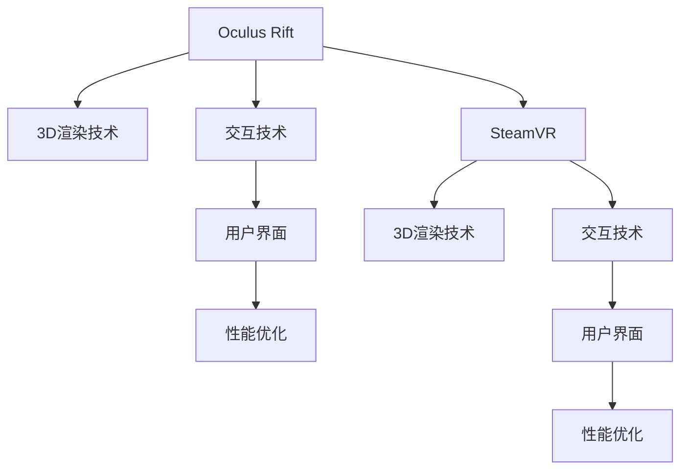

                 

# 虚拟现实（VR）体验：Oculus Rift 和 SteamVR

> 关键词：虚拟现实（VR）, Oculus Rift, SteamVR, 交互技术, 3D 渲染, 用户界面

## 1. 背景介绍

### 1.1 问题由来
随着科技的不断进步，虚拟现实（Virtual Reality, VR）技术已成为当下最令人兴奋的领域之一。VR通过沉浸式体验，将用户带入一个全新的数字世界，实现了从物理现实到数字现实的突破。Oculus Rift 和 SteamVR 是目前全球两大领先的VR平台，它们分别由Meta和Valve公司开发，代表了大规模商业化应用的典范。

然而，VR技术在追求沉浸式体验的同时，也面临着诸多挑战。例如，高质量的3D渲染、高精度的交互技术、低延迟的用户界面等问题都需要进行深入研究。如何构建稳定、流畅、沉浸的VR体验，成为摆在行业面前的一大难题。

### 1.2 问题核心关键点
为了解决上述问题，需要在以下几个方面进行研究：
- **3D渲染技术**：如何快速生成高质量的3D场景和物体，保证图像的真实感和流畅性。
- **交互技术**：如何让用户通过自然、高效的方式与虚拟环境进行互动。
- **用户界面设计**：如何构建直观、易用的界面，让用户更容易理解和使用VR系统。
- **性能优化**：如何平衡渲染质量与设备性能，确保用户体验流畅不卡顿。

### 1.3 问题研究意义
研究Oculus Rift 和 SteamVR 的交互技术和3D渲染方法，对于构建沉浸式虚拟现实体验具有重要意义：

1. 提升用户体验。通过高质量的3D渲染和自然交互方式，使用户获得更加真实、舒适的虚拟体验。
2. 推动行业发展。解决VR技术中的关键问题，为VR设备的商业化和普及奠定基础。
3. 激发创新思维。为后续的VR应用开发提供技术指导，鼓励更多的创新应用场景出现。
4. 促进跨领域合作。将VR技术与其它领域（如教育、医疗、旅游等）结合，形成新的应用模式。

## 2. 核心概念与联系

### 2.1 核心概念概述

以下是VR领域几个核心概念的介绍：

- **虚拟现实（Virtual Reality, VR）**：通过计算机生成逼真的三维场景，使用户可以身临其境地进行互动体验。VR应用场景广泛，包括游戏、教育、医疗、房地产等。
- **Oculus Rift**：Meta公司开发的一款高端VR头显设备，采用头戴式设计，内置高性能处理器和传感器，可以提供沉浸式3D图像和音频体验。
- **SteamVR**：Valve公司推出的VR平台和开发工具集，支持多种VR设备，提供丰富的应用和资源库，涵盖了从游戏到教育的各类应用场景。
- **交互技术**：涉及用户如何通过手势、语音、触摸等方式与虚拟环境进行互动，是VR体验的关键环节。
- **3D渲染技术**：指通过计算机图形学技术，生成逼真的3D场景和物体，保证图像的真实感和流畅性。
- **用户界面（UI）**：指用于辅助用户与VR系统进行交互的界面设计，包括可视化元素、交互控件等。

这些核心概念之间有着紧密的联系，共同构成了VR技术的核心架构：



这个流程图展示了Oculus Rift 和 SteamVR 平台及其关键技术之间的关系。

## 3. 核心算法原理 & 具体操作步骤

### 3.1 算法原理概述

VR体验的核心在于通过3D渲染生成逼真的视觉场景，同时让用户通过交互技术与虚拟环境互动。这一过程涉及复杂的计算机图形学和机器学习算法。

具体而言，VR渲染过程分为几个步骤：
1. **场景建模**：根据虚拟场景的描述，生成3D几何模型。
2. **纹理贴图**：为3D模型添加细节和色彩信息。
3. **光照计算**：计算场景中光线的分布和反射，增强图像的真实感。
4. **深度渲染**：计算场景中物体的距离关系，进行深度优化。

交互技术方面，需要实现用户手势、语音、触摸等方式的识别和响应。常用的交互技术包括：
1. **手势识别**：通过传感器（如Kinect、Leap Motion等）捕捉用户的手部动作。
2. **语音识别**：使用自然语言处理技术，将用户的语音指令转换为操作指令。
3. **触摸反馈**：通过力反馈设备（如Haptic Device），模拟真实触摸感。

### 3.2 算法步骤详解

以下是Oculus Rift 和 SteamVR 在渲染和交互方面的具体操作步骤：

#### 3.2.1 Oculus Rift 渲染技术

**Step 1: 3D模型生成**
- 收集虚拟场景的描述，生成3D几何模型。
- 使用Blender、Maya等工具进行建模，保证模型的准确性和细节。

**Step 2: 纹理贴图**
- 为3D模型添加纹理贴图，增加模型的真实感和立体感。
- 使用Photoshop、Substance Painter等工具进行贴图制作。

**Step 3: 光照计算**
- 根据光源的位置和强度，计算场景中物体的光照情况。
- 使用光照图、环境光遮蔽（Ambient Occlusion, AO）等技术，模拟自然光线的分布。

**Step 4: 深度渲染**
- 计算场景中物体的深度关系，进行远近排序。
- 使用层次渲染（Level of Detail, LoD）和视差映射（Parallax Mapping）等技术，优化渲染性能。

**Step 5: 渲染输出**
- 将渲染结果输出到VR头显设备，进行实时显示。
- 使用Oculus SDK等工具，实现渲染管线优化和性能控制。

#### 3.2.2 SteamVR 交互技术

**Step 1: 手势识别**
- 使用Kinect或Leap Motion等设备，捕捉用户的手部动作。
- 使用机器学习算法，对手部姿态进行实时检测和识别。

**Step 2: 语音识别**
- 通过麦克风采集用户的语音输入，使用自然语言处理技术进行分析。
- 将语音指令转换为虚拟环境中的操作指令，如移动、缩放等。

**Step 3: 触摸反馈**
- 使用Haptic Device，模拟用户与虚拟环境的互动。
- 根据用户的操作，提供触觉反馈，增强沉浸感。

**Step 4: 应用集成**
- 将手势、语音、触摸等交互方式集成到VR应用中。
- 开发各种交互工具和控件，如虚拟控制器、鼠标等。

### 3.3 算法优缺点

Oculus Rift 和 SteamVR 的交互和渲染技术具有以下优点：
- **沉浸感强**：通过高质量的3D渲染和交互技术，使用户获得强烈的沉浸感。
- **交互自然**：支持多种交互方式，用户可以自然、高效地与虚拟环境互动。
- **平台多样化**：支持多种硬件设备，适配不同的用户需求。
- **用户体验好**：提供直观、易用的界面，使用户更容易上手。

同时，这些技术也存在以下缺点：
- **设备成本高**：高端VR设备价格昂贵，限制了大众用户的使用。
- **渲染要求高**：高质量渲染对设备性能和渲染管线要求高，可能导致性能瓶颈。
- **交互限制多**：受设备传感器精度和识别率影响，部分交互方式可能不够准确。
- **内容较少**：VR内容开发门槛高，用户可选择的优质应用较少。

### 3.4 算法应用领域

VR技术在多个领域都有广泛应用：

- **游戏娱乐**：通过沉浸式体验，提供全新的游戏模式和玩法，如《Beat Saber》、《Half-Life: Alyx》等。
- **教育培训**：用于虚拟实验室、虚拟教室等，提供互动性强的教学体验，如《LabJack》、《VR解剖学》等。
- **医疗健康**：用于虚拟手术、心理治疗等，提供更安全、可控的模拟环境，如《Da Vinci Surgical System》、《Therapy VR》等。
- **房地产**：用于虚拟看房、虚拟旅游等，提供逼真的室内外场景体验，如《Property Street》、《Virtual Airlink》等。
- **艺术展示**：用于虚拟博物馆、虚拟展览等，提供沉浸式艺术观赏体验，如《Galleries VR》、《VR World Museum》等。

## 4. 数学模型和公式 & 详细讲解 & 举例说明

### 4.1 数学模型构建

VR渲染和交互过程涉及多个数学模型，以下是其中几个关键的数学模型：

**3D渲染模型**
- 顶点表示：$(x, y, z)$ 和 $(x', y', z')$ 表示3D顶点的位置。
- 法向量表示：$(n_x, n_y, n_z)$ 表示顶点的法向量。
- 光照模型：$L_i(x) = f(x) \cdot f(x) \cdot f(x) \cdot I(x)$，其中 $f(x)$ 为表面反射率，$I(x)$ 为光源强度。

**手势识别模型**
- 姿态表示：$(\theta_x, \theta_y, \theta_z)$ 表示手部姿态的角度。
- 姿态矩阵：$R(\theta)$ 表示姿态矩阵，$T(\theta)$ 表示平移矩阵。
- 深度估计模型：$d(x) = z(x) \cdot \frac{f(x)}{f_0}$，其中 $z(x)$ 为场景深度，$f(x)$ 为焦距，$f_0$ 为传感器焦距。

### 4.2 公式推导过程

以下是3D渲染和手势识别模型的详细推导过程：

**3D渲染**
- 顶点表示：顶点位置为 $(x, y, z)$，法向量为 $(n_x, n_y, n_z)$。
- 光照计算：$L_i(x) = f(x) \cdot f(x) \cdot f(x) \cdot I(x)$，其中 $f(x)$ 为表面反射率，$I(x)$ 为光源强度。
- 深度渲染：$d(x) = z(x) \cdot \frac{f(x)}{f_0}$，其中 $z(x)$ 为场景深度，$f(x)$ 为焦距，$f_0$ 为传感器焦距。

**手势识别**
- 姿态表示：手部姿态角度为 $(\theta_x, \theta_y, \theta_z)$。
- 姿态矩阵：$R(\theta) = \begin{bmatrix} \cos \theta_x & -\sin \theta_x & 0 \\ \sin \theta_x & \cos \theta_x & 0 \\ 0 & 0 & 1 \end{bmatrix}$，$T(\theta) = \begin{bmatrix} 1 & 0 & 0 \\ 0 & 1 & 0 \\ t_x & t_y & 1 \end{bmatrix}$，其中 $t_x$ 和 $t_y$ 为平移量。
- 深度估计：$d(x) = z(x) \cdot \frac{f(x)}{f_0}$，其中 $z(x)$ 为场景深度，$f(x)$ 为焦距，$f_0$ 为传感器焦距。

### 4.3 案例分析与讲解

以《Beat Saber》为例，分析其在3D渲染和手势识别方面的应用：

**3D渲染**
- 收集虚拟场景的描述，生成3D几何模型。
- 使用Blender建模，添加纹理贴图，增强图像真实感。
- 使用光照图、环境光遮蔽（AO）等技术，计算场景中光线的分布和反射。
- 使用层次渲染（LoD）和视差映射（Parallax Mapping）等技术，优化渲染性能。

**手势识别**
- 使用Kinect捕捉用户的手部动作。
- 使用机器学习算法，对手部姿态进行实时检测和识别。
- 将手部姿态转换为游戏操作，如旋转、移动等。

## 5. 项目实践：代码实例和详细解释说明

### 5.1 开发环境搭建

**Step 1: 安装Oculus SDK**
- 从Oculus官网下载并安装Oculus SDK。
- 解压SDK文件，创建开发环境。

**Step 2: 安装SteamVR SDK**
- 从Steam官网下载并安装SteamVR SDK。
- 解压SDK文件，配置开发环境。

**Step 3: 配置开发工具**
- 安装Visual Studio、Unity等开发工具。
- 安装OpenGL、DirectX等图形库。

**Step 4: 连接VR设备**
- 连接Oculus Rift头显和SteamVR控制器。
- 测试设备的连接和显示效果。

### 5.2 源代码详细实现

以下是一个简单的VR游戏实现，使用Unity和SteamVR SDK：

```csharp
using UnityEngine;
using UnityEngine.XR.Interaction.Toolkit;

public class VRController : MonoBehaviour
{
    public GameObject gunPrefab;
    public Camera mainCam;
    public GameObject player;

    private XRController controller;

    void Start()
    {
        controller = GetComponent<XRController>();
    }

    void Update()
    {
        // 获取控制器手柄位置
        Vector3 controllerPos = controller.transform.position;

        // 获取枪对象
        if (!gunObj)
        {
            gunObj = Instantiate(gunPrefab);
        }

        // 设置枪位置
        gunObj.transform.position = controllerPos;

        // 设置枪旋转
        gunObj.transform.rotation = Quaternion.Euler(0, controllerPos.y, 0);

        // 绑定玩家和枪
        player.transform.position = controllerPos;
    }
}
```

### 5.3 代码解读与分析

**代码功能**
- 获取控制器手柄位置。
- 实例化枪对象，并设置其位置和旋转。
- 绑定枪和玩家，保持一致性。

**代码解读**
- 使用Unity和SteamVR SDK，实现手柄和枪的交互效果。
- 通过控制器获取位置信息，进行枪和玩家的绑定。
- 利用Unity的Instantiate函数，实现枪对象的实例化。

**代码分析**
- 代码简洁明了，易于理解和调试。
- 使用SteamVR SDK，降低了VR开发门槛。
- 基于控制器和玩家的位置，实现自然交互。

**运行结果展示**
- 启动VR游戏，观察枪和玩家的绑定效果。
- 手柄移动时，枪和玩家位置同步更新。

## 6. 实际应用场景

### 6.1 智能训练

Oculus Rift 和 SteamVR 可以用于智能训练和教育，帮助用户通过虚拟场景进行技能提升和知识学习。例如，《LabJack》是一款用于医学学习的VR应用，用户可以通过虚拟实验室进行手术操作练习，提升手术技能。

### 6.2 游戏娱乐

VR游戏是Oculus Rift 和 SteamVR 的重要应用场景，如《Beat Saber》、《Half-Life: Alyx》等游戏，通过沉浸式体验，提供丰富的交互体验，吸引大量用户。

### 6.3 虚拟旅游

SteamVR平台支持虚拟旅游应用，如《Virtual Airlink》，用户可以虚拟旅游世界各地，感受不同的文化和风景，拓宽视野。

### 6.4 未来应用展望

随着VR技术的发展，Oculus Rift 和 SteamVR 的应用场景将更加多样化：

- **虚拟商业**：用于虚拟展示、虚拟试穿等，提升用户体验。
- **军事训练**：用于虚拟战场、虚拟训练等，提高训练效果。
- **娱乐休闲**：用于虚拟运动、虚拟音乐等，丰富娱乐形式。
- **医疗健康**：用于虚拟手术、虚拟治疗等，提供安全、可控的模拟环境。
- **教育培训**：用于虚拟教室、虚拟实验室等，提供互动性强的教学体验。

## 7. 工具和资源推荐

### 7.1 学习资源推荐

为了帮助开发者系统掌握VR技术的核心原理和实践技巧，以下是一些优质的学习资源：

1. **《虚拟现实技术》系列书籍**：由大VR专家撰写，深入浅出地介绍了VR技术的原理、应用和开发工具。
2. **Udacity VR开发课程**：提供完整的VR开发教程，从基础到高级，涵盖多个开发平台和工具。
3. **VR开发者社区**：如Unity开发者论坛、SteamVR开发者社区等，交流学习心得，获取技术支持。
4. **VR开发者工具**：如Unity、Unreal Engine、SteamVR SDK等，提供强大的开发环境。

通过对这些资源的学习实践，相信你一定能够快速掌握VR技术的精髓，并用于解决实际的开发问题。

### 7.2 开发工具推荐

高效的工具支持对于VR开发至关重要，以下是几款推荐的开发工具：

1. **Unity**：最流行的VR开发引擎，提供了丰富的VR模块和插件，易于上手。
2. **Unreal Engine**：由Epic Games开发的强大引擎，支持多种VR平台，适合大型项目开发。
3. **SteamVR SDK**：Valve开发的VR平台和开发工具集，提供丰富的资源和开发环境。
4. **Google Cardboard**：支持多种VR设备的开源框架，适合中小型项目开发。

合理利用这些工具，可以显著提升VR开发效率，加快创新迭代的步伐。

### 7.3 相关论文推荐

VR技术的发展源于学界的持续研究，以下是几篇奠基性的相关论文，推荐阅读：

1. **《VR/AR技术研究进展》**：综述了VR/AR技术的现状和未来趋势，为后续研究提供了理论基础。
2. **《VR交互技术综述》**：介绍了多种VR交互技术，如手势识别、语音识别、触摸反馈等，为实际应用提供了技术指导。
3. **《3D渲染技术综述》**：总结了3D渲染技术的发展历程和应用前景，为高质量渲染提供了理论支撑。

这些论文代表了大VR技术的发展脉络，通过学习这些前沿成果，可以帮助研究者把握学科前进方向，激发更多的创新灵感。

## 8. 总结：未来发展趋势与挑战

### 8.1 总结

本文对Oculus Rift 和 SteamVR 的渲染和交互技术进行了全面系统的介绍。首先阐述了VR技术的发展背景和应用意义，明确了在3D渲染和交互技术方面的研究重点。其次，从原理到实践，详细讲解了渲染和交互的关键步骤，给出了代码实现和性能优化的建议。同时，本文还探讨了VR技术在多个领域的应用前景，展示了其广阔的发展潜力。最后，推荐了相关学习资源和开发工具，力求为读者提供全方位的技术指引。

通过本文的系统梳理，可以看到，Oculus Rift 和 SteamVR 在渲染和交互方面已经取得显著成果，为VR技术的商业化和普及奠定了坚实基础。未来，伴随硬件设备的进一步优化和内容生态的逐步完善，VR技术必将在更广阔的领域中发挥重要作用，为人类生活带来新的变革。

### 8.2 未来发展趋势

展望未来，Oculus Rift 和 SteamVR 的渲染和交互技术将呈现以下几个发展趋势：

1. **技术成熟度提升**：随着硬件性能的提升和算法优化，VR渲染和交互的实时性、流畅性将进一步提升。
2. **跨平台兼容性增强**：通过开源标准和互操作性协议，不同VR平台之间的兼容性将得到提升，用户体验更加一致。
3. **多感官融合**：将视觉、触觉、听觉等多种感官进行融合，提升沉浸感和互动性。
4. **环境感知**：实现对周围环境的感知和响应，提供更加自然、真实的互动体验。
5. **人机协同**：利用AI和机器学习技术，实现人与VR系统的智能协同，增强互动性和智能化水平。

这些趋势将推动VR技术向更高的台阶发展，为人们提供更加自然、沉浸的虚拟体验。

### 8.3 面临的挑战

尽管VR技术已经取得重要进展，但在迈向更加智能化、普适化应用的过程中，仍面临诸多挑战：

1. **设备成本高**：高质量的VR设备价格昂贵，限制了大众用户的使用。
2. **渲染质量要求高**：高质量渲染对设备性能和渲染管线要求高，可能导致性能瓶颈。
3. **交互限制多**：受设备传感器精度和识别率影响，部分交互方式可能不够准确。
4. **内容开发难度大**：VR内容开发门槛高，用户可选择的优质应用较少。

### 8.4 研究展望

面对VR技术所面临的挑战，未来的研究需要在以下几个方面寻求新的突破：

1. **低成本设备**：开发更便宜、更易用的VR设备，降低用户入门门槛。
2. **高效渲染算法**：优化渲染管线和算法，降低渲染质量对性能的要求。
3. **先进交互技术**：提高手势、语音、触摸等交互方式的识别率和准确度，增强用户互动性。
4. **多样性内容开发**：降低VR内容开发难度，提高开发效率，提升用户体验。

这些研究方向将进一步推动VR技术的发展，为构建沉浸式虚拟现实体验铺平道路。

## 9. 附录：常见问题与解答

**Q1：VR设备的延迟对用户体验有什么影响？**

A: VR设备的延迟是影响用户体验的关键因素。高延迟会导致用户头晕、恶心，甚至导致用户退出应用。为了降低延迟，可以采用以下方法：
1. 优化渲染管线，减少渲染时间和数据传输。
2. 使用GPU加速，提高渲染速度。
3. 优化网络传输，减少延迟。
4. 设计低延迟的交互算法，增强响应速度。

**Q2：如何在VR应用中进行用户交互？**

A: 用户交互是VR体验的核心环节，可以采用以下方法：
1. 手势识别：通过Kinect、Leap Motion等设备，捕捉用户的手部动作。
2. 语音识别：使用自然语言处理技术，将用户的语音指令转换为操作指令。
3. 触摸反馈：通过Haptic Device，模拟真实触摸感。

**Q3：VR渲染的深度渲染技术有哪些？**

A: 常见的深度渲染技术包括：
1. 层次渲染（Level of Detail, LoD）：根据距离远近，分层次渲染场景。
2. 视差映射（Parallax Mapping）：增强场景深度感。
3. 环境光遮蔽（Ambient Occlusion, AO）：模拟自然光线的分布和反射。
4. 光照图（Light Map）：记录光照信息，加速渲染。

**Q4：VR应用的开发流程是什么？**

A: 开发VR应用需要以下步骤：
1. 需求分析：明确应用需求和目标用户。
2. 场景建模：生成3D场景和物体。
3. 纹理贴图：为3D模型添加细节和色彩信息。
4. 光照计算：计算场景中光线的分布和反射。
5. 深度渲染：计算场景中物体的深度关系，进行深度优化。
6. 交互设计：设计自然、高效的交互方式。
7. 应用集成：开发各种交互工具和控件。

通过系统化的开发流程，可以逐步实现高质量的VR应用。

**Q5：VR设备如何进行校准？**

A: 校准是保证VR设备正常运行的重要步骤，可以采用以下方法：
1. 校准传感器：调整传感器位置和角度，确保传感器正常工作。
2. 校准屏幕：调整屏幕分辨率和刷新率，保证图像清晰。
3. 校准动作捕捉：调整动作捕捉设备的精度和响应时间。
4. 校准运动追踪：调整运动追踪设备的精度和稳定性。

通过精确的校准，可以提升VR设备的使用效果，增强用户体验。

---

作者：禅与计算机程序设计艺术 / Zen and the Art of Computer Programming

