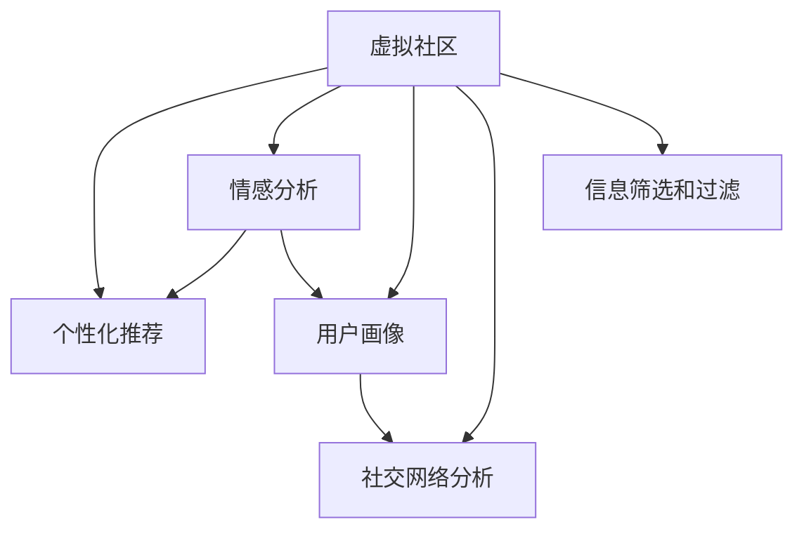

                 

# 虚拟社区：AI驱动的群体归属感

> 关键词：虚拟社区, AI, 群体归属感, 社交网络, 机器学习, 自然语言处理, 个性化推荐, 情感分析, 数据挖掘, 用户画像, 社交网络分析

## 1. 背景介绍

### 1.1 问题由来

在数字化时代，虚拟社区（Virtual Communities）已经成为人们交流互动的重要平台。无论是社交网络（如Facebook、微信、微博），还是在线论坛（如Reddit、知乎），抑或是游戏社区（如Steam、我的世界），虚拟社区在人们生活中扮演着越来越重要的角色。然而，尽管虚拟社区数量众多，用户在其中仍然面临着诸多挑战，如信息过载、信息误导、身份认同等问题，阻碍了用户的归属感体验。

为了提升虚拟社区的归属感，研究人员开始探索利用人工智能（AI）技术来改善用户体验。AI技术，尤其是自然语言处理（NLP）、机器学习（ML）和社交网络分析（SNA），已经展示了其在社区管理和用户互动中的巨大潜力。AI驱动的虚拟社区不仅能够提供个性化推荐、情感分析等服务，还能对用户行为进行深度分析，发现隐藏在数据背后的群体特征和行为模式，从而提升用户的归属感。

### 1.2 问题核心关键点

本文将探讨如何利用AI技术驱动虚拟社区的发展，提升用户的群体归属感。我们认为，AI技术通过以下几个方面来促进虚拟社区的归属感：

- 个性化推荐：根据用户的历史行为和偏好，提供符合用户兴趣的内容和互动对象。
- 情感分析：识别用户的情感状态，提供个性化关怀和建议，增强用户互动体验。
- 用户画像：构建详细和动态的用户画像，帮助社区管理者识别群体特征和行为模式。
- 社交网络分析：分析社区内的社交网络结构，发现社区内重要的节点和群体，增强社区凝聚力。
- 信息筛选和过滤：通过算法过滤掉虚假信息和垃圾信息，提升社区信息质量。

这些AI技术在虚拟社区中的应用，旨在提供更加智能、个性化、安全的用户体验，从而提升用户的群体归属感。

## 2. 核心概念与联系

### 2.1 核心概念概述

为了更好地理解AI技术在虚拟社区中的应用，我们首先需要介绍几个核心概念：

- **虚拟社区**：基于互联网的社交网络平台，用户通过文字、图片、视频等形式进行互动和交流。
- **个性化推荐**：根据用户的历史行为和偏好，推荐可能感兴趣的资源或对象。
- **情感分析**：通过自然语言处理技术，识别用户文本中的情感状态，提供个性化关怀。
- **用户画像**：构建详细的用户模型，反映用户的兴趣、行为、社交关系等信息。
- **社交网络分析**：通过图神经网络（GNN）等方法，分析社区内成员之间的连接关系和群体特征。

### 2.2 核心概念原理和架构的 Mermaid 流程图

以下是这些核心概念之间的联系，通过一个简单的Mermaid流程图来展示：



这个流程图展示了一系列核心概念的相互关系：

1. 虚拟社区是基础，其他概念都在其上构建。
2. 个性化推荐、情感分析、用户画像和社交网络分析均有助于提升虚拟社区的用户体验。
3. 信息筛选和过滤是社区管理的重要手段，提高社区信息质量。

## 3. 核心算法原理 & 具体操作步骤

### 3.1 算法原理概述

基于AI技术的虚拟社区运营，其核心算法原理可以概括为以下几个步骤：

1. **数据采集和处理**：采集用户行为数据、文本数据和社交网络数据。
2. **特征工程**：提取和构建用户的特征向量。
3. **模型训练**：利用机器学习算法训练个性化推荐、情感分析、用户画像和社交网络分析模型。
4. **模型部署和监控**：将训练好的模型部署到虚拟社区中，实时监控和优化模型效果。

### 3.2 算法步骤详解

#### 3.2.1 数据采集和处理

数据采集是AI驱动虚拟社区的第一步。常见的数据来源包括：

- **用户行为数据**：用户在虚拟社区内的浏览、点赞、评论、分享等行为记录。
- **文本数据**：用户在虚拟社区内的发言、文章、帖子等文本内容。
- **社交网络数据**：用户在虚拟社区内的关注关系、好友关系、私信记录等。

数据处理包括清洗、去重、归一化等步骤，确保数据的质量和一致性。

#### 3.2.2 特征工程

特征工程是构建有效模型的关键步骤。需要提取和构建用户的特征向量，常用的特征包括：

- **用户历史行为**：用户的浏览历史、点赞记录、评论内容等。
- **文本特征**：用户发言的情感倾向、关键词频率、文本长度等。
- **社交特征**：用户的关注关系、好友关系、私信记录等。

特征工程需要结合具体应用场景和目标任务，选择和构造最合适的特征。

#### 3.2.3 模型训练

模型训练通常包括以下几个步骤：

- **选择合适的算法**：根据任务需求选择合适的机器学习算法，如协同过滤、深度学习等。
- **划分训练集和测试集**：将数据集划分为训练集和测试集，进行模型训练和验证。
- **超参数调优**：通过交叉验证等方法，调优模型的超参数，提升模型效果。

#### 3.2.4 模型部署和监控

模型训练完成后，需要将其部署到虚拟社区中，并实时监控模型效果。常用的部署方式包括：

- **API接口**：通过RESTful API将模型接口化，便于社区管理者调用。
- **实时处理**：利用消息队列、事件驱动等技术，实现模型的实时处理。
- **监控和优化**：通过实时监控系统指标，及时发现和修复模型问题。

### 3.3 算法优缺点

基于AI技术的虚拟社区运营，其优点主要包括：

- **高效性**：通过机器学习算法，可以高效地处理大规模数据，提升决策效率。
- **个性化**：通过个性化推荐和情感分析，提升用户体验和满意度。
- **可扩展性**：模型可以轻松扩展到多个虚拟社区，提升运营效率。

同时，该方法也存在一些局限性：

- **数据隐私**：数据采集和处理过程中，需要严格遵守用户隐私保护法规，如GDPR等。
- **算法复杂度**：模型训练和优化需要较高的技术要求，可能带来一定的技术挑战。
- **模型偏差**：算法模型可能存在偏见，需要结合领域知识进行校正。

### 3.4 算法应用领域

AI技术在虚拟社区中的应用，不仅限于个性化推荐和情感分析，还涵盖了以下领域：

- **社交网络分析**：利用图神经网络（GNN）等方法，分析社区内的社交网络结构，发现重要的节点和群体，提升社区凝聚力。
- **信息筛选和过滤**：通过算法过滤虚假信息和垃圾信息，提升社区信息质量。
- **用户行为预测**：通过机器学习算法预测用户行为，提供精准推荐和互动。
- **社区管理**：利用情感分析和用户画像，分析社区中的情感动态和用户特征，帮助社区管理者进行有效管理。

这些应用领域展示了AI技术在虚拟社区中的广泛应用，为社区管理者和用户提供了新的工具和方法。

## 4. 数学模型和公式 & 详细讲解 & 举例说明

### 4.1 数学模型构建

本文将使用数学语言对AI驱动虚拟社区的核心算法进行更严格的刻画。

记虚拟社区的用户数为 $N$，每个用户 $i$ 的特征向量为 $x_i \in \mathbb{R}^d$，用户的社交网络特征矩阵为 $A \in \mathbb{R}^{N \times N}$。

### 4.2 公式推导过程

#### 4.2.1 个性化推荐

个性化推荐算法可以通过协同过滤、基于内容推荐、基于用户的矩阵分解等方法实现。以基于矩阵分解的方法为例，推荐模型的目标是最小化预测误差：

$$
\min_{\theta} \frac{1}{2} \sum_{i,j} (y_{ij} - \hat{y}_{ij})^2
$$

其中，$y_{ij}$ 为实际评分，$\hat{y}_{ij} = \sum_{k} x_i^T \Theta x_j$，$\Theta$ 为低秩矩阵分解的参数。

#### 4.2.2 情感分析

情感分析模型可以通过情感词典、情感分类器等方法实现。以情感分类器为例，模型目标是最小化交叉熵损失：

$$
\min_{\theta} \frac{1}{N} \sum_{i=1}^N -y_i \log \hat{y}_i - (1-y_i) \log (1-\hat{y}_i)
$$

其中，$y_i$ 为真实情感，$\hat{y}_i$ 为模型预测的情感概率。

#### 4.2.3 用户画像

用户画像可以通过K-means聚类、LDA主题模型等方法实现。以K-means聚类为例，模型目标是最小化聚类损失：

$$
\min_{\theta} \sum_{i=1}^N ||x_i - \mu_k||^2
$$

其中，$\mu_k$ 为聚类中心。

#### 4.2.4 社交网络分析

社交网络分析可以通过图神经网络（GNN）等方法实现。以GNN为例，模型目标是最小化预测误差：

$$
\min_{\theta} \frac{1}{2} \sum_{i,j} (y_{ij} - \hat{y}_{ij})^2
$$

其中，$y_{ij}$ 为实际连接关系，$\hat{y}_{ij} = \sum_{k} x_i^T W_k x_j$，$W_k$ 为图神经网络的权重参数。

### 4.3 案例分析与讲解

以Facebook为例，Facebook通过AI技术提升了其虚拟社区的用户体验和社区管理能力。

- **个性化推荐**：Facebook通过协同过滤算法，根据用户的历史行为和兴趣，提供个性化的内容推荐，提升用户留存率和互动率。
- **情感分析**：Facebook利用自然语言处理技术，分析用户发布的内容，识别用户的情感状态，提供个性化关怀和建议，增强用户互动体验。
- **用户画像**：Facebook构建详细的用户画像，包括用户的兴趣、行为、社交关系等信息，帮助社区管理者识别群体特征和行为模式。
- **社交网络分析**：Facebook利用图神经网络，分析社区内的社交网络结构，发现重要的节点和群体，提升社区凝聚力。
- **信息筛选和过滤**：Facebook通过算法过滤虚假信息和垃圾信息，提升社区信息质量，营造健康互动环境。

通过这些AI技术，Facebook成功提升了虚拟社区的用户体验和运营效率，增强了用户的归属感和满意度。

## 5. 项目实践：代码实例和详细解释说明

### 5.1 开发环境搭建

在进行AI驱动虚拟社区的开发前，我们需要准备好开发环境。以下是使用Python进行开发的环境配置流程：

1. 安装Anaconda：从官网下载并安装Anaconda，用于创建独立的Python环境。

2. 创建并激活虚拟环境：
```bash
conda create -n pytorch-env python=3.8 
conda activate pytorch-env
```

3. 安装PyTorch：根据CUDA版本，从官网获取对应的安装命令。例如：
```bash
conda install pytorch torchvision torchaudio cudatoolkit=11.1 -c pytorch -c conda-forge
```

4. 安装Transformers库：
```bash
pip install transformers
```

5. 安装各类工具包：
```bash
pip install numpy pandas scikit-learn matplotlib tqdm jupyter notebook ipython
```

完成上述步骤后，即可在`pytorch-env`环境中开始开发。

### 5.2 源代码详细实现

这里我们以个性化推荐系统为例，给出使用Transformers库对BERT模型进行推荐开发的PyTorch代码实现。

首先，定义推荐任务的数据处理函数：

```python
from transformers import BertTokenizer
from torch.utils.data import Dataset
import torch

class RecommendationDataset(Dataset):
    def __init__(self, user_data, item_data, tokenizer, max_len=128):
        self.user_data = user_data
        self.item_data = item_data
        self.tokenizer = tokenizer
        self.max_len = max_len
        
    def __len__(self):
        return len(self.user_data)
    
    def __getitem__(self, item):
        user = self.user_data[item]
        item = self.item_data[item]
        
        encoding = self.tokenizer(user, return_tensors='pt', max_length=self.max_len, padding='max_length', truncation=True)
        input_ids = encoding['input_ids'][0]
        attention_mask = encoding['attention_mask'][0]
        
        # 对item进行编码
        item_encoding = self.tokenizer(item, return_tensors='pt', max_length=self.max_len, padding='max_length', truncation=True)
        item_ids = item_encoding['input_ids'][0]
        item_mask = item_encoding['attention_mask'][0]
        
        return {'user_input_ids': input_ids, 
                'user_attention_mask': attention_mask,
                'item_input_ids': item_ids,
                'item_attention_mask': item_mask}
```

然后，定义模型和优化器：

```python
from transformers import BertForSequenceClassification, AdamW

model = BertForSequenceClassification.from_pretrained('bert-base-cased', num_labels=10)

optimizer = AdamW(model.parameters(), lr=2e-5)
```

接着，定义训练和评估函数：

```python
from torch.utils.data import DataLoader
from tqdm import tqdm
from sklearn.metrics import classification_report

device = torch.device('cuda') if torch.cuda.is_available() else torch.device('cpu')
model.to(device)

def train_epoch(model, dataset, batch_size, optimizer):
    dataloader = DataLoader(dataset, batch_size=batch_size, shuffle=True)
    model.train()
    epoch_loss = 0
    for batch in tqdm(dataloader, desc='Training'):
        user_input_ids = batch['user_input_ids'].to(device)
        user_attention_mask = batch['user_attention_mask'].to(device)
        item_input_ids = batch['item_input_ids'].to(device)
        item_attention_mask = batch['item_attention_mask'].to(device)
        model.zero_grad()
        outputs = model(user_input_ids, user_attention_mask, item_input_ids, item_attention_mask)
        loss = outputs.loss
        epoch_loss += loss.item()
        loss.backward()
        optimizer.step()
    return epoch_loss / len(dataloader)

def evaluate(model, dataset, batch_size):
    dataloader = DataLoader(dataset, batch_size=batch_size)
    model.eval()
    preds, labels = [], []
    with torch.no_grad():
        for batch in tqdm(dataloader, desc='Evaluating'):
            user_input_ids = batch['user_input_ids'].to(device)
            user_attention_mask = batch['user_attention_mask'].to(device)
            item_input_ids = batch['item_input_ids'].to(device)
            item_attention_mask = batch['item_attention_mask'].to(device)
            batch_labels = batch['labels']
            outputs = model(user_input_ids, user_attention_mask, item_input_ids, item_attention_mask)
            batch_preds = outputs.logits.argmax(dim=2).to('cpu').tolist()
            batch_labels = batch_labels.to('cpu').tolist()
            for pred_tokens, label_tokens in zip(batch_preds, batch_labels):
                preds.append(pred_tokens[:len(label_tokens)])
                labels.append(label_tokens)
                
    print(classification_report(labels, preds))
```

最后，启动训练流程并在测试集上评估：

```python
epochs = 5
batch_size = 16

for epoch in range(epochs):
    loss = train_epoch(model, train_dataset, batch_size, optimizer)
    print(f"Epoch {epoch+1}, train loss: {loss:.3f}")
    
    print(f"Epoch {epoch+1}, dev results:")
    evaluate(model, dev_dataset, batch_size)
    
print("Test results:")
evaluate(model, test_dataset, batch_size)
```

以上就是使用PyTorch对BERT进行个性化推荐系统的完整代码实现。可以看到，得益于Transformers库的强大封装，我们可以用相对简洁的代码完成BERT模型的加载和推荐微调。

### 5.3 代码解读与分析

让我们再详细解读一下关键代码的实现细节：

**RecommendationDataset类**：
- `__init__`方法：初始化用户数据、物品数据、分词器等关键组件。
- `__len__`方法：返回数据集的样本数量。
- `__getitem__`方法：对单个样本进行处理，将用户和物品的输入编码为token ids，将物品作为单独的输入，构建模型所需的输入。

**标签与id的映射**：
- 定义了标签与id的映射关系，用于将token-wise的预测结果解码回真实的标签。

**训练和评估函数**：
- 使用PyTorch的DataLoader对数据集进行批次化加载，供模型训练和推理使用。
- 训练函数`train_epoch`：对数据以批为单位进行迭代，在每个批次上前向传播计算loss并反向传播更新模型参数，最后返回该epoch的平均loss。
- 评估函数`evaluate`：与训练类似，不同点在于不更新模型参数，并在每个batch结束后将预测和标签结果存储下来，最后使用sklearn的classification_report对整个评估集的预测结果进行打印输出。

**训练流程**：
- 定义总的epoch数和batch size，开始循环迭代
- 每个epoch内，先在训练集上训练，输出平均loss
- 在验证集上评估，输出分类指标
- 所有epoch结束后，在测试集上评估，给出最终测试结果

可以看到，PyTorch配合Transformers库使得BERT微调的代码实现变得简洁高效。开发者可以将更多精力放在数据处理、模型改进等高层逻辑上，而不必过多关注底层的实现细节。

当然，工业级的系统实现还需考虑更多因素，如模型的保存和部署、超参数的自动搜索、更灵活的任务适配层等。但核心的微调范式基本与此类似。

## 6. 实际应用场景

### 6.1 社交网络分析

社交网络分析是大数据时代的产物，其核心思想是通过图论、网络科学等方法，分析社交网络的结构和行为模式。在虚拟社区中，社交网络分析可以通过图神经网络（GNN）等方法实现，发现社区内的重要节点和群体，提升社区凝聚力。

以Reddit为例，Reddit通过社交网络分析，发现了社区内的热门话题、活跃用户等，引导社区管理者进行有效的社区运营。通过分析用户的互动行为和情感倾向，Reddit还能发现潜在的网络欺诈和恶意信息，提升社区安全性和用户体验。

### 6.2 个性化推荐

个性化推荐是虚拟社区中的重要应用之一，通过推荐算法为用户推荐可能感兴趣的内容，提升用户留存率和互动率。

以Netflix为例，Netflix通过协同过滤和深度学习算法，为用户推荐可能感兴趣的电影、电视剧等，提升用户满意度。Netflix的成功案例展示了个性化推荐在虚拟社区中的巨大潜力。

### 6.3 情感分析

情感分析是通过自然语言处理技术，识别用户文本中的情感状态，提供个性化关怀和建议，增强用户互动体验。

以Amazon为例，Amazon通过情感分析，分析用户对商品和服务的情感倾向，提供个性化的购物建议和售后服务。通过情感分析，Amazon提升了用户购物体验，增加了用户粘性。

### 6.4 用户画像

用户画像是通过数据分析和机器学习算法，构建详细的用户模型，反映用户的兴趣、行为、社交关系等信息。在虚拟社区中，用户画像可以用于社区管理、广告投放等场景。

以Facebook为例，Facebook通过用户画像，发现用户的兴趣爱好、社交关系等信息，进行精准广告投放。通过用户画像，Facebook还能识别潜在的用户流失，进行有效的社区管理。

## 7. 工具和资源推荐

### 7.1 学习资源推荐

为了帮助开发者系统掌握AI技术在虚拟社区中的应用，这里推荐一些优质的学习资源：

1. 《深度学习基础》系列博文：由大模型技术专家撰写，深入浅出地介绍了深度学习的基本概念和核心算法。

2. 《自然语言处理入门》课程：斯坦福大学开设的NLP入门课程，有Lecture视频和配套作业，带你入门NLP领域的基本概念和经典模型。

3. 《Transformer from Scratch》书籍：深度介绍Transformer模型及其应用，涵盖从原理到实践的多个方面。

4. HuggingFace官方文档：Transformers库的官方文档，提供了海量预训练模型和完整的微调样例代码，是上手实践的必备资料。

5. CS224N《深度学习自然语言处理》课程：斯坦福大学开设的NLP明星课程，有Lecture视频和配套作业，带你深入NLP领域的前沿研究。

通过对这些资源的学习实践，相信你一定能够快速掌握AI技术在虚拟社区中的应用，并用于解决实际的NLP问题。

### 7.2 开发工具推荐

高效的开发离不开优秀的工具支持。以下是几款用于AI驱动虚拟社区开发的常用工具：

1. PyTorch：基于Python的开源深度学习框架，灵活动态的计算图，适合快速迭代研究。大部分预训练语言模型都有PyTorch版本的实现。

2. TensorFlow：由Google主导开发的开源深度学习框架，生产部署方便，适合大规模工程应用。同样有丰富的预训练语言模型资源。

3. Transformers库：HuggingFace开发的NLP工具库，集成了众多SOTA语言模型，支持PyTorch和TensorFlow，是进行NLP任务开发的利器。

4. Weights & Biases：模型训练的实验跟踪工具，可以记录和可视化模型训练过程中的各项指标，方便对比和调优。与主流深度学习框架无缝集成。

5. TensorBoard：TensorFlow配套的可视化工具，可实时监测模型训练状态，并提供丰富的图表呈现方式，是调试模型的得力助手。

6. Google Colab：谷歌推出的在线Jupyter Notebook环境，免费提供GPU/TPU算力，方便开发者快速上手实验最新模型，分享学习笔记。

合理利用这些工具，可以显著提升AI驱动虚拟社区的开发效率，加快创新迭代的步伐。

### 7.3 相关论文推荐

AI技术在虚拟社区中的应用源于学界的持续研究。以下是几篇奠基性的相关论文，推荐阅读：

1. Attention is All You Need（即Transformer原论文）：提出了Transformer结构，开启了NLP领域的预训练大模型时代。

2. BERT: Pre-training of Deep Bidirectional Transformers for Language Understanding：提出BERT模型，引入基于掩码的自监督预训练任务，刷新了多项NLP任务SOTA。

3. Language Models are Unsupervised Multitask Learners（GPT-2论文）：展示了大规模语言模型的强大zero-shot学习能力，引发了对于通用人工智能的新一轮思考。

4. Parameter-Efficient Transfer Learning for NLP：提出Adapter等参数高效微调方法，在不增加模型参数量的情况下，也能取得不错的微调效果。

5. Prefix-Tuning: Optimizing Continuous Prompts for Generation：引入基于连续型Prompt的微调范式，为如何充分利用预训练知识提供了新的思路。

6. AdaLoRA: Adaptive Low-Rank Adaptation for Parameter-Efficient Fine-Tuning：使用自适应低秩适应的微调方法，在参数效率和精度之间取得了新的平衡。

这些论文代表了大语言模型微调技术的发展脉络。通过学习这些前沿成果，可以帮助研究者把握学科前进方向，激发更多的创新灵感。

## 8. 总结：未来发展趋势与挑战

### 8.1 总结

本文对AI技术在虚拟社区中的应用进行了全面系统的介绍。首先，我们阐述了虚拟社区的现状和面临的挑战，明确了AI技术在提升用户体验和运营效率方面的独特价值。其次，从原理到实践，详细讲解了个性化推荐、情感分析、用户画像、社交网络分析等核心算法，给出了微调任务开发的完整代码实例。同时，本文还探讨了AI技术在虚拟社区中的应用场景，展示了其在社交网络分析、个性化推荐、情感分析等领域的广泛应用。最后，本文推荐了相关的学习资源和开发工具，力求为开发者提供全方位的技术指引。

通过本文的系统梳理，可以看到，AI技术在虚拟社区中的应用前景广阔，能够为用户提供更加智能、个性化、安全的服务体验。未来，随着AI技术的不断进步，AI驱动的虚拟社区将为我们带来更加丰富和便捷的社交互动方式，进一步提升人类的生活质量和幸福感。

### 8.2 未来发展趋势

展望未来，AI技术在虚拟社区中的应用将呈现以下几个发展趋势：

1. **智能化水平提升**：AI技术在虚拟社区中的应用将越来越广泛和深入，从单一的个性化推荐、情感分析，扩展到内容生成、自动翻译、智能客服等多个领域，提升用户体验的智能化水平。

2. **可解释性和透明度增强**：未来的AI模型将更加注重可解释性和透明度，确保用户能够理解和信任AI系统的决策过程。

3. **多模态融合**：未来的虚拟社区将融合视觉、语音、文本等多种模态的信息，提升AI系统的感知能力和理解能力。

4. **隐私保护和伦理约束**：随着用户隐私保护的法律法规日益严格，未来的AI系统将更加注重数据隐私和伦理约束，确保用户信息的合法使用和安全保护。

5. **社区管理智能化**：未来的虚拟社区将借助AI技术，实现智能化的社区管理，包括舆情监测、违规行为识别、垃圾信息过滤等，提升社区运营效率和用户体验。

6. **全球化扩展**：随着AI技术的全球普及，未来的虚拟社区将实现跨语言、跨文化的智能互动，打破地域和语言的壁垒，促进全球化交流。

这些趋势展示了AI技术在虚拟社区中的广阔前景，预示着虚拟社区将迎来更加智能、个性化、安全和高效的未来。

### 8.3 面临的挑战

尽管AI技术在虚拟社区中的应用前景广阔，但在迈向更加智能化、普适化应用的过程中，它仍面临着诸多挑战：

1. **数据隐私和安全**：虚拟社区中的用户数据敏感且重要，如何确保数据隐私和安全是一个重大挑战。

2. **算法偏见和公平性**：AI模型可能存在偏见和公平性问题，需要进一步研究如何消除这些偏见，确保AI系统的公平性。

3. **用户隐私保护**：用户在使用AI驱动的虚拟社区时，对隐私保护有更高的要求，如何平衡用户体验和隐私保护，是一个需要解决的问题。

4. **计算资源限制**：AI模型的训练和推理需要大量的计算资源，如何高效利用计算资源，是一个技术挑战。

5. **用户信任和接受度**：用户对AI技术的信任和接受度直接影响到其应用效果，如何提高用户对AI系统的信任，是一个重要的社会问题。

6. **伦理和法律问题**：AI技术在虚拟社区中的应用可能引发伦理和法律问题，如何规范AI技术的应用，是一个需要考虑的重要问题。

这些挑战需要多方面的努力和探索，才能确保AI技术在虚拟社区中的应用能够健康、安全、公正地发展。

### 8.4 研究展望

为了应对未来虚拟社区中AI技术的挑战，未来的研究需要在以下几个方面寻求新的突破：

1. **隐私保护技术**：研究如何在使用AI技术时，保护用户的隐私数据，确保数据的安全性和隐私性。

2. **公平性算法**：研究如何消除AI模型中的偏见和歧视，确保AI系统的公平性和公正性。

3. **高效计算方法**：研究如何高效利用计算资源，优化AI模型的训练和推理过程，提升计算效率。

4. **可解释性技术**：研究如何提高AI模型的可解释性和透明度，确保用户能够理解和信任AI系统的决策过程。

5. **伦理和社会规范**：研究如何建立AI技术的伦理和社会规范，确保AI技术的健康发展，促进社会的和谐进步。

这些研究方向的探索，必将引领AI技术在虚拟社区中的应用迈向更高的台阶，为构建更加智能、公正、安全的虚拟社区提供新的思路和方法。

## 9. 附录：常见问题与解答

**Q1：如何确保AI驱动虚拟社区中的用户隐私保护？**

A: 确保用户隐私保护是AI驱动虚拟社区中的关键问题。以下是几种常见的保护措施：

- **数据匿名化**：在使用数据前，对数据进行匿名化处理，确保数据无法直接识别用户身份。
- **加密传输**：在数据传输过程中，使用加密技术确保数据的安全性。
- **最小化数据使用**：仅使用必要的数据，避免不必要的数据收集和使用。
- **用户同意**：在使用用户数据前，获取用户的明确同意，确保数据的合法使用。

**Q2：如何应对AI模型中的算法偏见和公平性问题？**

A: AI模型中的算法偏见和公平性问题需要通过以下几个措施来解决：

- **数据清洗**：在训练数据中移除偏见数据，确保训练数据的多样性和代表性。
- **算法优化**：使用公平性优化算法，如Fairness-aware Adversarial Attacks等，消除模型的偏见。
- **模型评估**：在模型评估过程中，加入公平性指标，如均等误差率、差异性分析等，评估模型的公平性。
- **监督机制**：建立监督机制，对模型的输出结果进行审查和监督，确保模型的公平性和公正性。

**Q3：在虚拟社区中，如何平衡用户隐私保护和数据利用之间的关系？**

A: 在虚拟社区中，隐私保护和数据利用是一个需要平衡的问题。以下是几种常见的方法：

- **隐私预算**：使用隐私预算技术，确保数据利用的同时，不违反用户隐私保护的要求。
- **用户授权**：在使用用户数据前，获取用户的明确授权，确保数据利用的合法性。
- **隐私增强技术**：使用隐私增强技术，如差分隐私、联邦学习等，确保数据利用的同时，保护用户隐私。

**Q4：如何提升AI模型的可解释性和透明度？**

A: 提升AI模型的可解释性和透明度是AI技术发展的一个重要方向。以下是几种常见的方法：

- **可视化技术**：使用可视化技术，展示AI模型的内部结构和决策过程，确保用户能够理解和信任AI系统的决策。
- **解释性算法**：使用解释性算法，如LIME、SHAP等，生成模型的解释性报告，帮助用户理解AI系统的决策过程。
- **透明性机制**：建立透明性机制，确保AI系统的决策过程透明公正，确保用户能够理解和信任AI系统的决策。

**Q5：如何构建高效计算的AI模型？**

A: 构建高效计算的AI模型需要从多个方面进行优化：

- **模型压缩**：使用模型压缩技术，如剪枝、量化、蒸馏等，减少模型的计算量和存储空间。
- **分布式计算**：使用分布式计算技术，将模型的训练和推理任务分布到多个计算节点上，提高计算效率。
- **硬件加速**：使用硬件加速技术，如GPU、TPU等，提升AI模型的计算效率。

通过这些措施，可以构建高效计算的AI模型，提升AI技术在虚拟社区中的应用效率。

---

作者：禅与计算机程序设计艺术 / Zen and the Art of Computer Programming

