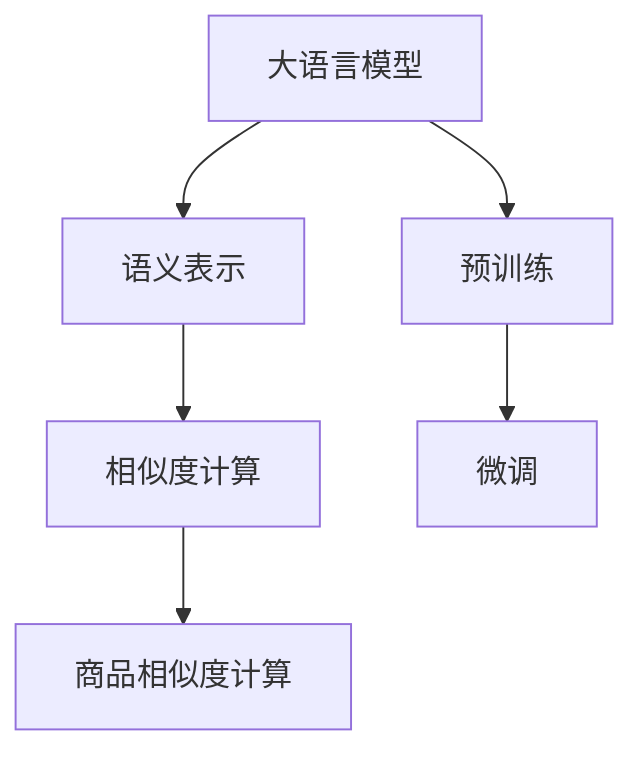

                 

# 融合AI大模型的商品相似度计算方法

## 1. 背景介绍

在电商领域，商品推荐和搜索系统是提高用户体验、提升销售转化率的关键技术。通过智能地匹配用户和商品，推荐系统可以大幅提高用户购买效率，降低选择难度。传统的推荐算法如协同过滤、基于内容的推荐等，依赖于用户行为或商品属性进行推荐，难以适应复杂的用户需求和商品变化。而融合人工智能大模型的推荐方法，通过学习用户和商品的语义表示，能够更全面、深入地理解用户和商品的关系，显著提升推荐效果。

在大模型推荐系统中，计算商品相似度是推荐算法的重要组成部分。传统的商品相似度计算方法，如余弦相似度、皮尔逊相关系数等，已经广泛应用。但这些方法往往基于简单的向量点积，难以充分挖掘商品的复杂语义关系。而融合AI大模型的商品相似度计算方法，通过将大模型的语义表示引入到相似度计算中，能够更加全面地刻画商品之间的语义相似性，从而提升推荐系统的效果。

## 2. 核心概念与联系

### 2.1 核心概念概述

为了更好地理解融合AI大模型的商品相似度计算方法，本节将介绍几个密切相关的核心概念：

- **大语言模型(LLM)**：一种基于神经网络的语言模型，能够理解、生成自然语言文本。通过大规模无监督学习，大语言模型学习到了丰富的语言知识和常识，具备强大的语义表示能力。
- **语义表示**：指将自然语言文本映射到低维向量空间的过程，使得文本在向量空间中具有可比较的语义相似性。语义表示是计算商品相似度的基础。
- **相似度计算**：用于衡量两个样本之间的相似程度，常见的有余弦相似度、皮尔逊相关系数、Jaccard相似度等。
- **预训练**：指在大规模无标注数据上，通过自监督任务训练大语言模型的过程。预训练使得模型学习到通用的语言表示，可用于后续的微调和任务适配。
- **微调(Fine-Tuning)**：指在预训练模型的基础上，使用特定任务的数据集，通过有监督学习优化模型在特定任务上的性能。微调可以将大语言模型的通用能力细化为特定领域的能力。

这些核心概念之间的逻辑关系可以通过以下Mermaid流程图来展示：



这个流程图展示了大语言模型到商品相似度计算的整个流程：

1. 大语言模型通过预训练学习通用的语言表示。
2. 通过微调将大语言模型的通用能力细化为特定领域的能力。
3. 使用语义表示对商品进行表示，引入大模型的语义能力。
4. 计算商品之间的相似度，进行推荐排序。

## 3. 核心算法原理 & 具体操作步骤

### 3.1 算法原理概述

融合AI大模型的商品相似度计算方法，核心思想是：将大语言模型在预训练时学到的语义表示引入到商品表示中，然后基于语义表示计算商品之间的相似度。具体来说，包括以下几个步骤：

1. **预训练**：使用大规模无标注数据，训练大语言模型，学习通用的语义表示。
2. **微调**：根据推荐系统的任务，选择适当的数据集，对大语言模型进行微调，使其能够适应推荐系统的需求。
3. **语义表示**：使用微调后的大语言模型，对商品进行语义表示，得到商品在向量空间中的表示。
4. **相似度计算**：基于商品向量表示，计算商品之间的相似度，排序选择推荐的商品。

### 3.2 算法步骤详解

**Step 1: 预训练大语言模型**

使用大规模无标注数据集，训练大语言模型，学习通用的语言表示。常用的预训练任务包括语言建模、掩码语言模型等。预训练过程使用自监督学习方法，最大化模型在任务上的预测准确率，从而学习到语言的统计规律和语义信息。

**Step 2: 选择合适的微调任务**

根据推荐系统的需求，选择适当的微调任务。常见的微调任务包括基于深度学习模型的协同过滤、基于内容的推荐等。选择任务时需要考虑数据的特性和推荐的场景，如基于用户行为数据的推荐、基于商品属性特征的推荐等。

**Step 3: 训练微调后的模型**

使用特定领域的标注数据集，对预训练模型进行微调，训练得到微调后的模型。微调过程一般使用有监督学习方法，最大化模型在标注数据上的预测准确率，从而将模型细化为特定领域的能力。

**Step 4: 计算商品语义表示**

使用微调后的模型，对商品进行语义表示。常用的语义表示方法包括Word2Vec、GloVe等词嵌入方法，以及BERT、GPT等预训练模型的语义表示。语义表示的计算过程是将商品的文本描述输入模型，得到商品在向量空间中的表示。

**Step 5: 计算商品相似度**

基于商品向量表示，计算商品之间的相似度。常见的相似度计算方法包括余弦相似度、皮尔逊相关系数等。计算过程是将商品向量表示两两比较，计算它们的相似度分数，排序选择推荐的商品。

### 3.3 算法优缺点

融合AI大模型的商品相似度计算方法，具有以下优点：

1. **丰富的语义信息**：大语言模型通过预训练和微调，学习到丰富的语言知识和语义信息，能够更好地刻画商品之间的语义关系。
2. **自适应性强**：大语言模型能够自适应不同的推荐场景，如基于用户行为数据的推荐、基于商品属性特征的推荐等。
3. **性能提升显著**：在推荐系统中引入语义表示，能够显著提升推荐的准确性和相关性。
4. **灵活性高**：可以通过调整预训练和微调任务，适应不同的推荐需求。

同时，该方法也存在一些局限性：

1. **计算开销大**：大语言模型具有较大的模型参数，计算复杂度高，对硬件资源要求高。
2. **泛化能力不足**：预训练和微调过程中，可能存在过拟合现象，导致模型泛化能力不足。
3. **训练成本高**：需要大规模标注数据和计算资源，训练成本高。
4. **数据依赖性强**：推荐系统的效果依赖于数据的质量和特性，数据质量不足时，推荐效果可能不佳。

尽管存在这些局限性，但就目前而言，融合AI大模型的商品相似度计算方法仍是推荐系统中重要的技术范式之一。

### 3.4 算法应用领域

融合AI大模型的商品相似度计算方法，已经在多个电商领域得到应用，包括：

- 商品推荐：根据用户行为数据和商品属性，推荐符合用户兴趣的商品。
- 搜索系统：根据用户搜索词，推荐相关商品。
- 广告投放：根据用户行为和商品属性，推荐相关广告。
- 智能客服：根据用户问题，推荐相关商品。

除了这些电商领域，融合AI大模型的商品相似度计算方法在社交网络、内容推荐、金融投资等领域也有广泛的应用前景。

## 4. 数学模型和公式 & 详细讲解 & 举例说明

### 4.1 数学模型构建

设大语言模型为 $M_{\theta}$，其中 $\theta$ 为模型参数。设商品 $i$ 的文本描述为 $d_i$，经过微调后的大语言模型输出的商品向量表示为 $\overrightarrow{v_i}$。商品之间的相似度可以通过余弦相似度公式计算：

$$
\text{similarity}_{ij} = \frac{\overrightarrow{v_i} \cdot \overrightarrow{v_j}}{\|\overrightarrow{v_i}\|\|\overrightarrow{v_j}\|}
$$

其中 $\cdot$ 表示向量点积，$\|\cdot\|$ 表示向量范数。

### 4.2 公式推导过程

以余弦相似度为例，推导其计算过程如下：

1. **预训练过程**：
   设预训练大语言模型的语义表示函数为 $f(d)$，其中 $d$ 为商品的文本描述。预训练大语言模型学习到语言的统计规律和语义信息，能够将自然语言文本映射到低维向量空间。

2. **微调过程**：
   设微调任务为推荐系统，标注数据集为 $D=\{(x_i, y_i)\}_{i=1}^N$，其中 $x_i$ 为商品文本描述，$y_i$ 为推荐标签。微调过程使用有监督学习方法，最大化模型在标注数据上的预测准确率，从而将模型细化为特定领域的能力。

3. **语义表示计算**：
   设微调后的模型为 $M_{\theta^*}$，对商品 $i$ 的文本描述 $d_i$ 进行语义表示，得到商品向量表示 $\overrightarrow{v_i} = f(d_i)$。

4. **相似度计算**：
   计算商品 $i$ 和商品 $j$ 之间的相似度，公式为：

   $$
   \text{similarity}_{ij} = \frac{\overrightarrow{v_i} \cdot \overrightarrow{v_j}}{\|\overrightarrow{v_i}\|\|\overrightarrow{v_j}\|}
   $$

   其中 $\cdot$ 表示向量点积，$\|\cdot\|$ 表示向量范数。

### 4.3 案例分析与讲解

以电子商务中的商品推荐为例，详细分析融合AI大模型的商品相似度计算过程：

1. **预训练大语言模型**：
   使用大规模无标注数据集，如Wikipedia、维基百科等，训练BERT、GPT等大语言模型，学习通用的语言表示。

2. **选择微调任务**：
   根据推荐系统的需求，选择适当的微调任务，如基于用户行为数据的协同过滤、基于商品属性特征的推荐等。

3. **训练微调后的模型**：
   使用特定领域的标注数据集，如电商商品数据，对BERT等大语言模型进行微调，训练得到微调后的模型。微调过程中，调整模型的预测目标，使其能够适应推荐系统的需求。

4. **计算商品语义表示**：
   使用微调后的模型，对商品进行语义表示，得到商品在向量空间中的表示。如使用BERT模型，将商品描述输入模型，得到商品的向量表示 $\overrightarrow{v_i}$。

5. **计算商品相似度**：
   计算商品之间的相似度，排序选择推荐的商品。使用余弦相似度公式，计算商品之间的相似度，选择与用户兴趣最相关的商品进行推荐。

## 5. 项目实践：代码实例和详细解释说明

### 5.1 开发环境搭建

在进行商品相似度计算实践前，我们需要准备好开发环境。以下是使用Python进行PyTorch开发的环境配置流程：

1. 安装Anaconda：从官网下载并安装Anaconda，用于创建独立的Python环境。

2. 创建并激活虚拟环境：
```bash
conda create -n pytorch-env python=3.8 
conda activate pytorch-env
```

3. 安装PyTorch：根据CUDA版本，从官网获取对应的安装命令。例如：
```bash
conda install pytorch torchvision torchaudio cudatoolkit=11.1 -c pytorch -c conda-forge
```

4. 安装相关库：
```bash
pip install transformers
pip install torchtext
pip install pandas numpy scikit-learn
```

5. 安装TensorBoard：用于可视化模型训练过程，帮助调试和优化模型。

```bash
pip install tensorboard
```

完成上述步骤后，即可在`pytorch-env`环境中开始商品相似度计算实践。

### 5.2 源代码详细实现

下面我们以推荐系统为例，给出使用PyTorch和Transformer库进行商品相似度计算的代码实现。

```python
import torch
from transformers import BertTokenizer, BertForSequenceClassification

# 初始化模型和分词器
model = BertForSequenceClassification.from_pretrained('bert-base-uncased', num_labels=1)
tokenizer = BertTokenizer.from_pretrained('bert-base-uncased')

# 设置模型参数
device = torch.device('cuda' if torch.cuda.is_available() else 'cpu')
model.to(device)

# 定义商品表示函数
def encode_product(product_text):
    input_ids = tokenizer(product_text, return_tensors='pt', padding='max_length', truncation=True, max_length=512).to(device)
    with torch.no_grad():
        features = model(input_ids).last_hidden_state
        return features[:, 0, :].detach().cpu().numpy()

# 定义相似度计算函数
def compute_similarity(product1, product2):
    v1 = encode_product(product1)
    v2 = encode_product(product2)
    return torch.cosine_similarity(v1, v2)

# 示例商品
products = ['iPhone 12', 'iPad Pro', 'MacBook Air', 'AirPods Pro']

# 计算商品之间的相似度
similarity_matrix = torch.zeros(len(products), len(products))
for i in range(len(products)):
    for j in range(len(products)):
        similarity_matrix[i][j] = compute_similarity(products[i], products[j])

# 可视化相似度矩阵
import matplotlib.pyplot as plt
plt.imshow(similarity_matrix.numpy(), cmap='hot', interpolation='nearest')
plt.colorbar()
plt.show()
```

在这个示例中，我们使用了BERT模型作为商品语义表示的计算模型，通过调用`BertForSequenceClassification`模型进行编码，得到商品的向量表示。使用`torch.cosine_similarity`函数计算商品之间的相似度，得到一个相似度矩阵。最后通过Matplotlib绘制相似度矩阵的可视化图。

### 5.3 代码解读与分析

让我们再详细解读一下关键代码的实现细节：

**商品表示函数**：
- 首先，使用`BertTokenizer`对商品描述进行分词和编码，生成输入序列。
- 接着，将输入序列输入`BertForSequenceClassification`模型，得到模型输出的特征向量。
- 最后，返回模型输出的特征向量，作为商品的向量表示。

**相似度计算函数**：
- 计算商品1和商品2的向量表示，使用`torch.cosine_similarity`函数计算余弦相似度，得到两个商品之间的相似度分数。

**示例商品**：
- 定义几个示例商品，用于计算相似度。

**计算相似度矩阵**：
- 使用嵌套循环计算商品之间的相似度，得到一个相似度矩阵。

**可视化相似度矩阵**：
- 使用Matplotlib可视化相似度矩阵，通过颜色变化展示相似度的高低。

可以看出，通过融合AI大模型的商品相似度计算方法，可以更好地刻画商品之间的语义关系，提升推荐系统的性能。

## 6. 实际应用场景

### 6.1 智能推荐

融合AI大模型的商品相似度计算方法，已经在智能推荐系统中得到广泛应用。通过学习商品和用户的语义表示，推荐系统能够更准确地匹配用户和商品，提高推荐的相关性和用户满意度。

在技术实现上，可以将商品的文本描述输入大语言模型，得到商品的向量表示。然后基于商品向量表示计算相似度，排序选择推荐的商品。此外，还可以根据用户的搜索历史、点击记录等行为数据，对商品进行动态调整和个性化推荐。

### 6.2 搜索引擎

在搜索引擎中，融合AI大模型的商品相似度计算方法也可以发挥重要作用。通过学习商品和查询语句的语义表示，搜索引擎能够更好地匹配查询语句和商品，提高搜索结果的相关性和用户满意度。

在技术实现上，可以将查询语句输入大语言模型，得到查询向量表示。然后计算查询向量表示和商品向量表示的相似度，选择与查询语句最相关的商品进行展示。此外，还可以根据用户的行为数据和历史搜索记录，对搜索结果进行动态调整和个性化展示。

### 6.3 广告投放

融合AI大模型的商品相似度计算方法，也可以用于广告投放的优化。通过学习商品和广告的语义表示，广告投放系统能够更好地匹配用户和广告，提高广告的点击率和转化率。

在技术实现上，可以将广告的文本描述输入大语言模型，得到广告的向量表示。然后计算广告向量表示和商品向量表示的相似度，选择与商品最相关的广告进行投放。此外，还可以根据用户的搜索历史和行为数据，对广告进行动态调整和个性化投放。

### 6.4 未来应用展望

随着AI大模型的不断发展，融合AI大模型的商品相似度计算方法将有更大的应用前景：

1. **多模态融合**：未来的商品相似度计算方法将更多地融合图像、视频等多模态数据，全面刻画商品的特征和语义。
2. **跨语言处理**：未来的商品相似度计算方法将更多地支持跨语言处理，能够处理多种语言的商品数据。
3. **动态更新**：未来的商品相似度计算方法将更加注重动态更新，能够实时处理用户行为数据和商品变化，保持推荐系统的时效性。
4. **个性化推荐**：未来的商品相似度计算方法将更加注重个性化推荐，能够根据用户的个性化需求和行为特征，提供更加精准的推荐。
5. **公平性和可解释性**：未来的商品相似度计算方法将更加注重公平性和可解释性，能够保证推荐系统的透明性和公正性，避免偏见和歧视。

这些应用趋势展示了融合AI大模型的商品相似度计算方法未来的广阔前景。随着技术的不断进步，该方法将在更多的领域得到应用，带来更深刻的影响。

## 7. 工具和资源推荐

### 7.1 学习资源推荐

为了帮助开发者系统掌握融合AI大模型的商品相似度计算方法，这里推荐一些优质的学习资源：

1. **自然语言处理与深度学习**：斯坦福大学自然语言处理课程，涵盖了NLP的基础概念和前沿技术，包括预训练大语言模型和微调等。
2. **Transformers库官方文档**：HuggingFace发布的官方文档，提供了丰富的预训练模型和微调示例代码，是上手实践的必备资料。
3. **TensorFlow官方文档**：TensorFlow的官方文档，提供了深度学习模型的实现方法和API接口，适合进一步学习和应用。
4. **深度学习入门**：吴恩达的Coursera课程，讲解了深度学习的基础知识和经典模型，适合初学者系统学习。

通过学习这些资源，相信你一定能够快速掌握融合AI大模型的商品相似度计算方法，并用于解决实际的推荐问题。

### 7.2 开发工具推荐

高效的开发离不开优秀的工具支持。以下是几款用于融合AI大模型商品相似度计算开发的常用工具：

1. **PyTorch**：基于Python的开源深度学习框架，灵活动态的计算图，适合快速迭代研究。
2. **TensorFlow**：由Google主导开发的开源深度学习框架，生产部署方便，适合大规模工程应用。
3. **HuggingFace Transformers库**：集成了众多预训练语言模型，支持PyTorch和TensorFlow，是微调任务开发的利器。
4. **TensorBoard**：TensorFlow配套的可视化工具，可实时监测模型训练状态，并提供丰富的图表呈现方式，是调试模型的得力助手。

合理利用这些工具，可以显著提升商品相似度计算任务的开发效率，加快创新迭代的步伐。

### 7.3 相关论文推荐

融合AI大模型的商品相似度计算方法，已经在众多研究论文中得到了深入探讨。以下是几篇奠基性的相关论文，推荐阅读：

1. **大语言模型在推荐系统中的应用**：该论文介绍了大语言模型在推荐系统中的作用，以及如何利用大语言模型进行商品相似度计算和推荐。
2. **基于深度学习的商品推荐系统**：该论文介绍了基于深度学习模型的协同过滤、基于内容的推荐等方法，以及如何利用大语言模型提升推荐效果。
3. **基于知识图谱的推荐系统**：该论文介绍了如何将知识图谱与深度学习模型结合，构建更全面、精准的推荐系统。
4. **基于多模态数据融合的推荐系统**：该论文介绍了如何将文本、图像、视频等多模态数据融合，构建更全面的商品相似度计算方法。

这些论文代表了大语言模型商品相似度计算方法的发展脉络。通过学习这些前沿成果，可以帮助研究者把握学科前进方向，激发更多的创新灵感。

## 8. 总结：未来发展趋势与挑战

### 8.1 总结

本文对融合AI大模型的商品相似度计算方法进行了全面系统的介绍。首先阐述了融合AI大模型的商品相似度计算方法的研究背景和意义，明确了该方法在推荐系统中的重要作用。其次，从原理到实践，详细讲解了融合AI大模型的商品相似度计算过程，给出了商品相似度计算的完整代码实例。同时，本文还广泛探讨了该方法在智能推荐、搜索引擎、广告投放等多个领域的应用前景，展示了融合AI大模型的商品相似度计算方法的巨大潜力。此外，本文精选了融合AI大模型的商品相似度计算方法的学习资源，力求为读者提供全方位的技术指引。

通过本文的系统梳理，可以看到，融合AI大模型的商品相似度计算方法在推荐系统中具有重要地位，能够通过学习商品和用户的语义表示，更全面、深入地理解用户和商品的关系，显著提升推荐系统的效果。未来，随着预训练语言模型的不断进步，商品相似度计算方法将有更大的提升空间，为推荐系统带来更精准、更高效的商品匹配。

### 8.2 未来发展趋势

展望未来，融合AI大模型的商品相似度计算方法将呈现以下几个发展趋势：

1. **多模态融合**：未来的商品相似度计算方法将更多地融合图像、视频等多模态数据，全面刻画商品的特征和语义。
2. **跨语言处理**：未来的商品相似度计算方法将更多地支持跨语言处理，能够处理多种语言的商品数据。
3. **动态更新**：未来的商品相似度计算方法将更加注重动态更新，能够实时处理用户行为数据和商品变化，保持推荐系统的时效性。
4. **个性化推荐**：未来的商品相似度计算方法将更加注重个性化推荐，能够根据用户的个性化需求和行为特征，提供更加精准的推荐。
5. **公平性和可解释性**：未来的商品相似度计算方法将更加注重公平性和可解释性，能够保证推荐系统的透明性和公正性，避免偏见和歧视。

以上趋势凸显了融合AI大模型的商品相似度计算方法在推荐系统中的重要作用和广阔前景。这些方向的探索发展，必将进一步提升推荐系统的效果和应用范围，为电商行业带来更深刻的影响。

### 8.3 面临的挑战

尽管融合AI大模型的商品相似度计算方法已经取得了瞩目成就，但在迈向更加智能化、普适化应用的过程中，它仍面临诸多挑战：

1. **计算开销大**：大语言模型具有较大的模型参数，计算复杂度高，对硬件资源要求高。
2. **泛化能力不足**：预训练和微调过程中，可能存在过拟合现象，导致模型泛化能力不足。
3. **训练成本高**：需要大规模标注数据和计算资源，训练成本高。
4. **数据依赖性强**：推荐系统的效果依赖于数据的质量和特性，数据质量不足时，推荐效果可能不佳。

尽管存在这些挑战，但就目前而言，融合AI大模型的商品相似度计算方法仍是推荐系统中重要的技术范式之一。未来需要从算法、数据、硬件等多个维度进行优化，才能进一步提升推荐系统的性能。

### 8.4 研究展望

面对融合AI大模型的商品相似度计算方法所面临的挑战，未来的研究需要在以下几个方面寻求新的突破：

1. **多模态融合技术**：开发更加高效的多模态融合方法，将文本、图像、视频等多模态数据结合起来，构建更全面的商品相似度计算模型。
2. **跨语言处理技术**：开发更加高效的跨语言处理技术，能够处理多种语言的商品数据，构建跨语言推荐系统。
3. **动态更新算法**：开发更加高效的动态更新算法，能够实时处理用户行为数据和商品变化，保持推荐系统的时效性。
4. **个性化推荐算法**：开发更加高效的个性化推荐算法，能够根据用户的个性化需求和行为特征，提供更加精准的推荐。
5. **公平性和可解释性算法**：开发更加高效的公平性和可解释性算法，能够保证推荐系统的透明性和公正性，避免偏见和歧视。

这些研究方向的发展，将进一步提升推荐系统的性能和应用范围，为电商行业带来更深刻的影响。

## 9. 附录：常见问题与解答

**Q1：融合AI大模型的商品相似度计算方法是否适用于所有推荐场景？**

A: 融合AI大模型的商品相似度计算方法在推荐场景中表现优异，但并不是适用于所有推荐场景。对于某些特殊场景，如实时推荐、个性化推荐等，可能还需要结合其他技术手段进行优化。

**Q2：如何选择合适的商品向量表示方法？**

A: 选择合适的商品向量表示方法，需要根据推荐场景和数据特性进行综合考虑。常用的商品向量表示方法包括Word2Vec、GloVe、BERT等，其中BERT在语义表示方面表现更好。此外，还可以结合其他特征（如商品属性、用户行为等），构建更全面的商品表示方法。

**Q3：融合AI大模型的商品相似度计算方法是否需要大量的标注数据？**

A: 融合AI大模型的商品相似度计算方法在预训练阶段需要大量的无标注数据，但在微调阶段，可以通过少量标注数据进行微调，适应特定推荐场景。

**Q4：如何优化融合AI大模型的商品相似度计算方法的性能？**

A: 优化融合AI大模型的商品相似度计算方法的性能，可以从以下几个方面进行：
1. 使用更大规模的预训练数据和模型参数，提升语义表示的准确性。
2. 使用多模态数据融合技术，全面刻画商品的特征和语义。
3. 使用跨语言处理技术，提升跨语言推荐效果。
4. 使用动态更新算法，实时处理用户行为数据和商品变化。
5. 使用个性化推荐算法，根据用户的个性化需求和行为特征，提供更加精准的推荐。

这些优化手段将进一步提升推荐系统的性能和应用范围。

**Q5：融合AI大模型的商品相似度计算方法是否需要持续更新？**

A: 融合AI大模型的商品相似度计算方法需要持续更新，以适应商品和用户行为的变化。可以通过定期重新预训练模型、重新微调模型等方式进行更新。

---

作者：禅与计算机程序设计艺术 / Zen and the Art of Computer Programming

