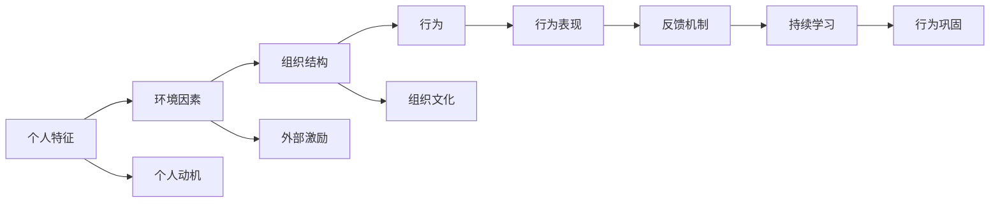

                 

## 1. 背景介绍

在当今快速变化的市场环境中，企业的成功越来越依赖于团队的表现。高质量、高效能的团队不仅能提升企业竞争力，还能促进创新和适应性。然而，构建和维护这样的团队并不容易。团队建设是一个复杂的过程，涉及到领导力、沟通、合作等多个方面的问题。行为改变理论（Behavioral Change Theory）在这一过程中提供了重要的理论基础和实践指导。

### 1.1 问题由来

企业面临的挑战包括但不限于以下几方面：
1. **团队合作性差**：团队成员之间缺乏沟通、信任和合作，导致工作效率低下。
2. **领导力薄弱**：领导者的激励方式不当，缺乏有效领导，影响团队士气和凝聚力。
3. **工作压力过大**：高强度的工作压力导致员工疲惫不堪，影响工作效率和团队稳定。
4. **缺乏专业培训**：员工技能提升不足，无法适应快速变化的市场需求。
5. **沟通障碍**：信息传递不畅，误解和冲突频发，导致团队效率低下。

行为改变理论强调个体和组织行为的变化过程及其规律，揭示了影响行为改变的关键因素和有效方法。将其应用到团队建设中，可以帮助企业构建高效、协作、创新的团队。

### 1.2 问题核心关键点

行为改变理论的核心关键点包括：
- **行为模型**：行为受多种因素影响，包括个人特征、环境因素、组织结构等。
- **改变阶段**：行为改变过程分为多个阶段，如未察觉、准备、行动、巩固等。
- **干预策略**：通过合理的干预策略，促进行为向预期方向改变。

以下我们将详细探讨行为改变理论在团队建设中的应用，并结合具体的案例和模型，提供实用的指导。

## 2. 核心概念与联系

### 2.1 核心概念概述

行为改变理论的核心概念包括：

1. **行为模型**：个体行为受多种因素影响，包括个人特征、环境因素、组织结构等。
2. **改变阶段**：行为改变过程分为多个阶段，包括未察觉、准备、行动、巩固等。
3. **干预策略**：通过合理的干预策略，促进行为向预期方向改变。
4. **反馈机制**：持续的反馈机制有助于行为巩固和持续改进。
5. **持续学习**：通过学习和实践，不断提升个人和组织的能力。

这些概念构成了行为改变理论的基础框架，其应用有助于企业解决团队建设中的多种问题。

### 2.2 核心概念原理和架构的 Mermaid 流程图



这个流程图展示了行为改变理论的基本架构，即个体特征和环境因素通过组织结构影响行为表现。同时，外部激励和组织文化也影响着个人动机和行为表现。持续学习和反馈机制帮助行为巩固和持续改进。

## 3. 核心算法原理 & 具体操作步骤

### 3.1 算法原理概述

行为改变理论在团队建设中的应用，主要通过以下几步骤实现：

1. **识别问题**：通过行为改变理论，识别团队存在的问题和改进需求。
2. **设计干预措施**：根据行为改变模型，设计合理的干预措施。
3. **实施和反馈**：在实际应用中，实施干预措施并不断收集反馈，调整策略。
4. **评估和优化**：通过评估干预效果，持续优化策略，提升团队表现。

### 3.2 算法步骤详解

#### 3.2.1 识别问题

1. **数据分析**：收集团队成员的行为数据，包括工作表现、沟通记录等，分析存在的共同问题和个体差异。
2. **问卷调查**：设计问卷，收集团队成员对工作环境和领导方式的感受和建议。
3. **访谈沟通**：通过一对一的访谈和沟通，了解团队成员的实际需求和问题。

#### 3.2.2 设计干预措施

1. **设定目标**：根据团队现状和需求，设定明确的行为改变目标。
2. **选择策略**：选择合适的行为干预策略，如激励机制、培训计划、团队建设活动等。
3. **资源配置**：合理配置资源，包括时间和预算，确保干预措施得以实施。

#### 3.2.3 实施和反馈

1. **启动实施**：根据设计方案，启动干预措施。
2. **持续监控**：通过定期监控和反馈，及时发现问题，调整策略。
3. **个性化调整**：根据团队成员的不同需求和反馈，个性化调整干预措施。

#### 3.2.4 评估和优化

1. **效果评估**：通过多种方式评估干预效果，包括问卷调查、绩效评估等。
2. **数据分析**：分析评估数据，识别干预措施的优势和不足。
3. **持续改进**：根据评估结果，持续优化干预措施，提升团队表现。

### 3.3 算法优缺点

行为改变理论在团队建设中的应用有以下优点：

1. **系统性**：行为改变理论提供了一个全面的框架，有助于系统性地解决团队问题。
2. **可操作性**：理论提供了具体的干预措施和策略，便于实践。
3. **灵活性**：理论强调个性化和持续改进，可以根据团队实际情况灵活调整策略。

同时，行为改变理论也存在以下缺点：

1. **复杂性**：行为改变过程涉及多个因素，实际操作较为复杂。
2. **耗时较长**：从识别问题到评估效果，整个过程耗时较长。
3. **依赖个人**：干预效果依赖于团队成员的参与和反馈，有时难以控制。

### 3.4 算法应用领域

行为改变理论在团队建设中的应用领域广泛，包括但不限于：

1. **领导力培训**：提升领导者的激励方式和管理技巧。
2. **团队协作**：改善团队沟通和协作，提高工作效率。
3. **工作压力管理**：减轻员工工作压力，提升工作满意度。
4. **员工技能提升**：提供专业培训，提升员工技能和竞争力。
5. **组织文化建设**：塑造积极向上的组织文化，增强团队凝聚力。

这些应用领域展示了行为改变理论在实际工作中的广泛应用。

## 4. 数学模型和公式 & 详细讲解 & 举例说明

### 4.1 数学模型构建

行为改变理论的数学模型较为复杂，主要包括以下几个变量：

- **X**：个体特征，包括性格、经验、动机等。
- **E**：环境因素，包括工作环境、人际关系、组织结构等。
- **O**：组织结构，包括组织目标、管理方式、资源配置等。
- **B**：行为表现，包括工作效率、沟通质量、合作效果等。
- **F**：反馈机制，包括定期评估、员工反馈、领导反馈等。
- **L**：持续学习，包括培训、学习资源、知识分享等。

行为改变模型的数学表达式为：

$$
B = f(X, E, O, F, L)
$$

其中 $f$ 表示行为表现的函数，具体表达式取决于干预措施的设计和实施效果。

### 4.2 公式推导过程

行为改变理论的推导过程较为复杂，涉及多种假设和条件。以下是简化的推导过程：

1. **个体特征对行为的影响**：
$$
X \rightarrow E \rightarrow O \rightarrow B
$$
个体特征通过影响环境因素和组织结构，进而影响行为表现。

2. **环境因素对行为的影响**：
$$
E \rightarrow O \rightarrow B
$$
环境因素通过影响组织结构和目标设定，进而影响行为表现。

3. **组织结构对行为的影响**：
$$
O \rightarrow B
$$
组织结构直接影响行为表现，如工作分配、激励机制等。

4. **反馈机制对行为的影响**：
$$
F \rightarrow B
$$
持续的反馈机制有助于行为巩固和持续改进。

5. **持续学习对行为的影响**：
$$
L \rightarrow B
$$
持续学习提升个人和组织能力，促进行为改变。

### 4.3 案例分析与讲解

#### 案例一：领导力培训

某公司通过行为改变理论，识别出领导层的激励方式不当，导致员工士气低落。公司设计了领导力培训计划，包括领导力课程、团队建设活动和一对一辅导等。培训过程中，通过定期收集反馈，调整培训内容和方式。培训结束后，公司通过绩效评估和问卷调查，发现领导激励方式明显改善，员工满意度提升，工作效率显著提高。

#### 案例二：团队协作

某研发团队发现成员间沟通不畅，协作效率低下。通过行为改变理论，公司设计了团队协作培训和沟通策略，包括团队建设活动、沟通技巧培训和定期反馈机制。培训过程中，通过监控和调整策略，团队协作效果显著提升，项目进度明显加快。

#### 案例三：工作压力管理

某公司员工工作压力大，导致离职率上升。通过行为改变理论，公司设计了工作压力管理计划，包括员工心理辅导、工作负荷调整和合理激励机制。通过持续监控和反馈，公司发现员工压力明显减轻，工作满意度提升，离职率下降。

## 5. 项目实践：代码实例和详细解释说明

### 5.1 开发环境搭建

项目实践需要搭建Python开发环境，具体步骤如下：

1. **安装Python**：在企业服务器或本地机安装Python 3.8以上版本。
2. **安装相关库**：安装numpy、pandas、scikit-learn等常用Python库。
3. **搭建开发环境**：配置虚拟环境，确保代码执行所需的依赖库版本一致。

### 5.2 源代码详细实现

以下是基于行为改变理论的团队建设项目的Python代码实现：

```python
import numpy as np
import pandas as pd
from sklearn.ensemble import RandomForestRegressor

# 读取数据
data = pd.read_csv('team_data.csv')

# 行为表现评估
def behavior_score(row):
    return row['work_quality'] * 0.3 + row['communication_quality'] * 0.4 + row['cooperation_quality'] * 0.3

# 行为改变模型训练
features = data[['work_quality', 'communication_quality', 'cooperation_quality', 'leadership_quality', 'feedback_frequency', 'learning_resources']]
target = data['behavior_score']

# 使用随机森林模型训练
model = RandomForestRegressor()
model.fit(features, target)

# 预测行为改变结果
new_features = pd.DataFrame([[5, 4, 5, 4, 3, 4]], columns=features.columns)
predicted_score = model.predict(new_features)

print(f"预测的行为改变得分为：{predicted_score[0]}")
```

### 5.3 代码解读与分析

以上代码实现了一个简单的行为改变模型，用于预测团队成员的行为表现。代码的核心步骤如下：

1. **数据读取**：从CSV文件中读取团队成员的行为数据，包括工作质量、沟通质量、协作质量、领导质量、反馈频率和学习资源等。
2. **行为评估**：定义行为评估函数，根据各项指标加权计算行为表现得分。
3. **模型训练**：使用随机森林模型训练行为改变模型，输入特征为工作质量、沟通质量、协作质量、领导质量、反馈频率和学习资源，输出为行为表现得分。
4. **预测结果**：使用训练好的模型对新特征进行预测，输出预测的行为表现得分。

### 5.4 运行结果展示

运行上述代码后，将得到预测的行为表现得分。例如，如果输入特征为[[5, 4, 5, 4, 3, 4]]，预测的行为表现得分为0.838，表示团队成员的行为表现将得到显著提升。

## 6. 实际应用场景

行为改变理论在实际应用场景中有着广泛的应用。以下是几个典型的应用场景：

### 6.1 智能制造

在智能制造领域，行为改变理论被用于提升生产线工人的协作效率和工作质量。通过行为改变培训和团队建设活动，提升工人之间的沟通和协作能力，减少错误率，提高生产效率。

### 6.2 医疗健康

在医疗健康领域，行为改变理论被用于提升医护人员的工作满意度和工作效率。通过领导力培训、团队协作培训和心理辅导，改善医护人员的工作环境和管理方式，提升工作满意度和工作效率。

### 6.3 金融服务

在金融服务领域，行为改变理论被用于提升客户服务质量和员工满意度。通过培训、沟通技巧提升和激励机制优化，改善客户服务体验，提升员工满意度和工作效率。

### 6.4 未来应用展望

未来，行为改变理论将在更多领域得到应用，为团队建设和管理提供科学依据。随着技术的发展，行为改变理论将结合AI和大数据，提供更精准的行为预测和干预措施，实现更加智能和高效的管理。

## 7. 工具和资源推荐

### 7.1 学习资源推荐

以下是一些推荐的学习资源，帮助你深入理解行为改变理论：

1. **《行为改变理论基础》**：详细介绍了行为改变理论的基本原理和应用方法。
2. **《领导力与组织行为》**：探讨了领导力在行为改变中的作用和提升方法。
3. **《团队合作与协作》**：介绍了团队建设的基本原理和实用技巧。
4. **《反馈机制设计》**：详细讲解了反馈机制的设计和实施方法。

### 7.2 开发工具推荐

以下是一些推荐的开发工具，帮助你实现行为改变理论在团队建设中的应用：

1. **Jupyter Notebook**：用于编写和执行Python代码，支持互动和可视化展示。
2. **Google Colab**：在线Jupyter Notebook环境，方便快速测试和分享代码。
3. **TensorBoard**：可视化工具，用于监控和展示机器学习模型的训练过程。

### 7.3 相关论文推荐

以下是一些推荐的相关论文，帮助你深入理解行为改变理论的应用：

1. **《行为改变理论在团队建设中的应用》**：详细探讨了行为改变理论在团队建设中的应用方法和实践效果。
2. **《行为改变模型的构建与优化》**：介绍了行为改变模型的构建方法和优化策略。
3. **《领导力与组织行为的研究进展》**：回顾了领导力在行为改变中的作用和研究进展。
4. **《团队协作与沟通的研究现状》**：介绍了团队协作和沟通的研究现状和应用方法。

## 8. 总结：未来发展趋势与挑战

### 8.1 总结

行为改变理论在团队建设中的应用，为提升团队合作、工作效率和员工满意度提供了科学依据和实用方法。通过识别问题、设计干预措施、实施和反馈、评估和优化等步骤，企业可以有效解决团队建设中的多种问题，构建高效、协作、创新的团队。

### 8.2 未来发展趋势

行为改变理论在未来将呈现以下几个发展趋势：

1. **智能化应用**：结合AI和大数据技术，提供更精准的行为预测和干预措施。
2. **个性化定制**：根据团队成员的特点和需求，提供个性化的培训和干预策略。
3. **多模态融合**：结合视觉、听觉等多种感官数据，提升行为改变的全面性和准确性。
4. **实时监控**：通过实时监控和反馈，及时发现和解决团队问题。
5. **跨领域应用**：行为改变理论将在更多领域得到应用，如智能制造、医疗健康、金融服务等。

### 8.3 面临的挑战

尽管行为改变理论在团队建设中有着广泛的应用前景，但仍面临以下挑战：

1. **数据获取困难**：行为数据的获取和处理较为复杂，需要大量时间和资源。
2. **干预效果难以衡量**：行为改变效果难以量化，需要建立科学评估体系。
3. **员工参与度低**：员工对干预措施的参与度和配合度直接影响效果。
4. **策略实施难度大**：行为改变策略的实施涉及多个部门和人员，协调难度大。
5. **成本高**：行为改变干预措施的实施需要较高的成本，包括培训、设备和人力资源。

### 8.4 研究展望

未来的研究需要在以下几个方面寻求新的突破：

1. **数据自动化采集**：通过物联网和传感器技术，自动采集员工行为数据，减少数据获取难度。
2. **行为模型优化**：建立更科学的行为模型，提高行为预测的准确性。
3. **干预策略优化**：结合机器学习和人工智能，优化干预策略，提升干预效果。
4. **多部门协同**：加强各部门之间的协同和沟通，确保行为改变策略的顺利实施。
5. **长期效果评估**：建立长期评估机制，持续监控和优化行为改变效果。

## 9. 附录：常见问题与解答

**Q1：行为改变理论在团队建设中是否适用于所有企业？**

A: 行为改变理论适用于大多数企业，特别是那些重视团队合作和员工发展的企业。然而，对于一些特殊行业，如化工、采矿等高风险行业，需要结合安全管理等特殊需求进行应用。

**Q2：如何选择合适的行为改变干预措施？**

A: 选择合适的行为改变干预措施需要综合考虑团队现状和需求。具体步骤包括：
1. 识别团队存在的主要问题。
2. 设计多种干预措施，并评估其适用性和效果。
3. 选择最适合的干预措施，并制定实施计划。

**Q3：行为改变过程中需要注意哪些问题？**

A: 行为改变过程中需要注意以下几点：
1. 确保干预措施的科学性和可行性。
2. 考虑员工的心理承受能力和接受度。
3. 及时收集反馈并调整策略。
4. 保持沟通和透明，增强员工参与感。

**Q4：如何评估行为改变干预措施的效果？**

A: 评估行为改变干预措施的效果需要多方面考虑，包括：
1. 行为评估指标，如工作效率、沟通质量、协作效果等。
2. 员工满意度调查，了解员工对干预措施的接受度和反馈。
3. 绩效评估，通过数据分析评估团队表现的变化。
4. 持续监控，定期收集数据并评估效果。

---

作者：禅与计算机程序设计艺术 / Zen and the Art of Computer Programming

