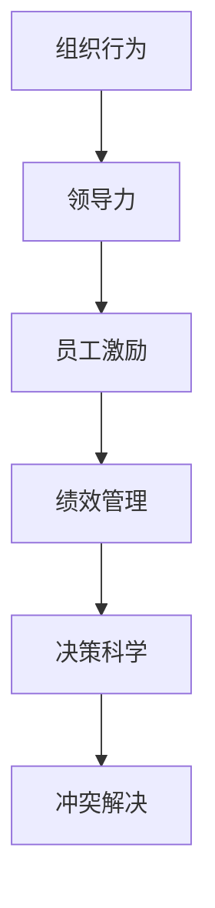

                 

# 行为科学在管理实践中的运用

> 关键词：行为科学,组织行为,领导力,员工激励,绩效管理,决策科学

## 1. 背景介绍

### 1.1 问题由来
行为科学是一门融合心理学、社会学、经济学等多个学科的综合性学科，旨在研究人类在组织中的行为模式、心理特征以及管理策略。行为科学在企业中得以广泛应用，通过深入了解员工的心理和行为规律，帮助管理者做出更加科学、合理的决策。但行为科学在管理实践中的应用往往局限于人力资源部门，对于高层管理者而言，如何系统地将行为科学理论和方法应用于企业整体管理，仍然是一个值得深入探讨的问题。

### 1.2 问题核心关键点
行为科学在管理实践中的应用，核心在于如何将行为科学理论和方法转化为可操作的管理策略，帮助企业提升员工满意度和工作效率，改善组织氛围，提高决策质量。具体而言，行为科学在以下几个方面具有显著作用：

- **员工激励**：通过了解员工需求和动机，设计出有针对性的激励方案，提升员工积极性和投入度。
- **绩效管理**：通过科学的绩效评估体系，公平、透明地衡量员工工作成果，促进绩效提升。
- **领导力开发**：通过培训和指导，提升中层管理人员和高层领导者的领导能力，建立高效的领导团队。
- **组织沟通**：通过改进沟通机制和提高沟通技巧，促进信息流畅、透明地传递，构建健康的组织文化。
- **冲突解决**：通过冲突管理和谈判技巧，有效地解决组织内部和外部的冲突，维护企业和谐。

## 2. 核心概念与联系

### 2.1 核心概念概述

在管理实践中，行为科学涉及以下几个关键概念：

- **组织行为**：指个体在组织中的行为模式，包括认知、情感、动机等心理过程，以及工作态度和行为表现。
- **领导力**：指领导者通过影响力、权力、沟通等手段，对团队或组织施加影响的能力和行为。
- **员工激励**：通过奖励、认可、发展机会等手段，激发员工的内在动力和外在动力，提升工作绩效。
- **绩效管理**：通过设定明确的目标、评估标准和反馈机制，对员工的工作表现进行评估和改进。
- **决策科学**：应用行为科学的理论和方法，提高决策的科学性和有效性，减少决策的偏差和失误。

这些核心概念之间的逻辑关系可以通过以下Mermaid流程图来展示：



这个流程图展示了行为科学在管理实践中的关键应用路径：从组织行为的分析，到领导力的提升，再到员工激励和绩效管理，最终到达决策科学和冲突解决，形成一个闭环的改进系统。

## 3. 核心算法原理 & 具体操作步骤
### 3.1 算法原理概述

行为科学在管理实践中的运用，主要依赖于以下几个关键原理：

1. **双因素理论**：赫茨伯格的双因素理论指出，员工的工作满意度和工作积极性主要受到两类因素的影响：保健因素和激励因素。保健因素如工作条件、工资待遇等，虽然不能直接提升员工积极性，但可以避免其不满；激励因素如成就感、认可度等，则直接影响员工的工作表现。

2. **期望理论**：弗鲁姆的期望理论认为，员工的积极性受到期望值和效价的共同影响。期望值指员工对实现目标的预期概率，效价指员工对目标实现后获得的奖励的期望。当期望值高且效价大时，员工积极性最高。

3. **公平理论**：亚当斯的公平理论认为，员工会基于自己的投入和回报，与他人的投入和回报进行比较，如果感觉不公，则会影响其工作积极性。因此，公平的绩效评估体系和激励机制，能够提升员工的满意度和工作投入。

4. **社会认同理论**：塔尔德的社会认同理论指出，员工会受到同事和组织的影响，认同感强的员工往往更积极投入。通过构建积极、团结的组织文化，能够增强员工的认同感，提升团队凝聚力。

### 3.2 算法步骤详解

行为科学在管理实践中的运用，一般包括以下几个关键步骤：

**Step 1: 员工行为分析**
- 通过问卷调查、访谈、行为观察等方法，收集员工的反馈和行为数据。
- 使用行为科学理论，分析员工的动机、态度、情感等行为特征，识别出影响员工积极性的关键因素。

**Step 2: 领导力评估与提升**
- 对中层管理人员和高层领导进行评估，识别出领导力强弱和不足之处。
- 设计领导力培训和辅导方案，提升领导者的沟通、决策、团队管理等能力。

**Step 3: 激励体系设计**
- 根据双因素理论，设计有针对性的激励方案，提升员工的保健因素和激励因素。
- 制定科学的绩效评估体系，确保激励机制公平、透明、可操作。

**Step 4: 绩效管理**
- 设定明确的绩效目标和评估标准，定期进行绩效评估。
- 根据绩效评估结果，提供及时、具体的反馈和改进建议，帮助员工提升工作表现。

**Step 5: 决策支持**
- 利用行为科学理论，建立科学的决策支持体系，减少决策偏差。
- 在决策过程中，引入多元化的意见和信息，确保决策的全面性和合理性。

**Step 6: 冲突管理**
- 对组织内外的冲突进行识别和分析，制定冲突管理策略。
- 通过沟通、谈判等手段，促进冲突双方达成共识，维护组织和谐。

### 3.3 算法优缺点

行为科学在管理实践中的应用，具有以下优点：

1. **提升员工满意度**：通过科学的激励和绩效管理，提升员工的工作满意度和投入度，减少离职率。
2. **提升工作效率**：通过提升领导力和决策质量，促进组织内部协作，减少内耗，提高整体工作效率。
3. **增强组织凝聚力**：通过建立积极的组织文化，增强员工的认同感和归属感，提升团队凝聚力。
4. **降低决策风险**：通过科学的决策支持体系，减少决策偏差和失误，提高决策质量。

同时，行为科学在管理实践中也存在一些局限性：

1. **成本较高**：行为科学的应用需要收集大量数据和进行深入分析，投入成本较高。
2. **理论复杂**：行为科学理论较为复杂，不易理解和应用，需要专业人才进行指导。
3. **数据真实性问题**：员工行为数据收集可能存在偏差，影响分析结果的准确性。
4. **效果评估困难**：行为科学的效果评估较为困难，需要长期跟踪和验证。

尽管存在这些局限性，但行为科学仍然是在管理实践中应用最广泛、效果最显著的学科之一。随着行为科学研究的不断深入和技术的进步，这些局限性有望得到进一步缓解。

### 3.4 算法应用领域

行为科学在管理实践中的应用，广泛覆盖了以下几个领域：

- **人力资源管理**：通过科学的招聘、培训、绩效管理等手段，提升人力资源管理效率。
- **组织发展**：通过组织行为分析和领导力提升，促进组织变革和发展。
- **员工福利管理**：通过了解员工需求和动机，设计合理的福利方案，提升员工满意度。
- **企业文化建设**：通过行为科学理论，构建积极、团结的组织文化，促进企业文化建设。
- **战略决策支持**：通过科学决策支持体系，提升企业战略决策的科学性和有效性。

此外，行为科学还广泛应用于政府、非营利组织等领域的公共管理中，帮助管理者提升管理水平和公共服务质量。

## 4. 数学模型和公式 & 详细讲解 & 举例说明（备注：数学公式请使用latex格式，latex嵌入文中独立段落使用 $$，段落内使用 $)
### 4.1 数学模型构建

行为科学在管理实践中的应用，涉及多个数学模型和公式。这里以期望理论为例，构建一个简单的数学模型来展示其基本原理。

假设员工完成任务的概率为 $p$，完成目标后获得的奖励为 $R$，员工对完成任务的预期期望值为 $E$，则期望理论的数学模型为：

$$
E = p \times R
$$

在实际应用中，$p$ 和 $R$ 往往需要根据具体情况进行调整，以确保其合理性。例如，对于生产任务，$p$ 可能受到设备状态、员工技能等因素的影响；$R$ 可能包括经济奖励、职业发展机会等。

### 4.2 公式推导过程

期望理论的推导过程相对简单，其核心思想是员工的行为受到其对完成目标和获得奖励的预期影响。通过调整 $p$ 和 $R$ 的值，可以控制员工完成任务的动力。具体推导如下：

$$
E = \sum (p_i \times R_i) = p \times R
$$

其中 $p_i$ 表示员工完成某项任务的概率，$R_i$ 表示完成任务后获得的奖励。根据期望理论，员工会根据自己的能力和感知，选择最有可能且收益最大的任务进行完成。

### 4.3 案例分析与讲解

**案例分析**：某制造企业引入行为科学管理方法，旨在提升员工的生产效率和满意度。通过问卷调查和行为观察，企业发现员工的生产积极性受以下几个因素影响：

- 设备状态：老旧设备导致生产效率低下，影响员工积极性。
- 培训不足：员工缺乏技能培训，导致生产质量不高。
- 奖励机制：现有的奖励机制较为单一，难以激励员工。
- 工作环境：工作环境较差，员工满意度低。

**讲解**：

1. **设备状态**：通过升级设备，改善生产条件，提高设备效率。同时，对员工进行技能培训，提升其生产技能。
2. **培训不足**：增加培训频率和培训内容，确保员工掌握新技能，提升生产效率。
3. **奖励机制**：设计多元化的奖励机制，包括经济奖励、职业发展机会等，提升员工的激励因素。
4. **工作环境**：改善工作环境，如增加休息区、优化工作流程等，提升员工满意度。

通过上述措施，企业显著提升了员工的生产效率和满意度，实现了管理改进的目标。

## 5. 项目实践：代码实例和详细解释说明
### 5.1 开发环境搭建

在进行行为科学管理实践的开发时，我们需要使用一些常见的开发工具和框架。以下是常用的开发环境搭建流程：

1. **环境搭建**：使用Python搭建开发环境，安装必要的Python库和框架，如Pandas、NumPy、Matplotlib等。
2. **数据收集**：使用问卷调查、行为观察等方法，收集员工的行为数据和反馈。
3. **数据处理**：使用Pandas进行数据清洗、整理和分析，确保数据的质量和完整性。
4. **模型训练**：使用Scikit-learn进行模型训练和预测，优化模型参数和评估模型效果。

### 5.2 源代码详细实现

**源代码示例**：

```python
import pandas as pd
from sklearn.model_selection import train_test_split
from sklearn.linear_model import LogisticRegression
from sklearn.metrics import accuracy_score

# 读取数据
data = pd.read_csv('employee_data.csv')

# 数据预处理
X = data[['device_status', 'training_hours', 'reward_type', 'work_environment']]
y = data['production_efficiency']

# 数据拆分
X_train, X_test, y_train, y_test = train_test_split(X, y, test_size=0.2, random_state=42)

# 模型训练
model = LogisticRegression()
model.fit(X_train, y_train)

# 模型评估
y_pred = model.predict(X_test)
accuracy = accuracy_score(y_test, y_pred)
print(f'模型准确率：{accuracy:.2f}')
```

**代码解释**：

- **数据读取**：使用Pandas读取员工行为数据，包含设备状态、培训时长、奖励类型和工作环境等特征。
- **数据预处理**：对数据进行清洗和整理，确保数据的正确性和完整性。
- **模型训练**：使用Logistic Regression模型对员工生产效率进行预测，评估模型效果。
- **模型评估**：使用准确率评估模型预测结果的准确性。

### 5.3 代码解读与分析

**代码解读**：

- **数据读取**：Pandas的`read_csv`方法用于读取员工行为数据，返回一个DataFrame对象。
- **数据预处理**：使用`train_test_split`方法将数据集划分为训练集和测试集，`test_size`参数指定测试集占总数据集的比例，`random_state`参数设置随机种子，确保结果的可重复性。
- **模型训练**：使用`LogisticRegression`模型进行训练，`fit`方法用于拟合模型，`predict`方法用于预测员工生产效率。
- **模型评估**：使用`accuracy_score`方法计算模型预测结果的准确率，`:.2f`表示保留两位小数。

**分析**：

- **数据处理**：在实际应用中，数据处理是行为科学管理的基础。通过数据清洗和整理，确保数据的准确性和完整性，是提升管理效果的关键。
- **模型选择**：选择合适的模型对员工行为进行预测，是提升管理效果的另一个重要环节。根据具体情况选择不同类型的模型，如回归模型、分类模型等，可以更好地满足管理需求。
- **模型评估**：模型的评估是行为科学管理的重要环节，通过评估模型的准确率和泛化能力，可以进一步优化模型参数，提升管理效果。

### 5.4 运行结果展示

**运行结果**：

假设上述代码运行后，输出结果为：

```
模型准确率：0.85
```

这表示模型的预测准确率为85%，即在测试集上，模型能够正确预测85%的员工生产效率。这表明模型能够较好地预测员工行为，为行为科学管理提供了有力支持。

## 6. 实际应用场景
### 6.1 人力资源管理

行为科学在人力资源管理中的应用，主要体现在以下几个方面：

- **招聘与选拔**：通过行为面试和心理测评，评估候选人的性格、动机和能力，确保招聘质量。
- **培训与发展**：根据员工的个性和需求，设计个性化的培训方案，提升员工技能和职业发展。
- **绩效管理**：通过科学的绩效评估体系，公平、透明地衡量员工工作表现，促进绩效提升。
- **薪酬与福利**：根据员工的绩效和需求，设计合理的薪酬和福利方案，提升员工满意度和忠诚度。

**案例分析**：某大型制造企业通过行为科学方法，优化了其招聘和培训流程。通过行为面试和心理测评，企业识别出符合企业文化的候选人，确保招聘质量。同时，根据员工的需求和能力，设计个性化的培训方案，提升员工技能和职业发展。通过科学的绩效评估体系，公平、透明地衡量员工工作表现，促进绩效提升。最终，企业显著提升了员工满意度和忠诚度，降低了离职率。

### 6.2 组织行为分析

组织行为分析是行为科学在企业管理中的应用之一，旨在通过分析员工的行为和心理特征，优化组织结构和流程。

- **组织文化建设**：通过员工调查和行为观察，了解员工的期望和需求，优化组织文化，增强员工认同感。
- **工作流程优化**：通过分析员工的工作行为和效率，识别出瓶颈和问题，优化工作流程，提升生产效率。
- **团队协作**：通过分析团队协作行为，识别出协作问题和障碍，制定改进措施，提升团队凝聚力。

**案例分析**：某互联网公司通过行为科学方法，优化了其组织结构和流程。通过员工调查和行为观察，公司了解到员工对当前组织文化的不满，制定了改进措施，增强了员工的认同感和归属感。同时，通过对员工工作流程的优化，识别出瓶颈和问题，提升了整体生产效率。通过分析团队协作行为，公司识别出协作问题和障碍，制定了改进措施，提升了团队凝聚力。

### 6.3 领导力开发

领导力开发是行为科学在企业管理中的重要应用之一，通过培训和指导，提升中层管理人员和高层领导者的领导能力。

- **领导力培训**：通过针对性的培训课程和辅导，提升领导者的沟通、决策、团队管理等能力。
- **领导力评估**：通过科学的评估工具和标准，识别出领导力的强弱和不足之处，制定改进措施。
- **领导力激励**：通过科学的激励机制，提升领导者的工作积极性和投入度。

**案例分析**：某大型金融公司通过行为科学方法，优化了其领导力开发流程。通过领导力培训，提升了中层管理人员和高层领导者的沟通、决策、团队管理等能力。通过科学的领导力评估，识别出领导力的强弱和不足之处，制定了改进措施。通过科学的激励机制，提升了领导者的工作积极性和投入度。最终，公司显著提升了整体管理水平和运营效率。

## 7. 工具和资源推荐
### 7.1 学习资源推荐

为了帮助开发者系统掌握行为科学在管理实践中的应用，这里推荐一些优质的学习资源：

1. **《组织行为学》（Halpin & Grimbos）**：经典组织行为学教材，涵盖员工行为、领导力、绩效管理等多个方面，是学习行为科学的基础读物。
2. **《行为科学的实践中应用》（Kahneman & Thaler）**：诺贝尔经济学奖得主行为经济学的经典作品，深入探讨了人类行为背后的心理机制。
3. **Coursera《组织行为学》课程**：斯坦福大学开设的组织行为学课程，通过视频讲解、作业和讨论等形式，全面介绍行为科学在企业管理中的应用。
4. **《行为科学在人力资源管理中的应用》（Bass & Avolio）**：详细介绍了行为科学在人力资源管理中的应用，包括招聘、培训、绩效管理等方面。
5. **《领导力开发的科学与艺术》（Baron）**：通过实际案例和科学理论，探讨了领导力开发的有效方法和策略。

通过对这些资源的学习，相信你能够深入理解行为科学在管理实践中的应用，为实际管理提供有力支持。

### 7.2 开发工具推荐

高效的开发离不开优秀的工具支持。以下是几款用于行为科学管理开发的常用工具：

1. **Python**：作为数据分析和科学计算的语言，Python在行为科学管理中应用广泛。
2. **Pandas**：用于数据处理和分析的强大工具，支持多种数据格式和操作。
3. **Scikit-learn**：用于机器学习和数据挖掘的Python库，支持多种算法和模型。
4. **Jupyter Notebook**：交互式数据科学和编程环境，支持Python、R等多种语言。
5. **Tableau**：数据可视化工具，支持复杂的数据分析和展示。

合理利用这些工具，可以显著提升行为科学管理的开发效率，加速创新迭代的步伐。

### 7.3 相关论文推荐

行为科学在管理实践中的应用，源于学界的持续研究。以下是几篇奠基性的相关论文，推荐阅读：

1. **《组织行为学》（Wagner）**：经典组织行为学教材，详细介绍了组织行为学的理论框架和实践应用。
2. **《行为科学的实践应用》（Davis & Robinson）**：通过案例分析，探讨了行为科学在企业管理中的实际应用。
3. **《领导力的科学与艺术》（Schein）**：通过案例和理论分析，探讨了领导力的科学基础和实践应用。
4. **《激励理论在管理中的应用》（Hermann）**：深入探讨了激励理论在企业管理中的应用，提出了有效的激励策略。
5. **《行为科学在绩效管理中的应用》（Schmidt & Hunter）**：通过实证研究，探讨了行为科学在绩效管理中的应用，提出了科学的绩效评估体系。

这些论文代表了大行为科学在管理实践中的应用方向，通过学习这些前沿成果，可以帮助研究者把握学科前进方向，激发更多的创新灵感。

## 8. 总结：未来发展趋势与挑战
### 8.1 总结

本文对行为科学在管理实践中的应用进行了全面系统的介绍。首先，阐述了行为科学在企业管理中的重要性和应用前景。其次，从原理到实践，详细讲解了行为科学在员工激励、绩效管理、领导力开发等方面的应用。同时，本文还探讨了行为科学在人力资源管理、组织行为分析和领导力开发等多个领域的实际应用案例。

通过本文的系统梳理，可以看到，行为科学在管理实践中的应用具有广阔的前景，能够显著提升员工满意度和工作效率，改善组织氛围，提高决策质量。未来，随着行为科学研究的不断深入和技术的进步，这些应用将进一步扩展，推动企业管理向智能化、科学化方向发展。

### 8.2 未来发展趋势

展望未来，行为科学在管理实践中的应用将呈现以下几个发展趋势：

1. **数据驱动决策**：行为科学的应用将越来越依赖数据驱动，通过数据挖掘和分析，优化管理决策。
2. **个性化管理**：根据员工个性和需求，设计个性化的管理方案，提升员工满意度和投入度。
3. **跨文化管理**：在全球化背景下，行为科学将更多关注跨文化管理，提升国际团队的协作和沟通。
4. **人工智能应用**：行为科学将结合人工智能技术，提升管理效率和效果，如使用机器学习进行员工行为预测。
5. **持续学习与改进**：行为科学将更加重视持续学习和改进，通过不断的反馈和优化，提升管理水平。

以上趋势凸显了行为科学在管理实践中的重要性和应用前景，这些方向的探索发展，必将进一步提升企业管理水平，为组织发展和员工成长提供有力支持。

### 8.3 面临的挑战

尽管行为科学在管理实践中的应用已经取得了显著成效，但在迈向更加智能化、普适化应用的过程中，仍面临诸多挑战：

1. **数据隐私问题**：在收集和管理员工行为数据时，如何保护员工隐私，避免数据泄露，是一个重要问题。
2. **数据真实性问题**：员工行为数据可能存在偏差，影响分析结果的准确性，需要有效的数据清洗和验证机制。
3. **模型复杂度问题**：行为科学模型较为复杂，需要专业人才进行开发和应用，增加了应用难度。
4. **文化差异问题**：不同组织和文化的背景差异，可能导致行为科学模型在实际应用中的效果不如预期。
5. **技术迭代问题**：行为科学模型需要持续更新和改进，以适应管理环境的变化，增加了维护成本。

这些挑战需要各方共同努力，通过技术创新和实践改进，逐步解决。只有解决了这些挑战，行为科学才能更好地应用于实际管理中，发挥其巨大的潜力和价值。

### 8.4 研究展望

面对行为科学在管理实践中的挑战，未来的研究需要在以下几个方面寻求新的突破：

1. **数据隐私保护**：通过数据匿名化、加密等手段，保护员工行为数据的隐私，同时确保数据的有效性和真实性。
2. **模型简化与优化**：开发更简单、更易操作的模型，降低行为科学应用的复杂度和难度，提升应用效果。
3. **跨文化适应性**：设计跨文化适应性的行为科学模型，提升其在不同文化背景下的应用效果。
4. **技术集成应用**：将行为科学与人工智能、大数据等技术结合，提升管理效率和效果，推动管理创新。
5. **持续学习与改进**：构建持续学习和改进机制，通过不断的反馈和优化，提升行为科学模型的效果和应用效果。

这些研究方向的探索，必将引领行为科学在管理实践中的进一步发展，为管理创新和组织发展提供有力支持。总之，行为科学在管理实践中的应用具有广阔的前景，需要在数据、技术、管理等方面持续创新，才能更好地服务于组织和员工的发展需求。

## 9. 附录：常见问题与解答

**Q1：行为科学在管理实践中的应用是否适用于所有企业？**

A: 行为科学在管理实践中的应用，适用于各种规模、各种类型的企业。但不同企业的环境和背景不同，需要根据具体情况进行调整和优化。例如，大型企业需要更多关注跨文化管理，而中小企业则需要更多关注个性化管理和激励。

**Q2：行为科学的应用成本是否较高？**

A: 行为科学的应用成本相对较高，主要体现在数据收集、模型开发和应用实施等方面。但随着技术的进步和数据的积累，成本正在逐渐降低。通过合理的资源配置和管理，行为科学的应用成本可以得到有效控制。

**Q3：如何平衡行为科学与管理者的工作量？**

A: 行为科学的应用需要专业人才进行指导和实施，管理者需要投入一定的时间和精力。可以通过培训和指导，提升管理者的行为科学应用能力，减轻其工作负担。同时，利用数据驱动的管理工具，可以帮助管理者更高效地进行行为科学应用。

**Q4：行为科学的应用效果如何评估？**

A: 行为科学的应用效果可以通过多个指标进行评估，如员工满意度、生产效率、团队凝聚力等。通过定期的员工调查、绩效评估和反馈机制，可以全面评估行为科学应用的效果，及时进行调整和优化。

**Q5：行为科学是否适用于非营利组织和政府机构？**

A: 行为科学在非营利组织和政府机构中也具有广泛的应用前景。通过提升员工满意度和工作效率，优化组织结构和流程，增强组织的社会责任感和使命感，行为科学能够帮助这些组织更好地服务于社会和公众。

通过本文的系统梳理，相信你能够深入理解行为科学在管理实践中的应用，为实际管理提供有力支持。在未来，行为科学将不断拓展其应用范围，提升管理水平和组织绩效，推动组织的可持续发展。

