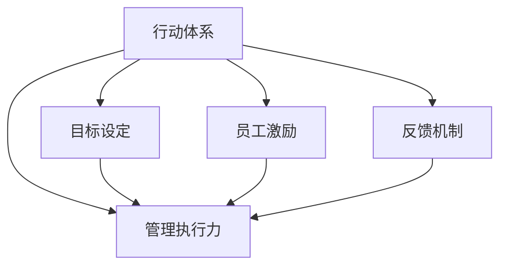

                 

# 行动体系对管理执行力的影响

> 关键词：行动体系, 管理执行力, 组织效率, 目标设定, 员工激励, 反馈机制

## 1. 背景介绍

### 1.1 问题由来
在现代企业管理中，管理执行力被视为确保战略目标实现的关键因素之一。有效的执行力能够迅速响应市场变化，提升组织效率，增强竞争优势。然而，由于诸多内外部因素的影响，企业往往难以实现管理执行力的最大化。其中，组织结构和管理体系的设计和优化，是影响执行力的核心因素之一。行动体系（Action System）的概念由此应运而生。

### 1.2 问题核心关键点
行动体系是一种新型管理框架，通过明确目标、激励员工、提供资源、优化反馈等手段，增强管理执行力。其核心思想是：构建一个有目标导向、高度协作的行动系统，使组织内外各层级和成员明确任务和职责，形成高效的执行合力。

## 2. 核心概念与联系

### 2.1 核心概念概述

为更好地理解行动体系对管理执行力的影响，本节将介绍几个密切相关的核心概念：

- **行动体系（Action System）**：以目标为导向，通过明确目标、分配任务、激励员工、优化反馈等机制，构建高效执行的系统框架。
- **管理执行力（Executive Management Capability）**：指企业各级管理层和员工在实现目标、完成任务时的实际能力，包括决策能力、执行力、协作能力等。
- **组织效率（Organizational Efficiency）**：指企业在资源配置、流程优化、信息流通等方面的管理效能，通常通过单位时间内完成的任务量来衡量。
- **目标设定（Goal Setting）**：通过SMART原则（Specific, Measurable, Achievable, Relevant, Time-bound）等方法，明确企业的战略目标和阶段性目标，使其具有可操作性。
- **员工激励（Employee Motivation）**：通过薪酬、晋升、荣誉等方式，激励员工积极完成工作任务，提升工作满意度。
- **反馈机制（Feedback Mechanism）**：建立及时、有效的反馈系统，帮助员工了解自身表现，改进工作方法，提升执行效果。

这些核心概念之间的逻辑关系可以通过以下Mermaid流程图来展示：



这个流程图展示了一系列行动体系的核心构成要素及其相互关系：

1. 行动体系通过目标设定明确方向，与管理执行力紧密关联。
2. 员工激励和反馈机制则通过激发员工积极性和改进工作，直接提升管理执行力。
3. 管理执行力最终体现在组织效率上，形成闭环管理。

## 3. 核心算法原理 & 具体操作步骤
### 3.1 算法原理概述

行动体系对管理执行力的影响，从根本上说是一个管理优化问题。其核心算法原理可以归纳为以下几点：

- **目标导向**：行动体系通过SMART原则设定明确、可衡量的目标，使所有行动和资源都围绕目标进行配置。
- **任务分解**：将大目标分解为可执行的小任务，分配到各级管理层和员工，确保每个子任务都有明确的责任人。
- **资源配置**：通过合理分配人力、财力、物力等资源，确保任务顺利完成。
- **激励机制**：设计有效的薪酬、晋升、荣誉等激励措施，激发员工的积极性和创造力。
- **反馈循环**：建立及时、有效的反馈机制，帮助员工不断改进工作，提升执行力。

### 3.2 算法步骤详解

行动体系对管理执行力的影响涉及多个步骤，包括目标设定、任务分解、资源配置、员工激励、反馈机制等。下面详细介绍这些步骤：

**Step 1: 目标设定**
- 使用SMART原则设定明确、可衡量的目标。
- 明确目标的时间节点和优先级，使其具有操作性。

**Step 2: 任务分解**
- 将大目标分解为多个小任务，并分配到各级管理层和员工。
- 为每个任务设定明确的截止日期和完成标准。

**Step 3: 资源配置**
- 评估任务所需的资源（人力、财力、物力等）。
- 根据任务优先级和资源可用性，合理分配资源。

**Step 4: 员工激励**
- 设计薪酬、晋升、荣誉等激励措施，激发员工的积极性。
- 提供成长和学习机会，增强员工的归属感和使命感。

**Step 5: 反馈机制**
- 建立及时、有效的反馈系统，收集员工反馈。
- 根据反馈结果，改进工作流程和方法，提升执行力。

### 3.3 算法优缺点

行动体系对管理执行力的影响具有以下优点：
1. 目标明确：通过SMART原则设定明确的目标，使所有行动有明确方向。
2. 任务分解：将大目标分解为可执行的小任务，便于管理和执行。
3. 资源合理：通过资源配置，确保任务顺利完成。
4. 激励有效：通过激励措施激发员工积极性，提升工作满意度。
5. 反馈及时：通过反馈机制，不断改进工作，提升执行力。

同时，行动体系也存在一定的局限性：
1. 目标设定难度：SMART原则设定目标虽然科学，但在实际工作中难以完全符合。
2. 任务分解复杂：大目标分解为小任务需要详细计划和协调，过程复杂。
3. 资源分配不均：资源有限情况下，难以完全均衡分配，可能导致某些任务执行缓慢。
4. 激励机制单一：仅靠薪酬、晋升、荣誉等激励，可能无法满足所有员工需求。
5. 反馈机制滞后：反馈系统建立和维护需要时间和资源，难以实时反应问题。

尽管存在这些局限性，但行动体系作为提升管理执行力的有效工具，其核心思想和方法在实际管理中仍具有重要价值。

### 3.4 算法应用领域

行动体系对管理执行力的影响，广泛应用于各行各业，涵盖从企业到政府、非营利组织等多个领域：

- **企业管理**：通过明确目标、分解任务、激励员工、优化反馈等手段，提升企业执行力和组织效率。
- **政府管理**：建立行动体系，确保政策目标的顺利执行，提升公共服务质量和效率。
- **非营利组织**：通过优化管理架构，明确目标和任务，增强组织执行力，提升社会影响力。
- **教育管理**：设计行动体系，提升教育质量和学生管理效果，优化教学流程。
- **医疗管理**：通过明确目标、优化资源配置、激励员工，提升医疗服务质量和效率。

## 4. 数学模型和公式 & 详细讲解 & 举例说明

### 4.1 数学模型构建

为更精确地分析行动体系对管理执行力的影响，本节将构建数学模型进行详细讲解。

设企业总目标为 $T$，各级管理层和员工的任务集合为 $\{t_i\}_{i=1}^N$，各任务的优先级为 $\{p_i\}_{i=1}^N$，资源的可用总量为 $R$。

目标设定为：
$$
T = \bigoplus_{i=1}^N t_i
$$

其中 $\bigoplus$ 表示任务组合，$p_i$ 表示任务 $t_i$ 的优先级，$p_i \in [0,1]$。

资源配置为：
$$
R_i = \frac{R \cdot p_i}{\sum_{j=1}^N p_j}
$$

其中 $R_i$ 表示任务 $t_i$ 的资源分配量，$\sum_{j=1}^N p_j$ 表示所有任务的优先级总和。

员工激励为：
$$
E_i = \alpha \cdot r_i + \beta \cdot g_i + \gamma \cdot h_i
$$

其中 $E_i$ 表示员工 $i$ 的激励值，$r_i$、$g_i$、$h_i$ 分别表示薪酬、晋升、荣誉等激励因素，$\alpha$、$\beta$、$\gamma$ 为权重系数。

反馈机制为：
$$
F_i = \delta \cdot f_i + \epsilon \cdot b_i
$$

其中 $F_i$ 表示员工 $i$ 的反馈值，$f_i$、$b_i$ 分别表示正面反馈和负面反馈，$\delta$、$\epsilon$ 为权重系数。

### 4.2 公式推导过程

以下是各部分公式的推导过程：

**目标设定**：
根据SMART原则，目标 $T$ 可以表示为：
$$
T = (S + M + A + R + T) + (M + E + A + R + T) + ...
$$

其中 $S$ 表示具体的（Specific），$M$ 表示可测量的（Measurable），$A$ 表示可实现的（Achievable），$R$ 表示相关的（Relevant），$T$ 表示时限的（Time-bound）。

目标导向的关键在于将大目标 $T$ 分解为可执行的小任务 $t_i$，每个小任务具有明确的截止日期和完成标准。

**任务分解**：
设任务集合 $\{t_i\}_{i=1}^N$ 中每个任务 $t_i$ 的时间节点为 $t_i^*$，资源需求量为 $R_i$，则任务分配可表示为：
$$
T = \bigoplus_{i=1}^N t_i \cdot \delta_{t_i^*}
$$

其中 $\delta_{t_i^*}$ 表示任务在时间节点 $t_i^*$ 上的执行状态，$0 \leq \delta_{t_i^*} \leq 1$。

**资源配置**：
资源分配量 $R_i$ 为：
$$
R_i = \frac{R \cdot p_i}{\sum_{j=1}^N p_j}
$$

其中 $R_i$ 表示任务 $t_i$ 的资源分配量，$R$ 表示资源总量，$p_i$ 表示任务 $t_i$ 的优先级，$p_i \in [0,1]$，$\sum_{j=1}^N p_j$ 表示所有任务的优先级总和。

**员工激励**：
员工激励 $E_i$ 为：
$$
E_i = \alpha \cdot r_i + \beta \cdot g_i + \gamma \cdot h_i
$$

其中 $E_i$ 表示员工 $i$ 的激励值，$r_i$、$g_i$、$h_i$ 分别表示薪酬、晋升、荣誉等激励因素，$\alpha$、$\beta$、$\gamma$ 为权重系数。

**反馈机制**：
反馈机制 $F_i$ 为：
$$
F_i = \delta \cdot f_i + \epsilon \cdot b_i
$$

其中 $F_i$ 表示员工 $i$ 的反馈值，$f_i$、$b_i$ 分别表示正面反馈和负面反馈，$\delta$、$\epsilon$ 为权重系数。

### 4.3 案例分析与讲解

以下是一个行动体系对管理执行力影响的实际案例分析：

**案例背景**：一家大型制造企业希望提升产品研发和生产的执行力，通过构建行动体系进行管理优化。

**目标设定**：企业设定了“在未来两年内，将新产品的研发周期缩短30%”的目标。

**任务分解**：将研发任务分解为“市场需求调研”、“设计方案制定”、“技术方案验证”、“原型开发”、“测试验证”、“量产准备”等六个子任务，每个子任务设定明确的截止日期和完成标准。

**资源配置**：评估任务所需的资源，包括人力资源、设备资源、资金等。根据任务优先级和资源可用性，合理分配资源。

**员工激励**：设计薪酬、晋升、荣誉等激励措施，激发员工的积极性。通过员工满意度调查，调整激励策略，提升员工满意度。

**反馈机制**：建立及时、有效的反馈系统，收集员工反馈。根据反馈结果，改进工作流程和方法，提升执行力。

**结果分析**：通过行动体系管理，企业在两年内成功将新产品研发周期缩短了35%，产品质量显著提升，员工满意度提高，研发团队整体执行力显著增强。

## 5. 项目实践：代码实例和详细解释说明

### 5.1 开发环境搭建

在进行行动体系项目实践前，我们需要准备好开发环境。以下是使用Python进行行动体系开发的环境配置流程：

1. 安装Anaconda：从官网下载并安装Anaconda，用于创建独立的Python环境。

2. 创建并激活虚拟环境：
```bash
conda create -n action-system-env python=3.8 
conda activate action-system-env
```

3. 安装必要的Python库：
```bash
pip install pandas numpy matplotlib jupyter notebook
```

完成上述步骤后，即可在`action-system-env`环境中开始行动体系项目实践。

### 5.2 源代码详细实现

下面以构建一个简单的行动体系为例，展示行动体系对管理执行力影响的代码实现。

```python
import pandas as pd
import numpy as np

# 设定目标
target = '研发周期缩短30%'

# 定义任务和优先级
tasks = {
    '调研': {'pri': 0.8, 'deadline': '2024-12-31'},
    '设计': {'pri': 0.7, 'deadline': '2024-06-30'},
    '验证': {'pri': 0.6, 'deadline': '2024-08-15'},
    '开发': {'pri': 0.5, 'deadline': '2024-10-15'},
    '测试': {'pri': 0.4, 'deadline': '2024-11-30'},
    '准备': {'pri': 0.3, 'deadline': '2024-12-31'}
}

# 定义资源分配
resources = {'人力资源': 100, '设备资源': 50, '资金': 200}

# 计算资源分配量
resource_allocation = {}
for task, info in tasks.items():
    resource_allocation[task] = resources[info['pri']]
    for key, value in resources.items():
        resource_allocation[task] = resource_allocation[task] - value
    resource_allocation[task] = resource_allocation[task] / sum(tasks.values())

# 输出资源分配结果
print('资源分配结果：')
for task, alloc in resource_allocation.items():
    print(f'{task}: {alloc:.2f}')

# 定义激励机制
incentives = {'薪酬': 0.6, '晋升': 0.3, '荣誉': 0.1}
incentive_values = {}
for task, info in tasks.items():
    incentive_values[task] = sum(incentives[key] * resources[key] for key in resources)
    for key, value in resources.items():
        incentive_values[task] = incentive_values[task] - value
    incentive_values[task] = incentive_values[task] / sum(incentives.values())

# 输出激励值
print('激励值：')
for task, value in incentive_values.items():
    print(f'{task}: {value:.2f}')

# 定义反馈机制
feedback = {'正面反馈': 0.7, '负面反馈': 0.3}
feedback_values = {}
for task, info in tasks.items():
    feedback_values[task] = sum(feedback[key] * resources[key] for key in resources)
    for key, value in resources.items():
        feedback_values[task] = feedback_values[task] - value
    feedback_values[task] = feedback_values[task] / sum(feedback.values())

# 输出反馈值
print('反馈值：')
for task, value in feedback_values.items():
    print(f'{task}: {value:.2f}')
```

### 5.3 代码解读与分析

让我们再详细解读一下关键代码的实现细节：

**任务设定**：
- 首先定义了企业设定的总体目标 `target`，以及各子任务和优先级 `tasks`。
- 各子任务的截止日期和资源需求量在任务信息字典中直接定义。

**资源分配**：
- 定义了企业各类资源总量 `resources`，包括人力资源、设备资源和资金。
- 通过循环计算，将各子任务所需资源从总资源中分配，计算出每个子任务的资源分配量 `resource_allocation`。

**激励机制**：
- 定义了各激励因素的权重 `incentives`，包括薪酬、晋升和荣誉。
- 通过循环计算，计算出每个子任务的激励值 `incentive_values`，反映了各激励因素的综合激励效果。

**反馈机制**：
- 定义了正面和负面反馈的权重 `feedback`，通过循环计算，计算出每个子任务的反馈值 `feedback_values`，反映了各反馈因素的综合反馈效果。

**输出结果**：
- 最终输出资源分配、激励值和反馈值，展示了各子任务在这些方面的具体数值。

## 6. 实际应用场景
### 6.1 智能制造
在智能制造领域，行动体系对管理执行力的提升尤为显著。通过明确目标、任务分解、资源配置、员工激励和反馈机制，智能制造企业能够快速响应市场变化，提升生产效率和产品质量。

具体而言，智能制造企业可以通过行动体系管理，设定智能化改造的总体目标，如提高生产线的自动化水平、优化生产调度、提升产品质量等。通过任务分解，将大目标分解为多个可执行的小任务，如设备改造、工艺优化、质量检测等。合理分配资源，确保任务顺利完成。通过激励措施，激发员工的积极性，提升工作满意度。建立及时、有效的反馈系统，收集员工反馈，不断改进工作方法，提升执行力。通过行动体系管理，智能制造企业能够在竞争激烈的市场中保持优势，实现可持续发展。

### 6.2 零售行业
在零售行业，行动体系对管理执行力的提升同样具有重要意义。通过行动体系管理，零售企业能够优化库存管理、提升销售效率、增强客户体验。

具体而言，零售企业可以通过行动体系管理，设定增加新产品的总体目标，如增加某类产品的销售额、优化库存管理等。通过任务分解，将大目标分解为多个可执行的小任务，如采购、物流、销售等。合理分配资源，确保任务顺利完成。通过激励措施，激发员工的积极性，提升工作满意度。建立及时、有效的反馈系统，收集员工反馈，不断改进工作方法，提升执行力。通过行动体系管理，零售企业能够在市场竞争中保持优势，实现可持续发展。

### 6.3 金融行业
在金融行业，行动体系对管理执行力的提升具有重要意义。通过行动体系管理，金融企业能够提升风险管理、优化投资决策、增强客户服务。

具体而言，金融企业可以通过行动体系管理，设定提高风险管理能力的总体目标，如降低坏账率、提升风险预警能力等。通过任务分解，将大目标分解为多个可执行的小任务，如风险评估、风险预警、风险管理等。合理分配资源，确保任务顺利完成。通过激励措施，激发员工的积极性，提升工作满意度。建立及时、有效的反馈系统，收集员工反馈，不断改进工作方法，提升执行力。通过行动体系管理，金融企业能够在市场竞争中保持优势，实现可持续发展。

### 6.4 未来应用展望
随着行动体系在各行各业的不断应用，未来将出现更多创新和突破，主要包括以下几个方向：

1. **自动化和智能化**：随着人工智能和自动化技术的不断发展，行动体系将进一步自动化和智能化。通过引入AI和自动化工具，提升任务分解、资源配置、员工激励和反馈机制的效率和精度。
2. **多层次管理**：行动体系将逐步拓展到更多层次，覆盖企业不同层级和部门。通过多层次管理，提升整体执行力，实现企业战略目标的全面落地。
3. **跨部门协作**：行动体系将加强跨部门协作，提升组织效率。通过优化流程和资源配置，实现各部门间的无缝衔接，提升整体执行效果。
4. **数据驱动管理**：行动体系将更多地依赖数据驱动管理，通过大数据和AI技术，提升决策的科学性和准确性。通过数据分析，优化资源配置和激励机制，提升员工积极性和执行力。
5. **全球化管理**：行动体系将拓展到全球化管理，提升跨国企业的执行力。通过跨国资源配置和跨文化管理，实现全球业务的高效执行。

## 7. 工具和资源推荐
### 7.1 学习资源推荐

为了帮助开发者系统掌握行动体系的理论基础和实践技巧，这里推荐一些优质的学习资源：

1. **《行动体系：管理执行力提升之道》**：系统介绍了行动体系的理论基础和实践方法，涵盖目标设定、任务分解、资源配置、员工激励、反馈机制等核心环节。
2. **《行动体系实战指南》**：实战型书籍，通过大量案例和工具，详细介绍行动体系的搭建和管理。
3. **《管理执行力提升秘籍》**：从理论和实践两个方面，全面解读管理执行力的提升策略，涵盖行动体系在内的多种管理方法。
4. **《行动体系高级课程》**：通过在线课程，深入讲解行动体系的各环节，提供实用工具和资源，帮助管理者提升执行力。
5. **《行动体系案例集》**：汇集多个行业中的行动体系实践案例，展示成功经验和教训，提供借鉴和参考。

通过对这些学习资源的学习实践，相信你一定能够快速掌握行动体系的理论基础和实践技巧，并用于解决实际的执行力提升问题。
###  7.2 开发工具推荐

高效的开发离不开优秀的工具支持。以下是几款用于行动体系开发的常用工具：

1. **Microsoft Project**：项目管理工具，帮助企业制定详细的项目计划，优化资源配置，提升执行力。
2. **Asana**：任务管理工具，通过任务分解、进度跟踪等功能，提升任务执行效率。
3. **Trello**：看板管理工具，提供可视化的任务板，便于任务管理和进度跟踪。
4. **JIRA**：项目管理工具，提供详细的任务跟踪和问题管理功能，优化执行流程。
5. **Microsoft Excel**：数据管理工具，通过数据统计和分析，优化资源配置和激励机制。
6. **Tableau**：数据可视化工具，通过图表和报表展示执行数据，提供直观的执行反馈。

合理利用这些工具，可以显著提升行动体系项目的开发效率，加快创新迭代的步伐。

### 7.3 相关论文推荐

行动体系的研究源于学界的持续研究。以下是几篇奠基性的相关论文，推荐阅读：

1. **《行动体系管理：理论框架与实践应用》**：系统介绍了行动体系的理论基础和应用方法，提供了大量案例和实战经验。
2. **《行动体系对管理执行力的影响研究》**：通过实证研究，探讨了行动体系对管理执行力的提升效果，提供了可操作的建议和策略。
3. **《行动体系在跨部门协作中的应用》**：介绍了行动体系在跨部门协作中的应用，展示了如何通过行动体系提升整体执行力。
4. **《行动体系对企业创新能力的影响》**：研究了行动体系对企业创新能力的影响，提供了基于行动体系的管理创新方法。
5. **《行动体系在金融行业的应用》**：介绍了行动体系在金融行业的应用，展示了如何通过行动体系提升金融企业的执行力。

这些论文代表了大语言模型微调技术的发展脉络。通过学习这些前沿成果，可以帮助研究者把握学科前进方向，激发更多的创新灵感。

## 8. 总结：未来发展趋势与挑战
### 8.1 总结

本文对行动体系对管理执行力的影响进行了全面系统的介绍。首先阐述了行动体系的理论基础和实践意义，明确了行动体系在提升管理执行力中的关键作用。其次，从原理到实践，详细讲解了行动体系的数学模型和操作步骤，提供了完整的代码实现和案例分析。同时，本文还探讨了行动体系在各行各业的应用场景，展示了其广阔的应用前景。最后，本文推荐了相关的学习资源和工具，以帮助开发者更好地掌握行动体系的理论基础和实践技巧。

通过本文的系统梳理，可以看到，行动体系对管理执行力的影响是一个系统的管理优化问题，通过明确目标、任务分解、资源配置、员工激励和反馈机制等手段，显著提升企业的执行力。未来，随着行动体系的不断应用和优化，其对企业管理的影响将更加显著，成为企业持续创新和发展的有力支撑。

### 8.2 未来发展趋势

展望未来，行动体系对管理执行力的影响将呈现以下几个发展趋势：

1. **智能化和自动化**：随着人工智能和自动化技术的不断发展，行动体系将进一步自动化和智能化。通过引入AI和自动化工具，提升任务分解、资源配置、员工激励和反馈机制的效率和精度。
2. **多层次管理**：行动体系将逐步拓展到更多层次，覆盖企业不同层级和部门。通过多层次管理，提升整体执行力，实现企业战略目标的全面落地。
3. **跨部门协作**：行动体系将加强跨部门协作，提升组织效率。通过优化流程和资源配置，实现各部门间的无缝衔接，提升整体执行效果。
4. **数据驱动管理**：行动体系将更多地依赖数据驱动管理，通过大数据和AI技术，提升决策的科学性和准确性。通过数据分析，优化资源配置和激励机制，提升员工积极性和执行力。
5. **全球化管理**：行动体系将拓展到全球化管理，提升跨国企业的执行力。通过跨国资源配置和跨文化管理，实现全球业务的高效执行。

### 8.3 面临的挑战

尽管行动体系对管理执行力的影响已经取得了显著效果，但在迈向更加智能化、普适化应用的过程中，仍面临诸多挑战：

1. **目标设定难度**：虽然SMART原则设定目标科学，但在实际工作中难以完全符合，目标设定需要大量的时间和精力。
2. **任务分解复杂**：大目标分解为小任务需要详细计划和协调，过程复杂，容易出现遗漏和冲突。
3. **资源分配不均**：资源有限情况下，难以完全均衡分配，可能导致某些任务执行缓慢。
4. **激励机制单一**：仅靠薪酬、晋升、荣誉等激励，可能无法满足所有员工需求。
5. **反馈机制滞后**：反馈系统建立和维护需要时间和资源，难以实时反应问题。

尽管存在这些挑战，行动体系作为提升管理执行力的有效工具，其核心思想和方法在实际管理中仍具有重要价值。通过不断优化和改进，行动体系将在未来发挥更大作用，为企业的可持续发展提供有力支撑。

### 8.4 研究展望

面对行动体系面临的挑战，未来的研究需要在以下几个方面寻求新的突破：

1. **目标设定优化**：探索更科学、更可操作的目标设定方法，提升目标设定的科学性和可操作性。
2. **任务分解简化**：开发自动化的任务分解工具，提升任务分解的效率和精度，减少人为干扰。
3. **资源配置均衡**：研究多约束条件下的资源分配算法，提升资源分配的均衡性和合理性。
4. **激励机制多样化**：引入更多激励机制，如项目奖金、绩效奖励等，满足不同员工的需求。
5. **反馈机制实时化**：建立实时反馈系统，及时收集和处理反馈信息，提升反馈机制的响应速度和效果。

这些研究方向的探索，将推动行动体系对管理执行力的提升，使企业在管理优化方面实现更大的突破，为企业可持续发展提供有力支撑。总之，行动体系是一个多层次、多维度的管理优化系统，其未来的发展潜力巨大，值得深入研究和探索。

## 9. 附录：常见问题与解答

**Q1：行动体系对管理执行力的影响是否适用于所有企业？**

A: 行动体系对管理执行力的影响在大多数企业中都能取得显著效果，特别是在需要明确目标和任务的企业中。但对于一些特殊领域的企业，如医疗机构、军事单位等，需要结合具体实际，进行适度的调整和改进。

**Q2：如何衡量行动体系的效果？**

A: 衡量行动体系的效果通常需要综合考虑多个指标，如任务完成率、员工满意度、组织效率、客户满意度等。可以通过设定关键绩效指标(KPI)，定期评估和反馈，不断优化行动体系。

**Q3：行动体系是否适合所有管理层？**

A: 行动体系适合所有管理层，但不同层级可能需要根据具体情况进行调整。中层管理者需要更多地关注任务分解和资源配置，高层管理者需要更多地关注目标设定和跨部门协作。

**Q4：行动体系是否需要持续改进？**

A: 行动体系需要持续改进，以应对不断变化的市场环境和员工需求。定期进行绩效评估和员工反馈，及时调整和优化行动体系，才能保持其有效性。

**Q5：行动体系对创新能力有影响吗？**

A: 行动体系对创新能力有显著影响。通过明确目标和任务，激发员工创新动力，提升创新能力。同时，行动体系的多层次管理和数据驱动管理，也为创新提供了更多支持。

**Q6：行动体系是否需要引入外部专家？**

A: 行动体系的搭建和优化需要专业知识，引入外部专家进行咨询和指导，可以加速行动体系的实施和优化过程。但最终的效果还需要结合企业实际情况进行调整。

**Q7：行动体系是否需要定期培训？**

A: 行动体系的实施和优化需要全体员工的理解和配合，定期培训可以有效提升员工对行动体系的认知和执行效果。同时，培训还可以帮助员工掌握更多管理工具和技巧，提升整体执行力。

通过以上问题的解答，可以看到行动体系对管理执行力的影响具有广泛适用性，但具体应用时需要根据企业实际情况进行调整和优化。总之，行动体系对提升企业的管理执行力具有重要意义，值得所有企业管理者关注和实践。

---

作者：禅与计算机程序设计艺术 / Zen and the Art of Computer Programming

