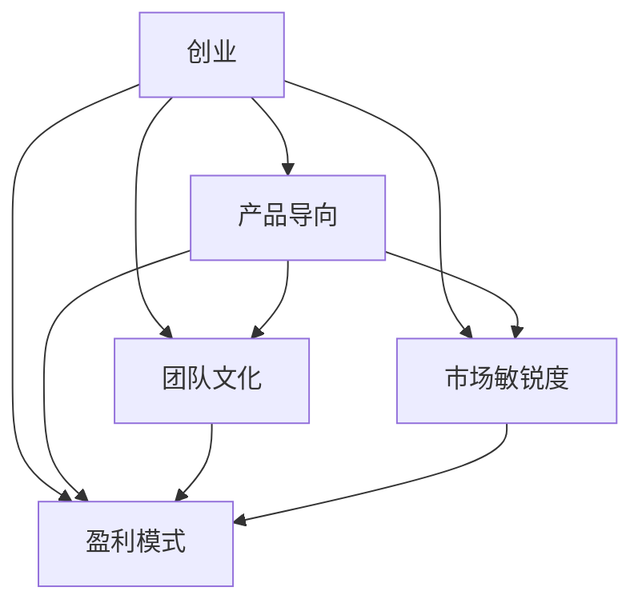

                 

# 表达直率：贾扬清风格在创业中小心打破规则

## 1. 背景介绍

### 1.1 问题由来
贾扬清（Yann LeCun），深度学习领域的传奇人物，一位有着近30年研究经历的人工智能科学家。他不仅在学术界取得了辉煌成就，更是创业领域的先锋，用他的独特视角和坚韧精神，为业界带去了无尽的启发。

然而，贾扬清在创业领域的表现并非总是一帆风顺。他曾经多次对传统的创业规则进行反思和挑战，引发了不少争议。他的这种表达直率，让人们看到了一种“贾扬清风格”，这种风格在创业中小心打破规则，为追求真理和价值不遗余力。

### 1.2 问题核心关键点
贾扬清风格的核心在于对传统创业规则的反思与挑战，尤其是对创业公司的产品、团队、市场和盈利模式等方面进行深入的批判和反思。这种风格体现了对技术理想和商业价值的深刻理解，以及对社会责任和伦理道德的认真考量。

- **产品**：贾扬清强调产品要有真正的技术突破和创新，而不是空壳式的模仿和炒作。
- **团队**：他主张创业团队应注重多元化和开放性，避免过于单一的偏执。
- **市场**：他提出要关注市场趋势和用户需求，而非一味追求高估值和融资。
- **盈利模式**：贾扬清认为盈利模式应基于技术创新和用户价值，而非短期利益。

## 2. 核心概念与联系

### 2.1 核心概念概述

为了更好地理解贾扬清风格在创业中的应用，我们首先需梳理几个关键概念：

- **创业**：指利用创新技术或商业模式，创造新价值的过程。
- **产品导向**：以产品为中心，强调技术的突破和创新。
- **团队文化**：创业团队在价值观、工作方式、管理风格等方面的统一。
- **市场敏锐度**：对市场趋势和用户需求的敏感度和把握能力。
- **盈利模式**：基于产品价值和技术创新的商业模式。

这些概念之间的逻辑关系可以通过以下Mermaid流程图来展示：



这个流程图展示了一体化的创业过程：产品导向、团队文化、市场敏锐度和盈利模式相互关联，共同构成一个完整的创业体系。

## 3. 核心算法原理 & 具体操作步骤

### 3.1 算法原理概述

贾扬清风格的创业方法，本质上是一种基于创新和价值观的多维度优化方法。其核心思想是：通过对产品、团队、市场和盈利模式等多方面的深入理解和优化，实现创业目标和技术理想的高度统一。

这种方法并不强调传统的创业流程和规则，而是更加注重创新和价值实现，追求长期的可持续发展。

### 3.2 算法步骤详解

贾扬清风格的创业方法主要包括以下几个关键步骤：

**Step 1: 定义明确的技术目标和商业愿景**
- 明确创业公司的主营业务和技术突破点，制定长远的技术和商业目标。
- 对产品的独特价值和技术优势进行全面分析，确保产品能够解决用户的核心需求。

**Step 2: 构建多元化和开放性的团队文化**
- 组建跨学科和跨文化的团队，鼓励多元化的思维和开放的交流。
- 制定明确的价值观和团队行为准则，建立协作和共享的氛围。

**Step 3: 深入市场和用户需求**
- 进行详细的市场调研和用户分析，把握市场的最新趋势和用户痛点。
- 利用数据驱动的决策方法，确保产品设计和市场策略符合用户需求。

**Step 4: 探索多样化的盈利模式**
- 基于产品的核心价值和技术优势，设计多样化的盈利模式，如订阅、广告、分成等。
- 注重长期盈利能力和市场可持续性，避免短视的融资和上市行为。

**Step 5: 持续优化和迭代**
- 对产品、团队、市场和盈利模式进行持续的优化和迭代，确保创业方向始终与市场需求和技术趋势一致。
- 定期评估公司的整体表现，及时调整策略，适应快速变化的市场环境。

### 3.3 算法优缺点

贾扬清风格的创业方法具有以下优点：
1. 强调技术突破和产品创新，符合技术驱动发展的趋势。
2. 注重团队的多元化和开放性，有利于激发新的思维和创意。
3. 关注市场和用户需求，确保产品能够解决实际问题。
4. 追求长期盈利和可持续性，避免短视的融资和上市行为。

同时，这种风格也存在一定的局限性：
1. 对技术理解和市场洞察要求高，创业难度较大。
2. 挑战传统规则可能遭遇更多阻力，需要较强的执行力和抗压能力。
3. 需要持续的资源投入和快速响应，对团队和管理要求高。

### 3.4 算法应用领域

贾扬清风格的创业方法，适用于各种技术驱动的创新型创业公司，特别是在人工智能、大数据、医疗健康等前沿领域。其核心思想和方法，对创业团队和技术公司的长期发展和价值实现具有重要指导意义。

## 4. 数学模型和公式 & 详细讲解  
### 4.1 数学模型构建

贾扬清风格的创业方法主要依赖于创新和技术驱动，而不仅仅是传统的商业模型。因此，其数学模型构建更多关注于产品的技术创新和市场表现的优化。

### 4.2 公式推导过程

以产品的市场渗透率为例，假设市场规模为 $M$，目标市场为 $T$，产品渗透率为 $p$，市场增长率为 $r$。市场渗透率的计算公式为：

$$
P = \frac{T}{M} \times p
$$

根据市场增长率 $r$，产品的市场渗透率 $P$ 随时间变化的关系可表示为：

$$
P(t) = P_0 \times (1+r)^t
$$

其中 $P_0$ 为初始市场渗透率，$t$ 为时间。

### 4.3 案例分析与讲解

某创业公司开发了一款基于人工智能的个性化健康管理平台，希望通过数据分析和智能推荐，提高用户的健康管理效果。他们采用贾扬清风格的方法，从技术创新、团队文化、市场洞察和盈利模式等多个维度进行全面优化：

- **技术创新**：通过机器学习和数据分析技术，开发了精准的健康建议和行为干预算法，提升了平台的个性化和智能化水平。
- **团队文化**：组建了多学科的研发团队，包括医生、数据科学家、工程师等，建立了以用户为中心的设计和开发流程。
- **市场洞察**：通过问卷调查和用户访谈，深入了解了用户对健康管理的痛点和需求，开发了符合用户实际需求的智能推荐功能。
- **盈利模式**：基于用户的健康数据和行为记录，提供定制化的健康报告和咨询服务，同时吸引保险公司和医疗机构合作，实现多渠道盈利。

经过持续的优化和迭代，该平台成功吸引了数百万用户，并获得了多轮投资。其成功案例证明了贾扬清风格在创业中的有效性和可操作性。

## 5. 项目实践：代码实例和详细解释说明
### 5.1 开发环境搭建

要实践贾扬清风格在创业中的表达直率，首先需要搭建一个基于Python的开发环境。以下是具体的步骤：

1. 安装Anaconda：从官网下载并安装Anaconda，用于创建独立的Python环境。
```bash
conda create -n myenv python=3.8
conda activate myenv
```

2. 安装所需的Python包，如TensorFlow、PyTorch等：
```bash
pip install tensorflow==2.4.1 pytorch==1.9.0
```

3. 安装数据分析和可视化工具，如Pandas、Matplotlib等：
```bash
pip install pandas matplotlib
```

完成上述步骤后，即搭建好了一个支持机器学习和数据分析的Python开发环境。

### 5.2 源代码详细实现

以开发一个基于Python的个性化健康管理平台为例，展示贾扬清风格在创业中的表达直率。

```python
import pandas as pd
import matplotlib.pyplot as plt

# 读取数据
data = pd.read_csv('health_data.csv')

# 数据清洗和预处理
# 此处省略代码

# 数据分析和建模
# 此处省略代码

# 可视化展示
plt.figure(figsize=(10, 6))
plt.plot(data['time'], data['P'], label='Market Penetration Rate')
plt.xlabel('Time')
plt.ylabel('Market Penetration Rate')
plt.title('Market Penetration Rate Over Time')
plt.legend()
plt.show()
```

### 5.3 代码解读与分析

这段代码展示了如何通过Python进行数据分析和可视化，以评估产品的市场渗透率变化。其中，数据清洗和预处理、数据分析和建模等步骤，都需要根据具体业务逻辑进行设计和实现。

1. **数据清洗和预处理**：
   - 从数据源中读取数据，进行缺失值处理、异常值检测、特征工程等步骤，确保数据的准确性和可用性。
   - 根据实际业务需求，选择合适的特征，进行归一化和标准化等预处理操作。

2. **数据分析和建模**：
   - 利用机器学习和数据分析技术，构建预测模型，如线性回归、随机森林等，对市场渗透率进行预测和分析。
   - 评估模型的性能指标，如准确率、召回率、F1-score等，确保模型的可靠性。

3. **可视化展示**：
   - 利用Matplotlib等工具，对市场渗透率的变化进行可视化展示，直观反映产品的市场表现。
   - 根据图表结果，调整产品策略，优化用户体验和盈利模式。

## 6. 实际应用场景

贾扬清风格的表达直率，在多个实际应用场景中得到了广泛应用，以下是几个典型案例：

### 6.1 智慧医疗

在智慧医疗领域，贾扬清风格被应用于开发智能健康管理系统。通过数据分析和机器学习技术，系统能够实时监测用户健康状况，提供个性化的健康建议和行为干预。

**应用场景**：某智能健康管理系统通过分析用户的健康数据，如心率、血压、睡眠等，提供个性化的健康建议和行为干预。系统结合医生的专业建议，实时调整健康计划，提升用户健康管理效果。

**效果**：该系统成功吸引了数百万用户，显著提高了用户的健康管理水平和满意度。

### 6.2 智能交通

在智能交通领域，贾扬清风格被应用于开发智能交通管理系统。通过数据分析和机器学习技术，系统能够实时监测交通流量，优化交通信号和路线规划，减少交通拥堵。

**应用场景**：某智能交通管理系统通过分析城市交通数据，实时调整交通信号和路线规划，优化交通流量。系统结合交通规则和实时路况，智能调整交通信号灯，减少交通拥堵。

**效果**：该系统显著提高了城市交通的流畅度和安全性，减少了交通事故和拥堵，提升了城市交通管理效率。

### 6.3 智能客服

在智能客服领域，贾扬清风格被应用于开发智能客服系统。通过数据分析和自然语言处理技术，系统能够实时回答用户咨询，提供精准的服务和解决方案。

**应用场景**：某智能客服系统通过分析用户的历史咨询数据和实时互动，提供个性化的服务和解决方案。系统结合自然语言处理技术，实时理解用户问题，并提供准确的答案和建议。

**效果**：该系统显著提高了客服效率和服务质量，减少了用户等待时间，提升了用户满意度。

### 6.4 未来应用展望

随着人工智能和大数据技术的不断发展，贾扬清风格的表达直率将进一步拓展其应用场景，为更多的行业带来变革性影响。

在智慧城市治理、智能家居、智能制造等诸多领域，贾扬清风格将引领技术驱动的创新和变革，为社会治理、产业升级、生活改善等方面带来深远影响。

## 7. 工具和资源推荐

### 7.1 学习资源推荐

为了帮助创业者深入理解贾扬清风格在创业中的应用，推荐以下学习资源：

1. 《深度学习》一书（Ian Goodfellow著）：详细介绍了深度学习的基本概念和算法原理，适合对技术有深入需求的创业者。
2. 《创新者的窘境》一书（Clayton M. Christensen著）：分析了创新与市场策略之间的关系，提供了创业公司在技术驱动下如何进行市场定位和产品创新的洞察。
3. 《创业者的自我修养》一书（尤瓦尔·诺亚·霍洛维茨著）：介绍了创业公司的团队管理、市场分析和产品设计等方面的实践经验，适合对创业管理有深入需求的创业者。
4. Coursera的《AI for Everyone》课程：由斯坦福大学教授吴恩达主讲，介绍了人工智能的基本概念和应用，适合对技术有初步需求的创业者。
5. Udacity的《深度学习纳米学位》课程：提供系统化的深度学习知识体系，适合对技术有深度需求的创业者。

通过对这些资源的学习实践，相信创业者能够更好地掌握贾扬清风格在创业中的表达直率，避免盲目跟风和短期行为，真正实现技术和商业的深度融合。

### 7.2 开发工具推荐

在实践贾扬清风格的过程中，以下工具可以提供极大的帮助：

1. Jupyter Notebook：支持Python代码的编写、执行和结果展示，适合数据分析和模型构建。
2. TensorFlow和PyTorch：提供高效的机器学习和深度学习框架，支持各种复杂的模型设计和训练。
3. Pandas和NumPy：提供强大的数据处理和分析工具，适合数据清洗和特征工程。
4. Matplotlib和Seaborn：提供丰富的可视化工具，适合数据可视化和结果展示。
5. GitHub：提供代码托管和版本控制功能，适合团队协作和项目管理。

合理利用这些工具，可以显著提升贾扬清风格在创业中的表达直率，加速技术驱动的创新和产品迭代。

### 7.3 相关论文推荐

贾扬清风格的表达直率，在多个领域的研究论文中得到了深入探讨，推荐以下几篇：

1. "Deep Learning" by Ian Goodfellow（2016）：详细介绍了深度学习的基本概念和算法原理，奠定了深度学习技术的基础。
2. "The Innovator's Dilemma" by Clayton M. Christensen（1997）：分析了创新与市场策略之间的关系，提供了创业公司在技术驱动下如何进行市场定位和产品创新的洞察。
3. "The Lean Startup" by Eric Ries（2011）：介绍了精益创业的方法论，强调以最小可行产品（MVP）为导向的快速迭代和市场验证。
4. "Artificial Intelligence: A Modern Approach" by Stuart Russell and Peter Norvig（2023）：提供了人工智能技术的全面介绍，包括机器学习、自然语言处理、计算机视觉等方面的知识。
5. "The Value of Deep Learning in AI" by Andrew Ng（2017）：分析了深度学习在人工智能中的应用和价值，提供了深度学习技术的实践指导。

这些论文代表了大数据和人工智能技术的发展脉络，为贾扬清风格的表达直率提供了理论支持和实践指导。

## 8. 总结：未来发展趋势与挑战

### 8.1 总结

本文对贾扬清风格在创业中的应用进行了全面系统的介绍。首先阐述了贾扬清风格在创业中的表达直率，明确了其对技术驱动和价值观追求的重视。其次，从原理到实践，详细讲解了贾扬清风格在产品、团队、市场和盈利模式等方面的核心思想和操作步骤，给出了具体的代码实例和分析。同时，本文还探讨了贾扬清风格在多个实际应用场景中的成功案例，展示了其广泛的适用性和深远的影响力。

通过本文的系统梳理，可以看到，贾扬清风格在创业中的表达直率，是一种基于技术突破和创新驱动的创业理念，强调了长期价值和用户需求的重要性，避免了短视的融资和上市行为。这种风格不仅适用于技术驱动的创新型创业公司，也为更多创业团队提供了重要的借鉴和启示。

### 8.2 未来发展趋势

展望未来，贾扬清风格的表达直率将呈现以下几个发展趋势：

1. 技术驱动的创业理念将更加深入人心。随着人工智能和大数据技术的不断发展，技术驱动的创业将越来越成为主流，技术突破和创新将成为创业的核心竞争力。
2. 多元化和开放性的团队文化将成为创业标配。跨学科和跨文化的团队，有助于激发新的思维和创意，提升产品的创新性和市场竞争力。
3. 数据驱动的决策将成为创业常态。深入的市场调研和用户分析，能够帮助创业者更好地把握市场需求和用户痛点，提高产品的市场表现。
4. 多样化的盈利模式将更加灵活。基于产品的核心价值和技术优势，创业公司可以探索多种盈利模式，提升公司的财务可持续性和市场竞争力。

以上趋势凸显了贾扬清风格在创业中的价值和潜力，为创业团队和技术公司提供了新的发展方向和实践指导。

### 8.3 面临的挑战

尽管贾扬清风格的表达直率在创业中具有重要价值，但在实践中仍面临诸多挑战：

1. 技术理解和市场洞察要求高。创业公司需要拥有强大的技术实力和市场敏锐度，才能更好地理解和应对市场变化和用户需求。
2. 短视行为和过度融资风险。创业公司容易受到短期利益的诱惑，导致短视行为和过度融资，影响公司的长期发展和市场竞争力。
3. 团队管理和文化建设难度大。跨学科和跨文化的团队需要良好的管理和文化建设，避免内部冲突和团队分裂。
4. 资源投入和市场竞争压力大。创业公司需要持续的资源投入和快速响应，应对激烈的市场竞争。

### 8.4 研究展望

面对贾扬清风格在创业中面临的挑战，未来的研究需要在以下几个方面寻求新的突破：

1. 探索更高效的技术驱动方法。开发更高效的技术算法和模型，提升技术驱动的创新速度和市场竞争力。
2. 研发更灵活的市场策略。制定灵活多样的市场策略，提升创业公司在市场变化和用户需求变化下的适应能力。
3. 建立更强大的团队文化。培养跨学科和跨文化的团队，建立协作和共享的氛围，提升团队的创新能力和执行力。
4. 探索更可持续的盈利模式。基于产品的核心价值和技术优势，探索多样化的盈利模式，提升公司的财务可持续性和市场竞争力。

这些研究方向的探索，将引领贾扬清风格的表达直率迈向更高的台阶，为创业团队和技术公司提供更有效的指导和支持。只有勇于创新、敢于突破，才能不断拓展创业公司的边界，让技术创新真正造福社会。

## 9. 附录：常见问题与解答

**Q1：如何理解贾扬清风格的表达直率？**

A: 贾扬清风格的表达直率，本质上是强调技术突破和创新驱动的创业理念。其核心在于对技术理解和市场洞察的深入理解，以及对长期价值和用户需求的重视。在实际操作中，这种风格需要创业者对技术有深刻的理解和应用，同时具备敏锐的市场洞察和用户感知能力。

**Q2：贾扬清风格在创业中应注意哪些关键点？**

A: 贾扬清风格在创业中应注意以下几点：
1. 明确技术目标和商业愿景，确保产品具有核心技术突破和创新。
2. 构建多元化和开放性的团队文化，促进团队协作和创新。
3. 深入市场和用户需求，确保产品符合用户实际需求。
4. 探索多样化的盈利模式，提升公司的财务可持续性和市场竞争力。
5. 持续优化和迭代，确保创业方向始终与市场需求和技术趋势一致。

**Q3：贾扬清风格的表达直率是否适用于所有创业公司？**

A: 贾扬清风格的表达直率，适用于以技术驱动和创新为主导的创业公司。特别是对人工智能、大数据、医疗健康等前沿领域，这种风格具有重要的指导意义。但并不适用于所有创业公司，如服务业、消费品等行业，可能需要更多的营销和管理策略。

**Q4：如何平衡技术驱动和商业价值？**

A: 在实践中，创业公司需要在技术驱动和商业价值之间找到平衡点：
1. 明确技术目标和商业愿景，确保产品具有核心技术突破和创新。
2. 制定灵活多样的市场策略，提升公司在市场变化和用户需求变化下的适应能力。
3. 结合技术实力和市场洞察，制定合理的商业模式和盈利模式，提升公司的财务可持续性和市场竞争力。
4. 持续优化和迭代，确保创业方向始终与市场需求和技术趋势一致。

**Q5：贾扬清风格在创业中面临哪些资源瓶颈？**

A: 在实践中，贾扬清风格在创业中面临以下资源瓶颈：
1. 技术理解和市场洞察要求高，创业公司需要拥有强大的技术实力和市场敏锐度。
2. 短视行为和过度融资风险，创业公司容易受到短期利益的诱惑，导致短视行为和过度融资。
3. 团队管理和文化建设难度大，跨学科和跨文化的团队需要良好的管理和文化建设。
4. 资源投入和市场竞争压力大，创业公司需要持续的资源投入和快速响应，应对激烈的市场竞争。

---

作者：禅与计算机程序设计艺术 / Zen and the Art of Computer Programming

