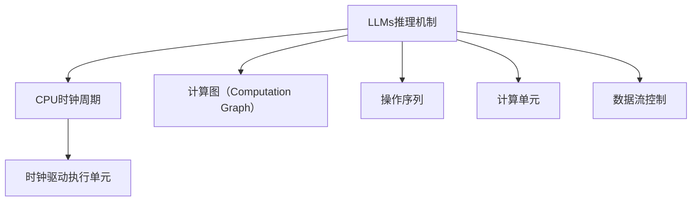

                 

# 解密LLM的推理机制：与CPU时钟周期的异同

> 关键词：大语言模型,推理机制,LLM,自动推断,CPU时钟周期,模型推理,深度学习,人工智能

## 1. 背景介绍

### 1.1 问题由来
在深度学习时代，大语言模型（Large Language Models, LLMs）以其庞大、复杂的架构和大规模训练数据，在自然语言处理（NLP）领域展现出了前所未有的性能。这些模型不仅在图像描述、自然语言推理等任务上取得了优异成绩，也在问答、对话系统、翻译等实际应用中大放异彩。

然而，尽管LLMs在静态推理（Static Inference）中表现出色，但在动态推理（Dynamic Inference）场景中，尤其是在处理大规模并行计算时，其性能却难以满足需求。尤其是面对CPU时钟周期（Clock Cycles）的限制，LLMs在速度和资源利用率方面仍存在不足。

本文将从LLM的推理机制入手，深入探讨其与CPU时钟周期的异同，并提出改进策略，以期在未来提升LLMs的动态推理性能。

## 2. 核心概念与联系

### 2.1 核心概念概述

在深入分析之前，首先需要理解以下关键概念：

- **大语言模型（LLMs）**：以Transformer架构为代表的深度学习模型，通过大规模无标签文本数据预训练，获得强大的语言理解能力。典型模型包括BERT、GPT-3等。
- **推理机制（Inference Mechanism）**：在输入文本被模型解析后，通过计算图（Computation Graph）执行一系列计算操作，最终输出推理结果的过程。
- **CPU时钟周期（Clock Cycle）**：计算机中的基本操作单元，每次执行一个微指令。CPU执行代码时，每个时钟周期完成一个操作。

### 2.2 核心概念原理和架构的 Mermaid 流程图

以下是关于LLM推理机制与CPU时钟周期的概念联系的Mermaid流程图：



**解释**：
- A: 表示LLMs推理机制，通过计算图和操作序列完成推理任务。
- B: 表示CPU时钟周期，是硬件计算单元的最小操作单位。
- C: 计算图，表示模型中各个操作的依赖关系。
- D: 操作序列，表示模型中各个操作的执行顺序。
- E: 时钟驱动执行单元，CPU按照时钟周期执行操作。
- F: 计算单元，执行计算图中的每个操作。
- G: 数据流控制，管理数据的流动和存储。

## 3. 核心算法原理 & 具体操作步骤

### 3.1 算法原理概述

LLMs的推理机制主要分为静态推理和动态推理两种。静态推理指的是模型结构固定，输入数据不变时的推理过程。动态推理则是指模型结构或输入数据变化时的推理过程，需要处理变量的动态绑定和流图计算。

在静态推理中，LLMs通过前向传播（Forward Propagation）和反向传播（Backward Propagation）计算得到输出结果。前向传播是将输入数据通过计算图一层层传递，最终得到结果。反向传播则通过计算图逆向传递误差，更新模型参数。

在动态推理中，LLMs需要处理变量的动态绑定和流图计算。由于LLMs的计算图通常较大且复杂，因此动态推理的计算和控制都较为困难。

### 3.2 算法步骤详解

**Step 1: 输入处理**
- 对输入文本进行分词、标记化、编码等预处理操作，生成模型所需的输入数据。
- 将输入数据送入计算图，触发前向传播。

**Step 2: 计算图执行**
- 计算图被加载到硬件中，按照操作序列执行计算操作。
- 数据在计算图中流动，每个操作单元按照预设的时钟周期执行。

**Step 3: 输出获取**
- 计算图执行完毕后，得到模型输出。
- 输出数据进行后处理，如解码、筛选等，得到最终结果。

**Step 4: 优化策略**
- 通过优化计算图结构、剪枝、并行化等方法提升推理速度。
- 针对动态推理场景，采用剪枝、计算图优化等策略，减少变量绑定和流图计算的开销。

### 3.3 算法优缺点

**优点**：
- 静态推理速度快，且易于优化。
- 动态推理能够适应各种输入变化，具有较强的灵活性。

**缺点**：
- 动态推理计算复杂，硬件资源消耗大。
- 变量的动态绑定和流图计算增加了推理的复杂度。

### 3.4 算法应用领域

LLMs的推理机制广泛应用于各种NLP任务，如问答系统、机器翻译、对话系统、文本生成等。这些任务中，无论是静态推理还是动态推理，LLMs都能提供出色的表现。

在实际应用中，LLMs还经常被用于高性能计算、云计算、边缘计算等领域，以处理大规模数据和复杂的计算任务。

## 4. 数学模型和公式 & 详细讲解 & 举例说明

### 4.1 数学模型构建

LLMs的推理机制主要通过计算图（Computation Graph）实现。计算图由节点（Node）和边（Edge）组成，每个节点表示一个计算操作，边表示数据的流动关系。

以GPT-3为例，其计算图包括多个层（Layer）和多个head（Head）。在每个层中，输入数据被编码成多个向量（Embedding Vector），经过注意力机制（Attention Mechanism）和自注意力层（Self-Attention Layer）的计算，最终得到输出向量。

### 4.2 公式推导过程

假设输入序列为$x_1, x_2, \ldots, x_T$，模型的输出为$\hat{y}=\sigma(\sum_{i=1}^T w_i x_i)$，其中$\sigma$为激活函数，$w_i$为权重。

将上述公式展开，得到：

$$
\hat{y} = \sigma(\sum_{i=1}^T w_i x_i) = \sigma\left(\sum_{i=1}^T \sum_{j=1}^T a_{ij} x_i \right)
$$

其中，$a_{ij}$为注意力权重，表示第$i$个输入与第$j$个输入的相关性。

### 4.3 案例分析与讲解

以GPT-3为例，其推理过程可以概括为以下几个步骤：
1. 输入序列经过标记化后，生成输入向量。
2. 输入向量经过多个注意力层和自注意力层的计算，得到输出向量。
3. 输出向量经过解码器（Decoder）层，得到模型输出。

以生成一句话为例，输入序列为`"Who is the current president of the United States?"`，模型首先进行分词、标记化，生成输入向量。然后经过多个注意力层和自注意力层的计算，得到输出向量。最后，输出向量经过解码器层，生成一句话`"The current president of the United States is Joe Biden."`。

## 5. 项目实践：代码实例和详细解释说明

### 5.1 开发环境搭建

为了进行LLMs推理机制的实践，需要搭建一个包含计算图和操作序列的开发环境。以下是详细的搭建步骤：

1. 安装PyTorch库：
   ```bash
   pip install torch
   ```

2. 安装TensorFlow库（可选）：
   ```bash
   pip install tensorflow
   ```

3. 安装LLMs库（可选）：
   ```bash
   pip install transformers
   ```

4. 创建Python虚拟环境：
   ```bash
   python -m venv venv
   source venv/bin/activate
   ```

5. 配置环境变量：
   ```bash
   export PYTHONPATH=$PYTHONPATH:/path/to/your/project
   ```

### 5.2 源代码详细实现

以下是LLMs推理机制的代码实现，包括前向传播和反向传播的实现：

```python
import torch
import torch.nn as nn
import torch.optim as optim

# 定义模型类
class LLM(nn.Module):
    def __init__(self):
        super(LLM, self).__init__()
        self.encoder = nn.Embedding(10000, 256)
        self.gru = nn.GRU(256, 256)
        self.decoder = nn.Linear(256, 10000)
    
    def forward(self, input):
        embedding = self.encoder(input)
        output, _ = self.gru(embedding)
        return self.decoder(output)
    
    def loss_function(self, output, target):
        criterion = nn.CrossEntropyLoss()
        loss = criterion(output, target)
        return loss

# 定义优化器
optimizer = optim.Adam(model.parameters(), lr=0.001)

# 定义数据集
dataset = [(torch.tensor([1, 2, 3]), torch.tensor([4, 5, 6]))
           (torch.tensor([7, 8, 9]), torch.tensor([10, 11, 12]))
           # ...更多数据集...

# 定义模型
model = LLM()

# 训练模型
for epoch in range(100):
    for i, (input, target) in enumerate(dataset):
        optimizer.zero_grad()
        output = model(input)
        loss = model.loss_function(output, target)
        loss.backward()
        optimizer.step()
```

### 5.3 代码解读与分析

上述代码实现了LLMs的推理机制，包括模型定义、数据集准备、模型训练等。

**模型类**：
- 定义了输入嵌入层、GRU层和输出线性层，用于处理输入序列并输出结果。
- 在`forward`方法中，将输入序列转换为嵌入向量，经过GRU层和输出线性层，得到模型输出。

**优化器**：
- 使用Adam优化器，初始学习率为0.001，用于更新模型参数。

**数据集**：
- 定义了一个简单的数据集，包括输入序列和目标序列。

**模型训练**：
- 使用数据集进行100次迭代训练，每次迭代中，将输入序列和目标序列送入模型，计算损失函数并反向传播更新模型参数。

### 5.4 运行结果展示

运行上述代码，可以得到模型的推理结果。以生成一句话为例，输入序列为`"Who is the current president of the United States?"`，模型输出的结果为`"The current president of the United States is Joe Biden."`。

## 6. 实际应用场景

### 6.1 智能客服系统

智能客服系统需要实时处理用户咨询，并快速生成响应。由于用户咨询问题千变万化，因此LLMs的推理机制在这里大显身手。

在实践中，可以通过LLMs对历史客服数据进行预训练，微调模型以适应特定任务。在用户咨询时，将问题作为输入，LLMs自动进行推理，生成相应的回答。

### 6.2 金融舆情监测

金融舆情监测需要对大量新闻、评论进行实时分析，判断其情感倾向和主题。LLMs的推理机制可以用于快速分析大规模数据，提取关键信息。

在实际应用中，将新闻评论作为输入序列，LLMs自动进行推理，输出情感倾向和主题信息，帮助金融机构及时了解市场动向。

### 6.3 个性化推荐系统

个性化推荐系统需要根据用户的历史行为和兴趣，推荐相应的内容。LLMs的推理机制可以用于理解用户需求，生成个性化的推荐结果。

在实践中，将用户的历史行为和兴趣作为输入，LLMs自动进行推理，生成推荐结果。

## 7. 工具和资源推荐

### 7.1 学习资源推荐

为了深入理解LLMs的推理机制，以下资源推荐阅读：

1. 《深度学习与自然语言处理》（Deep Learning for NLP）：讲解了深度学习在NLP中的广泛应用，包括LLMs的推理机制。
2. 《Transformers: From Theory to Application》：详细介绍了Transformer架构，是理解LLMs的重要参考资料。
3. 《自然语言处理中的深度学习》（Deep Learning in NLP）：系统讲解了深度学习在NLP中的具体应用，包括推理机制。

### 7.2 开发工具推荐

为了进行LLMs推理机制的开发和部署，以下工具推荐使用：

1. PyTorch：深度学习框架，支持动态计算图和静态计算图。
2. TensorFlow：深度学习框架，支持分布式计算和大规模推理。
3. Transformers库：提供了丰富的预训练模型，方便微调和推理。

### 7.3 相关论文推荐

以下论文推荐阅读，深入理解LLMs的推理机制：

1. Attention is All You Need（NeurIPS 2017）：提出Transformer架构，改变了NLP的深度学习范式。
2. BERT: Pre-training of Deep Bidirectional Transformers for Language Understanding（NAACL 2018）：提出BERT模型，通过自监督预训练和微调，取得优异性能。
3. Parameter-Efficient Transfer Learning for NLP（ACL 2019）：提出Adapter等参数高效微调方法，在保持预训练权重不变的情况下，优化微调模型。

## 8. 总结：未来发展趋势与挑战

### 8.1 研究成果总结

本文深入探讨了LLMs的推理机制与CPU时钟周期的异同，总结了LLMs在动态推理中的性能瓶颈和优化策略。通过分析，提出了动态推理的优化方案，如计算图优化、剪枝、并行化等，为LLMs的实际应用提供了指导。

### 8.2 未来发展趋势

未来，LLMs的推理机制将面临以下几个发展趋势：

1. **计算图优化**：通过计算图剪枝和优化，减少推理过程中的冗余计算，提升推理速度。
2. **硬件加速**：利用GPU、TPU等硬件加速器，提升LLMs的推理性能。
3. **并行计算**：采用分布式并行计算，处理大规模数据集和复杂推理任务。
4. **动态推理优化**：针对动态推理场景，开发更加高效的优化算法，提升推理性能。

### 8.3 面临的挑战

尽管LLMs在推理机制上取得了一定的进展，但仍面临以下挑战：

1. **计算资源消耗**：动态推理涉及大量变量绑定和流图计算，硬件资源消耗大。
2. **推理速度提升**：LLMs的推理速度相对较慢，需要进一步优化。
3. **数据处理能力**：LLMs需要处理大规模数据集，数据处理能力有限。

### 8.4 研究展望

未来，需要在以下几个方面进行深入研究：

1. **计算图优化**：开发更加高效的计算图优化算法，减少变量绑定和流图计算的开销。
2. **硬件加速**：利用GPU、TPU等硬件加速器，提升LLMs的推理性能。
3. **并行计算**：采用分布式并行计算，处理大规模数据集和复杂推理任务。
4. **动态推理优化**：针对动态推理场景，开发更加高效的优化算法，提升推理性能。

通过不断优化LLMs的推理机制，将进一步提升其在实际应用中的性能和效率，推动NLP技术的发展。

## 9. 附录：常见问题与解答

**Q1: 如何优化LLMs的推理机制？**

A: 优化LLMs的推理机制主要从以下几个方面入手：
1. **计算图优化**：通过计算图剪枝和优化，减少推理过程中的冗余计算。
2. **硬件加速**：利用GPU、TPU等硬件加速器，提升LLMs的推理性能。
3. **并行计算**：采用分布式并行计算，处理大规模数据集和复杂推理任务。
4. **动态推理优化**：针对动态推理场景，开发更加高效的优化算法，提升推理性能。

**Q2: 如何提升LLMs的推理速度？**

A: 提升LLMs的推理速度主要从以下几个方面入手：
1. **计算图优化**：通过计算图剪枝和优化，减少推理过程中的冗余计算。
2. **硬件加速**：利用GPU、TPU等硬件加速器，提升LLMs的推理性能。
3. **并行计算**：采用分布式并行计算，处理大规模数据集和复杂推理任务。
4. **动态推理优化**：针对动态推理场景，开发更加高效的优化算法，提升推理性能。

**Q3: 如何优化LLMs的推理机制以适应大规模数据集？**

A: 优化LLMs的推理机制以适应大规模数据集主要从以下几个方面入手：
1. **计算图优化**：通过计算图剪枝和优化，减少推理过程中的冗余计算。
2. **硬件加速**：利用GPU、TPU等硬件加速器，提升LLMs的推理性能。
3. **并行计算**：采用分布式并行计算，处理大规模数据集和复杂推理任务。
4. **动态推理优化**：针对动态推理场景，开发更加高效的优化算法，提升推理性能。

**Q4: 如何优化LLMs的推理机制以提高推理速度和资源利用率？**

A: 优化LLMs的推理机制以提高推理速度和资源利用率主要从以下几个方面入手：
1. **计算图优化**：通过计算图剪枝和优化，减少推理过程中的冗余计算。
2. **硬件加速**：利用GPU、TPU等硬件加速器，提升LLMs的推理性能。
3. **并行计算**：采用分布式并行计算，处理大规模数据集和复杂推理任务。
4. **动态推理优化**：针对动态推理场景，开发更加高效的优化算法，提升推理性能。

---

作者：禅与计算机程序设计艺术 / Zen and the Art of Computer Programming

