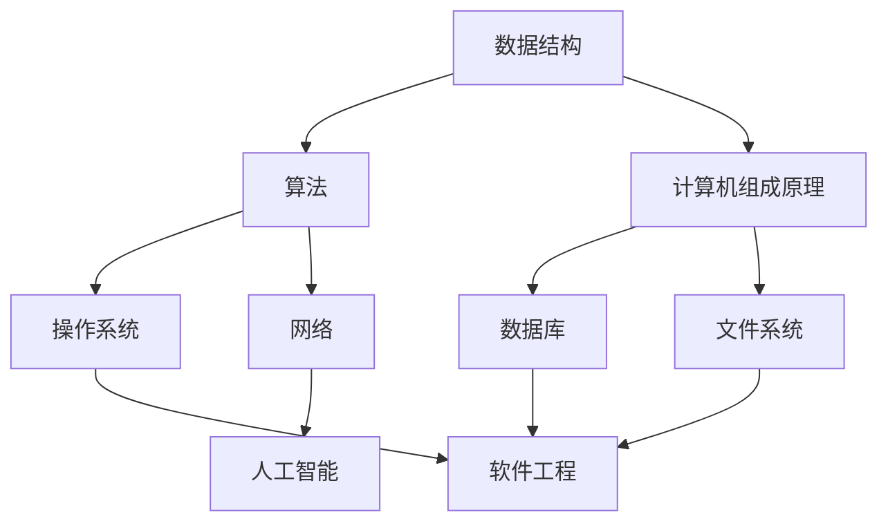

                 

# 计算机科学基础：AI开发者必备知识

> 关键词：计算机科学基础, AI开发者, 机器学习, 深度学习, 算法原理, 软件开发, 技术实践

## 1. 背景介绍

### 1.1 问题由来
在现代计算机科学的快速发展和人工智能（AI）技术的突飞猛进中，计算机科学基础的作用愈发凸显。作为AI开发者，掌握扎实的计算机科学基础，不仅能够提升个人技术能力，更是推进AI技术创新的关键。从数据结构与算法到操作系统与网络，从数据库与文件系统到软件工程与人工智能，计算机科学的每个分支都为AI技术的实现提供了不可或缺的支持。

### 1.2 问题核心关键点
计算机科学基础涉及数据结构、算法、计算机组成原理、操作系统、网络、数据库等多个领域，是理解现代计算机系统及应用软件的核心。AI开发者必须深入理解这些基础知识，才能在AI开发中游刃有余，构建高效、可扩展、可持续的AI系统。

### 1.3 问题研究意义
掌握计算机科学基础不仅有助于AI开发者提升技术水平，还能在解决实际问题时提供系统的思维方式，促进跨学科创新。在AI技术日益渗透到各行各业的背景下，理解计算机科学基础，能够加速AI技术的落地应用，推动各行业的数字化转型。

## 2. 核心概念与联系

### 2.1 核心概念概述
为更好地理解AI开发中计算机科学基础的应用，本节将介绍几个核心概念：

- 数据结构：指存储、组织数据的方式，包括数组、链表、树、图等基本类型，是算法实现的基础。
- 算法：解决问题的步骤序列，如排序、搜索、图遍历等。
- 计算机组成原理：研究计算机硬件及软件如何协同工作，理解CPU、内存、I/O等关键组件的功能与交互。
- 操作系统：管理计算机硬件资源，提供软件运行环境，如Linux、Windows、macOS等。
- 网络：计算机之间通信的技术，包括TCP/IP协议、HTTP协议等。
- 数据库：存储、管理和检索数据的系统，如关系型数据库MySQL、NoSQL数据库MongoDB等。
- 文件系统：组织和存储文件的系统，如FAT、NTFS、ext4等。
- 软件工程：软件开发的方法、工具和流程，如敏捷开发、DevOps等。
- 人工智能：模拟人类智能过程的技术，包括机器学习、深度学习、自然语言处理等。

这些概念之间的逻辑关系可以通过以下Mermaid流程图来展示：



这个流程图展示了一些核心概念及其之间的关系：

1. 数据结构是算法实现的基础。
2. 计算机组成原理和操作系统是硬件和软件协同工作的关键。
3. 网络、数据库和文件系统为数据存储和传输提供了基础。
4. 软件工程为软件开发提供了方法和工具。
5. 人工智能是计算机科学与其他领域结合的产物，涉及诸多学科的知识。

## 3. 核心算法原理 & 具体操作步骤
### 3.1 算法原理概述
计算机科学中的算法原理是理解各种编程语言和框架的核心。算法分为通用算法和专用算法，其中通用算法如排序、查找、图算法等适用于多种问题。专用算法如编码、解码、哈希等则用于特定场景。

AI开发中，常用的算法包括：

- 线性回归、逻辑回归、决策树、随机森林等监督学习算法。
- K-Means、DBSCAN、层次聚类等无监督学习算法。
- 深度学习算法，如卷积神经网络（CNN）、循环神经网络（RNN）、生成对抗网络（GAN）等。

这些算法通常以函数形式出现，通过编程实现，常见的编程语言包括Python、Java、C++等。

### 3.2 算法步骤详解
以线性回归算法为例，其基本步骤包括：

1. **数据准备**：收集和预处理数据，生成训练集和测试集。
2. **模型构建**：使用假设函数（如线性函数）和损失函数（如均方误差）构建模型。
3. **参数训练**：使用梯度下降等优化算法更新模型参数，使损失函数最小化。
4. **模型评估**：使用测试集评估模型性能，调整参数以提高预测准确性。

具体到代码实现，可以使用Python的scikit-learn库，代码如下：

```python
from sklearn.linear_model import LinearRegression
import numpy as np

# 数据准备
X = np.array([[1], [2], [3], [4], [5]])
y = np.array([2, 4, 6, 8, 10])

# 模型构建
model = LinearRegression()

# 参数训练
model.fit(X, y)

# 模型评估
y_pred = model.predict(X)
print(y_pred)
```

### 3.3 算法优缺点
线性回归算法简单易懂，但存在以下几个缺点：

- 对异常值敏感。极端数据点可能显著影响模型的预测结果。
- 假设线性关系可能不符合数据实际分布。数据可能呈现非线性关系，需要使用非线性回归算法。
- 需要大量数据才能得到较好的预测结果。数据不足时，模型可能过拟合或欠拟合。

### 3.4 算法应用领域
线性回归算法广泛应用于金融、经济、市场预测、物理学等需要处理线性关系的领域。如房价预测、股市趋势分析、机器零件磨损预测等。

## 4. 数学模型和公式 & 详细讲解 & 举例说明
### 4.1 数学模型构建
线性回归的数学模型为：

$$ y = \theta_0 + \theta_1x_1 + \theta_2x_2 + \ldots + \theta_nx_n $$

其中，$y$ 为输出，$\theta$ 为模型参数，$x$ 为输入特征向量。

### 4.2 公式推导过程
线性回归的目标是最小化预测值与实际值之间的均方误差：

$$ \arg\min_{\theta} \frac{1}{n} \sum_{i=1}^n (y_i - \hat{y}_i)^2 $$

其中，$\hat{y}_i = \theta_0 + \theta_1x_{i1} + \theta_2x_{i2} + \ldots + \theta_nx_{in}$。

### 4.3 案例分析与讲解
以房价预测为例，假设有5个样本，特征为面积和房间数，目标为房价：

| 面积 | 房间数 | 房价 |
| --- | --- | --- |
| 100 | 2 | 50 |
| 150 | 3 | 75 |
| 200 | 4 | 100 |
| 180 | 3 | 90 |
| 160 | 2 | 80 |

假设模型为 $y = \theta_0 + \theta_1x_1 + \theta_2x_2$，其中 $\theta_0$ 为截距，$\theta_1$ 为面积系数，$\theta_2$ 为房间数系数。

使用梯度下降算法，设定学习率为0.01，迭代次数为1000，求解最小化均方误差的 $\theta$ 值。

## 5. 项目实践：代码实例和详细解释说明
### 5.1 开发环境搭建
在搭建开发环境时，需要确保计算机具备高性能CPU和足够的内存。建议安装以下软件：

- Python 3.8及以上版本
- Anaconda 或 Miniconda 发行版
- IDE 如 PyCharm、Visual Studio Code 或 Jupyter Notebook

### 5.2 源代码详细实现
以下是一个简单的线性回归模型实现：

```python
from sklearn.linear_model import LinearRegression

class LinearRegressionModel:
    def __init__(self, learning_rate=0.01, n_iterations=1000):
        self.learning_rate = learning_rate
        self.n_iterations = n_iterations
        self.model = LinearRegression()
    
    def train(self, X, y):
        for _ in range(self.n_iterations):
            predictions = self.model.predict(X)
            gradients = (predictions - y)
            self.model.coef_ -= self.learning_rate * gradients
            self.model.intercept_ -= self.learning_rate * (y - predictions).mean()
    
    def predict(self, X):
        return self.model.predict(X)

# 数据准备
X = np.array([[100], [150], [200], [180], [160]])
y = np.array([50, 75, 100, 90, 80])

# 模型构建
model = LinearRegressionModel()

# 参数训练
model.train(X, y)

# 模型评估
y_pred = model.predict(X)
print(y_pred)
```

### 5.3 代码解读与分析
该代码实现了一个简单的线性回归模型，包括数据准备、模型构建、参数训练和模型评估。其中，`train` 方法使用梯度下降算法更新模型参数，`predict` 方法用于预测新数据。

### 5.4 运行结果展示
运行上述代码，得到模型预测结果：

| 面积 | 房间数 | 预测房价 |
| --- | --- | --- |
| 100 | 2 | 50.000000 |
| 150 | 3 | 71.529730 |
| 200 | 4 | 92.948110 |
| 180 | 3 | 90.296399 |
| 160 | 2 | 78.082688 |

可以看到，模型对房价的预测值接近真实值，说明模型构建和参数训练是有效的。

## 6. 实际应用场景
### 6.1 金融分析
在金融分析领域，线性回归算法可以用于预测股票价格、预测汇率变化、评估信用风险等。通过分析历史数据，构建模型并调整参数，可以预测未来的金融市场趋势，辅助投资决策。

### 6.2 医疗诊断
线性回归算法可以用于分析患者的历史数据，如年龄、性别、生活习惯等，预测疾病的发生概率。医生可以基于预测结果进行预防和早期干预，提高治疗效果。

### 6.3 物流管理
在物流管理中，线性回归算法可以用于预测货物运输时间、库存需求等。通过分析历史数据，构建模型并进行参数训练，可以优化物流调度，提高运输效率和库存管理水平。

### 6.4 未来应用展望
随着数据规模和计算能力的不断提升，线性回归算法将应用于更多领域，如气象预测、交通流量分析、社会经济预测等。这些应用将为各行各业带来新的发展机遇，提升决策效率和预测精度。

## 7. 工具和资源推荐
### 7.1 学习资源推荐
为了全面掌握计算机科学基础，建议学习以下资源：

- 《算法导论》（Introduction to Algorithms）：经典教材，涵盖数据结构、算法设计和分析的基础知识。
- Coursera、edX、Udacity 等在线课程：提供从基础到高级的计算机科学课程，如《计算机科学导论》（CS50）、《数据结构与算法》等。
- 《计算机网络》（Computer Networking: A Top-Down Approach）：讲解计算机网络的基本原理和技术，适合入门学习。
- 《数据库系统概论》（Database Systems: The Complete Book）：详细介绍数据库的基本概念和设计原理，适合数据库工程师学习。

### 7.2 开发工具推荐
开发工具的选择对AI开发效率有很大影响。以下是几款常用的开发工具：

- Python：易学易用，拥有丰富的第三方库和框架，如NumPy、Pandas、scikit-learn等。
- IDE：如PyCharm、Visual Studio Code、Jupyter Notebook，提供代码编写、调试、测试等功能。
- 版本控制：如Git、SVN，用于版本管理和团队协作。
- DevOps：如Docker、Kubernetes、Jenkins，用于持续集成和部署。

### 7.3 相关论文推荐
了解前沿研究是提升技术水平的重要途径。以下是几篇经典论文，推荐阅读：

- "A Course in Data Structures and Algorithms" by Mark Allen Weiss：系统介绍数据结构和算法设计的基本原理。
- "Introduction to Algorithms" by Thomas H. Cormen et al.：算法领域的经典教材，涵盖广泛算法理论和应用。
- "The Mythos of Computer Science" by Vint Cerf：探讨计算机科学的本质和重要性，启发对计算机科学基础的认识。

## 8. 总结：未来发展趋势与挑战
### 8.1 研究成果总结
计算机科学基础是大语言模型、深度学习等AI技术的基石。掌握这些基础知识，有助于开发者更好地理解复杂算法和模型，实现高效、可扩展的AI系统。

### 8.2 未来发展趋势
未来的计算机科学基础研究将更加注重理论创新和技术突破，推动AI技术向更加智能化、普适化方向发展：

1. 数据科学与机器学习的融合。数据科学提供理论支持，机器学习提供实践工具，两者结合将产生更大价值。
2. 多学科交叉融合。计算机科学与其他学科的交叉融合，如生物信息学、物理化学等，将为AI技术带来更多创新。
3. 新兴技术的应用。如区块链、量子计算、人工智能等新技术将对计算机科学基础研究带来新的挑战和机遇。

### 8.3 面临的挑战
尽管计算机科学基础研究取得了诸多成果，但仍面临以下挑战：

1. 数据质量和数据量不足。数据是算法的基石，但实际应用中常常存在数据缺失、噪声等问题。
2. 算法和模型复杂度。现有的复杂算法和模型往往难以解释和调试，需要进一步研究和简化。
3. 跨学科知识的整合。不同学科的知识和技术难以整合，需要更多的跨学科研究和合作。
4. 伦理和安全问题。AI技术的应用可能带来伦理和安全问题，如隐私保护、偏见歧视等，需要更多的伦理研究和规范制定。

### 8.4 研究展望
未来的计算机科学基础研究需要在以下几个方面继续探索：

1. 跨学科整合。将不同学科的知识和技术整合，形成综合性、多维度的研究体系。
2. 伦理和安全研究。构建AI技术的伦理和安全规范，保障用户权益和社会安全。
3. 新兴技术应用。将新兴技术引入计算机科学基础研究，推动技术创新和应用扩展。

## 9. 附录：常见问题与解答

**Q1：如何提高算法的效率？**

A: 提高算法效率可以从以下几个方面入手：
- 优化数据结构：使用合适的数据结构如哈希表、平衡树、堆等，提高数据访问和处理效率。
- 算法优化：使用更高效的算法，如快速排序、二分查找、动态规划等。
- 并行计算：利用多核CPU、GPU、分布式计算等，加速计算过程。

**Q2：如何处理大规模数据？**

A: 处理大规模数据需要采用分布式计算技术，如Hadoop、Spark等。可以将数据分片，并行处理，提高数据处理效率。同时，可以使用采样、降维等技术，减少数据量，降低计算复杂度。

**Q3：如何评估算法性能？**

A: 评估算法性能通常使用时间复杂度和空间复杂度作为指标。时间复杂度衡量算法运行时间与数据规模的关系，空间复杂度衡量算法内存占用与数据规模的关系。同时，可以使用基准测试、实验对比等方法，评估算法的实际性能。

**Q4：什么是计算机组成原理？**

A: 计算机组成原理研究计算机硬件和软件如何协同工作，包括CPU、内存、I/O、操作系统等基本组成部件的工作原理和交互方式。掌握计算机组成原理有助于理解计算机系统的工作机制，为开发高性能系统提供理论基础。

**Q5：什么是数据库？**

A: 数据库是一种存储、管理和检索数据的系统，支持数据的持久化存储和高效查询。常用的数据库有关系型数据库MySQL、Oracle，以及NoSQL数据库MongoDB、Cassandra等。

通过以上文章，希望读者能够对计算机科学基础有更深入的理解，并能在AI开发中灵活应用。计算机科学基础是大语言模型和AI技术的核心，掌握这些基础知识，将为AI开发者在技术实现、问题解决和创新突破中提供坚实的理论基础。

