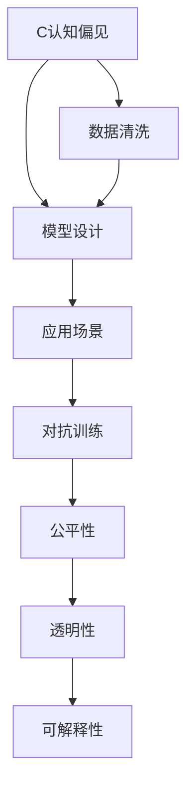

                 

# 认知偏见的克服：培养开放思维的方法

## 1. 背景介绍

在人工智能（AI）和机器学习的快速发展中，模型训练和使用中的认知偏见问题变得日益突出。尽管深度学习模型在众多任务上表现出色，但它们往往在数据、设计、应用等方面带有一定的偏见和局限性。这种偏见不仅可能导致模型性能下降，甚至会在实际应用中引发伦理和公平性问题。因此，克服认知偏见，培养开放思维，已经成为推动AI领域健康发展的重要方向。

### 1.1 问题由来

深度学习模型常常基于历史数据进行训练，这些数据往往带有现实世界中存在的不公平和偏见。模型在训练过程中可能无意中学习了这些偏见，并在应用时将这种偏见放大，影响决策的公正性和准确性。例如，在招聘、贷款审批等关键领域，AI模型可能会因为历史数据中的性别、种族、年龄等特征分布不均衡，而偏向于某种特定群体。这种系统性偏差可能导致对特定群体的不公平对待，甚至加剧社会不平等。

### 1.2 问题核心关键点

认知偏见的产生和传播，主要有以下核心因素：

1. **数据偏见**：训练数据不均衡、样本不充分、偏差性标签等问题导致模型学习到了不公正的偏见。
2. **模型设计偏见**：模型架构、损失函数、优化算法等设计上的偏见，可能导致模型偏好某些类型的样本，而忽视其他类型。
3. **应用场景偏见**：模型在特定场景下的应用，可能由于缺乏足够的上下文信息，导致决策失误。
4. **对抗攻击**：恶意攻击者可能会通过输入对抗样本，导致模型输出错误的判断。

### 1.3 问题研究意义

研究如何克服认知偏见，培养开放思维，对于推动AI技术的公平性和可靠性具有重要意义：

1. **提高模型公正性**：减少模型输出中的偏见，确保AI系统对所有群体的公平对待。
2. **提升模型可信度**：增强模型的透明性和可解释性，提高公众对AI系统的信任。
3. **促进社会进步**：通过公平、透明、可信赖的AI系统，促进社会正义和进步。
4. **推动技术创新**：克服偏见可以带来新的研究方向和应用领域，推动AI技术的全面发展。

## 2. 核心概念与联系

### 2.1 核心概念概述

为了更好地理解如何克服认知偏见和培养开放思维，我们先介绍一些关键概念：

1. **认知偏见**：指在决策过程中，由于主观偏好、刻板印象、数据不均衡等原因导致的系统性偏差。
2. **开放思维**：指在面对新知识和新观念时，保持开放心态，愿意接受并思考多种可能的解释和解决方案。
3. **数据清洗和预处理**：指在数据收集和处理阶段，去除或修正可能带有偏见的数据点，确保数据质量。
4. **公平性、透明性和可解释性**：指AI系统在设计和应用中应具备的特征，确保模型输出公正、可信、易理解。
5. **对抗训练**：指在训练过程中引入对抗样本，提高模型的鲁棒性和泛化能力。

这些概念之间的关系可以通过以下Mermaid流程图来展示：



这个流程图展示了从认知偏见到模型应用的全流程，各环节相互影响、相互促进。

## 3. 核心算法原理 & 具体操作步骤

### 3.1 算法原理概述

克服认知偏见和培养开放思维，主要依赖于以下几个关键步骤：

1. **数据清洗和预处理**：通过数据清洗和预处理技术，去除或修正带有偏见的数据，确保数据集质量。
2. **公平性约束**：在设计模型时，引入公平性约束，如均衡分类、对偶学习等，减少模型在特定群体上的偏差。
3. **对抗训练**：通过引入对抗样本，训练模型对抗各种攻击，增强模型的鲁棒性和泛化能力。
4. **模型透明性和可解释性**：通过模型解释和可视化技术，增强模型的透明性和可解释性，帮助识别和纠正偏见。

### 3.2 算法步骤详解

以下将详细介绍克服认知偏见和培养开放思维的关键步骤：

**Step 1: 数据清洗和预处理**

1. **识别偏见数据**：分析数据集，识别出可能带有偏见的数据点，如性别、种族、年龄等特征。
2. **修正数据**：通过重采样、权重调整等方式，修正数据集中的偏见。例如，对少数群体的样本进行过采样，或对多数群体的样本进行欠采样。
3. **特征处理**：使用数据归一化、标准化等技术，确保特征数据的一致性和可比性。

**Step 2: 模型设计中的公平性约束**

1. **公平性损失函数**：在设计损失函数时，引入公平性约束，如使用De-biasing Loss，减少模型对特定群体的偏差。
2. **对偶学习**：使用对偶学习技术，使得模型在公平性和性能之间找到平衡，减少对特定群体的偏见。
3. **公平性约束优化**：通过优化算法，确保模型在满足公平性约束的同时，仍能保持良好的性能。

**Step 3: 对抗训练**

1. **生成对抗样本**：使用生成对抗网络（GANs）等技术，生成对抗样本，测试模型的鲁棒性。
2. **训练鲁棒模型**：通过引入对抗样本，训练模型对各种攻击具有鲁棒性，减少对抗样本的影响。
3. **评估鲁棒性**：使用鲁棒性评估指标，如Lipschitz常数、ECE（Explainable Classifier Error）等，评估模型的鲁棒性。

**Step 4: 模型透明性和可解释性**

1. **模型解释技术**：使用LIME（Local Interpretable Model-agnostic Explanations）、SHAP（SHapley Additive exPlanations）等技术，解释模型的决策过程。
2. **可视化技术**：通过可视化图表，直观展示模型的决策路径和特征权重，帮助识别偏见。
3. **用户反馈**：收集用户反馈，结合人工审核，进一步改进模型的公平性和透明性。

### 3.3 算法优缺点

克服认知偏见和培养开放思维的算法具有以下优点：

1. **提升模型公平性**：通过数据清洗和预处理、公平性约束等技术，减少模型对特定群体的偏见，提高模型的公平性。
2. **增强模型鲁棒性**：通过对抗训练，增强模型对对抗样本的鲁棒性，减少攻击的影响。
3. **提高模型透明性**：通过模型解释和可视化技术，增强模型的透明性和可解释性，帮助用户理解和信任模型。

同时，这些算法也存在一些局限性：

1. **计算成本高**：数据清洗、对抗训练等技术需要大量计算资源，可能影响模型的训练效率。
2. **技术复杂度高**：对抗训练、公平性约束等技术需要专业知识，实施难度较大。
3. **模型性能下降**：对抗训练和公平性约束可能导致模型性能下降，需要在公平性和性能之间进行权衡。

尽管存在这些局限性，但综合考虑公平性、透明性和鲁棒性，这些算法在实际应用中仍然具有重要的价值。

### 3.4 算法应用领域

克服认知偏见和培养开放思维的算法广泛应用于以下领域：

1. **招聘和人力资源管理**：在招聘过程中，通过公平性约束和对抗训练，确保招聘系统的公正性和透明度。
2. **金融服务**：在贷款审批、信用评分等场景中，通过数据清洗和公平性约束，减少金融歧视，提高系统的公平性和可信度。
3. **医疗健康**：在医疗诊断和治疗建议中，通过对抗训练和模型解释，确保系统公正、透明，减少医疗决策中的偏见。
4. **司法系统**：在量刑、判决等场景中，通过对抗训练和公平性约束，减少司法偏见，提高司法公正性。
5. **社交媒体**：在内容推荐、广告投放等场景中，通过数据清洗和公平性约束，减少内容偏见，提高系统的公平性和透明度。

## 4. 数学模型和公式 & 详细讲解 & 举例说明

### 4.1 数学模型构建

为了更好地理解模型设计和优化中的公平性约束，我们构建以下数学模型：

设数据集 $D=\{(x_i, y_i)\}_{i=1}^N$，其中 $x_i \in \mathcal{X}$ 为输入特征，$y_i \in \{0,1\}$ 为标签，$C$ 为分类任务。

定义模型的预测概率为 $p(y_i=1|x_i;\theta)$，其中 $\theta$ 为模型参数。引入公平性约束，使得模型对所有群体的预测概率相等，即：

$$
p(y_i=1|x_i;\theta) = p(y_i=0|x_i;\theta)
$$

### 4.2 公式推导过程

假设模型为二分类模型，使用Softmax函数将模型输出转换为概率分布：

$$
p(y_i=1|x_i;\theta) = \frac{e^{z_i(\theta)}}{1+e^{z_i(\theta)}}
$$

其中 $z_i(\theta) = \sum_{j=1}^d w_j \phi(x_i)_j$，$w_j$ 为权重向量，$\phi(x_i)_j$ 为特征向量。

根据公平性约束，得到优化目标：

$$
\mathcal{L}(\theta) = \frac{1}{N}\sum_{i=1}^N [\log p(y_i=1|x_i;\theta) - \log p(y_i=0|x_i;\theta)]
$$

将公平性约束引入损失函数，得到公平性约束优化目标：

$$
\mathcal{L}(\theta) = \mathcal{L}_\text{base}(\theta) + \lambda \mathcal{L}_\text{fair}(\theta)
$$

其中 $\mathcal{L}_\text{base}$ 为基本损失函数（如交叉熵损失），$\mathcal{L}_\text{fair}$ 为公平性约束损失函数，$\lambda$ 为公平性约束系数。

### 4.3 案例分析与讲解

假设在医疗诊断场景中，模型对癌症诊断的预测概率分布为：

$$
p(y_i=1|x_i;\theta) = \frac{e^{\sum_{j=1}^d w_j \phi(x_i)_j}}{1+e^{\sum_{j=1}^d w_j \phi(x_i)_j}}
$$

其中 $x_i$ 为患者的历史诊断数据，$\theta$ 为模型参数，$y_i$ 为患者是否患有癌症。

为了确保模型对男性和女性患者的诊断结果一致，引入公平性约束：

$$
p(y_i=1|x_i;\theta) = p(y_i=0|x_i;\theta)
$$

代入上述公式，得到优化目标：

$$
\mathcal{L}(\theta) = -\frac{1}{N}\sum_{i=1}^N \bigg[\log \frac{p(y_i=1|x_i;\theta)}{p(y_i=0|x_i;\theta)}\bigg] + \lambda \bigg[\log \frac{p(y_i=1|x_i;\theta)}{p(y_i=0|x_i;\theta)} - \log \frac{p(y_i=1|x_i^{\prime};\theta)}{p(y_i=0|x_i^{\prime};\theta)}\bigg]
$$

其中 $x_i^{\prime}$ 为经过处理的患者数据，$\lambda$ 为公平性约束系数，用于调节公平性和性能之间的平衡。

通过上述公式，我们展示了如何在模型设计和优化中引入公平性约束，从而减少模型偏见，提高系统的公正性。

## 5. 项目实践：代码实例和详细解释说明

### 5.1 开发环境搭建

在进行项目实践前，需要先搭建好开发环境：

1. **安装Python**：确保Python版本为3.7或以上，可以通过以下命令安装：

   ```bash
   sudo apt-get install python3
   ```

2. **安装Scikit-learn**：使用以下命令安装Scikit-learn：

   ```bash
   pip install scikit-learn
   ```

3. **安装TensorFlow**：使用以下命令安装TensorFlow：

   ```bash
   pip install tensorflow
   ```

4. **安装Keras**：使用以下命令安装Keras：

   ```bash
   pip install keras
   ```

### 5.2 源代码详细实现

下面给出一个简单的代码实例，用于演示如何在TensorFlow中实现公平性约束的模型训练：

```python
import tensorflow as tf
from tensorflow.keras.datasets import mnist
from tensorflow.keras.models import Sequential
from tensorflow.keras.layers import Dense
from tensorflow.keras.losses import BinaryCrossentropy
from tensorflow.keras.optimizers import Adam

# 加载MNIST数据集
(x_train, y_train), (x_test, y_test) = mnist.load_data()

# 数据预处理
x_train = x_train / 255.0
x_test = x_test / 255.0
x_train = tf.expand_dims(x_train, axis=-1)
x_test = tf.expand_dims(x_test, axis=-1)

# 构建模型
model = Sequential([
    Dense(128, activation='relu', input_shape=(28, 28, 1)),
    Dense(10, activation='softmax')
])

# 定义损失函数
loss = tf.keras.losses.BinaryCrossentropy()

# 定义优化器
optimizer = Adam()

# 定义公平性约束损失函数
def fair_loss(y_true, y_pred):
    return tf.reduce_mean(tf.keras.losses.BinaryCrossentropy()(y_true, y_pred) + 
                         tf.keras.losses.BinaryCrossentropy()(1-y_true, 1-y_pred))

# 编译模型
model.compile(optimizer=optimizer, loss=fair_loss, metrics=['accuracy'])

# 训练模型
model.fit(x_train, y_train, epochs=10, batch_size=32, validation_data=(x_test, y_test))
```

### 5.3 代码解读与分析

上述代码实现了基于公平性约束的二分类模型训练。具体分析如下：

1. **数据预处理**：将输入数据归一化到[0,1]范围内，并添加维度，转换为模型接受的输入格式。
2. **模型构建**：使用两个全连接层构建模型，输出为10个类别的预测概率。
3. **损失函数**：定义公平性约束损失函数，包含基本交叉熵损失和公平性约束损失。
4. **优化器**：使用Adam优化器进行模型训练。
5. **模型编译**：编译模型，指定优化器、损失函数和评估指标。
6. **模型训练**：使用训练集数据训练模型，并使用测试集进行验证。

## 6. 实际应用场景

### 6.1 招聘和人力资源管理

在招聘系统中，可以使用公平性约束和对抗训练技术，确保招聘过程的公正性。具体实现步骤如下：

1. **数据清洗**：收集招聘数据，清洗并处理可能带有偏见的数据，如性别、年龄、种族等特征。
2. **模型训练**：使用公平性约束和对抗训练技术，训练招聘模型，确保对所有群体的公平对待。
3. **模型部署**：将训练好的模型部署到实际应用中，进行招聘推荐和决策。

### 6.2 金融服务

在金融服务中，可以使用对抗训练和公平性约束技术，减少金融歧视，提高系统的公平性和可信度。具体实现步骤如下：

1. **数据收集**：收集金融服务数据，如贷款申请、信用评分等数据。
2. **数据清洗**：清洗并处理可能带有偏见的数据，如性别、种族、年龄等特征。
3. **模型训练**：使用对抗训练和公平性约束技术，训练金融服务模型，确保对所有群体的公平对待。
4. **模型部署**：将训练好的模型部署到实际应用中，进行贷款审批、信用评分等决策。

### 6.3 医疗健康

在医疗诊断和治疗建议中，可以使用对抗训练和模型解释技术，确保系统公正、透明，减少医疗决策中的偏见。具体实现步骤如下：

1. **数据收集**：收集医疗数据，如患者病历、诊断结果等数据。
2. **数据清洗**：清洗并处理可能带有偏见的数据，如性别、种族、年龄等特征。
3. **模型训练**：使用对抗训练和模型解释技术，训练医疗诊断模型，确保对所有群体的公平对待。
4. **模型部署**：将训练好的模型部署到实际应用中，进行医疗诊断和治疗建议。

## 7. 工具和资源推荐

### 7.1 学习资源推荐

为了帮助开发者系统掌握克服认知偏见和培养开放思维的理论基础和实践技巧，这里推荐一些优质的学习资源：

1. **《深度学习》书籍**：由Yoshua Bengio、Ian Goodfellow、Aaron Courville合著，系统介绍了深度学习的基础知识和最新进展。
2. **《人工智能伦理》书籍**：由Mark Coeckelbergh、Cynthia K. Denn等合著，探讨了人工智能伦理问题，包括偏见、公平性、透明性等。
3. **《TensorFlow官方文档》**：详细介绍了TensorFlow框架的使用方法，包括数据清洗、模型训练、对抗训练等。
4. **《Scikit-learn官方文档》**：介绍了Scikit-learn机器学习库的使用方法，包括数据预处理、模型训练、公平性约束等。
5. **《Keras官方文档》**：介绍了Keras深度学习框架的使用方法，包括模型构建、损失函数、优化器等。

通过对这些资源的学习实践，相信你一定能够快速掌握克服认知偏见和培养开放思维的精髓，并用于解决实际的AI问题。

### 7.2 开发工具推荐

高效的开发离不开优秀的工具支持。以下是几款用于AI开发常用的工具：

1. **TensorFlow**：由Google主导开发的开源深度学习框架，生产部署方便，适合大规模工程应用。
2. **Scikit-learn**：Python机器学习库，提供了丰富的数据处理和模型训练工具。
3. **Keras**：高层次神经网络API，适合快速原型设计和模型训练。
4. **PyTorch**：基于Python的开源深度学习框架，灵活高效，适合研究和开发。
5. **Weights & Biases**：模型训练的实验跟踪工具，可以记录和可视化模型训练过程中的各项指标，方便对比和调优。
6. **TensorBoard**：TensorFlow配套的可视化工具，可实时监测模型训练状态，并提供丰富的图表呈现方式。

合理利用这些工具，可以显著提升AI开发效率，加快创新迭代的步伐。

### 7.3 相关论文推荐

认知偏见和公平性问题近年来得到了学界的广泛关注，以下是几篇奠基性的相关论文，推荐阅读：

1. **《Fairness in Machine Learning》**：由Bolukbasi等人发表，介绍了机器学习中的公平性问题，探讨了如何解决偏见和歧视。
2. **《The Moral Machine》**：由FastForward Labs开发的交互式游戏，帮助理解机器学习中的道德困境和偏见问题。
3. **《Algorithmic Fairness through Prejudice Elimination》**：由Hardt等人发表，提出了一种基于对抗学习的公平性算法，用于消除偏见。
4. **《On the Fairness of Recurrent Neural Networks》**：由Karbach等人发表，探讨了循环神经网络中的公平性问题，并提出了改进方案。
5. **《Decomposing Fairness and Bias in Machine Learning Algorithms》**：由Gao等人发表，提出了公平性和偏见分解的方法，帮助理解模型中的不公平现象。

这些论文代表了大语言模型微调技术的发展脉络。通过学习这些前沿成果，可以帮助研究者把握学科前进方向，激发更多的创新灵感。

## 8. 总结：未来发展趋势与挑战

### 8.1 总结

本文对克服认知偏见和培养开放思维的方法进行了全面系统的介绍。首先阐述了认知偏见产生的原因和后果，明确了其在AI领域中的重要性。其次，从理论到实践，详细讲解了如何通过数据清洗、公平性约束、对抗训练等技术，克服认知偏见，培养开放思维。最后，我们探讨了这些技术在招聘、金融、医疗等多个领域的应用前景，展示了其广阔的适用性和应用潜力。

通过本文的系统梳理，可以看到，克服认知偏见和培养开放思维，对于推动AI技术的公平性、透明性和可信性具有重要意义。这些技术的不断优化和完善，将使AI系统更加公正、可靠、可解释，为AI技术的健康发展提供了重要保障。

### 8.2 未来发展趋势

展望未来，克服认知偏见和培养开放思维的技术将呈现以下几个发展趋势：

1. **自动化技术**：自动化数据清洗和模型训练技术将不断提高，减少人工干预，提高效率。
2. **多模态融合**：将视觉、语音、文本等多种模态数据融合，增强模型的泛化能力和决策准确性。
3. **分布式计算**：利用分布式计算技术，加速大规模数据处理和模型训练，提高资源利用效率。
4. **跨领域应用**：将认知偏见和技术应用于更多领域，如教育、娱乐、城市治理等，带来更多创新应用。
5. **伦理和公平性标准**：建立统一、严格的伦理和公平性标准，引导AI技术的健康发展。

以上趋势凸显了克服认知偏见和培养开放思维技术的广阔前景。这些方向的探索发展，必将进一步提升AI系统的性能和应用范围，为人类认知智能的进化带来深远影响。

### 8.3 面临的挑战

尽管认知偏见和公平性技术已经取得了一定的进展，但在迈向更加智能化、普适化应用的过程中，仍面临诸多挑战：

1. **技术复杂度**：克服认知偏见和培养开放思维的技术较为复杂，实施难度较大，需要专业知识和技术支持。
2. **资源消耗**：数据清洗、对抗训练等技术需要大量计算资源，可能影响模型训练效率。
3. **模型性能**：公平性约束和对抗训练可能导致模型性能下降，需要在公平性和性能之间进行权衡。
4. **伦理和法律问题**：在实际应用中，如何平衡公平性和隐私保护、数据安全等问题，仍需进一步探索。

尽管存在这些挑战，但通过不断优化技术方法，结合政策法规和伦理道德，这些挑战终将逐步克服，认知偏见和公平性技术必将在AI领域中发挥更大作用。

### 8.4 研究展望

面对认知偏见和公平性面临的挑战，未来的研究需要在以下几个方面寻求新的突破：

1. **自动化和标准化**：开发更多自动化工具，降低技术实施难度，建立统一的标准化流程。
2. **跨学科融合**：将认知偏见和公平性技术与伦理学、社会学等学科结合，建立多学科协同机制。
3. **透明性和可解释性**：提高模型的透明性和可解释性，帮助用户理解和信任模型。
4. **公平性和隐私保护**：在确保公平性的同时，保护用户隐私和数据安全。
5. **实时监控和反馈**：建立实时监控和反馈机制，及时发现和纠正偏见问题。

这些研究方向将进一步推动认知偏见和公平性技术的创新和应用，为构建更加公正、透明、可信赖的AI系统提供重要支持。面向未来，认知偏见和公平性技术需要与其他人工智能技术进行更深入的融合，多路径协同发力，共同推动自然语言理解和智能交互系统的进步。只有勇于创新、敢于突破，才能不断拓展AI系统的边界，让智能技术更好地造福人类社会。

## 9. 附录：常见问题与解答

**Q1: 如何识别和消除模型中的偏见？**

A: 识别和消除模型中的偏见需要多层次的策略：
1. **数据清洗和预处理**：分析数据集，识别出可能带有偏见的数据点，通过重采样、权重调整等方式进行修正。
2. **模型设计中的公平性约束**：在设计模型时引入公平性约束，如均衡分类、对偶学习等，减少模型在特定群体上的偏差。
3. **对抗训练**：通过引入对抗样本，训练模型对抗各种攻击，增强模型的鲁棒性和泛化能力。
4. **模型透明性和可解释性**：使用模型解释和可视化技术，增强模型的透明性和可解释性，帮助识别和纠正偏见。

**Q2: 如何提高模型的鲁棒性和公平性？**

A: 提高模型的鲁棒性和公平性需要多层次的策略：
1. **对抗训练**：通过引入对抗样本，训练模型对各种攻击具有鲁棒性，减少对抗样本的影响。
2. **公平性约束**：在设计损失函数时，引入公平性约束，如使用De-biasing Loss，减少模型对特定群体的偏差。
3. **多模型集成**：训练多个模型，取平均输出，抑制过拟合和偏见。
4. **模型解释和可视化**：使用模型解释和可视化技术，增强模型的透明性和可解释性，帮助识别和纠正偏见。

**Q3: 如何平衡公平性和性能？**

A: 平衡公平性和性能需要多层次的策略：
1. **公平性约束优化**：通过优化算法，确保模型在满足公平性约束的同时，仍能保持良好的性能。
2. **权重调整**：通过调整不同特征的权重，平衡模型的公平性和性能。
3. **多目标优化**：在损失函数中加入公平性约束，同时优化性能指标，如准确率、召回率等。
4. **数据增强**：通过数据增强技术，提高模型对不同群体的泛化能力，减少偏见的影响。

**Q4: 如何在模型设计和应用中引入公平性约束？**

A: 在模型设计和应用中引入公平性约束需要多层次的策略：
1. **公平性损失函数**：在设计损失函数时，引入公平性约束，如使用De-biasing Loss，减少模型对特定群体的偏差。
2. **对偶学习**：使用对偶学习技术，使得模型在公平性和性能之间找到平衡，减少对特定群体的偏见。
3. **公平性约束优化**：通过优化算法，确保模型在满足公平性约束的同时，仍能保持良好的性能。
4. **多模型集成**：训练多个模型，取平均输出，抑制过拟合和偏见。

通过这些策略，可以有效平衡公平性和性能，确保模型在满足公平性的同时，仍能保持良好的性能。

通过本文的系统梳理，可以看到，克服认知偏见和培养开放思维，对于推动AI技术的公平性、透明性和可信性具有重要意义。这些技术的不断优化和完善，将使AI系统更加公正、可靠、可解释，为AI技术的健康发展提供了重要保障。未来，伴随着技术的不断进步和应用的不断拓展，认知偏见和公平性技术必将在AI领域中发挥更大作用，推动人工智能技术走向更加广泛、深入的应用。

