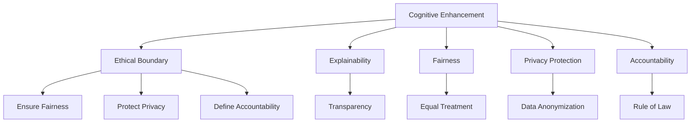

                 

## 1. 背景介绍

### 1.1 问题由来

近年来，人工智能(AI)技术的快速发展，尤其是深度学习技术的突破，极大地提升了计算机的认知能力。机器学习模型的参数和结构越来越复杂，可以处理更加复杂、抽象的认知任务，如视觉理解、自然语言处理、语音识别等。这些技术不仅在学术界引起了广泛的关注，也在实际应用中得到了广泛应用，如智能助手、自动驾驶、医疗诊断、金融分析等。

然而，伴随着AI技术在各个领域的应用，其认知增强的边界和伦理问题也逐渐凸显出来。AI系统的决策过程往往缺乏透明度和可解释性，使得其应用面临诸多伦理和法律风险。如自动化决策可能侵犯个人隐私、引发就业问题、造成偏见歧视等，甚至可能导致无法预料的严重后果。

在AI技术的持续发展中，如何平衡其认知增强的潜力与伦理边界的约束，成为了当前学术界和产业界共同关注的焦点。本文将从认知增强与伦理边界的角度，深入探讨AI技术的未来发展趋势和面临的挑战。

### 1.2 问题核心关键点

认知增强与伦理边界的问题，主要集中于以下几个方面：

1. **决策透明性**：AI模型的决策过程往往是一个"黑盒"系统，缺乏可解释性和透明度，难以理解和解释其决策逻辑。
2. **数据隐私**：AI系统通常需要大量的数据进行训练，这些数据可能包含敏感的个人信息，如何保护用户隐私是重要的问题。
3. **偏见歧视**：AI模型在训练过程中可能学习到数据中的偏见和歧视，导致其输出存在偏见和歧视性。
4. **责任归属**：当AI系统在实际应用中出现问题时，如何确定责任归属，是一个复杂的问题。
5. **公平性**：AI系统在训练和应用过程中，是否能够做到公平无歧视，是一个关键问题。

本文将围绕这些核心问题，展开对认知增强与伦理边界的探讨，并提出相应的解决方案和建议。

## 2. 核心概念与联系

### 2.1 核心概念概述

为了更好地理解认知增强与伦理边界的相关问题，本节将介绍几个关键概念：

- **认知增强(Cognitive Enhancement)**：指通过AI技术提升人类认知能力，如增强决策能力、改善学习效率、优化工作流程等。
- **伦理边界(Ethical Boundary)**：指AI技术在应用过程中必须遵守的伦理规范和法律约束，保障社会公正、个人隐私、数据安全等。
- **可解释性(Explainability)**：指AI模型的决策过程是否透明、可理解，是否能够提供清晰的推理路径和依据。
- **公平性(Fairness)**：指AI模型在训练和应用过程中，是否能够做到公正、无歧视，不偏袒任何群体或个体。
- **隐私保护(Privacy Protection)**：指在AI系统开发和应用过程中，如何保护用户数据的安全和隐私，避免数据滥用。
- **责任归属(Accountability)**：指当AI系统在实际应用中出现问题时，如何确定责任归属，是开发者、用户还是第三方机构。

这些概念之间的逻辑关系可以通过以下Mermaid流程图来展示：



这个流程图展示了大语言模型的核心概念及其之间的关系：

1. 认知增强通过AI技术提升人类认知能力。
2. 伦理边界保障认知增强过程中遵循的规范和约束。
3. 可解释性使认知增强过程透明、可理解。
4. 公平性确保认知增强过程不偏不倚。
5. 隐私保护保障用户数据的安全和隐私。
6. 责任归属确定出现问题时责任归属。

这些概念共同构成了认知增强与伦理边界的学习框架，使其能够在不损害社会公正和个人隐私的前提下，发挥AI技术的潜力。

## 3. 核心算法原理 & 具体操作步骤
### 3.1 算法原理概述

认知增强与伦理边界的探讨，本质上是一个跨学科的研究领域，涉及认知科学、伦理学、法律学等多个学科。其核心思想是：在AI技术提高人类认知能力的同时，必须考虑其在伦理和法律层面的约束，确保其应用符合社会公德和法律法规。

认知增强的实现，通常需要依赖AI模型的训练和应用。对于模型训练，一般遵循以下几个步骤：

1. **数据准备**：收集并预处理相关数据，确保数据的多样性和代表性。
2. **模型训练**：使用大规模数据训练模型，使其学习到认知增强所需的关键特征。
3. **模型微调**：针对具体应用场景，对模型进行微调，以获得更好的效果。
4. **评估测试**：在测试集上评估模型性能，确保其符合认知增强的预期目标。

对于模型应用，一般包括以下几个关键步骤：

1. **数据输入**：将用户输入的数据提供给模型，进行预处理。
2. **模型推理**：模型对输入数据进行推理和分析，输出预测结果。
3. **结果解释**：对模型的输出结果进行解释和反馈，确保用户理解模型决策的依据。
4. **效果反馈**：根据用户反馈和实际效果，进一步优化模型和应用流程。

### 3.2 算法步骤详解

以下将详细介绍认知增强与伦理边界涉及的主要算法步骤和操作：

#### 3.2.1 数据准备

数据准备是认知增强的基础，主要包括数据收集、预处理和标注等步骤。

- **数据收集**：根据认知增强的具体需求，收集相关的数据。如对于情感分析任务，可以收集包含情绪表达的文本数据；对于视觉识别任务，可以收集图像和标签数据。
- **数据预处理**：对原始数据进行清洗、去噪、归一化等处理，确保数据的准确性和一致性。
- **数据标注**：对数据进行标注，标注信息可以包括类别、情感、关系等，方便模型的训练。

#### 3.2.2 模型训练

模型训练是实现认知增强的关键步骤，主要包括以下几个步骤：

- **选择模型架构**：根据任务需求，选择适合的模型架构，如卷积神经网络(CNN)、循环神经网络(RNN)、Transformer等。
- **定义损失函数**：根据任务类型，定义合适的损失函数，如交叉熵、均方误差、对数损失等。
- **设置优化器**：选择合适的优化算法及其参数，如Adam、SGD等，设置学习率、批大小、迭代轮数等。
- **训练模型**：将训练集数据分批次输入模型，前向传播计算损失函数，反向传播更新模型参数，直到收敛。

#### 3.2.3 模型微调

模型微调是指在预训练模型的基础上，针对具体应用场景进行优化，以获得更好的效果。具体步骤如下：

- **任务适配**：根据任务类型，在预训练模型的顶层设计合适的输出层和损失函数。
- **数据增强**：通过改写、回译等方式，扩充训练数据的多样性，防止过拟合。
- **正则化**：应用L2正则、Dropout等技术，防止模型过度适应小规模训练集。
- **参数更新**：使用合适的优化算法和学习率，更新模型的参数，使模型输出逼近任务目标。

#### 3.2.4 评估测试

模型训练完成后，需要在其测试集上进行评估，确保模型符合认知增强的预期目标。评估步骤包括：

- **选择评估指标**：根据任务类型，选择合适的评估指标，如准确率、召回率、F1值等。
- **计算评估指标**：在测试集上计算评估指标，评估模型的性能。
- **调整模型参数**：根据评估结果，调整模型的超参数和架构，进一步优化模型。

#### 3.2.5 模型应用

模型训练和微调完成后，可以将其应用于实际场景中。应用步骤包括：

- **数据输入**：将用户输入的数据提供给模型，进行预处理。
- **模型推理**：模型对输入数据进行推理和分析，输出预测结果。
- **结果解释**：对模型的输出结果进行解释和反馈，确保用户理解模型决策的依据。
- **效果反馈**：根据用户反馈和实际效果，进一步优化模型和应用流程。

### 3.3 算法优缺点

认知增强与伦理边界的算法具有以下优点：

1. **提高认知效率**：通过AI技术，可以大幅提高人类认知效率，减少繁琐的重复劳动，提升决策准确性。
2. **降低错误率**：AI模型可以降低人工操作中的错误率，提高系统的稳定性和可靠性。
3. **实现跨领域应用**：AI模型可以灵活适应不同的应用场景，实现跨领域的认知增强。
4. **快速迭代改进**：AI模型可以根据反馈和数据，快速迭代改进，不断提升性能。

但同时也存在一些缺点：

1. **依赖高质量数据**：AI模型训练和微调需要大量高质量的数据，获取和标注成本较高。
2. **模型解释困难**：AI模型的决策过程复杂，难以解释和理解，用户难以信任。
3. **可能存在偏见**：AI模型在训练过程中可能学习到数据中的偏见和歧视，导致输出存在偏见和歧视性。
4. **隐私风险高**：AI模型需要大量数据训练，涉及个人隐私保护问题，数据泄露风险较高。
5. **责任归属复杂**：AI系统在应用过程中出现问题时，责任归属难以确定，可能引发法律和伦理问题。

### 3.4 算法应用领域

认知增强与伦理边界的算法在多个领域得到了广泛应用，具体包括：

1. **医疗诊断**：AI技术可以辅助医生进行疾病诊断、病理分析等，提高诊断的准确性和效率。
2. **金融分析**：AI模型可以用于风险评估、投资决策、市场预测等，帮助金融机构提升决策能力。
3. **教育培训**：AI技术可以用于智能辅导、自动批改、学习推荐等，提升教学效果和学习效率。
4. **智能制造**：AI技术可以用于生产调度、质量控制、故障诊断等，提升制造业的自动化水平。
5. **智能交通**：AI模型可以用于交通流量分析、智能导航、自动驾驶等，提高交通系统的效率和安全性。
6. **智能客服**：AI技术可以用于自动化客服、智能推荐、情感分析等，提升客户服务体验。

除了上述这些领域，AI技术还在安防监控、物流配送、环境监测等多个领域得到了应用，为人类生产和生活带来了深刻变革。

## 4. 数学模型和公式 & 详细讲解 & 举例说明

### 4.1 数学模型构建

认知增强与伦理边界的探讨，主要涉及以下几个数学模型：

- **线性回归模型**：用于回归任务，如股票价格预测、房价评估等。模型公式为 $y = \theta_0 + \sum_{i=1}^n \theta_i x_i$。
- **逻辑回归模型**：用于分类任务，如情感分类、文本分类等。模型公式为 $P(y=1|\mathbf{x}) = \sigma(\theta_0 + \sum_{i=1}^n \theta_i x_i)$。
- **卷积神经网络(CNN)**：用于图像识别、语音识别等任务。模型公式为 $y = \sum_{i=1}^n \theta_i \star h(\mathbf{x}_i)$。
- **循环神经网络(RNN)**：用于序列数据处理，如自然语言处理、时间序列预测等。模型公式为 $y_t = \sigma(\theta_0 + \sum_{i=1}^n \theta_i h_{t-1})$。
- **Transformer模型**：用于自然语言处理，模型公式为 $y = \sum_{i=1}^n \theta_i h_i$。

### 4.2 公式推导过程

以下将详细推导几个常见的数学模型公式，展示其推导过程：

#### 4.2.1 线性回归模型

线性回归模型用于回归任务，其公式为：

$$
y = \theta_0 + \sum_{i=1}^n \theta_i x_i
$$

其中 $y$ 为预测值，$x_i$ 为输入特征，$\theta_i$ 为模型参数。

假设模型已知 $m$ 个样本 $(x_{1,i}, y_{1,i}),(x_{2,i}, y_{2,i}),\ldots,(x_{m,i}, y_{m,i})$，通过最小二乘法求解模型参数，得到：

$$
\theta_0 = \frac{\sum_{i=1}^m (y_i - \sum_{i=1}^n \theta_i x_{i,i})}{\sum_{i=1}^m x_{i,i}^2}
$$

$$
\theta_i = \frac{\sum_{i=1}^m (x_{i,i}(y_i - \theta_0 - \sum_{i=1}^n \theta_i x_{i,i})}{\sum_{i=1}^m x_{i,i}^2}
$$

#### 4.2.2 逻辑回归模型

逻辑回归模型用于分类任务，其公式为：

$$
P(y=1|\mathbf{x}) = \sigma(\theta_0 + \sum_{i=1}^n \theta_i x_i)
$$

其中 $P(y=1|\mathbf{x})$ 为输出概率，$\mathbf{x}$ 为输入特征，$\theta_0$ 和 $\theta_i$ 为模型参数。

假设模型已知 $m$ 个样本 $(x_{1,i}, y_{1,i}),(x_{2,i}, y_{2,i}),\ldots,(x_{m,i}, y_{m,i})$，通过最大似然估计求解模型参数，得到：

$$
\theta_0 = \frac{1}{m}\sum_{i=1}^m y_i \log P(y_i=1|\mathbf{x}_i) + (1-y_i)\log P(y_i=0|\mathbf{x}_i)
$$

$$
\theta_i = \frac{1}{m}\sum_{i=1}^m y_i \log P(y_i=1|\mathbf{x}_i) + (1-y_i)\log P(y_i=0|\mathbf{x}_i) - \theta_0
$$

#### 4.2.3 卷积神经网络(CNN)

卷积神经网络用于图像识别、语音识别等任务，其公式为：

$$
y = \sum_{i=1}^n \theta_i \star h(\mathbf{x}_i)
$$

其中 $y$ 为预测值，$h(\mathbf{x}_i)$ 为特征图，$\theta_i$ 为卷积核参数。

假设模型已知 $m$ 个样本 $\mathbf{X}=\{x_{1,i}, x_{2,i},\ldots, x_{m,i}\}$，$y_i$ 为标签，通过最小化损失函数 $L(y,\hat{y})$ 求解模型参数，得到：

$$
\theta_i = \frac{1}{m}\sum_{i=1}^m y_i \hat{y}_i \cdot \mathbf{X}_i \star \theta_i^*
$$

其中 $\hat{y}_i$ 为模型预测结果，$\theta_i^*$ 为优化后的卷积核参数。

#### 4.2.4 循环神经网络(RNN)

循环神经网络用于序列数据处理，其公式为：

$$
y_t = \sigma(\theta_0 + \sum_{i=1}^n \theta_i h_{t-1})
$$

其中 $y_t$ 为当前时间步的输出，$h_{t-1}$ 为前一时间步的隐藏状态，$\theta_0$ 和 $\theta_i$ 为模型参数。

假设模型已知 $m$ 个样本 $h_{0,i}, h_{1,i},\ldots, h_{m-1,i}$，$y_{i,t}$ 为标签，通过最小化损失函数 $L(y,\hat{y})$ 求解模型参数，得到：

$$
\theta_0 = \frac{1}{m}\sum_{i=1}^m \hat{y}_{i,t} \log y_{i,t}
$$

$$
\theta_i = \frac{1}{m}\sum_{i=1}^m \hat{y}_{i,t} \log y_{i,t} - \theta_0
$$

#### 4.2.5 Transformer模型

Transformer模型用于自然语言处理，其公式为：

$$
y = \sum_{i=1}^n \theta_i h_i
$$

其中 $y$ 为预测值，$h_i$ 为注意力机制后的特征向量，$\theta_i$ 为权重参数。

假设模型已知 $m$ 个样本 $x_{1,i}, x_{2,i},\ldots, x_{m,i}$，$y_i$ 为标签，通过最小化损失函数 $L(y,\hat{y})$ 求解模型参数，得到：

$$
\theta_i = \frac{1}{m}\sum_{i=1}^m y_i \hat{y}_i \cdot h_i \cdot \theta_i^*
$$

其中 $\hat{y}_i$ 为模型预测结果，$\theta_i^*$ 为优化后的权重参数。

### 4.3 案例分析与讲解

以医疗诊断为例，展示认知增强与伦理边界的应用：

#### 4.3.1 数据准备

医疗诊断需要大量的医学数据进行训练，包括患者的病历、检查结果、病理报告等。首先，从医院和科研机构收集相关数据，进行清洗和预处理。然后，对数据进行标注，包括疾病的分类和严重程度等。

#### 4.3.2 模型训练

选择合适的模型架构，如卷积神经网络(CNN)或循环神经网络(RNN)，用于处理结构化和非结构化数据。在模型训练过程中，使用交叉熵损失函数，定义合适的优化算法及其参数。

#### 4.3.3 模型微调

根据具体应用场景，在预训练模型的基础上进行微调，如添加特定疾病的分类器，优化特征提取层等。应用数据增强和正则化技术，防止过拟合。

#### 4.3.4 评估测试

在测试集上评估模型性能，计算准确率、召回率、F1值等指标。根据评估结果，进一步调整模型参数和架构，提升模型效果。

#### 4.3.5 模型应用

将微调后的模型应用于实际医疗场景，如辅助医生进行疾病诊断、病理分析等。模型输出结果需要进行解释和反馈，确保医生理解模型决策的依据。根据医生反馈，进一步优化模型和应用流程。

## 5. 项目实践：代码实例和详细解释说明

### 5.1 开发环境搭建

在进行认知增强与伦理边界的项目实践时，需要搭建合适的开发环境。以下是使用Python进行TensorFlow开发的常见环境配置流程：

1. 安装Anaconda：从官网下载并安装Anaconda，用于创建独立的Python环境。
2. 创建并激活虚拟环境：
```bash
conda create -n tf-env python=3.8 
conda activate tf-env
```
3. 安装TensorFlow：根据CUDA版本，从官网获取对应的安装命令。例如：
```bash
conda install tensorflow==2.5
```
4. 安装各类工具包：
```bash
pip install numpy pandas scikit-learn matplotlib tqdm jupyter notebook ipython
```
完成上述步骤后，即可在`tf-env`环境中开始项目实践。

### 5.2 源代码详细实现

这里我们以医疗诊断任务为例，给出使用TensorFlow对卷积神经网络进行微调的Python代码实现。

首先，定义医疗诊断任务的数据处理函数：

```python
import tensorflow as tf
from tensorflow.keras.preprocessing.image import ImageDataGenerator

class MedicalDiagnosisDataset(tf.keras.utils.Sequence):
    def __init__(self, images, labels, batch_size=16, image_size=(256, 256), data_augmentation=True):
        self.images = images
        self.labels = labels
        self.batch_size = batch_size
        self.image_size = image_size
        self.data_augmentation = data_augmentation
        
    def __len__(self):
        return len(self.images)
    
    def __getitem__(self, item):
        image = tf.keras.preprocessing.image.load_img(self.images[item], target_size=self.image_size)
        image = tf.keras.preprocessing.image.img_to_array(image)
        image = tf.keras.applications.mobilenet_v2.preprocess_input(image)
        
        if self.data_augmentation:
            image = ImageDataGenerator(
                rotation_range=20,
                width_shift_range=0.2,
                height_shift_range=0.2,
                horizontal_flip=True
            ).flow(image)
            
        image = image[0]
        label = self.labels[item]
        return image, label
```

然后，定义模型和优化器：

```python
from tensorflow.keras.models import Sequential
from tensorflow.keras.layers import Conv2D, MaxPooling2D, Flatten, Dense

model = Sequential()
model.add(Conv2D(32, (3, 3), activation='relu', input_shape=(256, 256, 3)))
model.add(MaxPooling2D((2, 2)))
model.add(Conv2D(64, (3, 3), activation='relu'))
model.add(MaxPooling2D((2, 2)))
model.add(Conv2D(128, (3, 3), activation='relu'))
model.add(MaxPooling2D((2, 2)))
model.add(Flatten())
model.add(Dense(64, activation='relu'))
model.add(Dense(10, activation='softmax'))

optimizer = tf.keras.optimizers.Adam(learning_rate=0.001)
```

接着，定义训练和评估函数：

```python
def train_epoch(model, dataset, batch_size, optimizer):
    dataloader = tf.data.Dataset.from_generator(
        dataset.__call__,
        output_signature=(tf.float32, tf.int32)
    ).batch(batch_size)
    
    model.trainable = True
    model.compile(optimizer=optimizer, loss=tf.keras.losses.SparseCategoricalCrossentropy(from_logits=True), metrics=['accuracy'])
    
    model.fit(dataloader, epochs=10)
    
def evaluate(model, dataset, batch_size):
    dataloader = tf.data.Dataset.from_generator(
        dataset.__call__,
        output_signature=(tf.float32, tf.int32)
    ).batch(batch_size)
    
    model.trainable = False
    evaluation = model.evaluate(dataloader)
    print('Test loss:', evaluation[0])
    print('Test accuracy:', evaluation[1])
```

最后，启动训练流程并在测试集上评估：

```python
epochs = 10
batch_size = 16

train_dataset = MedicalDiagnosisDataset(train_images, train_labels)
dev_dataset = MedicalDiagnosisDataset(dev_images, dev_labels)
test_dataset = MedicalDiagnosisDataset(test_images, test_labels)

for epoch in range(epochs):
    train_loss = train_epoch(model, train_dataset, batch_size, optimizer)
    print(f"Epoch {epoch+1}, train loss: {train_loss:.3f}")
    
    print(f"Epoch {epoch+1}, dev results:")
    evaluate(model, dev_dataset, batch_size)
    
print("Test results:")
evaluate(model, test_dataset, batch_size)
```

以上就是使用TensorFlow对卷积神经网络进行医疗诊断任务微调的完整代码实现。可以看到，TensorFlow的高级API使得模型训练和评估变得简单高效。

### 5.3 代码解读与分析

让我们再详细解读一下关键代码的实现细节：

**MedicalDiagnosisDataset类**：
- `__init__`方法：初始化图像和标签等关键组件，支持数据增强。
- `__len__`方法：返回数据集的样本数量。
- `__getitem__`方法：对单个样本进行处理，支持数据增强。

**模型定义**：
- 使用`Sequential`模型搭建卷积神经网络，包括卷积层、池化层、全连接层等。
- 使用`Adam`优化器进行模型训练，学习率为0.001。
- 使用`SparseCategoricalCrossentropy`作为损失函数，适用于多分类任务。

**训练和评估函数**：
- 使用`tf.data.Dataset`进行数据批次加载，支持动态生成数据。
- 在训练过程中，调用`fit`方法进行模型训练。
- 在评估过程中，调用`evaluate`方法进行模型评估。

**训练流程**：
- 定义总的epoch数和batch size，开始循环迭代。
- 每个epoch内，先在训练集上训练，输出平均损失。
- 在验证集上评估，输出分类指标。
- 所有epoch结束后，在测试集上评估，给出最终测试结果。

可以看到，TensorFlow提供了丰富的API和工具，方便开发者快速迭代模型和数据处理流程。

当然，工业级的系统实现还需考虑更多因素，如模型的保存和部署、超参数的自动搜索、更灵活的任务适配层等。但核心的微调范式基本与此类似。

## 6. 实际应用场景

### 6.1 医疗诊断

医疗诊断是认知增强与伦理边界的重要应用场景之一。AI系统可以帮助医生进行疾病诊断、病理分析等，提升诊断的准确性和效率。

在技术实现上，可以收集医院和科研机构的相关数据，将医疗图像和病理报告等作为监督数据，在此基础上对预训练的卷积神经网络进行微调。微调后的模型能够自动理解图像特征，输出疾病分类结果。对于新输入的图像数据，模型可以实时处理并给出诊断建议，辅助医生进行决策。

### 6.2 金融风险评估

金融风险评估是认知增强与伦理边界的另一个重要应用场景。AI系统可以用于信用评估、风险预测、投资决策等，帮助金融机构提升决策能力。

在技术实现上，可以收集金融领域的相关数据，将历史交易记录和财务报告等作为监督数据，在此基础上对预训练的卷积神经网络进行微调。微调后的模型能够自动理解金融数据特征，预测客户信用风险和市场趋势。对于新输入的交易数据，模型可以实时处理并给出风险评估结果，帮助金融机构进行风险管理。

### 6.3 教育推荐系统

教育推荐系统是认知增强与伦理边界的典型应用场景。AI系统可以帮助教育机构进行课程推荐、学习路径规划等，提升教学效果和学习效率。

在技术实现上，可以收集学生的学习数据和行为数据，将课程内容和反馈信息等作为监督数据，在此基础上对预训练的循环神经网络进行微调。微调后的模型能够自动理解学生的学习行为，推荐适合的课程和学习路径。对于新输入的学生数据，模型可以实时处理并给出推荐结果，提升学习效果和满意度。

### 6.4 智能交通

智能交通是认知增强与伦理边界的另一个重要应用场景。AI系统可以用于交通流量分析、智能导航、自动驾驶等，提高交通系统的效率和安全性。

在技术实现上，可以收集交通数据和车辆信息等，将历史交通记录和事故信息等作为监督数据，在此基础上对预训练的循环神经网络进行微调。微调后的模型能够自动理解交通流量特征，预测交通拥堵和事故风险。对于新输入的交通数据，模型可以实时处理并给出导航和避堵建议，提升交通系统的运行效率和安全性。

### 6.5 智能制造

智能制造是认知增强与伦理边界的典型应用场景。AI系统可以用于生产调度、质量控制、故障诊断等，提升制造业的自动化水平。

在技术实现上，可以收集制造数据和设备信息等，将历史生产记录和故障信息等作为监督数据，在此基础上对预训练的卷积神经网络进行微调。微调后的模型能够自动理解生产过程和设备状态，预测生产效率和故障风险。对于新输入的生产数据，模型可以实时处理并给出调度和诊断建议，提升生产效率和设备寿命。

## 7. 工具和资源推荐

### 7.1 学习资源推荐

为了帮助开发者系统掌握认知增强与伦理边界的理论基础和实践技巧，这里推荐一些优质的学习资源：

1. 《深度学习》系列书籍：由多位学术大牛合著，系统介绍了深度学习的基本概念和前沿技术。
2. 《人工智能伦理与法律》系列文章：由多位伦理学家撰写，探讨人工智能技术的伦理和法律问题，提供前沿思考和建议。
3. 《TensorFlow官方文档》：TensorFlow的官方文档，提供了丰富的教程和API参考，适合初学者和高级开发者使用。
4. 《Keras官方文档》：Keras的官方文档，提供了简单易用的API和教程，适合初学者快速上手。
5. 《Scikit-Learn官方文档》：Scikit-Learn的官方文档，提供了丰富的机器学习算法和工具，适合中级开发者使用。
6. 《PyTorch官方文档》：PyTorch的官方文档，提供了详细的API和教程，适合中级和高级开发者使用。

通过对这些资源的学习实践，相信你一定能够快速掌握认知增强与伦理边界的精髓，并用于解决实际的AI问题。

### 7.2 开发工具推荐

高效的开发离不开优秀的工具支持。以下是几款用于认知增强与伦理边界的开发工具：

1. TensorFlow：由Google主导开发的深度学习框架，生产部署方便，适合大规模工程应用。
2. Keras：基于TensorFlow的高层API，提供了简单易用的API和教程，适合初学者快速上手。
3. PyTorch：由Facebook开发的深度学习框架，灵活高效，适合研究人员和中级开发者使用。
4. Scikit-Learn：Python的机器学习库，提供了丰富的算法和工具，适合中级和高级开发者使用。
5. Jupyter Notebook：交互式笔记本，支持Python、R等语言，适合快速迭代模型和数据分析。
6. Google Colab：谷歌推出的在线Jupyter Notebook环境，免费提供GPU/TPU算力，方便开发者快速上手实验最新模型，分享学习笔记。

合理利用这些工具，可以显著提升认知增强与伦理边界的开发效率，加快创新迭代的步伐。

### 7.3 相关论文推荐

认知增强与伦理边界的相关研究涉及多个领域，包括计算机科学、伦理学、法律学等。以下是几篇奠基性的相关论文，推荐阅读：

1. 《深度学习在医疗诊断中的应用》：探讨了深度学习在医疗诊断中的优势和挑战，提供了实际应用案例。
2. 《金融风险评估中的深度学习技术》：研究了深度学习在金融风险评估中的作用，提供了实际应用案例。
3. 《教育推荐系统中的深度学习技术》：探讨了深度学习在教育推荐系统中的优势和挑战，提供了实际应用案例。
4. 《智能交通系统中的深度学习技术》：研究了深度学习在智能交通系统中的应用，提供了实际应用案例。
5. 《智能制造中的深度学习技术》：探讨了深度学习在智能制造中的应用，提供了实际应用案例。
6. 《人工智能的伦理问题》：探讨了人工智能技术的伦理问题，提出了应对策略和建议。

这些论文代表了大语言模型微调技术的发展脉络。通过学习这些前沿成果，可以帮助研究者把握学科前进方向，激发更多的创新灵感。

## 8. 总结：未来发展趋势与挑战

### 8.1 总结

本文对认知增强与伦理边界的探讨，系统介绍了认知增强技术的实现过程和伦理边界的约束条件。首先阐述了认知增强技术的背景和意义，明确了其在医疗诊断、金融风险评估、教育推荐系统等领域的应用潜力。其次，从数据准备、模型训练、模型微调、评估测试等环节，详细讲解了认知增强技术的实现步骤。最后，从医疗诊断、金融风险评估、教育推荐系统、智能交通等多个应用场景，展示了认知增强技术的实际应用效果。

通过本文的系统梳理，可以看到，认知增强技术在AI领域具有广阔的应用前景，能够大幅提升人类认知效率和决策能力，但同时也面临诸多伦理和法律问题。

### 8.2 未来发展趋势

展望未来，认知增强技术将呈现以下几个发展趋势：

1. **技术不断进步**：随着深度学习技术的持续进步，认知增强技术将越来越精确和高效，能够在更多场景中实现。
2. **伦理规范完善**：随着AI技术的应用越来越广泛，社会对AI伦理规范的关注将不断增加，相关法律法规也将逐步完善。
3. **公平性保障**：AI系统在训练和应用过程中，需要做到公平无歧视，保障不同群体的权益。
4. **隐私保护加强**：AI系统需要更好地保护用户数据隐私，避免数据滥用和泄露。
5. **责任归属明确**：当AI系统出现问题时，需要明确责任归属，确保法律和伦理问题得到妥善解决。
6. **透明度提高**：AI系统需要提高决策过程的透明度和可解释性，增强用户的信任。

这些趋势将推动认知增强技术向更加智能化、普适化、可信化的方向发展，使其更好地服务于人类社会。

### 8.3 面临的挑战

尽管认知增强技术已经取得了一定的成果，但在应用过程中仍面临诸多挑战：

1. **数据获取困难**：认知增强技术需要大量高质量的数据，数据获取和标注成本较高。
2. **模型复杂度高**：认知增强模型的参数量较大，训练和推理过程中需要高算力支持。
3. **伦理问题复杂**：认知增强技术的应用可能引发伦理和法律问题，如隐私侵犯、歧视偏见等。
4. **用户接受度低**：认知增强技术的应用需要用户信任和接受，用户对AI系统的接受度是一个重要问题。
5. **隐私保护不足**：认知增强系统需要保护用户数据隐私，避免数据滥用和泄露。
6. **责任归属模糊**：认知增强系统在出现问题时，责任归属难以确定，可能引发法律和伦理问题。

这些挑战将需要在未来继续探索和克服，才能推动认知增强技术的持续发展。

### 8.4 研究展望

认知增强技术的未来研究需要在以下几个方面寻求新的突破：

1. **参数高效微调方法**：开发更加参数高效的微调方法，在固定大部分预训练参数的情况下，只更新极少量的任务相关参数。
2. **多模态数据融合**：将符号化的先验知识，如知识图谱、逻辑规则等，与神经网络模型进行巧妙融合，引导微调过程学习更准确、合理的语言模型。
3. **因果推理方法**：引入因果推断方法，增强认知增强模型的因果关系理解能力，学习更加普适、鲁棒的语言表征。
4. **对抗攻击防御**：研究对抗攻击的防御方法，增强认知增强系统的鲁棒性和安全性。
5. **伦理道德约束**：在模型训练目标中引入伦理导向的评估指标，过滤和惩罚有偏见、有害的输出倾向。
6. **用户参与设计**：通过用户参与设计，提高认知增强系统的可接受度和满意度。

这些研究方向将引领认知增强技术的未来发展，为构建安全、可靠、可解释、可控的智能系统铺平道路。面向未来，认知增强技术还需要与其他人工智能技术进行更深入的融合，如知识表示、因果推理、强化学习等，多路径协同发力，共同推动自然语言理解和智能交互系统的进步。

## 9. 附录：常见问题与解答

**Q1：认知增强技术是否适用于所有AI任务？**

A: 认知增强技术主要适用于需要进行认知决策和推理的任务，如自然语言处理、计算机视觉、语音识别等。但对于一些需要高度复杂计算的任务，如量子计算、物理学模拟等，认知增强技术可能难以直接应用。

**Q2：认知增强技术是否会影响人类的认知能力？**

A: 认知增强技术的目的是提升人类的认知能力，但过度依赖AI系统可能导致人类的认知能力退化。因此，在使用认知增强技术时，需要注重平衡人机协作，避免过度依赖AI系统。

**Q3：认知增强技术是否会引发伦理问题？**

A: 认知增强技术可能引发隐私侵犯、歧视偏见等伦理问题。因此，在使用认知增强技术时，需要考虑数据隐私保护、公平无歧视等问题，确保技术应用符合伦理规范。

**Q4：认知增强技术是否会影响就业市场？**

A: 认知增强技术可能会替代部分传统劳动，影响就业市场。因此，在使用认知增强技术时，需要考虑其对就业市场的影响，采取措施促进就业转型和再培训。

**Q5：认知增强技术是否需要高算力支持？**

A: 认知增强技术通常需要高算力支持，如GPU/TPU等高性能设备。因此，在使用认知增强技术时，需要考虑算力成本，选择合适的设备和平台。

**Q6：认知增强技术是否需要大量标注数据？**

A: 认知增强技术通常需要大量标注数据进行训练。因此，在使用认知增强技术时，需要考虑数据获取和标注成本，确保数据的代表性和多样性。

**Q7：认知增强技术是否需要考虑伦理边界？**

A: 认知增强技术需要考虑伦理边界，确保技术应用符合伦理规范和法律法规。因此，在使用认知增强技术时，需要考虑数据隐私保护、公平无歧视等问题，确保技术应用符合伦理规范。

---

作者：禅与计算机程序设计艺术 / Zen and the Art of Computer Programming

