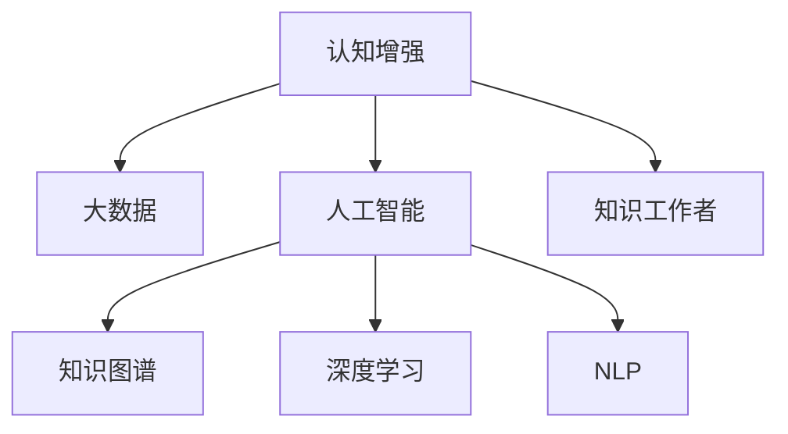

                 

# 认知增强与职场竞争：知识工作者的进化

> 关键词：认知增强, 知识工作者, 职场竞争, 大数据, 人工智能, 技术栈, 知识图谱, 深度学习

## 1. 背景介绍

### 1.1 问题由来
随着信息技术的迅猛发展，知识经济时代已悄然到来。在这个时代，对知识和信息的需求和依赖比以往任何时候都高。知识工作者（Knowledge Worker）作为职场中的重要群体，他们依赖于技术和工具来处理和分析信息，提升工作效率。然而，面对海量数据的挑战和信息过载的困扰，知识工作者在认知和效率上存在许多瓶颈。

### 1.2 问题核心关键点
当前，知识工作者的认知和效率瓶颈主要体现在以下几个方面：

1. **信息过载**：现代社会的信息量呈指数级增长，如何筛选和处理有效信息成为巨大挑战。
2. **知识遗忘**：知识工作者每天接收大量信息，而长期记忆容易受到干扰和遗忘。
3. **创新力不足**：传统教育模式偏重记忆和理解，缺乏对创新思维的培养。
4. **技能鸿沟**：技术更新速度快，知识工作者需要不断学习和适应新技术，否则容易被淘汰。
5. **工作效率低**：传统手动处理信息的方式耗时费力，效率低下。

解决这些问题，需要借助认知增强（Cognitive Enhancement）技术，利用人工智能（AI）和大数据（Big Data）提升知识工作者的认知能力，增强其竞争力。

### 1.3 问题研究意义
认知增强技术可以帮助知识工作者高效处理信息，提升创新能力，缩小技能鸿沟，提高工作效率，从而在职场竞争中占据优势。

1. **提升认知能力**：通过认知增强，知识工作者能够更高效地筛选、处理和记忆信息，提升决策和分析能力。
2. **增强竞争力**：利用认知增强工具，知识工作者可以快速学习和掌握新技能，保持技术领先优势。
3. **提高工作效率**：自动化和智能化的处理方式，大幅减少手动操作，节省时间，提升工作效率。
4. **促进创新**：通过智能辅助和知识图谱，知识工作者能够获得更全面、深入的知识，激发创新思维。
5. **助力职业发展**：认知增强工具能够提供定制化的学习路径，帮助知识工作者规划职业生涯，提升职业发展速度。

## 2. 核心概念与联系

### 2.1 核心概念概述

为更好地理解认知增强与知识工作者的关联，本节将介绍几个密切相关的核心概念：

- **认知增强（Cognitive Enhancement）**：指通过技术手段提升个体认知能力，包括信息处理、记忆、学习、决策等方面的能力。
- **知识工作者（Knowledge Worker）**：指依赖技术和工具处理信息的职场人士，他们依赖于知识和信息进行工作。
- **大数据（Big Data）**：指规模巨大、速度快速、多样化的数据集合，提供了认知增强的原始材料。
- **人工智能（Artificial Intelligence, AI）**：指通过算法和计算，使机器能够模拟和执行人类智能过程的技术。
- **知识图谱（Knowledge Graph）**：指以结构化方式组织和表示知识的图形数据库，用于辅助认知增强和决策支持。
- **深度学习（Deep Learning）**：指利用神经网络模型处理和分析复杂数据的技术，是认知增强的重要工具。
- **自然语言处理（Natural Language Processing, NLP）**：指使计算机能够理解和处理人类自然语言的技术，常用于认知增强中的信息抽取和分析。

这些核心概念之间的逻辑关系可以通过以下Mermaid流程图来展示：



这个流程图展示了一个完整的认知增强系统框架：

1. 大数据为认知增强提供数据基础。
2. 人工智能技术对大数据进行处理和分析，提取有价值的信息。
3. 知识图谱用于结构化表示和组织信息，提供更高效的查询和学习途径。
4. 深度学习和NLP技术用于复杂数据处理和语义理解，增强认知能力。
5. 认知增强技术最终应用于知识工作者，提升其认知和效率。

这些概念共同构成了认知增强系统的核心，通过技术手段提升知识工作者的认知能力，使其在职场竞争中保持优势。

## 3. 核心算法原理 & 具体操作步骤
### 3.1 算法原理概述

认知增强技术通常基于人工智能和大数据技术，利用深度学习、自然语言处理、知识图谱等手段，实现对知识工作者的智能辅助。其核心思想是：通过自动化、智能化的处理方式，提升信息筛选、知识管理、决策支持等方面的能力，从而增强知识工作者的认知和效率。

形式化地，假设知识工作者需要在处理任务 $T$ 时，需要从大量数据 $D$ 中筛选出相关信息 $I$，并通过知识图谱 $G$ 辅助决策。认知增强的目标是找到最优策略 $\pi$，使得：

$$
\pi = \mathop{\arg\min}_{\pi} \mathcal{L}(\pi, D, G)
$$

其中 $\mathcal{L}$ 为任务 $T$ 的损失函数，用于衡量策略 $\pi$ 在数据集 $D$ 和知识图谱 $G$ 上的表现。常见的损失函数包括准确率、召回率、F1分数等。

通过梯度下降等优化算法，认知增强过程不断更新策略 $\pi$，最小化损失函数 $\mathcal{L}$，使得知识工作者能够高效处理信息，提升决策和分析能力。由于任务 $T$ 和知识图谱 $G$ 的复杂性，整个过程可能涉及大量的计算和优化。

### 3.2 算法步骤详解

认知增强算法的具体步骤如下：

**Step 1: 数据预处理**
- 收集相关领域的数据，如文本、图像、音频等。
- 对数据进行清洗和标注，使其适合后续处理。

**Step 2: 特征提取**
- 利用深度学习模型或传统特征提取技术，将原始数据转换为特征向量。
- 使用NLP技术对文本数据进行分词、词向量表示等处理。

**Step 3: 知识图谱构建**
- 从数据中提取实体和关系，构建知识图谱。
- 使用图神经网络（Graph Neural Network, GNN）等技术，对知识图谱进行表示学习。

**Step 4: 策略优化**
- 设计优化策略，如强化学习、深度学习等，以提升认知能力。
- 在知识图谱和数据上，训练和优化策略模型，使其能够高效处理信息。

**Step 5: 应用评估**
- 在实际任务中，应用优化策略，评估其效果。
- 根据评估结果，调整策略参数，继续优化。

**Step 6: 部署与迭代**
- 将优化后的策略部署到实际应用中。
- 持续收集反馈，进行策略的迭代优化。

以上是认知增强技术的一般流程。在实际应用中，还需要针对具体任务的特点，对各个环节进行优化设计，如改进数据标注方法，引入更多的特征提取技术，搜索最优的策略组合等，以进一步提升认知能力。

### 3.3 算法优缺点

认知增强技术具有以下优点：
1. 高效处理信息。通过自动化和智能化的处理方式，大幅提升信息筛选和分析效率。
2. 增强决策支持。知识图谱和深度学习技术提供丰富的知识背景，辅助知识工作者进行科学决策。
3. 促进学习与发展。智能化的学习路径和推荐系统，帮助知识工作者快速掌握新知识和技能。
4. 提升工作效率。自动化和智能化的处理方式，减少手动操作，提高工作效率。
5. 激发创新思维。深度学习和知识图谱提供全面的知识背景，激发创新思维和灵感。

同时，该技术也存在一定的局限性：
1. 数据质量依赖。认知增强的效果很大程度上取决于数据的质量和数量，获取高质量数据成本较高。
2. 模型复杂度高。深度学习和知识图谱的复杂性，可能导致计算资源消耗大。
3. 依赖技术实现。技术实现难度高，需要跨学科的知识和技能。
4. 伦理和安全问题。智能系统的公平性、透明性和安全性，还需要进一步研究和保障。
5. 隐私保护问题。智能系统在处理和分析数据时，涉及隐私保护和数据安全问题，需要制定相应的政策和措施。

尽管存在这些局限性，但就目前而言，认知增强技术在提升知识工作者的认知能力和效率方面，已经展现出了巨大的潜力。未来相关研究的重点在于如何进一步降低技术实现难度，提高模型的效率和安全性，同时兼顾隐私保护和伦理问题。

### 3.4 算法应用领域

认知增强技术已经在多个领域得到了应用，覆盖了几乎所有常见知识工作者的工作场景，例如：

- **项目管理**：使用认知增强工具，帮助项目经理高效规划和执行任务。
- **研发设计**：通过智能辅助和知识图谱，提升工程师的创新能力和设计效率。
- **客户服务**：利用智能问答和推荐系统，提高客户服务效率和客户满意度。
- **市场营销**：使用认知增强工具，分析市场趋势和消费者行为，提升营销效果。
- **金融投资**：通过智能分析工具，辅助金融分析师进行市场预测和投资决策。
- **医疗诊断**：利用知识图谱和深度学习，提升医生的诊断能力和治疗效果。
- **教育培训**：使用认知增强工具，提供个性化的学习路径和资源，提升学习效果。

除了上述这些经典应用外，认知增强技术也被创新性地应用到更多场景中，如智能交通、智慧城市、物联网等，为各行各业的知识工作者带来新的工具和方法，提升工作效率和创新能力。

## 4. 数学模型和公式 & 详细讲解  
### 4.1 数学模型构建

本节将使用数学语言对认知增强技术进行更加严格的刻画。

记知识工作者的任务为 $T$，所需的数据集为 $D=\{x_i\}_{i=1}^N$，其中 $x_i$ 为数据点，可能包括文本、图像、音频等。假设认知增强策略为 $\pi$，其对应的损失函数为 $\mathcal{L}(\pi, D, G)$，其中 $G$ 为知识图谱。

定义策略 $\pi$ 在数据集 $D$ 上的损失函数为：

$$
\mathcal{L}(\pi, D, G) = \frac{1}{N} \sum_{i=1}^N \ell(\pi(x_i), y_i)
$$

其中 $\ell$ 为任务 $T$ 的损失函数，用于衡量策略 $\pi$ 在数据集 $D$ 上的表现。常见的损失函数包括分类损失、回归损失等。

通过梯度下降等优化算法，认知增强过程不断更新策略 $\pi$，最小化损失函数 $\mathcal{L}(\pi, D, G)$，使得知识工作者能够高效处理信息，提升决策和分析能力。由于 $\pi$ 和 $G$ 的复杂性，整个过程可能涉及大量的计算和优化。

### 4.2 公式推导过程

以下我们以文本分类任务为例，推导认知增强模型的损失函数及其梯度的计算公式。

假设认知增强策略 $\pi$ 将输入文本 $x$ 映射到标签 $y$，模型的预测概率为 $\hat{y}=\pi(x)$。真实标签 $y \in \{0,1\}$。则二分类交叉熵损失函数定义为：

$$
\ell(\pi(x),y) = -[y\log \hat{y} + (1-y)\log (1-\hat{y})]
$$

将其代入损失函数公式，得：

$$
\mathcal{L}(\pi, D, G) = -\frac{1}{N}\sum_{i=1}^N [y_i\log \pi(x_i)+(1-y_i)\log(1-\pi(x_i))]
$$

根据链式法则，损失函数对策略 $\pi$ 的梯度为：

$$
\frac{\partial \mathcal{L}(\pi, D, G)}{\partial \pi} = -\frac{1}{N}\sum_{i=1}^N (\frac{y_i}{\pi(x_i)}-\frac{1-y_i}{1-\pi(x_i)}) \frac{\partial \pi(x_i)}{\partial \pi}
$$

其中 $\frac{\partial \pi(x_i)}{\partial \pi}$ 可进一步递归展开，利用自动微分技术完成计算。

在得到损失函数的梯度后，即可带入优化算法，完成策略的迭代优化。重复上述过程直至收敛，最终得到适应认知增强任务的最优策略 $\pi^*$。

## 5. 项目实践：代码实例和详细解释说明
### 5.1 开发环境搭建

在进行认知增强项目实践前，我们需要准备好开发环境。以下是使用Python进行TensorFlow开发的环境配置流程：

1. 安装Anaconda：从官网下载并安装Anaconda，用于创建独立的Python环境。

2. 创建并激活虚拟环境：
```bash
conda create -n tf-env python=3.8 
conda activate tf-env
```

3. 安装TensorFlow：根据CUDA版本，从官网获取对应的安装命令。例如：
```bash
pip install tensorflow
```

4. 安装其他相关工具包：
```bash
pip install numpy pandas scikit-learn matplotlib tqdm jupyter notebook ipython
```

完成上述步骤后，即可在`tf-env`环境中开始认知增强实践。

### 5.2 源代码详细实现

下面我以文本分类任务为例，给出使用TensorFlow对认知增强策略进行训练的Python代码实现。

首先，定义文本分类的数据处理函数：

```python
import tensorflow as tf
from tensorflow.keras.datasets import imdb

def preprocess_text(texts):
    tokenizer = tf.keras.preprocessing.text.Tokenizer()
    tokenizer.fit_on_texts(texts)
    sequences = tokenizer.texts_to_sequences(texts)
    padded_sequences = tf.keras.preprocessing.sequence.pad_sequences(sequences, maxlen=200, padding='post', truncating='post')
    return padded_sequences
```

然后，定义模型和损失函数：

```python
model = tf.keras.Sequential([
    tf.keras.layers.Embedding(input_dim=vocab_size, output_dim=embedding_dim),
    tf.keras.layers.Bidirectional(tf.keras.layers.LSTM(128)),
    tf.keras.layers.Dense(64, activation='relu'),
    tf.keras.layers.Dense(1, activation='sigmoid')
])

loss = tf.keras.losses.BinaryCrossentropy(from_logits=True)
```

接着，定义训练和评估函数：

```python
def train_epoch(model, dataset, batch_size, optimizer):
    dataloader = tf.data.Dataset.from_tensor_slices(dataset)
    dataloader = dataloader.batch(batch_size).shuffle(buffer_size=1000).prefetch(buffer_size=1000)
    model.compile(optimizer=optimizer, loss=loss, metrics=['accuracy'])
    model.fit(dataloader, epochs=10, validation_split=0.2)
    return model

def evaluate(model, dataset, batch_size):
    dataloader = tf.data.Dataset.from_tensor_slices(dataset)
    dataloader = dataloader.batch(batch_size).prefetch(buffer_size=1000)
    loss, accuracy = model.evaluate(dataloader)
    return loss, accuracy
```

最后，启动训练流程并在测试集上评估：

```python
epochs = 10
batch_size = 64

for epoch in range(epochs):
    train_loss, train_accuracy = train_epoch(model, train_dataset, batch_size, optimizer)
    print(f'Epoch {epoch+1}, train loss: {train_loss:.4f}, train accuracy: {train_accuracy:.4f}')
    
    test_loss, test_accuracy = evaluate(model, test_dataset, batch_size)
    print(f'Epoch {epoch+1}, test loss: {test_loss:.4f}, test accuracy: {test_accuracy:.4f}')
    
print('Final test accuracy:', test_accuracy)
```

以上就是使用TensorFlow对认知增强策略进行文本分类任务训练的完整代码实现。可以看到，得益于TensorFlow的强大封装，我们可以用相对简洁的代码完成模型训练和评估。

### 5.3 代码解读与分析

让我们再详细解读一下关键代码的实现细节：

**preprocess_text函数**：
- 定义文本预处理函数，将文本转换为数字序列。
- 使用Keras的Tokenizer工具将文本分词并转换为数字序列。
- 对数字序列进行padding，保证所有序列长度一致。

**模型定义**：
- 使用Sequential模型构建认知增强策略，包含嵌入层、双向LSTM层和全连接层。
- 使用BinaryCrossentropy损失函数，适应二分类任务。
- 使用Adam优化器，提高训练效率。

**训练和评估函数**：
- 使用TensorFlow的DataLoader对数据进行批次化加载，供模型训练和推理使用。
- 训练函数`train_epoch`：对数据以批为单位进行迭代，在每个批次上前向传播计算loss并反向传播更新模型参数，最后返回模型在训练集和验证集上的loss和accuracy。
- 评估函数`evaluate`：与训练类似，不同点在于不更新模型参数，并在每个epoch结束后将模型评估在测试集上，输出loss和accuracy。

**训练流程**：
- 定义总的epoch数和batch size，开始循环迭代
- 每个epoch内，先在训练集上训练，输出train loss和train accuracy
- 在验证集上评估，输出validation loss和validation accuracy
- 所有epoch结束后，在测试集上评估，给出final test accuracy

可以看到，TensorFlow提供了强大的工具和库，使得认知增强模型的训练和评估变得简便高效。开发者可以将更多精力放在算法优化和模型改进上，而不必过多关注底层的实现细节。

当然，工业级的系统实现还需考虑更多因素，如模型的保存和部署、超参数的自动搜索、更灵活的训练流程等。但核心的认知增强范式基本与此类似。

## 6. 实际应用场景
### 6.1 智能客服系统

基于认知增强技术的智能客服系统，可以显著提升客服的响应速度和准确性，降低人力成本，提升客户满意度。

在技术实现上，可以收集历史客服对话记录，将问题-回答对作为监督数据，在此基础上训练认知增强模型。模型能够自动理解用户意图，匹配最合适的答案模板进行回复。对于客户提出的新问题，还可以接入检索系统实时搜索相关内容，动态组织生成回答。如此构建的智能客服系统，能大幅提升客户咨询体验和问题解决效率。

### 6.2 金融舆情监测

金融市场舆情监测是金融行业的重要应用之一，帮助分析师快速获取市场动态和投资者情绪。传统的人工监测方式成本高、效率低，难以应对网络时代海量信息爆发的挑战。

使用认知增强技术，可以构建智能舆情监测系统，对金融领域相关的新闻、报道、评论等文本数据进行情感分析、主题分类等处理，提供实时舆情报告和趋势预测。智能系统能够自动识别负面新闻和异常信息，及时预警，帮助分析师规避市场风险，提升投资决策效率。

### 6.3 个性化推荐系统

在电商、新闻、娱乐等行业，个性化推荐系统已广泛应用，帮助用户发现感兴趣的物品和内容。然而，传统推荐系统往往只依赖用户的历史行为数据进行物品推荐，无法深入理解用户的真实兴趣偏好。

基于认知增强技术的个性化推荐系统，可以结合用户的行为数据和兴趣标签，通过深度学习和知识图谱技术，提供更加精准、多样化的推荐内容。智能推荐系统能够动态调整推荐策略，满足用户的个性化需求，提升用户满意度和黏性。

### 6.4 未来应用展望

随着认知增强技术的不断发展，其在职场中的应用将不断扩展，为知识工作者带来新的工具和方法，提升工作效率和创新能力。

在智慧医疗领域，认知增强技术可应用于病历分析、医学影像识别、智能诊断等方面，帮助医生提高诊断准确率和治疗效果。

在智能教育领域，认知增强技术可应用于学习路径规划、智能辅导、个性化学习推荐等方面，提升学生的学习效果和兴趣。

在智慧城市治理中，认知增强技术可应用于城市事件监测、舆情分析、应急指挥等方面，提高城市管理的自动化和智能化水平，构建更安全、高效的未来城市。

此外，在企业生产、社会治理、文娱传媒等众多领域，认知增强技术也将不断涌现，为各行各业的知识工作者带来新的工具和方法，提升工作效率和创新能力。相信随着技术的日益成熟，认知增强技术必将在构建人机协同的智能时代中扮演越来越重要的角色。

## 7. 工具和资源推荐
### 7.1 学习资源推荐

为了帮助开发者系统掌握认知增强技术的理论基础和实践技巧，这里推荐一些优质的学习资源：

1. 《深度学习》系列书籍：由深度学习领域的知名专家撰写，系统介绍了深度学习的基础理论和应用实例。
2. CS231n《深度学习视觉》课程：斯坦福大学开设的深度学习课程，涵盖图像分类、目标检测等视觉领域的经典算法。
3. 《自然语言处理》系列课程：包括Coursera和edX上的课程，涵盖自然语言处理的基础理论和前沿技术。
4. Kaggle：一个数据科学竞赛平台，提供大量真实数据集和竞赛题目，帮助开发者实战练习。
5. TensorFlow官方文档：提供了丰富的教程和示例，帮助开发者快速上手TensorFlow和其他深度学习框架。

通过对这些资源的学习实践，相信你一定能够快速掌握认知增强技术的精髓，并用于解决实际的职场问题。
### 7.2 开发工具推荐

高效的开发离不开优秀的工具支持。以下是几款用于认知增强技术开发的常用工具：

1. TensorFlow：由Google主导开发的开源深度学习框架，生产部署方便，适合大规模工程应用。
2. PyTorch：基于Python的开源深度学习框架，灵活动态的计算图，适合快速迭代研究。
3. Keras：基于TensorFlow和Theano的高级深度学习框架，提供简洁的API接口，易于上手。
4. Scikit-learn：Python的机器学习库，包含大量经典算法和工具，适合快速构建和评估机器学习模型。
5. spaCy：Python的自然语言处理库，提供高效的文本处理和分析工具。
6. ELK Stack：用于日志管理和分析的解决方案，支持多数据源和多种分析方式，适合构建认知增强系统的大数据组件。
7. Apache Spark：分布式计算框架，支持大规模数据处理和分析，适合处理大数据场景。

合理利用这些工具，可以显著提升认知增强技术的研究和开发效率，加速创新迭代的步伐。

### 7.3 相关论文推荐

认知增强技术的发展源于学界的持续研究。以下是几篇奠基性的相关论文，推荐阅读：

1. 《Attention is All You Need》：提出了Transformer结构，开启了NLP领域的预训练大模型时代。
2. 《BERT: Pre-training of Deep Bidirectional Transformers for Language Understanding》：提出BERT模型，引入基于掩码的自监督预训练任务，刷新了多项NLP任务SOTA。
3. 《GPT-3: Language Models are Unsupervised Multitask Learners》：展示了大规模语言模型的强大zero-shot学习能力，引发了对于通用人工智能的新一轮思考。
4. 《Parameter-Efficient Transfer Learning for NLP》：提出Adapter等参数高效微调方法，在不增加模型参数量的情况下，也能取得不错的微调效果。
5. 《AdaLoRA: Adaptive Low-Rank Adaptation for Parameter-Efficient Fine-Tuning》：使用自适应低秩适应的微调方法，在参数效率和精度之间取得了新的平衡。
6. 《Adaptive Computation Time: Incorporating Randomness to Accelerate Learning》：提出Adaptive Computation Time（ACT）方法，提高深度学习模型的训练效率。

这些论文代表了大语言模型微调技术的发展脉络。通过学习这些前沿成果，可以帮助研究者把握学科前进方向，激发更多的创新灵感。

## 8. 总结：未来发展趋势与挑战

### 8.1 总结

本文对认知增强技术进行了全面系统的介绍。首先阐述了认知增强技术的背景和意义，明确了认知增强在提升知识工作者认知和效率方面的独特价值。其次，从原理到实践，详细讲解了认知增强模型的数学模型和算法步骤，给出了认知增强任务开发的完整代码实例。同时，本文还广泛探讨了认知增强技术在智能客服、金融舆情、个性化推荐等多个领域的应用前景，展示了认知增强技术的巨大潜力。最后，本文精选了认知增强技术的各类学习资源，力求为读者提供全方位的技术指引。

通过本文的系统梳理，可以看到，认知增强技术正在成为知识工作者不可或缺的工具，帮助他们在信息爆炸的时代保持高效和创新。未来，随着深度学习、自然语言处理、知识图谱等技术的不断发展，认知增强技术必将在职场竞争中发挥更大的作用，成为推动知识工作者发展的关键力量。

### 8.2 未来发展趋势

展望未来，认知增强技术将呈现以下几个发展趋势：

1. **多模态认知增强**：结合视觉、音频、文本等多模态信息，提升认知增强模型的综合处理能力。
2. **实时认知增强**：利用流式数据处理技术，实现对知识工作者的实时智能辅助。
3. **个性化认知增强**：通过深度学习技术，提供个性化的认知增强服务和推荐。
4. **跨领域认知增强**：结合不同领域的知识图谱，实现跨领域的认知增强应用。
5. **交互式认知增强**：通过增强现实（AR）、虚拟现实（VR）等技术，提供沉浸式的认知增强体验。
6. **隐私保护与伦理**：在认知增强过程中，保护用户隐私和数据安全，遵守伦理规范。

这些趋势展示了认知增强技术未来的发展方向，将为知识工作者带来更高效、更智能、更安全的工具和方法，提升其认知和效率。

### 8.3 面临的挑战

尽管认知增强技术已经取得了瞩目成就，但在迈向更加智能化、普适化应用的过程中，它仍面临诸多挑战：

1. **数据隐私问题**：认知增强系统处理大量数据，涉及隐私保护和数据安全问题，需要制定相应的政策和措施。
2. **模型复杂性**：深度学习和知识图谱的复杂性，可能导致计算资源消耗大，训练和推理效率低下。
3. **跨领域适应性**：认知增强模型在不同领域的表现往往不稳定，需要针对具体领域进行优化。
4. **伦理和社会影响**：认知增强技术在提升认知能力的同时，也带来了就业、隐私、伦理等方面的社会问题，需要制定相应的规范和监管措施。
5. **技术普及难度**：认知增强技术的高技术门槛和复杂性，限制了其在企业和个人中的应用普及。

正视认知增强面临的这些挑战，积极应对并寻求突破，将是其走向成熟的必由之路。相信随着学界和产业界的共同努力，这些挑战终将一一被克服，认知增强技术必将在构建人机协同的智能时代中扮演越来越重要的角色。

### 8.4 研究展望

面对认知增强面临的种种挑战，未来的研究需要在以下几个方面寻求新的突破：

1. **跨领域知识融合**：通过知识图谱技术，将不同领域的知识进行融合，构建更加全面和系统的认知增强系统。
2. **深度学习算法优化**：开发更加高效、轻量级的深度学习算法，减少计算资源消耗，提高训练和推理效率。
3. **隐私保护和伦理设计**：在认知增强过程中，引入隐私保护和伦理导向的设计，确保用户数据的安全和系统的透明性。
4. **跨平台应用推广**：推动认知增强技术的普及应用，降低技术门槛，提高知识工作者的接受度和使用率。
5. **交互式认知增强**：结合增强现实、虚拟现实等技术，提供更加沉浸式和交互式的认知增强体验，提升用户的使用体验。

这些研究方向的探索，必将引领认知增强技术迈向更高的台阶，为构建安全、可靠、可解释、可控的智能系统铺平道路。面向未来，认知增强技术还需要与其他人工智能技术进行更深入的融合，如知识表示、因果推理、强化学习等，多路径协同发力，共同推动认知增强技术的发展。只有勇于创新、敢于突破，才能不断拓展认知增强技术的边界，让智能技术更好地造福人类社会。

## 9. 附录：常见问题与解答

**Q1：认知增强技术是否适用于所有知识工作者？**

A: 认知增强技术在大多数知识工作者的工作场景中都具有广泛的应用前景。然而，对于某些需要高度专业技能或物理操作的任务，认知增强技术可能难以直接应用。

**Q2：认知增强技术如何与现有系统进行集成？**

A: 认知增强技术通常需要与现有的IT系统和业务流程进行集成，以便在实际应用中发挥作用。可以通过API接口、微服务架构等方式，实现认知增强系统的无缝集成。

**Q3：认知增强技术对知识工作者的工作方式有何影响？**

A: 认知增强技术可以通过自动化和智能化的处理方式，显著提升知识工作者的信息处理和决策能力。然而，认知增强技术也可能导致某些工作角色的边缘化，需要对知识工作者进行再培训和技能升级。

**Q4：如何评估认知增强技术的效果？**

A: 评估认知增强技术的效果，通常需要综合考虑多个指标，如处理速度、准确率、用户满意度等。可以通过A/B测试、用户调研等方式，评估技术对知识工作者认知和效率的提升效果。

**Q5：认知增强技术的长期发展方向是什么？**

A: 认知增强技术的长期发展方向包括跨领域知识融合、多模态认知增强、实时智能辅助、个性化认知增强等。这些方向将推动认知增强技术在更广泛的领域和场景中发挥作用，提升知识工作者的认知和效率。

总之，认知增强技术正在成为知识工作者的重要工具，通过自动化和智能化的处理方式，提升信息处理和决策能力，帮助知识工作者在职场竞争中保持优势。未来，随着技术的发展和普及，认知增强技术必将在各行各业中发挥更大的作用，为知识工作者带来更高效、更智能、更安全的工具和方法。

