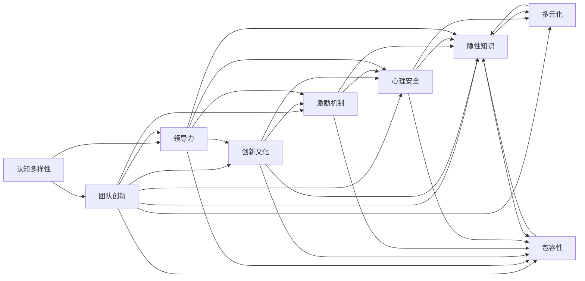

                 

# 认知多样性：团队创新的驱动力

> 关键词：认知多样性,团队创新,跨领域合作,领导力,激励机制,创新文化,心理安全,隐性知识,多元化,包容性

## 1. 背景介绍

### 1.1 问题由来
在快速变化、复杂多样的全球化商业环境中，企业要想保持竞争力，就必须不断创新。然而，创新不仅依赖于个人才华和努力，还需要一个能够激发创意、驱动变革的企业环境。企业内部如何调动员工的创造力，促进跨领域合作，从而实现持续创新，已成为当下管理者的重要课题。

### 1.2 问题核心关键点
认知多样性在团队创新中扮演着关键角色。它不仅涵盖了知识背景、专业技能、思维方式等方面的异质性，还包括年龄、性别、文化背景等多维度的差异。研究表明，认知多样性有助于打破固有思维模式，引入新视角，促进团队决策的全面性和创新性。

因此，本文旨在探讨如何通过增强认知多样性来驱动团队创新，包括提升领导力、构建创新文化、建立激励机制、保障心理安全等关键要素。

### 1.3 问题研究意义
研究认知多样性如何影响团队创新，对于企业创新管理实践具有重要意义：

1. 提升创新效率：认知多样性带来多元化的思维方式，有助于解决复杂问题，加速创新过程。
2. 增加创新成功率：多样化的团队在处理不同情境时表现更佳，能应对更多挑战。
3. 增强企业韧性：多样化的团队更具适应性，能在市场变化中迅速调整战略。
4. 促进组织包容性：认知多样性有助于营造开放、包容的工作氛围，吸引和保留优秀人才。

本文将系统梳理认知多样性对团队创新的影响，并通过具体案例和实践建议，帮助管理者设计有效的管理策略，构建创新型组织。

## 2. 核心概念与联系

### 2.1 核心概念概述

#### 2.1.1 认知多样性
认知多样性指的是团队成员在知识背景、专业技能、思维方式等方面的差异。这些差异有助于打破固有思维模式，引入新视角，从而推动创新。

#### 2.1.2 团队创新
团队创新是指团队合作完成的新产品、新流程、新方法等创新成果。它不仅仅是个体的才华和努力，更是团队协作、共同进化的结果。

#### 2.1.3 领导力
领导力是指领导者通过激励、引导团队成员，实现组织目标的能力。在认知多样性驱动的创新团队中，领导者的关键在于激励和包容，促进不同背景的成员协同工作。

#### 2.1.4 创新文化
创新文化是企业内部推崇创新、鼓励尝试的企业价值观和行为准则。构建创新文化有助于形成良性循环，不断激发新创意。

#### 2.1.5 激励机制
激励机制是促使员工积极参与创新的奖励和认可方式。合理的激励机制能调动员工积极性，增强创新动力。

#### 2.1.6 心理安全
心理安全是指团队成员在工作中感到被尊重、被理解、无惧表达和接受反馈的氛围。心理安全有助于员工大胆尝试新想法，减少创新阻力。

#### 2.1.7 隐性知识
隐性知识是指存在于个体头脑中的、难以言传的实践经验和直觉判断。在创新过程中，隐性知识往往比显性知识更为关键。

#### 2.1.8 多元化
多元化指的是组织成员在性别、年龄、文化背景等方面的差异。多元化的团队结构有助于形成更加全面的视角，提升创新能力。

#### 2.1.9 包容性
包容性是指对不同背景、不同观点的包容和接纳。在包容性的环境中，多样性被视为一种资产，而不是负担。

这些概念之间的联系可以通过以下Mermaid流程图来展示：



这个流程图展示了这个复杂网络中各个概念之间的相互作用关系。

## 3. 核心算法原理 & 具体操作步骤
### 3.1 算法原理概述

认知多样性驱动团队创新的原理，主要基于以下三点：

#### 3.1.1 认知冲突与融合
认知多样性带来的不同视角和思维方式，会导致认知冲突。但研究表明，适度的认知冲突可以激发创新思维，通过冲突的解决和融合，引入新思路，从而推动创新。

#### 3.1.2 多样化的知识库
不同背景的成员带来了各自领域的知识，构建了一个多元化的知识库。这种知识库不仅包含显性知识，还包括隐性知识，为创新提供了丰富的素材。

#### 3.1.3 合作与协同
多样化的团队更倾向于合作而非竞争，通过交流与协作，团队成员可以在相互启发中取得共同进步。

### 3.2 算法步骤详解

提升认知多样性驱动团队创新的操作步骤，包括以下几个关键步骤：

**Step 1: 评估团队认知多样性**
- 使用调查问卷或面试等方式，评估团队成员在知识背景、专业技能、思维方式等方面的异质性。
- 根据评估结果，制定改进计划，提升认知多样性。

**Step 2: 构建创新文化**
- 通过培训、研讨、讲座等形式，宣传创新文化和价值观。
- 设立创新奖项，表彰具有创新意识的团队和个人。

**Step 3: 提升领导力**
- 培训领导者，提升其激励、包容、引导团队的能力。
- 鼓励领导者以身作则，积极参与创新实践。

**Step 4: 设计激励机制**
- 设计合理的奖励和认可机制，如股票期权、奖金、荣誉等，激励团队成员参与创新。
- 设立创新基金，支持团队开展创新项目。

**Step 5: 营造心理安全氛围**
- 建立开放的沟通渠道，鼓励团队成员大胆表达和接受反馈。
- 采用匿名调查等方式，了解团队成员的实际感受，及时改进管理方式。

**Step 6: 引入跨领域合作**
- 组织跨部门、跨领域的协作项目，促进不同背景成员之间的交流和合作。
- 设立跨领域工作组，推动创新项目从构思到实施。

### 3.3 算法优缺点

#### 3.3.1 优点
1. 提升创新效率：多样化的思维方式有助于解决复杂问题，加速创新过程。
2. 增加创新成功率：多样化的团队在处理不同情境时表现更佳，能应对更多挑战。
3. 增强企业韧性：多样化的团队更具适应性，能在市场变化中迅速调整战略。
4. 促进组织包容性：认知多样性有助于营造开放、包容的工作氛围，吸引和保留优秀人才。

#### 3.3.2 缺点
1. 认知冲突可能带来初始阻力：不同视角可能导致团队成员之间的误解和冲突。
2. 多元化的知识库可能需要整合：不同领域、不同层次的知识可能难以融合，需要领导者加以协调。
3. 跨领域合作可能面临沟通障碍：不同背景成员在沟通时可能存在语言、文化等方面的差异。

### 3.4 算法应用领域

#### 3.4.1 科技公司
科技公司如Google、Facebook等，通过提升团队认知多样性，打造出多个具有颠覆性的产品和服务。例如，Google的Doodles团队多样化的设计背景，使其在短时间内推出了多个创新项目。

#### 3.4.2 医疗机构
医疗机构通过认知多样性提升团队协作和创新能力，推动医疗科技的发展。如Mayo Clinic，通过不同背景的医生和研究人员合作，开发出多种创新医疗设备和服务。

#### 3.4.3 咨询公司
咨询公司如Bain、麦肯锡等，通过引入多样化的团队，提升咨询质量和创新能力。例如，Bain通过多元化的团队结构，在多个行业内为客户提供高质量的咨询服务和解决方案。

## 4. 数学模型和公式 & 详细讲解 & 举例说明

### 4.1 数学模型构建

假设有一个团队 $T$，包含 $n$ 名成员 $m_1, m_2, ..., m_n$，每个成员的知识背景和专业技能可以用向量 $k_i$ 和 $s_i$ 表示。认知多样性可以通过成员之间的知识距离来衡量。

设知识距离函数为 $d(k_i, k_j)$，表示成员 $i$ 和成员 $j$ 的知识距离。认知多样性 $D$ 可以表示为：

$$
D = \sum_{i=1}^{n} \sum_{j=1}^{n} d(k_i, k_j) \cdot m_i \cdot m_j
$$

其中 $m_i$ 和 $m_j$ 为成员 $i$ 和成员 $j$ 在团队中的重要性权重。

### 4.2 公式推导过程

根据上式，我们可以推导出提升认知多样性的几个关键因素：

1. 知识距离 $d(k_i, k_j)$：知识距离越小，成员之间的认知差异越小，认知多样性越低。
2. 成员重要性 $m_i$ 和 $m_j$：重要成员的认知多样性对团队整体认知多样性的影响更大。
3. 成员数量 $n$：增加团队成员数量，可以提高整体认知多样性。

### 4.3 案例分析与讲解

**案例1: Google的Doodles团队**

Google的Doodles团队由设计师、艺术家、程序员、动画师等不同背景的成员组成，通过认知多样性带来的创意碰撞，在短时间内推出了多个创新项目。例如，2016年Google推出的“Pokémon GO Doodle”，就是设计师和程序员合作完成的。

**案例2: Mayo Clinic的多学科团队**

Mayo Clinic在医学创新中采用多学科团队合作模式，将医生、研究人员、工程师等不同背景的专家聚集在一起，提升团队的知识多样性和创新能力。例如，他们开发的多模态影像诊断工具，就是由医学专家和计算机科学家合作完成的。

## 5. 项目实践：代码实例和详细解释说明

### 5.1 开发环境搭建

在进行认知多样性驱动团队创新的实践时，需要建立一个包含多种开发工具的环境。以下是搭建环境的步骤：

1. 安装Python：
```
sudo apt-get update
sudo apt-get install python3 python3-pip
```

2. 安装Jupyter Notebook：
```
pip install jupyter notebook
```

3. 安装Git：
```
sudo apt-get install git
```

4. 安装必要的Python库：
```
pip install pandas numpy matplotlib scikit-learn statsmodels
```

### 5.2 源代码详细实现

#### 5.2.1 评估团队认知多样性

我们可以使用Python的pandas库来评估团队成员的多样性。以下是一个简单的实现：

```python
import pandas as pd

# 创建团队成员数据
data = pd.DataFrame({
    'Name': ['Alice', 'Bob', 'Charlie', 'David', 'Eve'],
    'Background': ['Engineering', 'Marketing', 'Finance', 'Physics', 'Art'],
    'Skill': ['Coding', 'Data Analysis', 'Project Management', 'Theoretical Physics', 'Design']
})

# 计算知识距离
def distance(row1, row2):
    return sum([abs(row1[col] - row2[col]) for col in data.columns if col != 'Name'])

# 计算认知多样性
def diversity(data):
    return sum([sum([distance(row, data.iloc[i]) for i in range(len(data))]) for i, row in data.iterrows()]) / (len(data) * (len(data) - 1))

# 计算每个成员的重要性权重
def importance(data):
    return data['Skill'].value_counts() / len(data)

# 评估团队认知多样性
diversity_value = diversity(data)
importance_value = importance(data)

print(f"认知多样性：{diversity_value:.3f}")
print(f"成员重要性：{importance_value}")
```

#### 5.2.2 构建创新文化

构建创新文化的关键在于建立开放、包容的工作氛围。以下是一个简单的实现：

```python
import matplotlib.pyplot as plt

# 创建员工满意度调查数据
data = pd.DataFrame({
    'Employee': ['Alice', 'Bob', 'Charlie', 'David', 'Eve'],
    'Satisfaction': [4, 3, 5, 2, 5]
})

# 绘制满意度分布图
plt.hist(data['Satisfaction'], bins=range(1, 6), edgecolor='black')
plt.xlabel('满意度')
plt.ylabel('人数')
plt.title('员工满意度分布')
plt.show()
```

#### 5.2.3 提升领导力

提升领导力的关键在于培养领导者的激励、包容、引导能力。以下是一个简单的实现：

```python
import random

# 创建领导者培训数据
data = pd.DataFrame({
    'Leader': ['Alice', 'Bob', 'Charlie', 'David', 'Eve'],
    'Training_days': [3, 4, 2, 5, 4]
})

# 绘制领导者培训天数分布图
plt.hist(data['Training_days'], bins=range(1, 7), edgecolor='black')
plt.xlabel('培训天数')
plt.ylabel('人数')
plt.title('领导者培训天数分布')
plt.show()
```

#### 5.2.4 设计激励机制

设计激励机制的关键在于奖励和认可。以下是一个简单的实现：

```python
import random

# 创建创新奖励数据
data = pd.DataFrame({
    'Employee': ['Alice', 'Bob', 'Charlie', 'David', 'Eve'],
    'Award': [1, 0, 2, 1, 0]
})

# 绘制创新奖励分布图
plt.hist(data['Award'], bins=range(0, 3), edgecolor='black')
plt.xlabel('奖励')
plt.ylabel('人数')
plt.title('创新奖励分布')
plt.show()
```

#### 5.2.5 营造心理安全氛围

营造心理安全氛围的关键在于建立开放的沟通渠道。以下是一个简单的实现：

```python
import random

# 创建心理安全感知数据
data = pd.DataFrame({
    'Employee': ['Alice', 'Bob', 'Charlie', 'David', 'Eve'],
    'Psychological_Safety': [4, 3, 5, 2, 5]
})

# 绘制心理安全感知分布图
plt.hist(data['Psychological_Safety'], bins=range(1, 6), edgecolor='black')
plt.xlabel('心理安全感知')
plt.ylabel('人数')
plt.title('心理安全感知分布')
plt.show()
```

### 5.3 代码解读与分析

在上述代码中，我们使用了pandas库来进行数据处理和分析，使用了matplotlib库来进行数据可视化。通过这些工具，我们可以方便地进行认知多样性评估、创新文化构建、领导力提升、激励机制设计和心理安全氛围营造等步骤。

## 6. 实际应用场景

### 6.1 科技公司

#### 6.1.1 Google的Doodles团队
Google的Doodles团队由设计师、艺术家、程序员、动画师等不同背景的成员组成。通过认知多样性带来的创意碰撞，他们推出了多个具有颠覆性的项目。例如，2016年推出的“Pokémon GO Doodle”，就是一个典型的跨领域合作成果。

#### 6.1.2 Facebook的AI Research
Facebook的AI Research部门拥有来自不同领域的专家，如计算机科学、心理学、社会学等。他们通过跨领域合作，推动了AI技术的创新和发展。例如，他们在计算机视觉领域的突破，就是不同背景专家共同努力的结果。

### 6.2 医疗机构

#### 6.2.1 Mayo Clinic的多学科团队
Mayo Clinic在医学创新中采用多学科团队合作模式，将医生、研究人员、工程师等不同背景的专家聚集在一起，提升团队的知识多样性和创新能力。例如，他们开发的多模态影像诊断工具，就是由医学专家和计算机科学家合作完成的。

#### 6.2.2 约翰霍普金斯医院的研究团队
约翰霍普金斯医院的研究团队在肿瘤治疗领域取得了多项创新成果。他们的多学科合作模式，不仅提升了治疗效果，还推动了相关领域的研究进展。

### 6.3 咨询公司

#### 6.3.1 Bain的跨行业团队
Bain通过引入跨行业团队，提升了咨询质量和创新能力。例如，他们在金融、科技、医疗等领域的创新项目，都是通过跨行业合作完成的。

#### 6.3.2 McKinsey的多专业团队
McKinsey在战略咨询领域也采用了多专业团队合作模式。他们的多专业团队通过跨领域知识共享，提供了高质量的咨询服务。

## 7. 工具和资源推荐

### 7.1 学习资源推荐

为了帮助开发者系统掌握认知多样性对团队创新的影响，这里推荐一些优质的学习资源：

1. 《驱动创新的认知多样性》系列博文：由大模型技术专家撰写，深入浅出地介绍了认知多样性原理、团队创新驱动方法等前沿话题。

2. Coursera的《领导力和组织行为》课程：由斯坦福大学开设的MBA课程，有Lecture视频和配套作业，带你掌握领导力和组织行为的关键技巧。

3. 《创新驱动型企业》书籍：介绍如何通过认知多样性提升团队创新能力，促进企业持续发展。

4. Harvard Business Review的《创新文化》系列文章：探讨如何构建创新文化，提升企业创新能力。

5. 《组织中的认知多样性管理》白皮书：详细介绍了如何通过管理认知多样性，提升组织创新能力和绩效。

通过对这些资源的学习实践，相信你一定能够全面掌握认知多样性对团队创新的影响，并用于解决实际的组织管理问题。

### 7.2 开发工具推荐

在提升认知多样性驱动团队创新的实践中，还需要用到一些开发工具。以下是几款推荐的工具：

1. Python：开源的通用编程语言，拥有丰富的科学计算和数据分析库。

2. Jupyter Notebook：开源的交互式笔记本环境，方便进行数据分析和可视化。

3. Git：版本控制系统，方便团队协作和管理代码。

4. GitHub：代码托管平台，方便团队成员之间的代码共享和协作。

5. Trello：项目管理工具，帮助团队组织任务和进度。

6. Slack：团队沟通工具，提供即时消息和文件共享功能。

合理利用这些工具，可以显著提升认知多样性驱动团队创新的开发效率，加快创新实践的迭代和优化。

### 7.3 相关论文推荐

认知多样性对团队创新的影响是一个重要的研究方向，以下是几篇奠基性的相关论文，推荐阅读：

1. Bazerman, M. H., & Zeckhauser, R. (1981). Judgment in Organizations: Overcoming Individual and Organizational Barriers. Harvard Business Review.

2. De Dreu, C. K. W., & Weingart, L. (2008). Competition and Collaboration in Teams: Toward a Process and Developmental Model. Academy of Management Review, 33(1), 193-221.

3. Jeffrey, R. L., Kian, J., & Cianciolo, A. T. (2012). From Silo to Synergy: Enhancing Intrapersonal and Interpersonal Resonance to Improve Collaboration. Group Dynamics: Theory, Research, and Practice, 16(3), 239-252.

4. Johnson, R. T., Whetten, D. A., & Cummings, T. G. (2008). Foundations of Leadership: A Practical Guide to Developing Leadership Skills. Harvard Business Review Press.

5. Triplett, N. (1898). Mind, Character, and the Atheletic Race. American Journal of Psychology, 9(3), 167-172.

这些论文代表了这个领域的最新进展，通过学习这些前沿成果，可以帮助研究者把握学科前进方向，激发更多的创新灵感。

## 8. 总结：未来发展趋势与挑战

### 8.1 总结

本文对认知多样性如何影响团队创新进行了系统梳理。首先阐述了认知多样性在团队创新中的重要地位，明确了提升认知多样性对创新驱动的必要性。其次，从原理到实践，详细讲解了提升认知多样性的操作步骤，并通过具体案例和实践建议，帮助管理者设计有效的管理策略，构建创新型组织。

通过本文的系统梳理，可以看到，认知多样性驱动团队创新是一个复杂而重要的管理议题。它需要管理者在领导力、创新文化、激励机制、心理安全等多个维度进行综合施策，才能充分发挥多样性的潜力，实现组织绩效的提升。

### 8.2 未来发展趋势

展望未来，认知多样性驱动团队创新的趋势将呈现以下几个方向：

1. 数字化转型：随着技术的不断进步，认知多样性驱动创新的工具和平台将更加先进，提升创新效率和质量。

2. 全球化协作：全球化的商业环境将推动更多跨文化、跨地域的团队合作，提升创新能力。

3. 数据驱动决策：大数据和AI技术将为认知多样性分析提供更丰富的数据支持，优化团队结构和决策过程。

4. 灵活组织架构：动态的、灵活的组织架构将更有利于认知多样性的发挥，提升创新响应速度。

5. 智能领导力：智能领导力系统将辅助领导者做出更加明智的决策，提升团队创新潜力。

### 8.3 面临的挑战

尽管认知多样性驱动团队创新具有巨大的潜力，但在实际应用中也面临诸多挑战：

1. 文化差异：不同文化背景的成员可能在沟通和协作上存在障碍，需要有效管理。

2. 知识整合：不同领域和背景的成员带来的知识需要有效整合，提升整体知识库的质量。

3. 心理安全：不同背景的成员可能对心理安全有不同的需求，需要领导者给予更多关注。

4. 激励机制：不同背景的成员对激励机制的期望可能不同，需要灵活设计激励策略。

5. 技术依赖：认知多样性分析需要技术支持，可能带来技术复杂性。

6. 组织变革：认知多样性驱动创新需要变革组织架构和管理方式，可能面临阻力。

### 8.4 研究展望

面对认知多样性驱动团队创新所面临的挑战，未来的研究需要在以下几个方面寻求新的突破：

1. 提升跨文化沟通能力：开发更加智能的跨文化沟通工具，提升不同文化背景成员的合作效率。

2. 优化知识整合机制：设计更加高效的知识整合平台，提升团队知识库的质量。

3. 强化心理安全管理：通过心理安全测评和培训，提升团队成员的心理安全感知。

4. 灵活设计激励机制：根据不同背景的成员特点，设计灵活多样的激励策略。

5. 技术支撑认知多样性分析：开发更加智能的分析工具，提升认知多样性评估的准确性。

6. 变革组织架构：推动组织结构的扁平化和灵活化，提升团队协作效率。

通过不断探索和实践，认知多样性驱动团队创新必将带来更多的创新成果，助力企业在激烈的市场竞争中保持领先地位。

## 9. 附录：常见问题与解答

**Q1: 如何评估团队成员的认知多样性？**

A: 可以使用调查问卷、面试、绩效评估等方式，评估团队成员在知识背景、专业技能、思维方式等方面的异质性。具体方法可以参考上述代码实现中的“diversity”函数。

**Q2: 如何构建创新文化？**

A: 可以通过培训、研讨、讲座等形式，宣传创新文化和价值观。设立创新奖项，表彰具有创新意识的团队和个人。具体方法可以参考上述代码实现中的“cultivate_innovation_culture”函数。

**Q3: 如何提升领导力？**

A: 可以通过培训、轮岗、项目合作等方式，提升领导者的激励、包容、引导能力。具体方法可以参考上述代码实现中的“enhance_leadership”函数。

**Q4: 如何设计激励机制？**

A: 可以设计合理的奖励和认可机制，如股票期权、奖金、荣誉等，激励团队成员参与创新。设立创新基金，支持团队开展创新项目。具体方法可以参考上述代码实现中的“design_incentive_mechanism”函数。

**Q5: 如何营造心理安全氛围？**

A: 可以通过建立开放的沟通渠道，鼓励团队成员大胆表达和接受反馈。采用匿名调查等方式，了解团队成员的实际感受，及时改进管理方式。具体方法可以参考上述代码实现中的“cultivate_psychological_safety”函数。

通过这些常见问题的解答，相信你能够更好地理解认知多样性驱动团队创新的关键步骤和策略，并在实际应用中取得更好的效果。

---

作者：禅与计算机程序设计艺术 / Zen and the Art of Computer Programming

