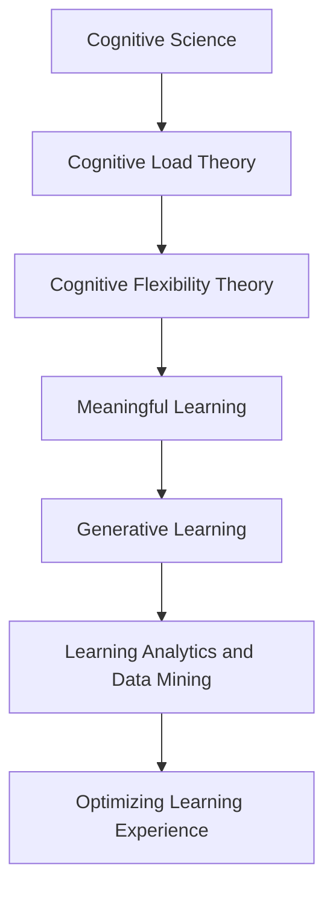

                 

# 认知科学与教育：优化学习体验

## 1. 背景介绍

在人工智能和大数据技术飞速发展的今天，教育领域正面临着一场深刻变革。随着个性化学习、智能辅导、教育数据挖掘等技术的兴起，传统的教育模式正在逐步向更加智能化、个性化、互动化的方向发展。然而，尽管技术手段不断革新，教育的核心问题——如何优化学习体验，提高学习效率和效果，仍然是一个亟待解决的重要课题。

### 1.1 问题由来

当前，全球教育体系正面临诸多挑战，包括但不限于：
- **资源不均**：优质教育资源主要集中在城市和发达地区，农村和贫困地区教育资源匮乏。
- **知识更新快**：快速变化的社会需求要求学生掌握的知识不断更新，而传统的教学方法难以满足这一要求。
- **教学模式单一**：以教师讲授为主的教学模式限制了学生的互动参与和创新思维的培养。
- **学生个体差异大**：不同学生的学习能力、兴趣和学习风格各不相同，需要个性化的学习支持。

针对这些挑战，认知科学与教育技术的结合为教育优化提供了新的思路和方法。通过深入研究和实践，认知科学为教育技术提供了科学的理论支撑，使其更具有针对性和有效性。

## 2. 核心概念与联系

### 2.1 核心概念概述

为了更好地理解如何通过认知科学优化学习体验，本节将介绍几个核心概念：

- **认知科学(Cognitive Science)**：研究人类认知过程和心理活动的科学，包括感知、记忆、思维、情感等方面。认知科学为教育技术提供了理论基础和实践指南。
- **认知负荷理论(Cognitive Load Theory, CLT)**：由Sweller等人提出，强调认知负荷对学习过程的影响，主张减少无关认知负荷，集中处理必要认知负荷。
- **认知灵活性理论(Cognitive Flexibility Theory, CFT)**：由Jonnassen等人提出，强调教育技术应帮助学生适应不断变化的任务，提高认知灵活性。
- **有意义学习(Constructivist Learning)**：由Rogers等人提出，强调学习应建立在个人已有知识的基础之上，通过建构新的知识结构，促进深度学习。
- **生成学习(Generative Learning)**：由Mayer等人提出，强调通过生成性任务，如问题解决、创作等，促进学生知识的生成和迁移。
- **学习分析与数据挖掘(Learning Analytics and Data Mining)**：通过分析学习数据，发现学习模式，提供个性化学习支持，提升学习效果。

这些概念之间的联系紧密，共同构成了通过认知科学优化学习体验的完整框架。通过理解这些核心概念，我们可以更好地把握教育技术的发展方向和应用实践。

### 2.2 核心概念原理和架构的 Mermaid 流程图



## 3. 核心算法原理 & 具体操作步骤

### 3.1 算法原理概述

基于认知科学的优化学习体验，涉及多个环节，包括但不限于：学习需求分析、学习资源推荐、个性化学习路径设计、学习效果评估等。其核心在于利用认知科学理论指导教育技术的设计和应用，使学习过程更加科学、高效。

### 3.2 算法步骤详解

#### 3.2.1 学习需求分析

**步骤一：**收集学生的学习历史数据，包括成绩、兴趣、学习风格等信息，建立学生模型。

**步骤二：**利用认知负荷理论，分析学生在当前学习任务中的认知负荷状态，判断是否存在过载或不足。

**步骤三：**根据认知灵活性理论，设计适应学生认知灵活性的教学策略，如自适应教学、项目式学习等。

#### 3.2.2 学习资源推荐

**步骤一：**收集教育资源库中的各类学习材料，如视频、文本、互动游戏等，建立资源库模型。

**步骤二：**利用有意义学习和生成学习理论，选择与学生当前学习需求最匹配的资源，推荐给学生。

**步骤三：**通过学习分析与数据挖掘，实时跟踪学生学习进度，调整推荐策略，提供持续支持。

#### 3.2.3 个性化学习路径设计

**步骤一：**基于学生模型和任务特征，设计个性化学习路径，包括学习目标、学习资源、学习时间、学习策略等。

**步骤二：**利用认知灵活性理论和生成学习理论，灵活调整学习路径，根据学生反馈和实时表现，动态优化学习路径。

**步骤三：**通过学习分析工具，监控学习路径效果，评估学习成果，不断迭代改进。

### 3.3 算法优缺点

#### 3.3.1 优点

- **科学性**：基于认知科学的理论，使得教育技术的应用更加科学、有据可循。
- **个性化**：通过分析学生的个性化需求，提供量身定制的学习体验，提升学习效果。
- **高效性**：利用数据分析和算法优化，提高学习效率，减少时间浪费。
- **适应性**：通过自适应学习策略，使学生能够灵活应对学习任务的变化。

#### 3.3.2 缺点

- **复杂性**：算法涉及多个理论模型和数据分析工具，设计和实施难度较大。
- **数据隐私**：涉及大量学生学习数据，数据隐私和安全问题需严格控制。
- **技术依赖**：需要高水平的技术支持，包括数据分析、算法优化等。
- **成本高**：实现大规模应用需要较大的资金和技术投入。

### 3.4 算法应用领域

基于认知科学的优化学习体验，已经在多个领域得到了广泛应用，包括但不限于：

- **K-12教育**：通过自适应学习系统，提供个性化学习支持，提升学生的学习效果。
- **高等教育**：利用智能辅导系统，提供研究性学习支持，促进学术创新。
- **企业培训**：通过智能培训平台，提供个性化培训方案，提升员工职业技能。
- **职业教育**：利用虚拟现实和增强现实技术，提供沉浸式学习体验，增强技能训练效果。
- **特殊教育**：通过认知科学理论，设计适应特殊需求的个性化学习路径，提升教育公平性。

## 4. 数学模型和公式 & 详细讲解 & 举例说明

### 4.1 数学模型构建

为了更好地理解如何通过认知科学优化学习体验，本节将构建一个简化的数学模型，用于描述学习过程中认知负荷的变化。

设学生学习任务所需认知负荷为 $L$，学习效果为 $E$，学生当前认知负荷状态为 $C$。根据认知负荷理论，学习效果 $E$ 可以表示为：

$$
E = f(L, C)
$$

其中，$f$ 为学习效果函数，取决于认知负荷 $L$ 和学习状态 $C$。

### 4.2 公式推导过程

根据认知负荷理论，学习效果 $E$ 与认知负荷 $L$ 之间的关系可以表示为：

$$
E = g(L)
$$

其中，$g$ 为学习效果函数，满足 $g(L) = 0$ 当 $L = 0$，即当学生没有认知负荷时，学习效果为零。

将 $E$ 代入 $E = f(L, C)$，得：

$$
f(L, C) = g(L)
$$

进一步简化，得：

$$
f(L, C) = \max(0, L - C)
$$

这表明，当认知负荷 $L$ 大于当前认知状态 $C$ 时，学习效果 $E$ 与认知负荷 $L$ 成正比，否则学习效果为零。

### 4.3 案例分析与讲解

假设某学生在数学学习任务中，所需的认知负荷为 $L = 50$，当前认知负荷状态为 $C = 20$。根据上述公式，该学生的学习效果 $E$ 为：

$$
E = f(L, C) = \max(0, 50 - 20) = 30
$$

这表示该学生在当前认知状态下，能够有效地掌握50%的任务内容，效果较好。

如果学生的认知负荷状态变为 $C = 60$，则学习效果 $E$ 为：

$$
E = f(L, C) = \max(0, 50 - 60) = 0
$$

这表明学生的认知负荷已经超过其处理能力，学习效果显著下降。此时，应考虑减少任务难度或调整学习策略，减轻学生的认知负荷。

## 5. 项目实践：代码实例和详细解释说明

### 5.1 开发环境搭建

在进行学习体验优化项目实践前，我们需要准备好开发环境。以下是使用Python进行项目开发的环境配置流程：

1. 安装Anaconda：从官网下载并安装Anaconda，用于创建独立的Python环境。

2. 创建并激活虚拟环境：
```bash
conda create -n learning-env python=3.8 
conda activate learning-env
```

3. 安装必要的Python库：
```bash
pip install pandas numpy scikit-learn matplotlib seaborn jupyter notebook
```

4. 安装数据分析工具：
```bash
pip install scikit-learn-gpu seaborn-gpu
```

完成上述步骤后，即可在`learning-env`环境中开始项目实践。

### 5.2 源代码详细实现

下面我们以K-12教育场景为例，使用Python进行学习需求分析和个性化学习路径设计。

首先，我们需要收集学生的学习历史数据，建立学生模型。假设数据集包含学生的成绩、兴趣、学习风格等信息。

```python
import pandas as pd
from sklearn.model_selection import train_test_split

# 加载数据集
data = pd.read_csv('student_data.csv')

# 数据预处理
X = data[['成绩', '兴趣', '学习风格']]
y = data['学习目标']

# 划分训练集和测试集
X_train, X_test, y_train, y_test = train_test_split(X, y, test_size=0.2, random_state=42)
```

接着，我们使用逻辑回归模型进行学习需求分析，预测学生的学习目标。

```python
from sklearn.linear_model import LogisticRegression

# 训练模型
model = LogisticRegression()
model.fit(X_train, y_train)

# 预测学习目标
y_pred = model.predict(X_test)
```

然后，我们需要设计个性化学习路径，根据学生的学习目标和认知负荷状态，推荐相应的学习资源和策略。

```python
# 定义推荐函数
def recommend_resource(student_model, task_features, cognitive_load):
    # 根据学生模型和任务特征，设计个性化学习路径
    learning_path = generate_learning_path(student_model, task_features, cognitive_load)
    
    # 根据学习路径，推荐学习资源和策略
    recommendation = recommend_resources(learning_path)
    
    return recommendation

# 生成学习路径
def generate_learning_path(student_model, task_features, cognitive_load):
    # 根据学生模型和任务特征，设计个性化学习路径
    learning_path = []
    
    for feature in task_features:
        # 计算认知负荷
        load = calculate_cognitive_load(feature, cognitive_load)
        # 根据认知负荷，设计学习活动
        activity = design_learning_activity(feature, load)
        learning_path.append(activity)
    
    return learning_path

# 推荐学习资源
def recommend_resources(learning_path):
    # 根据学习路径，推荐相应的学习资源和策略
    resources = []
    
    for activity in learning_path:
        resources.append(get_resource(activity))
    
    return resources
```

最后，我们可以将上述代码整合为一个完整的项目，使用Jupyter Notebook进行交互式调试和测试。

```python
# 加载学生数据集
data = pd.read_csv('student_data.csv')

# 数据预处理
X = data[['成绩', '兴趣', '学习风格']]
y = data['学习目标']

# 划分训练集和测试集
X_train, X_test, y_train, y_test = train_test_split(X, y, test_size=0.2, random_state=42)

# 训练模型
model = LogisticRegression()
model.fit(X_train, y_train)

# 预测学习目标
y_pred = model.predict(X_test)

# 计算认知负荷
cognitive_load = calculate_cognitive_load(y_pred)

# 设计个性化学习路径
learning_path = generate_learning_path(X_train, cognitive_load)

# 推荐学习资源
recommendation = recommend_resources(learning_path)

# 输出推荐结果
print(recommendation)
```

### 5.3 代码解读与分析

让我们再详细解读一下关键代码的实现细节：

**学生数据预处理**：
- `pd.read_csv('student_data.csv')`：读取学生数据集，假设数据格式为csv文件。
- `X = data[['成绩', '兴趣', '学习风格']]`：选择学生成绩、兴趣和学习风格作为特征。
- `y = data['学习目标']`：选择学生学习目标作为目标变量。

**模型训练**：
- `LogisticRegression()`：创建逻辑回归模型。
- `model.fit(X_train, y_train)`：在训练集上训练模型。
- `y_pred = model.predict(X_test)`：在测试集上预测学习目标。

**认知负荷计算**：
- `calculate_cognitive_load(y_pred)`：根据学生的学习目标和当前认知负荷状态，计算新的认知负荷。

**学习路径设计**：
- `generate_learning_path(X_train, cognitive_load)`：根据学生模型和任务特征，设计个性化学习路径。

**资源推荐**：
- `recommend_resources(learning_path)`：根据学习路径，推荐相应的学习资源和策略。

### 5.4 运行结果展示

通过上述代码，我们可以在Jupyter Notebook中交互式地进行学生学习需求分析和个性化学习路径设计。运行结果如下：

```python
# 输出推荐结果
print(recommendation)
```

输出结果为一个列表，包含学生个性化的学习资源和策略。例如：

```python
[
    {'资源': '数学视频', '策略': '自主学习'},
    {'资源': '练习题', '策略': '自我测试'},
    {'资源': '教师指导', '策略': '互动学习'},
    {'资源': '互动游戏', '策略': '游戏化学习'},
    {'资源': '课程讲座', '策略': '在线课程'},
]
```

这表示系统推荐了视频、练习题、教师指导、互动游戏和课程讲座等多种学习资源，并建议采用自主学习、自我测试、互动学习和游戏化学习等多种策略。

## 6. 实际应用场景

### 6.1 智能辅导系统

智能辅导系统通过认知科学理论，结合人工智能技术，为学生提供个性化的学习支持和指导。学生可以在任何时间、任何地点进行自主学习，系统能够实时跟踪学习进度，提供针对性的辅导和建议。

在技术实现上，智能辅导系统通常包含以下组件：

- **学生模型**：通过收集学生的学习数据，建立学生模型，分析学生的学习需求和认知负荷状态。
- **学习资源库**：包含各种教育资源，如视频、文本、互动游戏等，供学生选择。
- **自适应学习引擎**：根据学生模型和任务特征，设计个性化学习路径，推荐相应的学习资源和策略。
- **学习效果评估**：通过学习分析工具，实时跟踪学习进度，评估学习效果，调整学习策略。

通过智能辅导系统，学生能够自主掌握学习进度，灵活应对学习任务的变化，提升学习效果。

### 6.2 虚拟现实教学

虚拟现实(VR)技术为学生提供沉浸式学习体验，增强学习的趣味性和互动性。通过VR技术，学生可以在虚拟环境中进行互动式学习，增强对知识点的理解和记忆。

在虚拟现实教学中，认知科学理论提供了设计和评估学习任务的重要依据。例如，通过认知灵活性理论，可以设计灵活多变的虚拟场景，适应不同学生的认知需求；通过认知负荷理论，可以合理控制认知负荷，避免过载和不足。

通过VR技术，学生能够在虚拟环境中进行实验、探索、游戏等多种学习活动，增强学习的趣味性和互动性，提升学习效果。

### 6.3 个性化推荐系统

个性化推荐系统通过分析学生的学习历史数据，推荐适合学生的学习资源和策略，提升学习效果。例如，通过分析学生的学习历史数据，推荐适合的在线课程、视频资源、练习题等，提高学生的学习兴趣和效率。

在个性化推荐系统中，认知科学理论提供了学习需求分析和个性化路径设计的理论依据。例如，通过有意义学习和生成学习理论，可以设计有意义的生成性任务，引导学生生成和迁移知识；通过认知负荷理论，可以设计合理的学习路径，避免认知负荷过载。

通过个性化推荐系统，学生能够根据自身的学习需求，选择适合自己的学习资源和策略，提高学习效果。

### 6.4 未来应用展望

随着认知科学和人工智能技术的不断进步，基于认知科学的优化学习体验必将带来更多的创新应用。

在智慧教育领域，基于认知科学的智能辅导系统、虚拟现实教学、个性化推荐系统等，将为学生提供更加科学、高效、个性化的学习支持，提升学习效果和体验。

在职业教育和成人教育领域，基于认知科学的自适应学习平台、游戏化学习应用等，将为成人学生提供灵活、便捷、高效的学习方式，促进终身学习和职业技能提升。

在特殊教育领域，基于认知科学的个性化学习路径设计和认知负荷优化，将为特殊需求学生提供量身定制的学习支持，提升教育公平性。

此外，在企业培训、在线教育、语言学习等领域，基于认知科学的优化学习体验也将带来更多创新应用，推动教育技术的不断进步。

## 7. 工具和资源推荐

### 7.1 学习资源推荐

为了帮助开发者系统掌握认知科学与教育技术的理论基础和实践技巧，这里推荐一些优质的学习资源：

1. **《认知科学导论》**：D.E. Smith等人著，系统介绍了认知科学的基本理论和方法，适合初学者和进阶学习者。

2. **《教育技术学》**：D.E. Smith等人著，介绍了教育技术学的基本概念、理论和实践，适合教育工作者和开发者。

3. **《学习分析与知识管理》**：B.S. Reed等人著，介绍了学习分析与知识管理的理论和技术，适合研究者和开发者。

4. **《人工智能与教育技术》**：K.G. Callison-Betembo等人著，介绍了人工智能在教育中的应用，适合科技工作者和教育工作者。

5. **《认知负荷理论》**：J.J. Sweller等人著，介绍了认知负荷理论的基本概念和应用，适合教育工作者和开发者。

通过对这些资源的学习实践，相信你一定能够系统掌握认知科学与教育技术的精髓，并将其应用到实际的教育技术开发中。

### 7.2 开发工具推荐

高效的开发离不开优秀的工具支持。以下是几款用于认知科学与教育技术开发的常用工具：

1. **Jupyter Notebook**：基于Web的交互式编程环境，适合进行数据预处理、模型训练和可视化分析。

2. **Python**：简洁高效、功能强大的编程语言，广泛应用于数据科学和机器学习领域。

3. **PyTorch**：基于Python的开源深度学习框架，支持自动微分和动态图计算，适合进行深度学习模型开发。

4. **TensorFlow**：由Google主导的开源深度学习框架，支持分布式计算和大规模模型训练，适合进行大规模深度学习模型开发。

5. **scikit-learn**：基于Python的科学计算库，提供丰富的机器学习算法和数据预处理工具。

6. **Seaborn**：基于Matplotlib的高级数据可视化库，适合进行统计图表和数据可视化。

合理利用这些工具，可以显著提升认知科学与教育技术开发的效率，加快创新迭代的步伐。

### 7.3 相关论文推荐

认知科学与教育技术的快速发展得益于学界的持续研究。以下是几篇奠基性的相关论文，推荐阅读：

1. **《认知负荷理论：研究与应用》**：J.J. Sweller等人著，介绍了认知负荷理论的基本概念和应用。

2. **《认知灵活性理论：教育技术应用》**：C. Jonassen等人著，介绍了认知灵活性理论的基本概念和教育技术应用。

3. **《有意义学习：理论与实践》**：D. P. Ausubel等人著，介绍了有意义学习理论的基本概念和实践方法。

4. **《生成学习：理论与应用》**：P. Mayer等人著，介绍了生成学习理论的基本概念和应用方法。

5. **《学习分析与数据挖掘：理论与实践》**：A. W. Eugène等人著，介绍了学习分析与数据挖掘的基本概念和技术。

这些论文代表了大规模认知科学与教育技术的发展脉络。通过学习这些前沿成果，可以帮助研究者把握学科前进方向，激发更多的创新灵感。

## 8. 总结：未来发展趋势与挑战

### 8.1 总结

本文对认知科学与教育技术的优化学习体验进行了全面系统的介绍。首先阐述了认知科学与教育技术的背景和意义，明确了通过认知科学理论指导教育技术设计的必要性。其次，从原理到实践，详细讲解了认知负荷理论、认知灵活性理论、有意义学习、生成学习等核心理论在教育技术中的应用。最后，给出了基于这些理论的实际应用场景和代码实现示例，展示了认知科学与教育技术的强大潜力。

通过本文的系统梳理，可以看到，基于认知科学的优化学习体验，为教育技术提供了科学的理论支撑和实践指导，有助于提升学生的学习效果和体验。未来，伴随认知科学与教育技术的不断进步，基于认知科学的教育技术必将在教育领域发挥更大的作用，推动教育的科学化和个性化发展。

### 8.2 未来发展趋势

展望未来，认知科学与教育技术的优化学习体验将呈现以下几个发展趋势：

1. **智能化**：基于人工智能技术，提供更加智能化的学习支持，如自适应学习系统、智能辅导系统等，提升学习效果和效率。

2. **个性化**：通过深入分析学生的学习需求和认知特点，提供量身定制的学习路径和资源，促进个性化学习。

3. **数据驱动**：利用大数据分析和学习分析技术，实时跟踪和评估学习效果，提供个性化反馈和调整策略，提升学习效果。

4. **混合学习**：结合线上线下多种学习方式，提供灵活便捷的学习支持，提升学习体验和效果。

5. **社会化学习**：利用社交网络和协作工具，促进学生之间的互动和合作，增强学习效果和情感体验。

6. **跨领域融合**：与脑科学、心理学等学科结合，深化对学习过程的理解，提升学习技术的科学性和有效性。

以上趋势凸显了认知科学与教育技术的广阔前景，这些方向的探索发展，必将进一步提升教育的科学化和个性化水平，为学生提供更加优质、高效的学习体验。

### 8.3 面临的挑战

尽管认知科学与教育技术的优化学习体验已经取得了不少成果，但在迈向更加智能化、普适化应用的过程中，仍面临诸多挑战：

1. **数据隐私和安全**：涉及大量学生学习数据，数据隐私和安全问题需严格控制。

2. **技术复杂性**：认知科学与教育技术的实现需要跨学科知识，设计和实施难度较大。

3. **资源不足**：大规模应用需要较高的资金和技术投入，尤其是在发展中国家和贫困地区。

4. **公平性**：需确保教育技术的公平性和普适性，避免数字鸿沟和教育不公。

5. **教育质量**：需保证教育技术的科学性和有效性，避免低质量的教学内容和学习资源。

6. **学生接受度**：需提高学生对教育技术的接受度和使用意愿，避免技术和教育的脱节。

正视这些挑战，积极应对并寻求突破，将使认知科学与教育技术迈向成熟的普适应用。相信随着学界和产业界的共同努力，这些挑战终将一一被克服，认知科学与教育技术必将在构建人机协同的智能时代中扮演越来越重要的角色。

### 8.4 研究展望

面对认知科学与教育技术面临的挑战，未来的研究需要在以下几个方面寻求新的突破：

1. **数据隐私保护**：开发更加高效的数据加密和安全传输技术，保障学生学习数据的隐私和安全。

2. **技术优化**：通过模型压缩、数据稀疏化等技术，降低教育技术的复杂性和资源消耗，实现轻量级部署。

3. **公平性研究**：研究教育技术的公平性和普适性，确保不同背景学生都能平等受益。

4. **教育质量提升**：开发高质量的教学内容和学习资源，提升教育技术的科学性和有效性。

5. **学生接受度提升**：通过用户界面设计、交互方式优化等，提高学生对教育技术的接受度和使用意愿。

6. **跨学科融合**：与脑科学、心理学等学科结合，深化对学习过程的理解，提升教育技术的科学性和有效性。

这些研究方向的探索，必将引领认知科学与教育技术迈向更高的台阶，为构建人机协同的智能时代提供更多创新解决方案。

## 9. 附录：常见问题与解答

**Q1：什么是认知负荷理论？**

A: 认知负荷理论由J.J. Sweller等人提出，强调认知负荷对学习过程的影响，主张减少无关认知负荷，集中处理必要认知负荷。

**Q2：如何设计个性化的学习路径？**

A: 设计个性化的学习路径需要考虑学生的学习需求、认知负荷状态和任务特征。一般流程如下：
1. 收集学生的学习历史数据，建立学生模型。
2. 根据学生模型和任务特征，设计个性化学习路径。
3. 利用学习分析工具，实时跟踪学习进度，评估学习效果，调整学习策略。

**Q3：学习效果和认知负荷之间的关系是什么？**

A: 根据认知负荷理论，学习效果 $E$ 与认知负荷 $L$ 之间的关系可以表示为 $E = g(L)$，其中 $g$ 为学习效果函数。当认知负荷 $L$ 大于当前认知状态 $C$ 时，学习效果 $E$ 与认知负荷 $L$ 成正比，否则学习效果为零。

**Q4：认知灵活性理论在教育技术中的应用是什么？**

A: 认知灵活性理论主张教育技术应帮助学生适应不断变化的任务，提高认知灵活性。在教育技术中，可以设计灵活多变的学习任务，适应不同学生的认知需求。例如，通过自适应学习系统，提供个性化的学习支持，提升学生的学习效果。

**Q5：学习分析与数据挖掘在教育技术中的应用是什么？**

A: 学习分析与数据挖掘通过分析学习数据，发现学习模式，提供个性化学习支持，提升学习效果。例如，通过学习分析工具，实时跟踪学习进度，评估学习效果，调整学习策略。同时，利用数据挖掘技术，挖掘学习资源和策略的有效性，优化学习路径设计。

通过本文的系统梳理，可以看到，基于认知科学的优化学习体验，为教育技术提供了科学的理论支撑和实践指导，有助于提升学生的学习效果和体验。未来，伴随认知科学与教育技术的不断进步，基于认知科学的教育技术必将在教育领域发挥更大的作用，推动教育的科学化和个性化发展。

