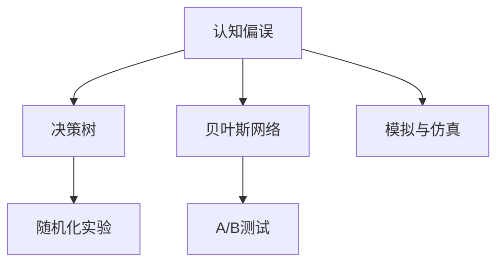

                 

# 认知科学在商业中的应用：决策优化

## 1. 背景介绍

### 1.1 问题由来
在商业决策过程中，人类往往受到多种认知偏误的影响，导致决策失误。例如，过度自信、锚定效应、可得性启发等认知偏误，都会扭曲我们的判断和决策。为了提高决策的科学性和客观性，认知科学在商业决策优化领域的应用变得尤为重要。

### 1.2 问题核心关键点
认知科学在商业决策优化中的应用，主要是通过量化决策过程，将人类的认知心理和行为规律引入到商业决策模型中，从而减少偏见，提升决策的准确性和效率。该领域的核心关键点包括：

1. **认知偏误建模**：识别和建模常见的认知偏误，建立其对决策结果的影响模型。
2. **数据驱动决策**：利用大数据和机器学习算法，优化决策模型，提高决策效果。
3. **行为激励设计**：通过设计有效的激励机制，引导员工和客户做出更合理的决策。
4. **反馈机制建设**：建立健全的反馈机制，持续改进决策模型和决策流程。

### 1.3 问题研究意义
认知科学在商业决策优化中的应用，对于提升企业的决策水平，减少人为偏见，提升竞争力具有重要意义：

1. **提升决策质量**：通过引入认知科学，减少认知偏误，提升决策的科学性和准确性。
2. **优化资源配置**：通过量化决策过程，更科学地分配资源，提高企业的运营效率。
3. **增强用户体验**：通过优化决策模型，提升用户满意度，增强客户黏性。
4. **促进创新**：认知科学的引入有助于发现决策过程中的盲点和改进点，激发创新思维。
5. **降低风险**：通过减少决策偏差，降低企业运营风险，提升整体稳定性。

## 2. 核心概念与联系

### 2.1 核心概念概述

为更好地理解认知科学在商业决策优化中的应用，本节将介绍几个关键概念：

- **认知偏误**：指人们在判断和决策过程中，由于心理和行为因素引起的系统性误差。常见的认知偏误包括过度自信、锚定效应、确认偏误等。
- **决策树**：一种利用树形结构表示决策过程的模型，用于描述决策过程中的选择和判断。
- **贝叶斯网络**：一种基于概率图模型表示不确定性和因果关系的模型，用于处理多因素交互作用。
- **A/B测试**：一种常用的数据驱动决策方法，通过随机分组比较两种方案的效果，选择合适的决策。
- **随机化实验**：一种严格控制变量的实验方法，通过随机分配样本到不同组，消除其他因素的干扰，提升实验结果的可靠性。
- **模拟与仿真**：通过构建虚拟环境或仿真模型，模拟决策过程和结果，预测未来趋势，进行“未雨绸缪”的决策。

这些概念之间的逻辑关系可以通过以下Mermaid流程图来展示：



这个流程图展示了几大核心概念之间的联系：

1. 认知偏误是决策过程中需要规避的主要问题。
2. 决策树和贝叶斯网络是用于模型化决策过程的两种常用工具。
3. A/B测试和随机化实验是数据驱动决策的两种主要方法。
4. 模拟与仿真技术可用于预演和评估决策效果。

## 3. 核心算法原理 & 具体操作步骤

### 3.1 算法原理概述

认知科学在商业决策优化中的应用，本质上是通过数据驱动和行为建模，将认知偏误引入到决策模型中，提升决策的科学性和客观性。其核心思想是：

1. **量化决策过程**：通过建模和仿真，将决策过程中的认知偏误和行为规律进行量化。
2. **引入数据驱动决策**：利用大数据和机器学习算法，优化决策模型，减少人为偏见。
3. **设计行为激励机制**：根据行为经济学原理，设计有效的激励机制，引导员工和客户做出更合理的决策。
4. **构建反馈循环**：建立健全的反馈机制，持续改进决策模型和决策流程。

### 3.2 算法步骤详解

基于认知科学在商业决策优化中的应用，一般包括以下几个关键步骤：

**Step 1: 数据收集与预处理**
- 收集与决策相关的各类数据，包括客户行为数据、市场数据、内部运营数据等。
- 对数据进行清洗和预处理，消除噪音和异常值，保证数据质量。

**Step 2: 建模与仿真**
- 使用决策树、贝叶斯网络等模型对决策过程进行建模，量化认知偏误和行为规律。
- 通过模拟与仿真技术，评估不同决策方案的效果，预测未来趋势。

**Step 3: 数据驱动决策**
- 利用A/B测试、随机化实验等方法，收集不同方案的效果数据。
- 使用机器学习算法，如随机森林、梯度提升树等，构建决策优化模型。

**Step 4: 行为激励设计**
- 根据行为经济学原理，设计有效的激励机制，如奖励、惩罚、积分等，引导员工和客户做出更合理的决策。
- 通过数据驱动决策，评估激励机制的效果，不断优化和迭代。

**Step 5: 反馈与改进**
- 建立健全的反馈机制，收集决策结果和用户反馈，评估决策模型的效果。
- 利用机器学习算法，不断优化决策模型和决策流程，提升决策效果。

### 3.3 算法优缺点

认知科学在商业决策优化中的应用，具有以下优点：

1. **提升决策科学性**：通过量化决策过程，减少认知偏误，提升决策的科学性和准确性。
2. **优化资源配置**：通过数据驱动决策，更科学地分配资源，提高企业的运营效率。
3. **增强用户体验**：通过优化决策模型，提升用户满意度，增强客户黏性。
4. **促进创新**：通过认知科学的引入，激发创新思维，发现决策过程中的盲点和改进点。
5. **降低风险**：通过减少决策偏差，降低企业运营风险，提升整体稳定性。

同时，该方法也存在一定的局限性：

1. **数据依赖性强**：数据质量直接影响决策模型的效果，数据收集和处理成本较高。
2. **模型复杂度高**：建模和仿真过程复杂，模型构建和维护成本高。
3. **激励机制设计难度大**：设计有效的激励机制需要深厚的行为经济学知识，难度较大。
4. **反馈循环周期长**：反馈机制建设复杂，改进周期较长，难以快速响应市场变化。
5. **伦理和隐私问题**：数据收集和使用过程中涉及伦理和隐私问题，需要严格监管。

尽管存在这些局限性，但就目前而言，认知科学在商业决策优化中的应用，仍是大数据时代的重要范式。未来相关研究的重点在于如何进一步降低数据依赖，提高模型效率，优化激励机制，加强反馈循环等。

### 3.4 算法应用领域

认知科学在商业决策优化中的应用，已经在多个领域得到广泛应用，例如：

- **金融风控**：利用决策树和贝叶斯网络，量化信用风险，提升贷款审批效率。
- **市场营销**：通过A/B测试和随机化实验，优化广告投放策略，提升用户转化率。
- **供应链管理**：使用仿真和模拟技术，优化库存管理，降低运营成本。
- **人力资源管理**：通过行为经济学原理，设计员工绩效激励机制，提升员工满意度和工作效率。
- **客户服务**：使用决策树和机器学习算法，优化客服流程，提升客户满意度。

除了上述这些经典领域外，认知科学在商业决策优化中的应用还在持续扩展，如医疗健康、物流运输、智能制造等，为各行业带来了全新的变革和突破。

## 4. 数学模型和公式 & 详细讲解

### 4.1 数学模型构建

本节将使用数学语言对认知科学在商业决策优化中的应用进行更加严格的刻画。

记决策过程为 $D$，决策目标为 $O$，影响因素为 $S$。假设决策过程 $D$ 可以表示为 $D = f(S)$，其中 $f$ 为决策函数。定义决策结果为 $R$，则决策过程的目标是最大化 $R$，即：

$$
\max_{S} f(S)
$$

为了优化决策过程，我们需要通过数据和模型来量化决策函数 $f$。常用的数学模型包括：

1. **决策树**：将决策过程表示为树形结构，通过节点分裂和叶节点选择，建模决策函数。
2. **贝叶斯网络**：通过概率图模型，建模决策过程中各因素的因果关系。
3. **回归模型**：通过线性回归、岭回归等模型，建模决策结果与影响因素之间的关系。

### 4.2 公式推导过程

以下我们以回归模型为例，推导其决策优化公式。

假设决策结果 $R$ 与影响因素 $S$ 之间存在线性关系，即：

$$
R = \beta_0 + \beta_1 S_1 + \beta_2 S_2 + ... + \beta_n S_n + \epsilon
$$

其中 $\beta_i$ 为回归系数，$\epsilon$ 为随机误差项。根据最小二乘法，回归系数的估计值为：

$$
\hat{\beta} = \arg\min_{\beta} \sum_{i=1}^n (y_i - f(x_i))^2
$$

其中 $y_i$ 为决策结果，$x_i$ 为影响因素。最小二乘法的解为：

$$
\hat{\beta} = (X^TX)^{-1}X^Ty
$$

在得到回归系数后，我们可以通过数据驱动决策，构建决策优化模型。假设已知样本数据集为 $D=\{(x_i,y_i)\}_{i=1}^N$，则决策优化模型为：

$$
\max_{\beta} \sum_{i=1}^N y_i
$$

### 4.3 案例分析与讲解

以下我们以金融风控为例，分析回归模型在决策优化中的应用。

假设银行想要提升贷款审批效率，使用回归模型量化决策过程。选取贷款金额、信用评分、贷款期限等作为影响因素 $S$，贷款结果（是否违约）作为决策结果 $R$。通过数据收集和预处理，构建数据集 $D=\{(x_i,y_i)\}_{i=1}^N$，其中 $x_i$ 为贷款数据，$y_i$ 为违约标签。

使用线性回归模型，对数据进行建模，得到回归系数 $\hat{\beta}$。然后，根据决策优化目标，使用决策优化模型，对新贷款进行审批决策。例如，某贷款申请的特征向量为 $x_{new}$，则其决策结果为：

$$
y_{new} = f(x_{new}) = \hat{\beta}_0 + \hat{\beta}_1 S_{1,new} + ... + \hat{\beta}_n S_{n,new}
$$

其中 $S_{i,new}$ 为新贷款的特征向量，$i=1,...,n$。通过上述方法，银行可以高效、科学地进行贷款审批，提升决策效率和效果。

## 5. 项目实践：代码实例和详细解释说明

### 5.1 开发环境搭建

在进行决策优化实践前，我们需要准备好开发环境。以下是使用Python进行Scikit-learn开发的开发环境配置流程：

1. 安装Anaconda：从官网下载并安装Anaconda，用于创建独立的Python环境。

2. 创建并激活虚拟环境：
```bash
conda create -n sk-env python=3.8 
conda activate sk-env
```

3. 安装Scikit-learn：
```bash
conda install scikit-learn
```

4. 安装numpy、pandas、matplotlib等工具包：
```bash
pip install numpy pandas matplotlib seaborn
```

完成上述步骤后，即可在`sk-env`环境中开始决策优化实践。

### 5.2 源代码详细实现

下面我以线性回归模型为例，给出使用Scikit-learn对金融风控进行决策优化的Python代码实现。

首先，定义数据处理函数：

```python
import pandas as pd
from sklearn.model_selection import train_test_split
from sklearn.linear_model import LinearRegression
from sklearn.metrics import mean_squared_error, r2_score

def load_data(filename):
    data = pd.read_csv(filename)
    features = data[['amount', 'score', 'duration']]
    labels = data['default']
    return features, labels

def preprocess_data(features, labels):
    features = features.dropna()
    labels = labels.dropna()
    return features, labels

def split_data(features, labels):
    features_train, features_test, labels_train, labels_test = train_test_split(features, labels, test_size=0.3, random_state=42)
    return features_train, features_test, labels_train, labels_test

def train_model(features_train, labels_train):
    model = LinearRegression()
    model.fit(features_train, labels_train)
    return model

def evaluate_model(model, features_test, labels_test):
    preds = model.predict(features_test)
    mse = mean_squared_error(labels_test, preds)
    r2 = r2_score(labels_test, preds)
    return mse, r2
```

然后，进行数据加载和预处理：

```python
features, labels = load_data('loan_data.csv')
features, labels = preprocess_data(features, labels)
features_train, features_test, labels_train, labels_test = split_data(features, labels)
```

接着，训练模型并评估性能：

```python
model = train_model(features_train, labels_train)
mse, r2 = evaluate_model(model, features_test, labels_test)
print(f'Mean Squared Error: {mse:.2f}')
print(f'R^2 Score: {r2:.2f}')
```

以上就是使用Scikit-learn对金融风控进行决策优化的完整代码实现。可以看到，通过数据处理和模型构建，决策优化过程变得简洁高效。

### 5.3 代码解读与分析

让我们再详细解读一下关键代码的实现细节：

**load_data函数**：
- 定义数据处理函数，读取贷款数据集，提取特征和标签。

**preprocess_data函数**：
- 处理缺失值，保证数据完整性。

**split_data函数**：
- 将数据集划分为训练集和测试集，并返回各部分的特征和标签。

**train_model函数**：
- 使用线性回归模型进行训练，返回训练好的模型。

**evaluate_model函数**：
- 对模型进行评估，计算均方误差和R^2得分，并返回评估结果。

**train流程**：
- 加载数据并进行预处理
- 将数据划分为训练集和测试集
- 训练线性回归模型
- 对模型进行评估，输出评估结果

可以看到，Scikit-learn库使得决策优化过程的代码实现变得简洁高效。开发者可以将更多精力放在数据处理、模型改进等高层逻辑上，而不必过多关注底层的实现细节。

当然，工业级的系统实现还需考虑更多因素，如模型保存和部署、超参数调优、更多决策指标的计算等。但核心的决策优化范式基本与此类似。

## 6. 实际应用场景

### 6.1 金融风控

基于认知科学在商业决策优化中的应用，金融风控领域得到了广泛应用。传统的信用评估主要依赖专家经验，往往存在主观性和不稳定性。通过数据驱动和行为建模，可以更加科学、客观地进行风险评估和贷款审批。

具体而言，可以收集借款人的历史贷款数据、信用评分、社会关系等各类信息，构建影响因素 $S$。利用回归模型、决策树、贝叶斯网络等工具，量化决策过程，得到决策函数 $f$。在申请贷款时，根据借款人的特征向量 $x_{new}$，计算决策结果 $y_{new} = f(x_{new})$，判断是否批准贷款。

使用认知科学的决策优化方法，能够有效识别和规避常见的认知偏误，如过度自信、信息不对称等，提升贷款审批的准确性和效率。

### 6.2 市场营销

在市场营销中，A/B测试是常用的数据驱动决策方法。通过随机分组比较两种广告方案的效果，选择最优方案。

具体而言，可以设计两种不同的广告方案 $A$ 和 $B$，随机分配用户到不同组。然后，收集用户的点击率、转化率等关键指标，评估两种方案的效果。例如，某电商平台进行促销活动，设计两种广告方案 $A$ 和 $B$，分别展示不同的优惠信息。通过A/B测试，可以比较两种方案的点击率和转化率，选择效果更好的方案进行推广。

使用认知科学的决策优化方法，能够科学地评估广告方案的效果，避免人为偏见，提高营销活动的精准度和ROI。

### 6.3 供应链管理

在供应链管理中，库存管理是核心问题之一。传统的库存管理主要依赖人工经验，容易产生库存过高或过低的现象。通过模拟与仿真技术，可以优化库存管理，提升供应链的效率。

具体而言，可以建立供应链的模拟环境，包括需求、生产、运输等各个环节。通过仿真模型，模拟不同的库存管理策略，评估其效果。例如，某制造企业想要优化库存管理，可以建立供应链的仿真环境，模拟不同的库存策略，如先进先出、后进先出等。通过仿真实验，评估不同策略的库存水平和成本，选择最优策略进行实施。

使用认知科学的决策优化方法，能够科学地评估和管理供应链，降低运营成本，提升供应链的效率和稳定性。

### 6.4 未来应用展望

随着认知科学在商业决策优化中的应用不断深入，未来将在更多领域得到应用，为传统行业带来变革性影响。

在智慧医疗领域，基于认知科学的决策优化方法，可以提升医疗诊断和治疗方案的科学性和准确性。例如，某医院想要优化医生诊断过程，可以构建医生诊断的决策模型，量化常见症状和疾病之间的因果关系，提升诊断的准确性和效率。

在智能教育领域，基于认知科学的决策优化方法，可以优化教育资源分配和课程设计。例如，某在线教育平台想要提升课程设计质量，可以构建课程设计的决策模型，量化不同课程内容和形式对学生学习效果的影响，优化课程设计和内容。

在智能城市治理中，基于认知科学的决策优化方法，可以提升城市管理的智能化水平。例如，某城市想要优化交通管理，可以构建交通管理的决策模型，量化不同交通管理措施的效果，优化交通管理和规划。

此外，在企业生产、社会治理、文娱传媒等众多领域，基于认知科学的决策优化方法也将不断涌现，为各行各业带来新的变革和突破。相信随着认知科学的不断演进，决策优化技术将成为商业管理的重要工具，推动企业向更加智能化、科学化的方向发展。

## 7. 工具和资源推荐

### 7.1 学习资源推荐

为了帮助开发者系统掌握认知科学在商业决策优化中的应用，这里推荐一些优质的学习资源：

1. 《认知行为经济学》系列书籍：介绍了认知行为经济学的基础理论，以及如何在商业决策中应用认知偏误模型。

2. Coursera《数据科学导论》课程：由斯坦福大学开设的课程，系统讲解了数据驱动决策的方法和工具。

3. Scikit-learn官方文档：详细介绍了Scikit-learn库的使用方法，以及各类机器学习算法和模型。

4. Kaggle竞赛平台：提供大量的真实商业问题，通过竞赛方式锻炼数据驱动决策的能力。

5. 《数据分析实战》系列书籍：介绍了数据分析的基础知识和工具，以及如何在商业决策中应用数据分析。

通过对这些资源的学习实践，相信你一定能够快速掌握认知科学在商业决策优化中的应用，并用于解决实际的商业问题。

### 7.2 开发工具推荐

高效的开发离不开优秀的工具支持。以下是几款用于认知科学在商业决策优化应用的常用工具：

1. Python：广泛使用的编程语言，具有丰富的开源库和工具，是数据科学和机器学习的主流工具。

2. Scikit-learn：基于Python的机器学习库，包含各类算法和模型，适用于数据驱动决策的构建。

3. Jupyter Notebook：交互式编程环境，支持多语言编程和可视化展示，方便开发和分享代码。

4. Tableau：数据可视化工具，支持复杂的数据处理和可视化，便于决策过程中的数据分析和展示。

5. Google Colab：免费的在线Jupyter Notebook环境，提供GPU/TPU算力，方便快速实验最新模型。

合理利用这些工具，可以显著提升认知科学在商业决策优化应用的开发效率，加快创新迭代的步伐。

### 7.3 相关论文推荐

认知科学在商业决策优化领域的发展源于学界的持续研究。以下是几篇奠基性的相关论文，推荐阅读：

1. Kahneman, D., Slovic, P., & Tversky, A. (1982). Judgment under Uncertainty: Heuristics and Biases. Cambridge University Press.
2. Tversky, A., & Kahneman, D. (1974). Judgment under Uncertainty: Heuristics and Biases. Science, 185(4157), 1124-1131.
3. Gigerenzer, G., & Selten, R. (2004). Bounded Rationality: The Adaptive Toolbox. MIT Press.
4. Simon, H. A. (1957). Models of Man. Wiley.
5. Thaler, R. H. (2008). Nudge: Improving Decisions About Health, Wealth, and Happiness. Yale University Press.

这些论文代表了大数据时代在商业决策优化领域的研究方向，通过学习这些前沿成果，可以帮助研究者把握学科前进方向，激发更多的创新灵感。

## 8. 总结：未来发展趋势与挑战

### 8.1 总结

本文对认知科学在商业决策优化中的应用进行了全面系统的介绍。首先阐述了认知偏误在商业决策中的影响，明确了决策优化技术在提升决策水平、优化资源配置、增强用户体验等方面的重要意义。其次，从原理到实践，详细讲解了认知科学在商业决策优化中的数学模型和具体实现步骤。同时，本文还广泛探讨了决策优化技术在金融风控、市场营销、供应链管理等多个行业领域的应用前景，展示了决策优化技术的巨大潜力。此外，本文精选了决策优化技术的各类学习资源，力求为读者提供全方位的技术指引。

通过本文的系统梳理，可以看到，认知科学在商业决策优化中的应用，正在成为大数据时代的重要范式，极大地提升了决策的科学性和客观性，为传统行业带来了全新的变革和突破。未来，伴随认知科学的不断演进，决策优化技术必将在更多领域得到应用，为经济社会发展注入新的动力。

### 8.2 未来发展趋势

展望未来，认知科学在商业决策优化中的应用将呈现以下几个发展趋势：

1. **数据质量提升**：随着大数据技术的进步，数据质量将进一步提升，决策模型将更加科学和精准。
2. **模型复杂度降低**：认知偏误建模和数据驱动决策将不断优化，模型复杂度将逐步降低，决策过程将更加简洁高效。
3. **行为激励优化**：结合行为经济学原理，设计更加有效的激励机制，引导员工和客户做出更合理的决策。
4. **反馈循环改进**：通过持续改进反馈机制，不断优化决策模型和决策流程，提升决策效果。
5. **多模态融合**：将认知科学与其他技术（如知识图谱、因果推理等）进行融合，提升决策模型的通用性和鲁棒性。
6. **伦理和隐私保护**：在数据收集和使用过程中，加强伦理和隐私保护，确保决策模型的合规性和安全性。

以上趋势凸显了认知科学在商业决策优化应用的广阔前景。这些方向的探索发展，必将进一步提升决策模型的科学性和客观性，为构建安全、可靠、可解释、可控的智能系统铺平道路。面向未来，认知科学的决策优化技术还需要与其他人工智能技术进行更深入的融合，共同推动自然语言理解和智能交互系统的进步。只有勇于创新、敢于突破，才能不断拓展认知科学在商业决策优化中的边界，让智能技术更好地造福人类社会。

### 8.3 面临的挑战

尽管认知科学在商业决策优化中的应用已经取得了不少成就，但在迈向更加智能化、普适化应用的过程中，它仍面临着诸多挑战：

1. **数据依赖性强**：数据质量直接影响决策模型的效果，数据收集和处理成本较高。
2. **模型复杂度高**：建模和仿真过程复杂，模型构建和维护成本高。
3. **激励机制设计难度大**：设计有效的激励机制需要深厚的行为经济学知识，难度较大。
4. **反馈循环周期长**：反馈机制建设复杂，改进周期较长，难以快速响应市场变化。
5. **伦理和隐私问题**：数据收集和使用过程中涉及伦理和隐私问题，需要严格监管。

尽管存在这些挑战，但就目前而言，认知科学在商业决策优化中的应用，仍是大数据时代的重要范式。未来相关研究的重点在于如何进一步降低数据依赖，提高模型效率，优化激励机制，加强反馈循环等。

### 8.4 研究展望

面对认知科学在商业决策优化中所面临的挑战，未来的研究需要在以下几个方面寻求新的突破：

1. **无监督学习和半监督学习**：摆脱对大规模标注数据的依赖，利用自监督学习、主动学习等无监督和半监督范式，最大限度利用非结构化数据，实现更加灵活高效的决策优化。

2. **模型压缩与稀疏化**：通过模型压缩和稀疏化技术，减小模型尺寸，提高推理速度，降低计算成本。

3. **因果推断与决策树**：引入因果推断方法，建立稳定因果关系，提升决策模型的泛化性和抗干扰能力。

4. **多模态融合与知识图谱**：将符号化的先验知识，如知识图谱、逻辑规则等，与神经网络模型进行巧妙融合，引导决策过程学习更准确、合理的语言模型。

5. **行为经济学与激励机制**：结合行为经济学原理，设计更加合理的激励机制，引导员工和客户做出更合理的决策。

6. **伦理与隐私保护**：在数据收集和使用过程中，加强伦理和隐私保护，确保决策模型的合规性和安全性。

这些研究方向的探索，必将引领认知科学在商业决策优化技术迈向更高的台阶，为构建安全、可靠、可解释、可控的智能系统铺平道路。面向未来，认知科学的决策优化技术还需要与其他人工智能技术进行更深入的融合，共同推动自然语言理解和智能交互系统的进步。只有勇于创新、敢于突破，才能不断拓展认知科学在商业决策优化中的边界，让智能技术更好地造福人类社会。

## 9. 附录：常见问题与解答

**Q1：决策优化技术是否适用于所有商业决策？**

A: 决策优化技术适用于大部分商业决策场景，特别是对于数据量较大的决策问题。但对于一些特殊领域，如社会治理、医疗健康等，需要结合领域特性进行模型优化。例如，在医疗健康领域，需要考虑疾病的复杂性和不确定性，采用更加复杂的决策模型。

**Q2：如何选择决策优化模型？**

A: 选择决策优化模型需要考虑多方面因素，包括数据特征、决策目标、模型复杂度等。常见的决策优化模型包括回归模型、决策树、贝叶斯网络、支持向量机等。对于回归问题，可以使用回归模型；对于分类问题，可以使用决策树和支持向量机；对于多因素交互问题，可以使用贝叶斯网络。在实际应用中，可以先进行模型比较，选择效果最佳的模型。

**Q3：如何进行数据驱动决策？**

A: 数据驱动决策的关键在于收集、处理和分析大量数据。具体步骤包括：

1. 数据收集：收集与决策相关的各类数据，如客户行为数据、市场数据、内部运营数据等。
2. 数据预处理：对数据进行清洗和预处理，消除噪音和异常值，保证数据质量。
3. 数据建模：使用回归模型、决策树、贝叶斯网络等工具，构建决策模型。
4. 数据评估：通过A/B测试、随机化实验等方法，收集数据并评估模型效果。
5. 模型优化：根据评估结果，不断优化和改进决策模型，提升决策效果。

以上步骤可以形成一个闭环，持续优化决策模型，提升决策水平。

**Q4：如何进行认知偏误建模？**

A: 认知偏误建模需要结合行为经济学和认知心理学原理，识别和量化常见的认知偏误。具体步骤包括：

1. 数据收集：收集与认知偏误相关的各类数据，如用户行为数据、心理测试数据等。
2. 数据处理：对数据进行清洗和预处理，保证数据质量。
3. 模型构建：使用回归模型、决策树、贝叶斯网络等工具，量化认知偏误和行为规律。
4. 模型评估：通过仿真和实验，评估认知偏误模型的效果。
5. 模型优化：根据评估结果，不断优化和改进认知偏误模型，提升决策效果。

以上步骤可以形成一个闭环，持续优化认知偏误模型，减少认知偏误对决策的影响。

**Q5：如何进行行为激励设计？**

A: 行为激励设计需要结合行为经济学原理，设计有效的激励机制，引导员工和客户做出更合理的决策。具体步骤包括：

1. 理论学习：学习行为经济学原理，了解不同激励机制的作用机制。
2. 需求分析：分析员工和客户的实际需求，设计符合其需求的激励机制。
3. 实验验证：通过A/B测试等方法，验证激励机制的效果。
4. 优化迭代：根据实验结果，不断优化和改进激励机制，提升激励效果。

以上步骤可以形成一个闭环，持续优化激励机制，提高员工和客户的决策合理性。

---

作者：禅与计算机程序设计艺术 / Zen and the Art of Computer Programming

