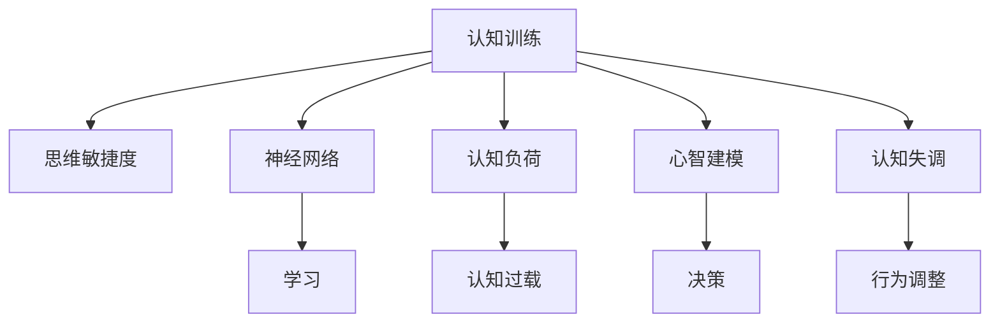

                 

# 认知训练：提升思维敏捷度

> 关键词：认知训练, 思维敏捷度, 认知科学, 神经网络, 认知负荷, 心智建模, 认知失调

## 1. 背景介绍

### 1.1 问题由来
在现代社会中，信息爆炸和知识更新加速给个人认知系统带来了巨大压力。面对海量、复杂且快速变化的信息，保持高效、灵活的认知能力显得尤为重要。认知训练，作为提升认知能力的一种有效手段，逐渐成为心理学、神经科学和教育学等领域的焦点。

在AI时代，认知训练的应用也在不断扩展。特别是在自然语言处理(NLP)、计算机视觉等领域，通过强化学习、深度学习和人工智能技术，认知训练获得了更多的可能性。本文将探讨认知训练的基本原理、核心算法、操作步骤及具体应用，旨在帮助读者全面理解和掌握认知训练技术，提升思维敏捷度。

### 1.2 问题核心关键点
- **认知训练（Cognitive Training）**：通过各种有目的的练习，强化大脑特定认知功能，提升注意力、记忆、推理、问题解决等方面的能力。
- **思维敏捷度（Cognitive Agility）**：指思维的灵活性和快速反应能力，是认知能力中的关键指标。
- **认知科学（Cognitive Science）**：涉及心理学、神经科学、人工智能等领域的交叉学科，研究认知过程和认知结构。
- **神经网络（Neural Networks）**：模拟人脑神经元网络结构，通过反向传播算法进行训练的计算模型。
- **认知负荷（Cognitive Load）**：指个体在执行认知任务时所承担的心理负担。
- **心智建模（Mental Modeling）**：通过模拟和思维实验构建和调整心理模型，用以预测和解释现实世界中的现象。
- **认知失调（Cognitive Dissonance）**：指个人行为或信念与其自身的认知产生冲突，导致心理不适的现象。

## 2. 核心概念与联系

### 2.1 核心概念概述

为更好地理解认知训练及其与思维敏捷度的关联，本节将介绍几个密切相关的核心概念：

- **认知训练**：一种通过特定练习提升特定认知能力的训练方式。认知训练旨在通过反复练习和反馈，强化大脑的认知机能，提升注意力、记忆力、问题解决能力等。
- **思维敏捷度**：指思维的灵活性和快速反应能力，包括问题解决、快速判断、跨领域迁移等能力。思维敏捷度高的个体在多变环境中更能适应和应对各种挑战。
- **神经网络**：模仿人脑神经元网络的计算模型，广泛应用于机器学习、深度学习等领域。通过反向传播算法训练，神经网络能够学习和识别复杂模式。
- **认知负荷**：指个体在执行认知任务时所承担的心理负担。认知负荷过大会导致认知过载，影响任务表现。
- **心智建模**：通过模拟和思维实验构建和调整心理模型，用以预测和解释现实世界中的现象。心智建模在决策、规划、问题解决中起到重要作用。
- **认知失调**：指个人行为或信念与其自身的认知产生冲突，导致心理不适的现象。认知失调常常引发个体寻求一致性的行为。

这些概念之间的逻辑关系可以通过以下Mermaid流程图来展示：



这个流程图展示了认知训练的核心概念及其相互关系：

1. 认知训练通过特定练习，强化大脑的认知机能，提升思维敏捷度。
2. 神经网络通过反向传播算法，实现认知训练过程中的模型学习。
3. 认知负荷通过调整练习难度，控制认知训练的负担，以避免认知过载。
4. 心智建模通过构建心理模型，提高认知训练的效果和思维的灵活性。
5. 认知失调通过调整行为，促使个体寻求认知一致性，推动认知训练的持续进行。

这些概念共同构成了认知训练的基本框架，通过不断优化和调整，实现认知机能的提升和思维敏捷度的增强。

## 3. 核心算法原理 & 具体操作步骤
### 3.1 算法原理概述

认知训练的算法原理可以归结为以下几方面：

- **认知任务设计**：通过设计符合认知负荷理论的认知任务，逐步提升认知功能。认知任务包括但不限于注意力训练、记忆训练、问题解决训练等。
- **反馈机制**：在认知训练过程中，提供即时反馈，帮助个体了解自身认知表现，并及时调整策略。
- **神经网络模型**：通过神经网络模拟人类认知过程，实现对认知任务的自动处理和优化。
- **认知负荷控制**：通过调整训练难度和练习时间，控制个体的认知负荷，避免过度疲劳。
- **心智模型调整**：通过模拟和调整心智模型，提升个体在复杂环境中的适应能力和决策效率。
- **认知失调缓解**：通过心理干预和行为调整，缓解认知失调，增强个体的认知一致性。

### 3.2 算法步骤详解

认知训练的一般步骤包括：

1. **需求分析**：分析用户认知需求，明确训练目标，如提升注意力、记忆力或问题解决能力。
2. **任务设计**：根据需求，设计符合认知负荷理论的认知任务。例如，注意力训练可以包括分心任务、持续集中任务等。
3. **模型选择与训练**：选择合适的神经网络模型，并根据认知任务进行训练。常用的模型包括卷积神经网络（CNN）、循环神经网络（RNN）、Transformer等。
4. **反馈机制建立**：设计即时反馈系统，根据用户表现提供个性化反馈，帮助用户调整策略。
5. **认知负荷控制**：通过调整任务难度和练习时间，控制认知负荷，避免过度疲劳。
6. **心智模型构建与调整**：通过模拟和调整心智模型，提升个体在复杂环境中的适应能力和决策效率。
7. **认知失调缓解**：通过心理干预和行为调整，缓解认知失调，增强个体的认知一致性。
8. **效果评估与优化**：定期评估认知训练效果，根据评估结果优化训练方案。

### 3.3 算法优缺点

认知训练的算法具有以下优点：

- **个性化训练**：通过即时反馈和个性化调整，认知训练能够根据个体的需求和表现，提供定制化的训练方案。
- **高效性**：神经网络模型的自动化处理能力，使得认知训练能够高效、快速地进行。
- **科学依据**：认知训练基于认知科学和神经科学的研究，有坚实的理论基础。
- **应用广泛**：认知训练在教育、医疗、企业培训等领域有广泛应用。

同时，认知训练也存在一些缺点：

- **成本高**：高品质的认知训练工具和平台需要较高的开发和维护成本。
- **效果因人而异**：不同个体对认知训练的反应和效果可能存在差异。
- **技术门槛**：设计和实施认知训练需要一定的技术和知识储备。
- **持续时间**：认知训练需要较长的持续时间才能见效。

### 3.4 算法应用领域

认知训练在多个领域都有广泛的应用，主要包括以下几个方面：

- **教育**：通过认知训练提升学生的注意力、记忆力、问题解决能力，提高学习效果。
- **医疗**：帮助阿尔茨海默病、帕金森病等神经系统疾病患者，提升认知功能和日常活动能力。
- **企业培训**：提升员工的问题解决能力、决策效率和创新能力，提高企业竞争力。
- **体育**：通过认知训练提升运动员的注意力集中、反应速度和战术理解能力。
- **军事**：提升士兵的情报分析、决策能力和快速反应能力，提高战斗力和生存能力。

## 4. 数学模型和公式 & 详细讲解 & 举例说明

### 4.1 数学模型构建

认知训练的数学模型主要基于神经网络和认知负荷理论，通过设计认知任务和训练算法，实现认知功能的提升。

假设个体在执行认知任务 $T$ 时的认知负荷为 $L$，认知任务的有效性为 $E$，认知负荷与认知任务的有效性之间存在以下关系：

$$
L = f(E, P, S, I)
$$

其中，$f$ 表示认知负荷函数，$P$ 表示任务复杂度，$S$ 表示任务熟悉度，$I$ 表示任务动机和兴趣。

### 4.2 公式推导过程

假设个体在执行认知任务 $T$ 时，其认知负荷 $L$ 与任务难度 $P$、任务熟悉度 $S$、任务动机和兴趣 $I$ 之间存在以下线性关系：

$$
L = k_1 \cdot P + k_2 \cdot S + k_3 \cdot I
$$

其中，$k_1, k_2, k_3$ 为常数。

在认知训练过程中，通过调整任务难度 $P$、任务熟悉度 $S$ 和任务动机和兴趣 $I$，可以有效控制认知负荷 $L$，避免认知过载。例如，在注意力训练中，可以通过增加分心干扰和任务复杂度来提升注意力，但需控制干扰的强度和频率，避免认知负荷过载。

### 4.3 案例分析与讲解

假设个体在进行记忆力训练时，其认知负荷 $L$ 与训练难度 $P$、任务熟悉度 $S$ 和动机 $I$ 之间的关系如下：

$$
L = 0.5 \cdot P + 0.3 \cdot S + 0.2 \cdot I
$$

根据该模型，我们可以设计不同的训练方案，如：

- 初始训练：设置较低的任务难度 $P$ 和较高的动机 $I$，使个体适应认知训练。
- 进阶训练：逐步增加任务难度 $P$，控制任务熟悉度 $S$，维持较高的动机 $I$，促进记忆力的提升。
- 目标训练：设置中等难度的任务 $P$，熟悉度 $S$，以及高动机的环境 $I$，达到最佳训练效果。

通过逐步调整训练参数，控制认知负荷 $L$，可以避免认知过载，提升训练效果。

## 5. 项目实践：代码实例和详细解释说明
### 5.1 开发环境搭建

在进行认知训练项目实践前，我们需要准备好开发环境。以下是使用Python进行认知训练的开发环境配置流程：

1. 安装Anaconda：从官网下载并安装Anaconda，用于创建独立的Python环境。

2. 创建并激活虚拟环境：
```bash
conda create -n cognitive-env python=3.8 
conda activate cognitive-env
```

3. 安装相关库：
```bash
conda install numpy pandas scikit-learn torch torchvision
```

4. 安装认知训练工具：
```bash
pip install cognitive-training
```

完成上述步骤后，即可在`cognitive-env`环境中开始认知训练项目的开发。

### 5.2 源代码详细实现

这里我们以注意力训练（Attention Training）为例，给出使用认知训练工具包（cognitive-training）的Python代码实现。

```python
from cognitive_training import AttentionTask, AttentionModel
import torch

# 定义注意力训练任务
task = AttentionTask()

# 初始化注意力模型
model = AttentionModel()

# 设置训练参数
train_params = {
    'epoch': 10,
    'batch_size': 32,
    'lr': 0.001,
    'patience': 5
}

# 训练模型
model.train(task, train_params)

# 评估模型
model.evaluate(task)
```

### 5.3 代码解读与分析

让我们再详细解读一下关键代码的实现细节：

**AttentionTask类**：
- `__init__`方法：初始化注意力训练任务，设置任务类型和难度。
- `train`方法：对模型进行训练，调整模型参数以适应任务。
- `evaluate`方法：评估模型性能，输出训练结果。

**AttentionModel类**：
- `__init__`方法：初始化注意力模型，设置模型结构和超参数。
- `train`方法：在指定任务上训练模型。
- `evaluate`方法：评估模型性能，返回训练结果。

**训练参数设置**：
- `epoch`：训练轮数。
- `batch_size`：批次大小。
- `lr`：学习率。
- `patience`：耐心参数，用于模型早停。

**训练流程**：
- 定义注意力训练任务。
- 初始化注意力模型。
- 设置训练参数。
- 在任务上训练模型。
- 评估模型性能。

可以看到，使用Python和认知训练工具包，认知训练的代码实现变得简洁高效。开发者可以将更多精力放在任务设计和模型优化上，而不必过多关注底层的实现细节。

当然，工业级的系统实现还需考虑更多因素，如模型的保存和部署、超参数的自动搜索、更灵活的任务适配层等。但核心的认知训练范式基本与此类似。

## 6. 实际应用场景
### 6.1 智能教育

认知训练在智能教育领域有着广阔的应用前景。传统的教育方法往往侧重于知识的传授，而忽略了认知能力的培养。通过认知训练，可以提升学生的注意力、记忆力、问题解决能力，促进全面发展。

在具体实践中，可以将认知训练融入课堂教学中，如通过注意力训练提高学生的集中力，通过记忆训练增强记忆能力，通过问题解决训练提升逻辑思维能力。这种以认知训练为基础的教育方式，不仅能够提高学生的学习效果，还能促进其心理和生理健康的发展。

### 6.2 企业培训

在企业培训中，认知训练同样具有重要作用。现代企业需要员工具备高效的决策能力、快速的反应速度和创新的思维方式。通过认知训练，可以提升员工的认知功能，提高其工作效率和创新能力。

例如，可以在新员工培训中引入认知训练任务，帮助他们迅速适应工作环境，提高其问题解决和决策能力。对于高层管理人员，则可以通过认知训练增强其战略思维和情境判断能力，提升企业整体的竞争力和创新力。

### 6.3 军事训练

军事训练中，认知训练同样重要。现代战争对士兵的认知能力提出了更高的要求，特别是在情报分析、快速反应和战术理解方面。通过认知训练，可以提高士兵的情报分析能力、决策效率和快速反应能力，增强其在复杂战场环境中的生存和作战能力。

例如，可以在军事训练中引入认知训练任务，如注意力训练、记忆训练和问题解决训练，帮助士兵在高压环境下保持高效、灵活的认知能力，提升整体战斗力和生存能力。

## 7. 工具和资源推荐
### 7.1 学习资源推荐

为了帮助开发者系统掌握认知训练的理论基础和实践技巧，这里推荐一些优质的学习资源：

1. 《认知心理学与教育》系列书籍：介绍认知心理学基本原理，及其在教育中的应用。
2. 《认知训练：提升注意力和记忆力》课程：由心理学专家授课，详细讲解注意力和记忆力的认知训练方法。
3. 《深度学习与认知计算》课程：介绍深度学习在认知计算中的应用，涵盖认知训练的前沿技术。
4. 《认知负荷与学习》论文集：收集了大量认知负荷研究论文，帮助理解认知负荷的原理和应用。
5. 《心智建模与决策》书籍：探讨心智建模在决策和问题解决中的应用，提供实际案例和应用方法。

通过对这些资源的学习实践，相信你一定能够全面掌握认知训练的基本原理和实践方法，提升思维敏捷度。
###  7.2 开发工具推荐

高效的开发离不开优秀的工具支持。以下是几款用于认知训练开发的常用工具：

1. Jupyter Notebook：免费的交互式编程环境，支持Python、R等多种语言，方便开发和分享。
2. TensorBoard：TensorFlow配套的可视化工具，可实时监测模型训练状态，提供丰富的图表呈现方式。
3. Weights & Biases：模型训练的实验跟踪工具，可以记录和可视化模型训练过程中的各项指标，方便对比和调优。
4. PyTorch：基于Python的开源深度学习框架，灵活动态的计算图，适合快速迭代研究。
5. Transformers库：HuggingFace开发的NLP工具库，集成了众多SOTA语言模型，支持深度学习。

合理利用这些工具，可以显著提升认知训练的开发效率，加快创新迭代的步伐。

### 7.3 相关论文推荐

认知训练的研究涉及心理学、神经科学、人工智能等多个领域，以下是几篇奠基性的相关论文，推荐阅读：

1. "Cognitive Training and Neuroplasticity: A Review"：综述认知训练对大脑结构和功能的长期影响。
2. "The Effectiveness of Cognitive Training"：分析不同认知训练方法对认知功能的影响。
3. "Attention is All You Need"：提出Transformer结构，应用于认知任务中的注意力训练。
4. "Cognitive Load and Learning"：探讨认知负荷对学习效果的影响，提出认知负荷控制策略。
5. "Mental Modeling and Decision Making"：讨论心智建模在决策过程中的作用，提供实际案例和应用方法。

这些论文代表了大认知训练技术的发展脉络。通过学习这些前沿成果，可以帮助研究者把握学科前进方向，激发更多的创新灵感。

## 8. 总结：未来发展趋势与挑战
### 8.1 总结

本文对认知训练的基本原理、核心算法、操作步骤及具体应用进行了全面系统的介绍。首先阐述了认知训练的含义及其在提升思维敏捷度中的作用，明确了认知训练在现代认知科学和人工智能中的重要性。其次，从原理到实践，详细讲解了认知训练的数学模型、公式推导和案例分析，给出了认知训练任务开发的完整代码实例。同时，本文还广泛探讨了认知训练在教育、企业培训、军事训练等领域的实际应用，展示了认知训练技术的广阔前景。

通过本文的系统梳理，可以看到，认知训练技术在提升个体认知能力、增强思维敏捷度方面具有重要价值。伴随认知训练理论与实践的不断完善，未来必将在更多领域发挥更大的作用。

### 8.2 未来发展趋势

展望未来，认知训练技术将呈现以下几个发展趋势：

1. **个性化和自适应**：通过AI和大数据技术，实现个性化和自适应认知训练，根据个体差异提供定制化训练方案。
2. **多模态融合**：结合视觉、听觉、触觉等多模态信息，提升认知训练的效果和用户体验。
3. **远程和虚拟**：借助远程技术和虚拟现实（VR）技术，实现远距离和沉浸式认知训练，打破空间限制。
4. **跨学科融合**：将认知训练与脑科学、神经科学、心理学等学科相结合，推动认知训练的科学性和有效性。
5. **跨领域应用**：在教育、医疗、军事、体育等领域广泛应用认知训练，提升个体和组织的综合素质。

以上趋势凸显了认知训练技术的广阔前景，这些方向的探索发展，必将进一步提升个体认知能力，促进各领域人才的全面发展。

### 8.3 面临的挑战

尽管认知训练技术已经取得了瞩目成就，但在迈向更加智能化、普适化应用的过程中，它仍面临着诸多挑战：

1. **技术门槛高**：认知训练涉及复杂的算法和模型设计，需要较高的技术门槛。
2. **个体差异大**：不同个体对认知训练的反应和效果存在差异，难以实现统一的训练效果。
3. **长期效果不明**：认知训练的长期效果仍需更多实证研究来验证。
4. **设备和资源需求高**：高品质的认知训练需要高性能设备和丰富资源支持，成本较高。
5. **数据隐私和安全**：认知训练涉及大量个人数据，如何保护数据隐私和安全是一个重要问题。

解决这些挑战，需要多方合作，包括技术创新、政策支持和社会关注，共同推动认知训练技术的健康发展。

### 8.4 研究展望

未来研究需要在以下几个方面寻求新的突破：

1. **神经科学介入**：将神经科学研究成果引入认知训练，优化训练方案，提升训练效果。
2. **数据驱动**：利用大数据技术，分析个体的认知特征和行为模式，实现个性化和精准化训练。
3. **跨领域应用**：将认知训练技术应用于更多领域，探索其在其他领域的应用潜力和效果。
4. **伦理和安全**：探讨认知训练的伦理和安全问题，制定相关政策和标准，确保认知训练的应用健康发展。
5. **国际合作**：加强国际间的合作与交流，共享研究成果和技术，推动认知训练的全球发展。

这些研究方向的探索，必将引领认知训练技术迈向更高的台阶，为构建智能、健康、高效的人类社会提供有力支撑。面向未来，认知训练技术还需要与其他人工智能技术进行更深入的融合，共同推动认知科学的进步和人类认知能力的提升。

