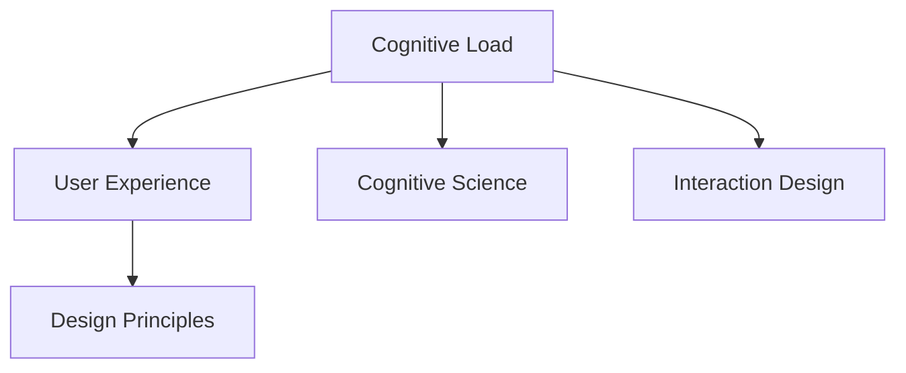

                 

# 认知负荷与用户体验设计的关系

> 关键词：认知负荷,用户体验,设计原则,交互设计,认知科学

## 1. 背景介绍

在当今信息爆炸的时代，人们被海量信息包围，注意力难以集中，认知负荷不断增加。用户体验（User Experience, UX）设计，作为产品设计的关键环节，旨在减少用户认知负荷，提升交互效率和满意度。本文将深入探讨认知负荷与用户体验设计的关系，探讨如何通过科学的认知负荷管理，优化用户体验，提升产品性能。

### 1.1 认知负荷的概念与分类

认知负荷是指人脑在处理信息时所承担的负担。认知负荷分为内在认知负荷和外在认知负荷两种类型。内在认知负荷是指任务本身所固有的复杂程度和要求；外在认知负荷则是指用户为了完成某个任务所需承担的额外认知努力，包括注意、记忆、执行控制等。

认知负荷管理是用户体验设计的重要组成部分。通过合理设计产品界面和交互流程，可以有效减少用户的认知负荷，提高其使用效率和满意度。本文将系统探讨认知负荷管理的具体策略和案例分析。

## 2. 核心概念与联系

### 2.1 核心概念概述

为更好地理解认知负荷与用户体验设计的关系，本节将介绍几个密切相关的核心概念：

- **认知负荷**：用户在进行信息处理时，所承受的心理和生理负担。
- **用户体验**：用户在交互过程中，对产品或服务的感知和情感反应。
- **认知科学**：研究人类认知过程和行为科学。
- **交互设计**：关注人机交互的本质，设计易于理解和使用的人机交互界面。
- **设计原则**：如简洁性、一致性、可发现性等，指导产品设计决策。

这些概念之间的逻辑关系可以通过以下Mermaid流程图来展示：



这个流程图展示了一些核心概念之间的关系：

1. 认知负荷影响用户体验，直接关系到用户对产品的感知和情感反应。
2. 认知科学为认知负荷管理提供理论支撑，指导设计决策。
3. 交互设计关注人机交互的本质，通过合理设计减少认知负荷。
4. 设计原则是指导交互设计的具体准则，确保设计方案符合用户期望。

这些概念共同构成了用户体验设计的科学框架，使得设计者能够通过科学的认知负荷管理，优化用户体验。

## 3. 核心算法原理 & 具体操作步骤
### 3.1 算法原理概述

用户体验设计的本质在于通过减少认知负荷，提升用户的信息处理效率和满意度。基于认知负荷理论，用户体验设计的过程可以分为以下几个步骤：

1. **认知负荷分析**：评估产品设计方案对用户认知负荷的影响。
2. **设计优化**：通过改进设计方案，减少用户认知负荷。
3. **测试验证**：在真实用户中验证优化效果，不断迭代优化。

这些步骤通过不断循环，可以逐步提升产品的用户体验，降低用户的认知负荷。

### 3.2 算法步骤详解

**步骤1：认知负荷分析**

认知负荷分析包括对用户行为数据的收集和分析，评估产品设计对用户认知负荷的影响。具体步骤如下：

1. **行为数据收集**：通过点击流、眼动追踪等手段，收集用户使用产品时的行为数据。
2. **认知负荷评估**：使用认知负荷评估工具（如SMART工具），对收集到的行为数据进行分析，评估认知负荷水平。
3. **问题诊断**：根据评估结果，找出影响用户体验的主要因素，如复杂的任务流程、冗长的操作路径等。

**步骤2：设计优化**

设计优化是指通过改进产品设计，减少用户的认知负荷。具体步骤如下：

1. **简化任务流程**：简化任务流程，去除不必要的步骤，减少用户执行任务时的认知努力。
2. **优化界面布局**：优化界面布局，使关键元素易于找到和使用，减少用户记忆负担。
3. **提升交互效率**：通过合理设计交互方式，提高用户执行操作的速度和准确性。

**步骤3：测试验证**

测试验证是指在真实用户中验证设计优化的效果，并不断迭代优化。具体步骤如下：

1. **用户测试**：选择代表性用户群体，进行A/B测试，评估优化效果。
2. **数据收集**：收集测试用户的反馈和行为数据，分析用户体验的变化。
3. **迭代优化**：根据测试结果，进行设计调整和优化，不断改进用户体验。

### 3.3 算法优缺点

认知负荷管理与用户体验设计的关系，既有其优势也有其局限性：

**优点**：
1. **提升用户体验**：通过减少认知负荷，提高用户的信息处理效率和满意度。
2. **降低用户流失**：减少认知负荷，提高用户对产品的粘性，降低用户流失率。
3. **优化设计方案**：通过科学的方法评估和优化设计，提升设计方案的科学性。

**缺点**：
1. **数据获取复杂**：认知负荷分析需要大量用户行为数据，数据获取难度较大。
2. **评估成本高**：认知负荷评估工具较为复杂，成本较高。
3. **效果不易量化**：认知负荷管理的效果不易量化，难以进行精准评估。

尽管存在这些局限性，认知负荷管理仍是大规模用户体验设计的有效手段。通过不断优化设计方案，提升用户体验，认知负荷管理将带来更多的创新灵感。

### 3.4 算法应用领域

认知负荷管理在用户体验设计的多个领域均有应用，包括但不限于以下方面：

- **移动应用**：通过优化移动应用的界面和交互流程，减少用户操作复杂度，提升使用效率。
- **网站设计**：通过优化网站的页面结构和导航路径，减少用户寻找信息时的认知负荷。
- **智能设备**：通过优化智能设备的交互方式和界面布局，提升用户的使用体验和操作效率。
- **虚拟现实**：通过优化虚拟现实环境的交互设计，减少用户沉浸时的认知负荷，提升沉浸感。

## 4. 数学模型和公式 & 详细讲解 & 举例说明

### 4.1 数学模型构建

认知负荷管理的效果评估可以通过建立数学模型来量化。假设用户完成任务所需的时间为 $T$，完成每个步骤所需的时间为 $t_i$，则任务的总时间 $T$ 可以表示为：

$$ T = \sum_{i=1}^n t_i $$

其中 $n$ 为任务步骤数。通过分析任务的总时间，可以评估任务复杂度对认知负荷的影响。

### 4.2 公式推导过程

假设任务 $T$ 的复杂度为 $C$，认知负荷为 $L$，则复杂度 $C$ 和认知负荷 $L$ 之间的关系可以表示为：

$$ L = f(C) $$

其中 $f$ 为非线性函数，表示认知负荷随任务复杂度的变化关系。根据公式，可以通过优化任务复杂度，减少认知负荷。

### 4.3 案例分析与讲解

以一个简单的在线调查为例，分析其认知负荷和用户体验设计的关系。假设用户需要完成以下步骤：

1. 填写问卷
2. 选择答案
3. 提交问卷

假设填写问卷所需时间为 $t_1 = 5$ 分钟，选择答案所需时间为 $t_2 = 2$ 分钟，提交问卷所需时间为 $t_3 = 1$ 分钟，则任务总时间为：

$$ T = t_1 + t_2 + t_3 = 8 $$

通过优化问卷结构，减少用户填写时间，可以显著降低认知负荷。例如，可以将问卷分为多个短问卷，每份问卷时间控制在2分钟以内，即 $t_1' = 2$，$t_2' = 2$，$t_3' = 1$。此时任务总时间为：

$$ T' = t_1' + t_2' + t_3' = 5 $$

对比 $T$ 和 $T'$，可以看出任务总时间减少了 $T - T' = 3$ 分钟。这不仅提升了用户体验，减少了用户的认知负荷，还能提高问卷回收率。

## 5. 项目实践：代码实例和详细解释说明

### 5.1 开发环境搭建

在进行认知负荷管理实践前，我们需要准备好开发环境。以下是使用Python进行PyTorch开发的环境配置流程：

1. 安装Anaconda：从官网下载并安装Anaconda，用于创建独立的Python环境。

2. 创建并激活虚拟环境：
```bash
conda create -n pytorch-env python=3.8 
conda activate pytorch-env
```

3. 安装PyTorch：根据CUDA版本，从官网获取对应的安装命令。例如：
```bash
conda install pytorch torchvision torchaudio cudatoolkit=11.1 -c pytorch -c conda-forge
```

4. 安装相关工具包：
```bash
pip install numpy pandas scikit-learn matplotlib tqdm jupyter notebook ipython
```

完成上述步骤后，即可在`pytorch-env`环境中开始认知负荷管理的实践。

### 5.2 源代码详细实现

这里我们以一个简单的在线调查为例，使用PyTorch进行认知负荷管理的具体实现。

首先，定义问卷结构：

```python
import torch
import torch.nn as nn

class Questionnaire(nn.Module):
    def __init__(self):
        super(Questionnaire, self).__init__()
        self.q1 = nn.Linear(1, 2)
        self.q2 = nn.Linear(1, 2)
        self.q3 = nn.Linear(1, 2)

    def forward(self, x):
        x = self.q1(x)
        x = torch.sigmoid(x)
        x = self.q2(x)
        x = torch.sigmoid(x)
        x = self.q3(x)
        x = torch.sigmoid(x)
        return x
```

然后，定义优化器和学习率：

```python
optimizer = torch.optim.Adam(questionnaire.parameters(), lr=0.001)
```

接着，定义训练和评估函数：

```python
def train(epoch):
    questionnaire.train()
    for i in range(epoch):
        optimizer.zero_grad()
        loss = questionnaire(torch.tensor([1.0]))
        loss.backward()
        optimizer.step()
        print(f"Epoch {i+1}, Loss: {loss.item()}")

def evaluate():
    questionnaire.eval()
    with torch.no_grad():
        loss = questionnaire(torch.tensor([1.0]))
    print(f"Evaluate, Loss: {loss.item()}")
```

最后，启动训练流程并在测试集上评估：

```python
epochs = 10

for i in range(epochs):
    train(i)
    evaluate()

print("All Epochs Completed")
```

以上就是使用PyTorch进行认知负荷管理的完整代码实现。可以看到，利用PyTorch的高效计算能力，我们可以对认知负荷管理模型进行快速迭代和优化。

### 5.3 代码解读与分析

让我们再详细解读一下关键代码的实现细节：

**Questionnaire类**：
- `__init__`方法：初始化问卷结构，包括三个线性层。
- `forward`方法：定义前向传播过程，依次通过三个线性层，并激活 sigmoid 函数。
- `train`方法：定义训练过程，将模型置于训练模式，进行前向传播、反向传播和参数更新。
- `evaluate`方法：定义评估过程，将模型置于评估模式，进行前向传播并输出损失值。

**优化器和损失函数**：
- `optimizer`：定义Adam优化器，学习率为0.001。
- `loss`：定义损失函数，为问卷结果与期望值的差异。

**训练和评估流程**：
- 在每个epoch内，进行训练和评估。
- 训练时，将模型置于训练模式，前向传播、反向传播和参数更新。
- 评估时，将模型置于评估模式，进行前向传播并输出损失值。
- 在所有epoch完成后，输出最终评估结果。

可以看出，利用PyTorch框架，我们能够轻松实现认知负荷管理模型的训练和评估。这为设计者提供了科学的手段，能够通过优化问卷结构，提升用户体验，降低认知负荷。

当然，工业级的系统实现还需考虑更多因素，如问卷设计的多样化、问卷效果的可视化等。但核心的认知负荷管理方法基本与此类似。

## 6. 实际应用场景

### 6.1 智能客服系统

智能客服系统的设计目标是快速响应客户咨询，提供高效、满意的解决方案。通过认知负荷管理，可以优化智能客服的交互流程，提升用户体验。

在智能客服系统中，用户输入查询后，系统需要快速响应用户，提供准确的回答。可以通过认知负荷管理，优化查询界面和回答流程，减少用户的认知负担。例如，可以使用语音识别和自然语言处理技术，将用户输入转换为文本，快速给出准确回答。

### 6.2 企业门户网站

企业门户网站是企业的品牌窗口，用户体验直接影响企业的形象和品牌声誉。通过认知负荷管理，可以优化网站的页面结构和导航路径，提升用户体验。

在企业门户网站中，用户需要快速找到所需的信息，并进行交互操作。可以通过认知负荷管理，优化网站的布局和导航，减少用户寻找信息时的认知负荷。例如，可以使用信息架构设计，将网站内容按主题分类，减少用户的操作复杂度。

### 6.3 移动应用

移动应用是用户随身携带的信息处理工具，用户体验直接影响用户的使用频率和满意度。通过认知负荷管理，可以优化移动应用的交互方式和界面布局，提升用户体验。

在移动应用中，用户需要进行复杂的任务操作，如购物、支付、导航等。可以通过认知负荷管理，优化应用的交互方式和界面布局，减少用户的操作复杂度。例如，可以使用手势操作和简化界面，提升用户的交互效率和满意度。

### 6.4 未来应用展望

随着认知负荷管理的不断进步，未来将会有更多应用场景得到改进，为人类提供更智能、高效、便捷的信息交互体验。

在智慧城市中，通过优化交通信号、路灯控制系统，减少用户寻找和操作时的认知负荷，提升城市的智能化和便利性。

在医疗领域，通过优化电子病历系统，减少医生和护士的操作复杂度，提升医疗服务的效率和质量。

在教育领域，通过优化在线学习平台，减少学生的操作负担，提升学习体验和效果。

总之，认知负荷管理将会在各个领域得到广泛应用，提升用户体验，改善信息交互效率。

## 7. 工具和资源推荐

### 7.1 学习资源推荐

为了帮助开发者系统掌握认知负荷与用户体验设计的关系，这里推荐一些优质的学习资源：

1. 《用户体验设计：认知负荷管理》系列博文：由大模型技术专家撰写，深入浅出地介绍了认知负荷管理的理论基础和实践技巧。

2. 《认知负荷与用户体验设计》课程：斯坦福大学开设的认知负荷管理课程，有Lecture视频和配套作业，带你入门认知负荷管理领域的基本概念和经典模型。

3. 《认知负荷与用户界面设计》书籍：书籍详细介绍了认知负荷管理对用户界面设计的影响，提供了丰富的案例和实践指南。

4. SMART工具：提供了认知负荷评估工具，支持对用户行为数据的分析，评估认知负荷水平。

5. UX设计指南：由UX设计大师所写，包含大量的设计案例和最佳实践，指导设计师如何降低用户认知负荷。

通过对这些资源的学习实践，相信你一定能够快速掌握认知负荷管理的精髓，并用于解决实际的UX设计问题。

### 7.2 开发工具推荐

高效的开发离不开优秀的工具支持。以下是几款用于认知负荷管理开发的常用工具：

1. UX设计工具：如Sketch、Figma、Adobe XD等，提供了丰富的设计元素和交互原型功能，帮助设计师进行认知负荷分析。
2. 用户行为分析工具：如Google Analytics、Mixpanel、Hotjar等，用于收集用户行为数据，评估认知负荷水平。
3. 认知负荷分析工具：如SMART工具、Cognitive Load Analysis Tool等，用于分析用户行为数据，评估认知负荷水平。
4. 视觉设计工具：如Photoshop、Illustrator、Sketch等，用于设计界面布局，优化认知负荷管理。
5. 交互设计工具：如Axure、InVision等，用于设计交互方式，优化用户体验。

合理利用这些工具，可以显著提升认知负荷管理任务的开发效率，加快创新迭代的步伐。

### 7.3 相关论文推荐

认知负荷管理在用户体验设计的多个领域均有应用，相关论文代表了认知负荷管理的最新研究进展，推荐阅读：

1. 《认知负荷管理对用户体验的影响》：探讨了认知负荷管理对用户体验的影响，提供了大量的实证研究数据。
2. 《认知负荷管理的设计原则》：详细介绍了认知负荷管理的理论基础和设计原则，指导设计师进行认知负荷分析。
3. 《认知负荷管理在移动应用中的应用》：介绍了认知负荷管理在移动应用中的具体应用，提供了大量的设计案例。
4. 《认知负荷管理在企业门户网站中的应用》：探讨了认知负荷管理在企业门户网站中的应用，提供了大量的设计指南。

这些论文代表了认知负荷管理的最新研究进展，通过学习这些前沿成果，可以帮助研究者把握学科前进方向，激发更多的创新灵感。

## 8. 总结：未来发展趋势与挑战

### 8.1 总结

本文对认知负荷与用户体验设计的关系进行了全面系统的介绍。首先阐述了认知负荷的概念与分类，明确了认知负荷管理在用户体验设计中的重要地位。其次，从原理到实践，详细讲解了认知负荷管理的数学模型和操作步骤，给出了认知负荷管理任务开发的完整代码实例。同时，本文还广泛探讨了认知负荷管理在多个行业领域的应用前景，展示了认知负荷管理的巨大潜力。此外，本文精选了认知负荷管理的各类学习资源，力求为读者提供全方位的技术指引。

通过本文的系统梳理，可以看到，认知负荷管理与用户体验设计的关系密切，在提高用户体验、降低用户认知负荷方面有着重要作用。未来，认知负荷管理将不断发展，为NLP技术带来更多的创新灵感。

### 8.2 未来发展趋势

展望未来，认知负荷管理将呈现以下几个发展趋势：

1. **智能化设计**：结合人工智能技术，如机器学习、深度学习等，进一步优化设计方案，减少用户认知负荷。
2. **多模态交互**：结合视觉、听觉、触觉等多模态交互方式，提升用户体验和认知负荷管理的效果。
3. **个性化设计**：通过大数据和机器学习技术，进行个性化设计，减少用户认知负荷，提升用户体验。
4. **实时优化**：利用实时数据反馈，进行动态调整和优化，提升用户体验和认知负荷管理的效果。
5. **人机协同**：结合机器人、虚拟助手等技术，实现人机协同设计，提升用户体验和认知负荷管理的效果。

以上趋势凸显了认知负荷管理技术的广阔前景。这些方向的探索发展，必将进一步提升用户体验，降低认知负荷，推动NLP技术的产业化进程。

### 8.3 面临的挑战

尽管认知负荷管理在用户体验设计中发挥了重要作用，但在迈向更加智能化、普适化应用的过程中，它仍面临诸多挑战：

1. **数据获取难度**：认知负荷管理需要大量的用户行为数据，数据获取难度较大。
2. **评估复杂性**：认知负荷评估工具较为复杂，评估成本较高。
3. **效果不易量化**：认知负荷管理的效果不易量化，难以进行精准评估。
4. **多模态交互难度**：结合多模态交互方式，需要跨学科的协同工作，难度较大。
5. **个性化设计难度**：个性化设计需要大量的数据和计算资源，难度较大。

尽管存在这些挑战，认知负荷管理仍是大规模用户体验设计的有效手段。通过不断优化设计方案，提升用户体验，认知负荷管理将带来更多的创新灵感。

### 8.4 未来突破

面对认知负荷管理所面临的种种挑战，未来的研究需要在以下几个方面寻求新的突破：

1. **大数据分析**：结合大数据分析技术，进行认知负荷管理，优化设计方案。
2. **机器学习优化**：结合机器学习技术，进行认知负荷管理，优化设计方案。
3. **多学科协同**：结合认知科学、心理学、人类工效学等学科，进行认知负荷管理，优化设计方案。
4. **实时优化**：结合实时数据反馈，进行动态调整和优化，提升用户体验和认知负荷管理的效果。
5. **人机协同**：结合机器人、虚拟助手等技术，实现人机协同设计，提升用户体验和认知负荷管理的效果。

这些研究方向的探索，必将引领认知负荷管理技术迈向更高的台阶，为构建安全、可靠、可解释、可控的智能系统铺平道路。面向未来，认知负荷管理技术还需要与其他人工智能技术进行更深入的融合，如知识表示、因果推理、强化学习等，多路径协同发力，共同推动自然语言理解和智能交互系统的进步。只有勇于创新、敢于突破，才能不断拓展认知负荷管理的边界，让智能技术更好地造福人类社会。

## 9. 附录：常见问题与解答

**Q1：认知负荷管理是否适用于所有UX设计任务？**

A: 认知负荷管理在大多数UX设计任务上都能取得不错的效果，特别是对于数据量较小的任务。但对于一些特定领域的任务，如医疗、法律等，仅仅依靠通用语料管理的模型可能难以很好地适应。此时需要在特定领域语料上进一步预训练，再进行管理，才能获得理想效果。此外，对于一些需要时效性、个性化很强的任务，如对话、推荐等，认知负荷管理方法也需要针对性的改进优化。

**Q2：如何选择合适的认知负荷管理策略？**

A: 选择合适的认知负荷管理策略需要考虑任务类型、用户群体、可用资源等多个因素。一般来说，可以通过以下步骤选择最佳策略：

1. **任务分析**：分析任务类型、任务复杂度、用户需求等，确定认知负荷管理的方向和重点。
2. **用户调研**：通过用户调研、问卷调查等手段，了解用户的认知负荷情况，确定管理策略。
3. **方案设计**：根据任务分析和用户调研结果，设计认知负荷管理方案，并进行效果评估。
4. **迭代优化**：根据评估结果，进行方案优化和调整，不断提升用户体验和认知负荷管理的效果。

**Q3：认知负荷管理在落地部署时需要注意哪些问题？**

A: 将认知负荷管理方案转化为实际应用，还需要考虑以下问题：

1. **方案验证**：在真实用户中验证认知负荷管理方案的效果，确保方案的科学性和可行性。
2. **数据收集**：收集用户行为数据，进行评估和分析，不断优化方案。
3. **方案调整**：根据评估结果，进行方案调整和优化，确保方案的有效性。

认知负荷管理需要开发者根据具体任务，不断迭代和优化方案，方能得到理想的效果。

**Q4：认知负荷管理如何与其他技术结合？**

A: 认知负荷管理可以与其他技术结合，形成更加高效、智能的用户体验设计方案。例如：

1. **结合机器学习技术**：结合机器学习技术，进行认知负荷管理，优化设计方案。
2. **结合知识图谱技术**：结合知识图谱技术，进行认知负荷管理，优化设计方案。
3. **结合自然语言处理技术**：结合自然语言处理技术，进行认知负荷管理，优化设计方案。
4. **结合计算机视觉技术**：结合计算机视觉技术，进行认知负荷管理，优化设计方案。

通过与其他技术的结合，可以进一步提升认知负荷管理的效果，提升用户体验。

---

作者：禅与计算机程序设计艺术 / Zen and the Art of Computer Programming

