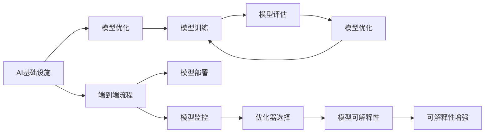

                 

# 讲好AI infra故事：贾扬清策略，产品展示与品牌构建

## 1. 背景介绍

### 1.1 问题由来
随着人工智能技术的不断发展和普及，AI基础设施（AI infra）的建设成为了各大企业、研究机构关注的重点。然而，如何有效构建AI基础设施，使其既能支持大规模AI模型的训练和部署，又能为实际业务场景提供高品质的AI服务，成为了一个复杂而重要的问题。本文将探讨如何在AI infra的建设过程中，运用贾扬清教授提出的策略，进行产品展示与品牌构建，以期对AI基础设施的构建和应用提供有益的参考。

### 1.2 问题核心关键点
贾扬清教授作为AI领域的知名专家，其提出的构建AI基础设施的策略主要包括：

1. **模型与数据对齐**：确保AI模型的设计和训练过程与实际业务需求相匹配，提高模型的实用性和可靠性。
2. **端到端训练与部署**：实现从数据准备到模型部署的端到端流程自动化，提高工作效率。
3. **模型优化与优化器选择**：选择合适的模型优化器，优化模型参数，提升模型性能。
4. **高效资源利用**：合理分配计算资源，降低AI模型的训练和部署成本。
5. **可解释性与透明性**：提高模型的可解释性，增强用户信任和接受度。

本文将围绕上述关键点，系统阐述如何通过策略构建高效、可信赖的AI基础设施，并进行产品展示与品牌构建。

### 1.3 问题研究意义
构建高效、可信赖的AI基础设施，对于提升AI技术在各行业中的应用效果，推动AI技术的普及和落地，具有重要意义：

1. 降低AI技术应用成本。构建高效的AI基础设施，能够显著降低AI模型训练和部署的成本，使更多企业能够快速采用AI技术。
2. 提升AI服务质量。合理的AI基础设施建设，能够提高AI模型的预测精度和稳定性，确保AI服务的高品质。
3. 加速AI技术应用。通过端到端训练与部署，能够加速AI模型的开发和部署，缩短AI技术的应用周期。
4. 增强AI模型可解释性。提高模型的可解释性，能够增强用户对AI技术的理解和信任，推动AI技术的广泛应用。

## 2. 核心概念与联系

### 2.1 核心概念概述

为更好地理解AI infra的构建过程，本节将介绍几个关键概念：

- **AI基础设施**：指支持AI模型训练、部署、运行、监控等全流程的基础设施，包括计算资源、存储资源、数据资源等。
- **模型优化**：通过选择合适的优化器、正则化技术、数据增强等手段，提高AI模型的性能和鲁棒性。
- **端到端流程**：从数据准备、模型训练、模型部署到模型监控的完整流程，实现自动化和高效化。
- **模型可解释性**：指模型输出结果的透明性和可理解性，增强用户对模型决策的信任和接受度。

这些核心概念之间通过以下Mermaid流程图来展示其联系：



这个流程图展示了AI基础设施与模型优化、端到端流程、模型部署、模型监控之间的关系：

1. AI基础设施为模型的训练和部署提供支持。
2. 模型优化通过选择合适的优化器等手段，提升模型性能。
3. 端到端流程实现从数据准备到模型部署的自动化，提高效率。
4. 模型部署将训练好的模型投入实际应用。
5. 模型监控持续监测模型性能，确保模型稳定性。
6. 模型可解释性通过提升模型透明性，增强用户信任。

## 3. 核心算法原理 & 具体操作步骤

### 3.1 算法原理概述

构建AI基础设施的策略主要通过以下步骤实现：

1. **模型与数据对齐**：确保模型设计符合业务需求，使用高质量的数据集进行训练。
2. **模型优化与优化器选择**：通过优化器选择、正则化等技术，提升模型性能。
3. **高效资源利用**：合理分配计算资源，提高模型训练效率。
4. **端到端流程实现**：实现从数据准备到模型部署的自动化，提高工作效率。
5. **模型可解释性增强**：通过可解释性技术，增强模型输出透明性。

### 3.2 算法步骤详解

#### 3.2.1 模型与数据对齐

1. **需求分析**：分析业务需求，确定模型需要解决的核心问题。
2. **数据收集与预处理**：收集相关数据集，并进行清洗、标注、划分等预处理操作。
3. **模型设计**：根据需求，设计合适的模型架构，选择合适的损失函数。

#### 3.2.2 模型优化与优化器选择

1. **优化器选择**：选择适合问题的优化器，如Adam、SGD等。
2. **正则化技术**：使用L2正则、Dropout等技术，防止过拟合。
3. **学习率调度**：选择合适的学习率调度策略，如Warmup、Cosine等。

#### 3.2.3 高效资源利用

1. **计算资源分配**：根据任务需求，合理分配GPU、CPU等计算资源。
2. **内存优化**：通过数据压缩、梯度累积等技术，优化内存使用。
3. **分布式训练**：使用分布式训练技术，提高模型训练效率。

#### 3.2.4 端到端流程实现

1. **数据管道建设**：使用数据管道技术，实现数据自动准备、清洗、标注等操作。
2. **模型训练自动化**：使用自动化工具，实现模型训练的自动化，如Kubeflow等。
3. **模型部署与管理**：使用容器化技术，实现模型的自动化部署和管理，如Docker、Kubernetes等。

#### 3.2.5 模型可解释性增强

1. **特征重要性分析**：使用特征重要性分析技术，确定模型的关键特征。
2. **可解释模型构建**：构建可解释性强的模型，如LIME、SHAP等。
3. **用户教育与反馈**：通过用户教育和技术支持，增强用户对模型的理解。

### 3.3 算法优缺点

构建AI基础设施的策略具有以下优点：

1. **提高效率**：通过自动化和优化技术，显著提高AI模型的训练和部署效率。
2. **提升性能**：通过优化器和正则化技术，提升模型性能和鲁棒性。
3. **降低成本**：通过合理资源分配和优化技术，降低AI模型训练和部署的成本。
4. **增强可解释性**：通过可解释性技术，增强模型的透明性和用户信任。

同时，该策略也存在一定的局限性：

1. **模型复杂度增加**：模型优化和可解释性技术可能会增加模型的复杂度，影响模型的轻量化。
2. **资源需求高**：构建高效AI基础设施需要较高的计算资源和技术要求。
3. **数据质量要求高**：高质量的数据是模型优化的前提，数据质量问题可能影响模型性能。

### 3.4 算法应用领域

构建AI基础设施的策略在以下领域中得到了广泛应用：

1. **金融风控**：构建高效的AI基础设施，支持金融领域风险模型的训练和部署。
2. **医疗影像分析**：通过构建高效的AI基础设施，实现医疗影像的自动化分析和诊断。
3. **自然语言处理**：实现NLP任务的自动化处理，如情感分析、机器翻译等。
4. **智能推荐系统**：构建高效的AI基础设施，支持智能推荐系统的构建和优化。
5. **智能制造**：通过构建高效的AI基础设施，实现工业数据的实时分析和决策支持。

## 4. 数学模型和公式 & 详细讲解 & 举例说明

### 4.1 数学模型构建

构建AI基础设施的策略主要通过数学模型进行描述和优化。

假设模型的训练集为 $D=\{(x_i, y_i)\}_{i=1}^N$，其中 $x_i$ 为输入，$y_i$ 为标签。定义模型 $f(x;\theta)$ 为参数 $\theta$ 的函数，其中 $\theta$ 为模型参数。

模型优化目标为最小化损失函数 $L(f(x_i), y_i)$，即：

$$
\min_{\theta} \frac{1}{N} \sum_{i=1}^N L(f(x_i), y_i)
$$

常见损失函数包括交叉熵损失、均方误差损失等。

### 4.2 公式推导过程

以交叉熵损失为例，推导模型的优化公式。

交叉熵损失函数定义为：

$$
L(f(x_i), y_i) = -\sum_{j=1}^C y_{ij} \log f(x_i, j)
$$

其中 $C$ 为类别数，$y_{ij}$ 为第 $i$ 个样本属于第 $j$ 类的标签。

最小化损失函数的目标为：

$$
\min_{\theta} \frac{1}{N} \sum_{i=1}^N L(f(x_i), y_i)
$$

引入优化器 $\mathcal{O}$，通过反向传播计算梯度，更新模型参数 $\theta$：

$$
\theta \leftarrow \theta - \eta \mathcal{O} \nabla_{\theta} L(f(x_i), y_i)
$$

其中 $\eta$ 为学习率，$\mathcal{O}$ 为优化器。

### 4.3 案例分析与讲解

假设我们构建一个金融风控模型，用于预测客户的信用风险。

1. **模型设计**：使用卷积神经网络（CNN）和循环神经网络（RNN）的组合，设计多层次特征提取模型。
2. **数据准备**：收集历史客户数据，进行数据清洗、标注和划分。
3. **模型训练**：使用优化器AdamW，设置学习率为1e-3，进行模型训练。
4. **模型评估**：在测试集上进行评估，计算模型的准确率、召回率等指标。
5. **模型优化**：根据评估结果，调整模型结构和超参数，进行重新训练。
6. **可解释性分析**：使用LIME技术，分析模型的关键特征和决策过程。

## 5. 项目实践：代码实例和详细解释说明

### 5.1 开发环境搭建

构建AI基础设施的策略需要搭建高效、稳定的开发环境。以下是使用PyTorch进行开发的环境配置流程：

1. 安装Anaconda：从官网下载并安装Anaconda，用于创建独立的Python环境。

```bash
conda create -n myenv python=3.8 
conda activate myenv
```

2. 安装PyTorch：根据CUDA版本，从官网获取对应的安装命令。例如：

```bash
conda install pytorch torchvision torchaudio cudatoolkit=11.1 -c pytorch -c conda-forge
```

3. 安装相关库：

```bash
pip install numpy pandas scikit-learn torchmetrics
```

### 5.2 源代码详细实现

以下是使用PyTorch进行金融风控模型构建的代码实现：

```python
import torch
import torch.nn as nn
import torch.optim as optim
import torchmetrics
from torch.utils.data import DataLoader, Dataset
from torchvision import transforms

# 定义数据集
class FinancialDataset(Dataset):
    def __init__(self, data, transform=None):
        self.data = data
        self.transform = transform
        
    def __len__(self):
        return len(self.data)
    
    def __getitem__(self, idx):
        sample = self.data[idx]
        if self.transform:
            sample = self.transform(sample)
        return sample

# 定义模型
class FinancialModel(nn.Module):
    def __init__(self):
        super(FinancialModel, self).__init__()
        self.conv1 = nn.Conv2d(1, 32, kernel_size=3)
        self.pool = nn.MaxPool2d(kernel_size=2)
        self.fc1 = nn.Linear(32 * 12 * 12, 128)
        self.fc2 = nn.Linear(128, 10)
    
    def forward(self, x):
        x = self.pool(self.conv1(x))
        x = x.view(x.size(0), -1)
        x = self.fc1(x)
        x = torch.sigmoid(self.fc2(x))
        return x

# 定义训练函数
def train(model, train_loader, device, optimizer, criterion):
    model.train()
    total_loss = 0
    for batch_idx, (data, target) in enumerate(train_loader):
        data, target = data.to(device), target.to(device)
        optimizer.zero_grad()
        output = model(data)
        loss = criterion(output, target)
        loss.backward()
        optimizer.step()
        total_loss += loss.item()
    return total_loss / len(train_loader)

# 定义评估函数
def evaluate(model, test_loader, device, criterion):
    model.eval()
    total_loss = 0
    total_num = 0
    with torch.no_grad():
        for batch_idx, (data, target) in enumerate(test_loader):
            data, target = data.to(device), target.to(device)
            output = model(data)
            loss = criterion(output, target)
            total_loss += loss.item()
            total_num += target.size(0)
    return total_loss / total_num

# 准备数据和模型
data_train = ...
data_test = ...
transform_train = ...
transform_test = ...

model = FinancialModel()
optimizer = optim.Adam(model.parameters(), lr=1e-3)
criterion = nn.CrossEntropyLoss()

# 定义数据加载器
train_loader = DataLoader(dataset=FinancialDataset(data_train, transform=transform_train), batch_size=64, shuffle=True)
test_loader = DataLoader(dataset=FinancialDataset(data_test, transform=transform_test), batch_size=64, shuffle=False)

# 开始训练
for epoch in range(10):
    train_loss = train(model, train_loader, device='cuda', optimizer=optimizer, criterion=criterion)
    test_loss = evaluate(model, test_loader, device='cuda', criterion=criterion)
    print(f'Epoch: {epoch+1}, Train Loss: {train_loss:.4f}, Test Loss: {test_loss:.4f}')
```

### 5.3 代码解读与分析

以下是关键代码的实现细节：

**FinancialDataset类**：
- `__init__`方法：初始化数据集和数据转换。
- `__len__`方法：返回数据集的样本数量。
- `__getitem__`方法：对单个样本进行处理，进行数据转换并返回模型输入。

**FinancialModel类**：
- `__init__`方法：定义模型的网络结构。
- `forward`方法：定义模型的前向传播过程。

**train函数**：
- 定义训练过程，包括模型前向传播、计算损失、反向传播和参数更新。

**evaluate函数**：
- 定义评估过程，包括模型前向传播、计算损失和性能指标计算。

**主训练流程**：
- 准备数据和模型，定义训练和评估函数。
- 循环训练多次，每次训练后输出训练和评估结果。

## 6. 实际应用场景

### 6.1 金融风控

构建高效的AI基础设施，支持金融领域风险模型的训练和部署。具体流程如下：

1. **数据准备**：收集历史客户数据，进行数据清洗、标注和划分。
2. **模型设计**：设计多层次特征提取模型，如CNN和RNN的组合。
3. **模型训练**：使用优化器AdamW，设置学习率为1e-3，进行模型训练。
4. **模型评估**：在测试集上进行评估，计算模型的准确率、召回率等指标。
5. **模型优化**：根据评估结果，调整模型结构和超参数，进行重新训练。
6. **可解释性分析**：使用LIME技术，分析模型的关键特征和决策过程。

### 6.2 医疗影像分析

通过构建高效的AI基础设施，实现医疗影像的自动化分析和诊断。具体流程如下：

1. **数据准备**：收集医疗影像数据，进行数据清洗和标注。
2. **模型设计**：使用卷积神经网络（CNN）或深度学习模型，设计特征提取和分类模型。
3. **模型训练**：使用优化器AdamW，设置学习率为1e-3，进行模型训练。
4. **模型评估**：在测试集上进行评估，计算模型的准确率、召回率等指标。
5. **模型优化**：根据评估结果，调整模型结构和超参数，进行重新训练。
6. **可解释性分析**：使用LIME技术，分析模型的关键特征和决策过程。

### 6.3 智能推荐系统

构建高效的AI基础设施，支持智能推荐系统的构建和优化。具体流程如下：

1. **数据准备**：收集用户行为数据，进行数据清洗和处理。
2. **模型设计**：使用协同过滤、矩阵分解等方法，设计推荐模型。
3. **模型训练**：使用优化器AdamW，设置学习率为1e-3，进行模型训练。
4. **模型评估**：在测试集上进行评估，计算模型的准确率、召回率等指标。
5. **模型优化**：根据评估结果，调整模型结构和超参数，进行重新训练。
6. **可解释性分析**：使用LIME技术，分析模型的关键特征和决策过程。

## 7. 工具和资源推荐

### 7.1 学习资源推荐

为了帮助开发者系统掌握AI基础设施的构建方法，这里推荐一些优质的学习资源：

1. **《深度学习》书籍**：Ian Goodfellow等著，详细介绍了深度学习的基本原理和应用方法。
2. **Coursera深度学习课程**：由Andrew Ng等教授主讲，提供系统的深度学习学习路径。
3. **Kaggle竞赛**：参与Kaggle比赛，通过实战提升深度学习技术能力。
4. **Google AI博客**：Google AI团队发布的文章，涵盖深度学习和AI基础设施的最新进展。
5. **Hugging Face官方文档**：详细介绍了Hugging Face库的使用方法，包括模型训练和部署。

通过这些资源的学习实践，相信你一定能够快速掌握AI基础设施的构建方法，并用于解决实际的AI问题。

### 7.2 开发工具推荐

高效的开发离不开优秀的工具支持。以下是几款用于AI基础设施构建的常用工具：

1. **PyTorch**：基于Python的开源深度学习框架，灵活动态的计算图，适合快速迭代研究。
2. **TensorFlow**：由Google主导开发的开源深度学习框架，生产部署方便，适合大规模工程应用。
3. **Kubeflow**：基于Kubernetes的机器学习平台，支持自动化机器学习流程。
4. **Docker**：容器化技术，支持模型的自动化部署和管理。
5. **Jupyter Notebook**：交互式笔记本，方便进行数据探索和模型验证。
6. **TensorBoard**：可视化工具，实时监测模型训练状态，提供丰富的图表呈现方式。

合理利用这些工具，可以显著提升AI基础设施的构建效率，加快创新迭代的步伐。

### 7.3 相关论文推荐

AI基础设施的构建离不开理论研究的支撑。以下是几篇奠基性的相关论文，推荐阅读：

1. **TensorFlow: A System for Large-Scale Machine Learning**：提出TensorFlow深度学习框架，支持大规模机器学习任务的计算和优化。
2. **Deep Learning**：Ian Goodfellow等著，详细介绍了深度学习的理论基础和应用方法。
3. **ImageNet Classification with Deep Convolutional Neural Networks**：提出卷积神经网络（CNN），实现了图像分类任务的突破。
4. **Attention is All You Need**：提出Transformer模型，开启了预训练大模型时代。
5. **Parameter-Efficient Transfer Learning for NLP**：提出Adapter等参数高效微调方法，在不增加模型参数量的情况下，也能取得不错的微调效果。

这些论文代表了大规模AI基础设施构建的发展脉络。通过学习这些前沿成果，可以帮助研究者把握学科前进方向，激发更多的创新灵感。

## 8. 总结：未来发展趋势与挑战

### 8.1 研究成果总结

本文对构建AI基础设施的策略进行了系统阐述，主要包括以下内容：

1. **模型与数据对齐**：确保模型设计符合业务需求，使用高质量的数据集进行训练。
2. **模型优化与优化器选择**：通过优化器选择、正则化等技术，提升模型性能。
3. **高效资源利用**：合理分配计算资源，提高模型训练效率。
4. **端到端流程实现**：实现从数据准备到模型部署的自动化，提高工作效率。
5. **模型可解释性增强**：通过可解释性技术，增强模型的透明性和用户信任。

### 8.2 未来发展趋势

展望未来，AI基础设施的构建将呈现以下几个发展趋势：

1. **模型规模持续增大**：预训练大模型和优化器的能力不断提升，模型规模将进一步扩大。
2. **优化器技术不断进步**：优化器选择和优化技术将不断进步，提高模型训练效率和稳定性。
3. **分布式训练技术普及**：分布式训练技术将逐步普及，支持大规模模型的训练和部署。
4. **可解释性技术发展**：可解释性技术将不断进步，提高模型的透明性和用户信任。
5. **自动化和智能化管理**：AI基础设施的管理将逐步实现自动化和智能化，提高工作效率和资源利用率。

### 8.3 面临的挑战

尽管AI基础设施构建取得了不少进展，但在实际应用中仍面临诸多挑战：

1. **数据质量问题**：高质量的数据是模型优化的前提，数据质量问题可能影响模型性能。
2. **模型复杂度增加**：模型优化和可解释性技术可能会增加模型的复杂度，影响模型的轻量化。
3. **计算资源需求高**：构建高效的AI基础设施需要较高的计算资源和技术要求。
4. **模型鲁棒性不足**：模型面对域外数据时，泛化性能往往大打折扣，模型鲁棒性不足。
5. **用户信任问题**：用户对模型的理解和使用信任度较低，影响模型的应用效果。

### 8.4 研究展望

面对AI基础设施构建所面临的挑战，未来的研究需要在以下几个方面寻求新的突破：

1. **数据增强技术**：开发更多数据增强技术，提高数据集的多样性和质量。
2. **轻量化模型设计**：设计更加轻量化的模型，提高模型训练和部署效率。
3. **可解释性技术改进**：改进可解释性技术，提高模型的透明性和用户信任。
4. **分布式训练优化**：优化分布式训练技术，提高模型训练效率和稳定性。
5. **自动化管理工具**：开发更多自动化管理工具，提高AI基础设施的管理效率。

这些研究方向的探索，必将引领AI基础设施构建技术迈向更高的台阶，为AI技术的应用提供更坚实的基础。

## 9. 附录：常见问题与解答

**Q1：如何构建高效的AI基础设施？**

A: 构建高效的AI基础设施，需要考虑以下因素：

1. **数据准备**：收集高质量的数据集，并进行数据清洗和标注。
2. **模型设计**：根据任务需求，设计合适的模型架构，选择合适的优化器和正则化技术。
3. **资源分配**：合理分配计算资源，提高模型训练效率。
4. **端到端流程实现**：实现从数据准备到模型部署的自动化，提高工作效率。
5. **模型优化**：根据评估结果，调整模型结构和超参数，进行重新训练。
6. **可解释性增强**：使用可解释性技术，增强模型的透明性和用户信任。

**Q2：如何提高模型的鲁棒性？**

A: 提高模型的鲁棒性，可以从以下方面入手：

1. **数据增强**：通过数据增强技术，提高数据集的多样性，减少模型对单一数据集的依赖。
2. **正则化技术**：使用L2正则、Dropout等技术，防止过拟合，提高模型泛化能力。
3. **对抗训练**：引入对抗样本，提高模型鲁棒性。
4. **模型集成**：使用模型集成技术，如Bagging、Boosting等，提高模型稳定性。
5. **多模态融合**：融合视觉、语音、文本等多模态数据，提高模型对复杂场景的适应能力。

**Q3：如何选择适合问题的优化器？**

A: 选择适合问题的优化器，可以从以下方面考虑：

1. **问题类型**：根据问题的不同类型，选择合适的优化器。如对于大规模数据集，推荐使用AdamW等优化器。
2. **模型结构**：根据模型的不同结构，选择合适的优化器。如对于深度网络，推荐使用Adam等优化器。
3. **学习率**：根据模型的不同学习率，选择合适的优化器。如对于高学习率，推荐使用Adafactor等优化器。
4. **正则化**：根据正则化技术的不同，选择合适的优化器。如对于L2正则，推荐使用SGD等优化器。

**Q4：如何提高模型的可解释性？**

A: 提高模型的可解释性，可以从以下方面入手：

1. **特征重要性分析**：使用特征重要性分析技术，确定模型的关键特征。
2. **可解释模型构建**：构建可解释性强的模型，如LIME、SHAP等。
3. **用户教育与反馈**：通过用户教育和技术支持，增强用户对模型的理解。
4. **可视化工具**：使用可视化工具，展示模型的决策过程和特征重要性。

---

作者：禅与计算机程序设计艺术 / Zen and the Art of Computer Programming

