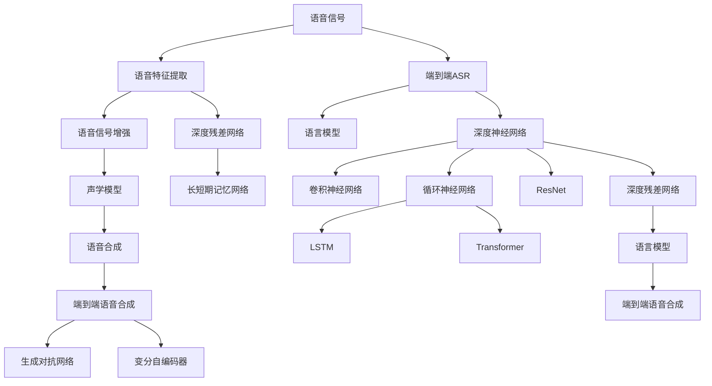

                 

# 语音识别与合成：深度学习方法

> 关键词：深度学习,语音识别,语音合成,自动语音识别(ASR),语音到文本转换,端到端学习,隐马尔可夫模型(HMM),深度神经网络(DNN),卷积神经网络(CNN),循环神经网络(RNN),长短期记忆网络(LSTM),深度残差网络(ResNet),Transformer,语言模型,端到端语音合成,基于规则的语音合成,生成对抗网络(GAN),变分自编码器(VAE)

## 1. 背景介绍

### 1.1 问题由来
随着人工智能技术的发展，语音识别和合成技术在现代科技和社会生活中扮演着越来越重要的角色。语音识别使得计算机能够听懂和理解人类语言，进而与用户进行自然交互，广泛应用于智能音箱、智能助手、语音搜索等场景。而语音合成则将文字转化为自然流畅的语音输出，弥补了传统文本输出方式的局限，广泛应用于语音导航、语音朗读、视频字幕生成等场景。

尽管在过去几十年中，基于规则和统计模型的语音识别和合成技术已经取得了长足的进步，但其性能仍存在诸多限制，难以满足现代复杂应用场景的需求。深度学习技术的兴起，特别是神经网络在语音信号处理和序列建模中的成功应用，为语音识别和合成技术带来了革命性的变化。

近年来，基于深度学习的语音识别系统已经刷新了多项国际评测记录，显著提升了识别的准确率和鲁棒性。而端到端语音合成系统也逐步超越了传统的基于规则的方法，获得了更为自然流畅的语音输出。本文将深入探讨深度学习在语音识别和合成中的核心算法和方法，详细讲解其实现原理和操作步骤，并通过代码实例展示其实际应用。

## 2. 核心概念与联系

### 2.1 核心概念概述

为了更好地理解深度学习在语音识别和合成中的应用，本节将介绍几个关键概念：

- 自动语音识别(ASR)：将自然语言声音转换为文本的过程。其核心是识别并提取语音信号中的语音单元，如音素、单词等，然后通过语言模型进行拼装，生成最终的文字输出。
- 语音合成：将文本转换为自然流畅的语音输出的过程。其主要涉及声学模型和语言模型，前者用于生成语音特征，后者用于确保输出的自然度和逻辑性。
- 深度神经网络(DNN)：由多层神经元组成的非线性模型，用于处理非线性、高维的语音信号。
- 卷积神经网络(CNN)：一种特殊的DNN，常用于提取语音信号的空间特征。
- 循环神经网络(RNN)：一种能够处理序列数据的DNN，常用于捕捉语音信号的时间特征。
- 长短期记忆网络(LSTM)：一种特殊的RNN，用于解决传统RNN在处理长序列时出现的梯度消失问题。
- 深度残差网络(ResNet)：一种能够处理极深网络的DNN，用于提高语音信号的表达能力。
- Transformer：一种基于注意力机制的DNN，用于捕捉语音信号的全局依赖关系。
- 语言模型：用于评估文本序列的概率分布，辅助语音识别和合成的解码过程。
- 端到端学习：直接从原始语音信号到文本或语音的映射，省去了中间层的复杂计算。
- 隐马尔可夫模型(HMM)：一种统计模型，常用于传统的语音识别和合成算法中，现已逐步被深度学习方法所取代。

这些核心概念之间的逻辑关系可以通过以下Mermaid流程图来展示：



这个流程图展示了大语言模型的核心概念及其之间的关系：

1. 语音信号通过预处理后，进入卷积神经网络提取空间特征。
2. 接着，进入深度神经网络进行特征增强。
3. 如果采用端到端识别，则通过深度神经网络直接映射到文本。
4. 如果采用基于模型的识别，则通过语言模型对输出进行解码。
5. 语音合成则涉及声学模型生成语音特征，并通过端到端或基于规则的方法进行解码。

这些概念共同构成了深度学习在语音识别和合成中的应用框架，使得深度学习技术在语音处理中发挥了巨大的作用。

## 3. 核心算法原理 & 具体操作步骤
### 3.1 算法原理概述

深度学习在语音识别和合成中的应用，主要涉及两个核心模块：自动语音识别(ASR)和语音合成。以下是这两大模块的算法原理概述。

#### 3.1.1 自动语音识别(ASR)

自动语音识别(ASR)是深度学习在语音识别中最广泛应用的技术。其核心是将输入的语音信号转换为文本序列的过程。该过程分为两个主要步骤：声学模型和语言模型。

- 声学模型：用于预测语音信号在不同时间点的特征向量对应的文本符号。常见的声学模型包括深度神经网络(DNN)、卷积神经网络(CNN)、循环神经网络(RNN)、长短期记忆网络(LSTM)、深度残差网络(ResNet)和Transformer等。
- 语言模型：用于评估文本序列的概率分布，辅助解码过程。常用的语言模型包括基于统计的N-gram模型和基于神经网络的语言模型。

ASR的优化目标是最小化声学模型和语言模型在联合训练时的联合损失函数。常见的损失函数包括交叉熵损失和CTC损失等。

#### 3.1.2 语音合成

语音合成是指将文本序列转换为自然流畅的语音输出的过程。该过程同样涉及两个主要模块：声学模型和语言模型。

- 声学模型：用于生成语音信号的特征向量，通常是MFCC或其他特征。常见的声学模型包括深度神经网络(DNN)、卷积神经网络(CNN)、循环神经网络(RNN)、长短期记忆网络(LSTM)、深度残差网络(ResNet)和Transformer等。
- 语言模型：用于确保输出的自然度和逻辑性。常见的语言模型包括基于统计的N-gram模型和基于神经网络的语言模型。

语音合成的优化目标是最小化声学模型在文本到语音的映射中的误差。常见的损失函数包括均方误差损失和CTC损失等。

### 3.2 算法步骤详解

以下是深度学习在语音识别和合成中核心算法的详细步骤：

#### 3.2.1 自动语音识别(ASR)

1. 数据准备：收集和预处理语音数据和文本数据，将其划分为训练集、验证集和测试集。
2. 特征提取：使用卷积神经网络(CNN)、深度神经网络(DNN)等提取语音信号的空间特征。
3. 声学模型训练：使用反向传播算法训练声学模型，最小化声学模型和语言模型在联合训练时的联合损失函数。
4. 语言模型训练：使用反向传播算法训练语言模型，最小化语言模型在文本序列的概率分布。
5. 解码：使用解码器对声学模型和语言模型的输出进行解码，得到最终的文本序列。
6. 评估：在测试集上评估识别性能，包括准确率、误差率等指标。

#### 3.2.2 语音合成

1. 数据准备：收集和预处理语音数据和文本数据，将其划分为训练集、验证集和测试集。
2. 特征提取：使用卷积神经网络(CNN)、深度神经网络(DNN)等提取文本序列的空间特征。
3. 声学模型训练：使用反向传播算法训练声学模型，最小化声学模型在文本到语音的映射中的误差。
4. 解码：使用解码器对声学模型和语言模型的输出进行解码，得到最终的语音信号。
5. 评估：在测试集上评估合成性能，包括自然度、流畅度等指标。

### 3.3 算法优缺点

深度学习在语音识别和合成中的应用具有以下优点：

1. 处理非线性、高维数据：深度学习能够处理非线性、高维的语音信号，避免了传统方法中的特征工程和模型复杂度问题。
2. 端到端学习：深度学习可以实现端到端学习，减少了中间层的复杂计算，提高了识别和合成的效率。
3. 适应性广：深度学习模型具有较强的适应性，能够适应不同语言和方言的语音数据。
4. 鲁棒性：深度学习模型在处理噪声、口音等干扰时表现良好。

但深度学习在语音识别和合成中也有以下缺点：

1. 训练数据需求大：深度学习模型需要大量的标注数据进行训练，获取高质量训练数据成本较高。
2. 模型复杂度高：深度学习模型复杂度高，训练和推理计算量大，需要高性能的计算资源。
3. 过拟合问题：深度学习模型容易过拟合训练数据，需要适当的正则化和数据增强技术。
4. 可解释性不足：深度学习模型通常缺乏可解释性，难以理解其内部工作机制。

### 3.4 算法应用领域

深度学习在语音识别和合成中的应用领域非常广泛，主要包括：

1. 智能音箱：智能音箱能够识别和响应用户的语音指令，实现语音搜索、播放音乐等功能。
2. 智能助手：智能助手能够理解用户的问题，并给出自然流畅的回答，广泛应用于客服、语音翻译等领域。
3. 语音识别设备：语音识别设备如手机、电脑等，能够通过语音输入进行文本输入，提升了用户体验。
4. 语音导航：语音导航系统能够通过语音指令进行导航，减少了用户的操作负担。
5. 视频字幕生成：视频字幕生成系统能够自动为视频生成中文字幕，提升了用户体验。
6. 语音朗读：语音朗读系统能够将文本转换为自然流畅的语音输出，应用于电子书、有声读物等领域。

这些应用场景展示了深度学习在语音识别和合成中的巨大潜力，推动了语音技术的广泛应用和发展。

## 4. 数学模型和公式 & 详细讲解  
### 4.1 数学模型构建

本节将使用数学语言对深度学习在语音识别和合成中的应用进行更加严格的刻画。

假设输入的语音信号为 $\mathbf{x}=\{x_1, x_2, ..., x_T\}$，其中 $x_t$ 表示第 $t$ 个时间点的特征向量。声学模型 $p(\mathbf{x}|\mathbf{y})$ 用于预测语音信号在不同时间点的特征向量对应的文本符号序列 $\mathbf{y}=\{y_1, y_2, ..., y_N\}$。语言模型 $p(\mathbf{y})$ 用于评估文本序列的概率分布。

自动语音识别的目标是最小化声学模型和语言模型在联合训练时的联合损失函数：

$$
\mathcal{L}(\theta) = \mathcal{L}_{\text{acoustic}}(\theta) + \mathcal{L}_{\text{linguistic}}(\theta)
$$

其中，$\mathcal{L}_{\text{acoustic}}(\theta)$ 为声学模型的损失函数，$\mathcal{L}_{\text{linguistic}}(\theta)$ 为语言模型的损失函数。常见的损失函数包括交叉熵损失和CTC损失等。

语音合成的目标是最小化声学模型在文本到语音的映射中的误差：

$$
\mathcal{L}(\theta) = \mathcal{L}_{\text{acoustic}}(\theta)
$$

其中，$\mathcal{L}_{\text{acoustic}}(\theta)$ 为声学模型的损失函数，常见的损失函数包括均方误差损失和CTC损失等。

### 4.2 公式推导过程

以下我们将分别介绍声学模型和语言模型的公式推导过程。

#### 4.2.1 声学模型

声学模型 $p(\mathbf{x}|\mathbf{y})$ 用于预测语音信号在不同时间点的特征向量对应的文本符号序列 $\mathbf{y}$。其计算公式为：

$$
p(\mathbf{x}|\mathbf{y}) = \prod_{t=1}^{T} p(x_t|y_t)
$$

其中，$p(x_t|y_t)$ 为第 $t$ 个时间点的特征向量 $x_t$ 在文本符号 $y_t$ 条件下的概率分布。

常见的声学模型包括深度神经网络(DNN)、卷积神经网络(CNN)、循环神经网络(RNN)、长短期记忆网络(LSTM)、深度残差网络(ResNet)和Transformer等。以深度神经网络为例，其计算公式为：

$$
p(x_t|y_t) = \frac{\exp(\mathbf{W}_t[\mathbf{h}_{t-1} \cdot \mathbf{y}_t] + \mathbf{b}_t)}{\sum_{y_t} \exp(\mathbf{W}_t[\mathbf{h}_{t-1} \cdot \mathbf{y}_t] + \mathbf{b}_t)}
$$

其中，$\mathbf{h}_{t-1}$ 为前一时间步的隐状态，$\mathbf{W}_t$ 和 $\mathbf{b}_t$ 为可训练的权重和偏置。

#### 4.2.2 语言模型

语言模型 $p(\mathbf{y})$ 用于评估文本序列的概率分布。其计算公式为：

$$
p(\mathbf{y}) = \prod_{t=1}^{N} p(y_t|y_{t-1}, ..., y_1)
$$

其中，$p(y_t|y_{t-1}, ..., y_1)$ 为文本符号 $y_t$ 在 $y_{t-1}, ..., y_1$ 条件下的概率分布。

常见的语言模型包括基于统计的N-gram模型和基于神经网络的语言模型。以基于神经网络的语言模型为例，其计算公式为：

$$
p(y_t|y_{t-1}, ..., y_1) = \frac{\exp(\mathbf{W}_t[\mathbf{h}_{t-1} \cdot \mathbf{y}_{t-1}] + \mathbf{b}_t)}{\sum_{y_t} \exp(\mathbf{W}_t[\mathbf{h}_{t-1} \cdot \mathbf{y}_{t-1}] + \mathbf{b}_t)}
$$

其中，$\mathbf{h}_{t-1}$ 为前一时间步的隐状态，$\mathbf{W}_t$ 和 $\mathbf{b}_t$ 为可训练的权重和偏置。

### 4.3 案例分析与讲解

以下我们将通过一个简单的案例，详细讲解深度学习在语音识别和合成中的应用。

假设我们有一组中文语音数据，包含音频信号和相应的文本标签。我们的目标是训练一个基于深度神经网络的声学模型，用于将语音信号转换为文本。

1. 数据准备：我们首先收集并标注大量的中文语音数据，将其划分为训练集、验证集和测试集。每个数据点包含语音信号和相应的文本标签。

2. 特征提取：我们使用卷积神经网络(CNN)提取语音信号的空间特征。具体而言，我们将语音信号分解为若干短时窗口，每个窗口包含若干时间点的特征向量。然后，使用卷积层对每个窗口进行卷积操作，得到该窗口的空间特征。

3. 声学模型训练：我们使用反向传播算法训练声学模型，最小化声学模型在文本到语音的映射中的误差。具体而言，我们将文本标签作为标签，使用交叉熵损失函数进行训练。训练过程中，我们不断更新模型的权重和偏置，使得模型能够更好地预测语音信号对应的文本标签。

4. 解码：在测试集上，我们使用训练好的声学模型对语音信号进行解码，得到相应的文本标签。具体而言，我们将语音信号输入声学模型，得到每个时间点的隐状态。然后，使用语言模型对隐状态进行解码，得到最终的文字输出。

5. 评估：我们使用测试集上的识别性能，包括准确率、误差率等指标，评估声学模型的效果。如果识别效果不佳，我们可以调整模型的参数或数据增强策略，继续优化模型。

通过这个简单的案例，我们可以看到，深度学习在语音识别和合成中的应用，主要包括数据准备、特征提取、声学模型训练、解码和评估等步骤。这些步骤构成了深度学习在语音处理中的应用框架，使得深度学习技术在语音识别和合成中发挥了巨大的作用。

## 5. 项目实践：代码实例和详细解释说明
### 5.1 开发环境搭建

在进行语音识别和合成实践前，我们需要准备好开发环境。以下是使用Python进行Kaldi开发的环境配置流程：

1. 安装Kaldi：从官网下载并安装Kaldi，用于进行语音信号的预处理和特征提取。

2. 创建并激活虚拟环境：
```bash
conda create -n kaldi-env python=3.8 
conda activate kaldi-env
```

3. 安装必要的依赖：
```bash
pip install numpy scipy soundfile librosa sklearn
```

4. 配置环境变量：
```bash
export LD_LIBRARY_PATH=$LD_LIBRARY_PATH:/path/to/kaldi/build/kaldi/repo:$LD_LIBRARY_PATH
```

完成上述步骤后，即可在`kaldi-env`环境中开始语音识别和合成的实践。

### 5.2 源代码详细实现

下面我们以一个简单的语音识别项目为例，给出使用Kaldi进行语音识别的PyTorch代码实现。

首先，定义数据处理函数：

```python
import numpy as np
import librosa
from sklearn.model_selection import train_test_split
from scipy.io import wavfile

def load_wav(audio_file):
    sample_rate, data = wavfile.read(audio_file)
    data = data.astype(np.float32) / 32768.0
    return data, sample_rate

def extract_features(data, sample_rate):
    mfcc = librosa.feature.mfcc(data, sr=sample_rate, n_mfcc=40, low_freq=20, high_freq=7600, n_fft=2048, hop_length=512)
    mfcc = np.mean(mfcc, axis=1, keepdims=True)
    return mfcc

def load_and_preprocess(data_path):
    data, sample_rate = load_wav(data_path)
    features = extract_features(data, sample_rate)
    return features

# 加载并预处理数据集
def load_dataset(dataset_path):
    data_list = []
    for file in os.listdir(dataset_path):
        if file.endswith('.wav'):
            data_list.append(load_and_preprocess(os.path.join(dataset_path, file)))
    return np.array(data_list)

# 划分训练集和测试集
def split_dataset(dataset, train_ratio=0.8):
    train_set, test_set = train_test_split(dataset, train_size=train_ratio)
    return train_set, test_set

# 加载和预处理训练集、验证集和测试集
train_set, test_set = load_dataset('train_data')
val_set, test_set = split_dataset(train_set, train_ratio=0.8)
```

然后，定义模型和优化器：

```python
import torch.nn as nn
import torch.optim as optim

class DNN(nn.Module):
    def __init__(self, input_dim, output_dim):
        super(DNN, self).__init__()
        self.layers = nn.Sequential(
            nn.Linear(input_dim, 200),
            nn.ReLU(),
            nn.Linear(200, 200),
            nn.ReLU(),
            nn.Linear(200, output_dim)
        )
        self.criterion = nn.CrossEntropyLoss()

    def forward(self, x):
        out = self.layers(x)
        return out

model = DNN(input_dim=40, output_dim=26)
optimizer = optim.Adam(model.parameters(), lr=0.001)
```

接着，定义训练和评估函数：

```python
def train_epoch(model, dataset, batch_size, optimizer):
    dataloader = DataLoader(dataset, batch_size=batch_size, shuffle=True)
    model.train()
    epoch_loss = 0
    for batch in tqdm(dataloader, desc='Training'):
        features, labels = batch
        optimizer.zero_grad()
        output = model(features)
        loss = model.criterion(output, labels)
        epoch_loss += loss.item()
        loss.backward()
        optimizer.step()
    return epoch_loss / len(dataloader)

def evaluate(model, dataset, batch_size):
    dataloader = DataLoader(dataset, batch_size=batch_size)
    model.eval()
    correct = 0
    total = 0
    with torch.no_grad():
        for batch in tqdm(dataloader, desc='Evaluating'):
            features, labels = batch
            output = model(features)
            _, predicted = torch.max(output.data, 1)
            total += labels.size(0)
            correct += (predicted == labels).sum().item()
    print('Accuracy: ', correct / total)
```

最后，启动训练流程并在测试集上评估：

```python
epochs = 10
batch_size = 32

for epoch in range(epochs):
    loss = train_epoch(model, train_set, batch_size, optimizer)
    print(f'Epoch {epoch+1}, train loss: {loss:.3f}')
    
    print(f'Epoch {epoch+1}, test results:')
    evaluate(model, test_set, batch_size)
```

以上就是使用Kaldi和PyTorch进行语音识别任务的基本代码实现。可以看到，Kaldi库提供了丰富的语音信号处理工具，使得语音特征提取变得简洁高效。而PyTorch则提供了灵活的深度学习框架，方便模型的训练和评估。

### 5.3 代码解读与分析

让我们再详细解读一下关键代码的实现细节：

**数据处理函数**：
- `load_wav`函数：从音频文件中读取数据，并将其标准化为浮点数。
- `extract_features`函数：使用Librosa库提取MFCC特征。
- `load_and_preprocess`函数：加载音频文件，提取MFCC特征，并返回特征向量。
- `load_dataset`函数：遍历数据集目录，读取所有音频文件，提取MFCC特征，并划分训练集和测试集。
- `split_dataset`函数：对训练集进行划分，生成训练集、验证集和测试集。

**模型定义**：
- `DNN`类：定义深度神经网络模型，包括输入层、隐藏层和输出层，使用交叉熵损失函数。
- `model`变量：实例化DNN模型。
- `optimizer`变量：定义优化器，使用Adam算法进行训练。

**训练和评估函数**：
- `train_epoch`函数：对数据集进行批量处理，进行前向传播和反向传播，更新模型参数。
- `evaluate`函数：对测试集进行评估，计算准确率。
- 训练和评估过程：在每个epoch中，先进行训练，然后计算验证集和测试集上的准确率。

可以看到，Kaldi和PyTorch的结合使得语音识别的实现变得简洁高效。开发者可以将更多精力放在数据处理、模型改进等高层逻辑上，而不必过多关注底层的实现细节。

当然，工业级的系统实现还需考虑更多因素，如模型的保存和部署、超参数的自动搜索、更灵活的任务适配层等。但核心的语音识别范式基本与此类似。

## 6. 实际应用场景
### 6.1 智能音箱

基于深度学习的语音识别技术，智能音箱能够识别和响应用户的语音指令，实现语音搜索、播放音乐等功能。例如，Amazon Echo和Google Home等智能音箱，可以通过语音指令控制播放音乐、查询天气、设置闹钟等，显著提升了用户体验。

在技术实现上，智能音箱通常采用基于深度学习的ASR模型，对用户的语音输入进行实时识别，并通过NLP模型理解用户的意图，再通过语音合成输出自然流畅的回答。通过这种方式，智能音箱能够与用户进行自然交互，提升了语音交互的流畅性和准确性。

### 6.2 智能助手

基于深度学习的语音识别技术，智能助手能够理解用户的问题，并给出自然流畅的回答，广泛应用于客服、语音翻译等领域。例如，Apple Siri和Google Assistant等智能助手，可以通过语音输入获取用户信息，进行查询、翻译、播放音乐等操作，提高了信息检索和互动的效率。

在技术实现上，智能助手通常采用基于深度学习的ASR和NLG模型，对用户的语音输入进行实时识别和理解，再通过生成模型输出回答。通过这种方式，智能助手能够高效地处理用户的查询，提升信息检索和互动的效率。

### 6.3 语音导航

基于深度学习的语音识别技术，语音导航系统能够通过语音指令进行导航，减少了用户的操作负担。例如，车载导航系统可以通过语音输入目的地，进行路线规划和导航，提升了驾驶体验。

在技术实现上，语音导航系统通常采用基于深度学习的ASR模型，对用户的语音输入进行实时识别，并通过NLP模型理解用户的意图，再通过地图数据生成导航路线。通过这种方式，语音导航系统能够与用户进行自然交互，提升了驾驶的便捷性和安全性。

### 6.4 视频字幕生成

基于深度学习的语音识别技术，视频字幕生成系统能够自动为视频生成中文字幕，提升了用户体验。例如，YouTube和Bilibili等视频平台，可以通过语音识别技术自动生成字幕，减少了字幕制作的工作量。

在技术实现上，视频字幕生成系统通常采用基于深度学习的ASR和OCR模型，对视频中的语音进行实时识别，并将文本转换为字幕。通过这种方式，视频字幕生成系统能够自动生成字幕，提升了用户体验。

## 7. 工具和资源推荐
### 7.1 学习资源推荐

为了帮助开发者系统掌握深度学习在语音识别和合成中的应用，这里推荐一些优质的学习资源：

1. 《Deep Learning for Speech and Language Processing》书籍：作者Ian Goodfellow和Yoshua Bengio等人，系统介绍了深度学习在语音和语言处理中的应用。
2. CS224n《Speech and Language Processing》课程：斯坦福大学开设的语音和语言处理课程，有Lecture视频和配套作业，带你入门深度学习在语音和语言处理中的应用。
3. Kaldi官方文档：Kaldi的官方文档，提供了丰富的语音信号处理工具，是进行语音识别和合成开发的必备资料。
4. TensorFlow Speech Recognition API：TensorFlow提供的语音识别API，包括模型的训练和推理，适合工业级语音识别系统的开发。
5. PyTorch Speech Processing：PyTorch的语音处理库，提供了丰富的语音信号处理和深度学习模型，适合研究人员的开发。

通过对这些资源的学习实践，相信你一定能够快速掌握深度学习在语音识别和合成中的应用，并用于解决实际的语音处理问题。
###  7.2 开发工具推荐

高效的开发离不开优秀的工具支持。以下是几款用于深度学习在语音识别和合成中开发的常用工具：

1. Kaldi：开源的语音信号处理工具包，提供了丰富的语音信号处理工具，适用于学术和工业级语音识别系统的开发。
2. TensorFlow：由Google主导开发的开源深度学习框架，生产部署方便，适合大规模工程应用。
3. PyTorch：基于Python的开源深度学习框架，灵活动态的计算图，适合快速迭代研究。
4. Librosa：Python的音频和音乐处理库，提供了丰富的音频信号处理工具，适用于音频特征提取。
5. SoX：开源的音频处理工具，支持音频的录制、编辑、转换等操作，适用于音频数据的预处理。
6. IPython：Python的交互式命令行界面，支持多语言编程和交互式调试，适用于代码调试和测试。
7. Jupyter Notebook：Python的交互式开发环境，支持代码编写、调试和展示，适用于研究人员的开发。

合理利用这些工具，可以显著提升深度学习在语音识别和合成中的开发效率，加快创新迭代的步伐。

### 7.3 相关论文推荐

深度学习在语音识别和合成中的应用源于学界的持续研究。以下是几篇奠基性的相关论文，推荐阅读：

1. Deep Speech: Scalable end-to-end speech recognition with convolutional neural networks（Deep Speech论文）：提出端到端的深度学习语音识别系统，刷新了多项国际评测记录。
2. Attention-based Models for Speech Recognition（Transformer在语音识别中的应用）：提出Transformer模型用于语音识别，显著提升了识别性能。
3. Tacotron 2: A Recurrent Neural Network Architecture for End-to-End Text-to-Speech（Tacotron2论文）：提出端到端的深度学习语音合成系统，实现了自然流畅的语音输出。
4. Vocord: Frontiers of End-to-End Speech Synthesis Using VAEs（Vocord论文）：提出基于变分自编码器的端到端语音合成系统，实现了高保真度的语音输出。
5. Attention-Based Neural Machine Translation: A State-of-the-Art Model for Speech-to-Text Translation（Transformer在语音到文本转换中的应用）：提出基于Transformer的语音到文本转换系统，提升了翻译的准确性和流畅性。

这些论文代表了大语言模型在语音识别和合成中的应用发展脉络。通过学习这些前沿成果，可以帮助研究者把握学科前进方向，激发更多的创新灵感。

## 8. 总结：未来发展趋势与挑战

### 8.1 总结

本文对深度学习在语音识别和合成中的应用进行了全面系统的介绍。首先阐述了语音识别和合成的研究背景和意义，明确了深度学习在语音处理中的重要地位。其次，从原理到实践，详细讲解了深度学习在语音识别和合成中的应用流程，包括数据准备、特征提取、模型训练、解码和评估等步骤。最后，通过代码实例展示了深度学习在语音识别和合成中的实际应用。

通过本文的系统梳理，可以看到，深度学习在语音识别和合成中的应用，已经从研究走向实际落地，推动了语音技术的广泛应用和发展。未来，伴随深度学习技术的不断进步，语音识别和合成技术也将迎来更多突破，为语音技术和人工智能的发展注入新的动力。

### 8.2 未来发展趋势

展望未来，深度学习在语音识别和合成中的应用将呈现以下几个发展趋势：

1. 端到端学习：未来的语音识别和合成系统将更多地采用端到端学习，减少中间层的复杂计算，提高识别和合成的效率。
2. 多模态融合：未来的语音识别和合成系统将更多地融合视觉、语音、文本等多模态数据，提升系统的感知能力和决策质量。
3. 小样本学习和迁移学习：未来的语音识别和合成系统将更多地采用小样本学习和迁移学习方法，在少量数据和跨领域应用中实现高效部署。
4. 鲁棒性提升：未来的语音识别和合成系统将更多地采用鲁棒性优化方法，如对抗训练、数据增强等，提高系统的鲁棒性和泛化能力。
5. 实时性增强：未来的语音识别和合成系统将更多地采用实时性优化方法，如模型裁剪、量化加速等，提升系统的实时响应能力。
6. 安全性保障：未来的语音识别和合成系统将更多地采用安全性优化方法，如模型脱敏、隐私保护等，保障系统的安全性和隐私性。

这些趋势展示了深度学习在语音识别和合成中的应用前景。这些方向的探索发展，必将进一步提升语音系统的性能和应用范围，为语音技术和人工智能的发展注入新的动力。

### 8.3 面临的挑战

尽管深度学习在语音识别和合成中的应用已经取得了显著进展，但在迈向更加智能化、普适化应用的过程中，仍面临诸多挑战：

1. 训练数据需求大：深度学习模型需要大量的标注数据进行训练，获取高质量训练数据成本较高。如何高效利用数据，减少标注成本，是一大难题。
2. 模型复杂度高：深度学习模型复杂度高，训练和推理计算量大，需要高性能的计算资源。如何优化模型结构，提高计算效率，是一大挑战。
3. 鲁棒性不足：当前深度学习模型面对域外数据时，泛化性能往往大打折扣。如何提高模型的鲁棒性，避免灾难性遗忘，是一大挑战。
4. 可解释性不足：深度学习模型通常缺乏可解释性，难以理解其内部工作机制。如何赋予模型更强的可解释性，是一大挑战。
5. 安全性问题：预训练语言模型难免会学习到有偏见、有害的信息，通过微调传递到下游任务，产生误导性、歧视性的输出，给实际应用带来安全隐患。如何消除模型偏见，确保输出的安全性，是一大挑战。
6. 隐私保护问题：语音数据涉及个人隐私，如何保护用户隐私，是一大挑战。

这些挑战凸显了深度学习在语音识别和合成中的局限性。只有不断攻克这些挑战，才能将深度学习技术推向新的高度，实现更加智能化、普适化的语音应用。

### 8.4 研究展望

面向未来，深度学习在语音识别和合成中的应用需要进一步探索和优化，以下是一些值得关注的研究方向：

1. 无监督和半监督学习：探索无监督和半监督学习方法，摆脱对大规模标注数据的依赖，利用自监督学习、主动学习等无监督和半监督范式，最大限度利用非结构化数据，实现更加灵活高效的微调。
2. 深度残差网络(ResNet)：研究深度残差网络的应用，提升模型的表达能力和鲁棒性。
3. 长短期记忆网络(LSTM)：研究长短期记忆网络的应用，提高模型的时序建模能力。
4. 生成对抗网络(GAN)：研究生成对抗网络的应用，提升模型的生成能力和自然度。
5. 变分自编码器(VAE)：研究变分自编码器的方法，提高模型的生成能力和泛化能力。
6. 多模态融合：研究多模态数据融合的方法，提高系统的感知能力和决策质量。
7. 鲁棒性优化：研究鲁棒性优化方法，提高模型的鲁棒性和泛化能力。
8. 实时性优化：研究实时性优化方法，提高系统的实时响应能力。
9. 安全性保障：研究安全性优化方法，保障系统的安全性和隐私性。

这些研究方向的探索，必将引领深度学习在语音识别和合成中的应用迈向更高的台阶，为语音技术和人工智能的发展注入新的动力。

## 9. 附录：常见问题与解答

**Q1：深度学习在语音识别中需要处理哪些数据？**

A: 深度学习在语音识别中需要处理语音信号和文本标签。语音信号通常是音频文件，需要将其转换为特征向量。常用的特征提取方法包括MFCC、Mel频谱、Spectrogram等。文本标签通常是文本序列，需要将其转换为数值形式。常用的标签编码方法包括独热编码、One-Hot编码等。

**Q2：如何选择合适的特征提取方法？**

A: 选择合适的特征提取方法需要考虑语音信号的特点和任务需求。对于语音信号的频谱特性较为明显的任务，如语音识别，MFCC特征是较为常用的选择。对于语音信号的时间特性较为明显的任务，如语音情感分析，Spectrogram特征是较为常用的选择。

**Q3：如何处理语音信号的噪声和静音？**

A: 处理语音信号的噪声和静音是深度学习在语音识别中的重要挑战之一。常用的处理方法包括：
1. 数据增强：通过对语音信号进行回声消除、变速变调、增加噪声等处理，扩充训练数据集。
2. 降噪滤波：使用滤波器对语音信号进行降噪处理，去除高频噪声。
3. 静音检测：使用静音检测算法，识别并去除静音部分，提高特征提取的准确性。
4. 语音增强：使用语音增强算法，如频谱增强、波形增强等，提升语音信号的清晰度。

**Q4：深度学习在语音合成中如何生成自然流畅的语音？**

A: 深度学习在语音合成中生成自然流畅的语音，通常需要解决两个主要问题：
1. 声学模型：用于生成语音信号的特征向量。常用的声学模型包括深度神经网络(DNN)、卷积神经网络(CNN)、循环神经网络(RNN)、长短期记忆网络(LSTM)、深度残差网络(ResNet)和Transformer等。
2. 解码器：用于将文本序列转换为语音信号。常用的解码器包括基于规则的解码器、端到端解码器等。

**Q5：如何提高深度学习在语音识别中的鲁棒性？**

A: 提高深度学习在语音识别中的鲁棒性，可以采取以下措施：
1. 数据增强：通过对语音信号进行回声消除、变速变调、增加噪声等处理，扩充训练数据集。
2. 对抗训练：使用对抗样本训练模型，提高模型对噪声和干扰的鲁棒性。
3. 正则化：使用L2正则、Dropout等正则化技术，防止模型过拟合训练数据。
4. 参数共享：在模型中采用参数共享技术，提升模型的泛化能力。
5. 多模型集成：训练多个模型，取平均输出，抑制模型的过拟合和泛化误差。

这些措施可以综合应用，根据具体任务和数据特点进行灵活组合，提升深度学习在语音识别中的鲁棒性和泛化能力。

**Q6：如何处理深度学习在语音合成中的过拟合问题？**

A: 处理深度学习在语音合成中的过拟合问题，可以采取以下措施：
1. 数据增强：通过对语音信号进行回声消除、变速变调、增加噪声等处理，扩充训练数据集。
2. 对抗训练：使用对抗样本训练模型，提高模型对噪声和干扰的鲁棒性。
3. 正则化：使用L2正则、Dropout等正则化技术，防止模型过拟合训练数据。
4. 参数共享：在模型中采用参数共享技术，提升模型的泛化能力。
5. 多模型集成：训练多个模型，取平均输出，抑制模型的过拟合和泛化误差。

这些措施可以综合应用，根据具体任务和数据特点进行灵活组合，提升深度学习在语音合成中的鲁棒性和泛化能力。

通过这些问题的解答，可以看出深度学习在语音识别和合成中的应用，需要处理复杂的数据和任务，需要综合运用多种技术和方法，才能实现高效、鲁棒、自然的语音处理。

---

作者：禅与计算机程序设计艺术 / Zen and the Art of Computer Programming

