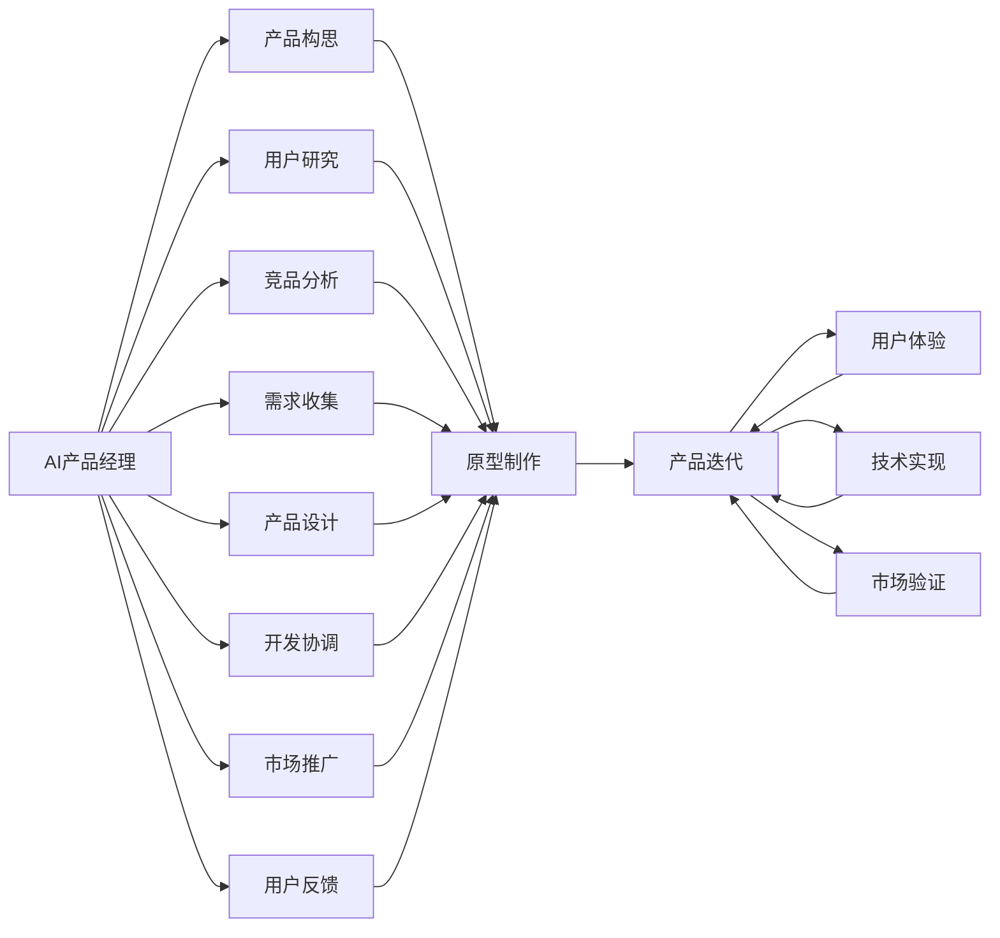

                 

# 贾扬清的期待：更多产品经理加入AI领域，创新产品形态与应用方式

## 1. 背景介绍

### 1.1 问题由来

随着人工智能（AI）技术的快速发展，产品经理在AI领域的角色显得愈发重要。产品经理不仅需要掌握丰富的产品管理知识，还需要具备一定的AI技术理解和应用能力，以便更好地领导团队，将AI技术转化为具有商业价值的产品。然而，目前AI领域的产品经理数量仍然有限，缺乏具备跨领域知识与能力的综合型人才。

### 1.2 问题核心关键点

本文将探讨以下关键点：
- AI产品经理的重要性与现状
- AI技术在产品中的应用方式与形态创新
- AI产品经理的技能要求与成长路径
- AI产品团队组织与协作模式

### 1.3 问题研究意义

AI产品经理的增加不仅能推动AI技术在更多领域的应用，还能提升产品的智能化水平，创造更多商业机会。AI产品经理的培养有助于填补AI与产品之间的鸿沟，加速AI技术的产业化进程，最终实现AI技术对各行各业的深度影响。

## 2. 核心概念与联系

### 2.1 核心概念概述

为便于理解，本节将介绍几个关键概念及其相互关系：

- **AI产品经理（Product Manager for AI）**：负责产品从构思到落地的全流程管理，包括需求收集、用户研究、竞品分析、产品设计、开发协调、市场推广和用户反馈等。AI产品经理需要具备AI技术知识，并将其应用于产品管理中。

- **AI技术（Artificial Intelligence Technology）**：指通过计算机算法、模型和数据等手段，使计算机系统具备学习、推理、决策等智能行为的能力。AI技术包括机器学习、深度学习、自然语言处理（NLP）、计算机视觉（CV）等。

- **产品形态与创新（Product Form and Innovation）**：指基于AI技术，创造具有新功能、新体验、新价值的产品形态，如智能助手、推荐系统、智能分析工具等。

- **协作模式（Collaborative Mode）**：指在产品开发过程中，AI产品经理与工程师、设计师、数据科学家、市场营销等团队成员之间的沟通与协作方式。

- **组织结构（Organization Structure）**：指AI产品经理在产品开发团队中的定位与职责分配，如直接隶属于产品线、成为产品总监的助理、在跨职能团队中担任桥梁角色等。

这些概念相互交织，构成了AI产品经理的角色定义与职责范围，反映了其在产品创新与团队协作中的关键作用。

### 2.2 核心概念原理和架构的 Mermaid 流程图



该图展示了AI产品经理在产品开发流程中的核心作用，从产品构思到市场验证，每个环节均需产品经理的参与与协调。

## 3. 核心算法原理 & 具体操作步骤

### 3.1 算法原理概述

AI产品经理的核心任务是通过数据、技术、市场和用户体验等多方面因素，做出明智的产品决策。其工作原理可概括为以下几步：

1. **需求分析**：基于用户反馈、市场调研、竞品分析等，确定产品的核心需求与目标用户。
2. **技术评估**：评估AI技术的可行性、适用性与成本效益，选择最合适的技术方案。
3. **产品设计**：在技术评估的基础上，设计产品的功能和用户界面，确保产品能够实现目标需求。
4. **开发与测试**：协调工程师进行产品开发，并负责测试流程的监控与调整。
5. **市场推广**：制定市场策略，组织营销活动，推广产品，收集用户反馈。
6. **迭代优化**：根据用户反馈和市场表现，不断迭代产品，提升用户体验和技术性能。

### 3.2 算法步骤详解

以下是AI产品经理工作的详细步骤：

#### 第一步：需求分析

- **用户调研**：通过问卷调查、深度访谈、用户画像等方式，收集目标用户的需求和痛点。
- **竞品分析**：研究竞品的市场表现、技术优势和不足之处，寻找产品差异化机会。
- **市场需求**：分析市场趋势和用户行为，预测未来需求和增长点。

#### 第二步：技术评估

- **可行性研究**：评估AI技术的实现难度、资源需求和时间成本。
- **成本效益分析**：评估AI技术带来的经济效益和竞争优势，确保投入产出的合理性。
- **技术选型**：在多个技术方案中，选择最符合需求、性价比最高的技术。

#### 第三步：产品设计

- **功能规划**：根据用户需求和技术可行性，设计产品的核心功能和附加功能。
- **用户体验**：设计用户界面和交互流程，确保产品易于使用且符合用户习惯。
- **原型制作**：基于设计文档，制作产品原型，供团队评审和用户测试。

#### 第四步：开发与测试

- **团队协调**：与工程师、设计师、数据科学家等团队成员进行沟通，明确开发任务和时间节点。
- **开发流程**：协调前端、后端、测试等环节，确保产品按时高质量完成。
- **测试反馈**：负责测试流程的监控，收集测试反馈，推动问题解决。

#### 第五步：市场推广

- **市场策略**：制定市场推广计划，包括广告、公关、社交媒体等。
- **用户反馈**：收集用户反馈，分析用户行为，为后续优化提供依据。
- **数据分析**：通过数据分析工具，监控产品表现，优化推广策略。

#### 第六步：迭代优化

- **产品迭代**：根据用户反馈和市场数据，对产品进行迭代优化，提升性能和用户体验。
- **用户体验**：确保每次迭代都能带来显著的用户体验提升。
- **持续改进**：建立持续改进机制，不断优化产品和技术。

### 3.3 算法优缺点

**优点**：
- **综合素质**：AI产品经理具备跨学科的知识背景，能更好地理解技术、市场和用户。
- **跨职能沟通**：能协调不同职能团队，确保产品开发顺利进行。
- **创新驱动**：利用AI技术，推动产品形态与用户体验的创新。

**缺点**：
- **高技能要求**：需要同时具备AI技术和产品管理能力，门槛较高。
- **知识更新快**：AI技术快速变化，产品经理需要不断学习新知识，跟上技术前沿。
- **资源调配难度**：在多职能团队中协调资源和任务，复杂且容易产生冲突。

### 3.4 算法应用领域

AI产品经理在多个领域都有广泛应用，包括但不限于：

- **智能推荐系统**：利用AI技术，为用户提供个性化的内容推荐，如电商、社交、视频等。
- **智能客服**：通过NLP技术，实现自动化的客户服务，提高客户满意度。
- **智能分析工具**：利用AI技术，提供数据分析和决策支持，如BI、数据可视化、预测分析等。
- **智能家居**：通过物联网和AI技术，实现家庭自动化，提高生活便利性。
- **健康医疗**：利用AI技术，提供智能诊断、治疗和健康管理服务。

## 4. 数学模型和公式 & 详细讲解 & 举例说明

### 4.1 数学模型构建

为方便理解，本节将以智能推荐系统为例，构建其数学模型。

假设智能推荐系统需要根据用户历史行为，推荐商品或内容。设用户行为表示为向量 $x$，推荐内容表示为向量 $y$，推荐模型表示为 $f(x)$，损失函数为 $L(y,f(x))$。

**目标**：最大化预测准确率 $R(y,f(x))$。

**数学模型**：
$$
\min_{f} \mathbb{E}_{(x,y)}[L(y,f(x))] + \lambda \mathbb{E}_{(x,y)}[R(y,f(x))]
$$
其中，$\lambda$ 为正则化参数，控制损失函数中预测准确率的权重。

### 4.2 公式推导过程

根据上述目标，推导推荐模型的优化公式：

- **损失函数**：常用的有交叉熵损失、均方误差损失等。以交叉熵损失为例，公式为：
$$
L(y,f(x)) = -\sum_i y_i \log f(x_i)
$$
- **预测准确率**：计算预测结果与真实标签的匹配度，常用为准确率（Accuracy）。公式为：
$$
R(y,f(x)) = \frac{\sum_i y_i f(x_i)}{\sum_i y_i}
$$
- **优化目标**：将损失函数和预测准确率结合起来，得到优化目标：
$$
\min_{f} \mathbb{E}_{(x,y)}[L(y,f(x))] + \lambda \mathbb{E}_{(x,y)}[R(y,f(x))]
$$
- **优化算法**：常用的有随机梯度下降（SGD）、Adam等。以Adam为例，公式为：
$$
\theta_{t+1} = \theta_t - \eta \frac{m_t}{\sqrt{v_t}+\epsilon}
$$
其中，$\eta$ 为学习率，$m_t$ 和 $v_t$ 分别为梯度的一阶和二阶动量，$\epsilon$ 为防止除以0的常数。

### 4.3 案例分析与讲解

以电商推荐系统为例，分析其数学模型的构建与优化：

- **数据准备**：收集用户历史行为数据，如浏览、点击、购买记录等。
- **特征工程**：提取用户行为特征，如浏览时长、购买频率、商品类别等。
- **模型训练**：基于用户行为数据和商品信息，构建推荐模型，如基于协同过滤的矩阵分解模型、基于深度学习的序列推荐模型等。
- **模型优化**：通过交叉验证和超参数调优，选择最优模型。
- **模型部署**：将训练好的模型部署到生产环境，实时推荐商品。

## 5. 项目实践：代码实例和详细解释说明

### 5.1 开发环境搭建

在开始项目实践前，需要准备开发环境：

1. **环境安装**：
   - 安装Python：下载并安装Python 3.x版本，建议使用Anaconda或Miniconda。
   - 安装相关依赖库：使用pip或conda安装TensorFlow、PyTorch、Pandas、Numpy等。
   - 配置环境变量：设置Python路径、库路径等环境变量。

2. **环境激活**：
   - 启动虚拟环境：
     ```
     conda activate env_name
     ```
   - 验证环境配置：
     ```
     python --version
     pip --version
     ```

3. **示例代码**：
   ```python
   import pandas as pd
   import tensorflow as tf
   import numpy as np

   # 数据准备
   data = pd.read_csv('user_behavior.csv')
   user_ids = data['user_id'].values
   item_ids = data['item_id'].values
   behaviors = data['behavior'].values

   # 特征工程
   user_features = data.groupby('user_id')['feature'].agg(['mean', 'std']).values
   item_features = data.groupby('item_id')['feature'].agg(['mean', 'std']).values

   # 构建推荐模型
   def build_model(features):
       tf.keras.layers.Dense(128, activation='relu')(features)
       tf.keras.layers.Dense(64, activation='relu')(features)
       tf.keras.layers.Dense(1, activation='sigmoid')(features)

   model = tf.keras.Sequential([
       tf.keras.layers.Dense(64, activation='relu', input_shape=(8,)),
       build_model(user_features)
   ])

   # 模型训练
   model.compile(optimizer='adam', loss='binary_crossentropy', metrics=['accuracy'])
   model.fit(user_ids, behaviors, epochs=10, batch_size=32, validation_split=0.2)

   # 模型评估
   predictions = model.predict(user_ids).ravel()
   accuracy = np.mean(predictions == behaviors)
   print('Accuracy:', accuracy)
   ```

### 5.2 源代码详细实现

**用户行为数据处理**：

```python
# 读取数据
data = pd.read_csv('user_behavior.csv')

# 数据清洗
data = data.dropna()
data = data.drop_duplicates()

# 特征工程
user_features = data.groupby('user_id')['feature'].agg(['mean', 'std']).values
item_features = data.groupby('item_id')['feature'].agg(['mean', 'std']).values

# 模型训练
model = tf.keras.Sequential([
    tf.keras.layers.Dense(64, activation='relu', input_shape=(8,)),
    build_model(user_features)
])
model.compile(optimizer='adam', loss='binary_crossentropy', metrics=['accuracy'])
model.fit(user_ids, behaviors, epochs=10, batch_size=32, validation_split=0.2)

# 模型评估
predictions = model.predict(user_ids).ravel()
accuracy = np.mean(predictions == behaviors)
print('Accuracy:', accuracy)
```

**模型优化与部署**：

```python
# 模型优化
model.save('recommendation_model.h5')

# 模型部署
# 加载模型
model = tf.keras.models.load_model('recommendation_model.h5')

# 获取推荐结果
user = 'user_id_123'
recommendations = model.predict(user_ids).ravel()

# 返回推荐结果
print('Recommended items:', recommendations)
```

### 5.3 代码解读与分析

**用户行为数据处理**：

- 读取数据：使用Pandas库读取用户行为数据，包含用户ID、商品ID和行为数据。
- 数据清洗：去除缺失和重复数据，确保数据质量。
- 特征工程：使用均值和标准差作为特征，分别计算用户和商品的特征。

**模型训练与优化**：

- 构建模型：使用Keras框架构建推荐模型，包含两个全连接层和一个输出层。
- 模型编译：设置优化器、损失函数和评估指标。
- 模型训练：使用训练数据进行模型训练，设定训练轮数和批次大小。
- 模型评估：计算模型预测准确率，输出结果。

**模型部署与使用**：

- 模型保存：将训练好的模型保存为HDF5格式。
- 模型加载：从文件中加载模型，供后续使用。
- 获取推荐结果：使用模型对新用户进行推荐。

## 6. 实际应用场景

### 6.1 智能推荐系统

智能推荐系统是AI产品经理应用最为广泛的技术之一。通过深度学习算法，分析用户行为数据，为用户推荐个性化商品或内容，提升用户体验和转化率。

**案例**：
- **电商推荐**：Amazon、京东、淘宝等电商平台，通过推荐系统提高用户购买率和复购率。
- **视频推荐**：YouTube、Netflix、爱奇艺等视频平台，通过推荐系统提升用户观看时间和满意度。
- **新闻推荐**：今日头条、知乎、腾讯新闻等新闻平台，通过推荐系统提高用户粘性和内容分发效率。

### 6.2 智能客服

智能客服通过NLP技术，实现自动化的客户服务，提升客户满意度，降低人力成本。

**案例**：
- **阿里巴巴客服**：阿里巴巴集团通过智能客服系统，处理大量客户咨询，提升客户体验。
- **银联客服**：银联通过智能客服，解决用户支付、转账等问题，提升服务质量。
- **医疗客服**：在线医疗平台，通过智能客服系统，提供健康咨询、预约挂号等服务。

### 6.3 智能分析工具

智能分析工具通过AI技术，提供数据分析和决策支持，提升业务洞察力和决策效率。

**案例**：
- **BI工具**：Tableau、Power BI等BI工具，通过数据可视化技术，辅助企业管理决策。
- **数据分析平台**：Statista、Kaggle等数据分析平台，通过AI算法，提供市场趋势分析、用户行为分析等。
- **预测分析**：Salesforce、SAP等ERP系统，通过AI技术，提供销售预测、库存管理等服务。

## 7. 工具和资源推荐

### 7.1 学习资源推荐

为帮助产品经理系统掌握AI技术和应用，推荐以下学习资源：

1. **Coursera《机器学习》课程**：由斯坦福大学Andrew Ng教授主讲，系统介绍机器学习和深度学习的基础理论和技术。
2. **edX《人工智能基础》课程**：由麻省理工学院讲授，涵盖AI基础知识和前沿技术。
3. **Kaggle竞赛平台**：通过实际数据集竞赛，提升数据处理和模型优化能力。
4. **Medium博客**：众多AI专家和产品经理的博客，分享AI技术和产品管理经验。
5. **GitHub开源项目**：通过开源项目学习AI模型和产品实现，了解最佳实践。

### 7.2 开发工具推荐

以下是几款用于AI产品经理的工具：

1. **Jupyter Notebook**：开源的数据科学和机器学习开发环境，支持Python、R等多种语言。
2. **Kaggle Kernels**：在线编程环境，方便进行数据处理和模型训练。
3. **TensorFlow**：谷歌开源的深度学习框架，支持分布式计算和模型优化。
4. **PyTorch**：Facebook开源的深度学习框架，灵活便捷，易于调试。
5. **Visual Studio Code**：微软开发的前端开发工具，支持Python、R、Scala等多种语言。

### 7.3 相关论文推荐

为深入理解AI产品经理的应用，推荐以下论文：

1. **《Analyzing Machine Learning Algorithms》**：Lattinia等，分析不同机器学习算法的性能和应用。
2. **《Machine Learning for Business》**：Lattinia等，探讨机器学习在商业决策中的应用。
3. **《AI Product Management: A Practical Guide》**：AI PM专家著，提供AI产品经理的实用指南。
4. **《Natural Language Processing with Python》**：Eisner等，介绍NLP技术在产品中的应用。
5. **《Data Science for Business》**：Peter W. Fader等，涵盖数据分析和决策支持的方法和案例。

## 8. 总结：未来发展趋势与挑战

### 8.1 研究成果总结

AI产品经理是AI技术在产品管理中的应用桥梁，其重要性与日俱增。通过深入学习AI技术，提升产品创新与用户体验，成为AI产品经理的重要职责。

### 8.2 未来发展趋势

未来AI产品经理将面临以下趋势：

1. **技术深度化**：随着AI技术的不断发展，产品经理需深入学习相关技术，提升技术素养。
2. **数据驱动化**：以数据为中心的产品设计，将成为AI产品经理的核心工作方向。
3. **跨职能协作**：AI产品经理需要加强与工程、设计、市场等团队的协作，推动产品创新。
4. **用户体验优化**：通过AI技术，提升用户体验，增强产品竞争力。
5. **智能决策支持**：利用AI技术，提供决策支持，提升业务决策的科学性。

### 8.3 面临的挑战

AI产品经理在实际工作中，仍面临以下挑战：

1. **技术门槛高**：AI技术复杂，产品经理需不断学习新知识。
2. **数据质量差**：数据质量差、噪音多，影响模型训练和产品效果。
3. **团队协作难**：跨职能团队的协作复杂，容易产生沟通和资源冲突。
4. **产品落地难**：AI技术复杂，产品从研发到落地的周期长，失败风险高。
5. **伦理与安全**：AI产品可能涉及用户隐私、数据安全等问题，需加强伦理与安全保护。

### 8.4 研究展望

未来AI产品经理的研究方向包括：

1. **技术提升**：深入研究AI技术，提升技术素养和应用能力。
2. **数据管理**：建立数据质量管理体系，提升数据处理能力。
3. **跨职能协作**：推动跨职能团队的深度合作，提升产品创新能力。
4. **用户体验优化**：通过AI技术，优化用户体验，提升产品竞争力。
5. **伦理与安全**：加强伦理与安全保护，确保AI产品合规、可靠。

通过不断创新与优化，AI产品经理将推动AI技术在更多领域的应用，加速AI技术的产业化进程，最终实现AI技术对各行各业的深度影响。

## 9. 附录：常见问题与解答

**Q1: 如何成为一名优秀的AI产品经理？**

A: 要成为一名优秀的AI产品经理，需要具备以下几点：
- **技术基础**：掌握AI技术基础知识，如机器学习、深度学习、NLP等。
- **产品管理**：具备产品管理基础，如需求分析、用户研究、市场调研等。
- **跨职能沟通**：具备跨职能沟通能力，能协调团队成员，推动项目进展。
- **数据分析**：具备数据分析能力，能从数据中提取有价值的信息。
- **用户体验**：具备用户体验设计能力，能提升产品功能和用户界面。
- **持续学习**：不断学习新知识，保持技术前沿。

**Q2: AI产品经理在实际工作中面临的最大挑战是什么？**

A: AI产品经理在实际工作中面临的最大挑战包括：
- **技术门槛高**：AI技术复杂，需要不断学习和实践。
- **数据质量差**：数据质量差、噪音多，影响模型训练和产品效果。
- **团队协作难**：跨职能团队的协作复杂，容易产生沟通和资源冲突。
- **产品落地难**：AI技术复杂，产品从研发到落地的周期长，失败风险高。
- **伦理与安全**：AI产品可能涉及用户隐私、数据安全等问题，需加强伦理与安全保护。

**Q3: AI产品经理在产品管理中扮演什么角色？**

A: AI产品经理在产品管理中扮演以下角色：
- **需求分析**：负责需求收集、分析与优先级排序，确保产品功能符合用户需求。
- **技术选型**：评估AI技术方案的可行性、适用性与成本效益，选择最合适的技术。
- **产品设计**：设计产品的核心功能和附加功能，确保产品能够实现目标需求。
- **开发协调**：与工程师、设计师、数据科学家等团队成员进行沟通，明确开发任务和时间节点。
- **市场推广**：制定市场策略，组织营销活动，推广产品，收集用户反馈。
- **迭代优化**：根据用户反馈和市场数据，对产品进行迭代优化，提升性能和用户体验。

**Q4: 如何在团队中推动AI产品经理的工作？**

A: 在团队中推动AI产品经理的工作，可以采取以下措施：
- **明确职责**：明确AI产品经理的职责和工作内容，确保团队理解其作用。
- **跨职能协作**：鼓励跨职能团队的沟通与协作，促进知识共享和技术协同。
- **项目管理**：使用敏捷开发、Kanban等项目管理方法，提升项目效率和质量。
- **数据支持**：提供高质量的数据资源，确保AI模型的训练效果。
- **激励机制**：设立激励机制，鼓励团队成员积极参与AI产品经理的工作。

**Q5: 如何提升AI产品经理的效率？**

A: 提升AI产品经理的效率，可以采取以下措施：
- **自动化工具**：使用自动化工具，如Jupyter Notebook、Kaggle Kernels等，提升数据处理和模型训练效率。
- **模型压缩**：使用模型压缩技术，如剪枝、量化等，降低模型复杂度，提升推理速度。
- **团队协作**：加强团队协作，提升知识共享和技术协同。
- **持续学习**：不断学习新知识，保持技术前沿，提升技术素养。
- **项目管理**：使用项目管理工具，如Trello、Jira等，提升项目管理和协调效率。

通过不断优化和提升，AI产品经理将在更多领域发挥其重要作用，推动AI技术的产业化进程，实现AI技术对各行各业的深度影响。

