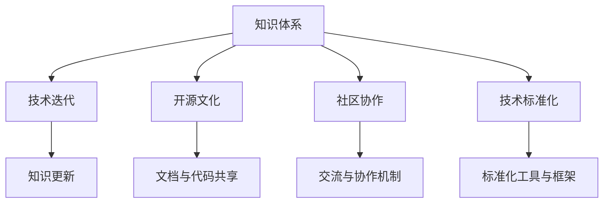

                 

# 跨代知识传承：bridging the gap

> 关键词：跨代知识传承, 技术迭代, 开源文化, 社区协作, 技术标准化

## 1. 背景介绍

### 1.1 问题由来
在计算机科学的海洋中，知识的传承和技术的迭代是永恒的主题。随着技术日新月异的发展，新的理念和工具不断涌现，如何有效地将这些创新成果传递给新一代工程师，成为一个重要且紧迫的课题。由于时间跨度的延长和信息孤岛的增多，技术知识在代际之间的传承面临着诸多挑战：知识断层、协作不足、标准化困难等。这些问题不仅影响了企业技术栈的稳定性和可维护性，也对新员工的成长和创新能力的培养形成了阻碍。

### 1.2 问题核心关键点
跨代知识传承的核心在于确保知识体系在时间、空间、人群中的连续性和可传递性。核心概念包括：

- **知识体系**：包括技术原理、最佳实践、工具和框架等。
- **技术迭代**：技术不断演进，旧知识逐步淘汰，新知识不断涌现。
- **开源文化**：开源社区通过文档、代码和交流推动知识的共享和传播。
- **社区协作**：技术社区通过交流、贡献、协作构建跨代知识传承的网络。
- **技术标准化**：通过标准和规范，统一技术表述和操作，确保知识的可靠性和一致性。

## 2. 核心概念与联系

### 2.1 核心概念概述

为更好地理解跨代知识传承，本节将介绍几个密切相关的核心概念：

- **知识体系**：指围绕特定技术领域所形成的系统性知识结构，包括原理、应用、工具等。
- **技术迭代**：指技术在不断演进过程中，旧知识逐步淘汰，新知识不断涌现的现象。
- **开源文化**：指开源社区通过贡献、协作、文档等手段，推动技术知识的共享和传播。
- **社区协作**：指技术社区通过交流、贡献、协作构建跨代知识传承的网络。
- **技术标准化**：指通过标准和规范，统一技术表述和操作，确保知识的可靠性和一致性。

这些核心概念之间的逻辑关系可以通过以下Mermaid流程图来展示：



这个流程图展示了大语言模型的核心概念及其之间的关系：

1. 知识体系在技术迭代中不断更新。
2. 开源文化通过文档与代码共享，促进知识传播。
3. 社区协作机制通过交流与协作，构建知识传承网络。
4. 技术标准化工具与框架确保知识的一致性与可靠性。

这些概念共同构成了跨代知识传承的框架，使得知识在时间、空间、人群中的连续性和可传递性得以保障。

## 3. 核心算法原理 & 具体操作步骤
### 3.1 算法原理概述

跨代知识传承的本质是通过有效的机制和手段，确保技术知识的连续性、一致性和可传递性。其主要原理包括：

- **知识库与文档**：建立系统性的知识库和文档，确保知识的集中和可检索。
- **版本控制**：使用版本控制系统跟踪技术演进，保证知识更新和回溯的可追溯性。
- **社区与交流**：构建活跃的技术社区，通过交流、贡献和协作，加速知识传播和应用。
- **标准化工具**：开发标准化的工具和框架，统一技术表述和操作，提升知识的一致性和可操作性。
- **培训与教育**：通过培训和教育，将新知识传递给新一代工程师，保障知识传承的连续性。

### 3.2 算法步骤详解

跨代知识传承一般包括以下几个关键步骤：

**Step 1: 构建知识库与文档**

- 将现有的技术知识整理成系统性的文档和代码库，确保知识的集中和可检索。
- 定期更新文档和代码库，保证知识的时效性和准确性。
- 分类整理文档，形成结构化的知识体系，方便新员工和项目经理快速定位和理解知识。

**Step 2: 使用版本控制**

- 引入版本控制系统（如Git），跟踪技术演进。
- 定期发布新版本和更新，确保知识更新和回溯的可追溯性。
- 设定变更审批流程，保证变更的合理性和一致性。

**Step 3: 建立社区与交流**

- 构建活跃的技术社区，如Slack、GitHub等，方便成员交流、协作。
- 定期组织线上线下交流活动，如Meetup、Hackathon等，促进知识传播和创新。
- 设立贡献激励机制，鼓励成员贡献代码和文档。

**Step 4: 开发标准化工具**

- 开发标准化的工具和框架，如代码审查工具、文档生成工具等，提升知识的一致性和可操作性。
- 推广标准化的工具和框架，促进知识共享和应用。
- 定期更新和优化工具，确保工具的适应性和效率。

**Step 5: 实施培训与教育**

- 通过培训和教育，将新知识传递给新一代工程师。
- 设计系统化的培训课程，涵盖技术原理、最佳实践、工具和框架等。
- 提供实践机会，如代码审查、项目实战等，增强新员工的技术能力和经验。

### 3.3 算法优缺点

跨代知识传承的优势在于：

1. **知识集中**：通过集中管理和维护知识库和文档，方便新员工和项目经理快速定位和理解知识。
2. **可追溯性**：使用版本控制系统，确保知识更新和回溯的可追溯性。
3. **协作便捷**：通过社区和交流平台，促进知识传播和创新。
4. **标准化一致**：通过标准化工具和框架，提升知识的一致性和可操作性。
5. **快速传递**：通过培训和教育，快速将新知识传递给新一代工程师。

其局限性包括：

1. **知识更新压力**：需要定期更新知识库和文档，保证知识的时效性和准确性。
2. **社区活跃度**：需要持续维护社区活跃度，促进知识传播和创新。
3. **标准化难度**：开发和推广标准化工具和框架，可能遇到技术挑战。
4. **培训成本**：系统化的培训和教育需要投入大量人力和资源。

尽管存在这些局限性，但就目前而言，跨代知识传承方法仍是确保技术知识连续性、一致性和可传递性的主流范式。未来相关研究的重点在于如何进一步降低知识传承的复杂性和成本，提高知识更新的效率和一致性。

### 3.4 算法应用领域

跨代知识传承技术在多个领域得到了广泛的应用，例如：

- **软件开发**：通过代码库、文档、社区交流等方式，促进技术知识的共享和传播。
- **数据科学**：建立数据湖和知识库，推动数据科学领域的知识更新和应用。
- **机器学习**：通过开源社区、论文、代码等方式，加速新算法的研发和应用。
- **云平台**：通过文档、社区交流、标准化工具等方式，促进云服务知识的传播和应用。
- **区块链**：通过区块链平台，构建透明、可追溯的技术知识传承体系。

除了上述这些经典领域外，跨代知识传承还将在更多领域得到应用，为技术创新和产业发展提供新的驱动力。

## 4. 数学模型和公式 & 详细讲解
### 4.1 数学模型构建

本节将使用数学语言对跨代知识传承的数学模型进行更加严格的刻画。

记知识库中某项知识的状态为 $K_t$，其中 $t$ 表示时间，知识状态由知识库内容、版本控制记录、社区交流活动等构成。定义知识状态的变化规则为：

$$
K_{t+1} = f(K_t, C_t, D_t)
$$

其中 $f$ 表示知识状态的变化函数，$C_t$ 表示社区交流活动，$D_t$ 表示版本控制记录。

知识状态的优化目标为：

$$
\min_{K_t} \mathcal{L}(K_t, O_t)
$$

其中 $\mathcal{L}$ 表示知识库状态与实际需求之间的损失函数，$O_t$ 表示知识库的状态需求。

### 4.2 公式推导过程

以下我们以软件开发领域为例，推导版本控制系统的优化目标。

假设知识库中某项知识的状态为 $K_t$，版本控制系统的记录为 $V_t$，社区交流活动为 $C_t$。知识库状态的变化规则为：

$$
K_{t+1} = f(K_t, V_t, C_t)
$$

其中 $f$ 表示知识库状态的变化函数，$V_t$ 表示版本控制记录，$C_t$ 表示社区交流活动。

知识状态的优化目标为：

$$
\min_{K_t} \mathcal{L}(K_t, O_t)
$$

其中 $\mathcal{L}$ 表示知识库状态与实际需求之间的损失函数，$O_t$ 表示知识库的状态需求。

在实践中，我们通常使用基于梯度的优化算法（如SGD、Adam等）来近似求解上述最优化问题。设 $\eta$ 为学习率，则参数的更新公式为：

$$
K_t \leftarrow K_t - \eta \nabla_{K_t}\mathcal{L}(K_t)
$$

其中 $\nabla_{K_t}\mathcal{L}(K_t)$ 为损失函数对知识库状态的梯度，可通过反向传播算法高效计算。

### 4.3 案例分析与讲解

**案例分析：开放源代码项目的版本控制优化**

考虑一个开源项目，其知识库状态 $K_t$ 包括项目代码、文档和社区交流记录。版本控制系统的记录 $V_t$ 包括提交历史、分支合并记录等。社区交流活动 $C_t$ 包括线上讨论、代码审查等。

优化目标为：

$$
\min_{K_t} \mathcal{L}(K_t, O_t)
$$

其中 $\mathcal{L}$ 为知识库状态与项目需求的损失函数，$O_t$ 为项目需求。

例如，在代码质量方面，可以使用代码覆盖率、测试通过率等指标，作为损失函数的一部分。在文档质量方面，可以使用文档的清晰度、完整度等指标，作为损失函数的一部分。在社区交流方面，可以使用代码审查的效率、讨论的活跃度等指标，作为损失函数的一部分。

通过优化上述目标函数，可以不断提升项目知识库的状态，确保知识库的质量和时效性。同时，社区交流活动和版本控制记录也应定期更新，以保证知识库的连续性和可追溯性。

## 5. 项目实践：代码实例和详细解释说明
### 5.1 开发环境搭建

在进行跨代知识传承实践前，我们需要准备好开发环境。以下是使用Python进行Git开发的开发环境配置流程：

1. 安装Git：从官网下载并安装Git。
2. 创建并激活虚拟环境：
```bash
conda create -n git-env python=3.8 
conda activate git-env
```

3. 安装GitHub Desktop：从官网下载安装GitHub Desktop，用于管理Git仓库。
4. 安装GitHub CLI：从官网下载安装GitHub CLI，用于命令行操作Git仓库。

完成上述步骤后，即可在`git-env`环境中开始跨代知识传承实践。

### 5.2 源代码详细实现

下面以Git仓库管理为例，给出使用Git进行知识库管理的Python代码实现。

首先，定义仓库状态管理函数：

```python
import git

def initialize_repository(name):
    repo = git.Repo.init(name=name)
    return repo

def commit_changes(repo, message):
    repo.git.add('.')
    repo.git.commit(m=message)

def push_changes(repo):
    repo.git.push()
```

然后，使用上述函数实现基本操作：

```python
# 初始化仓库
repo = initialize_repository('my-project')

# 提交代码
commit_changes(repo, 'Initial commit')

# 推送代码
push_changes(repo)
```

代码解读与分析：

**initialize_repository函数**：
- 初始化Git仓库，创建空的Git仓库目录。

**commit_changes函数**：
- 添加仓库中的所有修改，提交代码更改。
- 使用自定义的消息进行提交。

**push_changes函数**：
- 将本地仓库的代码推送到远程仓库。

可以看到，使用Python管理Git仓库，可以方便地实现代码的提交、推送等基本操作，从而保障知识库的更新和维护。

## 6. 实际应用场景
### 6.1 软件开发

跨代知识传承在软件开发领域具有广泛的应用。通过版本控制系统（如Git）、代码库、文档库、社区交流平台等方式，可以有效地传递和更新技术知识。

具体而言，可以建立系统的代码库和文档库，记录代码变更和文档更新。使用Git等版本控制系统，跟踪代码变更的历程，确保代码的可追溯性和一致性。通过社区交流平台（如GitHub、Slack等），促进成员之间的交流和协作，加速知识传播和创新。同时，定期组织线上线下活动，如Meetup、Hackathon等，进一步促进知识共享和应用。

### 6.2 数据科学

数据科学领域同样受益于跨代知识传承。建立数据湖和知识库，记录数据处理、模型训练、数据可视化等流程。使用版本控制系统（如DVC），记录数据和模型的变更历程。通过社区交流平台（如Kaggle、DataHackathon等），促进数据科学家之间的交流和协作，加速知识传播和创新。定期组织线上线下活动，如Meetup、Kaggle竞赛等，进一步促进知识共享和应用。

### 6.3 机器学习

机器学习领域同样需要跨代知识传承。建立模型库和文档库，记录模型训练、调参、评估等流程。使用版本控制系统（如MLflow），记录模型的变更历程。通过社区交流平台（如Kaggle、MLconf等），促进机器学习工程师之间的交流和协作，加速知识传播和创新。定期组织线上线下活动，如Meetup、MLconf等，进一步促进知识共享和应用。

### 6.4 未来应用展望

随着跨代知识传承技术的不断发展，未来将在更多领域得到应用，为技术创新和产业发展提供新的驱动力。

在智慧医疗领域，通过构建知识库和文档库，促进医疗知识和技能传承。建立医疗社区和交流平台，促进医生之间的交流和协作，加速医疗知识的传播和创新。定期组织线上线下活动，如医学研讨会、病例分享等，进一步促进知识共享和应用。

在智能教育领域，通过构建知识库和文档库，促进教育知识和技能传承。建立教育社区和交流平台，促进教师和学生的交流和协作，加速教育知识的传播和创新。定期组织线上线下活动，如教育研讨会、在线课程等，进一步促进知识共享和应用。

在智慧城市治理中，通过构建知识库和文档库，促进城市管理和运营知识传承。建立城市管理和运营社区和交流平台，促进城市管理者之间的交流和协作，加速城市管理知识的传播和创新。定期组织线上线下活动，如城市管理研讨会、城市运营案例分享等，进一步促进知识共享和应用。

此外，在企业生产、社会治理、文娱传媒等众多领域，跨代知识传承技术也将不断涌现，为经济社会发展注入新的动力。相信随着技术的日益成熟，跨代知识传承必将成为技术知识连续性、一致性和可传递性的重要保障，推动人工智能技术在各行各业的规模化落地。

## 7. 工具和资源推荐
### 7.1 学习资源推荐

为了帮助开发者系统掌握跨代知识传承的理论基础和实践技巧，这里推荐一些优质的学习资源：

1. **《版本控制与软件工程》书籍**：深入浅出地介绍了版本控制系统的原理和应用，是掌握Git等版本控制工具的必备读物。

2. **GitHub官方文档**：GitHub作为最流行的版本控制平台之一，其官方文档详细介绍了GitHub的功能和使用方法，是学习Git版本控制的重要参考。

3. **GitHub Actions官方文档**：GitHub Actions是GitHub提供的工作流程自动化平台，通过官方文档可以快速上手并掌握GitHub Actions的用法。

4. **Kaggle竞赛和社区**：Kaggle是全球最大的数据科学竞赛平台，通过参与竞赛和社区交流，可以迅速提升数据科学家的技能和知识。

5. **MLconf会议**：MLconf是全球机器学习领域的重要会议之一，通过参加会议和研讨会，可以了解最新的机器学习技术和应用。

通过对这些资源的学习实践，相信你一定能够快速掌握跨代知识传承的精髓，并用于解决实际的NLP问题。

### 7.2 开发工具推荐

高效的开发离不开优秀的工具支持。以下是几款用于跨代知识传承开发的常用工具：

1. **Git**：Git是最流行的版本控制系统之一，支持分布式版本控制，方便代码的提交、推送和回滚。
2. **GitHub**：GitHub是全球最大的代码托管平台之一，提供丰富的协作和版本控制功能。
3. **GitHub Actions**：GitHub Actions是GitHub提供的工作流程自动化平台，支持自动化代码构建、测试和部署。
4. **Jupyter Notebook**：Jupyter Notebook是一种交互式编程环境，支持代码、数学公式和文档的混合编写。
5. **Kaggle**：Kaggle是全球最大的数据科学竞赛平台，提供丰富的数据集和社区交流功能。

合理利用这些工具，可以显著提升跨代知识传承任务的开发效率，加快创新迭代的步伐。

### 7.3 相关论文推荐

跨代知识传承技术的发展源于学界的持续研究。以下是几篇奠基性的相关论文，推荐阅读：

1. **《版本控制系统的设计与实现》论文**：详细介绍了Git等版本控制系统的设计和实现原理，是理解版本控制技术的经典之作。

2. **《知识库与文档管理系统》论文**：探讨了知识库和文档管理系统的构建方法，提出了一些先进的设计思路和实践经验。

3. **《开源社区的知识传播与协作》论文**：研究了开源社区的知识传播和协作机制，提出了一些有效的促进知识传播的方法。

4. **《技术标准化工具的研究与实践》论文**：介绍了一些标准化的工具和框架，如代码审查工具、文档生成工具等，提升了技术知识的一致性和可操作性。

这些论文代表了大语言模型微调技术的发展脉络。通过学习这些前沿成果，可以帮助研究者把握学科前进方向，激发更多的创新灵感。

## 8. 总结：未来发展趋势与挑战
### 8.1 总结

本文对跨代知识传承方法进行了全面系统的介绍。首先阐述了跨代知识传承的研究背景和意义，明确了知识体系在时间、空间、人群中的连续性和可传递性的重要性。其次，从原理到实践，详细讲解了跨代知识传承的数学原理和关键步骤，给出了跨代知识传承任务开发的完整代码实例。同时，本文还广泛探讨了跨代知识传承方法在软件开发、数据科学、机器学习等多个行业领域的应用前景，展示了跨代知识传承范式的巨大潜力。此外，本文精选了跨代知识传承技术的各类学习资源，力求为读者提供全方位的技术指引。

通过本文的系统梳理，可以看到，跨代知识传承方法在技术迭代、开源文化、社区协作、技术标准化等方面发挥了重要作用，确保了技术知识的连续性、一致性和可传递性。未来，伴随知识库的持续更新、社区交流的日益活跃、标准化工具的不断推广，跨代知识传承必将成为技术知识连续性、一致性和可传递性的重要保障，推动人工智能技术在各行各业的规模化落地。

### 8.2 未来发展趋势

展望未来，跨代知识传承技术将呈现以下几个发展趋势：

1. **知识库的智能化**：通过自然语言处理等技术，将知识库转化为智能化的信息检索和知识推荐系统，进一步提升知识检索和获取的效率。
2. **社区交流的自动化**：引入聊天机器人等自动化工具，提升社区交流的效率和质量。
3. **版本控制的分布式化**：引入分布式版本控制系统，支持多地协同开发和版本控制。
4. **知识传播的可视化**：通过可视化工具，展示知识传播和应用的路径和效果，帮助社区成员更好地理解知识传承的过程。
5. **知识传播的标准化**：建立知识传播的标准和规范，提升知识传播的一致性和规范性。

这些趋势凸显了跨代知识传承技术的广阔前景。这些方向的探索发展，必将进一步提升技术知识的连续性、一致性和可传递性，推动技术创新和产业发展。

### 8.3 面临的挑战

尽管跨代知识传承技术已经取得了瞩目成就，但在迈向更加智能化、普适化应用的过程中，它仍面临着诸多挑战：

1. **知识库的维护成本**：知识库的持续更新和维护需要大量的人力和资源投入。
2. **社区活跃度的维持**：社区成员的活跃度和参与度直接影响知识传播的效率。
3. **知识传播的规范性**：知识传播的标准和规范可能存在不统一和不一致的问题，影响知识传播的一致性。
4. **版本控制的复杂性**：版本控制系统的复杂性可能影响开发和协作的效率。
5. **工具的易用性**：工具的使用复杂性可能影响开发者的使用体验和知识传播的效率。

尽管存在这些挑战，但就目前而言，跨代知识传承方法仍是确保技术知识连续性、一致性和可传递性的主流范式。未来相关研究的重点在于如何进一步降低知识传承的复杂性和成本，提高知识更新的效率和一致性。

### 8.4 研究展望

面对跨代知识传承面临的种种挑战，未来的研究需要在以下几个方面寻求新的突破：

1. **知识库的自动化管理**：开发自动化工具和算法，如自然语言处理、知识图谱等，实现知识库的智能化和自动化管理。
2. **社区交流的自动化工具**：引入自动化工具，如聊天机器人、知识图谱等，提升社区交流的效率和质量。
3. **版本控制的分布式系统**：开发分布式版本控制系统，支持多地协同开发和版本控制。
4. **知识传播的标准化工具**：建立知识传播的标准和规范，提升知识传播的一致性和规范性。
5. **工具的易用性和效率**：优化工具的设计和使用流程，提升工具的易用性和效率。

这些研究方向将推动跨代知识传承技术的进一步发展，确保技术知识的连续性、一致性和可传递性，为技术创新和产业发展提供新的驱动力。

## 9. 附录：常见问题与解答
----------------------------------------------------------------

**Q1: 跨代知识传承是否适用于所有技术领域？**

A: 跨代知识传承方法适用于大多数技术领域，特别是那些依赖大量代码和文档的领域。但对于一些非结构化数据的领域，如艺术创作、人类学研究等，可能需要采用其他方式进行知识传承。

**Q2: 如何选择适合的知识库和版本控制系统？**

A: 选择适合的知识库和版本控制系统需要考虑多个因素，包括项目的规模、团队的大小、代码和文档的复杂度等。一般来说，Git是最流行的版本控制系统之一，支持分布式版本控制，适合大多数项目。对于大型项目，可以考虑使用GitHub等托管平台，提供丰富的协作和版本控制功能。

**Q3: 如何提高社区交流的活跃度？**

A: 提高社区交流的活跃度需要从多个方面入手，包括建立交流机制、提供激励措施、定期组织活动等。例如，可以在社区中设立贡献排行榜，对活跃的贡献者进行表彰和奖励。定期组织线上线下活动，如Meetup、Hackathon等，促进成员之间的交流和协作。

**Q4: 如何确保知识库的质量和时效性？**

A: 确保知识库的质量和时效性需要定期进行审查和更新。可以设立知识库管理员，负责审核和更新知识库内容。同时，可以引入自动化工具，如文档生成工具、代码审查工具等，提升知识库的维护效率和质量。

**Q5: 如何处理知识库的冗余和过时问题？**

A: 知识库的冗余和过时问题是知识库维护过程中常见的问题。可以通过定期审查和清理知识库内容，消除冗余和不相关的信息。同时，可以引入知识库版本控制系统，记录知识库的历史变更，方便回溯和清理。

通过对这些问题的解答，可以帮助开发者更好地理解跨代知识传承的实践方法和技巧，提升跨代知识传承的效率和效果。

