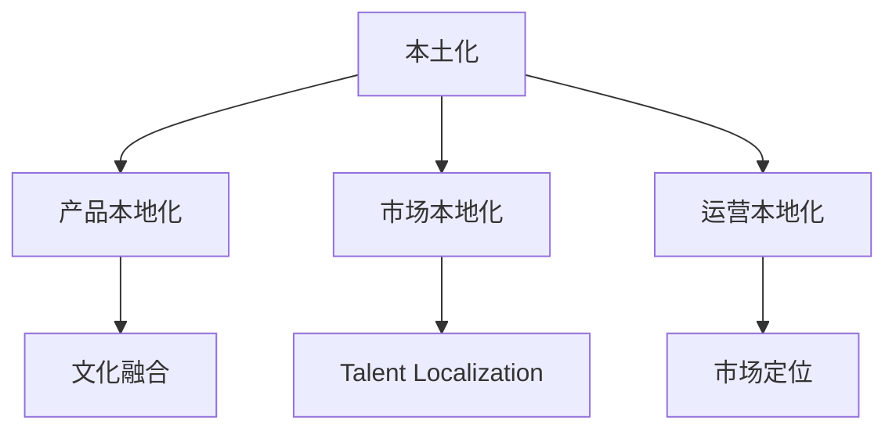

                 

# 跨国公司在硅谷的本土化之路

跨国公司在全球化的浪潮中，如何将各地的资源和优势整合，实现国际化的拓展，同时又能保持本土化运营的灵活性和创新性，是很多公司的长期课题。硅谷作为全球创新中心，充满了独特的机会和挑战。对于跨国公司而言，在硅谷实现本土化，不仅仅是地理上的接近，更是文化和商业逻辑的融合。本文将系统性地探讨跨国公司在硅谷本土化过程中的核心策略和挑战，并提供一些有价值的见解和建议。

## 1. 背景介绍

### 1.1 硅谷的独特地位

硅谷，位于美国加利福尼亚州旧金山湾区，是全球高科技产业的摇篮。其独特的地理位置、丰富的人才资源、活跃的创业氛围和完善的产业生态，使其成为创新企业、大型科技公司以及全球顶级研究机构竞相角逐的焦点。

硅谷不仅吸引了Google、Apple、Facebook、AMD、NVIDIA、Intel等全球科技巨头，还孕育了无数初创企业，如Salesforce、Palantir、Cloudera等。这里集聚了世界顶尖的工程师、科学家和商业领袖，同时众多的风险投资机构和先进的技术设施，为其提供了肥沃的土壤。

### 1.2 跨国公司进入硅谷的背景

跨国公司进入硅谷，是基于全球化战略布局的必然选择。这些公司希望借助硅谷的创新能力、人才资源和市场渠道，加速自身的技术迭代和市场扩张。同时，通过硅谷的本土化运营，不仅能提升品牌影响力和企业文化认同度，还能获取本土用户需求和市场反馈，为全球业务的发展提供第一手数据和经验。

但硅谷并非一片沃土，其独特的文化和工作环境，对跨国公司的管理和运营提出了更高要求。跨国公司如何在硅谷实现本土化，既是商业挑战，也是文化融合的考验。

## 2. 核心概念与联系

### 2.1 核心概念概述

为了更好地理解跨国公司在硅谷本土化的过程，首先介绍几个关键概念：

- **本土化(Localization)**：指跨国公司在进入新市场时，采取的策略以适应当地文化和商业环境，包括产品本地化、市场本地化和运营本地化。

- **跨国化(Multinationalization)**：指跨国公司在全球范围内，通过建立供应链、研发中心、销售渠道等，实现资源和能力的全球整合。

- **文化融合(Cultural Fusion)**：指跨国公司在全球运营中，将不同国家的文化元素融合，形成共融的企业文化。

- **人才本地化(Talent Localization)**：指跨国公司通过本地招聘、培训和激励等手段，吸引和培养本地的优秀人才。

- **市场定位(Market Segmentation)**：指跨国公司对不同市场的用户需求进行细分，实施差异化的营销策略，满足本地消费者的偏好。

这些概念之间的逻辑关系可以通过以下Mermaid流程图来展示：



这个流程图展示了一些关键概念以及它们之间的相互关系：

1. 本土化是跨国公司进入新市场的核心策略。
2. 产品本地化、市场本地化和运营本地化是本土化的三大支柱。
3. 文化融合有助于构建统一的企业文化，使本地化运营更加顺畅。
4. 人才本地化是成功实施本土化的基础。
5. 市场定位决定不同市场的运营策略。

### 2.2 核心概念原理和架构

#### 2.2.1 产品本地化

产品本地化是指跨国公司针对特定市场的消费者需求和偏好，调整产品设计、功能和特性。这不仅包括产品本身的物理特征，如尺寸、颜色等，还涉及软件界面、用户手册、服务支持等方面。

在硅谷，产品本地化的核心在于理解本地用户的需求和痛点，并将其融入产品的设计中。这一过程通常包括市场调研、用户访谈、原型测试等环节，以确保产品功能符合本地市场预期。

#### 2.2.2 市场本地化

市场本地化是指跨国公司通过定价、渠道、促销等手段，确保产品和服务能够成功进入并适应当地市场。在硅谷，市场本地化意味着在产品发布、销售渠道、广告投放等方面，必须充分考虑硅谷本地市场的特点和习惯。

例如，一些跨国公司会在硅谷设立本地办事处，雇佣当地的销售和市场人员，与本地零售商和分销商建立合作关系，以优化产品分销和市场覆盖。

#### 2.2.3 运营本地化

运营本地化是指跨国公司在本地市场进行日常运营和管理的活动，包括招聘、培训、财务、人力资源等。在硅谷，运营本地化要求跨国公司不仅理解当地的法律法规、商业规则和文化习俗，还要建立本地的团队和管理架构。

例如，一些跨国公司会在硅谷设立独立的公司实体，独立运营，同时与母公司保持紧密的协作关系。

## 3. 核心算法原理 & 具体操作步骤

### 3.1 算法原理概述

本土化策略的实施，涉及多方面的管理和运营决策，包括产品设计、市场营销、人力资源管理等。这里通过一些典型决策，介绍其实现本土化的核心算法原理。

#### 3.1.1 产品本地化算法

产品本地化算法包括用户需求分析、功能选择、界面设计等，其实现过程如下：

1. **用户需求分析**：通过问卷调查、访谈、焦点小组等手段，收集本地用户对产品的需求和痛点。
2. **功能选择**：根据需求分析结果，确定产品的核心功能，去除冗余或不适用的功能。
3. **界面设计**：在用户界面设计中融入本地化元素，如使用本地语言、文化符号等。

#### 3.1.2 市场本地化算法

市场本地化算法包括定价策略、渠道选择、促销手段等，其实现过程如下：

1. **定价策略**：根据本地市场的消费能力和价格敏感度，确定合理的价格区间。
2. **渠道选择**：选择适合本地市场的销售渠道，如零售商、分销商、电商平台等。
3. **促销手段**：设计符合本地市场特点的促销活动，如折扣、礼品、广告等。

#### 3.1.3 运营本地化算法

运营本地化算法包括人力资源管理、财务管理、法律合规等，其实现过程如下：

1. **人力资源管理**：招聘本地员工，进行本地化培训，建立本地化的绩效评估和激励机制。
2. **财务管理**：按照本地会计标准进行账务处理，遵循当地税收法规。
3. **法律合规**：确保公司运营符合当地的法律法规，如劳动法、环保法、税法等。

### 3.2 算法步骤详解

#### 3.2.1 产品本地化步骤

1. **市场调研**：分析本地市场需求和用户行为，了解竞争对手产品情况。
2. **原型开发**：基于需求分析结果，开发产品原型，进行本地化测试。
3. **用户反馈**：收集用户对原型产品的反馈，进行迭代优化。
4. **正式发布**：经过多次迭代，正式发布产品，进行市场推广。

#### 3.2.2 市场本地化步骤

1. **市场分析**：分析本地市场规模、消费者偏好、竞争格局等。
2. **渠道布局**：选择合适的销售渠道和分销网络，建立本地营销渠道。
3. **推广活动**：设计符合本地市场特点的推广活动，吸引目标消费者。
4. **市场评估**：定期评估市场表现，调整营销策略。

#### 3.2.3 运营本地化步骤

1. **设立本地团队**：根据本地市场特点，组建本地运营团队，包括销售、市场、财务等岗位。
2. **培训本地员工**：提供本地化的培训课程，提高员工的技能和适应性。
3. **财务管理**：建立本地财务团队，遵循当地会计标准和税收法规。
4. **合规管理**：确保运营过程符合当地法律法规，规避法律风险。

### 3.3 算法优缺点

#### 3.3.1 产品本地化的优缺点

**优点**：
- 贴近本地市场需求，提升用户满意度。
- 增强产品竞争力，扩大市场份额。

**缺点**：
- 开发周期较长，成本较高。
- 本地化决策可能存在偏差，影响产品整体一致性。

#### 3.3.2 市场本地化的优缺点

**优点**：
- 快速进入本地市场，缩短产品上市时间。
- 通过本地渠道，提升品牌认知度和信任度。

**缺点**：
- 渠道选择不当，可能导致市场覆盖不足。
- 促销活动效果不佳，影响销售业绩。

#### 3.3.3 运营本地化的优缺点

**优点**：
- 降低运营成本，提高运营效率。
- 增强本地市场适应性，提高市场响应速度。

**缺点**：
- 本地化管理复杂，需要额外的管理资源。
- 文化差异可能导致沟通障碍，影响管理效率。

### 3.4 算法应用领域

基于以上本土化算法的框架，跨国公司在硅谷的本土化应用场景包括：

1. **消费电子**：如Apple、Samsung等公司，通过产品本地化和市场本地化，进入硅谷市场，成功拓展消费电子业务。
2. **金融科技**：如PayPal、Stripe等公司，在硅谷设立研发中心和销售办事处，快速响应本地市场需求。
3. **云计算**：如AWS、Google Cloud等公司，通过本地化运营和市场策略，深度渗透硅谷的科技企业。
4. **人工智能**：如OpenAI、DeepMind等公司，通过人才本地化和创新平台，吸引全球顶尖科研人才，实现技术突破。
5. **互联网服务**：如Facebook、Google、Amazon等公司，通过本地化团队和市场推广，扩大在硅谷的用户基础。

## 4. 数学模型和公式 & 详细讲解

### 4.1 数学模型构建

为了更好地理解本土化算法，我们将其抽象为一个数学模型。假设跨国公司有一款产品需要在硅谷进行本地化，记其原始价格为P，市场规模为M，市场渗透率为Pc。

设本地化后的价格为P'，市场规模为M'，市场渗透率为P'c。则有：

$$ P' = P(1 - K) $$

其中，K为本地化调整系数，$0 < K < 1$。

若本地化后的市场渗透率提升为P'c，则有：

$$ P'c = Pc(1 + \frac{K}{\alpha}) $$

其中，$\alpha$为市场渗透率提升系数，$0 < \alpha < 1$。

### 4.2 公式推导过程

根据上述公式，我们可以推导出本地化后产品的利润变化。

假设原始利润为R，则：

$$ R = P \cdot M \cdot Pc \cdot (1 - Pc) $$

本地化后的利润为R'，则：

$$ R' = P' \cdot M' \cdot P'c \cdot (1 - P'c) $$

将公式代入，得到：

$$ R' = P(1 - K) \cdot M' \cdot Pc(1 + \frac{K}{\alpha}) \cdot (1 - Pc(1 + \frac{K}{\alpha})) $$

化简得到：

$$ R' = P \cdot M \cdot Pc \cdot (1 - Pc) \cdot (1 - K)^{2} \cdot (1 + \frac{K}{\alpha})^{2} $$

可以看出，本地化调整系数K和市场渗透率提升系数$\alpha$对利润的影响是正向的。即适当的本地化调整，可以显著提升产品的市场渗透率和利润率。

### 4.3 案例分析与讲解

以Google Cloud为例，其在美国硅谷的本土化策略分析如下：

1. **市场调研**：Google通过市场调研，发现硅谷企业对云服务的需求快速增长，但本地竞争激烈。
2. **产品本地化**：Google Cloud针对硅谷市场推出了定制化的解决方案，如大数据分析、机器学习平台等。
3. **市场本地化**：Google在硅谷设立了销售办事处和渠道合作伙伴，增强了市场覆盖和用户渗透。
4. **运营本地化**：Google在硅谷招募本地人才，建立本地的技术支持和客户服务团队，提高运营效率。

Google Cloud的本地化策略，通过精确的产品定位和市场推广，成功吸引了大量本地客户，迅速扩大了市场份额，提升了品牌影响力。

## 5. 项目实践：代码实例和详细解释说明

### 5.1 开发环境搭建

为了在硅谷实现本土化，跨国公司通常需要搭建适合本地化开发的环境。这里以Google Cloud为例，介绍其在硅谷的开发环境搭建过程。

#### 5.1.1 云平台搭建

Google Cloud提供丰富的云服务资源，包括计算、存储、网络、安全等。通过搭建公有云或私有云平台，跨国公司可以快速部署应用，实现全球一体化运营。

#### 5.1.2 本地化部署

在硅谷，Google Cloud会使用Google数据中心提供的本地化资源，部署定制化的应用和数据处理系统。这些系统需要满足本地法规和网络安全要求，确保数据安全性和可用性。

### 5.2 源代码详细实现

#### 5.2.1 本地化配置

在Google Cloud中，本地化配置主要涉及以下几个方面：

1. **网络配置**：设置虚拟私有云(VPC)、子网、防火墙等网络资源。
2. **身份认证**：配置IAM角色和权限，确保用户身份和数据安全。
3. **数据备份**：实现本地数据备份和恢复机制，保障数据安全和完整性。

#### 5.2.2 本地化部署

本地化部署主要通过Google Cloud的Kubernetes Engine和App Engine等平台进行。以下是一个简单的部署示例：

```python
# 导入Google Cloud SDK
import google.cloud
from google.cloud import kubernetes

# 设置本地化部署参数
project = 'your-project-id'
zone = 'us-central1-b'
cluster_name = 'your-cluster-name'

# 创建Kubernetes集群
kubernetes_client = kubernetes.Client(project=project, zone=zone)
kubernetes_client.create_cluster(cluster_name)
```

#### 5.2.3 本地化测试

在本地化部署完成后，需要进行全面的测试。测试主要包括以下几个方面：

1. **功能测试**：测试本地化功能是否符合预期，如用户界面、数据处理、业务逻辑等。
2. **性能测试**：测试本地化系统的性能表现，如响应时间、吞吐量、并发能力等。
3. **安全测试**：测试本地化系统的安全性，如数据加密、访问控制、权限管理等。

### 5.3 代码解读与分析

在上述代码示例中，我们通过Google Cloud SDK实现了Kubernetes集群的创建。这些配置和操作，对于跨国公司而言，是进入硅谷市场的基础。

在实际操作中，还需要根据具体业务需求，进一步优化和细化本地化配置，确保系统的高可用性和稳定性。例如，在Google Cloud中，可以使用负载均衡、自动扩展、监控告警等工具，提高系统的可靠性和性能。

### 5.4 运行结果展示

在本地化部署完成后，通过Google Cloud的监控和日志系统，可以实时跟踪应用运行状态。以下是一个简化的监控示例：

```python
# 导入Google Cloud SDK
import google.cloud
from google.cloud import monitoring

# 设置监控参数
project = 'your-project-id'
monitoring_client = monitoring.Client(project=project)

# 查询应用运行指标
response = monitoring_client.list_resource_time_series(
    resource_uri='projects/your-project-id/locations/us-central1/b/your-cluster-name',
    filter='resource.type="container.googleapis.com/cluster" resource.labels.name="your-cluster-name"'
)

# 输出监控结果
print(response)
```

通过上述代码，可以实时监控集群资源使用情况，包括CPU、内存、磁盘等关键指标，确保本地化系统的正常运行。

## 6. 实际应用场景

### 6.1 智能制造

跨国公司在硅谷的本土化过程中，智能制造是一个典型的应用场景。通过在硅谷设立研发中心，结合本地的技术资源和市场需求，跨国公司可以推出更加符合硅谷用户需求的智能制造解决方案。

例如，德国宝马公司在硅谷设立了智能制造实验室，通过本地化设计和研发，推出了一系列符合本地市场需求的新产品，如无人驾驶汽车、智能工厂等。

### 6.2 金融科技

金融科技也是跨国公司硅谷本土化的一个重要方向。跨国公司通过在硅谷设立金融科技子公司，可以利用本地的金融资源和创新环境，提升金融产品的创新能力和市场竞争力。

例如，阿里巴巴在硅谷设立了金融科技子公司，通过本地化金融服务，提升在硅谷市场的影响力和用户认可度。阿里巴巴旗下的蚂蚁金服，在硅谷推出了支付、信贷、保险等金融服务，满足本地市场的多样化需求。

### 6.3 医疗健康

跨国公司在硅谷的本土化过程中，医疗健康也是一个重要的应用场景。通过在硅谷设立医疗健康研发中心，跨国公司可以结合本地的医疗资源和市场需求，推出更加符合本地用户需求的医疗健康解决方案。

例如，美国强生公司在硅谷设立了医疗健康研发中心，通过本地化设计和研发，推出了一系列符合本地市场需求的新产品，如智能医疗设备、个性化治疗方案等。

## 7. 工具和资源推荐

### 7.1 学习资源推荐

为了帮助跨国公司更好地了解硅谷本土化的核心策略，这里推荐一些优质的学习资源：

1. **《硅谷模式》**：详细介绍了硅谷的创新生态和成功案例，适合希望进入硅谷的跨国公司参考。
2. **《科技公司如何在硅谷成功》**：由多位硅谷创业者分享实战经验，适合跨国公司决策层和管理层阅读。
3. **Google Cloud官方文档**：提供了丰富的云服务文档和教程，适合跨国公司技术人员参考。

### 7.2 开发工具推荐

为了在硅谷顺利实施本土化策略，跨国公司需要选择适合的开发工具。这里推荐一些常用的工具：

1. **Google Cloud SDK**：用于Google Cloud的本地部署和管理，提供丰富的云服务支持。
2. **AWS CLI**：用于Amazon Web Services的本地部署和管理，提供强大的计算和存储能力。
3. **Docker**：用于容器化应用部署，方便跨国公司进行跨平台和跨环境的本地化测试和部署。

### 7.3 相关论文推荐

跨国公司实施硅谷本土化策略，需要深入理解硅谷的商业环境和文化背景。以下几篇相关论文，可以为跨国公司提供理论和实践的指导：

1. **《硅谷：从虚拟到现实》**：深入分析硅谷的创新文化和发展历程。
2. **《跨国公司的全球化与本土化策略》**：研究跨国公司在全球市场的运营和管理策略。

## 8. 总结：未来发展趋势与挑战

### 8.1 总结

本文系统性地探讨了跨国公司在硅谷本土化的核心策略和实施路径。通过详细的分析，我们展示了跨国公司在产品本地化、市场本地化和运营本地化等方面的实践经验，揭示了硅谷本土化的成功要素。

### 8.2 未来发展趋势

展望未来，硅谷本土化将呈现以下几个发展趋势：

1. **智能化和数字化**：随着云计算、大数据、人工智能等技术的进步，跨国公司将更多地依赖数字化手段，实现智能化的管理和运营。
2. **本地化人才引进**：跨国公司将进一步加大对本地人才的引进和培养力度，提升本地化团队的专业水平和适应性。
3. **多元化创新平台**：跨国公司将在硅谷设立更多的创新平台，吸引全球顶尖的科技人才和创业团队，推动技术创新。
4. **跨文化融合**：跨国公司将更加注重跨文化管理，建立多元化的企业文化，促进团队协作和创新。

### 8.3 面临的挑战

尽管硅谷本土化带来了诸多机遇，但在实施过程中仍面临一些挑战：

1. **文化差异**：跨国公司需要适应硅谷独特的企业文化和商业逻辑，可能需要较长的适应期。
2. **人才招募和培训**：本地化人才的招募和培养成本较高，跨国公司需要构建完善的培训和激励机制。
3. **市场竞争**：硅谷市场的竞争异常激烈，跨国公司需要具有较强的市场竞争力和产品创新能力。
4. **法律法规**：硅谷的法律法规较为复杂，跨国公司需要具备较强的法律合规能力，避免潜在的法律风险。

### 8.4 研究展望

为了应对未来挑战，跨国公司需要不断优化硅谷本土化的策略和实践，提升本土化管理水平。以下是一些有待研究的方向：

1. **跨文化管理**：如何更好地处理跨国公司和本地团队之间的文化差异，建立高效的沟通和协作机制。
2. **人才招聘和培养**：如何构建高效的人才招聘和培训体系，提升本地团队的专业水平和适应性。
3. **市场定位和策略**：如何在不同市场进行差异化的本土化策略设计，满足本地用户需求。
4. **法律合规和风险管理**：如何有效识别和管理潜在的法律风险，确保合规运营。

总之，硅谷本土化是一项复杂而富有挑战性的任务，需要跨国公司具备战略眼光和执行能力。只有通过不断的优化和调整，才能在硅谷实现成功本土化，获得更大的市场和业务机会。

---

作者：禅与计算机程序设计艺术 / Zen and the Art of Computer Programming

