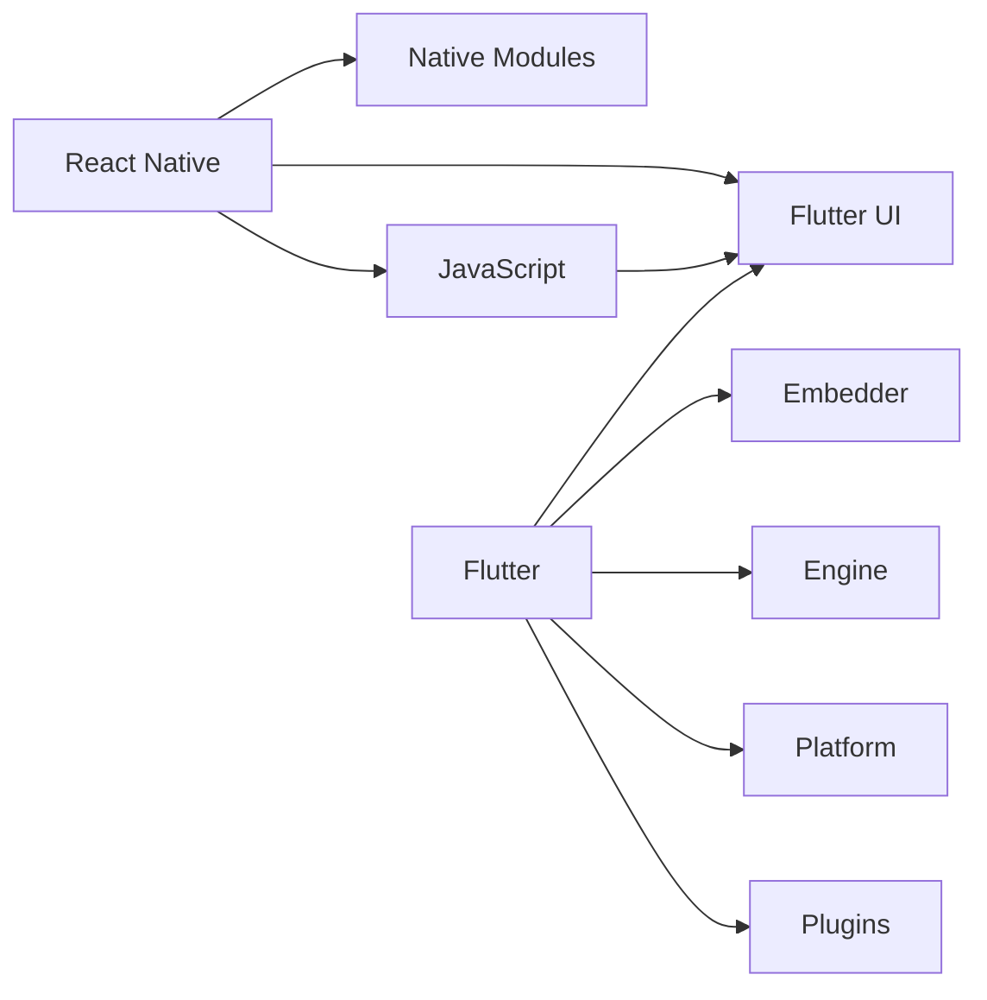

                 

# 跨平台移动开发：React Native vs Flutter

> 关键词：跨平台移动开发，React Native, Flutter, 性能优化, 开发效率, 生态系统

## 1. 背景介绍

随着移动互联网的迅猛发展，跨平台移动开发变得越来越重要。传统的原生开发方式难以适应快速迭代的市场需求，而跨平台开发框架则能够帮助开发者在多个平台上复用代码，提高开发效率，缩短项目周期。React Native和Flutter是目前市面上最为流行的两大跨平台开发框架，本文将对这两种技术进行详细对比，分析它们的优缺点，探讨在实际应用中应如何进行选择。

## 2. 核心概念与联系

### 2.1 核心概念概述

**React Native**和**Flutter**都是流行的跨平台移动开发框架，它们各自有着不同的特点和优劣势。为了更好地理解这两种框架，我们需要从多个维度去深入分析它们的核心概念。

**React Native**是由Facebook开发的移动开发框架，它使用JavaScript和React构建用户界面，并可以运行在iOS和Android平台上。

**Flutter**是由Google开发的新一代跨平台移动开发框架，它基于Dart语言，可以生成高质量的本地代码，实现接近原生应用的性能表现。

### 2.2 核心概念原理和架构的 Mermaid 流程图



这个图表展示了React Native和Flutter的基本架构和关键组件。

## 3. 核心算法原理 & 具体操作步骤

### 3.1 算法原理概述

React Native和Flutter的底层算法原理有所不同，但它们都遵循相同的跨平台开发思想，即通过虚拟DOM（React Native）或渲染引擎（Flutter）将代码编译为原生代码，从而实现跨平台应用开发。

#### 3.1.1 React Native

React Native使用虚拟DOM来管理UI组件的渲染和更新，通过将React的组件和布局逻辑与原生组件桥接，实现跨平台应用。虚拟DOM的运行机制包括组件树构建、差异化更新、原生桥接和布局优化等。

#### 3.1.2 Flutter

Flutter则使用自己的渲染引擎，通过生成高性能的本地代码来驱动UI组件的更新和渲染。Flutter的渲染引擎包括渲染队列、合成层、GPU加速等，可以实现接近原生应用的性能表现。

### 3.2 算法步骤详解

#### 3.2.1 React Native

1. **组件构建**：在React Native中，开发者可以使用React的组件库来构建UI界面，这些组件会根据React的规则自动转换为原生组件。
2. **组件桥接**：React Native使用原生桥接器来处理组件与原生UI之间的交互，确保组件的性能和可访问性。
3. **虚拟DOM操作**：React Native使用虚拟DOM来管理UI组件的更新和渲染，通过差异化更新算法，减少不必要的组件重绘，提高性能。
4. **原生桥接和渲染**：React Native将虚拟DOM转换回原生组件，并使用原生渲染引擎进行渲染，确保UI的流畅性和性能。

#### 3.2.2 Flutter

1. **组件构建**：在Flutter中，开发者可以使用Dart语言和Flutter的组件库来构建UI界面，这些组件使用Dart的语法和组件机制。
2. **渲染引擎操作**：Flutter使用自己的渲染引擎，通过将组件转换为二进制数据流，生成高质量的本地代码。
3. **合成层**：Flutter的合成层负责管理渲染队列和合成过程，确保UI组件的快速更新和渲染。
4. **GPU加速**：Flutter利用GPU进行硬件加速，进一步提高UI渲染的性能和响应速度。

### 3.3 算法优缺点

#### 3.3.1 React Native

**优点**：
- 生态系统和社区活跃：React Native拥有庞大的社区和丰富的第三方库，可以快速开发和调试应用。
- 性能优化能力强：通过虚拟DOM的差异化更新和原生桥接，React Native在性能方面表现良好。
- 热更新能力强：React Native支持热更新，能够在不重启应用的情况下更新代码。

**缺点**：
- 性能受原生桥接影响：由于React Native需要通过原生桥接器处理UI组件的渲染和交互，因此性能可能会受到一定的影响。
- 跨平台性能不一致：由于不同平台的UI组件和渲染机制不同，React Native的应用在跨平台性能上可能存在差异。

#### 3.3.2 Flutter

**优点**：
- 性能接近原生应用：通过生成高性能的本地代码，Flutter在性能上接近原生应用，能够提供流畅的UI体验。
- 组件复用能力强：Flutter的组件可以通过Dart语言进行复用，减少代码冗余，提高开发效率。
- 跨平台一致性高：由于使用统一的渲染引擎和平台无关的代码，Flutter的应用在跨平台性能上表现一致。

**缺点**：
- 生态系统和社区活跃度较低：Flutter相对较新的技术，生态系统和社区活跃度较低。
- 学习曲线较陡峭：由于使用了Dart语言，Flutter的学习曲线相对较陡峭，需要一定的技术积累。
- 性能优化空间有限：尽管性能表现优异，但在复杂应用中，Flutter的性能优化空间可能受到限制。

### 3.4 算法应用领域

#### 3.4.1 React Native

React Native适用于需要快速开发和迭代的应用，如Web应用、移动应用、桌面应用等。它特别适合需要大量UI组件的应用，如电商、社交、游戏等。

#### 3.4.2 Flutter

Flutter适用于对性能和用户体验要求较高的应用，如高性能游戏、复杂的移动应用、AR/VR应用等。它特别适合需要多平台一致性的应用，如企业级应用、物联网应用等。

## 4. 数学模型和公式 & 详细讲解 & 举例说明

### 4.1 数学模型构建

**React Native**和**Flutter**的数学模型基于各自的核心算法原理构建。

#### 4.1.1 React Native

React Native的数学模型主要涉及虚拟DOM的构建和差异化更新算法，可以通过以下公式表示：

$$
\text{VirtualDOM} = f(\text{ReactComponent}, \text{NativeBridge}, \text{LayoutOptimization})
$$

其中，$\text{ReactComponent}$表示React组件，$\text{NativeBridge}$表示原生桥接，$\text{LayoutOptimization}$表示布局优化。

#### 4.1.2 Flutter

Flutter的数学模型主要涉及渲染引擎的生成和渲染算法，可以通过以下公式表示：

$$
\text{RenderEngine} = f(\text{DartComponent}, \text{RenderEngine}, \text{GPUAcceleration})
$$

其中，$\text{DartComponent}$表示Dart组件，$\text{RenderEngine}$表示渲染引擎，$\text{GPUAcceleration}$表示GPU加速。

### 4.2 公式推导过程

#### 4.2.1 React Native

React Native的虚拟DOM构建和差异化更新算法较为复杂，涉及多个步骤，包括组件树构建、虚拟DOM更新和原生桥接等。具体的推导过程可以参考React的官方文档和相关学术论文。

#### 4.2.2 Flutter

Flutter的渲染引擎生成和渲染算法涉及GPU加速和合成层等多个组件，可以通过以下公式表示：

$$
\text{RenderQueue} = f(\text{RenderEngine}, \text{GPUAcceleration}, \text{RenderingLayer})
$$

其中，$\text{RenderEngine}$表示渲染引擎，$\text{GPUAcceleration}$表示GPU加速，$\text{RenderingLayer}$表示渲染层。

### 4.3 案例分析与讲解

#### 4.3.1 React Native

React Native在电商应用中的性能优化案例：

1. **虚拟DOM优化**：React Native使用虚拟DOM来管理UI组件的渲染和更新，通过差异化更新算法，减少不必要的组件重绘，提高性能。
2. **原生桥接优化**：React Native使用原生桥接器处理UI组件的渲染和交互，通过桥接优化，减少桥接时的性能损耗。
3. **布局优化**：React Native使用布局优化算法，避免频繁的重绘和布局计算，提高渲染效率。

#### 4.3.2 Flutter

Flutter在游戏应用中的性能优化案例：

1. **高性能渲染引擎**：Flutter使用自己的渲染引擎，通过生成高性能的本地代码，实现接近原生应用的性能表现。
2. **GPU加速优化**：Flutter利用GPU进行硬件加速，进一步提高UI渲染的性能和响应速度。
3. **合成层优化**：Flutter的合成层负责管理渲染队列和合成过程，确保UI组件的快速更新和渲染。

## 5. 项目实践：代码实例和详细解释说明

### 5.1 开发环境搭建

#### 5.1.1 React Native

1. **安装Node.js和npm**：React Native需要Node.js和npm环境，可以通过官网下载安装。
2. **安装React Native CLI**：在命令行中执行`npm install -g react-native-cli`安装React Native CLI。
3. **配置Android和iOS开发环境**：在iOS和Android上配置开发环境，安装Android Studio和Xcode等工具。

#### 5.1.2 Flutter

1. **安装Flutter SDK**：从Flutter官网下载并安装Flutter SDK。
2. **安装Android Studio和Xcode**：在Android和iOS上配置开发环境。
3. **安装Flutter命令行工具**：在命令行中执行`flutter create myapp`创建项目，并按照提示安装所需依赖。

### 5.2 源代码详细实现

#### 5.2.1 React Native

```javascript
// React Native代码示例
import React, { Component } from 'react';
import { Text, View, TouchableOpacity } from 'react-native';

class MyComponent extends Component {
  render() {
    return (
      <View style={{ flex: 1, alignItems: 'center', justifyContent: 'center' }}>
        <Text>Hello, World!</Text>
        <TouchableOpacity onPress={() => console.log('Button clicked')}>
          <Text>Click me!</Text>
        </TouchableOpacity>
      </View>
    );
  }
}

export default MyComponent;
```

#### 5.2.2 Flutter

```dart
// Flutter代码示例
import 'package:flutter/material.dart';

class MyComponent extends StatelessWidget {
  @override
  Widget build(BuildContext context) {
    return Scaffold(
      appBar: AppBar(title: Text('My App')),
      body: Center(child: Text('Hello, World!')),
    );
  }
}

void main() {
  runApp(MyComponent());
}
```

### 5.3 代码解读与分析

#### 5.3.1 React Native

React Native使用JavaScript和React构建UI组件，通过Touchable系列组件处理用户交互事件，实现触摸响应。

#### 5.3.2 Flutter

Flutter使用Dart语言和Material设计体系构建UI组件，通过Scaffold和Container等组件管理布局和渲染。

### 5.4 运行结果展示

#### 5.4.1 React Native

React Native应用运行在iOS和Android平台上，可以通过React Native CLI进行调试和测试。

#### 5.4.2 Flutter

Flutter应用运行在iOS和Android平台上，可以通过Flutter命令行工具进行调试和测试。

## 6. 实际应用场景

### 6.1 React Native应用场景

React Native适用于需要快速开发和迭代的应用，如Web应用、移动应用、桌面应用等。以下是几个实际应用场景：

- **社交应用**：如Facebook、Instagram等，需要快速迭代和跨平台开发。
- **电商应用**：如Shopify、eBay等，需要快速开发和用户体验优化。
- **游戏应用**：如Supercell的《Clash of Clans》等，需要高性能和快速迭代。

### 6.2 Flutter应用场景

Flutter适用于对性能和用户体验要求较高的应用，如高性能游戏、复杂的移动应用、AR/VR应用等。以下是几个实际应用场景：

- **企业级应用**：如Salesforce、Airbnb等，需要高性能和一致的用户体验。
- **物联网应用**：如IoT devices、智能家居等，需要跨平台和低延迟的数据传输。
- **AR/VR应用**：如Google ARCore和Apple ARKit等，需要高效的渲染和交互。

## 7. 工具和资源推荐

### 7.1 学习资源推荐

**React Native学习资源**：

1. React Native官方文档：http://reactnative.cn/docs/
2. React Native中文网：https://zh-hans.reactnative.cn/
3. React Native教程：https://www.raywenderlich.com/1283/react-native-getting-started-tutorial

**Flutter学习资源**：

1. Flutter官方文档：https://flutter.dev/docs/
2. Flutter中文网：https://fluttercn.dev/
3. Flutter教程：https://flutter.dev/docs/get-started

### 7.2 开发工具推荐

**React Native开发工具**：

1. Android Studio：Android应用开发工具，支持React Native开发。
2. Xcode：iOS应用开发工具，支持React Native开发。
3. VSCode：跨平台开发工具，支持React Native开发和调试。

**Flutter开发工具**：

1. Android Studio：Android应用开发工具，支持Flutter开发。
2. Xcode：iOS应用开发工具，支持Flutter开发。
3. VSCode：跨平台开发工具，支持Flutter开发和调试。

### 7.3 相关论文推荐

**React Native相关论文**：

1. "React: A JavaScript Library for Building User Interfaces" - Jordan Harband, Noah Siegelbaum, Andrew Villegas
2. "React Native: Building for iOS and Android" - Andrew Villegas

**Flutter相关论文**：

1. "Flutter: Cross-platform for iOS and Android" - Eric Peterson
2. "Flutter: The Future of Cross-platform Mobile Apps" - Eric Peterson

## 8. 总结：未来发展趋势与挑战

### 8.1 总结

本文从背景介绍、核心概念、核心算法、数学模型和公式、项目实践、实际应用场景、工具和资源推荐等多个维度，对React Native和Flutter进行了详细对比和分析。

React Native和Flutter在跨平台开发领域各具优势，具有不同的应用场景和开发模式。开发者需要根据具体项目需求和开发资源，选择最合适的框架进行开发。

### 8.2 未来发展趋势

**React Native未来发展趋势**：

1. **性能优化**：React Native将进一步优化虚拟DOM和原生桥接，提升性能和用户体验。
2. **生态系统完善**：React Native将完善第三方库和工具链，提高开发效率和质量。
3. **热更新改进**：React Native将优化热更新机制，缩短开发周期和发布频率。

**Flutter未来发展趋势**：

1. **性能提升**：Flutter将优化渲染引擎和合成层，提升UI性能和响应速度。
2. **生态系统扩展**：Flutter将扩展第三方库和工具链，提高开发效率和质量。
3. **跨平台一致性**：Flutter将提升跨平台一致性，减少平台差异对应用性能的影响。

### 8.3 面临的挑战

**React Native面临的挑战**：

1. **性能瓶颈**：虚拟DOM和原生桥接可能影响性能，需要进一步优化。
2. **生态系统不完善**：第三方库和工具链尚不完善，需要进一步扩展。
3. **跨平台一致性**：不同平台的用户体验可能存在差异，需要进一步优化。

**Flutter面临的挑战**：

1. **学习曲线陡峭**：Dart语言和Flutter框架的学习曲线较陡峭，需要更多的技术积累。
2. **生态系统不完善**：第三方库和工具链尚不完善，需要进一步扩展。
3. **性能优化空间有限**：尽管性能表现优异，但在复杂应用中，性能优化空间可能受到限制。

### 8.4 研究展望

**React Native研究展望**：

1. **性能优化**：进一步优化虚拟DOM和原生桥接，提升性能和用户体验。
2. **热更新改进**：优化热更新机制，缩短开发周期和发布频率。
3. **生态系统完善**：完善第三方库和工具链，提高开发效率和质量。

**Flutter研究展望**：

1. **性能提升**：优化渲染引擎和合成层，提升UI性能和响应速度。
2. **生态系统扩展**：扩展第三方库和工具链，提高开发效率和质量。
3. **跨平台一致性**：提升跨平台一致性，减少平台差异对应用性能的影响。

## 9. 附录：常见问题与解答

**Q1：React Native和Flutter的区别是什么？**

A: React Native使用JavaScript和React构建UI界面，并可以运行在iOS和Android平台上。而Flutter则使用Dart语言，基于自己的渲染引擎，生成高性能的本地代码，实现接近原生应用的性能表现。

**Q2：React Native和Flutter哪个性能更好？**

A: 性能方面，Flutter表现更接近原生应用，但在某些复杂应用中，React Native的性能优化空间可能更大。

**Q3：React Native和Flutter在开发效率上有什么不同？**

A: Flutter的组件复用能力强，开发效率相对较高，而React Native的学习曲线较陡峭，需要一定的技术积累。

**Q4：React Native和Flutter在生态系统上有何不同？**

A: React Native的生态系统相对较成熟，拥有庞大的社区和丰富的第三方库。Flutter的生态系统相对较新，但正在快速发展中。

**Q5：React Native和Flutter在跨平台一致性上表现如何？**

A: Flutter的跨平台一致性表现较好，不同平台的用户体验较为一致。React Native的跨平台一致性可能受到原生桥接的影响，存在一定的差异。

---

作者：禅与计算机程序设计艺术 / Zen and the Art of Computer Programming

