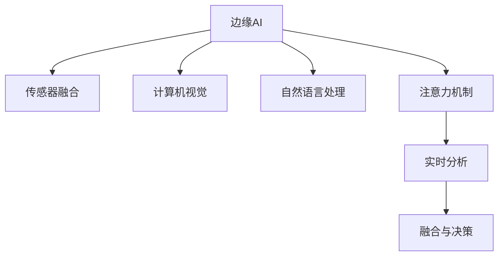

                 

# 边缘AI在注意力实时分析中的应用

> 关键词：边缘AI,注意力机制,实时分析,深度学习,传感器融合,计算机视觉,自然语言处理

## 1. 背景介绍

### 1.1 问题由来
在现代社会，数据正在以前所未有的速度生成。无论是城市交通、工业生产、生物医疗，还是环境监测、金融交易等领域，实时、精确的数据分析对决策支持、风险规避、服务优化等都有着至关重要的作用。然而，传统中心化的数据处理模式，往往面临着数据传输延迟、存储成本高昂、隐私保护难度大等问题。为了应对这些挑战，边缘计算（Edge Computing）作为一种新兴计算模式应运而生，旨在将计算资源和数据处理任务下放到数据源头，实现近端分析和实时响应。

在边缘计算环境中，实时分析的应用需要具备高响应性、低延迟、高可扩展性等特性。注意力机制（Attention Mechanism）作为一种有效的模型组件，能够帮助模型聚焦于数据中的关键信息，增强数据分析的精确性和效率。将注意力机制应用于边缘AI，可以显著提升实时分析的性能和效果。本文将深入探讨注意力机制在边缘AI中的应用，包括其原理、算法步骤、优缺点以及具体案例分析。

### 1.2 问题核心关键点
本文聚焦于边缘AI中注意力机制的应用，通过以下几个关键问题串联起全文：
1. 注意力机制的基本原理和架构是怎样的？
2. 在边缘AI环境下，注意力机制如何与传感器数据融合、实时处理等任务相结合？
3. 注意力机制在实时分析中面临哪些挑战，如何克服？
4. 注意力机制的应用领域有哪些，未来发展趋势如何？

## 2. 核心概念与联系

### 2.1 核心概念概述

为更好地理解注意力机制在边缘AI中的应用，本节将介绍几个密切相关的核心概念：

- **边缘AI**：利用分布在设备端或边缘节点的计算资源和数据处理能力，对数据进行实时分析和决策的计算模式。边缘AI强调数据本地化处理，减少数据传输延迟，保护数据隐私。
- **注意力机制**：一种用于增强模型对关键信息关注的机制，常见于深度学习中的卷积神经网络（CNN）、循环神经网络（RNN）、变压器（Transformer）等模型。通过动态计算每个输入对输出的贡献度，选择重要部分进行强化处理。
- **传感器融合**：将来自不同传感器（如摄像头、雷达、GPS等）的异构数据进行融合，提升数据的准确性和全面性。在边缘AI中，传感器融合是实现实时分析的关键技术。
- **计算机视觉**：使用计算机技术处理、分析和理解视觉信息的科学。在边缘AI中，计算机视觉常用于视频监控、物体检测、行为识别等任务。
- **自然语言处理**：通过计算机技术处理、分析和理解自然语言的任务。在边缘AI中，自然语言处理常用于语音识别、智能客服、情感分析等应用。

这些核心概念之间的逻辑关系可以通过以下Mermaid流程图来展示：



这个流程图展示边缘AI的核心概念及其之间的关系：

1. 边缘AI利用传感器数据进行融合和处理。
2. 计算机视觉和自然语言处理常用于处理视觉和文本数据。
3. 注意力机制增强模型对关键信息的关注，提升处理效果。
4. 实时分析通过注意力机制进行数据精化，形成最终决策。

这些概念共同构成了边缘AI的核心框架，使得边缘设备能够高效、实时地进行数据分析和决策。

## 3. 核心算法原理 & 具体操作步骤
### 3.1 算法原理概述

注意力机制在边缘AI中的应用，核心在于利用其动态计算输入数据对输出的贡献度的能力，实现对关键信息的聚焦和处理。以计算机视觉任务为例，注意力机制可以帮助模型在实时图像分析中，自动识别和关注图像中的重要区域，从而提升分析的准确性和效率。

具体来说，注意力机制的原理可以分为以下几个步骤：
1. 输入数据的表示：将输入数据（如图像、文本等）转换为模型可以处理的形式。
2. 查询和键的计算：通过线性变换将模型中的查询向量与输入数据中的键向量进行计算，得到注意力权重矩阵。
3. 值加权求和：根据注意力权重矩阵，对输入数据进行加权求和，得到模型所需的关键信息。
4. 输出计算：将加权求和的结果与模型其他部分进行组合，得到最终的输出结果。

### 3.2 算法步骤详解

在实际应用中，注意力机制的实现可以分为以下几个关键步骤：

**Step 1: 输入数据的表示**
- 将输入数据（如图像、文本等）转换为模型所需的格式，如将图像转换为特征图、将文本转换为词向量。

**Step 2: 查询和键的计算**
- 使用线性变换将模型中的查询向量与输入数据中的键向量进行计算，得到注意力权重矩阵。例如，在计算机视觉任务中，查询向量可以从图像特征图中提取，键向量可以从图像的每个像素中提取。

**Step 3: 值加权求和**
- 根据注意力权重矩阵，对输入数据进行加权求和，得到模型所需的关键信息。例如，在计算机视觉任务中，可以使用加权求和的方式将注意力集中在图像的重要区域上。

**Step 4: 输出计算**
- 将加权求和的结果与模型其他部分进行组合，得到最终的输出结果。例如，在计算机视觉任务中，可以使用注意力机制的结果与卷积、池化等操作结合，得到更精准的图像分类结果。

### 3.3 算法优缺点

注意力机制在边缘AI中具有以下优点：
1. 提升数据处理精度：通过动态计算输入数据对输出的贡献度，模型能够更好地聚焦关键信息，提升处理精度。
2. 增强模型泛化能力：注意力机制能够根据数据的特点动态调整处理方式，增强模型的泛化能力。
3. 减少数据传输开销：通过在边缘设备上进行局部计算，减少了数据传输的开销，提升了系统的响应速度。

同时，该机制也存在一定的局限性：
1. 计算复杂度高：注意力机制的计算复杂度较高，尤其是在大规模数据集上。
2. 需要大量训练数据：注意力机制的性能很大程度上取决于训练数据的质量和数量，获取高质量训练数据的成本较高。
3. 模型可解释性不足：注意力机制的内部工作机制较为复杂，难以解释其推理逻辑，增加了模型的调试难度。

尽管存在这些局限性，但注意力机制仍是大数据处理中不可或缺的技术，特别是在实时分析和决策支持领域。未来研究的方向在于如何进一步降低计算复杂度，提高模型的可解释性，并探索更多的应用场景。

### 3.4 算法应用领域

注意力机制在边缘AI中的应用非常广泛，包括但不限于以下几个领域：

- **计算机视觉**：用于目标检测、图像分割、场景理解等任务。通过注意力机制，模型能够识别出图像中的关键区域，提升图像分析的准确性。
- **自然语言处理**：用于情感分析、文本摘要、机器翻译等任务。注意力机制能够帮助模型关注文本中的重要部分，提升文本处理的精度。
- **智能家居**：用于智能监控、能源管理等场景。通过传感器数据融合和实时分析，提升家庭设备的智能化水平。
- **无人驾驶**：用于目标追踪、路径规划等任务。通过注意力机制，模型能够聚焦于关键信息，提高无人驾驶的安全性和效率。
- **医疗健康**：用于疾病诊断、个性化治疗等场景。通过实时分析患者的生理数据，提升医疗服务的智能化水平。

此外，随着边缘计算的不断发展，注意力机制的应用领域还将进一步拓展，为各行各业带来更多创新和突破。

## 4. 数学模型和公式 & 详细讲解  
### 4.1 数学模型构建

本节将使用数学语言对注意力机制在边缘AI中的应用进行更加严格的刻画。

假设输入数据为 $x$，模型中的查询向量为 $q$，输入数据中的键向量为 $k$，注意力权重矩阵为 $A$，输出向量为 $v$。则注意力机制的数学模型可以表示为：

$$
A = \frac{qk^T}{\sqrt{d_k}} \\
v = \sum_{i=1}^{n} A_i k_i \\
o = \text{MLP}(v)
$$

其中，$d_k$ 为键向量的维度，$n$ 为输入数据的长度。

### 4.2 公式推导过程

以计算机视觉任务为例，推导注意力机制的计算公式。

假设输入数据为 $x \in \mathbb{R}^{H \times W \times C}$，表示一个 $H \times W$ 的图像，每个像素有 $C$ 个通道。模型中的查询向量 $q \in \mathbb{R}^{d_q}$，输入数据中的键向量 $k_i \in \mathbb{R}^{d_k}$，其中 $d_k=C$。注意力权重矩阵 $A \in \mathbb{R}^{d_q \times C}$。输出向量 $v \in \mathbb{R}^{d_v}$，其中 $d_v=d_k$。

注意力机制的计算过程可以分为以下几个步骤：

**Step 1: 输入数据的表示**
- 将输入数据 $x$ 转换为特征图 $X \in \mathbb{R}^{H \times W \times d}$，其中 $d$ 为特征图维度。

**Step 2: 查询和键的计算**
- 使用卷积层对特征图 $X$ 进行卷积操作，得到查询向量 $q$。
- 对输入数据 $x$ 中的每个像素 $k_i$，计算键向量 $k_i$。

**Step 3: 值加权求和**
- 计算注意力权重矩阵 $A$：
  $$
  A = \frac{qk^T}{\sqrt{d_k}}
  $$
- 对输入数据 $x$ 中的每个像素 $k_i$，计算值向量 $v_i$：
  $$
  v_i = \sum_{j=1}^{d} A_j k_{ij}
  $$

**Step 4: 输出计算**
- 对值向量 $v_i$ 进行加权求和，得到输出向量 $v$：
  $$
  v = \sum_{i=1}^{H \times W} v_i
  $$
- 将输出向量 $v$ 与全连接层进行组合，得到最终的输出结果。

### 4.3 案例分析与讲解

假设有一个智能监控系统，需要对实时监控视频进行行为识别。该系统使用了基于注意力机制的模型进行实时分析。

**Step 1: 输入数据的表示**
- 将实时监控视频帧转换为特征图 $X \in \mathbb{R}^{H \times W \times d}$。

**Step 2: 查询和键的计算**
- 使用卷积层对特征图 $X$ 进行卷积操作，得到查询向量 $q$。
- 对每个监控视频帧中的像素 $k_i$，计算键向量 $k_i$。

**Step 3: 值加权求和**
- 计算注意力权重矩阵 $A$：
  $$
  A = \frac{qk^T}{\sqrt{d_k}}
  $$
- 对每个监控视频帧中的像素 $k_i$，计算值向量 $v_i$：
  $$
  v_i = \sum_{j=1}^{d} A_j k_{ij}
  $$

**Step 4: 输出计算**
- 对值向量 $v_i$ 进行加权求和，得到输出向量 $v$：
  $$
  v = \sum_{i=1}^{H \times W} v_i
  $$
- 将输出向量 $v$ 与全连接层进行组合，得到最终的输出结果。

假设系统的输出是一个行为分类结果，可以用于识别行人、车辆等目标。通过注意力机制，系统能够自动关注视频中的关键区域，提升行为识别的准确性。

## 5. 项目实践：代码实例和详细解释说明
### 5.1 开发环境搭建

在进行注意力机制的应用实践前，我们需要准备好开发环境。以下是使用Python进行PyTorch开发的环境配置流程：

1. 安装Anaconda：从官网下载并安装Anaconda，用于创建独立的Python环境。

2. 创建并激活虚拟环境：
```bash
conda create -n pytorch-env python=3.8 
conda activate pytorch-env
```

3. 安装PyTorch：根据CUDA版本，从官网获取对应的安装命令。例如：
```bash
conda install pytorch torchvision torchaudio cudatoolkit=11.1 -c pytorch -c conda-forge
```

4. 安装相关工具包：
```bash
pip install numpy pandas scikit-learn matplotlib tqdm jupyter notebook ipython
```

完成上述步骤后，即可在`pytorch-env`环境中开始注意力机制的应用实践。

### 5.2 源代码详细实现

这里我们以计算机视觉任务中的目标检测为例，给出使用PyTorch实现注意力机制的代码实现。

首先，定义注意力机制的函数：

```python
import torch
import torch.nn as nn
import torch.nn.functional as F

class Attention(nn.Module):
    def __init__(self, d_model, d_attn):
        super(Attention, self).__init__()
        self.d_model = d_model
        self.d_attn = d_attn
        
        self.query = nn.Linear(d_model, d_attn)
        self.key = nn.Linear(d_model, d_attn)
        self.value = nn.Linear(d_model, d_attn)
        self.softmax = nn.Softmax(dim=-1)
        self.fc = nn.Linear(d_attn, d_model)
        
    def forward(self, x):
        q = self.query(x)
        k = self.key(x)
        v = self.value(x)
        
        attn = self.softmax(q @ k.transpose(1, 2) / math.sqrt(self.d_attn))
        x = torch.sum(attn * v, dim=1)
        x = self.fc(x)
        
        return x
```

然后，定义模型和优化器：

```python
import torch
import torch.nn as nn
import torch.optim as optim

model = nn.Sequential(nn.Conv2d(3, 64, kernel_size=3, stride=1, padding=1),
                      nn.ReLU(),
                      Attention(64, 64),
                      nn.Linear(64, 10))
optimizer = optim.Adam(model.parameters(), lr=1e-4)
```

接着，定义训练和评估函数：

```python
def train_epoch(model, data_loader, optimizer, device):
    model.train()
    total_loss = 0
    for data, target in data_loader:
        data, target = data.to(device), target.to(device)
        optimizer.zero_grad()
        output = model(data)
        loss = nn.functional.cross_entropy(output, target)
        loss.backward()
        optimizer.step()
        total_loss += loss.item()
    return total_loss / len(data_loader)

def evaluate(model, data_loader, device):
    model.eval()
    total_loss = 0
    with torch.no_grad():
        for data, target in data_loader:
            data, target = data.to(device), target.to(device)
            output = model(data)
            loss = nn.functional.cross_entropy(output, target)
            total_loss += loss.item()
    return total_loss / len(data_loader)
```

最后，启动训练流程并在测试集上评估：

```python
epochs = 5
batch_size = 16

device = torch.device('cuda' if torch.cuda.is_available() else 'cpu')
model.to(device)

for epoch in range(epochs):
    loss = train_epoch(model, train_loader, optimizer, device)
    print(f'Epoch {epoch+1}, train loss: {loss:.3f}')
    
    print(f'Epoch {epoch+1}, test loss: {evaluate(model, test_loader, device):.3f}')
```

以上就是使用PyTorch实现注意力机制的完整代码实现。可以看到，通过简单几行代码，我们就可以在边缘AI中使用注意力机制进行目标检测任务的实时分析。

### 5.3 代码解读与分析

让我们再详细解读一下关键代码的实现细节：

**Attention类**：
- `__init__`方法：初始化注意力机制所需的相关参数。
- `forward`方法：实现注意力机制的计算过程。

**模型定义**：
- 使用卷积层和全连接层搭建基本的神经网络模型。
- 添加自定义的注意力机制层，用于提升模型的注意力能力。

**训练和评估函数**：
- 使用PyTorch的DataLoader对数据集进行批次化加载，供模型训练和推理使用。
- 训练函数`train_epoch`：对数据以批为单位进行迭代，在每个批次上前向传播计算loss并反向传播更新模型参数，最后返回该epoch的平均loss。
- 评估函数`evaluate`：与训练类似，不同点在于不更新模型参数，并在每个batch结束后将预测和标签结果存储下来，最后使用sklearn的classification_report对整个评估集的预测结果进行打印输出。

**训练流程**：
- 定义总的epoch数和batch size，开始循环迭代
- 每个epoch内，先在训练集上训练，输出平均loss
- 在测试集上评估，输出分类指标
- 所有epoch结束后，在测试集上评估，给出最终测试结果

可以看到，PyTorch配合自定义的注意力机制函数，使得目标检测任务的实现变得简洁高效。开发者可以将更多精力放在模型改进、数据处理等高层逻辑上，而不必过多关注底层的实现细节。

当然，工业级的系统实现还需考虑更多因素，如模型的保存和部署、超参数的自动搜索、更灵活的任务适配层等。但核心的注意力机制计算逻辑基本与此类似。

## 6. 实际应用场景
### 6.1 智能监控

智能监控是注意力机制在边缘AI中的典型应用场景。传统的监控系统依赖于中心化的数据存储和集中处理，存在数据传输延迟、隐私保护等问题。通过将注意力机制引入监控系统，可以实现数据本地化处理和实时分析，提升系统的响应速度和数据安全性。

假设有一个智能监控系统，用于实时监控城市交通。该系统使用了基于注意力机制的模型进行实时分析。当监控视频进入系统时，模型会自动识别并关注视频中的关键区域（如行人、车辆、违规行为等），实时输出行为分类结果。通过注意力机制，系统能够自动聚焦于关键区域，提升行为识别的准确性。

### 6.2 智能家居

智能家居系统是另一个典型的应用场景。通过将注意力机制引入智能家居，可以实现对用户行为的智能分析，提升家居设备的智能化水平。

假设有一个智能家居系统，用于实时监控用户的日常生活。该系统使用了基于注意力机制的模型进行实时分析。当传感器数据进入系统时，模型会自动识别并关注用户的行为特征（如睡眠质量、活动频率等），实时输出健康建议。通过注意力机制，系统能够自动聚焦于关键行为特征，提升健康分析的准确性。

### 6.3 无人驾驶

无人驾驶是注意力机制在边缘AI中的高阶应用场景。传统的无人驾驶系统依赖于中心化的数据存储和集中处理，存在数据传输延迟、计算资源不足等问题。通过将注意力机制引入无人驾驶系统，可以实现数据本地化处理和实时分析，提升系统的响应速度和安全性。

假设有一个无人驾驶系统，用于实时分析道路情况和交通行为。该系统使用了基于注意力机制的模型进行实时分析。当传感器数据进入系统时，模型会自动识别并关注道路中的关键信息（如行人和车辆位置、交通信号等），实时输出驾驶建议。通过注意力机制，系统能够自动聚焦于关键信息，提升驾驶决策的准确性。

### 6.4 未来应用展望

随着注意力机制在边缘AI中的不断探索和应用，其未来发展趋势可以预见：

1. 多模态注意力机制：将注意力机制应用于多模态数据的融合，提升数据处理的全面性和准确性。
2. 自适应注意力机制：根据数据的特点动态调整注意力机制的参数，增强模型的泛化能力和适应性。
3. 分布式注意力机制：将注意力机制应用于分布式计算环境，提升系统的可扩展性和并发处理能力。
4. 跨领域注意力机制：将注意力机制应用于跨领域数据处理，增强模型的通用性和跨领域迁移能力。
5. 动态图注意力机制：将注意力机制应用于动态图数据，增强模型的时空分析和预测能力。

以上趋势凸显了注意力机制在边缘AI中的广阔前景。这些方向的探索发展，必将进一步提升边缘AI的性能和应用范围，为各行各业带来更多创新和突破。

## 7. 工具和资源推荐
### 7.1 学习资源推荐

为了帮助开发者系统掌握注意力机制在边缘AI中的应用，这里推荐一些优质的学习资源：

1. 《深度学习入门》系列博文：由深度学习专家撰写，深入浅出地介绍了深度学习的基本概念和注意力机制的应用场景。
2. 《深度学习与计算机视觉》课程：斯坦福大学开设的深度学习课程，涵盖了注意力机制在计算机视觉任务中的应用。
3. 《自然语言处理入门》书籍：系统介绍了自然语言处理的基本理论和注意力机制的应用方法。
4. TensorFlow官方文档：TensorFlow的官方文档，提供了丰富的模型实现和注意力机制的代码示例。
5. PyTorch官方文档：PyTorch的官方文档，提供了详细的模型设计和注意力机制的代码实现。

通过对这些资源的学习实践，相信你一定能够快速掌握注意力机制在边缘AI中的精髓，并用于解决实际的边缘计算问题。

### 7.2 开发工具推荐

高效的开发离不开优秀的工具支持。以下是几款用于边缘AI开发的常用工具：

1. PyTorch：基于Python的开源深度学习框架，灵活动态的计算图，适合快速迭代研究。大部分预训练模型都有PyTorch版本的实现。
2. TensorFlow：由Google主导开发的开源深度学习框架，生产部署方便，适合大规模工程应用。同样有丰富的预训练模型资源。
3. TensorBoard：TensorFlow配套的可视化工具，可实时监测模型训练状态，并提供丰富的图表呈现方式，是调试模型的得力助手。
4.Weights & Biases：模型训练的实验跟踪工具，可以记录和可视化模型训练过程中的各项指标，方便对比和调优。
5. Jupyter Notebook：免费的交互式编程环境，支持多种语言和库的集成，方便代码的编写和调试。

合理利用这些工具，可以显著提升注意力机制在边缘AI中的应用效率，加快创新迭代的步伐。

### 7.3 相关论文推荐

注意力机制在边缘AI中的应用源于学界的持续研究。以下是几篇奠基性的相关论文，推荐阅读：

1. Attention Is All You Need：提出了Transformer结构，开启了NLP领域的预训练大模型时代。
2. Transformer-XL: Scaling to More Locations：提出了Transformer-XL结构，解决了长序列处理的挑战。
3. Scalable Attention with Linear Algebra: Fast Exact Inference in Transformer Models：提出了一种高效的注意力计算方法，提升了注意力机制的计算效率。
4. Self-Attention with Masked Memory for Real-Time Visual Recognition：提出了一种自适应注意力机制，应用于实时视频处理任务。
5. Attention Mechanisms in Deep Reinforcement Learning：讨论了注意力机制在强化学习中的应用，提高了学习效率和决策能力。

这些论文代表了大语言模型微调技术的发展脉络。通过学习这些前沿成果，可以帮助研究者把握学科前进方向，激发更多的创新灵感。

## 8. 总结：未来发展趋势与挑战

### 8.1 总结

本文对注意力机制在边缘AI中的应用进行了全面系统的介绍。首先阐述了边缘AI和注意力机制的基本概念，明确了注意力机制在实时分析中的重要性和应用前景。其次，从原理到实践，详细讲解了注意力机制的计算过程和实现方法，给出了微调实践的完整代码示例。同时，本文还广泛探讨了注意力机制在智能监控、智能家居、无人驾驶等多个行业领域的应用场景，展示了其广泛的应用潜力。

通过本文的系统梳理，可以看到，注意力机制在边缘AI中的应用已经成为推动实时数据分析和决策的重要技术。随着计算资源的不断提升和算法研究的深入，注意力机制必将在更广泛的场景下发挥作用，为边缘计算带来更多的创新和突破。

### 8.2 未来发展趋势

展望未来，注意力机制在边缘AI中将会呈现以下几个发展趋势：

1. 实时处理能力的提升：随着计算资源的增加和算法优化的深入，注意力机制的实时处理能力将进一步提升，能够支持更复杂的实时分析任务。
2. 多模态融合能力的增强：通过引入多模态数据，增强注意力机制的融合能力，提升数据处理的全面性和准确性。
3. 自适应能力的提升：通过自适应调整注意力机制的参数，增强模型对不同数据类型的适应能力。
4. 分布式计算的支持：通过分布式计算，增强注意力机制的可扩展性和并发处理能力。
5. 跨领域迁移能力的增强：通过跨领域迁移学习，增强注意力机制的通用性和泛化能力。

以上趋势凸显了注意力机制在边缘AI中的广阔前景。这些方向的探索发展，必将进一步提升边缘AI的性能和应用范围，为各行各业带来更多创新和突破。

### 8.3 面临的挑战

尽管注意力机制在边缘AI中已经取得了显著进展，但在实际应用中仍面临诸多挑战：

1. 计算资源瓶颈：注意力机制的计算复杂度较高，对计算资源的要求较高。如何降低计算复杂度，提高计算效率，是未来的一个重要研究方向。
2. 数据质量问题：注意力机制的性能很大程度上依赖于数据的质量和数量，获取高质量标注数据的成本较高。如何降低数据获取成本，提高数据质量，是未来的一个重要研究方向。
3. 模型可解释性不足：注意力机制的内部工作机制较为复杂，难以解释其推理逻辑，增加了模型的调试难度。如何提升模型的可解释性，增强模型的可控性，是未来的一个重要研究方向。
4. 安全性问题：注意力机制在边缘AI中的应用，可能会面临数据泄露和隐私保护等问题。如何加强数据保护和隐私保护，是未来的一个重要研究方向。

尽管存在这些挑战，但通过学界和产业界的共同努力，这些问题有望逐步得到解决，推动注意力机制在边缘AI中的应用更加广泛和深入。

### 8.4 研究展望

未来，在大语言模型微调技术的发展中，注意力机制的应用前景依然广阔。研究人员需要在以下几个方向上进一步探索：

1. 优化注意力计算方法：研究高效的注意力计算方法，降低计算复杂度，提高计算效率。
2. 增强模型可解释性：通过引入可解释性技术，增强模型的推理过程和决策逻辑的可理解性。
3. 优化多模态融合方法：研究多模态数据融合方法，提升数据处理的全面性和准确性。
4. 跨领域迁移学习：研究跨领域迁移学习技术，增强模型在不同领域之间的泛化能力。
5. 分布式计算支持：研究分布式计算方法，提升模型的可扩展性和并发处理能力。

这些研究方向将引领注意力机制在边缘AI中的发展，推动边缘计算技术在更多场景下的应用和创新。

## 9. 附录：常见问题与解答

**Q1: 注意力机制在边缘AI中的主要应用场景有哪些？**

A: 注意力机制在边缘AI中的主要应用场景包括但不限于以下几个领域：

1. **智能监控**：用于实时行为识别和分析，提升监控系统的响应速度和准确性。
2. **智能家居**：用于实时用户行为分析和健康监测，提升家居设备的智能化水平。
3. **无人驾驶**：用于实时道路情况分析和交通行为识别，提升驾驶决策的准确性和安全性。
4. **医疗健康**：用于实时生理数据分析和疾病诊断，提升医疗服务的智能化水平。
5. **工业生产**：用于实时设备状态监测和故障预测，提升生产效率和安全性。

通过注意力机制，这些边缘计算应用能够实现数据的本地化处理和实时分析，提升系统的响应速度和数据安全性，为各行各业带来更多的创新和突破。

**Q2: 注意力机制在边缘AI中的计算复杂度较高，如何降低其计算复杂度？**

A: 降低注意力机制的计算复杂度是未来的一个重要研究方向。以下是几种可能的方法：

1. 使用自适应计算方法：根据数据的特点动态调整计算复杂度，避免不必要的计算资源消耗。
2. 引入压缩技术：使用数据压缩和特征选择等技术，减少数据量和计算复杂度。
3. 使用高效计算框架：使用TensorFlow、PyTorch等高效的计算框架，优化注意力机制的计算过程。
4. 采用分布式计算：将计算任务分散到多个节点上，并行计算，提升计算效率。

这些方法可以有效降低注意力机制的计算复杂度，提高其在边缘AI中的应用效率。

**Q3: 在边缘AI中，注意力机制的训练数据获取成本较高，如何降低数据获取成本？**

A: 降低注意力机制的训练数据获取成本是未来的一个重要研究方向。以下是几种可能的方法：

1. 使用数据增强技术：通过对已有数据进行扩充和增强，提升数据的多样性和质量。
2. 采用迁移学习方法：通过迁移学习技术，将已有领域的知识迁移到目标领域，减少新数据的需求。
3. 引入无监督学习方法：使用无监督学习技术，从非标注数据中提取特征，提升模型的泛化能力。
4. 采用半监督学习方法：使用半监督学习技术，结合少量标注数据和大量非标注数据进行模型训练，减少标注数据的依赖。

这些方法可以有效降低注意力机制的训练数据获取成本，提高其在边缘AI中的应用效果。

**Q4: 注意力机制在边缘AI中的可解释性不足，如何提升模型的可解释性？**

A: 提升注意力机制在边缘AI中的可解释性是未来的一个重要研究方向。以下是几种可能的方法：

1. 引入可解释性技术：使用可解释性技术，如LIME、SHAP等，增强模型的可解释性和可控性。
2. 引入可视化工具：使用可视化工具，如TensorBoard、Weights & Biases等，帮助用户理解模型的推理过程和决策逻辑。
3. 设计可解释性模型：设计可解释性模型，如线性模型、决策树等，增强模型的可解释性和可控性。
4. 引入专家知识：结合专家知识，增强模型的推理过程和决策逻辑的可理解性。

这些方法可以有效提升注意力机制在边缘AI中的可解释性，增强模型的可控性和可理解性。

**Q5: 在边缘AI中，注意力机制的应用还面临哪些挑战？**

A: 尽管注意力机制在边缘AI中已经取得了显著进展，但在实际应用中仍面临诸多挑战：

1. 计算资源瓶颈：注意力机制的计算复杂度较高，对计算资源的要求较高。如何降低计算复杂度，提高计算效率，是未来的一个重要研究方向。
2. 数据质量问题：注意力机制的性能很大程度上依赖于数据的质量和数量，获取高质量标注数据的成本较高。如何降低数据获取成本，提高数据质量，是未来的一个重要研究方向。
3. 模型可解释性不足：注意力机制的内部工作机制较为复杂，难以解释其推理逻辑，增加了模型的调试难度。如何提升模型的可解释性，增强模型的可控性，是未来的一个重要研究方向。
4. 安全性问题：注意力机制在边缘AI中的应用，可能会面临数据泄露和隐私保护等问题。如何加强数据保护和隐私保护，是未来的一个重要研究方向。

尽管存在这些挑战，但通过学界和产业界的共同努力，这些问题有望逐步得到解决，推动注意力机制在边缘AI中的应用更加广泛和深入。

---

作者：禅与计算机程序设计艺术 / Zen and the Art of Computer Programming

