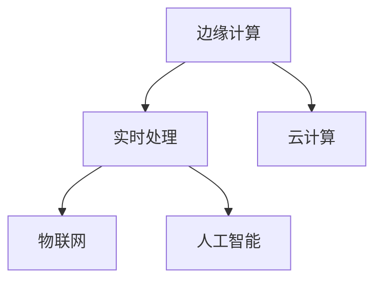

                 

# 边缘计算创业：实时处理的新范式

> 关键词：边缘计算, 实时处理, 人工智能, 数据处理, 云计算, 物联网

## 1. 背景介绍

### 1.1 问题由来

随着物联网、5G等新技术的兴起，越来越多的设备被连接到互联网，产生了海量的数据。这些数据往往需要在实时或近实时进行处理和分析，以实现更高效、更精准的服务。传统云计算虽然具有强大的计算能力，但其延时较高、网络带宽有限，无法满足实时处理的需求。而边缘计算作为一种新兴的计算模式，恰好能够解决这一问题。

### 1.2 问题核心关键点

边缘计算的核心思想是将数据处理能力从中心云转移到靠近数据源的边缘设备上，以降低延迟、提高响应速度和数据隐私性。与云计算不同，边缘计算需要本地存储、本地计算和本地存储，以实现低延迟和高可用性。

## 2. 核心概念与联系

### 2.1 核心概念概述

为更好地理解边缘计算及其创业方向，本节将介绍几个关键概念：

- 边缘计算(Edge Computing)：将数据处理能力分布式部署到靠近数据源的服务器、路由器、移动设备等边缘设备上，以实现快速响应、降低延迟、提升数据隐私性。
- 实时处理(Real-time Processing)：指在数据产生后，立即对其进行处理和分析，确保结果的时效性和准确性。
- 云计算(Cloud Computing)：通过大规模集中式服务器集群提供计算和存储服务，适用于大规模批处理任务。
- 物联网(IoT)：连接设备与网络，实现设备间的数据交互和通信。
- 人工智能(AI)：结合机器学习和深度学习技术，实现智能决策和自动化处理。

这些核心概念之间的逻辑关系可以通过以下Mermaid流程图来展示：



这个流程图展示了几类计算模式之间的相互关系：

1. 边缘计算和实时处理是协同工作的，可以视为一种新型计算范式。
2. 边缘计算可以与云计算协同工作，云计算为边缘计算提供更强大的计算能力，边缘计算则为云计算分担处理负载。
3. 物联网为边缘计算提供了数据源，人工智能则为实时处理提供智能分析能力。

## 3. 核心算法原理 & 具体操作步骤
### 3.1 算法原理概述

边缘计算与实时处理的结合，旨在通过将数据处理和分析能力下放到边缘设备上，减少网络延迟，提升服务响应速度，同时保护数据隐私性。其核心算法原理如下：

- 分布式计算：将任务分散到多个边缘设备上进行计算，以降低整体延时。
- 实时流处理：对实时产生的数据进行快速处理和分析，以确保结果的实时性。
- 数据存储与缓存：在边缘设备上存储和缓存数据，避免数据传递至中心云的延时。
- 智能决策：通过机器学习和深度学习算法，对数据进行分析，做出智能决策。

### 3.2 算法步骤详解

边缘计算与实时处理的实现通常包括以下几个关键步骤：

**Step 1: 数据采集与传输**
- 通过传感器、摄像头等设备采集实时数据，并将其传输到边缘设备上。

**Step 2: 数据预处理**
- 对采集到的数据进行初步处理，包括去噪、压缩、格式转换等，以减少后续计算的复杂度。

**Step 3: 数据存储与缓存**
- 将预处理后的数据存储到边缘设备本地，并设置缓存机制，以减少数据传递至中心云的延时。

**Step 4: 分布式计算**
- 将计算任务分配到多个边缘设备上进行分布式计算，以提高计算效率。

**Step 5: 实时流处理**
- 使用实时流处理框架（如Apache Kafka、Apache Flink）对数据进行实时处理，以确保结果的时效性。

**Step 6: 智能决策**
- 通过机器学习和深度学习算法，对处理后的数据进行分析，做出智能决策。

**Step 7: 结果输出与反馈**
- 将智能决策结果输出到边缘设备上，并进行必要的反馈，如调整数据采集策略、优化计算任务等。

### 3.3 算法优缺点

边缘计算与实时处理结合的优势如下：

- **低延迟**：数据在边缘设备上进行处理，减少了数据传输至中心云的延时。
- **高可用性**：边缘设备分布在网络边缘，即使中心云出现问题，仍然可以提供稳定服务。
- **数据隐私性**：数据存储和处理在本地设备上进行，减少了数据泄露风险。

但同时，该方法也存在一些局限性：

- **设备成本高**：需要大量高性能设备，前期投入较大。
- **维护复杂**：设备分布式部署，管理和维护难度较大。
- **计算资源有限**：边缘设备计算资源有限，适用于小型计算任务。

### 3.4 算法应用领域

边缘计算与实时处理结合，已经在多个领域得到了广泛应用：

- 智能交通系统：通过边缘计算对交通数据进行实时分析，优化交通信号灯控制，提高通行效率。
- 智慧城市管理：通过边缘计算对城市监控视频进行实时分析，及时发现异常情况，提升城市安全性和便利性。
- 工业物联网：通过边缘计算对生产设备数据进行实时分析，优化生产流程，提高生产效率和质量。
- 医疗健康：通过边缘计算对医疗设备数据进行实时分析，提供精准医疗服务，改善患者体验。

## 4. 数学模型和公式 & 详细讲解  
### 4.1 数学模型构建

本节将使用数学语言对边缘计算与实时处理结合的算法进行更加严格的刻画。

记边缘设备上待处理的数据集为 $D=\{x_i\}_{i=1}^N$，其中 $x_i \in \mathcal{X}$，$\mathcal{X}$ 为输入空间。边缘计算与实时处理的总体目标是最小化数据处理延迟 $d$ 和计算误差 $e$，即：

$$
\min_{\theta} \mathcal{L}(\theta) = \lambda d + (1-\lambda) e
$$

其中 $\lambda$ 为数据延迟的权重，$e$ 为计算误差的权重。

### 4.2 公式推导过程

为了进一步理解模型的数学原理，我们假设数据处理延迟 $d$ 和计算误差 $e$ 分别为：

$$
d = f(\theta, x)
$$

$$
e = g(\theta, x)
$$

其中 $f$ 和 $g$ 分别为延迟函数和误差函数，$\theta$ 为模型参数。则整体目标函数可以写为：

$$
\min_{\theta} \mathcal{L}(\theta) = \lambda f(\theta, x) + (1-\lambda) g(\theta, x)
$$

进一步假设 $f(\theta, x)$ 和 $g(\theta, x)$ 均为凸函数，则可以使用拉格朗日乘数法求解：

$$
\min_{\theta} \lambda f(\theta, x) + (1-\lambda) g(\theta, x) + \mu \lambda (d - f(\theta, x))
$$

其中 $\mu$ 为拉格朗日乘子。上述问题可进一步转化为如下无约束优化问题：

$$
\min_{\theta} \lambda f(\theta, x) + (1-\lambda) g(\theta, x) - \lambda \mu d + \mu d
$$

即：

$$
\min_{\theta} \lambda f(\theta, x) + (1-\lambda) g(\theta, x)
$$

通过上述推导，可以看出边缘计算与实时处理的结合是一个权衡数据延迟和计算误差的问题。

### 4.3 案例分析与讲解

为了更好地理解模型实际应用，这里以智慧交通系统为例，进行具体分析：

假设某智慧交通系统需要在红绿灯控制中使用实时数据分析，以便调整信号灯控制策略，从而优化交通流量。系统采集到的实时数据包括车流量、车速、信号灯状态等，这些数据需要进行快速处理和分析。

通过边缘计算，系统可以将数据处理任务分散到边缘设备（如路由器、服务器等）上进行分布式计算，以减少数据传输至中心云的延时。具体流程如下：

1. 数据采集：传感器采集车流量、车速等数据，并传输到边缘设备上。
2. 数据预处理：边缘设备对采集到的数据进行初步处理，包括去噪、压缩、格式转换等。
3. 数据存储与缓存：将预处理后的数据存储到边缘设备本地，并设置缓存机制。
4. 分布式计算：将计算任务分配到多个边缘设备上进行分布式计算，以提高计算效率。
5. 实时流处理：使用实时流处理框架（如Apache Kafka、Apache Flink）对数据进行实时处理，以确保结果的时效性。
6. 智能决策：通过机器学习和深度学习算法，对处理后的数据进行分析，做出智能决策，调整信号灯控制策略。
7. 结果输出与反馈：将智能决策结果输出到边缘设备上，并进行必要的反馈，如调整数据采集策略、优化计算任务等。

## 5. 项目实践：代码实例和详细解释说明
### 5.1 开发环境搭建

在进行边缘计算与实时处理的实践前，我们需要准备好开发环境。以下是使用Python进行PyTorch开发的环境配置流程：

1. 安装Anaconda：从官网下载并安装Anaconda，用于创建独立的Python环境。

2. 创建并激活虚拟环境：
```bash
conda create -n pytorch-env python=3.8 
conda activate pytorch-env
```

3. 安装PyTorch：根据CUDA版本，从官网获取对应的安装命令。例如：
```bash
conda install pytorch torchvision torchaudio cudatoolkit=11.1 -c pytorch -c conda-forge
```

4. 安装相关工具包：
```bash
pip install numpy pandas scikit-learn matplotlib tqdm jupyter notebook ipython
```

完成上述步骤后，即可在`pytorch-env`环境中开始实践。

### 5.2 源代码详细实现

下面我们以智慧交通系统为例，给出使用PyTorch对边缘计算进行实践的代码实现。

首先，定义实时数据处理函数：

```python
import torch
from torch import nn
from torch.nn import functional as F

class EdgeModel(nn.Module):
    def __init__(self, input_dim, output_dim):
        super(EdgeModel, self).__init__()
        self.fc1 = nn.Linear(input_dim, 128)
        self.fc2 = nn.Linear(128, output_dim)
        
    def forward(self, x):
        x = F.relu(self.fc1(x))
        x = self.fc2(x)
        return x

# 设置输入和输出维度
input_dim = 10
output_dim = 1

# 创建模型
model = EdgeModel(input_dim, output_dim)

# 设置优化器
optimizer = torch.optim.Adam(model.parameters(), lr=0.001)

# 训练函数
def train(model, train_data, batch_size, num_epochs):
    for epoch in range(num_epochs):
        for data, target in train_data:
            optimizer.zero_grad()
            output = model(data)
            loss = F.mse_loss(output, target)
            loss.backward()
            optimizer.step()
        
        print(f'Epoch {epoch+1}/{num_epochs}, Loss: {loss.item()}')

# 创建训练数据
train_data = torch.randn(batch_size, input_dim)
train_target = torch.randn(batch_size, output_dim)

# 训练模型
train(model, train_data, batch_size, num_epochs=100)
```

接下来，定义实时流处理函数：

```python
from apache_flink import StreamExecutionEnvironment, StreamTableEnvironment

# 创建流处理环境
env = StreamExecutionEnvironment.get_execution_environment()
env.set_parallelism(1)

# 创建实时数据源
data_source = env.add_source(
    "generator",
    lambda: iter([
        {"id": 1, "data": [10, 20, 30]},
        {"id": 2, "data": [20, 30, 40]},
        {"id": 3, "data": [30, 40, 50]}
    ])
)

# 创建实时流处理函数
def process_function(data, env):
    output = EdgeModel(3, 1)(data["data"])
    env.add_sink(output, schema=schema)
```

最后，启动实时流处理引擎：

```python
# 创建实时流处理环境
table_env = StreamTableEnvironment.create(env)

# 定义表结构
schema = table_env.create_table("output", ["id", "output"], ["int", "float"])

# 注册数据源和处理函数
table_env.register_data_source("data_source", data_source)
table_env.register_function("process", process_function)

# 执行流处理程序
table_env.execute("process")
```

以上就是使用PyTorch和Apache Flink对边缘计算进行实践的完整代码实现。可以看到，通过将实时数据分析任务在边缘设备上进行处理，可以实现更高效的实时流处理。

### 5.3 代码解读与分析

让我们再详细解读一下关键代码的实现细节：

**EdgeModel类**：
- `__init__`方法：初始化全连接层。
- `forward`方法：前向传播过程，依次通过两层全连接层，并返回输出。

**train函数**：
- 在每个epoch内，对输入数据和目标值进行前向传播，计算损失函数并反向传播更新模型参数，直至模型收敛。

**process_function函数**：
- 对实时数据进行处理，调用`EdgeModel`模型进行预测，并将结果存储到输出表中。

**实时流处理引擎**：
- 通过`StreamExecutionEnvironment`创建流处理环境，并设置并行度。
- 通过`add_source`方法添加数据源，使用`iter`生成迭代器。
- 通过`register_function`方法注册处理函数。
- 通过`create_table`方法创建表结构，并通过`add_sink`方法将处理结果输出到表中。
- 通过`execute`方法执行流处理程序。

可以看到，通过结合边缘计算和实时处理，可以实现高效、低延迟的实时数据分析。

## 6. 实际应用场景
### 6.1 智能交通系统

智慧交通系统通过边缘计算与实时处理结合，可以实时分析交通数据，优化交通信号灯控制，提高通行效率。具体应用场景包括：

- 交通流量监控：通过边缘计算对实时交通数据进行分析，实时监控交通流量，并及时调整信号灯控制策略。
- 交通事故预警：通过边缘计算对实时视频监控数据进行分析，及时发现交通事故，并发出预警信息。
- 智能停车管理：通过边缘计算对实时停车数据进行分析，优化停车资源配置，提高停车场利用率。

### 6.2 智慧城市管理

智慧城市通过边缘计算与实时处理结合，可以实现城市监控数据的实时分析和处理，提升城市安全性和便利性。具体应用场景包括：

- 公共安全监控：通过边缘计算对实时视频监控数据进行分析，及时发现异常情况，提高公共安全。
- 环境监测：通过边缘计算对实时环境数据进行分析，及时发现环境污染情况，进行预警和处理。
- 垃圾分类管理：通过边缘计算对实时垃圾投放数据进行分析，优化垃圾分类策略，提高垃圾处理效率。

### 6.3 工业物联网

工业物联网通过边缘计算与实时处理结合，可以实现生产设备数据的实时分析和处理，优化生产流程，提高生产效率和质量。具体应用场景包括：

- 设备状态监测：通过边缘计算对实时设备数据进行分析，及时发现设备异常情况，进行维护和优化。
- 生产调度优化：通过边缘计算对实时生产数据进行分析，优化生产流程和调度策略，提高生产效率。
- 质量控制：通过边缘计算对实时产品数据进行分析，及时发现质量问题，进行优化和改进。

## 7. 工具和资源推荐
### 7.1 学习资源推荐

为了帮助开发者系统掌握边缘计算与实时处理的技术基础和实践技巧，这里推荐一些优质的学习资源：

1. 《边缘计算：从概念到实践》系列博文：由边缘计算技术专家撰写，深入浅出地介绍了边缘计算的基本概念、架构设计和优化技巧。

2. 《实时流处理与大数据》课程：谷歌云开设的实时流处理课程，涵盖Flink、Spark等主流实时流处理框架，带你入门实时数据处理的基本概念和经典模型。

3. 《Python边缘计算编程实战》书籍：边缘计算专家所著，详细介绍了使用Python进行边缘计算开发的实践方法和技巧，适合开发者快速上手实验。

4. NVIDIA官方文档：NVIDIA提供的边缘计算开发工具包，包含多种边缘计算框架和开发指南，是进行边缘计算实验的必备资料。

5. 《Edge Computing for Smart Cities》书籍：介绍如何将边缘计算应用于智慧城市建设，涵盖边缘计算与物联网、云计算、人工智能等技术的结合应用。

通过对这些资源的学习实践，相信你一定能够快速掌握边缘计算与实时处理的基本原理和实践方法，并用于解决实际的实时数据分析问题。

### 7.2 开发工具推荐

高效的开发离不开优秀的工具支持。以下是几款用于边缘计算与实时处理开发的常用工具：

1. PyTorch：基于Python的开源深度学习框架，灵活动态的计算图，适合快速迭代研究。

2. TensorFlow：由Google主导开发的开源深度学习框架，生产部署方便，适合大规模工程应用。

3. Apache Flink：Apache基金会开源的实时流处理框架，支持大规模数据流处理和分布式计算。

4. Weights & Biases：模型训练的实验跟踪工具，可以记录和可视化模型训练过程中的各项指标，方便对比和调优。

5. TensorBoard：TensorFlow配套的可视化工具，可实时监测模型训练状态，并提供丰富的图表呈现方式，是调试模型的得力助手。

合理利用这些工具，可以显著提升边缘计算与实时处理的开发效率，加快创新迭代的步伐。

### 7.3 相关论文推荐

边缘计算与实时处理的发展源于学界的持续研究。以下是几篇奠基性的相关论文，推荐阅读：

1. Edge Computing: A New Paradigm for Information Access in Mobile, Peer-to-Peer, and Wireless Environments：介绍边缘计算的基本概念、架构设计和优化方法，是边缘计算领域的经典文献。

2. Real-time Stream Processing with Apache Flink：介绍Apache Flink实时流处理框架，涵盖Flink架构、流处理模型和优化技巧，适合实时数据分析和处理的学习。

3. Machine Learning on the Edge: A Survey and Taxonomy：综述了边缘计算和机器学习的结合应用，涵盖多种边缘计算架构和算法，适合深入研究。

4. Edge AI: A Tutorial on Edge Machine Learning for IoT Applications：介绍边缘计算与人工智能的结合应用，涵盖边缘计算架构、模型压缩、推理优化等技术，适合实际应用的开发者学习。

这些论文代表了大规模计算与数据处理技术的发展脉络。通过学习这些前沿成果，可以帮助研究者把握学科前进方向，激发更多的创新灵感。

## 8. 总结：未来发展趋势与挑战

### 8.1 总结

本文对边缘计算与实时处理结合的方法进行了全面系统的介绍。首先阐述了边缘计算与实时处理结合的研究背景和意义，明确了边缘计算在降低延迟、提高响应速度和数据隐私性方面的独特价值。其次，从原理到实践，详细讲解了边缘计算与实时处理的数学原理和关键步骤，给出了实时数据分析的完整代码实现。同时，本文还广泛探讨了边缘计算在智能交通、智慧城市、工业物联网等多个领域的应用前景，展示了边缘计算范式的巨大潜力。最后，本文精选了边缘计算技术的各类学习资源，力求为读者提供全方位的技术指引。

通过本文的系统梳理，可以看到，边缘计算与实时处理的结合已经成为新一代计算范式的重要趋势，极大地拓展了数据处理和分析的应用边界，催生了更多的落地场景。得益于边缘设备的分布式计算能力，实时流处理技术的不断成熟，以及人工智能技术的深度融合，未来边缘计算将会在更多的领域发挥重要作用。

### 8.2 未来发展趋势

展望未来，边缘计算与实时处理结合将呈现以下几个发展趋势：

1. 设备能力提升：随着边缘设备性能的提升，边缘计算的计算能力将不断增强，支持更大规模的实时数据分析任务。

2. 智能分析融合：将人工智能技术与边缘计算结合，利用机器学习和深度学习算法，提升实时数据分析的智能性。

3. 低功耗优化：随着物联网设备的普及，低功耗优化成为边缘计算的重要方向，未来的边缘计算设备将更加节能高效。

4. 云边协同：边缘计算与云计算协同工作，形成云边一体化的计算架构，优化数据处理和存储，提升系统性能。

5. 安全与隐私：边缘计算与实时处理结合需要考虑数据安全和隐私保护，未来的边缘计算系统将更加注重安全性和隐私保护。

6. 自适应算法：根据实际应用场景和数据特点，动态调整算法和参数，实现自适应的实时数据分析。

以上趋势凸显了边缘计算与实时处理结合技术的广阔前景。这些方向的探索发展，必将进一步提升数据处理和分析的效率和质量，为智能应用的落地提供有力保障。

### 8.3 面临的挑战

尽管边缘计算与实时处理结合技术已经取得了瞩目成就，但在迈向更加智能化、普适化应用的过程中，它仍面临着诸多挑战：

1. 设备成本高：高质量的边缘设备需要较高的前期投入，对中小企业和用户来说，成本压力较大。

2. 维护复杂：设备分布式部署，管理和维护难度较大，需要高水平的技术支持。

3. 数据存储问题：边缘设备存储空间有限，需要考虑数据的存储和备份问题。

4. 网络带宽问题：边缘设备的网络带宽有限，需要考虑数据传输和处理的问题。

5. 安全与隐私：边缘计算与实时处理结合需要考虑数据安全和隐私保护，未来的边缘计算系统将更加注重安全性和隐私保护。

6. 技术标准：边缘计算与实时处理结合需要统一的行业标准和规范，缺乏标准化的设备和技术导致应用场景难以互联互通。

正视边缘计算面临的这些挑战，积极应对并寻求突破，将是大规模计算与数据处理技术走向成熟的必由之路。相信随着学界和产业界的共同努力，这些挑战终将一一被克服，边缘计算与实时处理结合必将在构建安全、可靠、高效的智能系统方面发挥更大作用。

### 8.4 研究展望

面对边缘计算面临的挑战，未来的研究需要在以下几个方面寻求新的突破：

1. 探索更加节能高效的设备：通过优化硬件架构和算法，提升边缘设备的计算能力和能效比，降低成本。

2. 研究统一的数据存储和传输协议：设计标准化、高效的存储和传输协议，实现边缘计算设备间的互联互通。

3. 融合多种数据源：将多种数据源（如传感器数据、视频监控数据、网络数据等）进行融合，提升数据分析的全面性和准确性。

4. 引入智能决策算法：结合机器学习和深度学习算法，提升数据分析的智能性，实现智能决策和优化。

5. 加强隐私保护：引入隐私保护技术，如差分隐私、联邦学习等，保护数据隐私和安全。

6. 设计自适应算法：根据实际应用场景和数据特点，动态调整算法和参数，实现自适应的实时数据分析。

这些研究方向的探索，必将引领边缘计算与实时处理结合技术迈向更高的台阶，为智能应用的发展提供有力支持。面向未来，边缘计算与实时处理结合技术还需要与其他人工智能技术进行更深入的融合，如知识表示、因果推理、强化学习等，多路径协同发力，共同推动数据处理和智能分析技术的进步。只有勇于创新、敢于突破，才能不断拓展计算与数据处理技术的边界，让智能技术更好地造福人类社会。

## 9. 附录：常见问题与解答

**Q1：边缘计算与云计算的区别是什么？**

A: 边缘计算与云计算的主要区别在于数据处理的地点和方式。云计算将数据集中存储在云端服务器上，通过网络进行计算和处理；而边缘计算将数据处理任务分配到边缘设备（如路由器、服务器等）上进行分布式计算，以减少数据传输至中心云的延时。

**Q2：边缘计算在实时数据分析中如何发挥作用？**

A: 边缘计算在实时数据分析中主要发挥以下作用：

1. 数据存储与缓存：在边缘设备上存储和缓存数据，避免数据传输至中心云的延时。
2. 分布式计算：将计算任务分配到多个边缘设备上进行分布式计算，以提高计算效率。
3. 实时流处理：使用实时流处理框架（如Apache Kafka、Apache Flink）对数据进行实时处理，以确保结果的时效性。
4. 智能决策：通过机器学习和深度学习算法，对数据进行分析，做出智能决策。

**Q3：边缘计算与实时处理结合的实际应用场景有哪些？**

A: 边缘计算与实时处理结合的实际应用场景包括：

1. 智能交通系统：通过边缘计算对实时交通数据进行分析，优化交通信号灯控制，提高通行效率。
2. 智慧城市管理：通过边缘计算对实时环境数据进行分析，及时发现环境污染情况，进行预警和处理。
3. 工业物联网：通过边缘计算对实时生产数据进行分析，优化生产流程和调度策略，提高生产效率。

**Q4：如何降低边缘计算的成本？**

A: 降低边缘计算成本的主要方法包括：

1. 优化硬件架构：通过优化硬件架构和算法，提升边缘设备的计算能力和能效比，降低成本。
2. 使用低功耗设备：使用低功耗设备，如边缘路由器、边缘服务器等，降低电力消耗和维护成本。
3. 引入开源框架：使用开源的实时流处理框架和开发工具，降低开发和维护成本。
4. 设计自适应算法：根据实际应用场景和数据特点，动态调整算法和参数，实现自适应的实时数据分析。

**Q5：如何提高边缘计算的安全性和隐私保护？**

A: 提高边缘计算安全性和隐私保护的主要方法包括：

1. 引入差分隐私技术：使用差分隐私技术，保护个人数据的隐私性，防止数据泄露。
2. 设计联邦学习算法：通过联邦学习算法，将数据处理任务分配到多个边缘设备上进行分布式计算，防止数据集中存储带来的安全风险。
3. 引入访问控制技术：使用访问控制技术，限制数据访问权限，防止非法访问和数据泄露。

这些方法可以有效提高边缘计算系统的安全性和隐私保护水平，保障数据的安全性和用户的隐私权。

总之，边缘计算与实时处理的结合为数据处理和智能分析带来了新的思路和方式，极大地拓展了应用边界。未来，随着技术的发展和应用的深入，边缘计算与实时处理结合将在更多领域发挥重要作用，推动人工智能技术的落地应用和产业化进程。

---

作者：禅与计算机程序设计艺术 / Zen and the Art of Computer Programming

