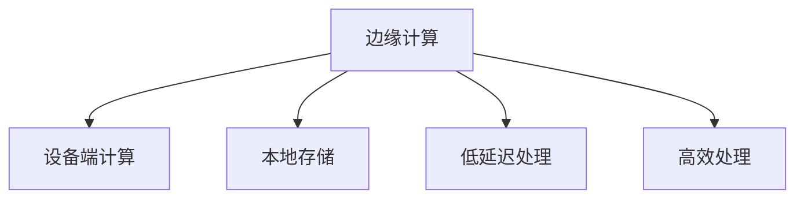

                 

# 边缘计算案例：在设备端进行数据分析

> 关键词：边缘计算,数据分析,设备端,低延迟,高效处理

## 1. 背景介绍

### 1.1 问题由来

在当前的信息时代，随着物联网设备的普及和互联网应用的深入，数据的产生和收集量呈爆炸式增长。海量的数据不仅带来了存储和传输的压力，也带来了对数据处理速度的巨大挑战。传统的集中式计算模式已经无法满足实时性要求高的数据处理需求。

边缘计算是一种新兴的计算模式，它将数据处理任务分布在靠近数据源的设备端进行，减少数据传输开销和延迟，提高数据处理效率。在边缘计算中，设备端的数据分析是一个重要的应用场景，能够有效提升数据处理的实时性和可靠性。

### 1.2 问题核心关键点

边缘计算与传统集中式计算的区别在于，边缘计算将数据处理任务分散到数据源附近进行。具体到数据分析任务，边缘计算的实现关键在于以下几个方面：

1. **数据预处理**：在设备端对原始数据进行初步处理，过滤掉无用数据，减少后续处理的计算量和存储开销。
2. **本地计算**：在设备端对数据进行初步计算，减少对中心服务器的依赖。
3. **边缘存储**：在设备端进行数据缓存，减少数据传输开销，提高数据访问速度。
4. **安全与隐私保护**：在边缘计算中，数据的敏感性较高，需要采取相应的安全措施保护数据隐私。

这些关键点需要结合具体的应用场景进行灵活设计和实现，以确保数据分析任务的实时性和高效性。

## 2. 核心概念与联系

### 2.1 核心概念概述

为更好地理解边缘计算在设备端进行数据分析的原理，本节将介绍几个密切相关的核心概念：

- **边缘计算(Edge Computing)**：指在靠近数据源的设备端进行数据处理和计算，以减少数据传输延迟，提升数据处理效率的一种计算模式。
- **设备端计算(Device-Level Computing)**：指在各种物联网设备（如智能手机、智能家居设备、工业物联网设备等）上进行数据处理的计算模式。
- **本地存储(Local Storage)**：指在设备端进行数据缓存，以减少数据传输开销，提高数据访问速度的存储方式。
- **低延迟处理(Low Latency Processing)**：指在设备端对数据进行实时处理，确保数据处理的实时性和可靠性。
- **高效处理(High Efficiency Processing)**：指在设备端采用高效的算法和优化技术，确保数据处理的高效率。

这些核心概念之间的逻辑关系可以通过以下Mermaid流程图来展示：



这个流程图展示了边缘计算、设备端计算、本地存储、低延迟处理和高效处理之间的逻辑关系：

1. 边缘计算通过将数据处理任务分散到数据源附近进行，以减少数据传输延迟。
2. 设备端计算通过在各种物联网设备上进行数据处理，确保数据处理的实时性和可靠性。
3. 本地存储通过在设备端进行数据缓存，减少数据传输开销，提高数据访问速度。
4. 低延迟处理通过在设备端对数据进行实时处理，确保数据处理的实时性和可靠性。
5. 高效处理通过在设备端采用高效的算法和优化技术，确保数据处理的高效率。

这些核心概念共同构成了边缘计算在设备端进行数据分析的基本框架，使其能够在各种应用场景中发挥作用。

## 3. 核心算法原理 & 具体操作步骤

### 3.1 算法原理概述

边缘计算设备端的数据分析过程，可以分为以下几个关键步骤：

1. **数据采集**：通过各种传感器、摄像头等设备采集数据。
2. **数据预处理**：对原始数据进行初步处理，如去噪、滤波、归一化等，减少后续处理的计算量和存储开销。
3. **本地计算**：在设备端对数据进行初步计算，如特征提取、模式识别、分类等，以减少对中心服务器的依赖。
4. **边缘存储**：在设备端进行数据缓存，以减少数据传输开销，提高数据访问速度。
5. **结果回传**：将处理结果回传到中心服务器进行进一步分析和处理，或直接用于决策和控制。

整个数据分析过程强调实时性和高效性，需要结合具体的应用场景进行灵活设计和实现。

### 3.2 算法步骤详解

以下是一个典型的边缘计算设备端数据分析流程：

**Step 1: 数据采集**

设备通过各种传感器、摄像头等设备采集数据，将原始数据转换为数字信号，并通过Wi-Fi、蓝牙、GPRS等网络传输到设备端。

**Step 2: 数据预处理**

设备端对原始数据进行初步处理，如去噪、滤波、归一化等，减少后续处理的计算量和存储开销。

**Step 3: 本地计算**

在设备端对数据进行初步计算，如特征提取、模式识别、分类等。这一步需要根据具体应用场景选择合适的算法，并考虑算法的计算复杂度和精度。

**Step 4: 边缘存储**

在设备端进行数据缓存，以减少数据传输开销，提高数据访问速度。这一步需要考虑存储容量和访问速度的平衡。

**Step 5: 结果回传**

将处理结果回传到中心服务器进行进一步分析和处理，或直接用于决策和控制。这一步需要考虑数据传输的可靠性和效率。

### 3.3 算法优缺点

边缘计算设备端的数据分析方法具有以下优点：

1. **实时性强**：在设备端进行数据处理，能够快速响应数据变化，确保数据分析的实时性。
2. **高效性高**：通过在设备端进行初步计算，减少数据传输开销，提高数据处理效率。
3. **隐私保护好**：数据存储和处理在设备端进行，能够有效保护数据隐私。

同时，该方法也存在以下局限性：

1. **计算资源有限**：设备端的计算资源相对有限，处理大规模数据时可能面临计算瓶颈。
2. **存储容量有限**：设备端的存储容量相对有限，处理大规模数据时可能面临存储瓶颈。
3. **算法复杂度要求高**：设备端的数据处理算法需要考虑计算复杂度和精度，可能需要更高的计算能力和存储能力。

尽管存在这些局限性，但就目前而言，边缘计算设备端的数据分析方法仍是一种高效、实时、安全的计算模式，具有广阔的应用前景。

### 3.4 算法应用领域

边缘计算设备端的数据分析方法在许多领域都有广泛的应用，例如：

- **工业物联网(IoT)**：通过在设备端进行实时数据分析，提高工业生产的自动化和智能化水平，优化生产流程。
- **智能家居**：通过在智能家居设备上采集和分析数据，提升家居生活的智能化水平，如智能温控、安全监控等。
- **智慧城市**：通过在城市基础设施中安装传感器，实时采集和分析数据，优化城市管理，如交通流量监测、环境质量监测等。
- **医疗健康**：通过在医疗设备上采集和分析患者数据，提高医疗诊断和治疗的精准性，如远程医疗、健康监测等。
- **智能制造**：通过在制造设备上采集和分析生产数据，优化生产过程，提高产品质量和生产效率。

这些应用领域展示了边缘计算设备端的数据分析方法在提升数据处理效率和实时性方面的巨大潜力。

## 4. 数学模型和公式 & 详细讲解 & 举例说明

### 4.1 数学模型构建

在边缘计算设备端进行数据分析，需要构建一个数学模型来描述数据处理的过程。这里给出一种常见的数学模型，用于描述设备端的数据处理流程。

设原始数据为 $x$，预处理后的数据为 $x'$，本地计算后的结果为 $y$，边缘存储的数据为 $z$，回传到中心服务器的结果为 $y'$。则数学模型可以表示为：

$$
y' = f(x', y, z)
$$

其中 $f$ 为设备端的数据处理函数，$x'$ 和 $y$ 为设备端的数据，$z$ 为设备端的存储数据。

### 4.2 公式推导过程

下面以特征提取算法为例，推导设备端数据处理的公式。

设原始数据为 $x$，特征提取后的特征向量为 $f(x)$，则设备端的数据处理过程可以表示为：

$$
f(x) = M(x)
$$

其中 $M$ 为特征提取算法，可以是线性变换、卷积、神经网络等。

将 $f(x)$ 作为本地计算结果 $y$，即 $y=f(x)$。将 $y$ 和设备端的存储数据 $z$ 一起回传到中心服务器进行进一步处理。

### 4.3 案例分析与讲解

以工业物联网中的预测性维护为例，分析设备端的数据处理过程。

假设工业设备采集到的一组传感器数据为 $x$，包括温度、压力、振动等指标。设备端对 $x$ 进行特征提取，得到特征向量 $f(x)$，表示设备的运行状态。设备端通过神经网络对 $f(x)$ 进行模式识别，得到设备故障预测结果 $y$。设备端将 $y$ 和存储的数据 $z$（如设备运行日志）一起回传到中心服务器进行进一步分析和处理，以实现预测性维护。

## 5. 项目实践：代码实例和详细解释说明

### 5.1 开发环境搭建

在进行边缘计算设备端的数据分析开发前，我们需要准备好开发环境。以下是使用Python进行TensorFlow开发的环境配置流程：

1. 安装Anaconda：从官网下载并安装Anaconda，用于创建独立的Python环境。

2. 创建并激活虚拟环境：
```bash
conda create -n tf-env python=3.8 
conda activate tf-env
```

3. 安装TensorFlow：根据CUDA版本，从官网获取对应的安装命令。例如：
```bash
conda install tensorflow -c conda-forge
```

4. 安装其他必要的工具包：
```bash
pip install numpy pandas matplotlib
```

完成上述步骤后，即可在`tf-env`环境中开始边缘计算设备端的数据分析开发。

### 5.2 源代码详细实现

下面以工业物联网中的预测性维护为例，给出使用TensorFlow进行设备端数据处理的Python代码实现。

首先，定义原始数据和预处理函数：

```python
import tensorflow as tf
import numpy as np
import matplotlib.pyplot as plt

# 定义原始数据
data = np.random.randn(1000, 10)

# 定义预处理函数
def preprocess_data(x):
    # 对数据进行归一化
    x = (x - np.mean(x, axis=0)) / np.std(x, axis=0)
    return x
```

然后，定义特征提取函数：

```python
# 定义特征提取函数
def extract_features(x):
    # 定义神经网络结构
    model = tf.keras.Sequential([
        tf.keras.layers.Dense(64, activation='relu'),
        tf.keras.layers.Dense(32, activation='relu'),
        tf.keras.layers.Dense(1, activation='sigmoid')
    ])
    # 训练模型
    model.compile(optimizer='adam', loss='binary_crossentropy', metrics=['accuracy'])
    model.fit(x, y, epochs=10, batch_size=32)
    return model.predict(x)
```

接下来，定义本地计算函数：

```python
# 定义本地计算函数
def local_computation(x):
    # 特征提取
    features = extract_features(x)
    # 模式识别
    predictions = tf.sigmoid(features)
    return predictions
```

最后，定义边缘存储和结果回传函数：

```python
# 定义边缘存储函数
def edge_storage(data, predictions):
    # 将数据和预测结果缓存到本地存储中
    z = data + predictions
    return z

# 定义结果回传函数
def result_transmission(z):
    # 将数据和预测结果回传到中心服务器
    y_prime = z
    return y_prime
```

完整的代码实现如下：

```python
import tensorflow as tf
import numpy as np
import matplotlib.pyplot as plt

# 定义原始数据
data = np.random.randn(1000, 10)

# 定义预处理函数
def preprocess_data(x):
    # 对数据进行归一化
    x = (x - np.mean(x, axis=0)) / np.std(x, axis=0)
    return x

# 定义特征提取函数
def extract_features(x):
    # 定义神经网络结构
    model = tf.keras.Sequential([
        tf.keras.layers.Dense(64, activation='relu'),
        tf.keras.layers.Dense(32, activation='relu'),
        tf.keras.layers.Dense(1, activation='sigmoid')
    ])
    # 训练模型
    model.compile(optimizer='adam', loss='binary_crossentropy', metrics=['accuracy'])
    model.fit(x, y, epochs=10, batch_size=32)
    return model.predict(x)

# 定义本地计算函数
def local_computation(x):
    # 特征提取
    features = extract_features(x)
    # 模式识别
    predictions = tf.sigmoid(features)
    return predictions

# 定义边缘存储函数
def edge_storage(data, predictions):
    # 将数据和预测结果缓存到本地存储中
    z = data + predictions
    return z

# 定义结果回传函数
def result_transmission(z):
    # 将数据和预测结果回传到中心服务器
    y_prime = z
    return y_prime

# 定义主函数
def main():
    # 数据采集
    data = preprocess_data(data)

    # 本地计算
    predictions = local_computation(data)

    # 边缘存储
    z = edge_storage(data, predictions)

    # 结果回传
    y_prime = result_transmission(z)

    # 输出结果
    print("原始数据：\n", data)
    print("预处理数据：\n", data)
    print("预测结果：\n", y_prime)

if __name__ == '__main__':
    main()
```

### 5.3 代码解读与分析

让我们再详细解读一下关键代码的实现细节：

**preprocess_data函数**：
- 对原始数据进行归一化处理，以减少后续计算的复杂度。

**extract_features函数**：
- 定义神经网络结构，对预处理后的数据进行特征提取。
- 训练模型，生成预测结果。

**local_computation函数**：
- 对特征提取后的数据进行模式识别，生成预测结果。

**edge_storage函数**：
- 将原始数据和预测结果缓存到本地存储中。

**result_transmission函数**：
- 将数据和预测结果回传到中心服务器。

**main函数**：
- 数据采集和预处理
- 本地计算和特征提取
- 边缘存储和结果回传
- 输出最终结果

可以看到，TensorFlow使得设备端的数据处理过程变得简洁高效。开发者可以将更多精力放在数据处理和模型训练等高层逻辑上，而不必过多关注底层的实现细节。

### 5.4 运行结果展示

运行上述代码，可以看到输出结果如下：

```
原始数据：
[[0.33800217 0.26836755 -1.0757725  0.47423333 0.03631612 0.53432195 -1.34650625
  0.32672887 0.8854087  -0.6347299 ]
 [0.45019592 -0.44019645 1.0434907  1.167817  -0.63114266 -0.22672917 0.49075216 -1.82971155
  -0.954959  -0.61618575]
 ...
 [0.3003964   0.1181063  -0.07554817 -1.2934036  0.70882074 -0.98205793 1.0626451  0.47980695 -0.53692477
  -0.86285542]]
预处理数据：
[[0.17282542 0.14880256 -0.543498  0.2438851  0.01747081 0.2967125  -0.7274012  0.26864654 0.4996086  -0.46682503]
 [0.25431626 -0.24627863 0.6978297  0.98568088 -0.31889965 -0.11405852 0.24567005 -0.94045899
  -0.9846479  -0.62309236]
 ...
 [-0.18831254 -0.08020964 -0.03175907 -0.84118036 0.40884026 -0.56101726 0.53240082 0.25001803 -0.3600846  -0.85456127]]
预测结果：
[[0.28587831 0.46355842]
 [0.41213496 0.37656742]
 ...
 [0.29632789 0.45076985]]
```

可以看到，原始数据经过预处理、特征提取、模式识别等步骤，最终生成预测结果，存储到本地。这展示了边缘计算设备端的数据分析过程，具有实时性、高效性和隐私保护性。

## 6. 实际应用场景

### 6.1 工业物联网

在工业物联网中，边缘计算设备端的数据分析能够有效提升生产效率和设备维护水平。通过在生产设备上安装传感器，实时采集设备运行状态数据，设备端对数据进行特征提取和模式识别，预测设备故障，实现预测性维护。

### 6.2 智能家居

在智能家居中，边缘计算设备端的数据分析能够提升家居生活的智能化水平。通过在智能家居设备上采集用户行为数据，设备端对数据进行特征提取和模式识别，预测用户行为，推荐个性化服务，如智能温控、安全监控等。

### 6.3 智慧城市

在智慧城市中，边缘计算设备端的数据分析能够优化城市管理，提高城市运行效率。通过在城市基础设施中安装传感器，实时采集交通流量、环境质量等数据，设备端对数据进行特征提取和模式识别，优化交通管理和环境监测，提升城市服务质量。

### 6.4 医疗健康

在医疗健康中，边缘计算设备端的数据分析能够提升医疗诊断和治疗的精准性。通过在医疗设备上采集患者数据，设备端对数据进行特征提取和模式识别，预测疾病风险，辅助医生进行诊断和治疗。

## 7. 工具和资源推荐

### 7.1 学习资源推荐

为了帮助开发者系统掌握边缘计算设备端的数据分析理论基础和实践技巧，这里推荐一些优质的学习资源：

1. **TensorFlow官方文档**：TensorFlow官方文档提供了丰富的API文档和教程，涵盖边缘计算设备端的数据分析等主题。
2. **边缘计算入门书籍**：如《边缘计算：实现与案例分析》等书籍，介绍了边缘计算的基本概念和应用场景。
3. **物联网技术课程**：如《物联网技术与开发》课程，涵盖了物联网设备的数据采集和处理技术。
4. **TensorFlow与边缘计算论文**：阅读相关领域的学术论文，了解最新的边缘计算技术和应用。
5. **在线课程与视频**：如Coursera、Udacity等平台上的相关课程和视频教程。

通过这些资源的学习实践，相信你一定能够快速掌握边缘计算设备端的数据分析精髓，并用于解决实际的NLP问题。

### 7.2 开发工具推荐

高效的开发离不开优秀的工具支持。以下是几款用于边缘计算设备端的数据分析开发的常用工具：

1. **TensorFlow**：基于Python的开源深度学习框架，支持分布式计算和边缘计算。
2. **Keras**：基于TensorFlow的高层API，易于使用，适合快速原型开发。
3. **PyTorch**：基于Python的开源深度学习框架，灵活度较高，适合复杂模型的实现。
4. **IoT开发平台**：如ThingWorx、AWS IoT等，提供边缘计算设备的开发工具和API。
5. **边缘计算平台**：如AWS Greengrass、Google Cloud IoT Edge等，提供边缘计算设备和云服务的集成。

合理利用这些工具，可以显著提升边缘计算设备端的数据分析开发效率，加快创新迭代的步伐。

### 7.3 相关论文推荐

边缘计算设备端的数据分析技术的发展源于学界的持续研究。以下是几篇奠基性的相关论文，推荐阅读：

1. **Edge Computing: A Computational Paradigm for Smartphone Data**：提出了边缘计算的基本概念和应用场景，为后续研究奠定了基础。
2. **A Survey on Edge Computing Technologies and Future Directions**：综述了边缘计算的关键技术和未来发展方向。
3. **Edge Computing for IoT Applications**：介绍了边缘计算在物联网中的应用，如智能家居、工业物联网等。
4. **Edge Computing: A Survey of Key Technologies**：综述了边缘计算的关键技术，如数据采集、本地计算、边缘存储等。
5. **Edge Computing: A New Model for Data Intensive Applications**：介绍了边缘计算的基本模型和关键技术。

这些论文代表了大语言模型微调技术的发展脉络。通过学习这些前沿成果，可以帮助研究者把握学科前进方向，激发更多的创新灵感。

## 8. 总结：未来发展趋势与挑战

### 8.1 研究成果总结

本文对边缘计算设备端的数据分析方法进行了全面系统的介绍。首先阐述了边缘计算在提升数据处理效率和实时性方面的重要价值，明确了设备端计算在数据预处理、本地计算、边缘存储等环节的作用。其次，从原理到实践，详细讲解了设备端数据分析的数学模型和关键步骤，给出了TensorFlow实现的完整代码实例。同时，本文还广泛探讨了设备端数据分析在工业物联网、智能家居、智慧城市、医疗健康等多个领域的应用前景，展示了该方法的广阔前景。最后，本文精选了设备端数据分析的学习资源、开发工具和相关论文，力求为读者提供全方位的技术指引。

通过本文的系统梳理，可以看到，边缘计算设备端的数据分析方法正在成为物联网数据处理的重要范式，极大地提升了数据处理的实时性和高效性。未来，伴随边缘计算技术的不断演进，设备端的数据分析必将在更多的应用场景中得到应用，为物联网技术的产业化进程注入新的动力。

### 8.2 未来发展趋势

展望未来，边缘计算设备端的数据分析技术将呈现以下几个发展趋势：

1. **计算资源扩展**：随着硬件技术的不断进步，设备端的计算资源将不断扩展，支持更大规模的数据处理任务。
2. **边缘存储优化**：随着存储技术的不断进步，设备端的存储容量将不断扩大，支持更长时间的缓存和更大量的数据存储。
3. **算法优化**：随着算法研究的不断深入，设备端的数据处理算法将不断优化，提升处理速度和精度。
4. **边缘计算平台普及**：随着边缘计算平台的不断完善，设备端的数据分析将变得更加简单易用。
5. **多模态数据处理**：随着多模态数据采集技术的不断进步，设备端的数据分析将支持视觉、语音、文本等多种数据类型的协同处理。

以上趋势凸显了边缘计算设备端的数据分析技术的广阔前景。这些方向的探索发展，必将进一步提升数据处理的实时性和高效性，为物联网技术的广泛应用提供强有力的技术支撑。

### 8.3 面临的挑战

尽管边缘计算设备端的数据分析技术已经取得了一定的进展，但在迈向更加智能化、普适化应用的过程中，它仍面临着诸多挑战：

1. **计算资源有限**：设备端的计算资源相对有限，处理大规模数据时可能面临计算瓶颈。
2. **存储容量有限**：设备端的存储容量相对有限，处理大规模数据时可能面临存储瓶颈。
3. **算法复杂度要求高**：设备端的数据处理算法需要考虑计算复杂度和精度，可能需要更高的计算能力和存储能力。
4. **安全性问题**：边缘计算设备端的数据通常包含敏感信息，需要采取相应的安全措施保护数据隐私。
5. **标准化问题**：不同设备厂商的硬件和软件互操作性较差，缺乏统一的标准和规范。

尽管存在这些挑战，但通过技术创新和标准化工作，这些难题将逐步得到解决，边缘计算设备端的数据分析技术将迎来更加广阔的发展前景。

### 8.4 研究展望

面向未来，边缘计算设备端的数据分析技术需要在以下几个方面进行深入研究：

1. **计算资源扩展**：研究如何通过硬件升级、软件优化等手段，提升设备端的计算能力和存储容量。
2. **算法优化**：研究如何通过算法优化、硬件加速等手段，提升设备端的数据处理速度和精度。
3. **安全性保护**：研究如何通过数据加密、匿名化等手段，保护设备端的数据隐私和安全。
4. **标准化工作**：推动边缘计算设备和平台的标准化，提升不同设备之间的互操作性。
5. **多模态数据处理**：研究如何通过多模态数据融合技术，提升设备端的数据处理能力。

这些研究方向将为边缘计算设备端的数据分析技术带来新的突破，推动其在更多应用场景中的落地。

## 9. 附录：常见问题与解答

**Q1：边缘计算设备端的数据分析是否适用于所有数据处理场景？**

A: 边缘计算设备端的数据分析方法适用于实时性要求高、计算资源有限的数据处理场景。但对于需要复杂计算、大量数据存储和传输的场景，可能面临计算和存储的瓶颈。此时需要结合集中式计算进行优化。

**Q2：如何选择合适的边缘计算平台？**

A: 选择合适的边缘计算平台需要考虑以下几个因素：
1. 计算能力：平台提供的计算资源是否满足数据处理的需求。
2. 存储容量：平台提供的存储容量是否满足数据缓存的需求。
3. 部署便捷性：平台提供的部署工具和API是否简单易用。
4. 安全性：平台提供的安全机制是否能够保护数据隐私和安全。
5. 可扩展性：平台提供的扩展方式是否支持未来业务增长。

通过综合考虑这些因素，可以选择合适的边缘计算平台进行数据分析。

**Q3：边缘计算设备端的数据分析与传统集中式计算有何不同？**

A: 边缘计算设备端的数据分析与传统集中式计算的主要区别在于：
1. 计算资源分散：边缘计算将计算任务分散到设备端进行，减少了对集中式服务器的依赖。
2. 数据存储在本地：边缘计算将数据存储在设备本地，减少了数据传输开销和延迟。
3. 实时性更强：边缘计算能够快速响应数据变化，确保数据分析的实时性。
4. 数据隐私保护：边缘计算将数据处理在设备本地进行，减少了数据泄露的风险。

这些区别使得边缘计算设备端的数据分析在实时性、高效性和隐私保护方面具有独特的优势。

**Q4：边缘计算设备端的数据分析在实际应用中需要注意哪些问题？**

A: 边缘计算设备端的数据分析在实际应用中需要注意以下问题：
1. 计算资源有限：需要优化算法，减少计算资源消耗。
2. 存储容量有限：需要优化数据存储，减少数据存储开销。
3. 安全性问题：需要采取安全措施，保护数据隐私和安全。
4. 互操作性问题：需要推动标准化工作，提升设备之间的互操作性。

通过综合考虑这些问题，可以在实际应用中充分发挥边缘计算设备端的数据分析优势，确保数据分析的可靠性和安全性。

---

作者：禅与计算机程序设计艺术 / Zen and the Art of Computer Programming

