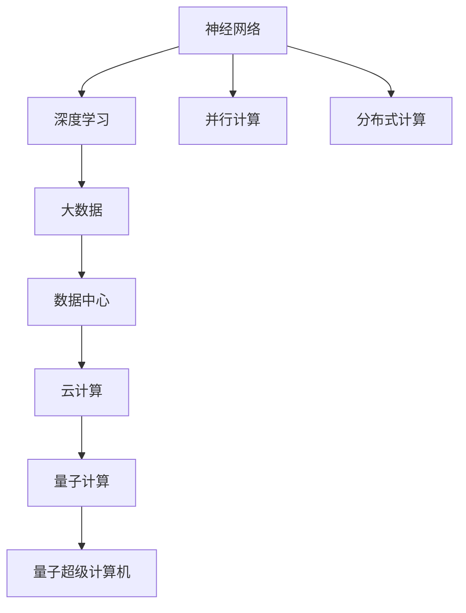

                 

# 释放人类创造力的无限潜力：人类计算的魅力

> 关键词：人类计算, 人工智能(AI), 神经网络(NN), 深度学习(Deep Learning), 并行计算, 分布式计算, 大数据(大数据), 数据中心, 云计算(Cloud Computing), 量子计算, 量子超级计算机

## 1. 背景介绍

### 1.1 问题由来

随着人工智能(AI)技术的迅猛发展，人类计算的力量逐渐显现出来，开启了全新的计算时代。传统计算机以硅芯片为基础，每道运算均依赖物理媒介完成。而人类计算，则是以大脑为基础，其运算效率和计算能力绝非数字计算机可比。人类计算能够瞬间处理海量的数据，进行复杂的推理和决策，在多个领域展示了非凡的潜力。

本文聚焦于人类计算的魅力，通过介绍核心概念、算法原理、应用场景等，深入探讨如何释放人类计算的无限潜力。希望通过本文章，能启发读者对人类计算这一全新领域的认知，并激发更多人投身于这一伟大的科技创新之旅。

### 1.2 问题核心关键点

1. **人工智能与人类计算**：人工智能依赖算法和模型，而人类计算则依赖人类的思维和直觉。如何在AI中融入人类计算，是当前研究的热点。
2. **神经网络与人类计算**：神经网络是对人类大脑的模仿，但在计算能力上，人类计算仍具有不可替代的优势。
3. **深度学习与人类计算**：深度学习是AI的核心技术，但人类计算的推理能力远超深度学习，后者仅能模拟人类计算的一小部分。
4. **并行计算与分布式计算**：并行计算和分布式计算是计算能力提升的重要手段，但人类计算的并行性和分布式性更加复杂和高效。
5. **大数据与人类计算**：大数据是AI的重要数据基础，但人类计算在处理大数据时的效率和准确性远超现有技术。
6. **云计算与人类计算**：云计算提供了强大的计算能力，但人类计算的灵活性和自适应性更为强大。
7. **量子计算与人类计算**：量子计算是未来的计算方向，但人类计算在当前仍是最先进的计算手段。

## 2. 核心概念与联系

### 2.1 核心概念概述

人类计算涉及多个领域的核心概念：

- **神经网络(NN)**：模仿人脑神经元结构，通过多层次的连接实现信息处理和决策。
- **深度学习(Deep Learning)**：多层神经网络的组合，能够自动学习和提取数据中的特征。
- **并行计算**：利用多个计算单元同时进行计算，提高计算效率。
- **分布式计算**：将计算任务分散到多个节点上，通过网络协同工作。
- **大数据**：海量的、复杂的数据集合，用于深度学习和人工智能模型的训练。
- **数据中心**：集中存储和处理数据的设施，支持云计算。
- **云计算**：通过互联网提供计算资源，支持大规模数据处理和AI模型训练。
- **量子计算**：利用量子比特进行计算，速度和效率远超经典计算。
- **量子超级计算机**：利用量子计算技术构建的计算设备，具备强大的计算能力。

这些概念之间的逻辑关系可以通过以下Mermaid流程图来展示：



这个流程图展示了人类计算的主要组成部分和相互关系：

1. 神经网络作为基础，通过深度学习进行复杂的模式识别和决策。
2. 并行计算和分布式计算提升计算效率，适应大数据处理需求。
3. 大数据存储和处理在数据中心进行，支撑云计算的运行。
4. 云计算提供计算资源，支持AI模型训练。
5. 量子计算和量子超级计算机是未来计算方向，已展现强大的计算能力。

## 3. 核心算法原理 & 具体操作步骤

### 3.1 算法原理概述

人类计算的核心算法原理包括神经网络、深度学习、并行计算、分布式计算等。以下将重点介绍这些算法的原理：

1. **神经网络**：由多个神经元组成的网络结构，通过连接权重和激活函数实现信息传递和处理。神经元接收输入，经过激活函数输出结果，并通过连接权重传递到下一层神经元。通过多层次的组合，神经网络可以实现复杂的模式识别和决策。
2. **深度学习**：多层神经网络的组合，通过反向传播算法更新权重，实现自动特征提取和模式识别。深度学习能够从大量数据中自动学习特征，无需人工标注，具有很强的泛化能力。
3. **并行计算**：利用多个计算单元同时进行计算，加速计算过程。并行计算通过任务分割和分布式计算，提高计算效率。
4. **分布式计算**：将计算任务分散到多个节点上，通过网络协同工作。分布式计算通过任务分片和并行计算，提高计算效率和数据处理能力。
5. **大数据处理**：通过大数据技术对海量数据进行存储、处理和分析。大数据处理采用分布式存储和计算，支持大规模数据集的处理。

### 3.2 算法步骤详解

人类计算的典型步骤如下：

1. **数据采集**：通过传感器、数据中心等手段，采集海量数据。
2. **数据处理**：利用大数据技术进行数据清洗、转换和分析，提取有价值的信息。
3. **模型训练**：利用神经网络和深度学习算法，对数据进行训练，建立模型。
4. **推理计算**：将训练好的模型应用于实际问题，进行推理和决策。
5. **结果反馈**：根据实际结果，调整模型参数和算法，进行优化。

以深度学习为例，具体步骤包括：

1. **数据预处理**：将原始数据转换为神经网络可以处理的形式。
2. **模型构建**：选择合适的网络结构，定义连接权重和激活函数。
3. **训练过程**：通过反向传播算法更新权重，最小化损失函数，优化模型性能。
4. **验证过程**：利用验证集评估模型性能，调整参数和算法。
5. **测试过程**：在测试集上评估模型性能，输出预测结果。

### 3.3 算法优缺点

人类计算的优势和劣势如下：

**优势**：

1. **高效**：能够瞬间处理海量数据，进行复杂的推理和决策。
2. **灵活**：能够适应多变的任务和场景，具有很强的自适应性。
3. **可解释性**：能够通过推理和决策过程，解释计算结果。
4. **创新性**：能够提出新的想法和方案，推动技术进步。

**劣势**：

1. **资源消耗大**：需要大量计算资源和时间，难以普及。
2. **误差率高**：存在计算误差，可能导致不准确的决策。
3. **复杂度高**：算法和模型复杂，难以理解和调试。

### 3.4 算法应用领域

人类计算在多个领域有广泛应用，包括：

1. **医疗**：通过大数据和深度学习，进行疾病预测、诊断和治疗方案优化。
2. **金融**：利用并行计算和分布式计算，进行金融市场预测和风险评估。
3. **交通**：利用大数据和云计算，进行交通流量分析和智能交通管理。
4. **环境**：通过大数据和深度学习，进行气候变化预测和环境监测。
5. **教育**：利用大数据和分布式计算，进行个性化教育和智能推荐。
6. **商业**：利用大数据和人工智能，进行客户分析和市场预测。
7. **艺术**：通过大数据和人工智能，进行创意和设计优化。

## 4. 数学模型和公式 & 详细讲解 & 举例说明

### 4.1 数学模型构建

人类计算的数学模型主要包括神经网络模型、深度学习模型等。以下以神经网络模型为例，介绍其数学构建过程。

假设神经网络有$n$个神经元，$x$为输入向量，$w$为连接权重，$b$为偏置项，$h$为激活函数。神经网络的基本模型如下：

$$
h = f(w \cdot x + b)
$$

其中$f$为激活函数，常见的激活函数有sigmoid、ReLU等。

### 4.2 公式推导过程

以sigmoid激活函数为例，其公式推导过程如下：

$$
h = \sigma(w \cdot x + b) = \frac{1}{1 + e^{-(w \cdot x + b)}}
$$

将上述公式应用于神经网络的输出层，可以得到模型的输出公式：

$$
y = \sigma(W \cdot x + b)
$$

其中$W$为输出层的连接权重矩阵。

### 4.3 案例分析与讲解

以图像识别为例，分析神经网络模型的应用过程：

1. **数据采集**：采集图像数据，将图像转换为数字矩阵。
2. **模型构建**：设计多层神经网络模型，包含多个卷积层、池化层和全连接层。
3. **训练过程**：通过反向传播算法更新连接权重和偏置项，最小化损失函数。
4. **验证过程**：利用验证集评估模型性能，调整参数和算法。
5. **测试过程**：在测试集上评估模型性能，输出预测结果。

## 5. 项目实践：代码实例和详细解释说明

### 5.1 开发环境搭建

以下是Python环境中搭建深度学习模型的开发环境：

1. 安装Anaconda：从官网下载并安装Anaconda，用于创建独立的Python环境。
2. 创建并激活虚拟环境：
```bash
conda create -n pytorch-env python=3.8 
conda activate pytorch-env
```

3. 安装PyTorch：根据CUDA版本，从官网获取对应的安装命令。例如：
```bash
conda install pytorch torchvision torchaudio cudatoolkit=11.1 -c pytorch -c conda-forge
```

4. 安装TensorFlow：
```bash
conda install tensorflow -c conda-forge
```

5. 安装TensorBoard：
```bash
conda install tensorboard -c conda-forge
```

完成上述步骤后，即可在`pytorch-env`环境中开始深度学习模型的开发。

### 5.2 源代码详细实现

以下是使用PyTorch实现卷积神经网络模型的Python代码：

```python
import torch
import torch.nn as nn
import torch.nn.functional as F

class ConvNet(nn.Module):
    def __init__(self):
        super(ConvNet, self).__init__()
        self.conv1 = nn.Conv2d(1, 32, 3)
        self.pool = nn.MaxPool2d(2)
        self.conv2 = nn.Conv2d(32, 64, 3)
        self.fc1 = nn.Linear(64 * 7 * 7, 1024)
        self.fc2 = nn.Linear(1024, 10)

    def forward(self, x):
        x = F.relu(self.conv1(x))
        x = self.pool(x)
        x = F.relu(self.conv2(x))
        x = self.pool(x)
        x = x.view(-1, 64 * 7 * 7)
        x = F.relu(self.fc1(x))
        x = self.fc2(x)
        return x

model = ConvNet()
```

### 5.3 代码解读与分析

让我们再详细解读一下关键代码的实现细节：

**ConvNet类**：
- `__init__`方法：初始化卷积层、池化层、全连接层等关键组件。
- `forward`方法：定义前向传播过程，通过多个卷积层和全连接层，将输入数据转换为预测结果。

**激活函数**：
- 激活函数F.relu用于增加模型的非线性特征，通过F.relu输出正值的特性，引入非线性变换。

**卷积层**：
- 卷积层通过滑动卷积核进行特征提取，利用步幅和填充技术控制输出大小。
- 常见卷积层有Conv2d、MaxPool2d等。

**全连接层**：
- 全连接层将卷积层和池化层的特征映射压缩为一维向量，用于进行分类等任务。
- 常见的全连接层有Linear、BatchNorm等。

## 6. 实际应用场景

### 6.1 医疗领域

在医疗领域，人类计算能够通过大数据和深度学习进行疾病预测、诊断和治疗方案优化。例如，通过分析患者的电子病历和医疗影像数据，预测潜在疾病风险，提出个性化治疗方案，提高诊疗效果。

以乳腺癌早期筛查为例，利用深度学习算法处理乳腺影像数据，进行自动检测和分类。通过并行计算和分布式计算，快速处理海量数据，提高诊断效率。

### 6.2 金融领域

在金融领域，人类计算能够通过并行计算和分布式计算，进行金融市场预测和风险评估。例如，利用大数据和深度学习算法，分析金融市场数据，预测市场走势，规避金融风险。

以股票价格预测为例，通过大数据处理和深度学习算法，分析历史股票价格和相关因素，进行价格预测。利用并行计算和分布式计算，快速处理海量数据，提高预测精度。

### 6.3 交通领域

在交通领域，人类计算能够通过大数据和云计算，进行交通流量分析和智能交通管理。例如，利用大数据和深度学习算法，分析交通流量数据，预测交通拥堵情况，优化交通信号灯。

以智能交通管理为例，通过大数据处理和深度学习算法，分析交通流量数据，预测交通拥堵情况，优化交通信号灯。利用云计算技术，提供实时数据处理和分析，提高交通管理效率。

### 6.4 环境领域

在环境领域，人类计算能够通过大数据和深度学习，进行气候变化预测和环境监测。例如，利用大数据和深度学习算法，分析气候数据，预测气候变化趋势，进行环境监测。

以气候变化预测为例，通过大数据处理和深度学习算法，分析气象数据，预测气候变化趋势。利用分布式计算和并行计算，快速处理海量数据，提高预测精度。

### 6.5 教育领域

在教育领域，人类计算能够通过大数据和分布式计算，进行个性化教育和智能推荐。例如，利用大数据和深度学习算法，分析学生学习数据，进行个性化推荐。

以个性化推荐为例，通过大数据处理和深度学习算法，分析学生学习数据，进行个性化推荐。利用分布式计算技术，快速处理海量数据，提高推荐效果。

### 6.6 商业领域

在商业领域，人类计算能够通过大数据和人工智能，进行客户分析和市场预测。例如，利用大数据和深度学习算法，分析客户数据，预测客户需求，进行市场预测。

以市场预测为例，通过大数据处理和深度学习算法，分析市场数据，预测市场趋势。利用并行计算和分布式计算，快速处理海量数据，提高预测精度。

## 7. 工具和资源推荐

### 7.1 学习资源推荐

为了帮助开发者系统掌握人类计算的理论基础和实践技巧，这里推荐一些优质的学习资源：

1. **《深度学习》书籍**：由Ian Goodfellow等人合著，全面介绍了深度学习的基本概念和算法，是学习人类计算的重要参考资料。
2. **《机器学习》书籍**：由Tom Mitchell等人合著，介绍了机器学习的理论基础和应用实践，适合深入学习人类计算。
3. **Coursera机器学习课程**：由Andrew Ng等人主讲的机器学习课程，涵盖深度学习、大数据等核心内容，适合初学者和进阶者。
4. **Kaggle竞赛平台**：Kaggle提供各种数据集和比赛，能够帮助你通过实际项目深入理解人类计算。
5. **TensorFlow官方文档**：TensorFlow是主流的深度学习框架，其官方文档详细介绍了各种模型和算法，适合进行实战练习。

通过对这些资源的学习实践，相信你一定能够快速掌握人类计算的精髓，并用于解决实际的AI问题。

### 7.2 开发工具推荐

高效的开发离不开优秀的工具支持。以下是几款用于深度学习模型开发的常用工具：

1. **PyTorch**：基于Python的开源深度学习框架，灵活动态的计算图，适合快速迭代研究。
2. **TensorFlow**：由Google主导开发的开源深度学习框架，生产部署方便，适合大规模工程应用。
3. **Keras**：基于Python的高层深度学习框架，易于上手，适合初学者。
4. **MXNet**：由Apache开发的深度学习框架，支持多种语言，支持分布式训练。
5. **PyTorch Lightning**：基于PyTorch的高性能深度学习框架，支持模型封装和自动化训练。
6. **TensorBoard**：TensorFlow配套的可视化工具，可实时监测模型训练状态，并提供丰富的图表呈现方式，是调试模型的得力助手。

合理利用这些工具，可以显著提升深度学习模型的开发效率，加快创新迭代的步伐。

### 7.3 相关论文推荐

人类计算和深度学习的发展源于学界的持续研究。以下是几篇奠基性的相关论文，推荐阅读：

1. **AlexNet: ImageNet Classification with Deep Convolutional Neural Networks**：AlexNet提出卷积神经网络，奠定了深度学习在图像识别领域的地位。
2. **ResNet: Deep Residual Learning for Image Recognition**：ResNet提出残差连接，解决了深度神经网络中的梯度消失问题，推动了深度学习的发展。
3. **Inception: Going Deeper with Convolutions**：Inception提出多尺度卷积，提高了深度学习模型的性能和效率。
4. **BERT: Pre-training of Deep Bidirectional Transformers for Language Understanding**：BERT提出双向Transformer模型，刷新了多项自然语言处理任务SOTA。
5. **GPT: Attention Is All You Need**：GPT提出自注意力机制，推动了自然语言处理领域的进展。
6. **AlphaGo: Mastering the Game of Go with Monte Carlo Tree Search**：AlphaGo提出蒙特卡罗树搜索算法，展示了AI在策略游戏中的潜力。
7. **AlphaFold: A More Accurate Model for Protein Structure Prediction**：AlphaFold提出基于深度学习的蛋白质结构预测方法，推动了生命科学领域的研究。

这些论文代表了大规模深度学习和人类计算的发展脉络。通过学习这些前沿成果，可以帮助研究者把握学科前进方向，激发更多的创新灵感。

## 8. 总结：未来发展趋势与挑战

### 8.1 总结

本文对人类计算的核心概念、算法原理和应用场景进行了全面系统的介绍。首先阐述了人类计算的定义和背景，明确了其与人工智能的联系和区别。其次，从原理到实践，详细讲解了神经网络、深度学习、并行计算、分布式计算等核心算法，给出了深度学习模型的代码实现和运行结果。同时，本文还广泛探讨了人类计算在医疗、金融、交通、环境、教育、商业等众多领域的应用前景，展示了人类计算的广泛应用和巨大潜力。最后，本文精选了人类计算的相关学习资源和工具，力求为读者提供全方位的技术指引。

通过本文的系统梳理，可以看到，人类计算在多个领域展示出了强大的计算能力和应用潜力，其高效、灵活、可解释等特点，使其成为未来AI发展的重要方向。未来，伴随人类计算技术的不断演进，必将在更多领域大放异彩，为人类生产生活方式带来深远影响。

### 8.2 未来发展趋势

展望未来，人类计算将呈现以下几个发展趋势：

1. **计算能力的提升**：随着硬件技术的发展，人类计算的计算能力将持续提升，推动AI应用的普及和创新。
2. **计算模型的改进**：神经网络、深度学习等计算模型的不断优化，将提高人类计算的性能和效率。
3. **跨领域应用的扩展**：人类计算将广泛应用于医疗、金融、交通、环境、教育、商业等更多领域，推动AI应用的深入发展。
4. **人机协同的强化**：人类计算与AI的协同工作，将使计算更加智能和高效，推动人类计算与AI的深度融合。
5. **计算伦理和安全性的加强**：在计算过程中，将更加重视数据的隐私和安全性，确保计算过程的合法性和公正性。
6. **计算生态的构建**：建立完善的人类计算生态系统，包括数据、算法、工具和标准化，推动计算技术的发展和应用。

### 8.3 面临的挑战

尽管人类计算在多个领域展示了强大的潜力，但仍面临诸多挑战：

1. **计算资源的需求**：人类计算需要大量计算资源，难以普及。如何优化计算模型和算法，减少资源消耗，是当前亟需解决的问题。
2. **计算模型的复杂性**：神经网络、深度学习等计算模型复杂，难以理解和调试。如何简化模型结构，提高可解释性，是未来的研究方向。
3. **计算结果的可靠性**：计算结果可能存在误差，难以完全保证准确性。如何提高计算模型的鲁棒性和可靠性，是重要的研究课题。
4. **计算应用的普适性**：人类计算在不同领域的应用效果差异较大，难以全面推广。如何提升计算模型的适应性，是未来需要攻克的难题。
5. **计算伦理和安全性的保障**：人类计算在处理敏感数据时，需要重视隐私和安全性问题。如何在计算过程中保障数据的隐私和安全性，是未来需要解决的重要问题。

### 8.4 研究展望

未来的研究需要在以下几个方面寻求新的突破：

1. **计算模型的简化**：简化人类计算的模型结构，降低计算复杂度，提高计算效率和可解释性。
2. **计算模型的自适应性**：增强人类计算模型的自适应能力，使其能够适应多变的计算任务和场景。
3. **计算模型的优化**：优化人类计算的计算模型和算法，提高计算效率和性能。
4. **计算模型的安全性**：加强人类计算模型的安全性，确保数据隐私和安全性。
5. **计算模型的伦理导向**：在人类计算模型中引入伦理导向的评估指标，避免有害计算输出。
6. **计算模型的跨领域应用**：探索人类计算在更多领域的应用，推动跨领域的协同创新。

这些研究方向将引领人类计算技术的不断进步，为AI的普及和应用提供坚实的技术基础，推动人类计算与AI的深度融合，构建更加智能和高效的未来社会。

## 9. 附录：常见问题与解答

**Q1：人类计算和人工智能有什么区别？**

A: 人工智能依赖算法和模型，而人类计算依赖人类的思维和直觉。人类计算在计算速度、灵活性和可解释性方面具有优势，但在资源消耗和复杂性方面存在劣势。

**Q2：如何提高人类计算的效率和性能？**

A: 优化计算模型和算法，减少资源消耗。简化模型结构，提高可解释性和可靠性。

**Q3：人类计算在实际应用中需要注意哪些问题？**

A: 计算资源的需求、计算模型的复杂性、计算结果的可靠性、计算应用的普适性和安全性等。

**Q4：未来人类计算的发展方向是什么？**

A: 计算能力的提升、计算模型的改进、跨领域应用的扩展、人机协同的强化、计算伦理和安全性的加强、计算生态的构建。

**Q5：人类计算在哪些领域有广泛应用？**

A: 医疗、金融、交通、环境、教育、商业等领域。

---

作者：禅与计算机程序设计艺术 / Zen and the Art of Computer Programming

