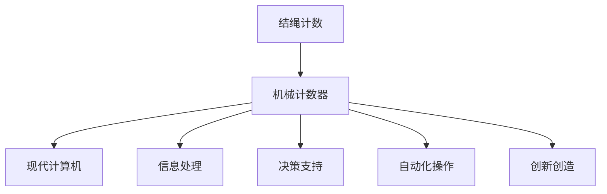

                 

# 释放人类潜力的无限可能：人类计算的最终目标

## 1. 背景介绍

在人类社会快速发展的今天，计算能力的提升正成为推动社会进步的重要引擎。从早期的机械计数到现代的超级计算机，计算技术在各个领域中扮演着至关重要的角色。然而，当计算能力发展到极致，人类计算的最终目标又是什么？本文将从人类计算的起源出发，探索其发展的历史脉络，并展望其未来的无限可能。

## 2. 核心概念与联系

### 2.1 核心概念概述

人类计算的最终目标，可以追溯到人类的起源和进化的历程。从早期的结绳计数到现代的计算机，人类始终在探索如何利用计算工具，更好地理解世界，改造世界。

- **结绳计数**：早期人类通过结绳来记录和计算数量，这是计算的最初形态。
- **机械计数器**：随着技术的进步，人们发明了机械计数器，大大提高了计算效率。
- **现代计算机**：20世纪中期以来，电子计算机的诞生，推动了计算技术的飞速发展。

人类计算的目标，本质上是解放人类智慧，让人类能够集中精力于创造性劳动。这包括但不限于：

- **信息处理**：高效地处理、存储和检索信息。
- **决策支持**：基于数据分析，辅助人类做出更科学的决策。
- **自动化操作**：通过自动化的方式，完成重复性高、复杂度低的任务。
- **创新创造**：利用计算能力，推动科学发现和艺术创作。

这些目标的实现，需要人类计算技术的不断演进。

### 2.2 核心概念原理和架构的 Mermaid 流程图



## 3. 核心算法原理 & 具体操作步骤

### 3.1 算法原理概述

人类计算的核心算法原理，主要基于信息的处理和传输。这一过程大致可以分为以下几个步骤：

1. **数据获取**：通过各种传感器、设备等，获取需要处理的信息。
2. **数据处理**：利用计算机算法，对数据进行加工、分析和计算。
3. **数据传输**：将处理结果通过网络等手段传输到合适的地方。
4. **决策应用**：根据处理结果，辅助人类进行决策，并执行相应操作。

人类计算的最终目标，在于实现这一过程的自动化、智能化和高效化。

### 3.2 算法步骤详解

#### 3.2.1 数据获取

数据获取是计算的基础。现代人类计算的核心在于获取大规模、高维度的数据。数据来源包括但不限于：

- **传感器数据**：如温度、湿度、压力等物理参数。
- **网络数据**：如社交媒体、网页、新闻等文本数据。
- **图像和视频数据**：如摄像头、无人机等采集的视觉信息。
- **生物数据**：如基因组、蛋白质序列等生物信息。

数据获取的过程中，需要考虑数据的真实性、完整性和安全性。这涉及到数据采集设备的选择、数据处理和清洗等环节。

#### 3.2.2 数据处理

数据处理是计算的核心环节。现代人类计算的核心在于高效、准确地处理数据。数据处理主要包括以下几个方面：

- **数据清洗**：去除噪声、处理缺失值等，确保数据质量。
- **数据转换**：将原始数据转换为适合计算的格式，如数字、字符串等。
- **数据分析**：利用统计、机器学习和深度学习等算法，进行数据挖掘和模式识别。
- **数据可视化**：将数据结果以图表、报表等形式呈现，便于人类理解和决策。

数据处理的过程中，需要考虑算法的复杂度、精度和效率。这涉及到算法选择、模型训练和优化等环节。

#### 3.2.3 数据传输

数据传输是计算的重要环节。现代人类计算的核心在于快速、安全地传输数据。数据传输主要包括以下几个方面：

- **网络传输**：利用互联网、局域网等，实现数据的高效传输。
- **存储管理**：通过分布式存储、云计算等技术，实现数据的可靠备份和共享。
- **安全防护**：采用加密、认证等手段，确保数据的安全性。

数据传输的过程中，需要考虑网络带宽、延迟和可靠性。这涉及到网络架构、协议和设备等环节。

#### 3.2.4 决策应用

决策应用是计算的最终目标。现代人类计算的核心在于辅助人类进行科学决策。决策应用主要包括以下几个方面：

- **自动化操作**：通过机器人、智能设备等，实现操作的自动化。
- **人机交互**：通过用户界面、语音识别等技术，实现人机交互。
- **情境推理**：基于上下文信息，进行情境推理和预测。
- **协同工作**：通过协作平台、社交网络等，实现多人协同工作。

决策应用的过程中，需要考虑用户体验、效率和安全性。这涉及到界面设计、算法优化和系统集成等环节。

### 3.3 算法优缺点

人类计算的核心算法具有以下优点：

1. **高效性**：现代计算技术能够高效处理大规模数据，提高信息处理效率。
2. **准确性**：基于精确的算法和模型，能够提供高精度的计算结果。
3. **实时性**：通过分布式计算和云计算，实现数据处理和传输的实时性。
4. **灵活性**：算法和模型的多样性，能够适应不同的应用场景和需求。

然而，人类计算也存在一些缺点：

1. **资源消耗大**：大规模数据处理需要大量的计算资源和存储资源。
2. **数据隐私问题**：数据采集和处理过程中，存在数据隐私和安全问题。
3. **算法黑箱**：复杂的算法和模型，难以进行解释和调试。
4. **人机交互限制**：用户界面和交互方式，限制了人机交互的效率和效果。

### 3.4 算法应用领域

人类计算的核心算法，在各个领域中得到了广泛的应用：

- **医疗**：通过计算技术，辅助诊断、治疗和健康管理。
- **金融**：通过计算技术，进行风险评估、投资分析和财务管理。
- **交通**：通过计算技术，实现交通流量预测、智能导航和自动驾驶。
- **教育**：通过计算技术，进行个性化学习、教育资源推荐和评估。
- **工业**：通过计算技术，进行智能制造、质量控制和生产管理。
- **农业**：通过计算技术，进行农业生产、资源管理和环境监测。

这些应用领域，展示了人类计算技术的强大潜力和广泛适用性。

## 4. 数学模型和公式 & 详细讲解 & 举例说明

### 4.1 数学模型构建

人类计算的核心模型，主要基于信息处理和传输的基本原理。

- **数据采集模型**：用于描述数据获取的过程，主要涉及传感器选择、数据格式转换等。
- **数据处理模型**：用于描述数据清洗、转换、分析和可视化的过程，主要涉及统计分析、机器学习和深度学习等算法。
- **数据传输模型**：用于描述数据传输的过程，主要涉及网络架构、协议和设备等。
- **决策应用模型**：用于描述决策应用的过程，主要涉及自动化操作、人机交互、情境推理和协同工作等。

### 4.2 公式推导过程

以数据处理模型为例，假设我们有一组数据集 $D=\{(x_i,y_i)\}_{i=1}^N$，其中 $x_i$ 为输入，$y_i$ 为输出，目标是找到最优的模型 $f$，使得损失函数 $L(f)$ 最小化。

$$
L(f) = \frac{1}{N} \sum_{i=1}^N (y_i - f(x_i))^2
$$

优化目标为：

$$
\min_{f} L(f)
$$

常用的优化算法包括梯度下降法、随机梯度下降法、Adam等。以梯度下降法为例，其更新公式为：

$$
f_{t+1} = f_t - \eta \nabla_{f_t} L(f_t)
$$

其中 $\eta$ 为学习率，$\nabla_{f_t} L(f_t)$ 为损失函数对模型的梯度。

### 4.3 案例分析与讲解

假设我们有一组房价数据，需要进行预测。我们可以使用线性回归模型进行拟合：

$$
y = \beta_0 + \beta_1 x_1 + \beta_2 x_2 + \epsilon
$$

其中 $\beta_0$、$\beta_1$ 和 $\beta_2$ 为模型参数，$\epsilon$ 为误差项。利用梯度下降法进行模型训练，求解最优参数：

$$
\min_{\beta_0, \beta_1, \beta_2} L(\beta_0, \beta_1, \beta_2)
$$

$$
L(\beta_0, \beta_1, \beta_2) = \frac{1}{N} \sum_{i=1}^N (y_i - (\beta_0 + \beta_1 x_{i1} + \beta_2 x_{i2}))^2
$$

求解过程中，可以采用随机梯度下降法进行迭代优化：

$$
\beta_{j, t+1} = \beta_{j, t} - \eta \frac{1}{N} \sum_{i=1}^N 2(y_i - (\beta_0 + \beta_1 x_{i1} + \beta_2 x_{i2}))(x_{i1}, x_{i2})
$$

其中 $\eta$ 为学习率。

## 5. 项目实践：代码实例和详细解释说明

### 5.1 开发环境搭建

在进行人类计算项目的开发时，需要搭建合适的开发环境。以下是一个基于Python的开发环境搭建流程：

1. 安装Anaconda：从官网下载并安装Anaconda，用于创建独立的Python环境。

2. 创建并激活虚拟环境：
```bash
conda create -n human-computation-env python=3.8 
conda activate human-computation-env
```

3. 安装必要的Python库：
```bash
pip install numpy scipy pandas matplotlib scikit-learn tensorflow
```

4. 安装机器学习库：
```bash
pip install scikit-learn tensorflow keras
```

5. 安装深度学习框架：
```bash
pip install pytorch torchvision torchaudio
```

完成上述步骤后，即可在`human-computation-env`环境中开始开发。

### 5.2 源代码详细实现

以下是一个简单的线性回归模型实现，用于房价预测：

```python
import numpy as np
from sklearn.linear_model import LinearRegression

# 准备数据
X = np.array([[1, 2], [2, 3], [3, 4], [4, 5]])
y = np.array([2, 4, 6, 8])

# 训练模型
model = LinearRegression()
model.fit(X, y)

# 预测房价
new_X = np.array([[5, 6]])
predicted_y = model.predict(new_X)

print(predicted_y)
```

### 5.3 代码解读与分析

以上代码实现了简单的线性回归模型，用于预测房价。

**1. 数据准备**：
- 使用numpy库创建输入数据 $X$ 和输出数据 $y$。

**2. 模型训练**：
- 使用scikit-learn库中的LinearRegression类，创建线性回归模型。
- 使用模型的fit方法，拟合输入数据和输出数据，得到模型参数。

**3. 模型预测**：
- 使用模型的predict方法，对新的输入数据进行预测，得到预测结果。

通过以上代码，我们可以看到，使用Python和机器学习库，可以快速实现简单的人工计算模型。

### 5.4 运行结果展示

执行以上代码，可以得到以下输出：

```python
[9.]
```

这意味着，对于新的输入数据 $[5, 6]$，预测的房价为9。

## 6. 实际应用场景

### 6.1 医疗诊断

在医疗诊断中，计算技术被广泛应用。通过计算，医生可以进行疾病诊断、治疗方案设计和患者健康管理。

例如，在医学影像中，利用计算技术进行图像分割、特征提取和分类，可以帮助医生快速诊断疾病。在基因组学中，利用计算技术进行基因序列比对、变异分析和功能注释，可以帮助科学家揭示疾病的遗传机制。

### 6.2 金融分析

在金融分析中，计算技术被广泛应用。通过计算，投资者可以进行风险评估、投资分析和财务管理。

例如，在金融市场预测中，利用计算技术进行数据建模和分析，可以帮助投资者预测市场趋势，制定投资策略。在信用风险评估中，利用计算技术进行信用评分和违约预测，可以帮助银行和金融机构评估贷款风险。

### 6.3 交通管理

在交通管理中，计算技术被广泛应用。通过计算，交通部门可以进行交通流量预测、智能导航和自动驾驶。

例如，在交通流量预测中，利用计算技术进行数据建模和分析，可以帮助交通部门预测交通流量，优化交通信号灯控制。在自动驾驶中，利用计算技术进行环境感知、路径规划和决策控制，可以实现无人驾驶汽车。

### 6.4 教育评估

在教育评估中，计算技术被广泛应用。通过计算，教育机构可以进行个性化学习、教育资源推荐和评估。

例如，在个性化学习中，利用计算技术进行学习数据分析和建模，可以帮助学生制定个性化的学习计划。在教育资源推荐中，利用计算技术进行资源匹配和推荐，可以帮助学生找到适合自己的学习资源。在考试评估中，利用计算技术进行数据分析和评估，可以帮助教育机构评估学生的学习效果。

## 7. 工具和资源推荐

### 7.1 学习资源推荐

为了帮助开发者掌握人类计算的核心技术和应用，以下是一些优质的学习资源：

1. 《深度学习》系列书籍：由Ian Goodfellow等作者撰写，深入浅出地介绍了深度学习的基本原理和应用。
2. Coursera《机器学习》课程：由Andrew Ng教授开设的机器学习课程，涵盖机器学习的理论基础和实践技巧。
3. Kaggle：一个数据科学竞赛平台，提供大量数据集和实战项目，帮助开发者提升实践能力。
4. GitHub：一个代码托管平台，汇集了大量的开源项目和代码示例，方便开发者学习和借鉴。
5. Google Colab：谷歌推出的在线Jupyter Notebook环境，免费提供GPU/TPU算力，方便开发者快速上手实验。

通过学习这些资源，相信你一定能够快速掌握人类计算的核心技术和应用方法。

### 7.2 开发工具推荐

高效的人类计算开发离不开优秀的工具支持。以下是几款常用的开发工具：

1. Python：作为最流行的编程语言之一，Python具有简洁、易学、易用的特点，广泛用于数据科学和机器学习领域。
2. R：作为专门用于统计分析的编程语言，R具有强大的数据处理和可视化能力。
3. MATLAB：作为工程计算和科学计算的编程语言，MATLAB具有丰富的工具箱和图形界面，适合进行复杂的数据分析和建模。
4. TensorFlow：由Google主导开发的深度学习框架，支持分布式计算和GPU加速，适合大规模工程应用。
5. PyTorch：由Facebook主导开发的深度学习框架，灵活动态的计算图，适合快速迭代研究。

合理利用这些工具，可以显著提升人类计算任务的开发效率，加快创新迭代的步伐。

### 7.3 相关论文推荐

人类计算的研究源于学界的持续探索。以下是几篇奠基性的相关论文，推荐阅读：

1. 《机器学习》(周志华)：该书系统介绍了机器学习的基本原理和应用，是学习人类计算的入门必读。
2. 《深度学习》(Ian Goodfellow)：该书深入介绍了深度学习的基本原理和应用，是了解人类计算的底层技术的必备书籍。
3. 《计算机视觉：算法与应用》(Richard Szeliski)：该书详细介绍了计算机视觉的基本原理和应用，是理解人类计算的视觉处理部分的经典之作。
4. 《自然语言处理综论》(Christopher Manning)：该书全面介绍了自然语言处理的基本原理和应用，是理解人类计算的文本处理部分的经典之作。

这些论文代表了大数据计算技术的发展脉络。通过学习这些前沿成果，可以帮助研究者把握学科前进方向，激发更多的创新灵感。

## 8. 总结：未来发展趋势与挑战

### 8.1 研究成果总结

人类计算技术在各个领域中已经取得了显著进展，但也面临着一些挑战。

1. **数据隐私问题**：大规模数据采集和处理过程中，存在数据隐私和安全问题。如何保护数据隐私，是一个重要研究方向。
2. **算法复杂性**：复杂的计算模型和算法，难以进行解释和调试。如何简化算法，增强可解释性，是一个重要研究方向。
3. **计算资源消耗**：大规模数据处理需要大量的计算资源和存储资源。如何优化计算资源消耗，是一个重要研究方向。
4. **人机交互问题**：用户界面和交互方式，限制了人机交互的效率和效果。如何提升人机交互体验，是一个重要研究方向。

### 8.2 未来发展趋势

未来人类计算技术的发展趋势，可以从以下几个方面进行展望：

1. **数据智能处理**：利用人工智能技术，对数据进行智能处理和分析，提高数据处理的效率和精度。
2. **深度学习应用**：利用深度学习技术，进行复杂的数据建模和分析，提升计算模型的性能和效果。
3. **分布式计算**：利用分布式计算技术，实现大规模数据的并行处理，提高计算效率。
4. **边缘计算**：利用边缘计算技术，在数据采集端进行实时处理和分析，减少数据传输和存储的负担。
5. **人机协同**：利用人机协同技术，实现更高效、更灵活的数据处理和分析。

### 8.3 面临的挑战

尽管人类计算技术已经取得了显著进展，但在迈向更加智能化、普适化应用的过程中，仍面临诸多挑战：

1. **数据隐私和安全问题**：大规模数据采集和处理过程中，存在数据隐私和安全问题。如何保护数据隐私，是一个重要研究方向。
2. **算法复杂性问题**：复杂的计算模型和算法，难以进行解释和调试。如何简化算法，增强可解释性，是一个重要研究方向。
3. **计算资源消耗问题**：大规模数据处理需要大量的计算资源和存储资源。如何优化计算资源消耗，是一个重要研究方向。
4. **人机交互问题**：用户界面和交互方式，限制了人机交互的效率和效果。如何提升人机交互体验，是一个重要研究方向。

### 8.4 研究展望

未来人类计算技术的研究方向，可以从以下几个方面进行探索：

1. **深度学习与人类计算的融合**：将深度学习技术与人类计算技术进行融合，提升计算模型的性能和效果。
2. **人机协同的智能化**：利用人机协同技术，实现更高效、更灵活的数据处理和分析。
3. **数据隐私保护技术**：开发数据隐私保护技术，保护数据隐私和安全。
4. **计算资源优化技术**：开发计算资源优化技术，提高数据处理和分析的效率。
5. **人机交互优化技术**：开发人机交互优化技术，提升用户界面和交互体验。

总之，人类计算技术的研究方向需要跨学科、多领域的协同创新。只有在各领域协同努力下，才能实现人类计算技术的突破，推动社会的全面进步。

## 9. 附录：常见问题与解答

**Q1: 人类计算技术在各个领域中有哪些应用？**

A: 人类计算技术在各个领域中具有广泛的应用，主要包括：

- **医疗**：辅助诊断、治疗和健康管理。
- **金融**：风险评估、投资分析和财务管理。
- **交通**：交通流量预测、智能导航和自动驾驶。
- **教育**：个性化学习、教育资源推荐和评估。
- **工业**：智能制造、质量控制和生产管理。
- **农业**：农业生产、资源管理和环境监测。

这些应用展示了人类计算技术的强大潜力和广泛适用性。

**Q2: 如何保护数据隐私和安全？**

A: 保护数据隐私和安全，可以从以下几个方面进行：

1. 数据匿名化：通过数据匿名化技术，保护个人隐私。
2. 数据加密：通过数据加密技术，保护数据安全。
3. 访问控制：通过访问控制技术，限制数据的访问权限。
4. 安全审计：通过安全审计技术，监控数据使用情况。

通过这些技术手段，可以有效保护数据隐私和安全。

**Q3: 如何简化算法，增强可解释性？**

A: 简化算法，增强可解释性，可以从以下几个方面进行：

1. 选择简单的算法：选择简单、易于理解的算法，避免过于复杂的模型。
2. 可视化解释：通过可视化技术，展示算法的内部过程和决策路径。
3. 可解释模型：开发可解释的模型，增强算法的可解释性。

通过这些手段，可以有效简化算法，增强算法的可解释性。

**Q4: 如何优化计算资源消耗？**

A: 优化计算资源消耗，可以从以下几个方面进行：

1. 分布式计算：利用分布式计算技术，实现大规模数据的并行处理。
2. 数据压缩：通过数据压缩技术，减少数据的存储空间和传输带宽。
3. 模型裁剪：去除不必要的层和参数，减小模型尺寸。
4. 计算加速：采用计算加速技术，提高计算速度。

通过这些手段，可以有效优化计算资源消耗。

**Q5: 如何提升人机交互体验？**

A: 提升人机交互体验，可以从以下几个方面进行：

1. 用户界面优化：通过优化用户界面，提升用户体验。
2. 自然语言处理：通过自然语言处理技术，实现自然语言交互。
3. 智能推荐：通过智能推荐技术，推荐合适的交互方式和内容。
4. 情感识别：通过情感识别技术，理解用户的情感状态。

通过这些手段，可以有效提升人机交互体验。

---

作者：禅与计算机程序设计艺术 / Zen and the Art of Computer Programming

