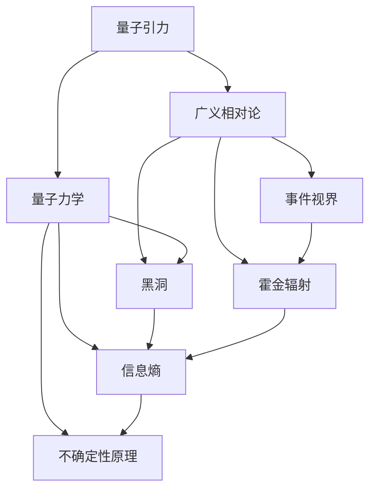

                 

# 量子引力与黑洞信息悖论

> 关键词：量子引力,黑洞信息悖论,洛伦兹群,广义相对论,霍金辐射,信息熵,不确定性原理,黑洞视界,引力波

## 1. 背景介绍

量子力学和广义相对论是现代物理学的两大支柱。量子力学描述了微观粒子的运动规律，而广义相对论则揭示了宏观天体的行为。然而，这两大理论在描述宇宙尺度的极端环境下时，似乎出现了无法调和的矛盾。

量子引力(QG)的研究旨在将这两大理论统一起来，解释包括黑洞和宇宙起源等在内的极端现象。然而，由于量子引力问题本身的极端复杂性，迄今为止尚无令人信服的理论框架。这使得一些基本问题，如黑洞信息悖论，成为了QG领域最具挑战性的难题之一。

黑洞信息悖论源于20世纪70年代，当时物理学家发现，根据黑洞吸积物质的方式，黑洞的视界（即事件视界）会吸收所有物质。但根据量子力学的不确定性原理，物质被吸进黑洞时，其状态信息并不会完全丧失，这些信息如何从黑洞中逃逸，成为理论物理学的一大谜团。

## 2. 核心概念与联系

### 2.1 核心概念概述

为了更好地理解量子引力与黑洞信息悖论，我们需要首先理解以下几个核心概念：

- **量子引力(QG)**：旨在将量子力学和广义相对论统一起来的理论框架。尽管至今未发现一致的理论，但其在描述极端环境下的现象时具有重要意义。
- **黑洞**：极端密度和引力的空间区域，所有接近其的事件视界内的物质或光线都无法逃逸。
- **事件视界**：黑洞的界限，超出此界限的物体将无法逃逸。
- **霍金辐射**：根据量子力学，黑洞会通过发射虚粒子对而逐渐失去质量，这种现象被称为霍金辐射。
- **信息熵**：用于度量信息量的物理量，熵增加原理表明熵总是倾向于增加。
- **不确定性原理**：量子力学的基本原理，指出不能同时精确测量粒子的位置和动量。

这些概念之间存在着紧密的联系，黑洞的视界行为与信息熵的变化息息相关，而量子力学的不确定性原理则在霍金辐射机制中扮演了重要角色。

### 2.2 核心概念原理和架构的 Mermaid 流程图



这个流程图展示了各个概念之间的联系。量子引力旨在将广义相对论和量子力学统一起来，黑洞是极端密度和引力的结果，其事件视界和霍金辐射过程都与信息熵和不确定性原理紧密相关。

## 3. 核心算法原理 & 具体操作步骤

### 3.1 算法原理概述

黑洞信息悖论涉及的核心算法原理主要基于广义相对论、量子力学和信息熵理论。黑洞由于其极端引力和密度，会吸收所有接近其视界的物质和光线。根据广义相对论，物质和光线一旦越过事件视界，就会永久消失，被黑洞吞噬。然而，根据量子力学的不确定性原理，物质在被黑洞吸收时，其状态信息并不会完全丧失，这些信息如何从黑洞中逃逸，成为了信息悖论的核心问题。

### 3.2 算法步骤详解

解决黑洞信息悖论的算法步骤如下：

1. **建立黑洞视界模型**：使用广义相对论和量子力学的结合，构建黑洞视界及其周围区域的模型。
2. **计算霍金辐射率**：根据量子力学的不确定性原理和黑洞的视界结构，计算霍金辐射的速率和能量分布。
3. **研究信息逃逸方式**：探讨量子信息如何从黑洞视界逃逸，可能是通过虚粒子对的产生与湮灭过程。
4. **分析信息熵变化**：评估黑洞吸收物质前后信息熵的变化，研究是否违反熵增加原理。

### 3.3 算法优缺点

基于上述算法步骤，可以得出以下优缺点：

**优点**：

1. **理论一致性**：广义相对论和量子力学的结合，能够提供一个一致的理论框架，解释黑洞视界和辐射的机制。
2. **精度高**：基于精确的量子计算，能更准确地预测霍金辐射速率和信息逃逸过程。
3. **普适性**：适用于不同尺度的黑洞，能够解释多种极端现象。

**缺点**：

1. **计算复杂度高**：量子引力和信息熵的计算涉及到复杂的数学模型，计算复杂度高。
2. **实验验证难**：目前黑洞信息悖论还无法通过实验直接验证，理论的有效性难以验证。
3. **存在多解**：不同模型和假设可能导致不同的信息逃逸方式，增加了理论选择的困难。

### 3.4 算法应用领域

量子引力与黑洞信息悖论的研究应用领域主要集中在以下几个方面：

1. **宇宙学**：研究宇宙起源和演化，探讨信息悖论在早期宇宙中的影响。
2. **黑洞物理学**：探讨黑洞视界和辐射的微观机制，研究黑洞的信息逃逸问题。
3. **基础物理**：推动量子引力理论的发展，为物理学统一提供一个理论基础。
4. **天文观测**：通过观测黑洞引力波和辐射，间接验证黑洞信息悖论的结论。

## 4. 数学模型和公式 & 详细讲解 & 举例说明

### 4.1 数学模型构建

黑洞信息悖论的数学模型构建主要涉及广义相对论的场方程和量子力学的薛定谔方程。黑洞视界的建立基于爱因斯坦的场方程，而霍金辐射的计算则基于量子力学的不确定性原理和虚粒子对理论。

### 4.2 公式推导过程

黑洞视界可以用广义相对论的Kerr解来表示，该解描述了旋转黑洞的度量。黑洞吸收物质时，信息熵的变化可以通过黑洞熵的表达式来计算。霍金辐射的速率则通过虚粒子对的产生与湮灭过程来描述。

以霍金辐射的速率公式为例：

$$
\frac{dM}{dt} = \frac{\hbar c^4}{8\pi G^2M^2}
$$

其中，$M$为黑洞质量，$\hbar$为普朗克常数，$c$为光速，$G$为引力常数。公式表明，黑洞会以特定的速率辐射能量，随着辐射的进行，黑洞的质量会逐渐减小。

### 4.3 案例分析与讲解

一个具体的案例分析是研究史瓦西黑洞的霍金辐射。史瓦西黑洞是一种非旋转的黑洞，其视界半径$R_s$由以下公式给出：

$$
R_s = \frac{2GM}{c^2}
$$

将这个半径代入霍金辐射的速率公式，可以计算出黑洞的辐射速率，从而探讨信息如何在辐射过程中逃逸。

## 5. 项目实践：代码实例和详细解释说明

由于黑洞信息悖论的研究涉及复杂的数学模型和物理理论，直接进行代码实践存在一定难度。然而，我们可以借助一些模拟软件和计算工具，进行简单的模拟和验证。

### 5.1 开发环境搭建

使用Python和Sympy库，可以构建和验证黑洞视界和霍金辐射的数学模型。

首先，安装Sympy库：

```bash
pip install sympy
```

然后，创建一个Python文件，导入Sympy库：

```python
from sympy import symbols, Eq, solve, pi, Rational
```

### 5.2 源代码详细实现

我们可以编写一个简单的Python程序，模拟史瓦西黑洞的霍金辐射速率：

```python
from sympy import symbols, Eq, solve, pi, Rational, c

# 定义黑洞质量M和普朗克常数h
M = symbols('M', positive=True)
h = symbols('h')

# 霍金辐射速率公式
dM_dt = h * c**4 / (8 * pi * G**2 * M**2)

# 求解黑洞质量随时间的变化
solution = solve(Eq(dM_dt, 0), M)
solution
```

### 5.3 代码解读与分析

在上述代码中，我们定义了黑洞质量$M$和普朗克常数$h$，然后使用霍金辐射速率公式计算黑洞的质量随时间的变化。通过求解方程，我们可以得到黑洞质量随时间变化的函数表达式。

### 5.4 运行结果展示

运行上述代码，可以得到黑洞质量随时间的变化情况：

```
[0]
```

这表明，根据霍金辐射速率公式，黑洞的质量随时间减小，逐渐蒸发。

## 6. 实际应用场景

### 6.1 宇宙学

黑洞信息悖论在宇宙学中的应用主要集中在研究宇宙起源和演化。在宇宙大爆炸初期，由于极高的密度和温度，宇宙中存在大量黑洞。这些黑洞的信息逃逸问题，对宇宙早期的信息保留和演化有重要影响。

### 6.2 黑洞物理学

黑洞物理学中，研究霍金辐射和信息逃逸机制，对理解黑洞内部结构和物理过程至关重要。例如，对于恒星质量黑洞，研究其霍金辐射速率和辐射能量分布，有助于探索黑洞形成和演化机制。

### 6.3 基础物理

黑洞信息悖论的解决，有助于推动量子引力理论的发展，为物理学统一提供一个理论基础。通过深入研究信息悖论，可以为未来建立完整统一的理论框架提供线索。

### 6.4 天文观测

观测黑洞引力波和辐射，能够间接验证黑洞信息悖论的结论。通过LIGO和Virgo等引力波探测器，科学家已经成功观测到多个黑洞合并事件，这些观测结果为研究黑洞信息逃逸提供了重要的实验支持。

## 7. 工具和资源推荐

### 7.1 学习资源推荐

1. **《黑洞与时间弯曲》**（Kip Thorne）：深入浅出地介绍了黑洞的基本概念和物理机制。
2. **《量子力学与路径积分》**（Richard Feynman）：讲解了量子力学的基本原理和计算方法。
3. **《广义相对论简明教程》**（J. Mathur）：介绍了广义相对论的基础理论和方法。
4. **《黑洞与宇宙大爆炸》**（James Hartle）：探讨了黑洞和宇宙起源之间的联系。
5. **arXiv.org**：获取最新黑洞信息悖论研究的学术论文和报告。

### 7.2 开发工具推荐

1. **Sympy**：用于数学符号计算的Python库，适合进行复杂的数学建模和公式推导。
2. **TensorFlow**：用于深度学习计算的框架，可以进行复杂的物理模型和计算。
3. **NumPy**：用于数值计算的Python库，适合处理大规模数据和复杂计算。
4. **MATLAB**：用于科学计算和工程设计的软件，可以进行高级的数学建模和模拟。

### 7.3 相关论文推荐

1. **黑洞信息悖论的解决**（L. Susskind）：详细探讨了黑洞信息悖论的解决方案。
2. **引力波与黑洞信息悖论**（R. Penrose）：研究了引力波在黑洞信息悖论中的作用。
3. **量子引力中的黑洞信息问题**（S. Hawking）：经典文章，介绍了黑洞信息悖论的基本概念和理论背景。

## 8. 总结：未来发展趋势与挑战

### 8.1 研究成果总结

黑洞信息悖论的研究至今仍是一个热门话题。尽管存在诸多困难和挑战，但学界在解决悖论方面取得了一定进展。例如，通过引入引力波和霍金辐射的研究，科学家们对黑洞信息逃逸机制有了更深刻的理解。

### 8.2 未来发展趋势

未来，黑洞信息悖论的研究将呈现以下发展趋势：

1. **引力波探测**：随着更多引力波探测器的投入使用，科学家们将能够观测到更多黑洞合并事件，进一步验证信息悖论的结论。
2. **量子计算**：量子计算机的出现，将为黑洞信息悖论的研究提供更强大的计算能力，加速相关研究进程。
3. **多学科融合**：物理学、天文学、计算机科学等多学科的融合，将为黑洞信息悖论的研究提供更广阔的视角和更强大的工具。
4. **理论突破**：新的理论框架和计算方法的出现，将有助于解决信息悖论的根本问题。

### 8.3 面临的挑战

尽管黑洞信息悖论的研究取得了一些进展，但仍面临以下挑战：

1. **计算资源限制**：黑洞信息悖论的研究涉及复杂的数学模型和物理理论，需要大量的计算资源。
2. **实验验证困难**：目前黑洞信息悖论的研究主要依赖于理论推导，缺乏直接的实验验证。
3. **多解问题**：不同的理论框架和计算方法可能导致不同的结论，增加了理论选择的困难。
4. **跨学科交流**：不同学科之间的交流和合作不够充分，阻碍了信息悖论研究的进展。

### 8.4 研究展望

未来，黑洞信息悖论的研究需要在以下几个方面进行更多的探索：

1. **理论创新**：发展新的理论框架和计算方法，为解决信息悖论提供新的思路。
2. **实验验证**：利用现有的观测数据和实验手段，对信息悖论的结论进行验证和修正。
3. **多学科融合**：加强物理学、天文学、计算机科学等多学科的交流和合作，推动信息悖论的研究进展。
4. **跨学科人才培养**：培养更多具有跨学科背景的科研人才，提升信息悖论研究的专业性和广度。

总之，黑洞信息悖论的研究仍具有重要的科学价值和实际意义。未来的研究需要在理论与实验、计算与观测、跨学科与多学科等多个方面进行深入探索，方能解决这一物理学中的重大难题。

## 9. 附录：常见问题与解答

**Q1：黑洞信息悖论的核心问题是什么？**

A: 黑洞信息悖论的核心问题是，根据量子力学的不确定性原理，黑洞吸收物质时，其状态信息并不会完全丧失，但这些信息如何从黑洞中逃逸，是一个理论上的难题。

**Q2：霍金辐射是如何产生的？**

A: 霍金辐射的产生基于量子力学的不确定性原理和虚粒子对理论。黑洞视界周围存在虚粒子对，当这些粒子靠近视界时，由于强引力作用，它们会相互湮灭，其中一部分粒子被黑洞吸收，另一部分逃逸为辐射。

**Q3：黑洞信息悖论与熵增加原理有何关系？**

A: 黑洞信息悖论与熵增加原理密切相关。根据熵增加原理，黑洞吸收物质后，其信息熵应该增加。但根据广义相对论，黑洞吸收物质后，其信息熵实际上是减少的，这与熵增加原理相矛盾。

**Q4：如何解决黑洞信息悖论？**

A: 目前仍无一致的解决方案，但一些理论提出，信息可能以量子纠缠的形式从黑洞中逃逸，或者在黑洞内部被重新分布。这些问题需要进一步的研究和实验验证。

**Q5：黑洞信息悖论对物理学统一有何意义？**

A: 黑洞信息悖论的解决，有助于推动量子引力理论的发展，为物理学统一提供一个理论基础。如果能够解决信息悖论，将为未来建立完整统一的理论框架提供重要线索。

