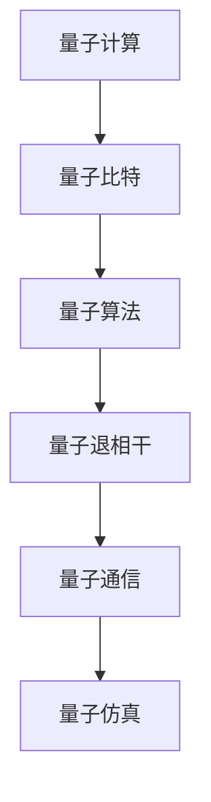

                 

## 1. 背景介绍

### 1.1 问题由来

量子计算被视为计算领域的一次革命，其潜在能力远超经典计算。自20世纪末量子计算概念提出以来，科研界对其兴趣与日俱增，投入巨资进行研发。从IBM推出首台商业化的量子计算机，到谷歌宣布“量子霸权”的实现，量子计算技术逐步从实验室走向商业化。

然而，量子计算目前仍处于初级阶段，存在诸多技术挑战和应用限制。现有的量子计算设备尚无法解决复杂的实际问题，实现商业化的量产仍需时日。与此同时，如何最大化量子计算的潜力，推动其在更广阔的领域应用，成为当下极为重要的议题。

### 1.2 问题核心关键点

量子计算创业的关注点主要包括以下几个方面：

- **技术成熟度**：量子计算的技术进展及其商业化前景。
- **应用场景**：量子计算在哪些领域具有实际应用价值。
- **商业模式**：如何建立量子计算的商业生态，实现持续增长。
- **关键技术**：量子计算核心技术的开发与应用。
- **市场挑战**：量子计算面临的实际问题与挑战。

本文将深入探讨量子计算创业的关键问题，力求为量子计算技术的商业化提供系统性见解。

## 2. 核心概念与联系

### 2.1 核心概念概述

为更好理解量子计算创业，本节将介绍几个关键概念：

- **量子计算**：利用量子力学原理进行计算的新型计算范式。量子计算通过量子比特（qubit）的量子叠加和纠缠特性，可以实现经典计算无法实现的计算任务。

- **量子比特**：量子计算的基本单元，与经典比特不同，量子比特可以同时存在于0和1状态，并通过量子门操作实现计算。

- **量子算法**：利用量子特性设计的计算算法。如Shor算法用于大整数分解，Grover算法用于数据库搜索， quantum factoring等。

- **量子退相干**：量子计算中的一个重大挑战，由于环境噪声和操作误差，量子态容易失去叠加特性，导致计算错误。

- **量子通信**：利用量子力学原理实现的安全通信技术。量子密钥分发（QKD）是其典型应用，通过量子态的量子不可克隆性保障通信安全。

- **量子仿真**：利用量子计算模拟量子系统的行为，具有广泛的应用前景。

### 2.2 核心概念原理和架构的 Mermaid 流程图



这个流程图展示了量子计算的核心概念及其相互关系：

1. 量子计算通过量子比特进行计算。
2. 量子比特通过量子算法实现复杂计算任务。
3. 量子算法在操作过程中面临量子退相干问题，需要加以解决。
4. 量子通信利用量子特性实现安全通信。
5. 量子仿真通过量子计算模拟量子系统。

## 3. 核心算法原理 & 具体操作步骤

### 3.1 算法原理概述

量子计算的核心算法包括量子叠加、量子纠缠、量子门操作等。量子叠加和量子纠缠是量子计算的两大基础特性，它们使得量子比特可以同时存在于多个状态，极大地提升了计算能力。

量子门操作是实现量子计算的关键。常见的量子门包括单量子比特门（如Hadamard门、Pauli-X门等）和双量子比特门（如CNOT门、Toffoli门等）。这些量子门操作在特定条件下实现量子状态的演化，从而进行复杂的计算。

### 3.2 算法步骤详解

量子计算的实现步骤主要包括以下几个关键环节：

1. **初始化量子比特**：通过量子门操作将量子比特初始化为特定状态。

2. **量子逻辑操作**：应用一系列量子门操作，实现量子比特之间的逻辑运算。

3. **量子测序测量**：通过量子测量将量子比特状态转换为经典比特，并输出计算结果。

4. **量子纠错与容错**：通过量子纠错码等手段，减少量子退相干对计算结果的影响。

### 3.3 算法优缺点

量子计算的优点主要体现在：

- **计算能力强大**：量子计算能够高效处理某些经典计算难以解决的问题，如大整数分解、量子化学模拟等。
- **并行性高**：量子计算在处理某些问题时，可以并行计算多个解，加速计算速度。
- **信息安全**：量子通信中的量子密钥分发技术保障了通信的安全性。

然而，量子计算也存在一些局限：

- **技术难度大**：量子比特的操控和量子门的实现技术难度大，成本高昂。
- **环境敏感**：量子计算对环境噪声非常敏感，存在量子退相干问题。
- **算法复杂**：部分量子算法复杂度高，需要大量计算资源。

### 3.4 算法应用领域

量子计算已在多个领域取得重要应用，如：

- **密码学**：量子计算可破解传统加密算法，如RSA算法。同时，量子通信中的量子密钥分发技术保障了通信的安全性。

- **化学模拟**：量子计算可高效模拟量子系统的行为，帮助研究分子结构和化学反应。

- **优化问题**：量子计算可用于优化问题的求解，如旅行商问题、组合优化等。

- **机器学习**：量子计算能够提升机器学习算法的效率，尤其是在量子支持向量机（QSVM）方面表现突出。

- **人工智能**：量子计算可用于加速人工智能模型的训练和推理。

- **金融工程**：量子计算可优化金融模型，实现高效的资产定价和风险管理。

## 4. 数学模型和公式 & 详细讲解 & 举例说明

### 4.1 数学模型构建

量子计算的数学模型主要包括量子比特的演化方程、量子门操作矩阵等。量子比特的演化方程通常为薛定谔方程，表示量子比特在时间演进过程中的状态变化。

量子门操作通过矩阵形式表示，常见的单量子比特门和双量子比特门操作矩阵如下：

- 单量子比特Hadamard门：

$$
H = \frac{1}{\sqrt{2}}\begin{bmatrix}
1 & 1\\
1 & -1
\end{bmatrix}
$$

- 单量子比特Pauli-X门：

$$
X = \begin{bmatrix}
0 & 1\\
1 & 0
\end{bmatrix}
$$

- 双量子比特CNOT门：

$$
CNOT = \begin{bmatrix}
1 & 0 & 0 & 0\\
0 & 1 & 0 & 0\\
0 & 0 & 0 & 1\\
0 & 0 & 1 & 0
\end{bmatrix}
$$

### 4.2 公式推导过程

量子计算的公式推导涉及量子力学的基本原理。例如，薛定谔方程的推导基于波函数坍缩原理和测不准原理，可表示为：

$$
i\hbar\frac{\partial}{\partial t}|\psi\rangle = \hat{H}|\psi\rangle
$$

其中，$\hbar$为普朗克常数，$|\psi\rangle$为波函数，$\hat{H}$为哈密顿算符，表示量子系统的演化。

量子门操作矩阵的推导基于量子逻辑门和量子比特之间的变换关系，通过线性代数方法和矩阵运算，可以推导出各种量子门操作矩阵。例如，Hadamard门操作矩阵的推导过程如下：

设初始状态为$|0\rangle$，通过Hadamard门操作后变为：

$$
H|0\rangle = \frac{1}{\sqrt{2}}(|0\rangle + |1\rangle)
$$

重复此操作，可得最终状态为：

$$
H^2|0\rangle = \frac{1}{2}(|0\rangle + |1\rangle)
$$

由此可得Hadamard门操作矩阵为：

$$
H = \frac{1}{\sqrt{2}}\begin{bmatrix}
1 & 1\\
1 & -1
\end{bmatrix}
$$

### 4.3 案例分析与讲解

以Shor算法为例，Shor算法利用量子计算解决大整数分解问题。其核心思想是将大整数分解问题转化为周期函数问题，通过量子算法实现高效的求解。Shor算法包括量子傅里叶变换、模运算等关键步骤，具体推导过程涉及复杂的数学知识，本文不再赘述。

## 5. 项目实践：代码实例和详细解释说明

### 5.1 开发环境搭建

量子计算的开发环境搭建涉及量子编程语言（如Qiskit、Q#等）和量子硬件平台（如IBM Q系统、D-Wave系统等）。

- **Qiskit**：IBM开发的Python量子编程框架，支持量子电路的搭建、模拟与运行。

- **Q#**：微软开发的量子编程语言，支持量子算法的编写与运行。

### 5.2 源代码详细实现

以Qiskit为例，展示如何搭建基本的量子电路并进行计算。

```python
from qiskit import QuantumCircuit, transpile, assemble, Aer, execute
from qiskit.visualization import plot_bloch_multivector, plot_histogram

# 创建一个量子电路
qc = QuantumCircuit(2)

# 添加Hadamard门
qc.h(0)

# 添加CNOT门
qc.cx(0, 1)

# 添加测量门
qc.measure_all()

# 运行量子电路
backend = Aer.get_backend('statevector_simulator')
compiled_circuit = transpile(qc, backend=backend)
result = execute(compiled_circuit, backend, shots=1024).result()

# 输出结果
counts = result.get_counts(qc)
print(counts)

# 绘制结果
plot_histogram(counts)
```

以上代码创建了一个包含两个量子比特的量子电路，添加Hadamard门和CNOT门后进行测量，并输出结果。

### 5.3 代码解读与分析

**QuantumCircuit**：Qiskit中用于搭建量子电路的类。

**.h()**：添加Hadamard门，实现量子比特的量子叠加。

**.cx()**：添加CNOT门，实现量子比特的纠缠。

**.measure_all()**：添加测量门，将量子比特状态转换为经典比特并输出。

**Aer.get_backend()**：获取模拟器的后端。

**transpile()**：编译量子电路，适配特定后端。

**execute()**：执行量子电路，获取结果。

**get_counts()**：获取测量结果。

**plot_histogram()**：绘制测量结果的直方图。

## 6. 实际应用场景

### 6.1 金融风险管理

量子计算在金融风险管理中具有广阔应用前景。传统的金融风险管理依赖复杂的数学模型和大量数据计算，量子计算可以通过高效的算法，快速解决优化问题。例如，在组合优化中，量子计算可以快速找到最优解，提升投资组合管理的效果。

### 6.2 医疗药物研发

量子计算在药物分子设计和药物筛选中具有重要应用。传统药物研发流程耗时长、成本高，量子计算可以通过量子化学模拟和优化问题求解，加速新药的发现和研发过程。

### 6.3 智能交通

量子计算在智能交通系统中可以优化交通流控制，减少交通拥堵。例如，通过量子计算求解交通网络的最优路径，实现更高效的交通调度。

### 6.4 未来应用展望

随着量子计算技术的发展，其应用场景将更加广泛。未来可能涉及更多高复杂度问题，如量子机器学习、量子仿真、量子密码学等领域。

## 7. 工具和资源推荐

### 7.1 学习资源推荐

为了更好地学习和掌握量子计算，推荐以下学习资源：

- **《Quantum Computation and Quantum Information》**：由Michael A. Nielsen和Isaac L. Chuang合著，全面介绍了量子计算的基本原理和应用。

- **MIT OpenCourseWare**：麻省理工学院的量子计算课程，内容全面，覆盖量子计算的各个方面。

- **Quantum Computing on Qiskit**：IBM官方文档，提供Qiskit的全面介绍和使用教程。

- **Q# Programming Guide**：微软官方文档，提供Q#编程语言的全面介绍和使用教程。

### 7.2 开发工具推荐

量子计算的开发工具推荐如下：

- **Qiskit**：IBM开发的Python量子编程框架，支持量子电路的搭建、模拟与运行。

- **Q#**：微软开发的量子编程语言，支持量子算法的编写与运行。

- **Qiskit Aqua**：IBM的云量子编程框架，提供量子算法库和实用工具。

### 7.3 相关论文推荐

以下是几篇量子计算领域的重要论文，推荐阅读：

- **Quantum Algorithm for Factorization**：Shor算法提出者P.W. Shor的经典论文，提出了大整数分解的量子算法。

- **A Survey of Quantum Algorithm**：清华大学段路明教授的综述论文，介绍了多种量子算法及其应用。

- **Quantum Speed-up of Grover's Algorithm on Quantum Annealers**：Google的论文，介绍了Grover算法在量子退火机上的高效实现。

## 8. 总结：未来发展趋势与挑战

### 8.1 研究成果总结

量子计算技术在多个领域取得了重要进展，推动了科学研究与工业应用的进步。然而，量子计算仍处于初级阶段，存在诸多技术挑战和应用限制。

### 8.2 未来发展趋势

量子计算的未来发展趋势包括：

- **量子硬件的进步**：量子比特和量子门的制造技术不断进步，量子硬件的稳定性和性能将显著提升。

- **量子算法的优化**：随着算法研究的深入，量子算法的效率将不断提升，解决更多实际问题。

- **量子通信的安全性**：量子通信中的量子密钥分发技术将得到广泛应用，保障通信的安全性。

### 8.3 面临的挑战

量子计算面临的挑战包括：

- **技术复杂性**：量子比特的操控和量子门的实现技术难度大，成本高昂。

- **环境噪声**：量子计算对环境噪声非常敏感，存在量子退相干问题。

- **算法复杂性**：部分量子算法复杂度高，需要大量计算资源。

- **应用限制**：现有量子计算设备尚无法解决复杂的实际问题，应用场景受限。

### 8.4 研究展望

未来量子计算的研究方向包括：

- **量子比特的稳定性**：通过材料科学、精密工程等手段，提高量子比特的稳定性和可操作性。

- **量子纠错技术**：开发高效的量子纠错码，减少量子退相干对计算结果的影响。

- **量子算法优化**：优化量子算法，使其更高效、更易于实现。

- **量子硬件扩展**：扩大量子硬件规模，提升量子计算机的计算能力。

- **多模态量子计算**：将量子计算与其他计算范式（如经典计算、光子计算等）结合，拓展应用范围。

## 9. 附录：常见问题与解答

**Q1：量子计算有哪些关键技术？**

A: 量子计算的关键技术包括：

- **量子比特制造技术**：通过制造高质量的量子比特，提升量子计算性能。

- **量子门操控技术**：精确控制量子比特的量子门操作，实现复杂的量子计算。

- **量子纠错技术**：通过量子纠错码，减少量子退相干对计算结果的影响。

- **量子通信技术**：利用量子密钥分发（QKD）等技术，保障量子通信的安全性。

**Q2：如何克服量子计算的环境噪声问题？**

A: 量子计算的环境噪声问题可以通过量子纠错技术解决。具体方法包括：

- **量子纠错码**：使用量子纠错码，检测并纠正量子比特的量子误差。

- **量子态保护**：通过量子态保护技术，提升量子比特的稳定性。

- **量子态再生**：通过量子态再生技术，恢复被噪声破坏的量子状态。

**Q3：量子计算的商业化进程如何？**

A: 量子计算的商业化进程正在逐步推进：

- **硬件平台**：IBM、D-Wave等公司已经推出了商业化的量子计算硬件。

- **软件开发工具**：Qiskit、Q#等量子编程工具正在逐步完善，促进量子计算软件的开发。

- **应用场景**：量子计算已经在金融、医疗、交通等领域取得了初步应用。

**Q4：量子计算有哪些成功案例？**

A: 量子计算已经在多个领域取得了成功案例，如：

- **谷歌的Sycamore**：实现了“量子霸权”，展示了大规模量子计算机的潜力。

- **IBM的Q系统**：提供量子云服务，支持量子计算的开发和研究。

- **D-Wave的量子退火机**：广泛应用于组合优化问题的求解，取得了显著效果。

---

作者：禅与计算机程序设计艺术 / Zen and the Art of Computer Programming

