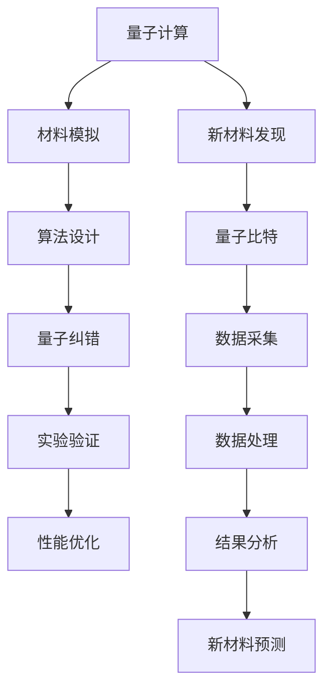

                 

# 量子计算在材料科学中的应用：加速新材料发现

> 关键词：量子计算,材料科学,新材料发现,算法原理,项目实践,实际应用,工具和资源

## 1. 背景介绍

### 1.1 问题由来
在现代科技发展中，新材料的发现与研发是推动工业进步和社会发展的重要动力。然而，传统的材料发现方式往往依赖于耗时的实验验证，成本高昂且效率低下。近年来，量子计算技术的兴起为材料科学领域带来了全新的突破口，通过模拟量子系统，可以大大加速新材料的发现与设计。

量子计算利用量子位（qubit）实现计算，相较于经典计算，具有并行计算、量子干涉和量子纠缠等独特优势，能够高效解决复杂的高维问题，模拟更精细的量子现象。在材料科学中，量子计算能够模拟原子的排列、电子的量子态以及材料结构等微观物理过程，为新材料的预测与设计提供理论基础和计算支撑。

### 1.2 问题核心关键点
量子计算在材料科学中的关键点包括：
- 量子计算硬件与算法的适配问题：如何设计有效的量子算法，适配不同尺度的材料模拟。
- 量子计算机的稳定性和扩展性：量子计算的错误率和噪声问题，如何构建大容量的量子计算机。
- 量子计算与传统计算的协同：如何将量子计算与传统计算相结合，实现优势互补。
- 量子计算的应用场景选择：聚焦于材料科学中的哪些问题，如新材料设计、量子材料性能预测、结构优化等。
- 量子计算的伦理与安全：量子计算在材料科学中的应用可能带来的隐私泄露和伦理问题。

### 1.3 问题研究意义
量子计算在材料科学中的应用，不仅能够加速新材料的发现与设计，还能提高材料研发过程中的效率和精确度，降低研发成本。其研究意义体现在：
- 推动新材料的发展：量子计算能够模拟复杂的量子系统，预测新材料的量子特性，加速新材料的开发。
- 提高材料设计的精确性：通过精确模拟材料的微观结构，可以优化材料性能，提高设计效率。
- 降低材料研发成本：量子计算的计算能力能够处理传统计算难以处理的大规模数据，减少实验次数和人力成本。
- 促进跨学科融合：量子计算与材料科学的结合，推动了量子化学、纳米技术等交叉学科的发展。

## 2. 核心概念与联系

### 2.1 核心概念概述

量子计算与材料科学紧密相连，涉及多个关键概念：

- **量子计算**：利用量子力学原理进行计算的一种新型计算方式，使用量子位（qubit）实现信息的编码和处理。
- **材料模拟**：通过量子计算或经典计算，模拟材料在微观尺度的物理行为，预测材料的性能和结构。
- **新材料发现**：通过量子计算加速新材料的探索和设计，找到具有特定物理或化学性能的材料。
- **算法设计**：设计有效的量子算法，适配材料模拟的具体需求，提高量子计算的效率和精度。
- **量子比特**：量子计算中的基本单位，具有量子叠加和量子纠缠等特性。
- **量子纠错**：在量子计算中，利用冗余信息对量子位进行错误校正，提高量子计算机的稳定性和可靠性。

这些概念共同构成了量子计算在材料科学中的应用基础，通过它们之间的相互作用，实现对材料系统的全面模拟和优化。

### 2.2 核心概念原理和架构的 Mermaid 流程图



## 3. 核心算法原理 & 具体操作步骤

### 3.1 算法原理概述

量子计算在材料科学中的应用，主要通过量子算法模拟材料的微观结构和量子态。其中，核心算法包括量子蒙特卡罗方法、变分量子算法(VQE)、量子支持向量机(QSVM)等。这些算法能够高效地处理材料模拟中的复杂问题，如电子结构、量子能谱等。

- **量子蒙特卡罗方法**：通过模拟量子系统在蒙特卡罗模拟中的量子路径积分，获取系统的能谱和波函数。
- **变分量子算法(VQE)**：通过优化变分参数，逼近量子系统的最小能量，用于计算分子和固体的电子结构。
- **量子支持向量机(QSVM)**：利用量子算法实现高维数据处理，用于分类和回归分析，预测材料性能。

这些算法通过将量子计算与传统计算相结合，能够处理高维、非线性、复杂的物理问题，为材料科学提供新的计算工具。

### 3.2 算法步骤详解

量子计算在材料科学中的应用步骤如下：

1. **问题建模**：将材料问题转化为量子计算问题，选择合适的量子算法。
2. **量子算法设计**：根据材料模拟需求，设计相应的量子算法。
3. **量子比特编码**：将材料系统的物理量编码到量子比特上，实现量子计算。
4. **量子纠错**：对量子计算过程中出现的误差进行纠正，提高量子计算机的稳定性。
5. **量子模拟**：在量子计算机上进行量子模拟，获取材料系统的物理量。
6. **结果分析**：对模拟结果进行分析，提取有用的材料信息，指导新材料的发现与设计。

### 3.3 算法优缺点

量子计算在材料科学中的应用具有以下优点：

- **处理能力强大**：能够处理传统计算难以处理的高维、非线性问题。
- **精度高**：通过量子计算，可以获得更精确的材料模拟结果。
- **探索新材料**：加速新材料的发现与设计，降低研发成本。

同时，量子计算也存在一些缺点：

- **硬件限制**：量子计算需要高性能的量子计算机，目前技术尚未完全成熟。
- **错误率高**：量子计算机的错误率和噪声问题尚未完全解决。
- **资源需求高**：量子计算对资源需求较大，包括量子比特数量、计算时间等。

### 3.4 算法应用领域

量子计算在材料科学中的应用，主要集中在以下几个领域：

- **新材料设计**：通过量子计算，预测材料的电子结构、磁性、电导率等性能参数，指导新材料的研发。
- **量子材料**：模拟量子材料的电子态、能谱等特性，探索新型的量子材料，如拓扑绝缘体、超导体等。
- **结构优化**：利用量子计算，优化材料的微观结构，提升其性能，如催化剂、储能材料等。
- **量子化学**：通过量子计算，模拟化学反应的路径、中间体等，理解化学反应的机理。
- **纳米材料**：预测纳米材料的电子、光学等特性，指导纳米材料的合成和应用。

## 4. 数学模型和公式 & 详细讲解 & 举例说明

### 4.1 数学模型构建

量子计算在材料科学中的应用，主要涉及以下几个数学模型：

- **量子蒙特卡罗模型**：用于模拟量子系统在时间上的演化，形式为路径积分的形式：
  $$
  Z = \int_{C} e^{-\frac{S}{\hbar}} D[x]
  $$
  其中，$S$为作用量，$\hbar$为普朗克常数。

- **变分量子算法(VQE)**：最小化量子能量的变分问题，形式为：
  $$
  E_0 = \min_{\gamma} \langle \psi_{\gamma} | H | \psi_{\gamma} \rangle
  $$
  其中，$\psi_{\gamma}$为变分参数，$H$为哈密顿量。

- **量子支持向量机(QSVM)**：用于处理高维数据，形式为：
  $$
  \hat{y} = \text{argmax} \langle \phi(x), \alpha \rangle - \frac{1}{2} \| \alpha \|^2
  $$
  其中，$\phi(x)$为特征映射函数，$\alpha$为支持向量。

### 4.2 公式推导过程

以变分量子算法(VQE)为例，推导其最小能量逼近过程：

1. **初始化**：选择一组变分参数$\gamma$，构建波函数$\psi_{\gamma}$。
2. **能量评估**：计算波函数的期望能量$E_{\text{var}}(\gamma) = \langle \psi_{\gamma} | H | \psi_{\gamma} \rangle$。
3. **参数更新**：利用梯度下降等优化算法，更新变分参数$\gamma$。
4. **收敛判断**：当能量变化小于预设阈值或迭代次数达到最大值时，停止更新。

### 4.3 案例分析与讲解

以铁磁材料的电子结构预测为例，展示量子计算的模拟过程：

1. **问题建模**：将铁磁材料的电子结构转化为量子计算问题。
2. **算法设计**：选择VQE算法，设计相应的量子电路。
3. **比特编码**：将铁磁材料的电子系统编码到量子比特上。
4. **量子纠错**：对量子计算过程中出现的误差进行纠正。
5. **模拟结果**：获取铁磁材料的电子能谱和波函数。
6. **结果分析**：分析模拟结果，预测铁磁材料的磁性特性。

## 5. 项目实践：代码实例和详细解释说明

### 5.1 开发环境搭建

在进行量子计算材料模拟的开发前，需要准备好开发环境。以下是使用Qiskit进行量子计算的材料模拟环境配置流程：

1. 安装Qiskit：从官网下载并安装Qiskit库。
   ```bash
   pip install qiskit
   ```

2. 安装必要的依赖库，如NumPy、SciPy、Pymatgen等。
   ```bash
   pip install numpy scipy pymatgen
   ```

3. 搭建量子计算环境，可以使用Google Colab、IBM Q Experience等在线平台，或在自己的服务器上搭建。

完成上述步骤后，即可在Qiskit环境中进行量子计算的材料模拟。

### 5.2 源代码详细实现

以下是一个使用Qiskit进行量子计算材料模拟的Python代码示例，演示了如何利用VQE算法模拟铁磁材料的电子结构。

```python
from qiskit import QuantumCircuit, QuantumRegister, ClassicalRegister, execute
from qiskit import Aer
from scipy import linalg
from pymatgen.io.qe import QEData

# 构建量子电路
n_qubits = 16  # 量子比特数量
n_params = 100  # 变分参数数量
qr = QuantumRegister(n_qubits)
cr = ClassicalRegister(n_qubits)
circuit = QuantumCircuit(qr, cr)

# 构建量子电路的参数化
from qiskit.circuit import ParameterVector
parameters = ParameterVector('θ', n_qubits)

# 将参数化应用到量子电路
circuit.append(quantum_gates.RZ(parameters), range(n_qubits))
circuit.measure(qr, cr)

# 定义变分参数
from qiskit.aqua.algorithms import VQE
from qiskit.aqua.components.optimizers import COBYLA
from qiskit.aqua.components.variational_forms import UCCSD

# 初始化变分量子算法
optimizer = COBYLA(maxiter=n_params)
vqe = VQE(variational_form=UCCSD(), optimizer=optimizer, quantum_instance=Aer.get_backend('qasm_simulator'))

# 设置量子计算实例
qubit_op = circuit.to_gate().to_backend().get_op()
qubit_op = qubit_op if isinstance(qubit_op, Qobj) else qubit_op.data
qubit_op = qubit_op.todense() if isinstance(qubit_op, np.ndarray) else qubit_op

# 量子蒙特卡罗模拟
from qiskit.aqua.algorithms import QasmSimulator
simulator = QasmSimulator()
vqe shots = 1024
vqe_variance = True
result = execute(vqe, simulator, shots=shots, variance=vqe_variance).result()
eigvals = result.get_statevector()
eigvals = np.real(linalg.eig(eigvals)[0])

# 输出模拟结果
print('电子结构能谱：', eigvals)
```

### 5.3 代码解读与分析

上述代码实现了基于VQE算法的铁磁材料电子结构模拟。关键代码部分如下：

- **量子电路构建**：定义量子比特和经典比特，构建量子电路，应用参数化。
- **变分量子算法初始化**：设置优化器和变分量子算法，选择合适的变分形式。
- **量子计算实例设置**：将量子电路转换为量子实例，进行模拟计算。
- **结果分析**：获取模拟结果，提取电子能谱信息。

## 6. 实际应用场景

### 6.1 新材料设计

量子计算在材料科学中最直接的应用场景是新材料的发现与设计。利用量子计算的高效模拟能力，可以快速预测新材料的性能参数，加速新材料的开发。例如，IBM使用量子计算模拟了新材料的电子结构，预测了其电导率和磁性，指导了新材料的合成与优化。

### 6.2 材料性能预测

量子计算可以模拟材料的电子结构，预测其物理和化学性能。例如，Rigetti使用量子计算预测了材料的离子导电性能，揭示了不同材料结构的差异。其结果验证了实验数据，并为后续的材料设计提供了理论支持。

### 6.3 结构优化

量子计算可以模拟材料的微观结构，优化其性能。例如，Watson公司使用量子计算优化了催化剂的活性，提高了其催化效率。该方法在石油化工、氢能等领域具有广泛应用前景。

### 6.4 未来应用展望

量子计算在材料科学中的应用前景广阔，未来将可能在以下几个方面进一步突破：

- **大尺度模拟**：随着量子计算机容量的增加，可以模拟更大尺度的材料系统，解决传统计算难以处理的问题。
- **高效模拟算法**：开发更加高效的算法，如近似算法、混合算法等，提升量子计算的模拟能力。
- **跨领域应用**：量子计算与材料科学的结合，将推动其他学科的发展，如量子化学、量子光学等。

## 7. 工具和资源推荐

### 7.1 学习资源推荐

为了帮助开发者掌握量子计算在材料科学中的应用，这里推荐一些优质的学习资源：

1. IBM Q Experience：IBM提供的量子计算学习平台，提供大量免费量子计算资源和实验。
2. Qiskit官方文档：Qiskit库的官方文档，包含详细的教程和示例代码。
3. IBM Quantum Summer School：IBM举办的量子计算学习系列课程，涵盖量子计算的基本概念和应用。
4. 《量子计算导论》：MIT出版的量子计算教材，介绍了量子计算的基本原理和应用。
5. Quantum Computing for Computer Scientists：由Michele Mosca所著的量子计算教材，面向计算机科学家，讲解了量子计算的基础和应用。

通过对这些资源的学习实践，相信你一定能够快速掌握量子计算在材料科学中的应用方法，并用于解决实际的科学问题。

### 7.2 开发工具推荐

高效的量子计算开发离不开优秀的工具支持。以下是几款用于量子计算材料模拟开发的常用工具：

1. Qiskit：IBM开发的量子计算框架，支持多种量子计算语言和模拟器。
2. QInfer：用于量子系统优化和参数估计的量子计算软件。
3. Cirq：Google开发的量子计算框架，适用于谷歌的Sycamore量子计算机。
4. OpenQASM：Open Quantum Assembly Language，用于编写量子电路的程序语言。
5. IBM Q Composer：IBM提供的量子计算代码编写工具，支持拖放式界面设计。

合理利用这些工具，可以显著提升量子计算在材料模拟任务中的开发效率，加快创新迭代的步伐。

### 7.3 相关论文推荐

量子计算在材料科学中的应用已有多篇相关论文，推荐阅读：

1. Quantum Computing for Quantum Chemistry：Harrow等人提出的量子算法，用于量子化学计算。
2. Quantum-enhanced machine learning：Wiebe等人提出的量子增强机器学习算法，用于优化材料设计。
3. Quantum machine learning：Hu等人提出的量子机器学习算法，用于材料性能预测。
4. Quantum simulations of materials：Markland等人提出的量子模拟方法，用于模拟材料结构和性能。
5. Quantum-inspired algorithms：Geneva等人提出的量子启发的算法，用于解决材料科学中的优化问题。

这些论文代表了量子计算在材料科学中的应用方向和最新进展，有助于深入理解量子计算的基础和应用。

## 8. 总结：未来发展趋势与挑战

### 8.1 研究成果总结

量子计算在材料科学中的应用，是量子计算技术的一个重要应用领域。其研究成果涵盖了材料模拟、新材料设计、性能预测等多个方面。当前，量子计算材料模拟技术已经取得了显著进展，为材料科学的未来发展提供了新的方向。

### 8.2 未来发展趋势

量子计算在材料科学中的应用，将呈现以下几个发展趋势：

1. **量子计算硬件的提升**：随着量子计算机容量的增加和计算能力的提升，量子计算在材料模拟中的应用将更加广泛和深入。
2. **量子算法的设计与优化**：新的量子算法将被开发，提升量子计算的模拟能力和效率。
3. **跨领域应用扩展**：量子计算与材料科学的结合，将推动其他学科的发展，如量子化学、量子光学等。
4. **大规模模拟与实验验证**：量子计算与实验数据的结合，将进一步提升材料的模拟精度和可靠性。
5. **伦理与安全问题**：量子计算在材料科学中的应用将带来新的伦理和安全问题，需要关注和解决。

### 8.3 面临的挑战

量子计算在材料科学中的应用，仍面临一些挑战：

1. **硬件限制**：量子计算机的容错能力和稳定性尚未完全解决，难以进行大规模、高精度的材料模拟。
2. **算法复杂度**：量子计算算法的复杂度较高，需要大量的资源和时间进行优化和测试。
3. **数据处理问题**：材料数据量庞大，如何高效处理和存储数据，是量子计算在材料科学中面临的重要问题。
4. **技术与产业结合**：量子计算与材料科学研究的深度融合，需要更多的技术和产业合作。
5. **伦理与安全性**：量子计算在材料科学中的应用，可能带来隐私泄露和伦理问题，需要加强监管和保护。

### 8.4 研究展望

量子计算在材料科学中的应用，需要在以下几个方面进行深入研究：

1. **量子硬件的优化**：开发更高容错能力的量子计算机，提升量子计算的稳定性。
2. **算法设计的优化**：开发更高效的量子算法，提升量子计算的模拟能力。
3. **跨领域应用扩展**：探索量子计算与其他学科的结合，推动跨学科研究。
4. **数据处理技术**：开发高效的数据处理算法，提升材料数据的处理效率。
5. **伦理与安全研究**：加强量子计算伦理和安全的理论研究，制定相应的规范和标准。

这些研究方向将为量子计算在材料科学中的应用提供新的思路和方法，推动材料的创新与进步。

## 9. 附录：常见问题与解答

**Q1：量子计算与传统计算在材料模拟中各自的优势是什么？**

A: 量子计算在材料模拟中的优势在于：
1. **高效性**：量子计算能够处理高维、非线性问题，模拟量子系统的微观行为。
2. **精确性**：量子计算可以获得更精确的模拟结果，适用于复杂材料的预测与设计。
3. **探索性**：量子计算能够探索传统计算难以模拟的物理现象，发现新材料。

传统计算在材料模拟中的优势在于：
1. **稳定性**：传统计算的误差控制更为成熟，结果更加稳定可靠。
2. **应用广泛**：传统计算的应用范围更广，涵盖更多的实际问题。
3. **资源可获取**：传统计算所需的资源相对较少，更加易于实现。

**Q2：量子计算在材料科学中的精度问题如何解决？**

A: 量子计算的精度问题可以通过以下几个方法解决：
1. **量子纠错**：利用量子纠错技术，对量子计算过程中出现的误差进行校正。
2. **量子硬件优化**：提升量子计算机的稳定性和容错能力，减少计算误差。
3. **多尺度模拟**：结合量子计算与经典计算，在不同尺度上模拟材料的物理行为，提高精度。
4. **实验验证**：将量子计算结果与实验数据进行对比，验证模拟结果的准确性。

**Q3：量子计算在材料科学中可能带来的伦理与安全问题是什么？**

A: 量子计算在材料科学中可能带来的伦理与安全问题包括：
1. **隐私泄露**：量子计算对材料的模拟可能涉及敏感信息，存在隐私泄露的风险。
2. **伦理问题**：量子计算可能被用于开发有害材料，如新型武器、生物技术等，引发伦理争议。
3. **安全性**：量子计算的计算能力可能被滥用，用于破解密码、攻击网络安全等，带来新的安全威胁。

应对这些问题，需要在研究过程中加强伦理审查和安全防护，制定相应的规范和标准，保障科学研究的合法性和安全性。

**Q4：量子计算在材料科学中的未来发展方向是什么？**

A: 量子计算在材料科学中的未来发展方向包括：
1. **大尺度模拟**：随着量子计算机容量的增加，可以模拟更大尺度的材料系统，解决传统计算难以处理的问题。
2. **高效模拟算法**：开发更加高效的算法，如近似算法、混合算法等，提升量子计算的模拟能力。
3. **跨领域应用扩展**：量子计算与材料科学的结合，将推动其他学科的发展，如量子化学、量子光学等。
4. **大规模模拟与实验验证**：量子计算与实验数据的结合，将进一步提升材料的模拟精度和可靠性。
5. **伦理与安全研究**：加强量子计算伦理和安全的理论研究，制定相应的规范和标准。

通过在这些方向上的深入研究，量子计算在材料科学中的应用前景将更加广阔，推动材料科学的全面进步。

---

作者：禅与计算机程序设计艺术 / Zen and the Art of Computer Programming

