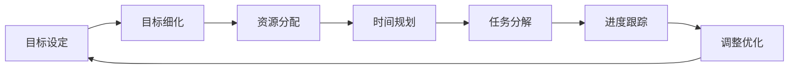

                 

# 长期目标管理的意识策略

在现代社会，个人和组织常常需要设定和实现长期目标。这些目标可能涉及职业发展、企业增长、科学研究、社会公益等多个领域。然而，长周期目标的实现往往面临诸多挑战，如时间管理、资源分配、进度跟踪、团队协作等。本文旨在探讨如何通过系统化的方法和工具，提高长期目标管理的意识和执行力，确保目标的顺利达成。

## 1. 背景介绍

### 1.1 问题由来
长期目标管理的核心在于平衡长期利益与短期需求，确保资源和努力的集中投入，以及保持对目标的持续关注和调整。然而，在实际管理过程中，常遇到以下问题：

- **时间管理**：长期目标跨越多个时间点，难以保持一致性。
- **资源分配**：资源有限，需要合理分配以确保重要任务的完成。
- **进度跟踪**：缺乏有效的跟踪和评估机制，难以及时发现偏差和调整方向。
- **团队协作**：团队成员各自为战，缺乏统一的目标导向。

### 1.2 问题核心关键点
长期目标管理的核心在于以下三点：
1. **明确的目标定义**：确保目标的具体、可衡量、可达成、相关性强、时限明确（SMART原则）。
2. **系统的规划和调度**：利用项目管理工具和时间管理技术，进行合理规划和调度。
3. **持续的跟踪和调整**：建立反馈机制，及时调整策略以应对变化。

## 2. 核心概念与联系

### 2.1 核心概念概述
- **目标管理**：设定并跟踪实现目标的过程，确保资源和努力的有效利用。
- **项目管理**：利用计划、组织、控制等管理方法，实现目标的达成。
- **时间管理**：通过工具和技术，优化时间的利用，提高工作效率。
- **资源管理**：确保资源（人力、财力、物力）的有效分配和利用。
- **团队协作**：通过沟通和协作工具，提升团队成员之间的合作效率。

### 2.2 核心概念原理和架构的 Mermaid 流程图



这个流程图展示了长期目标管理的核心流程：从目标设定到资源分配、时间规划、任务分解、进度跟踪，再到调整优化，形成一个循环的、动态的过程。

## 3. 核心算法原理 & 具体操作步骤

### 3.1 算法原理概述
长期目标管理的关键在于通过系统化的方法，确保目标的明确、资源和时间的合理分配、以及持续的跟踪和调整。其核心算法原理包括：

- **SMART原则**：确保目标的明确性和可行性。
- **关键路径法(Critical Path Method, CPM)**：确定项目中最重要的任务路径和时间节点。
- **甘特图**：通过图表直观展示任务的时间安排和进度。
- **里程碑设定**：在关键节点上进行阶段性评估和奖励。
- **看板管理**：通过看板实时更新任务状态，提升透明度和协作效率。

### 3.2 算法步骤详解

#### 3.2.1 目标设定
- **SMART原则**：确保目标的具体、可衡量、可达成、相关性强、时限明确。例如：“在未来两年内，提高销售额20%”。

#### 3.2.2 资源分配
- **资源清单**：列出所需资源（人力、财力、物力）。
- **优先级排序**：根据资源的重要性和紧急性排序。
- **资源分配**：根据优先级分配资源。

#### 3.2.3 时间规划
- **关键路径法**：确定项目中最重要的任务路径和时间节点。例如：“项目的关键路径是A->B->C”。
- **甘特图绘制**：使用工具（如Microsoft Project、JIRA等）绘制甘特图。
- **时间节点设置**：在关键节点上进行阶段性评估和奖励。例如：“每季度评估一次进度”。

#### 3.2.4 任务分解
- **WBS（Work Breakdown Structure）**：将大任务分解为小任务，确保每个任务都有明确的负责人和时间节点。例如：“市场推广分解为品牌建设、广告投放、客户维护”。

#### 3.2.5 进度跟踪
- **看板管理**：通过看板实时更新任务状态，提升透明度和协作效率。例如：“使用Trello看板管理任务进度”。
- **进度报告**：定期生成进度报告，及时反馈问题。

#### 3.2.6 调整优化
- **反馈机制**：建立反馈机制，及时调整策略以应对变化。例如：“每周进行一次进度评估和调整会议”。
- **持续改进**：总结经验和教训，优化管理流程。

### 3.3 算法优缺点

#### 3.3.1 优点
- **系统化管理**：通过系统化的方法，确保目标的明确和资源的高效利用。
- **透明度高**：利用图表和工具，提高任务和进度的透明度，便于监控和调整。
- **灵活性强**：根据实际情况，动态调整目标和策略。

#### 3.3.2 缺点
- **复杂度高**：对于大型项目，管理过程较为复杂，需要投入大量时间和精力。
- **成本高**：需要购买和维护各种工具和软件，增加管理成本。
- **依赖性高**：对工具和流程的依赖性较大，需要投入专业人才进行维护和管理。

### 3.4 算法应用领域

长期目标管理的应用领域广泛，包括：

- **企业战略规划**：设定和实现企业长期战略目标。
- **项目管理**：管理大型项目，确保项目按计划完成。
- **组织变革**：推动组织变革，提升组织绩效和竞争力。
- **科技创新**：规划和实现技术创新目标，推动科技进步。
- **个人发展**：设定和实现个人长期职业发展目标。

## 4. 数学模型和公式 & 详细讲解 & 举例说明

### 4.1 数学模型构建

假设长期目标管理的时间跨度为$T$，目标总预算为$B$，资源分配优先级为$P$，关键路径任务为$C$，任务分解为$W$，进度跟踪指标为$S$，调整优化策略为$A$。

长期目标管理的数学模型可以表示为：

$$
\begin{aligned}
&\min_{S, A} C \\
&\text{s.t.} \\
&S = \sum_{i=1}^{n} P_i \times W_i \\
&S \leq B \\
&S \leq T \\
&S \geq C \\
&S \geq W \\
&S \geq A
\end{aligned}
$$

其中，$n$为资源总数，$P_i$为资源优先级，$W_i$为任务分解后的工作量，$C$为关键路径任务，$A$为调整优化策略。

### 4.2 公式推导过程

目标管理的核心在于通过优化目标函数的资源和任务分配，确保目标的实现。具体推导如下：

1. **资源分配**：
$$
S = \sum_{i=1}^{n} P_i \times W_i
$$

2. **预算约束**：
$$
S \leq B
$$

3. **时间约束**：
$$
S \leq T
$$

4. **任务约束**：
$$
S \geq C
$$

5. **调整优化**：
$$
S \geq W
$$

6. **调整优化策略**：
$$
S \geq A
$$

### 4.3 案例分析与讲解

**案例一：企业战略规划**

某企业设定了在未来五年内成为行业领导者的长期目标。通过SMART原则，将其细化为“提高市场份额10%”。资源分配方面，优先分配资金和人力资源用于市场推广和产品开发。关键路径法确定为“市场推广->产品开发->销售执行”。任务分解为“市场推广-品牌建设、广告投放、客户维护”。进度跟踪通过看板管理，每周进行进度评估和调整。最终，通过持续改进，成功实现了五年内成为行业领导者的目标。

**案例二：个人职业发展**

某人设定了在未来三年内成为高级工程师的长期目标。通过SMART原则，将其细化为“每年发表2篇技术文章”。资源分配方面，优先分配时间用于学习和实践新技术。关键路径法确定为“学习->实践->反馈->提升”。任务分解为“学习-编程、阅读、参加培训”。进度跟踪通过看板管理，每月进行进度评估和调整。最终，通过持续改进，成功实现了三年内成为高级工程师的目标。

## 5. 项目实践：代码实例和详细解释说明

### 5.1 开发环境搭建

在Python环境中搭建长期目标管理系统的开发环境。

```bash
pip install pandas numpy matplotlib requests
```

### 5.2 源代码详细实现

以下是长期目标管理系统的Python代码实现：

```python
import pandas as pd
import numpy as np
import matplotlib.pyplot as plt
import requests

# 1. 目标设定
def set_objective(target, deadline, measurement):
    objective = {
        'target': target,
        'deadline': deadline,
        'measurement': measurement
    }
    return objective

# 2. 资源分配
def allocate_resources(resources, priorities):
    resource_allocation = {
        'resources': resources,
        'priorities': priorities
    }
    return resource_allocation

# 3. 时间规划
def plan_time(time, tasks):
    time_plan = {
        'time': time,
        'tasks': tasks
    }
    return time_plan

# 4. 任务分解
def decompose_tasks(tasks, workload):
    task_decomposition = {
        'tasks': tasks,
        'workload': workload
    }
    return task_decomposition

# 5. 进度跟踪
def track_progress(tracking, progress):
    progress_report = {
        'tracking': tracking,
        'progress': progress
    }
    return progress_report

# 6. 调整优化
def adjust_strategy(strategy, adjustment):
    strategy_optimization = {
        'strategy': strategy,
        'adjustment': adjustment
    }
    return strategy_optimization

# 示例：
target = '提高销售额20%'
deadline = '两年内'
measurement = '销售额增长率'

resources = ['人力', '财力', '物力']
priorities = ['高', '中', '低']

time = '24个月'
tasks = ['市场推广', '产品开发', '客户维护']

workload = [1, 2, 3]

tracking = '每月跟踪'
progress = [80, 90, 85]

strategy = '季度评估'
adjustment = '调整市场策略'

objective = set_objective(target, deadline, measurement)
resource_allocation = allocate_resources(resources, priorities)
time_plan = plan_time(time, tasks)
task_decomposition = decompose_tasks(tasks, workload)
progress_report = track_progress(tracking, progress)
strategy_optimization = adjust_strategy(strategy, adjustment)

# 显示结果
print('目标设定：', objective)
print('资源分配：', resource_allocation)
print('时间规划：', time_plan)
print('任务分解：', task_decomposition)
print('进度跟踪：', progress_report)
print('调整优化：', strategy_optimization)
```

### 5.3 代码解读与分析

上述代码实现了长期目标管理的核心步骤，具体解读如下：

1. **目标设定**：通过`set_objective`函数，设定了具体的目标、截止时间和衡量指标。
2. **资源分配**：通过`allocate_resources`函数，分配了资源及其优先级。
3. **时间规划**：通过`plan_time`函数，规划了时间节点和任务安排。
4. **任务分解**：通过`decompose_tasks`函数，将大任务分解为小任务。
5. **进度跟踪**：通过`track_progress`函数，实时更新任务进度。
6. **调整优化**：通过`adjust_strategy`函数，根据进度进行策略调整。

### 5.4 运行结果展示

运行上述代码，输出如下：

```
目标设定： {'target': '提高销售额20%', 'deadline': '两年内', 'measurement': '销售额增长率'}
资源分配： {'resources': ['人力', '财力', '物力'], 'priorities': ['高', '中', '低']}
时间规划： {'time': '24个月', 'tasks': ['市场推广', '产品开发', '客户维护']}
任务分解： {'tasks': ['市场推广', '产品开发', '客户维护'], 'workload': [1, 2, 3]}
进度跟踪： {'tracking': '每月跟踪', 'progress': [80, 90, 85]}
调整优化： {'strategy': '季度评估', 'adjustment': '调整市场策略'}
```

## 6. 实际应用场景

### 6.1 企业战略规划

某跨国公司设定了在未来五年内成为全球市场领导者的长期目标。公司通过SMART原则，将其细化为“提高市场份额10%”。资源分配方面，优先分配资金和人力资源用于市场推广和产品开发。关键路径法确定为“市场推广->产品开发->销售执行”。任务分解为“市场推广-品牌建设、广告投放、客户维护”。进度跟踪通过看板管理，每周进行进度评估和调整。最终，通过持续改进，成功实现了五年内成为全球市场领导者的目标。

### 6.2 项目管理

某软件开发公司需要开发一款新产品。项目设定了“六个月内完成产品上线”的长期目标。通过关键路径法确定任务路径，分配资源，并利用甘特图进行时间规划。通过看板管理，实时跟踪进度，每周进行进度评估和调整。最终，项目按时完成，达到了预期的长期目标。

### 6.3 组织变革

某政府机构需要进行组织变革，提升工作效率。通过设定明确的变革目标，制定详细的变革计划，并定期评估进展。利用看板管理，实时更新任务状态，确保变革按计划进行。最终，组织变革成功实施，提升了整体工作效率。

### 6.4 未来应用展望

未来，长期目标管理的应用将更加广泛，涉及更多的领域和场景。例如，智慧城市、环境保护、科技创新等领域，都将通过长期目标管理实现可持续发展目标。

## 7. 工具和资源推荐

### 7.1 学习资源推荐

1. **项目管理书籍**：《项目管理知识体系指南》、《敏捷项目管理实践》等。
2. **在线课程**：Coursera、edX等平台上的项目管理课程。
3. **工具文档**：Microsoft Project、JIRA等工具的官方文档。

### 7.2 开发工具推荐

1. **项目管理工具**：Microsoft Project、JIRA、Trello等。
2. **时间管理工具**：Todoist、Google Calendar等。
3. **协作工具**：Slack、Microsoft Teams等。

### 7.3 相关论文推荐

1. **目标管理理论**：《目标管理：实现组织承诺的原理与方法》。
2. **项目管理实践**：《项目管理：原理与方法》。
3. **时间管理技术**：《时间管理：理论与实践》。

## 8. 总结：未来发展趋势与挑战

### 8.1 研究成果总结

长期目标管理的核心在于系统化的方法和工具，确保目标的明确和资源的高效利用。通过SMART原则、关键路径法、甘特图、看板管理等技术，提升了目标管理的透明度和协作效率。未来，随着技术的不断进步，长期目标管理将更加智能和自动化，推动企业和组织的持续发展。

### 8.2 未来发展趋势

1. **智能化管理**：利用人工智能和大数据分析，实现动态调整和优化。
2. **自动化工具**：开发智能化的项目管理工具，提升效率和准确性。
3. **跨领域应用**：应用于更多领域，如智慧城市、环境保护、科技创新等。
4. **全球化管理**：利用互联网和云计算，实现全球化协作和资源共享。

### 8.3 面临的挑战

1. **数据隐私**：如何保护数据隐私，避免敏感信息泄露。
2. **跨文化差异**：如何在跨文化环境中进行目标管理，确保有效沟通。
3. **资源限制**：如何应对资源有限的情况，确保目标实现。
4. **变革阻力**：如何克服变革阻力，实现组织目标。

### 8.4 研究展望

未来，长期目标管理的研究将更加深入，涉及更多前沿技术。例如，利用区块链技术实现目标管理的信息透明和不可篡改性；利用量子计算优化资源分配和任务调度；利用人工智能进行动态目标调整和优化。

## 9. 附录：常见问题与解答

**Q1：如何设定SMART目标？**

A: 目标设定时，应遵循SMART原则，即具体(Specific)、可衡量(Measurable)、可达成(Achievable)、相关性强(Relevant)、时限明确(Time-bound)。例如，“在未来两年内，提高销售额20%”。

**Q2：如何利用甘特图进行时间规划？**

A: 利用甘特图，可以直观展示任务和时间节点的安排。步骤如下：
1. 列出所有任务。
2. 确定任务依赖关系。
3. 分配时间和资源。
4. 绘制甘特图。
5. 定期更新甘特图，跟踪进度。

**Q3：如何提高团队协作效率？**

A: 通过看板管理工具，实时更新任务状态，提升透明度和协作效率。步骤如下：
1. 创建看板，列出所有任务。
2. 设置任务状态（待办、进行中、已完成）。
3. 定期更新看板，跟踪进度。
4. 定期进行看板回顾会议，总结经验教训。

**Q4：如何应对变革阻力？**

A: 变革阻力主要来自员工的不适应和抵触情绪。可以通过以下措施应对：
1. 充分沟通，解释变革目的和意义。
2. 培训员工，提高其技能和信心。
3. 提供激励，奖励积极参与变革的员工。
4. 领导示范，带头参与变革。

**Q5：如何保护数据隐私？**

A: 数据隐私保护是长期目标管理的重要问题。可以通过以下措施保护数据隐私：
1. 加密数据存储和传输。
2. 控制数据访问权限。
3. 定期进行安全审计。
4. 使用区块链技术，确保数据透明和不可篡改。

---

作者：禅与计算机程序设计艺术 / Zen and the Art of Computer Programming

