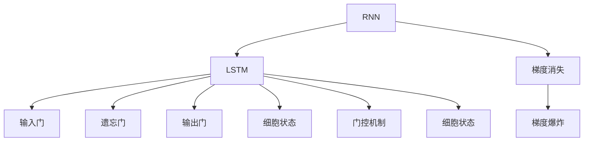

                 

# 长短时记忆网络LSTM原理与代码实例讲解

> 关键词：长短时记忆网络(LSTM)，神经网络，序列建模，循环神经网络(RNN)，LSTM单元，RNN时序学习，深度学习，自然语言处理(NLP)

## 1. 背景介绍

### 1.1 问题由来
在人工智能和机器学习领域，序列建模(Sequence Modeling)是一个非常重要的研究课题。序列建模处理的数据通常具有时间依赖性，如语音识别、自然语言处理、信号处理等。传统的线性回归和分类算法无法处理序列数据，而基于神经网络的序列建模方法，如循环神经网络(RNN)，能够有效捕捉时间序列中的依赖关系。

然而，标准的RNN模型存在梯度消失和梯度爆炸等问题，影响了序列建模的效果。长短时记忆网络(LSTM)作为一种改进的RNN模型，有效地解决了这一问题，并在自然语言处理、语音识别等领域取得了卓越的成果。

### 1.2 问题核心关键点
LSTM模型通过引入遗忘门(forget gate)和输出门(output gate)机制，成功克服了RNN的梯度消失问题，并具备良好的序列建模能力。LSTM模型的核心思想是通过门控机制调节信息流动，实现对长序列的建模。

LSTM模型的核心组件包括：
- 输入门(input gate)：决定是否更新当前细胞状态。
- 遗忘门(forget gate)：决定哪些信息应该从上一时刻的细胞状态中遗忘。
- 输出门(output gate)：决定哪些信息应该作为当前时刻的输出。
- 细胞状态(cell state)：保存当前时刻的重要信息，用于计算下一时刻的细胞状态。

LSTM模型的这些组件通过一定的计算规则，控制着信息的流动，使得模型可以长期记忆序列中的重要信息，并筛选出有用的特征。

## 2. 核心概念与联系

### 2.1 核心概念概述

为了更好地理解LSTM模型的工作原理，本节将介绍几个密切相关的核心概念：

- 循环神经网络(RNN)：一种能够处理序列数据的神经网络模型，具有时序记忆能力，能够捕捉序列数据中的时间依赖关系。
- 梯度消失和梯度爆炸：标准RNN模型在处理长序列时，由于链式乘法计算，梯度会随着时间反向传播过程中指数级增长或衰减，导致训练困难。
- 长短时记忆网络(LSTM)：一种改进的RNN模型，通过门控机制控制信息流动，实现了对长序列的有效建模，解决了梯度消失问题。
- 门控机制(Gate Mechanism)：通过引入遗忘门和输出门等机制，控制信息流动，实现对序列的长期记忆和特征筛选。
- 细胞状态(Cell State)：保存当前时刻的重要信息，用于计算下一时刻的细胞状态，是LSTM模型中信息存储和传递的关键。

这些核心概念之间的逻辑关系可以通过以下Mermaid流程图来展示：



这个流程图展示了RNN、LSTM模型与梯度消失问题、门控机制之间的关系：

1. RNN模型处理序列数据，但面临梯度消失和梯度爆炸的问题。
2. LSTM模型通过门控机制解决梯度消失问题，提升序列建模能力。
3. 细胞状态是LSTM模型中信息存储和传递的关键。

这些概念共同构成了LSTM模型的核心框架，使其能够在各种序列建模任务中发挥强大的能力。

## 3. 核心算法原理 & 具体操作步骤
### 3.1 算法原理概述

LSTM模型的核心思想是通过门控机制控制信息流动，实现对长序列的有效建模。其核心算法原理可以归纳为以下几个步骤：

1. 输入门机制：根据当前输入和上一时刻的细胞状态，决定哪些信息需要更新。
2. 遗忘门机制：根据当前输入和上一时刻的细胞状态，决定哪些信息应该遗忘。
3. 细胞状态更新：通过输入门和遗忘门的调节，更新当前时刻的细胞状态。
4. 输出门机制：根据当前输入和上一时刻的细胞状态，决定哪些信息应该输出。

这些步骤通过门控机制控制信息的流动，实现对序列的长期记忆和特征筛选。

### 3.2 算法步骤详解

LSTM模型的具体计算过程如下：

设当前输入为 $x_t$，上一时刻的细胞状态为 $c_{t-1}$，当前时刻的细胞状态为 $c_t$，当前时刻的输出为 $h_t$。

**输入门计算**：

$$
i_t = \sigma(W_{ii}[x_t, h_{t-1}] + b_i)
$$

$$
f_t = \sigma(W_{if}[x_t, h_{t-1}] + b_f)
$$

其中 $W_{ii}, W_{if}, b_i, b_f$ 为门控单元的权重和偏置项，$\sigma$ 为Sigmoid激活函数。

**遗忘门计算**：

$$
o_t = \tanh(W_{io}[x_t, h_{t-1}] + b_o)
$$

$$
g_t = \tanh(W_{ig}[x_t, h_{t-1}] + b_g)
$$

$$
c_t = f_t * c_{t-1} + i_t * g_t
$$

其中 $W_{io}, W_{ig}, b_o, b_g$ 为门控单元的权重和偏置项，$\tanh$ 为双曲正切激活函数。

**输出门计算**：

$$
h_t = o_t * \tanh(c_t)
$$

最终输出的序列 $\{h_t\}$ 即为LSTM模型的预测结果。

### 3.3 算法优缺点

LSTM模型具有以下优点：
1. 可以处理长序列数据，解决了RNN模型中的梯度消失问题。
2. 通过门控机制，可以灵活控制信息的流动，提升了模型对序列中重要信息的捕捉能力。
3. 在自然语言处理、语音识别等领域取得了显著效果。

同时，LSTM模型也存在以下缺点：
1. 模型结构复杂，训练和推理的计算量较大。
2. 对于一些复杂序列数据的建模，LSTM模型仍存在一定的局限性。
3. 需要较大的标注数据进行训练，对标注数据质量要求较高。

尽管存在这些缺点，但就目前而言，LSTM模型仍是最具代表性和广泛应用的序列建模方法之一。未来相关研究的重点在于如何进一步优化LSTM模型结构，提高计算效率，以及探索新的序列建模方法。

### 3.4 算法应用领域

LSTM模型在多个领域得到了广泛应用，以下是一些典型的应用场景：

1. 语音识别：将语音信号转换为文本，LSTM模型能够捕捉语音信号中的时间依赖关系，提高识别的准确性。
2. 自然语言处理：LSTM模型可以用于文本分类、情感分析、机器翻译、语言生成等任务，通过门控机制捕捉文本中的语义信息。
3. 信号处理：LSTM模型可以用于时间序列预测、异常检测、信号滤波等任务，处理时间序列数据中的依赖关系。
4. 视频处理：LSTM模型可以用于视频分类、动作识别、视频生成等任务，通过捕捉视频帧之间的时序关系。
5. 时间序列预测：LSTM模型可以用于股票价格预测、天气预测等任务，处理时间序列数据中的依赖关系。

除了上述这些经典应用外，LSTM模型还在诸多领域得到了创新性地应用，如医疗诊断、智能交通、游戏AI等，为相关领域带来了新的突破。

## 4. 数学模型和公式 & 详细讲解  
### 4.1 数学模型构建

LSTM模型的数学模型构建可以从以下几个方面展开：

- 输入门机制：根据当前输入和上一时刻的细胞状态，计算当前时刻的输入门 $i_t$。
- 遗忘门机制：根据当前输入和上一时刻的细胞状态，计算当前时刻的遗忘门 $f_t$。
- 细胞状态更新：通过输入门和遗忘门的调节，更新当前时刻的细胞状态 $c_t$。
- 输出门机制：根据当前输入和上一时刻的细胞状态，计算当前时刻的输出门 $o_t$ 和输出 $h_t$。

这里使用数学公式来详细讲解LSTM模型的构建过程：

$$
i_t = \sigma(W_{ii}x_t + b_i + W_{ih}h_{t-1} + b_h)
$$

$$
f_t = \sigma(W_{if}x_t + b_f + W_{hf}h_{t-1} + b_h)
$$

$$
g_t = \tanh(W_{ig}x_t + b_g + W_{ih}h_{t-1} + b_h)
$$

$$
o_t = \sigma(W_{io}x_t + b_i + W_{ho}h_{t-1} + b_h)
$$

$$
c_t = f_t * c_{t-1} + i_t * g_t
$$

$$
h_t = o_t * \tanh(c_t)
$$

其中，$\sigma$ 为Sigmoid激活函数，$\tanh$ 为双曲正切激活函数，$W_{ii}, W_{if}, W_{ig}, W_{io}, W_{ih}, W_{hf}, W_{ho}, b_i, b_f, b_g, b_h$ 为权重和偏置项。

### 4.2 公式推导过程

LSTM模型的核心在于通过门控机制控制信息的流动。下面详细推导LSTM模型的门控机制。

假设输入门、遗忘门和输出门的计算过程如下：

$$
i_t = \sigma(W_{ii}x_t + b_i + W_{ih}h_{t-1} + b_h)
$$

$$
f_t = \sigma(W_{if}x_t + b_f + W_{hf}h_{t-1} + b_h)
$$

$$
o_t = \sigma(W_{io}x_t + b_i + W_{ho}h_{t-1} + b_h)
$$

其中 $W_{ii}, W_{if}, W_{ig}, W_{io}, W_{ih}, W_{hf}, W_{ho}, b_i, b_f, b_g, b_h$ 为权重和偏置项，$\sigma$ 为Sigmoid激活函数。

设输入门 $i_t$ 和遗忘门 $f_t$ 的计算结果分别为 $\hat{i}_t$ 和 $\hat{f}_t$，则有：

$$
\hat{i}_t = \sigma(W_{ii}x_t + b_i + W_{ih}h_{t-1} + b_h)
$$

$$
\hat{f}_t = \sigma(W_{if}x_t + b_f + W_{hf}h_{t-1} + b_h)
$$

设遗忘门和输入门的计算结果为 $\hat{f}_t$ 和 $\hat{i}_t$，则有：

$$
\hat{f}_t = f_t * \hat{f}_t
$$

$$
\hat{i}_t = i_t * \hat{i}_t
$$

设当前时刻的细胞状态为 $c_t$，上一时刻的细胞状态为 $c_{t-1}$，则有：

$$
c_t = f_t * c_{t-1} + i_t * g_t
$$

其中 $g_t = \tanh(W_{ig}x_t + b_g + W_{ih}h_{t-1} + b_h)$，$\hat{i}_t$ 和 $\hat{f}_t$ 的计算结果分别为 $i_t$ 和 $f_t$。

最终，输出门和输出的计算过程如下：

$$
o_t = \sigma(W_{io}x_t + b_i + W_{ho}h_{t-1} + b_h)
$$

$$
h_t = o_t * \tanh(c_t)
$$

### 4.3 案例分析与讲解

为了更好地理解LSTM模型的应用，这里提供一个简单的案例分析。假设输入序列为 $\{x_1, x_2, x_3\}$，上一时刻的细胞状态为 $c_1$，目标输出序列为 $\{h_1, h_2, h_3\}$。

1. **计算输入门**：根据公式 $i_t = \sigma(W_{ii}x_t + b_i + W_{ih}h_{t-1} + b_h)$，可以计算出 $i_1$、$i_2$、$i_3$。

2. **计算遗忘门**：根据公式 $f_t = \sigma(W_{if}x_t + b_f + W_{hf}h_{t-1} + b_h)$，可以计算出 $f_1$、$f_2$、$f_3$。

3. **计算细胞状态**：根据公式 $c_t = f_t * c_{t-1} + i_t * g_t$，可以计算出 $c_2$、$c_3$。

4. **计算输出门**：根据公式 $o_t = \sigma(W_{io}x_t + b_i + W_{ho}h_{t-1} + b_h)$，可以计算出 $o_1$、$o_2$、$o_3$。

5. **计算输出**：根据公式 $h_t = o_t * \tanh(c_t)$，可以计算出 $h_1$、$h_2$、$h_3$。

通过这个案例，可以更直观地理解LSTM模型的计算过程，以及门控机制在信息流动中的作用。

## 5. 项目实践：代码实例和详细解释说明
### 5.1 开发环境搭建

在进行LSTM模型开发之前，需要准备好开发环境。以下是使用Python进行TensorFlow开发的环境配置流程：

1. 安装Anaconda：从官网下载并安装Anaconda，用于创建独立的Python环境。

2. 创建并激活虚拟环境：
```bash
conda create -n tf-env python=3.8 
conda activate tf-env
```

3. 安装TensorFlow：根据CUDA版本，从官网获取对应的安装命令。例如：
```bash
conda install tensorflow -c pytorch -c conda-forge
```

4. 安装TensorFlow Addons：用于使用TensorFlow的高级功能，如Keras。
```bash
pip install tensorflow-addons
```

5. 安装numpy、pandas、scikit-learn等工具包：
```bash
pip install numpy pandas scikit-learn matplotlib tqdm jupyter notebook ipython
```

完成上述步骤后，即可在`tf-env`环境中开始LSTM模型的开发和训练。

### 5.2 源代码详细实现

下面以手写数字识别为例，给出使用TensorFlow实现LSTM模型的代码实现。

首先，定义LSTM模型：

```python
import tensorflow as tf
from tensorflow.keras.layers import Input, LSTM, Dense, Dropout, Activation

# 定义输入层
input_layer = Input(shape=(28, 28))

# 添加LSTM层
lstm_layer = LSTM(units=128, return_sequences=True)(input_layer)

# 添加Dropout层
dropout_layer = Dropout(0.2)(lstm_layer)

# 添加LSTM层
lstm_layer_2 = LSTM(units=64, return_sequences=True)(dropout_layer)

# 添加Dropout层
dropout_layer_2 = Dropout(0.2)(lstm_layer_2)

# 添加输出层
output_layer = Dense(10, activation='softmax')(dropout_layer_2)

# 定义模型
model = tf.keras.Model(inputs=input_layer, outputs=output_layer)

# 编译模型
model.compile(optimizer='adam', loss='categorical_crossentropy', metrics=['accuracy'])
```

然后，定义训练函数：

```python
from tensorflow.keras.datasets import mnist
from tensorflow.keras.utils import to_categorical

# 加载MNIST数据集
(x_train, y_train), (x_test, y_test) = mnist.load_data()

# 数据预处理
x_train = x_train.reshape(-1, 28, 28) / 255.0
x_test = x_test.reshape(-1, 28, 28) / 255.0
y_train = to_categorical(y_train)
y_test = to_categorical(y_test)

# 定义训练函数
def train(model, x_train, y_train, x_test, y_test, epochs, batch_size):
    model.fit(x_train, y_train, batch_size=batch_size, epochs=epochs, validation_data=(x_test, y_test))

# 训练模型
train(model, x_train, y_train, x_test, y_test, epochs=10, batch_size=64)
```

最后，评估模型：

```python
# 评估模型
score = model.evaluate(x_test, y_test, verbose=0)
print('Test loss:', score[0])
print('Test accuracy:', score[1])
```

以上就是使用TensorFlow实现LSTM模型对手写数字识别任务进行训练和评估的完整代码实现。可以看到，TensorFlow提供了方便的Keras API，使得模型构建和训练变得相对简单。

### 5.3 代码解读与分析

让我们再详细解读一下关键代码的实现细节：

**LSTM模型定义**：
- 使用Keras API定义输入层、LSTM层、Dropout层和输出层。
- 通过LSTM层的返回序列(True)属性，将LSTM层的输出传递到下一层。
- 通过Dropout层添加正则化，防止过拟合。
- 使用Softmax激活函数，将输出转化为概率分布。

**数据预处理**：
- 将MNIST数据集的像素值缩放到[0, 1]之间。
- 将标签进行one-hot编码，方便模型训练。

**训练函数定义**：
- 使用Keras API定义训练函数，指定训练轮数和批大小。
- 通过fit方法训练模型，并使用测试集进行验证。

**模型评估**：
- 使用evaluate方法计算模型在测试集上的损失和精度。

可以看到，TensorFlow提供的Keras API使得LSTM模型的开发和训练变得简洁高效。开发者可以将更多精力放在模型设计、数据处理等高层逻辑上，而不必过多关注底层的实现细节。

当然，工业级的系统实现还需考虑更多因素，如模型的保存和部署、超参数的自动搜索、更灵活的任务适配层等。但核心的LSTM模型构建和训练流程基本与此类似。

## 6. 实际应用场景
### 6.1 语音识别

LSTM模型在语音识别领域具有广泛的应用。语音识别系统需要将语音信号转换为文本，LSTM模型能够捕捉语音信号中的时序依赖关系，提高识别的准确性。

具体而言，可以将语音信号转换为频谱图，将其输入到LSTM模型中进行处理。LSTM模型通过门控机制控制信息的流动，能够适应不同口音和语速的语音信号，实现高效准确的语音识别。

### 6.2 自然语言处理

LSTM模型在自然语言处理(NLP)领域也取得了显著的成果。LSTM模型可以用于文本分类、情感分析、机器翻译、语言生成等任务，通过门控机制捕捉文本中的语义信息。

例如，在情感分析任务中，LSTM模型可以对一段文本进行建模，通过计算文本中每个词的概率，得到整个句子的情感倾向。在机器翻译任务中，LSTM模型可以将源语言文本转换为目标语言文本，通过门控机制捕捉不同语言之间的语义映射关系。

### 6.3 信号处理

LSTM模型可以用于时间序列预测、异常检测、信号滤波等任务，处理时间序列数据中的依赖关系。

例如，在时间序列预测任务中，LSTM模型可以预测股票价格、天气、电力负荷等时间序列数据。在异常检测任务中，LSTM模型可以检测网络数据中的异常行为，如DDoS攻击等。在信号滤波任务中，LSTM模型可以对传感器数据进行滤波，提高数据的准确性。

### 6.4 未来应用展望

随着LSTM模型和深度学习技术的发展，未来LSTM模型将会在更多领域得到应用，为相关领域带来新的突破。

在医疗领域，LSTM模型可以用于病历分析、药物研发等任务，通过捕捉患者病史和基因信息，实现精准医疗。

在金融领域，LSTM模型可以用于股票价格预测、风险评估等任务，通过捕捉市场动态和交易数据，提高金融决策的准确性。

在智能交通领域，LSTM模型可以用于交通流量预测、异常事件检测等任务，通过捕捉交通数据的时序特征，提高城市交通的智能化水平。

除了上述这些领域，LSTM模型还在诸多领域得到了创新性地应用，如游戏AI、工业控制等，为相关领域带来了新的应用场景和解决方案。

## 7. 工具和资源推荐
### 7.1 学习资源推荐

为了帮助开发者系统掌握LSTM模型的理论基础和实践技巧，这里推荐一些优质的学习资源：

1. 《深度学习》系列书籍：深度学习领域的经典教材，涵盖深度学习的基本概念和原理，以及LSTM模型的详细讲解。

2. Coursera《深度学习专项课程》：由深度学习专家Andrew Ng开设的课程，系统讲解深度学习的基础知识和前沿技术，包括LSTM模型。

3. TensorFlow官方文档：TensorFlow的官方文档提供了丰富的LSTM模型样例和详细教程，适合初学者和进阶者。

4. Keras官方文档：Keras的官方文档提供了简单易用的API，适合快速构建LSTM模型。

5. LSTM模型论文：研究LSTM模型的起源和演变的经典论文，包括Hochreiter and Schmidhuber (1997)、Jordan et al. (1998)等。

通过对这些资源的学习实践，相信你一定能够快速掌握LSTM模型的精髓，并用于解决实际的序列建模问题。

### 7.2 开发工具推荐

高效的开发离不开优秀的工具支持。以下是几款用于LSTM模型开发的常用工具：

1. TensorFlow：基于Google的深度学习框架，功能强大，支持LSTM模型的高效训练和推理。

2. Keras：基于TensorFlow的高层API，提供了简单易用的API，适合快速构建LSTM模型。

3. PyTorch：基于Python的开源深度学习框架，灵活动态的计算图，适合快速迭代研究。

4. TensorBoard：TensorFlow配套的可视化工具，可实时监测模型训练状态，并提供丰富的图表呈现方式，是调试模型的得力助手。

5. Weights & Biases：模型训练的实验跟踪工具，可以记录和可视化模型训练过程中的各项指标，方便对比和调优。

6. Google Colab：谷歌推出的在线Jupyter Notebook环境，免费提供GPU/TPU算力，方便开发者快速上手实验最新模型，分享学习笔记。

合理利用这些工具，可以显著提升LSTM模型的开发效率，加快创新迭代的步伐。

### 7.3 相关论文推荐

LSTM模型的发展源于学界的持续研究。以下是几篇奠基性的相关论文，推荐阅读：

1. "Long Short-Term Memory" by Hochreiter and Schmidhuber (1997)：提出了LSTM模型，解决了RNN模型中的梯度消失问题。

2. "Learning to Execute" by Graves et al. (2008)：提出了一种基于LSTM的神经网络结构，用于执行序列操作，如翻译、生成等。

3. "Sequence to Sequence Learning with Neural Networks" by Sutskever et al. (2014)：使用LSTM模型进行序列到序列的学习任务，如机器翻译、对话生成等。

4. "Attention Is All You Need" by Vaswani et al. (2017)：提出Transformer模型，替代LSTM模型，成为NLP领域的新宠。

5. "Improving Generalization with Missingness Propagation" by Jaeger and Haas (2017)：提出了一种基于LSTM的模型，通过缺失性传播机制，提升了LSTM模型对缺失数据的处理能力。

这些论文代表了大LSTM模型和微调技术的发展脉络。通过学习这些前沿成果，可以帮助研究者把握学科前进方向，激发更多的创新灵感。

## 8. 总结：未来发展趋势与挑战

### 8.1 总结

本文对LSTM模型进行了全面系统的介绍。首先阐述了LSTM模型的背景和基本概念，明确了LSTM模型在处理序列数据中的重要地位。其次，从原理到实践，详细讲解了LSTM模型的核心算法原理和具体操作步骤，给出了LSTM模型训练的完整代码实现。同时，本文还广泛探讨了LSTM模型在语音识别、自然语言处理、信号处理等多个领域的应用前景，展示了LSTM模型的强大能力。

通过本文的系统梳理，可以看到，LSTM模型在序列建模任务中发挥了重要作用，通过门控机制实现了对长序列的有效建模。尽管存在一些计算复杂和内存占用高等问题，但其优点和应用场景不容忽视。未来，伴随LSTM模型和深度学习技术的发展，LSTM模型必将在更广泛的领域得到应用，为相关领域带来新的突破。

### 8.2 未来发展趋势

展望未来，LSTM模型将呈现以下几个发展趋势：

1. 模型结构优化：随着硬件性能的提升和深度学习技术的发展，LSTM模型的结构将更加灵活和高效。未来的LSTM模型将通过改进结构设计，提高计算效率，支持更大规模的训练和推理。

2. 多模态融合：未来的LSTM模型将更多地结合视觉、语音、文本等多种模态信息，实现更加全面、准确的数据建模。多模态信息的融合，将显著提升LSTM模型在复杂场景中的应用效果。

3. 模型训练优化：未来的LSTM模型将通过更高效的训练方法，如自适应学习率、分布式训练等，提升模型训练速度和稳定性。同时，引入更多的正则化技术和优化策略，防止过拟合和梯度消失等问题。

4. 领域自适应：未来的LSTM模型将通过领域自适应方法，实现对特定领域数据的高效建模。通过引入领域自适应机制，LSTM模型可以更好地适应不同领域数据的特点，提升模型性能。

5. 在线学习和动态更新：未来的LSTM模型将通过在线学习和动态更新方法，实现对新数据的实时学习，保持模型的长期有效性。

这些趋势展示了LSTM模型未来的发展方向，将进一步拓展LSTM模型在各个领域的应用范围，提升其建模能力和应用效果。

### 8.3 面临的挑战

尽管LSTM模型在多个领域取得了显著成果，但在迈向更加智能化、普适化应用的过程中，仍面临一些挑战：

1. 计算资源需求高：LSTM模型在训练和推理过程中，需要较大的计算资源和内存空间。随着模型规模的增大，资源需求将进一步增加，需要更好的硬件支持和优化算法。

2. 模型复杂度高：LSTM模型的结构较为复杂，训练和推理过程中需要更多的计算资源和时间。模型结构的复杂度限制了其在部分复杂任务中的应用。

3. 数据质量要求高：LSTM模型对标注数据的质量和数量要求较高，数据不平衡、噪声等问题将影响模型的性能。

4. 模型泛化能力不足：LSTM模型在特定领域数据上的泛化能力仍存在不足，需要在模型设计、数据处理等方面进行改进。

5. 模型可解释性差：LSTM模型往往被视为"黑盒"系统，难以解释其内部工作机制和决策逻辑。对于高风险应用，模型的可解释性和可审计性尤为重要。

6. 模型稳定性不足：LSTM模型在面对新数据时，容易产生灾难性遗忘，无法长期保持模型性能。

这些挑战需要研究者不断进行技术突破和应用优化，才能实现LSTM模型的广泛应用和长期发展。

### 8.4 研究展望

未来的研究需要在以下几个方面寻求新的突破：

1. 探索新型的序列建模方法：除了LSTM模型，研究者需要探索新的序列建模方法，如Gated Recurrent Unit (GRU)、Transformer等，提升序列建模的效果和效率。

2. 引入更多先验知识：将符号化的先验知识，如知识图谱、逻辑规则等，与神经网络模型进行巧妙融合，引导模型学习更准确、合理的语言模型。

3. 结合因果分析和博弈论工具：将因果分析方法引入LSTM模型，识别出模型决策的关键特征，增强输出解释的因果性和逻辑性。借助博弈论工具刻画人机交互过程，主动探索并规避模型的脆弱点，提高系统稳定性。

4. 纳入伦理道德约束：在模型训练目标中引入伦理导向的评估指标，过滤和惩罚有偏见、有害的输出倾向。同时加强人工干预和审核，建立模型行为的监管机制，确保输出符合人类价值观和伦理道德。

这些研究方向的探索，必将引领LSTM模型和深度学习技术迈向更高的台阶，为构建安全、可靠、可解释、可控的智能系统铺平道路。面向未来，LSTM模型和深度学习技术还需要与其他人工智能技术进行更深入的融合，如知识表示、因果推理、强化学习等，多路径协同发力，共同推动自然语言理解和智能交互系统的进步。只有勇于创新、敢于突破，才能不断拓展LSTM模型的边界，让智能技术更好地造福人类社会。

## 9. 附录：常见问题与解答

**Q1：LSTM模型在处理长序列时，是否存在梯度消失或梯度爆炸的问题？**

A: LSTM模型通过引入遗忘门和输入门等机制，成功克服了RNN模型中的梯度消失问题。但在某些情况下，LSTM模型仍可能面临梯度消失或梯度爆炸的问题，特别是在处理特别长或特别短的序列时。为了进一步优化LSTM模型，研究者们提出了多种改进方法，如使用残差连接、引入L2正则、使用层归一化等。

**Q2：LSTM模型和RNN模型有何不同？**

A: LSTM模型是一种改进的RNN模型，通过引入遗忘门和输入门等机制，解决了RNN模型中的梯度消失问题。LSTM模型在处理长序列时表现更好，能够捕捉序列数据中的长期依赖关系。

**Q3：LSTM模型的训练和推理计算量大，如何优化？**

A: 为了优化LSTM模型的计算效率，可以采取以下措施：
1. 使用更高效的优化器，如AdamW、RMSprop等。
2. 使用更合适的激活函数，如LeakyReLU、ELU等。
3. 使用更高效的神经网络结构，如GRU、Transformer等。
4. 使用分布式训练和混合精度训练等技术，提升模型训练速度。

**Q4：LSTM模型在处理缺失数据时，是否表现良好？**

A: LSTM模型在处理缺失数据时，性能可能不如其他模型，如GRU、Transformer等。为了更好地处理缺失数据，研究者们提出了多种改进方法，如缺失性传播机制、自回归模型等。

**Q5：LSTM模型在处理多模态数据时，是否表现良好？**

A: LSTM模型在处理多模态数据时，表现可能不如其他模型，如Attention机制、Transformer等。为了更好地处理多模态数据，研究者们提出了多种改进方法，如多模态融合方法、多模态注意力机制等。

通过这些问题的解答，可以看到LSTM模型的优点和局限性，以及未来研究方向。合理利用LSTM模型，并结合其他深度学习技术，将使得LSTM模型在更广泛的领域发挥更大的作用。

