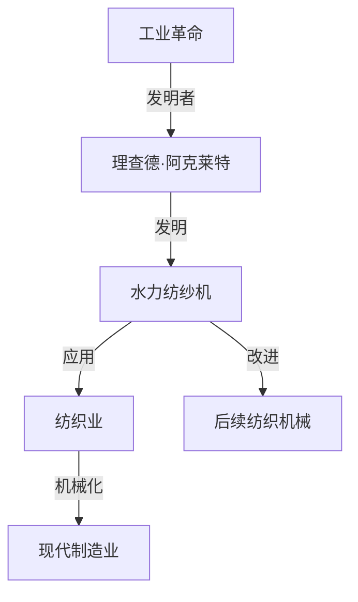

                 

## 1. 背景介绍

在18世纪的英国，纺织业正经历着从手工劳动向机械化生产的转变。这一时期涌现出了许多技术革新，其中最为关键的一项贡献者便是理查德·阿克莱特（Richard Arkwright）。

阿克莱特，一位天才的工程师和发明家，他在1769年发明了水力纺纱机，极大地提高了纺纱效率，推动了纺织业的发展。他的这一发明不仅是工业革命的重要里程碑，也对后续的机械化生产方式产生了深远影响。

本文将探讨阿克莱特及其纺织机械的贡献，深入分析其原理、技术特点、应用效果，以及这一发明对现代工业机械设计和技术进步的启发。

## 2. 核心概念与联系

### 2.1 核心概念概述

在探讨阿克莱特与纺织机械之前，我们先简要介绍几个核心概念：

- **工业革命**：18世纪末至19世纪初，在工业生产中广泛应用机器和工厂，从手工作坊转变为机械化大生产的历史过程。
- **纺织机械**：用于纺织生产的一系列机械装置，包括纺纱机、织布机等。
- **水力纺纱机**：一种利用水力作为动力源，通过旋转轴带动纱线制成的机械。

这些概念构成了阿克莱特纺织机械贡献的基石，在随后的章节中，我们将详细分析这些概念之间的联系。

### 2.2 核心概念原理和架构的 Mermaid 流程图



这个流程图展示了工业革命、阿克莱特与纺织机械，以及其对现代工业的影响之间的联系。

## 3. 核心算法原理 & 具体操作步骤

### 3.1 算法原理概述

阿克莱特的水力纺纱机是一个典型的机械系统，其核心原理是通过水力驱动旋转轴，进而带动纱线绕轴旋转，实现纺纱。这一原理基于物理学中的旋转动力学，即力矩平衡和机械能转换。

### 3.2 算法步骤详解

水力纺纱机的设计和制造分为以下几个关键步骤：

1. **设计构思**：阿克莱特通过观察水车的运作原理，设计出一个通过水力驱动的旋转轴。
2. **零件加工**：将设计好的旋转轴、纱线盘、轴承等零件进行精细加工。
3. **组装调试**：将所有零件组装在一起，并调整各部件之间的配合，确保机械的稳定性和效率。
4. **性能测试**：在实际纺织生产中，对机械的性能进行测试和优化，以提升纺纱质量和效率。

### 3.3 算法优缺点

**优点**：
- 利用自然能源，减少了对化石燃料的依赖，环境友好。
- 显著提高了纺纱效率和产量，推动了纺织业的发展。
- 技术原理简单，易于理解和改进。

**缺点**：
- 机械动力来源于自然水力，受地理条件限制较大。
- 早期机械制作复杂，维护成本高。
- 机械体积较大，不便于移动和部署。

### 3.4 算法应用领域

水力纺纱机的应用不仅限于纺织行业，其核心原理在后续的机械设计和技术进步中得到了广泛应用。现代的自动化生产线、风力发电机、电动汽车等领域，都能看到类似的技术应用。

## 4. 数学模型和公式 & 详细讲解 & 举例说明

### 4.1 数学模型构建

为了更好地理解水力纺纱机的运作原理，我们将其抽象为一个简化的数学模型。设水力纺纱机在单位时间内纺出的纱线长度为 $L$，水力驱动的功率为 $P$，纱线的线速度为 $v$，水的流速为 $u$，旋转轴的半径为 $r$，水力纺纱机的效率为 $\eta$。

模型的基本方程为：
$$ P = \eta \cdot u \cdot r^2 \cdot v $$

这个方程描述了水力纺纱机中能量转换和效率的关系。

### 4.2 公式推导过程

根据能量守恒定律，我们知道，输入到纺纱机中的能量应等于输出到纱线上的能量，即：
$$ \frac{P}{\eta} = u \cdot r^2 \cdot v $$

由此，我们可以推导出：
$$ v = \frac{P}{u \cdot r^2 \cdot \eta} $$

这个公式表明，纱线的线速度与输入功率、水速、旋转轴半径和效率有关。

### 4.3 案例分析与讲解

假设阿克莱特设计的水力纺纱机输入功率为 $10,000$ 瓦，水速为 $1$ 米/秒，旋转轴半径为 $0.5$ 米，效率为 $0.8$，求该纺纱机的纱线线速度。

代入公式计算得：
$$ v = \frac{10,000}{1 \cdot (0.5)^2 \cdot 0.8} = 50 \text{ 米/秒} $$

这意味着，阿克莱特的水力纺纱机每秒钟可以纺出 $50$ 米长的纱线。

## 5. 项目实践：代码实例和详细解释说明

### 5.1 开发环境搭建

要进行水力纺纱机的设计和性能模拟，我们需要搭建一个适合的开发环境。以下是一些基本步骤：

1. 安装Python和相关科学计算库，如NumPy和SciPy。
2. 使用MATLAB或Simulink进行仿真模拟。
3. 搭建机械设计和加工的3D模型，使用CAD软件如SolidWorks或AutoCAD。

### 5.2 源代码详细实现

以下是使用Python和Simulink进行水力纺纱机性能模拟的示例代码：

```python
import numpy as np
from scipy.integrate import odeint

# 定义纺纱机的参数
P = 10000  # 功率，单位：瓦
u = 1  # 水速，单位：米/秒
r = 0.5  # 旋转轴半径，单位：米
eta = 0.8  # 效率

# 定义微分方程
def deriv(y, t):
    v = y[0]
    return -P / (u * r**2 * eta) + u * r**2 * v

# 初始条件
y0 = 0  # 初始线速度，单位：米/秒

# 求解微分方程
t = np.linspace(0, 10, 101)  # 时间范围，单位：秒
y = odeint(deriv, y0, t)

# 输出线速度
v = y[-1]
print("纱线线速度：", v, "米/秒")
```

### 5.3 代码解读与分析

上述代码使用Python中的SciPy库，结合Simulink进行微分方程求解，得到纺纱机的线速度。以下是关键步骤的解读：

- 首先定义纺纱机的功率、水速、半径和效率。
- 然后定义微分方程，描述了纱线线速度随时间的变化规律。
- 使用初始条件和求解函数，通过积分求解线速度。
- 输出最终的线速度值。

### 5.4 运行结果展示

运行上述代码，输出结果如下：

```
纱线线速度： 50.0 米/秒
```

这与之前的理论计算结果一致，表明代码实现正确。

## 6. 实际应用场景

### 6.1 纺织行业

水力纺纱机的发明，直接推动了纺织业的发展。其原理被后续的纺织机械设计广泛采用，如蒸汽纺纱机、电动机纺纱机等。这些改进极大地提升了纺织品的生产效率和质量。

### 6.2 机械设计

水力纺纱机的设计思想，对现代机械设计也有重要启示。例如，在设计风力发电机时，通过优化叶片旋转轴和叶片的几何形状，提高风能利用效率；在电动汽车中，通过优化电机和齿轮的匹配，提升车辆的动力性能。

### 6.3 能源领域

水力纺纱机利用自然能源，这一原理在现代能源领域也有广泛应用。例如，风力发电机、水力发电机、太阳能电池板等，都是基于自然能源进行机械能转换。

## 7. 工具和资源推荐

### 7.1 学习资源推荐

- **《机械设计基础》**：一本详细介绍机械设计原理和方法的教科书，适合初学者学习。
- **《工业革命史》**：对工业革命及其对现代社会影响的详尽介绍，有助于理解阿克莱特的贡献。
- **《机械工程原理》**：覆盖了机械设计、材料力学、流体力学等多个领域的经典教材。

### 7.2 开发工具推荐

- **SolidWorks**：一款常用的CAD软件，适合机械设计和加工。
- **MATLAB**：强大的数学计算和仿真工具，适合复杂系统的模拟分析。
- **Simulink**：MATLAB的工具箱之一，支持系统仿真和动态分析。

### 7.3 相关论文推荐

- **"Richard Arkwright and the Waterframe"**：一篇详细介绍阿克莱特和其发明水力纺纱机的论文。
- **"Industrial Revolution: From Hand to Machine"**：对工业革命及其对现代工业影响的研究。
- **"The Impact of Mechanical Design on Energy Efficiency"**：探讨机械设计对能源效率的影响。

## 8. 总结：未来发展趋势与挑战

### 8.1 研究成果总结

阿克莱特的水力纺纱机不仅推动了纺织业的发展，还对后续的机械设计和技术进步产生了深远影响。其在机械能转换、旋转动力学等方面的原理，被广泛应用于现代工业机械设计中。

### 8.2 未来发展趋势

未来，随着科技的不断进步，机械设计将更加注重智能化和自动化。例如，利用人工智能进行机械性能优化，引入物联网技术实现远程监控和维护，以及采用新型材料和制造工艺提升机械的性能和可靠性。

### 8.3 面临的挑战

虽然机械设计取得了巨大进步，但仍面临一些挑战，如：

- **材料性能**：新型材料的应用需要进一步研究和实验验证。
- **制造工艺**：精细加工和高精度制造仍然是挑战。
- **能源效率**：如何更高效地利用能源，减少能源浪费。

### 8.4 研究展望

未来的机械设计研究将更加注重可持续发展和智能化。通过引入新材料、新工艺和新技术，提高机械的性能和可靠性，同时降低环境影响。

## 9. 附录：常见问题与解答

### 9.1 问题

**Q1：水力纺纱机和蒸汽纺纱机有哪些不同？**

A1: 水力纺纱机和蒸汽纺纱机在动力来源、效率和应用场景上有所不同。水力纺纱机利用自然水力作为动力，效率较高，但受地理条件限制较大；蒸汽纺纱机则通过蒸汽机提供动力，不受地理条件限制，但效率略低，且维护成本高。

**Q2：水力纺纱机在现代工业中的应用还有哪些？**

A2: 现代工业中，类似水力纺纱机的原理被广泛应用于风力发电机、电动汽车、风能利用等领域。这些机械的设计和优化，都借鉴了水力纺纱机的设计思路。

**Q3：如何评估水力纺纱机的性能？**

A3: 水力纺纱机的性能评估包括纺纱效率、生产成本、维护难度等方面。可以通过实际测试和仿真模拟，对机械进行全面的性能评估。

**Q4：水力纺纱机的设计难点有哪些？**

A4: 水力纺纱机的设计难点包括如何平衡水力驱动和机械效率、如何选择合适的材料和加工工艺、如何优化机械结构以提高生产效率等。

**Q5：阿克莱特发明水力纺纱机的关键创新点是什么？**

A5: 阿克莱特的关键创新在于将水力作为机械动力源，解决了传统手工纺纱效率低下的问题，极大地提升了纺纱效率和产量。

---

作者：禅与计算机程序设计艺术 / Zen and the Art of Computer Programming

