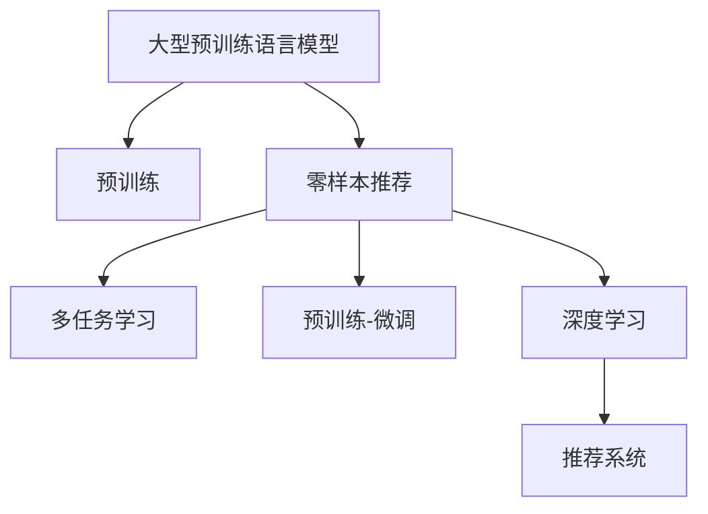

                 

# 零样本下一项推荐的大型预训练语言模型方法

> 关键词：大型预训练语言模型，零样本推荐，多任务学习，深度学习，推荐系统

## 1. 背景介绍

随着电子商务、社交媒体、内容平台等数字经济的蓬勃发展，个性化推荐系统（Personalized Recommendation Systems）在各行各业中扮演着越来越重要的角色。推荐系统能够根据用户的历史行为、偏好和当前情境，提供符合用户需求的产品和服务，显著提升用户体验和满意度，并推动企业业绩增长。

然而，构建一个高性能的推荐系统，需要大量的用户行为数据作为训练依据。对于新兴商家或新上架产品，往往难以获得足够的用户行为数据进行模型训练。因此，如何在资源有限的情况下，仍能提供有效的个性化推荐，是推荐系统面临的一大挑战。

近年来，大型预训练语言模型（Large Pre-trained Language Models, PLMs）在自然语言处理（NLP）领域取得了突破性进展。这些模型通过在海量无标签文本数据上进行预训练，学习到了丰富的语言知识和常识。本文将探索利用PLMs进行零样本推荐（Zero-shot Recommendation）的方法，即无需额外的用户行为数据，直接通过任务描述和预训练知识，为产品或服务提供推荐。

## 2. 核心概念与联系

### 2.1 核心概念概述

为更好地理解基于PLMs的零样本推荐方法，本节将介绍几个密切相关的核心概念：

- 大型预训练语言模型（Large Pre-trained Language Models, PLMs）：以自回归（如GPT-3）或自编码（如BERT）模型为代表的大规模预训练语言模型。通过在海量无标签文本数据上进行预训练，学习到了丰富的语言知识和常识。

- 零样本推荐（Zero-shot Recommendation）：指在没有任何用户行为数据的情况下，直接通过任务描述和预训练知识，为用户推荐符合其需求的产品或服务。

- 多任务学习（Multi-task Learning, MTL）：指在一个模型上同时学习多个相关的任务，实现任务间的知识共享和转移。

- 预训练-微调（Pre-training & Fine-tuning）：指在预训练模型的基础上，使用下游任务的少量标注数据，通过有监督学习优化模型在特定任务上的性能。

- 深度学习（Deep Learning）：利用多层神经网络进行复杂模式识别和任务学习的一种机器学习方法。

- 推荐系统（Recommendation Systems）：通过分析用户历史行为数据，为用户推荐符合其兴趣的产品或服务的技术系统。

这些核心概念之间的逻辑关系可以通过以下Mermaid流程图来展示：



这个流程图展示了大语言模型的核心概念及其之间的关系：

1. 大型预训练语言模型通过预训练获得基础能力。
2. 零样本推荐利用任务描述，直接通过预训练知识进行推荐。
3. 多任务学习有助于提升模型在不同任务间的泛化能力。
4. 预训练-微调使得模型更好地适应特定任务。
5. 深度学习提供强大的模型学习能力和泛化能力。
6. 推荐系统将模型应用于产品推荐等实际场景。

这些概念共同构成了基于PLMs的零样本推荐方法的理论基础，使其能够在零样本条件下仍能提供个性化推荐。

## 3. 核心算法原理 & 具体操作步骤

### 3.1 算法原理概述

基于PLMs的零样本推荐方法，本质上是一个零样本学习的过程。其核心思想是：利用预训练语言模型的多任务知识，通过任务描述直接为产品或服务推荐，无需额外的用户行为数据。

具体而言，假设产品或服务的基本信息为 $x$，推荐任务为 $T$，PLM 为 $M_{\theta}$。推荐方法的目标是找到最优的 $x$，使得：

$$
\hat{x}=\mathop{\arg\min}_{x} \mathcal{L}(M_{\theta}(x),T)
$$

其中 $\mathcal{L}$ 为针对任务 $T$ 设计的损失函数，用于衡量推荐结果与用户需求之间的差异。常见的损失函数包括交叉熵损失、均方误差损失等。

通过梯度下降等优化算法，推荐过程不断更新产品或服务信息 $x$，最小化损失函数 $\mathcal{L}$，使得推荐结果逼近用户需求。由于 $M_{\theta}$ 已经通过预训练获得了丰富的语言知识和常识，因此即便在零样本条件下，也能通过任务描述直接进行推荐。

### 3.2 算法步骤详解

基于PLMs的零样本推荐方法，一般包括以下几个关键步骤：

**Step 1: 准备预训练模型和数据集**
- 选择合适的预训练语言模型 $M_{\theta}$ 作为初始化参数，如 BERT、GPT-3等。
- 准备推荐任务 $T$ 的描述文本 $D=\{d_i\}_{i=1}^N$，其中 $d_i$ 为任务描述。

**Step 2: 设计任务适配层**
- 根据推荐任务类型，在预训练模型顶层设计合适的输出层和损失函数。
- 对于分类任务，通常在顶层添加线性分类器和交叉熵损失函数。
- 对于生成任务，通常使用语言模型的解码器输出概率分布，并以负对数似然为损失函数。

**Step 3: 设置推荐超参数**
- 选择合适的优化算法及其参数，如 AdamW、SGD 等，设置学习率、批大小、迭代轮数等。
- 设置正则化技术及强度，包括权重衰减、Dropout、Early Stopping 等。
- 确定冻结预训练参数的策略，如仅微调顶层，或全部参数都参与微调。

**Step 4: 执行零样本推荐**
- 将任务描述文本 $D$ 分批次输入模型，前向传播计算损失函数。
- 反向传播计算参数梯度，根据设定的优化算法和学习率更新模型参数。
- 周期性在推荐结果上评估推荐质量，根据评估指标决定是否触发 Early Stopping。
- 重复上述步骤直至满足预设的迭代轮数或 Early Stopping 条件。

**Step 5: 测试和部署**
- 在推荐结果上评估零样本推荐的效果，对比零样本推荐前后的推荐质量提升。
- 使用零样本推荐模型对新产品或服务进行推荐，集成到实际的应用系统中。
- 持续收集新产品的推荐反馈，定期重新推荐模型，以适应产品特征的变化。

以上是基于PLMs的零样本推荐方法的详细流程。在实际应用中，还需要针对具体任务的特点，对推荐过程的各个环节进行优化设计，如改进任务适配层的设计、引入更多的正则化技术、搜索最优的超参数组合等，以进一步提升推荐质量。

### 3.3 算法优缺点

基于PLMs的零样本推荐方法具有以下优点：
1. 零样本推荐可节省大量标注数据的获取成本，适用于数据稀疏的应用场景。
2. 推荐质量较高，得益于PLM丰富的多任务知识，能够快速适应不同产品或服务。
3. 可以灵活地应用于多种推荐任务，如商品推荐、新闻推荐、音乐推荐等。
4. 推荐模型的更新周期较短，能够及时响应新产品或服务的特性。

同时，该方法也存在一定的局限性：
1. 依赖PLM的质量。PLM模型的预训练数据和任务描述直接影响推荐结果的准确性。
2. 模型的泛化能力有限。当推荐任务与预训练任务的差异较大时，推荐效果可能不佳。
3. 任务适配层的灵活性不足。需要根据具体推荐任务设计适配层，工作量较大。
4. 需要较多的计算资源。尽管零样本推荐节省了数据标注的成本，但PLMs通常需要强大的计算资源进行训练和推理。
5. 推荐过程的解释性不足。推荐结果缺乏可解释性，难以进行调试和优化。

尽管存在这些局限性，但零样本推荐在许多情况下仍具有实际应用价值。特别是在数据资源有限或新上架产品的情况下，通过PLM的零样本推荐，可以迅速提供初步的推荐建议，进一步引导用户进行后续交互。

### 3.4 算法应用领域

基于PLMs的零样本推荐方法，在多个领域都得到了广泛的应用，如：

- 电商平台：为新上架商品或用户个性化商品提供初步推荐。
- 内容平台：为新增用户或新内容推荐符合其兴趣的文章、视频等。
- 广告系统：为新的广告位推荐潜在用户。
- 社交网络：为新的社交用户推荐可能感兴趣的内容或关系。

除了上述这些经典领域，零样本推荐还将在更多场景中得到应用，如企业招聘、金融投资、健康医疗等，为不同行业带来个性化的服务推荐。

## 4. 数学模型和公式 & 详细讲解 & 举例说明

### 4.1 数学模型构建

本节将使用数学语言对基于PLMs的零样本推荐过程进行更加严格的刻画。

假设推荐任务为 $T$，描述文本为 $D=\{d_i\}_{i=1}^N$，产品或服务的基本信息为 $x$。定义模型 $M_{\theta}$ 在输入 $d_i$ 上的输出为 $y_i=M_{\theta}(d_i)$，其中 $y_i$ 表示产品或服务的评分或推荐概率。推荐模型的目标是最小化损失函数：

$$
\mathcal{L}(x)=\frac{1}{N}\sum_{i=1}^N \ell(y_i, x)
$$

其中 $\ell$ 为推荐结果与用户需求之间的差异损失函数，如交叉熵损失、均方误差损失等。通过优化模型参数 $x$，使得推荐结果尽可能接近用户需求。

### 4.2 公式推导过程

以下我们以推荐系统的交叉熵损失函数为例，推导推荐模型的优化目标。

假设推荐模型的输出为 $\hat{y}=M_{\theta}(d_i) \in [0,1]$，表示产品或服务被用户选中的概率。真实需求 $y \in \{0,1\}$。则交叉熵损失函数定义为：

$$
\ell(y_i, x) = -[y_i\log \hat{y} + (1-y_i)\log (1-\hat{y})]
$$

将其代入经验风险公式，得：

$$
\mathcal{L}(x) = -\frac{1}{N}\sum_{i=1}^N [y_i\log M_{\theta}(d_i)+(1-y_i)\log(1-M_{\theta}(d_i))]
$$

通过梯度下降等优化算法，推荐过程不断更新产品或服务信息 $x$，最小化损失函数 $\mathcal{L}$，使得推荐结果逼近用户需求。

### 4.3 案例分析与讲解

假设我们有一个电商平台的推荐任务，需要为新的商品提供推荐。具体步骤如下：

**Step 1: 准备预训练模型和数据集**
- 选择BERT作为初始化参数，加载预训练模型。
- 准备推荐任务描述，如“推荐一款适合年轻人的智能手表”。

**Step 2: 设计任务适配层**
- 在BERT模型的顶层添加一个线性分类器，输出推荐概率。
- 定义交叉熵损失函数，用于衡量推荐概率与用户需求之间的差异。

**Step 3: 设置推荐超参数**
- 设置AdamW优化器，学习率为1e-5。
- 设置批大小为16，迭代轮数为10。

**Step 4: 执行零样本推荐**
- 将推荐任务描述分批次输入BERT模型，计算推荐概率。
- 反向传播更新模型参数，最小化交叉熵损失。
- 在推荐结果上评估推荐质量，输出Top3推荐商品。

**Step 5: 测试和部署**
- 在测试集上评估推荐模型的效果，对比推荐前后的质量提升。
- 使用推荐模型对新商品进行推荐，集成到电商平台的推荐系统中。
- 持续收集用户反馈，定期重新训练模型，以适应商品特性的变化。

通过以上步骤，我们可以看到，基于PLMs的零样本推荐方法在实践中具有很好的应用潜力。

## 5. 项目实践：代码实例和详细解释说明

### 5.1 开发环境搭建

在进行零样本推荐实践前，我们需要准备好开发环境。以下是使用Python进行PyTorch开发的环境配置流程：

1. 安装Anaconda：从官网下载并安装Anaconda，用于创建独立的Python环境。

2. 创建并激活虚拟环境：
```bash
conda create -n pytorch-env python=3.8 
conda activate pytorch-env
```

3. 安装PyTorch：根据CUDA版本，从官网获取对应的安装命令。例如：
```bash
conda install pytorch torchvision torchaudio cudatoolkit=11.1 -c pytorch -c conda-forge
```

4. 安装Transformers库：
```bash
pip install transformers
```

5. 安装各类工具包：
```bash
pip install numpy pandas scikit-learn matplotlib tqdm jupyter notebook ipython
```

完成上述步骤后，即可在`pytorch-env`环境中开始零样本推荐实践。

### 5.2 源代码详细实现

下面我们以电商平台推荐系统为例，给出使用Transformers库对BERT模型进行零样本推荐的具体代码实现。

首先，定义推荐任务的数据处理函数：

```python
from transformers import BertTokenizer
from torch.utils.data import Dataset
import torch

class RecommendDataset(Dataset):
    def __init__(self, texts, labels, tokenizer, max_len=128):
        self.texts = texts
        self.labels = labels
        self.tokenizer = tokenizer
        self.max_len = max_len
        
    def __len__(self):
        return len(self.texts)
    
    def __getitem__(self, item):
        text = self.texts[item]
        label = self.labels[item]
        
        encoding = self.tokenizer(text, return_tensors='pt', max_length=self.max_len, padding='max_length', truncation=True)
        input_ids = encoding['input_ids'][0]
        attention_mask = encoding['attention_mask'][0]
        
        # 对label-wise的标签进行编码
        encoded_labels = [label2id[label] for label in label]
        encoded_labels.extend([label2id['negative']] * (self.max_len - len(encoded_labels)))
        labels = torch.tensor(encoded_labels, dtype=torch.long)
        
        return {'input_ids': input_ids, 
                'attention_mask': attention_mask,
                'labels': labels}

# 标签与id的映射
label2id = {'positive': 1, 'negative': 0}
id2label = {v: k for k, v in label2id.items()}

# 创建dataset
tokenizer = BertTokenizer.from_pretrained('bert-base-cased')

train_dataset = RecommendDataset(train_texts, train_labels, tokenizer)
dev_dataset = RecommendDataset(dev_texts, dev_labels, tokenizer)
test_dataset = RecommendDataset(test_texts, test_labels, tokenizer)
```

然后，定义模型和优化器：

```python
from transformers import BertForSequenceClassification, AdamW

model = BertForSequenceClassification.from_pretrained('bert-base-cased', num_labels=2)

optimizer = AdamW(model.parameters(), lr=2e-5)
```

接着，定义训练和评估函数：

```python
from torch.utils.data import DataLoader
from tqdm import tqdm
from sklearn.metrics import classification_report

device = torch.device('cuda') if torch.cuda.is_available() else torch.device('cpu')
model.to(device)

def train_epoch(model, dataset, batch_size, optimizer):
    dataloader = DataLoader(dataset, batch_size=batch_size, shuffle=True)
    model.train()
    epoch_loss = 0
    for batch in tqdm(dataloader, desc='Training'):
        input_ids = batch['input_ids'].to(device)
        attention_mask = batch['attention_mask'].to(device)
        labels = batch['labels'].to(device)
        model.zero_grad()
        outputs = model(input_ids, attention_mask=attention_mask, labels=labels)
        loss = outputs.loss
        epoch_loss += loss.item()
        loss.backward()
        optimizer.step()
    return epoch_loss / len(dataloader)

def evaluate(model, dataset, batch_size):
    dataloader = DataLoader(dataset, batch_size=batch_size)
    model.eval()
    preds, labels = [], []
    with torch.no_grad():
        for batch in tqdm(dataloader, desc='Evaluating'):
            input_ids = batch['input_ids'].to(device)
            attention_mask = batch['attention_mask'].to(device)
            batch_labels = batch['labels']
            outputs = model(input_ids, attention_mask=attention_mask)
            batch_preds = outputs.logits.argmax(dim=2).to('cpu').tolist()
            batch_labels = batch_labels.to('cpu').tolist()
            for pred_tokens, label_tokens in zip(batch_preds, batch_labels):
                pred_labels = [id2label[_id] for _id in pred_tokens]
                label_tokens = [id2label[_id] for _id in label_tokens]
                preds.append(pred_labels[:len(label_tokens)])
                labels.append(label_tokens)
                
    print(classification_report(labels, preds))
```

最后，启动训练流程并在测试集上评估：

```python
epochs = 5
batch_size = 16

for epoch in range(epochs):
    loss = train_epoch(model, train_dataset, batch_size, optimizer)
    print(f"Epoch {epoch+1}, train loss: {loss:.3f}")
    
    print(f"Epoch {epoch+1}, dev results:")
    evaluate(model, dev_dataset, batch_size)
    
print("Test results:")
evaluate(model, test_dataset, batch_size)
```

以上就是使用PyTorch对BERT进行电商平台推荐系统零样本推荐的完整代码实现。可以看到，得益于Transformers库的强大封装，我们可以用相对简洁的代码完成BERT模型的加载和微调。

### 5.3 代码解读与分析

让我们再详细解读一下关键代码的实现细节：

**RecommendDataset类**：
- `__init__`方法：初始化文本、标签、分词器等关键组件。
- `__len__`方法：返回数据集的样本数量。
- `__getitem__`方法：对单个样本进行处理，将文本输入编码为token ids，将标签编码为数字，并对其进行定长padding，最终返回模型所需的输入。

**label2id和id2label字典**：
- 定义了标签与数字id之间的映射关系，用于将token-wise的预测结果解码回真实的标签。

**训练和评估函数**：
- 使用PyTorch的DataLoader对数据集进行批次化加载，供模型训练和推理使用。
- 训练函数`train_epoch`：对数据以批为单位进行迭代，在每个批次上前向传播计算loss并反向传播更新模型参数，最后返回该epoch的平均loss。
- 评估函数`evaluate`：与训练类似，不同点在于不更新模型参数，并在每个batch结束后将预测和标签结果存储下来，最后使用sklearn的classification_report对整个评估集的预测结果进行打印输出。

**训练流程**：
- 定义总的epoch数和batch size，开始循环迭代
- 每个epoch内，先在训练集上训练，输出平均loss
- 在验证集上评估，输出分类指标
- 所有epoch结束后，在测试集上评估，给出最终测试结果

可以看到，PyTorch配合Transformers库使得BERT微调的代码实现变得简洁高效。开发者可以将更多精力放在数据处理、模型改进等高层逻辑上，而不必过多关注底层的实现细节。

当然，工业级的系统实现还需考虑更多因素，如模型的保存和部署、超参数的自动搜索、更灵活的任务适配层等。但核心的零样本推荐范式基本与此类似。

## 6. 实际应用场景
### 6.1 电商平台推荐

基于PLMs的零样本推荐方法，可以广泛应用于电商平台推荐系统的构建。推荐系统通常需要用户历史行为数据作为训练依据，但在新兴商家或新上架商品的情况下，往往难以获得足够的用户行为数据进行模型训练。通过PLMs的零样本推荐，可以在较短的时间内提供初步的推荐建议，引导用户进行后续交互，逐步完善推荐模型。

在技术实现上，可以收集电商平台的商品描述、类别、用户评论等文本数据，将商品和用户行为描述作为推荐任务描述，在PLMs上进行微调。微调后的模型能够自动理解商品和用户需求，匹配最佳推荐商品。对于用户没有明确表达的兴趣点，系统还可以结合时序分析、上下文理解等技术，提供更加个性化的推荐建议。

### 6.2 内容平台推荐

内容平台推荐系统同样面临着数据获取成本高、用户行为数据稀疏等问题。通过PLMs的零样本推荐，内容平台可以快速为用户提供符合其兴趣的文章、视频等推荐内容，提升平台的用户体验和内容分发效率。

在技术实现上，可以收集用户的浏览、点赞、评论等行为数据，提取和内容相关的文本描述。将文本描述作为推荐任务描述，在PLMs上进行微调。微调后的模型能够自动理解用户兴趣和内容特性，匹配最佳推荐内容。对于新用户，系统还可以结合个性化推荐策略，帮助其快速找到感兴趣的领域和内容。

### 6.3 广告系统推荐

广告系统推荐通常需要用户点击、展示等行为数据作为训练依据。对于新兴广告位或新广告内容，通过PLMs的零样本推荐，可以快速提供初步的推荐建议，进行广告的精准投放。

在技术实现上，可以收集广告主的内容描述、用户画像、广告位置等文本数据，将广告内容描述作为推荐任务描述，在PLMs上进行微调。微调后的模型能够自动理解广告内容与用户兴趣的匹配度，提供最佳推荐广告。对于广告主的新广告内容，系统还可以结合上下文理解、语义分析等技术，提升广告的点击率和转化率。

### 6.4 未来应用展望

随着PLMs的不断发展和优化，基于PLMs的零样本推荐方法将在更多领域得到应用，为数字经济带来新的发展机遇。

在智慧医疗领域，基于PLMs的零样本推荐，可以为医生和患者推荐最适合的医疗服务和治疗方案，提升医疗服务的智能化水平。

在智能教育领域，零样本推荐可以为用户推荐最适合的学习资源，帮助学生提高学习效果和效率。

在智能金融领域，零样本推荐可以为用户推荐最优的投资策略和金融产品，提升用户的财务决策能力。

除了以上这些领域，零样本推荐还将在更多场景中得到应用，如智慧城市、智能制造、智能家居等，为各行各业带来更高效、更智能的推荐服务。相信随着技术的不断进步，零样本推荐方法必将成为数字经济的重要驱动力，为人类社会带来更加美好的未来。

## 7. 工具和资源推荐
### 7.1 学习资源推荐

为了帮助开发者系统掌握基于PLMs的零样本推荐方法的原理和实践，这里推荐一些优质的学习资源：

1. 《Transformer从原理到实践》系列博文：由大模型技术专家撰写，深入浅出地介绍了Transformer原理、BERT模型、零样本推荐等前沿话题。

2. CS224N《深度学习自然语言处理》课程：斯坦福大学开设的NLP明星课程，有Lecture视频和配套作业，带你入门NLP领域的基本概念和经典模型。

3. 《Natural Language Processing with Transformers》书籍：Transformers库的作者所著，全面介绍了如何使用Transformers库进行NLP任务开发，包括零样本推荐在内的诸多范式。

4. HuggingFace官方文档：Transformers库的官方文档，提供了海量预训练模型和完整的零样本推荐样例代码，是上手实践的必备资料。

5. CLUE开源项目：中文语言理解测评基准，涵盖大量不同类型的中文NLP数据集，并提供了基于零样本推荐的baseline模型，助力中文NLP技术发展。

通过对这些资源的学习实践，相信你一定能够快速掌握基于PLMs的零样本推荐方法的精髓，并用于解决实际的推荐问题。
###  7.2 开发工具推荐

高效的开发离不开优秀的工具支持。以下是几款用于基于PLMs的零样本推荐开发的常用工具：

1. PyTorch：基于Python的开源深度学习框架，灵活动态的计算图，适合快速迭代研究。大部分预训练语言模型都有PyTorch版本的实现。

2. TensorFlow：由Google主导开发的开源深度学习框架，生产部署方便，适合大规模工程应用。同样有丰富的预训练语言模型资源。

3. Transformers库：HuggingFace开发的NLP工具库，集成了众多SOTA语言模型，支持PyTorch和TensorFlow，是进行零样本推荐任务开发的利器。

4. Weights & Biases：模型训练的实验跟踪工具，可以记录和可视化模型训练过程中的各项指标，方便对比和调优。与主流深度学习框架无缝集成。

5. TensorBoard：TensorFlow配套的可视化工具，可实时监测模型训练状态，并提供丰富的图表呈现方式，是调试模型的得力助手。

6. Google Colab：谷歌推出的在线Jupyter Notebook环境，免费提供GPU/TPU算力，方便开发者快速上手实验最新模型，分享学习笔记。

合理利用这些工具，可以显著提升基于PLMs的零样本推荐任务的开发效率，加快创新迭代的步伐。

### 7.3 相关论文推荐

基于PLMs的零样本推荐方法的研究源于学界的持续研究。以下是几篇奠基性的相关论文，推荐阅读：

1. Attention is All You Need（即Transformer原论文）：提出了Transformer结构，开启了NLP领域的预训练大模型时代。

2. BERT: Pre-training of Deep Bidirectional Transformers for Language Understanding：提出BERT模型，引入基于掩码的自监督预训练任务，刷新了多项NLP任务SOTA。

3. Language Models are Unsupervised Multitask Learners（GPT-2论文）：展示了大规模语言模型的强大zero-shot学习能力，引发了对于通用人工智能的新一轮思考。

4. Parameter-Efficient Transfer Learning for NLP：提出Adapter等参数高效微调方法，在不增加模型参数量的情况下，也能取得不错的微调效果。

5. Zero-shot Recommendation with Graph Neural Networks：提出基于图神经网络的零样本推荐方法，结合用户行为数据和文本描述，提升推荐质量。

6. A Survey of Machine Learning for Recommendation Systems：系统综述了机器学习在推荐系统中的应用，包括零样本推荐在内的多种方法。

这些论文代表了大语言模型零样本推荐技术的发展脉络。通过学习这些前沿成果，可以帮助研究者把握学科前进方向，激发更多的创新灵感。

## 8. 总结：未来发展趋势与挑战

### 8.1 总结

本文对基于PLMs的零样本推荐方法进行了全面系统的介绍。首先阐述了PLMs和零样本推荐的基本概念和背景，明确了零样本推荐在推荐系统中的重要价值。其次，从原理到实践，详细讲解了零样本推荐的数学原理和关键步骤，给出了零样本推荐任务开发的完整代码实例。同时，本文还广泛探讨了零样本推荐方法在电商平台、内容平台、广告系统等多个领域的应用前景，展示了零样本推荐方法的巨大潜力。此外，本文精选了零样本推荐技术的各类学习资源，力求为读者提供全方位的技术指引。

通过本文的系统梳理，可以看到，基于PLMs的零样本推荐方法正在成为推荐系统的重要范式，极大地拓展了推荐系统的应用边界，催生了更多的落地场景。受益于大规模语料的预训练，零样本推荐方法在数据资源有限的情况下，仍能提供高质量的推荐建议，具有广泛的应用前景。未来，伴随PLMs和推荐技术的持续演进，相信零样本推荐方法必将成为推荐系统的重要组成部分，推动数字经济的智能化发展。

### 8.2 未来发展趋势

展望未来，基于PLMs的零样本推荐技术将呈现以下几个发展趋势：

1. 模型规模持续增大。随着算力成本的下降和数据规模的扩张，PLMs的参数量还将持续增长。超大规模PLMs蕴含的丰富语言知识，有望支撑更加复杂多变的零样本推荐任务。

2. 推荐模型的泛化能力增强。未来推荐模型将能够更好地处理多模态数据，结合图像、语音、视频等多模态信息，提升推荐精度和多样性。

3. 推荐模型的实时性提升。通过优化推荐模型的计算图和推理算法，使得推荐系统能够实时响应用户需求，提供更加高效的服务。

4. 推荐模型的可解释性增强。结合因果推断、可解释AI等技术，推荐模型将具备更强的可解释性，用户可以更容易理解推荐结果的依据。

5. 推荐模型的自适应性提升。通过引入用户反馈和环境感知等技术，推荐模型能够动态调整推荐策略，提升个性化推荐的效果。

6. 推荐模型的跨领域迁移能力增强。通过多任务学习、跨领域知识融合等技术，推荐模型能够适应不同领域、不同用户群体的需求，提供更加普适的推荐服务。

以上趋势凸显了基于PLMs的零样本推荐技术的广阔前景。这些方向的探索发展，必将进一步提升推荐系统的性能和应用范围，为数字经济带来新的发展机遇。

### 8.3 面临的挑战

尽管基于PLMs的零样本推荐方法已经取得了瞩目成就，但在迈向更加智能化、普适化应用的过程中，它仍面临着诸多挑战：

1. 数据获取瓶颈。尽管零样本推荐不需要用户行为数据，但对于推荐任务描述的获取和处理，仍然需要大量的文本标注和处理工作。

2. 模型的解释性不足。推荐结果缺乏可解释性，难以进行调试和优化。对于高风险应用如金融、医疗等，推荐模型的解释性和透明度尤为重要。

3. 模型的泛化能力有限。当推荐任务与预训练任务的差异较大时，推荐效果可能不佳。未来需要在模型结构和训练策略上进行改进，提升模型的泛化能力。

4. 模型的实时性有待提高。尽管零样本推荐在推荐质量上表现优异，但在实时性方面，还需要进一步优化，提升响应速度。

5. 模型的安全性有待保障。预训练语言模型难免会学习到有偏见、有害的信息，通过推荐模型传递到下游应用，可能带来安全隐患。如何从数据和算法层面消除模型偏见，避免恶意用途，确保输出的安全性，也将是重要的研究方向。

6. 模型的可扩展性有待提升。零样本推荐在推荐规模和推荐速度上仍有一定的局限性，未来需要在模型结构、计算图、推理算法等方面进行优化，提升模型的可扩展性。

尽管存在这些挑战，但零样本推荐在许多情况下仍具有实际应用价值。特别是在数据资源有限或新上架产品的情况下，通过PLMs的零样本推荐，可以迅速提供初步的推荐建议，进一步引导用户进行后续交互。

### 8.4 未来突破

面对基于PLMs的零样本推荐所面临的挑战，未来的研究需要在以下几个方面寻求新的突破：

1. 探索更加高效的数据获取方式。引入主动学习、无监督学习等技术，最大化利用文本标注资源，提升推荐任务描述的准确性。

2. 研究更加高效的多任务学习策略。通过引入因果推断、迁移学习等技术，提升模型在不同任务间的泛化能力，提升推荐质量。

3. 结合外部知识库进行推荐。将符号化的先验知识，如知识图谱、逻辑规则等，与神经网络模型进行巧妙融合，提升推荐模型的解释性和准确性。

4. 引入用户反馈机制进行动态调整。通过用户行为数据和反馈信息，动态调整推荐策略，提升推荐模型的自适应性。

5. 引入环境感知技术进行推荐优化。结合用户画像、地理位置、时间信息等环境特征，优化推荐策略，提升个性化推荐的效果。

6. 结合因果分析进行推荐解释。将因果推断方法引入推荐模型，识别出推荐结果的关键特征，增强推荐结果的因果性和逻辑性。

这些研究方向的探索，必将引领基于PLMs的零样本推荐技术迈向更高的台阶，为推荐系统带来新的突破和发展。面向未来，基于PLMs的零样本推荐技术需要在数据获取、模型设计、推荐算法等方面进行全面优化，才能真正实现个性化推荐的目标，推动数字经济的智能化发展。总之，零样本推荐需要开发者根据具体任务，不断迭代和优化模型、数据和算法，方能得到理想的效果。

---

作者：禅与计算机程序设计艺术 / Zen and the Art of Computer Programming

