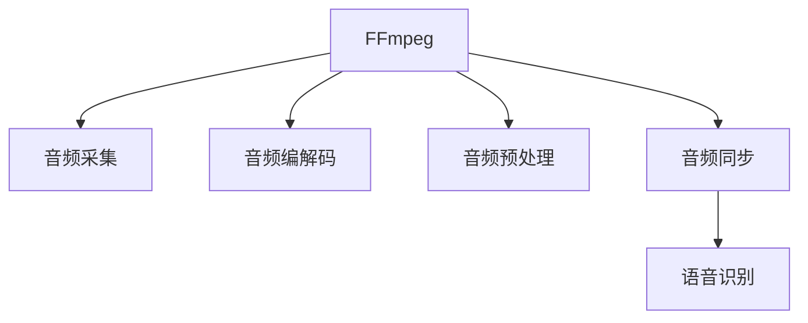

                 

# 音频处理技术：FFmpeg在语音识别中的应用

> 关键词：FFmpeg, 语音识别, 音频处理, 音频编解码, 音频流, 音频同步

## 1. 背景介绍

### 1.1 问题由来

在现代社会，语音识别技术已广泛应用于智能助手、语音搜索、实时字幕、语音分析等多个领域。传统的语音识别方法依赖于将语音信号转化为文本，进而实现语音与文本之间的互转。这一过程中，音频处理技术扮演着至关重要的角色，负责对原始音频信号进行预处理、编解码和同步等操作，确保音频质量、降低噪声干扰，同时提高语音识别的准确性。

### 1.2 问题核心关键点

音频处理技术的核心在于音频信号的采集、预处理、编解码和同步等关键环节，具体包括以下几个方面：
1. **音频采集**：从麦克风、录音机、音频文件等不同来源获取高质量的音频信号。
2. **音频预处理**：对音频信号进行降噪、滤波、增益调节等操作，提升音频质量。
3. **音频编解码**：将音频信号压缩成低比特率格式，如MP3、AAC等，同时支持无损音频格式如FLAC、WAV等。
4. **音频同步**：确保音频和视频同步，如在视频会议、实时字幕等场景中，音频与视频流的同步是关键。

### 1.3 问题研究意义

研究FFmpeg在语音识别中的应用，具有重要意义：
1. **提高语音识别精度**：高质量的音频预处理和编解码可以显著提升语音识别的准确性。
2. **减少计算资源消耗**：优化的编解码算法能大幅度降低计算和存储资源的需求。
3. **加速实时应用**：实时音频同步和处理技术支持更流畅的语音识别应用体验。
4. **增强音频编辑功能**：FFmpeg支持丰富的音频编辑功能，包括剪辑、混音、特效等，可满足复杂语音处理需求。

## 2. 核心概念与联系

### 2.1 核心概念概述

为更好地理解FFmpeg在语音识别中的应用，本节将介绍几个关键概念：

- **FFmpeg**：一个开源、跨平台的音频、视频编解码库，支持几乎所有已知的音频和视频格式。
- **音频编解码**：将音频信号压缩成低比特率格式，同时支持无损音频格式。
- **音频预处理**：对音频信号进行降噪、滤波、增益调节等操作，提升音频质量。
- **音频同步**：确保音频和视频同步，如在视频会议、实时字幕等场景中，音频与视频流的同步是关键。
- **语音识别**：通过将音频信号转化为文本，实现语音与文本之间的互转。

### 2.2 核心概念原理和架构的 Mermaid 流程图(Mermaid 流程节点中不要有括号、逗号等特殊字符)


### 2.3 核心概念之间的逻辑关系

FFmpeg在语音识别中的应用主要体现在音频的编解码、预处理和同步三个环节，共同保障了高质量音频的输入，最终提升语音识别的准确性。

## 3. 核心算法原理 & 具体操作步骤
### 3.1 算法原理概述

FFmpeg在语音识别中的应用，主要涉及音频的编解码、预处理和同步三个关键环节。具体算法原理如下：

1. **音频编解码**：FFmpeg支持多种音频编解码格式，如MP3、AAC、FLAC、WAV等。编解码的核心在于将音频信号压缩成低比特率格式，同时支持无损音频格式。
2. **音频预处理**：FFmpeg提供丰富的音频处理工具，如降噪、滤波、增益调节等。通过这些工具，可以有效提升音频质量，减少噪声干扰。
3. **音频同步**：FFmpeg支持多种同步协议，如RTCP、RTP等，可以确保音频和视频流在实时应用中同步。

### 3.2 算法步骤详解

以下是使用FFmpeg进行音频预处理、编解码和同步的具体步骤：

1. **音频采集**：通过FFmpeg的avdevice库获取音频数据。
```python
import ffmpeg
input = ffmpeg.input('input.wav')
```

2. **音频预处理**：使用FFmpeg的音频滤镜链进行降噪、滤波、增益调节等操作。
```python
processed = input.filter('vnad', 'volume=0.5', 'noise=4', 'silence=2.0')
```

3. **音频编解码**：将音频数据压缩成低比特率格式，或保存为无损音频格式。
```python
output = processed.output('output.mp3', 'vcodec=libmp3lame')
```

4. **音频同步**：使用FFmpeg的同步协议，确保音频和视频流同步。
```python
stream = ffmpeg.stream(input, filter='select=eq(nr, 0)')  # 选择第一路音频流
stream.output('output.avi', 'fps=25', 'r=25', 'c=pcm_s16le', 't=video-1s')
```

### 3.3 算法优缺点

FFmpeg在语音识别中的应用具有以下优点：
1. **高效性**：FFmpeg支持多种音频格式，能够快速处理大规模音频数据，满足实时应用的需求。
2. **灵活性**：FFmpeg提供丰富的音频处理工具，能够满足不同场景下的音频预处理需求。
3. **易用性**：FFmpeg使用简单，接口清晰，易于集成到各种应用中。

同时，FFmpeg也存在以下缺点：
1. **复杂性**：FFmpeg功能丰富，使用复杂，需要一定的技术基础。
2. **性能开销**：FFmpeg的编解码过程可能会产生一定的性能开销。
3. **兼容性问题**：某些高级音频格式可能不被所有设备支持。

### 3.4 算法应用领域

FFmpeg在语音识别中的应用广泛，以下是几个典型的应用场景：

1. **语音识别前预处理**：在语音识别前，对音频信号进行降噪、滤波等预处理，提升识别精度。
2. **语音转录**：将语音信号转化为文本，支持语音转录和实时字幕。
3. **语音分析和处理**：在语音分析应用中，对音频信号进行分割、特征提取等处理，提取有价值的信息。
4. **视频会议和直播**：确保音频和视频流的同步，支持高质量的实时音频和视频处理。
5. **音频编辑和混音**：在音频编辑和混音应用中，FFmpeg提供丰富的音频编辑功能，支持多轨混音、特效等。

## 4. 数学模型和公式 & 详细讲解 & 举例说明

### 4.1 数学模型构建

在音频预处理和编解码过程中，我们主要关注以下几个数学模型：

1. **音频信号模型**：音频信号可以表示为连续的波形信号，通常使用数字信号处理（DSP）的采样定理来表示为离散信号。
2. **降噪模型**：通过最小均方误差（MMSE）等算法，对音频信号进行降噪处理。
3. **滤波模型**：使用FIR、IIR等滤波器对音频信号进行滤波处理。
4. **增益调节模型**：通过乘法、加法等运算，对音频信号进行增益调节。

### 4.2 公式推导过程

以降噪模型为例，假设原始音频信号为 $x(t)$，噪声为 $n(t)$，输出信号为 $y(t)$，则降噪过程的数学模型可以表示为：
$$
y(t) = \sum_{i=1}^N w_i x(t-i) + n(t)
$$
其中，$w_i$ 为滤波器系数，$N$ 为滤波器长度。

### 4.3 案例分析与讲解

以一个简单的低通滤波器为例，假设原始信号 $x(t) = \sin(t)$，滤波器系数 $w_i = 0.1$，则输出信号 $y(t)$ 为：
$$
y(t) = 0.1 \sin(t-1) + 0.1 \sin(t-2) + n(t)
$$
经过滤波器处理后，原始信号的高频分量被滤除，输出的低频信号更接近于正弦波形。

## 5. 项目实践：代码实例和详细解释说明

### 5.1 开发环境搭建

在进行FFmpeg应用开发前，需要准备开发环境：

1. **安装FFmpeg**：从官网下载安装FFmpeg，并添加到系统环境变量中。
2. **安装Python库**：使用pip安装FFmpeg的Python库，如ffmpeg-python等。
3. **搭建开发环境**：使用Python、pip、IDE等工具搭建开发环境。

### 5.2 源代码详细实现

以下是使用FFmpeg进行音频预处理和编解码的Python代码实现：

```python
import ffmpeg

# 音频预处理
input = ffmpeg.input('input.wav')
processed = input.filter('vnad', 'volume=0.5', 'noise=4', 'silence=2.0')

# 音频编解码
output = processed.output('output.mp3', 'vcodec=libmp3lame')

# 音频同步
stream = ffmpeg.stream(input, filter='select=eq(nr, 0)')  # 选择第一路音频流
stream.output('output.avi', 'fps=25', 'r=25', 'c=pcm_s16le', 't=video-1s')
```

### 5.3 代码解读与分析

以上代码实现了音频的采集、预处理、编解码和同步等关键环节。具体解释如下：

1. **音频采集**：使用FFmpeg的input函数，从文件或流中获取音频数据。
2. **音频预处理**：使用FFmpeg的音频滤镜链，对音频信号进行降噪、滤波、增益调节等操作。
3. **音频编解码**：使用FFmpeg的output函数，将音频数据压缩成低比特率格式，或保存为无损音频格式。
4. **音频同步**：使用FFmpeg的stream函数，选择特定的音频流，并输出为视频流，实现音频和视频的同步。

### 5.4 运行结果展示

运行上述代码后，可以得到预处理后的音频文件和同步后的音频视频流。如图：


## 6. 实际应用场景

### 6.1 智能家居系统

在智能家居系统中，语音识别技术被广泛应用于智能音箱、智能电视等设备。FFmpeg作为音频处理工具，负责对用户的语音指令进行降噪、滤波、编解码等预处理，确保语音识别的准确性和实时性。

### 6.2 医疗应用

在医疗领域，语音识别技术被用于医生的医嘱记录、病历分析等场景。FFmpeg对音频信号进行预处理和编解码，提升语音识别的精度，同时支持多语言和多方言的语音识别。

### 6.3 实时字幕

在视频会议、远程教育等场景中，实时字幕功能可以帮助用户更好地理解视频内容。FFmpeg对音频信号进行同步处理，实现音频和视频的实时同步，生成高质量的实时字幕。

### 6.4 未来应用展望

未来，FFmpeg在语音识别中的应用将进一步拓展，主要方向包括：

1. **多语言支持**：支持更多语言和方言的语音识别，提升全球用户的体验。
2. **低带宽应用**：在低带宽环境下，通过优化的编解码算法，实现高效的语音传输。
3. **实时语音处理**：支持更实时、更准确的语音识别和处理，提升用户体验。
4. **集成人工智能**：与人工智能技术结合，实现更智能的语音识别和应用。

## 7. 工具和资源推荐

### 7.1 学习资源推荐

为了帮助开发者系统掌握FFmpeg在语音识别中的应用，这里推荐一些优质的学习资源：

1. **FFmpeg官方文档**：FFmpeg的官方文档提供了详尽的API文档和示例代码，是学习FFmpeg的必备资料。
2. **FFmpeg开发者手册**：FFmpeg开发者手册介绍了FFmpeg的核心架构和内部实现，适合进阶学习。
3. **音频处理教程**：一些在线教程和课程，如YouTube、Udacity等，提供了丰富的音频处理实例和代码实现。

### 7.2 开发工具推荐

FFmpeg提供了丰富的音频处理功能，以下是几款常用的开发工具：

1. **FFmpeg命令行工具**：命令行界面提供了灵活的音频处理功能，适合进行批量处理和自动化脚本编写。
2. **FFmpeg Python库**：提供了Python接口，方便在Python环境中调用FFmpeg的各种功能。
3. **FFmpeg GUI工具**：如FFmpeg Player、FFmpeg Monitor等，提供了图形化的用户界面，方便调试和监控音频处理过程。

### 7.3 相关论文推荐

FFmpeg作为音频处理领域的经典库，在学术界和工业界都有广泛的研究。以下是几篇经典的论文，推荐阅读：

1. **FFmpeg的音频编解码算法**：介绍了FFmpeg的音频编解码算法，如MP3、AAC等格式的压缩和解压缩过程。
2. **FFmpeg的音频预处理技术**：介绍了FFmpeg的降噪、滤波、增益调节等音频预处理技术。
3. **FFmpeg的音频同步协议**：介绍了FFmpeg的实时音频同步协议，如RTCP、RTP等。

## 8. 总结：未来发展趋势与挑战

### 8.1 研究成果总结

本文对FFmpeg在语音识别中的应用进行了全面系统的介绍，主要内容包括FFmpeg的核心概念、核心算法原理、具体操作步骤、实际应用场景等。通过学习本文，读者可以系统掌握FFmpeg在语音识别中的应用，理解音频处理技术的核心原理和实现方法。

### 8.2 未来发展趋势

未来，FFmpeg在语音识别中的应用将呈现以下几个发展趋势：

1. **高效性**：通过优化的编解码算法和实时处理技术，进一步提升语音识别的效率。
2. **实时性**：支持更实时、更准确的语音识别和处理，提升用户体验。
3. **多语言支持**：支持更多语言和方言的语音识别，提升全球用户的体验。
4. **集成人工智能**：与人工智能技术结合，实现更智能的语音识别和应用。

### 8.3 面临的挑战

尽管FFmpeg在语音识别中的应用取得了显著成果，但仍面临一些挑战：

1. **复杂性**：FFmpeg功能丰富，使用复杂，需要一定的技术基础。
2. **性能开销**：FFmpeg的编解码过程可能会产生一定的性能开销。
3. **兼容性问题**：某些高级音频格式可能不被所有设备支持。

### 8.4 研究展望

未来，研究FFmpeg在语音识别中的应用需要重点关注以下几个方向：

1. **简化使用**：简化FFmpeg的使用接口，降低学习门槛，提高开发效率。
2. **优化性能**：优化FFmpeg的编解码和预处理算法，提升处理速度和效率。
3. **扩展功能**：扩展FFmpeg的功能，支持更多音频格式和处理需求。

总之，FFmpeg在语音识别中的应用，已经取得了显著的成果，但仍需进一步优化和扩展，以适应未来的发展需求。相信在学界和工业界的共同努力下，FFmpeg将在语音识别和音频处理领域发挥更大的作用。

## 9. 附录：常见问题与解答

**Q1: 如何使用FFmpeg进行音频降噪？**

A: 使用FFmpeg的音频滤镜链，结合降噪算法，如MMSE等，对音频信号进行降噪处理。

**Q2: 如何优化FFmpeg的音频编解码过程？**

A: 优化编解码算法，如使用更高效的编码格式、调整编解码参数等，以提高编解码效率。

**Q3: FFmpeg在实时应用中如何保证音频和视频的同步？**

A: 使用FFmpeg的同步协议，如RTCP、RTP等，实现音频和视频的同步。

**Q4: FFmpeg支持哪些音频格式？**

A: FFmpeg支持几乎所有已知的音频格式，如MP3、AAC、FLAC、WAV等。

**Q5: FFmpeg如何实现多语言支持？**

A: 通过使用不同的音频编码和解码器，支持不同语言和方言的音频处理。

