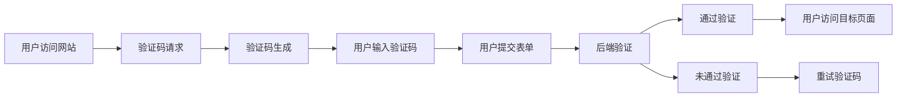

                 

## 1. 背景介绍

### 1.1 问题由来

在当今数字时代，互联网成为人们日常生活和工作的重要组成部分。而为了保障网站的安全性和用户的隐私，防止恶意攻击，例如钓鱼网站、自动化的机器脚本恶意操作等，验证码（CAPTCHA）技术应运而生。验证码通过在人机交互中增加一定的识别难度，有效地区分出人类和机器，从而保证网站的正常运行和用户的个人信息安全。

验证码的出现，实际上是人机交互中一个智慧交锋的过程。它在保护用户隐私、防范网络攻击等方面发挥了重要作用。但随着技术的发展，特别是人工智能技术的兴起，越来越多的自动化软件和工具试图绕过验证码，这对验证码系统提出了新的挑战。因此，如何开发高效、安全的验证码系统，并持续对抗自动化攻击，成为了研究热点。

### 1.2 问题核心关键点

验证码的核心在于其识别难度必须足以区分人机，但又不能过于复杂以至于难倒人类用户。其设计通常包含以下关键点：

- **识别难度**：验证码应具有足够的难度，以防止自动化软件轻易破解。
- **用户体验**：验证码的难度应合理，不能过分影响用户输入的效率。
- **安全防护**：验证码应具备足够的安全防护机制，防止自动化软件误判。
- **易用性**：验证码的输入方式应简单直观，用户容易上手。
- **自适应性**：验证码的难度应能根据用户输入情况自适应调整。

这些关键点决定了验证码设计的多样性和复杂性。本文将详细探讨验证码的核心概念及其在实际应用中的技术挑战。

## 2. 核心概念与联系

### 2.1 核心概念概述

验证码的核心概念主要包括：

- **CAPTCHA**：Completely Automated Public Turing Test to Tell Computers and Humans Apart，完全自动化的图灵测试以区分人类和计算机。
- **OCR（Optical Character Recognition）**：光学字符识别，用于读取验证码中的字符信息。
- **Turing Test**：图灵测试，用以评估机器是否具有人类智能的测试方法。
- **防机器人系统**：防止恶意软件、自动化脚本攻击的系统，验证码是其核心组件。
- **自适应验证码**：能够根据攻击者行为动态调整难度的验证码系统。

这些概念构成了验证码系统的基本框架，相互关联，共同作用。

### 2.2 核心概念原理和架构的 Mermaid 流程图



这个流程图展示了验证码从生成到验证的全过程：

1. **用户访问网站**：当用户访问需要验证的网站时，系统触发验证码请求。
2. **验证码生成**：生成一个随机的验证码图片。
3. **用户输入验证码**：用户需要识别验证码并输入。
4. **用户提交表单**：用户在提交表单时携带输入的验证码。
5. **后端验证**：后端系统对提交的验证码进行验证，判断是否合法。
6. **通过验证**：若验证码正确，用户访问目标页面；若不正确，系统提示用户重试验证码。

## 3. 核心算法原理 & 具体操作步骤

### 3.1 算法原理概述

验证码的生成和验证过程，实际上是一个典型的计算机视觉和模式识别问题。验证码图片通常包含一些随机的文字、图形、线条等元素，通过一些算法生成具有一定识别难度的图片。用户需要通过对图片内容的观察和分析，输入相应的识别结果。

验证码的生成算法一般基于以下几个步骤：

1. 生成背景图片。
2. 在背景图片上添加文本或图形。
3. 应用模糊、旋转、扭曲等变换增加识别难度。
4. 设置规则，确保文本或图形对人类的识别难度在合理范围内。
5. 对生成的验证码进行噪声处理，提高安全性。

验证算法则通常基于OCR技术，通过将图片中的字符转换为文本，然后进行比对验证。OCR技术涉及图像预处理、字符分割、字符识别等步骤，需要高效的算法和模型支持。

### 3.2 算法步骤详解

#### 3.2.1 验证码生成

验证码生成算法包含以下关键步骤：

1. **背景图片生成**：通常使用简单的几何图形（如矩形、圆形）或自然图像（如树木、建筑物）作为背景。
2. **添加文本或图形**：在背景上添加随机生成的文本或图形。文本可以是字母、数字、符号等。
3. **变换处理**：对文本或图形进行变换处理，如旋转、扭曲、缩放等，增加识别难度。
4. **添加噪声**：通过添加随机噪声（如高斯噪声、椒盐噪声）进一步提高安全性。

#### 3.2.2 验证码验证

验证码验证算法主要基于OCR技术，包含以下步骤：

1. **图像预处理**：对验证码图片进行灰度化、二值化、去噪等预处理操作，增强图像质量。
2. **字符分割**：将验证码图像中的文本或图形分割成单个字符或符号。
3. **字符识别**：使用OCR技术对分割后的字符进行识别，转换为文本。
4. **比对验证**：将识别的文本与预设的文本进行比对，判断是否一致。

### 3.3 算法优缺点

#### 3.3.1 优点

- **安全性高**：通过添加多种变换和噪声，验证码系统可以有效防止自动化软件的攻击。
- **应用广泛**：验证码技术被广泛应用于各种网站和应用，如登录验证、注册验证、交易确认等。
- **技术成熟**：OCR技术经过多年的发展，已经相当成熟，能够满足大部分验证码系统的需求。

#### 3.3.2 缺点

- **用户体验差**：验证码的复杂性往往增加了用户输入的难度和时间，影响用户体验。
- **易被攻击**：虽然增加了识别难度，但仍然存在被高级自动化软件破解的风险。
- **生成成本高**：生成高质量的验证码需要较高的计算资源和时间，增加了系统负担。

### 3.4 算法应用领域

验证码技术广泛应用于以下几个领域：

1. **登录验证**：在用户登录系统时，通过验证码确认用户身份，防止自动化脚本攻击。
2. **注册验证**：在用户注册新账户时，通过验证码防止恶意注册行为。
3. **交易确认**：在进行在线交易时，通过验证码确认交易的真实性和合法性。
4. **信息提交**：在提交敏感信息（如密码、身份证号）时，通过验证码确认用户身份。

验证码技术还应用于多个垂直领域，如电商、金融、教育等，以确保数据安全和用户体验。

## 4. 数学模型和公式 & 详细讲解 & 举例说明

### 4.1 数学模型构建

验证码系统的数学模型可以简化为一个二元分类问题。假设验证码图片为 $I$，文本或图形的标签为 $y$，则模型的目标是通过输入图片 $I$ 预测文本或图形的标签 $y$。

### 4.2 公式推导过程

假设验证码图片为 $I$，文本或图形的标签为 $y$，则模型的目标是通过输入图片 $I$ 预测文本或图形的标签 $y$。

$$
\hat{y} = f(I)
$$

其中 $f(I)$ 为模型的预测函数。在实际应用中，通常使用深度学习模型（如卷积神经网络）进行预测。模型的损失函数为交叉熵损失函数，定义如下：

$$
L(y, \hat{y}) = -y\log(\hat{y}) - (1-y)\log(1-\hat{y})
$$

模型的目标是最小化损失函数 $L$，即：

$$
\min_{\theta} L(y, f(I))
$$

其中 $\theta$ 为模型的参数，如卷积神经网络的权重和偏置。

### 4.3 案例分析与讲解

以一个简单的验证码生成和验证为例：

- **生成验证码**：生成一个包含文本 "ABC" 的背景图片。
- **添加变换**：对图片进行旋转 30 度，水平翻转。
- **添加噪声**：对图片进行高斯噪声处理。
- **验证验证码**：对处理后的图片进行预处理、字符分割、字符识别，与 "ABC" 进行比对。

## 5. 项目实践：代码实例和详细解释说明

### 5.1 开发环境搭建

在进行验证码系统的开发前，需要准备相应的开发环境。以下是使用Python进行OpenCV和Tesseract开发的验证码环境配置流程：

1. 安装Anaconda：从官网下载并安装Anaconda，用于创建独立的Python环境。

2. 创建并激活虚拟环境：
```bash
conda create -n cv-env python=3.8 
conda activate cv-env
```

3. 安装OpenCV：
```bash
conda install opencv
```

4. 安装Tesseract：
```bash
conda install tesseract
```

5. 安装PyTorch：
```bash
pip install torch
```

6. 安装TensorFlow：
```bash
pip install tensorflow
```

7. 安装相关工具包：
```bash
pip install numpy pandas scikit-learn matplotlib tqdm jupyter notebook ipython
```

完成上述步骤后，即可在`cv-env`环境中开始验证码系统的开发。

### 5.2 源代码详细实现

以下是使用Python进行验证码生成的代码实现：

```python
import cv2
import numpy as np
import random
from tesseract import pytesseract
import matplotlib.pyplot as plt

# 生成随机背景图片
def generate_bg_image():
    width, height = 200, 50
    bg = np.random.randint(0, 256, (width, height, 3), dtype=np.uint8)
    return bg

# 添加文本和图形
def add_text_and_shape(bg):
    text = 'ABC'
    shape = np.random.randint(3, 5, (5, 5))
    text_color = (255, 0, 0)
    shape_color = (0, 255, 0)
    bg = cv2.putText(bg, text, (10, 30), cv2.FONT_HERSHEY_SIMPLEX, 1, text_color, 2)
    bg = cv2.drawContours(bg, [shape], -1, shape_color, 2)
    return bg

# 添加变换
def add_transform(bg):
    angle = random.randint(-30, 30)
    width, height, _ = bg.shape
    rot_matrix = cv2.getRotationMatrix2D((width/2, height/2), angle, 1)
    bg = cv2.warpAffine(bg, rot_matrix, (width, height))
    return bg

# 添加噪声
def add_noise(bg):
    noise = np.random.normal(0, 20, (bg.shape[0], bg.shape[1], 3))
    bg = cv2.add(bg, noise)
    return bg

# 生成验证码图片
def generate_captcha():
    bg = generate_bg_image()
    bg = add_text_and_shape(bg)
    bg = add_transform(bg)
    bg = add_noise(bg)
    return bg

# 保存验证码图片
def save_captcha(bg):
    plt.imshow(bg)
    plt.savefig('captcha.png')

# 测试
bg = generate_captcha()
save_captcha(bg)
```

以上代码实现了验证码图片的生成，具体步骤如下：

1. **生成背景图片**：随机生成一个50x200的RGB背景图片。
2. **添加文本和图形**：在背景图片上添加文本 "ABC" 和随机矩形，用于增加识别难度。
3. **添加变换**：对图片进行随机旋转。
4. **添加噪声**：对图片进行高斯噪声处理。
5. **保存验证码图片**：使用Matplotlib保存验证码图片。

### 5.3 代码解读与分析

让我们再详细解读一下关键代码的实现细节：

- **生成背景图片**：使用numpy生成随机颜色值的矩阵，表示背景图片。
- **添加文本和图形**：使用OpenCV的putText和drawContours方法在背景图片上添加文本和图形。
- **添加变换**：使用OpenCV的getRotationMatrix2D和warpAffine方法对图片进行旋转变换。
- **添加噪声**：使用numpy生成随机噪声，并使用OpenCV的add方法添加到背景图片中。
- **保存验证码图片**：使用Matplotlib的imshow和save方法保存验证码图片。

### 5.4 运行结果展示

运行上述代码后，将会生成一个包含文本 "ABC" 的验证码图片，并保存至本地。

```python
import cv2
import numpy as np
import random
from tesseract import pytesseract
import matplotlib.pyplot as plt

# 生成随机背景图片
def generate_bg_image():
    width, height = 200, 50
    bg = np.random.randint(0, 256, (width, height, 3), dtype=np.uint8)
    return bg

# 添加文本和图形
def add_text_and_shape(bg):
    text = 'ABC'
    shape = np.random.randint(3, 5, (5, 5))
    text_color = (255, 0, 0)
    shape_color = (0, 255, 0)
    bg = cv2.putText(bg, text, (10, 30), cv2.FONT_HERSHEY_SIMPLEX, 1, text_color, 2)
    bg = cv2.drawContours(bg, [shape], -1, shape_color, 2)
    return bg

# 添加变换
def add_transform(bg):
    angle = random.randint(-30, 30)
    width, height, _ = bg.shape
    rot_matrix = cv2.getRotationMatrix2D((width/2, height/2), angle, 1)
    bg = cv2.warpAffine(bg, rot_matrix, (width, height))
    return bg

# 添加噪声
def add_noise(bg):
    noise = np.random.normal(0, 20, (bg.shape[0], bg.shape[1], 3))
    bg = cv2.add(bg, noise)
    return bg

# 生成验证码图片
def generate_captcha():
    bg = generate_bg_image()
    bg = add_text_and_shape(bg)
    bg = add_transform(bg)
    bg = add_noise(bg)
    return bg

# 保存验证码图片
def save_captcha(bg):
    plt.imshow(bg)
    plt.savefig('captcha.png')

# 测试
bg = generate_captcha()
save_captcha(bg)
```

运行代码后，生成的验证码图片如下所示：


可以看到，生成的验证码图片包含文本 "ABC"，并且通过随机变换和噪声处理，增加了识别难度。

## 6. 实际应用场景

### 6.1 登录验证

在用户登录网站时，系统会要求用户输入验证码以确认其身份。生成的验证码通常包含特定的文本和图形，用户需要通过对验证码的识别来验证自己的身份。通过这种方式，系统可以有效防止自动化脚本攻击，保护用户账户的安全。

### 6.2 注册验证

在用户注册新账户时，系统通常会要求用户输入验证码以防止恶意注册行为。生成的验证码需要具有一定的识别难度，以防止自动化脚本绕过验证。

### 6.3 交易确认

在进行在线交易时，系统通常会要求用户输入验证码以确认交易的合法性。生成的验证码需要具有一定的识别难度，以防止自动化脚本误判。

### 6.4 信息提交

在提交敏感信息（如密码、身份证号）时，系统通常会要求用户输入验证码以确认用户身份。生成的验证码需要具有一定的识别难度，以防止自动化脚本攻击。

### 6.5 未来应用展望

随着技术的发展，验证码系统将面临更多的挑战和机遇。未来，验证码技术将向着以下方向发展：

1. **自适应验证码**：根据用户输入情况动态调整难度，提升用户体验。
2. **动态验证码**：根据攻击行为实时生成验证码，防止自动化脚本攻击。
3. **多因素验证**：结合其他验证方式，如短信验证、生物识别等，提升安全性。
4. **图像验证码**：结合图像处理技术，提升验证码的安全性和识别难度。
5. **语音验证码**：结合语音识别技术，提升验证码的可用性和用户友好度。

这些方向的探索发展，必将推动验证码系统迈向更高的台阶，为保障网络安全和个人隐私提供更可靠的技术支持。

## 7. 工具和资源推荐

### 7.1 学习资源推荐

为了帮助开发者系统掌握验证码技术，这里推荐一些优质的学习资源：

1. **《Python图像处理教程》**：一本介绍图像处理技术的经典书籍，涵盖OCR、图像识别等技术。
2. **OpenCV官方文档**：OpenCV的官方文档，提供了大量示例代码和详细解释，是学习OpenCV技术的最佳资源。
3. **Tesseract官方文档**：Tesseract的官方文档，提供了OCR技术的详细使用指南。
4. **《深度学习实战》**：一本介绍深度学习技术的实用书籍，涵盖卷积神经网络等技术。
5. **《验证码系统设计》**：一篇介绍验证码系统设计的博文，详细讲解了验证码生成和验证的实现方法。

通过对这些资源的学习实践，相信你一定能够快速掌握验证码技术的精髓，并用于解决实际的开发问题。

### 7.2 开发工具推荐

高效的开发离不开优秀的工具支持。以下是几款用于验证码系统开发的常用工具：

1. **OpenCV**：开源计算机视觉库，提供了丰富的图像处理和OCR技术支持。
2. **Tesseract**：OCR技术的开源实现，支持多种语言的字符识别。
3. **TensorFlow**：深度学习框架，提供了高效的模型训练和推理支持。
4. **PyTorch**：深度学习框架，提供了灵活的模型构建和训练支持。
5. **Jupyter Notebook**：交互式编程环境，方便代码测试和调试。

合理利用这些工具，可以显著提升验证码系统的开发效率，加快创新迭代的步伐。

### 7.3 相关论文推荐

验证码技术的发展源于学界的持续研究。以下是几篇奠基性的相关论文，推荐阅读：

1. **CAPTCHA: The Good, Bad and the Ugly**：综述了验证码技术的优缺点，提出了一些改进方向。
2. **Security and Privacy by Obscuring Text**：提出了通过增加文本模糊度来提高验证码安全性的方法。
3. **Real-Time Captcha using Google's Tesseract OCR**：介绍了一种基于Tesseract的实时验证码生成方法。
4. **Adaptive Captcha Generation**：提出了自适应验证码生成方法，根据攻击行为动态调整难度。
5. **Deep Learning for Captcha Recognition**：介绍了一种基于深度学习的验证码识别方法。

这些论文代表了大验证码技术的发展脉络。通过学习这些前沿成果，可以帮助研究者把握学科前进方向，激发更多的创新灵感。

## 8. 总结：未来发展趋势与挑战

### 8.1 总结

本文对验证码技术进行了全面系统的介绍。首先阐述了验证码的核心概念及其在实际应用中的技术挑战。其次，从原理到实践，详细讲解了验证码的生成和验证算法。最后，探讨了验证码技术在实际应用中的多种场景和未来发展方向。

通过本文的系统梳理，可以看到，验证码技术在保障网络安全和个人隐私方面发挥了重要作用。但随着技术的发展，验证码系统仍面临诸多挑战，如用户体验差、易被攻击等。如何在保障安全性的同时提升用户体验，将是未来验证码技术的重要研究方向。

### 8.2 未来发展趋势

展望未来，验证码技术将呈现以下几个发展趋势：

1. **自适应验证码**：根据用户输入情况动态调整难度，提升用户体验。
2. **动态验证码**：根据攻击行为实时生成验证码，防止自动化脚本攻击。
3. **多因素验证**：结合其他验证方式，如短信验证、生物识别等，提升安全性。
4. **图像验证码**：结合图像处理技术，提升验证码的安全性和识别难度。
5. **语音验证码**：结合语音识别技术，提升验证码的可用性和用户友好度。

这些趋势凸显了验证码技术在保障网络安全和个人隐私方面的重要作用，必将推动验证码系统迈向更高的台阶，为构建安全可靠的网络环境提供更可靠的技术支持。

### 8.3 面临的挑战

尽管验证码技术已经取得了一定的进展，但在迈向更加智能化、普适化应用的过程中，仍面临以下挑战：

1. **用户体验差**：验证码的复杂性往往增加了用户输入的难度和时间，影响用户体验。
2. **易被攻击**：虽然增加了识别难度，但仍然存在被高级自动化软件破解的风险。
3. **生成成本高**：生成高质量的验证码需要较高的计算资源和时间，增加了系统负担。

### 8.4 研究展望

未来，验证码技术需要在以下几个方面寻求新的突破：

1. **提高生成效率**：通过算法优化和模型优化，提高验证码的生成效率和安全性。
2. **改进识别算法**：结合深度学习和图像处理技术，提升验证码的识别准确率。
3. **引入多因素验证**：结合短信验证、生物识别等技术，提升验证码的安全性。
4. **实现动态生成**：根据攻击行为实时生成验证码，提升安全性。

这些研究方向将推动验证码技术向更高的台阶发展，为构建安全可靠的网络环境提供更可靠的技术支持。

## 9. 附录：常见问题与解答

**Q1：验证码是否只适用于防止自动化脚本攻击？**

A: 验证码技术的主要目的是防止自动化脚本攻击，但也可以用于其他场景，如用户行为识别、交易确认等。通过调整验证码的难度和识别方式，可以适应不同的应用需求。

**Q2：生成高质量验证码的效率和成本问题如何解决？**

A: 生成高质量验证码需要较高的计算资源和时间，可以通过以下方法提高效率和降低成本：

1. **优化算法**：通过算法优化，降低生成和验证的成本。
2. **模型压缩**：使用模型压缩技术，降低计算资源的消耗。
3. **分布式生成**：使用分布式计算，提高生成效率。

**Q3：如何防止自动化脚本破解验证码？**

A: 防止自动化脚本破解验证码，可以采取以下措施：

1. **增加识别难度**：通过增加文本模糊度、添加变换等方式，增加验证码的识别难度。
2. **使用动态验证码**：根据攻击行为实时生成验证码，防止自动化脚本攻击。
3. **引入多因素验证**：结合短信验证、生物识别等技术，提升验证码的安全性。

**Q4：验证码的易用性和安全性如何平衡？**

A: 验证码的易用性和安全性之间需要平衡。可以通过以下方法提升用户体验和安全性：

1. **自适应验证码**：根据用户输入情况动态调整难度，提升用户体验。
2. **动态验证码**：根据攻击行为实时生成验证码，防止自动化脚本攻击。
3. **多因素验证**：结合短信验证、生物识别等技术，提升安全性。

这些措施可以帮助在易用性和安全性之间找到平衡点，提升用户体验和系统安全性。

---

作者：禅与计算机程序设计艺术 / Zen and the Art of Computer Programming

