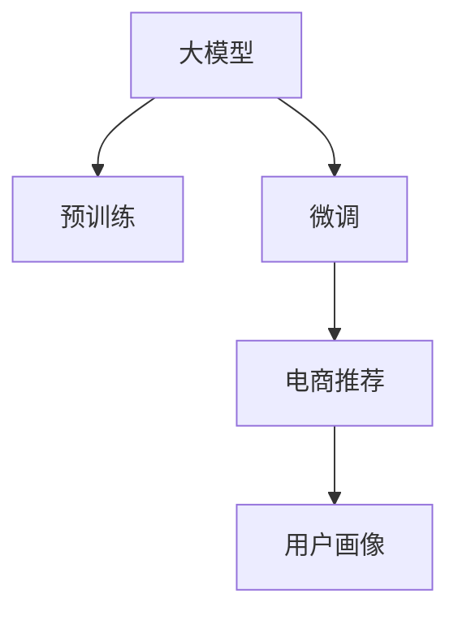

                 

# AI 大模型在电商搜索推荐中的用户画像应用：深度理解用户行为与偏好

> 关键词：用户画像，大模型，电商搜索，推荐系统，深度学习，自然语言处理，行为分析

## 1. 背景介绍

### 1.1 问题由来
随着电子商务的快速发展，各大电商平台面临的竞争日益激烈。用户对于商品搜索和推荐的需求日益个性化和多样化，如何在海量商品中快速精准地找到用户感兴趣的商品，成为电商平台需要解决的关键问题之一。

为了提高商品推荐的相关性和用户体验，各大电商平台纷纷投入巨资构建推荐系统，以深度学习和大模型为核心的推荐算法成为了主流。但是，深度学习模型的训练和优化通常需要大量的标注数据和计算资源，这对于小型电商企业来说成本较高。因此，如何在大规模无标注数据上预训练深度学习模型，并在电商搜索推荐场景中高效地应用大模型，成为电商技术创新的重要方向。

### 1.2 问题核心关键点
电商搜索推荐系统中的用户画像指的是通过对用户行为数据的深度分析，形成对用户兴趣、偏好和消费行为的精确刻画，从而帮助平台更好地为用户推荐商品。大模型在此过程中发挥着重要的作用，可以通过对海量文本数据的预训练，学习到语言中的语义和关联规则，并在微调后适配电商搜索推荐任务，提高推荐的个性化和精准性。

当前电商推荐系统主要面临以下挑战：
- 数据稀疏：电商用户行为数据相对较少，难以获得高质量的用户画像。
- 数据噪声：用户行为数据中可能包含不准确的标签，影响模型的训练和推理效果。
- 计算资源：大模型需要大量的计算资源进行预训练和微调，小型电商企业难以承受。

大模型在电商推荐中的应用主要包括以下几个方面：
- 预训练：在大规模文本数据上训练语言模型，学习语言的统计规律和语义信息。
- 微调：在电商推荐数据上对预训练模型进行微调，适配推荐任务，提升推荐效果。
- 用户画像：通过对用户行为数据进行建模，形成精准的用户画像，指导推荐系统的策略调整。
- 多模态融合：将文本、图像、标签等多模态数据进行融合，增强推荐系统的多样性和泛化能力。

### 1.3 问题研究意义
研究大模型在电商推荐中的用户画像应用，对于提升电商平台的推荐精准性、个性化，以及降低数据和计算成本，具有重要意义。通过深度学习模型和大模型的协同工作，可以在保障用户隐私的前提下，提供高质量的用户画像，并基于此形成更加贴合用户需求的推荐结果，提升用户满意度和电商平台的用户粘性。

此外，大模型在电商推荐中的应用，还可以为电商数据的管理和利用提供新的思路，推动电商平台的数字化转型，促进电商行业的健康可持续发展。

## 2. 核心概念与联系

### 2.1 核心概念概述

为了更好地理解大模型在电商搜索推荐中的应用，本节将介绍几个关键概念：

- 大模型(Large Model)：指使用大规模数据进行训练的深度学习模型，如BERT、GPT等。通过预训练学习到语言的通用表示，可以用于各种NLP任务，包括电商推荐。
- 预训练(Pre-training)：指在大规模无标注数据上训练模型，学习语言的通用表示和规则。预训练模型在大规模数据上的表现通常优于从头训练的模型。
- 微调(Fine-tuning)：指在预训练模型基础上，使用少量标注数据对模型进行适配，以提高在特定任务上的性能。微调是深度学习模型在大规模无标注数据上进行迁移学习的常见方法。
- 用户画像(User Profile)：指通过对用户行为数据的分析，形成对用户兴趣、偏好和消费行为的精准描述。用户画像可以用于指导推荐系统的策略调整和推荐结果优化。
- 推荐系统(Recommendation System)：指通过分析和理解用户需求，为其提供个性化推荐的系统。推荐系统广泛应用于电商、新闻、音乐等场景。

这些概念之间的关系可以用以下Mermaid流程图来表示：



这个流程图展示了从大模型的预训练到微调，再到电商推荐和用户画像的整个流程。

## 3. 核心算法原理 & 具体操作步骤
### 3.1 算法原理概述

基于深度学习的大模型在电商搜索推荐中的应用，主要分为预训练和微调两个阶段。预训练阶段使用大规模无标注数据训练语言模型，学习语言的通用表示。微调阶段在大规模无标注数据上训练的模型基础上，使用电商推荐数据进行微调，适配电商推荐任务，形成精准的用户画像，进而指导推荐系统的策略调整。

### 3.2 算法步骤详解

大模型在电商推荐中的应用主要包括以下几个关键步骤：

**Step 1: 准备预训练模型和数据集**
- 选择合适的预训练模型，如BERT、GPT等，作为电商推荐的初始化参数。
- 准备电商推荐数据集，包括用户行为数据、商品数据和标签数据。用户行为数据通常包括浏览、点击、购买、评价等行为记录，商品数据包括商品ID、价格、分类等属性，标签数据包括商品是否被用户购买或收藏等信息。

**Step 2: 模型预训练**
- 在电商推荐数据集上进行预训练。预训练的目的是学习商品描述与用户行为的关联规则，形成语言的统计规律和语义信息。预训练方法包括自监督学习、掩码语言模型等。

**Step 3: 微调模型**
- 在电商推荐数据集上对预训练模型进行微调。微调的目标是适配电商推荐任务，提高推荐效果的个性化和精准性。微调过程通常包括选择合适的优化器、学习率和正则化技术，以及设置微调数据集的划分方式。

**Step 4: 用户画像构建**
- 对电商推荐数据集中的用户行为数据进行建模，形成精准的用户画像。用户画像可以包括用户的兴趣标签、购买历史、浏览偏好等。

**Step 5: 推荐策略调整**
- 基于用户画像，调整电商推荐系统的推荐策略。推荐策略可以包括基于内容的推荐、协同过滤推荐、混合推荐等。

### 3.3 算法优缺点

基于大模型的电商推荐系统具有以下优点：
- 泛化能力强：大模型通过预训练学习到语言的通用表示，对新数据具有良好的泛化能力。
- 个性化推荐：微调后的模型能够更好地理解用户的兴趣和偏好，提供个性化的推荐结果。
- 高效训练：大模型可以使用GPU或TPU等高性能设备进行高效训练，缩短训练时间。

但是，基于大模型的电商推荐系统也存在以下缺点：
- 计算资源要求高：大模型的预训练和微调需要大量的计算资源和存储空间，小型电商企业难以承受。
- 用户隐私问题：电商推荐系统中涉及大量的用户行为数据，如何保护用户隐私和数据安全是一个重要问题。
- 模型解释性不足：大模型通常被视为“黑盒”模型，难以解释其内部的决策过程。

### 3.4 算法应用领域

基于大模型的电商推荐系统已经在多个电商平台上得到应用，包括亚马逊、京东、天猫等。以下是几个典型的应用场景：

**1. 用户画像**
- 用户画像可以通过电商推荐数据集中的用户行为数据进行建模，形成对用户兴趣、偏好和消费行为的精准描述。
- 用户画像可以用于指导推荐系统的策略调整，如增加用户感兴趣的商品的展示位置，减少不感兴趣的广告。

**2. 商品推荐**
- 基于用户画像，电商推荐系统可以提供个性化的商品推荐。例如，亚马逊的推荐系统可以根据用户的浏览和购买历史，推荐用户可能感兴趣的商品。
- 电商推荐系统还可以根据用户的地理位置、时间等特征，提供基于场景的推荐。例如，京东可以根据用户的购物时间和季节，推荐适合该季节的商品。

**3. 广告投放**
- 基于用户画像，电商推荐系统还可以为广告主提供个性化的广告投放服务。例如，亚马逊可以根据用户的兴趣和购买历史，推荐用户可能感兴趣的广告。
- 电商推荐系统还可以根据用户的地理位置、时间等特征，提供基于场景的广告投放。例如，京东可以根据用户的购物时间和季节，推荐适合该季节的广告。

此外，大模型在电商推荐中的应用还包括文本情感分析、商品评论分析等，帮助电商平台更好地理解用户的情感倾向和评价，优化推荐策略。

## 4. 数学模型和公式 & 详细讲解  
### 4.1 数学模型构建

在本节中，我们将使用数学语言对基于深度学习的大模型在电商推荐中的应用进行更加严格的刻画。

设电商推荐数据集为 $D=\{(x_i,y_i)\}_{i=1}^N$，其中 $x_i$ 为用户的浏览记录、点击记录等行为数据，$y_i$ 为电商推荐系统推荐的商品。假设大模型为 $M_{\theta}(x)$，其中 $\theta$ 为模型的参数。电商推荐任务的目标是最大化推荐的相关性，即最小化损失函数：

$$
\min_{\theta} \frac{1}{N}\sum_{i=1}^N \ell(y_i, M_{\theta}(x_i))
$$

其中 $\ell$ 为推荐系统的损失函数，通常使用均方误差损失或交叉熵损失。

### 4.2 公式推导过程

以下我们以均方误差损失为例，推导电商推荐任务的损失函数及其梯度计算公式。

假设电商推荐系统推荐商品的标签为 $y_i \in \{0,1\}$，其中 $y_i=1$ 表示推荐系统推荐了正确的商品，$y_i=0$ 表示推荐不正确。均方误差损失函数定义为：

$$
\ell(y_i, M_{\theta}(x_i)) = \frac{1}{2}(y_i - M_{\theta}(x_i))^2
$$

将其代入总损失函数，得：

$$
\mathcal{L}(\theta) = \frac{1}{N}\sum_{i=1}^N \frac{1}{2}(y_i - M_{\theta}(x_i))^2
$$

根据链式法则，损失函数对模型参数 $\theta$ 的梯度为：

$$
\frac{\partial \mathcal{L}(\theta)}{\partial \theta} = -\frac{1}{N}\sum_{i=1}^N (y_i - M_{\theta}(x_i)) M_{\theta}(x_i) \frac{\partial M_{\theta}(x_i)}{\partial \theta}
$$

其中 $\frac{\partial M_{\theta}(x_i)}{\partial \theta}$ 可进一步递归展开，利用自动微分技术完成计算。

### 4.3 案例分析与讲解

假设某电商平台的推荐系统使用了预训练的BERT模型进行微调，并在用户浏览历史数据上进行推荐。以下是具体实现过程：

**Step 1: 准备数据集**
- 收集用户浏览历史数据 $x_i$，包括浏览时间、浏览商品ID、浏览次数等。
- 收集电商推荐系统推荐的商品ID $y_i$。

**Step 2: 模型预训练**
- 使用BERT模型在大规模无标注数据上进行预训练，学习语言的通用表示。
- 在电商推荐数据集上进行微调，学习商品描述与用户行为的关联规则。

**Step 3: 用户画像构建**
- 对用户浏览历史数据 $x_i$ 进行建模，形成用户兴趣标签、购买历史等用户画像特征。
- 将用户画像特征输入到微调后的BERT模型中，得到用户的兴趣向量 $v_i$。

**Step 4: 推荐策略调整**
- 根据用户的兴趣向量 $v_i$ 和商品向量 $u_j$ 的相似度，计算推荐商品的概率分布。
- 选择概率最大的商品作为推荐结果。

## 5. 项目实践：代码实例和详细解释说明
### 5.1 开发环境搭建

在进行电商推荐系统开发前，我们需要准备好开发环境。以下是使用Python进行PyTorch开发的环境配置流程：

1. 安装Anaconda：从官网下载并安装Anaconda，用于创建独立的Python环境。

2. 创建并激活虚拟环境：
```bash
conda create -n pytorch-env python=3.8 
conda activate pytorch-env
```

3. 安装PyTorch：根据CUDA版本，从官网获取对应的安装命令。例如：
```bash
conda install pytorch torchvision torchaudio cudatoolkit=11.1 -c pytorch -c conda-forge
```

4. 安装其他必要的Python库：
```bash
pip install pandas numpy scikit-learn sklearn datasets
```

5. 安装BERT预训练模型：
```bash
pip install transformers
```

完成上述步骤后，即可在`pytorch-env`环境中开始电商推荐系统的开发。

### 5.2 源代码详细实现

以下是使用PyTorch和BERT模型构建电商推荐系统的代码实现：

```python
import torch
import pandas as pd
from transformers import BertForSequenceClassification, BertTokenizer

# 准备数据集
data = pd.read_csv('recommendation_data.csv')
x = data[['click_time', 'click_product_id', 'click_count']] # 用户浏览数据
y = data['recommended_product_id'] # 推荐商品ID

# 分训练集和验证集
train_data = x[:int(len(x)*0.8)]
valid_data = x[int(len(x)*0.8):]
train_labels = y[:int(len(y)*0.8)]
valid_labels = y[int(len(y)*0.8):]

# 构建模型
tokenizer = BertTokenizer.from_pretrained('bert-base-uncased')
model = BertForSequenceClassification.from_pretrained('bert-base-uncased', num_labels=1)

# 定义损失函数和优化器
criterion = torch.nn.BCEWithLogitsLoss()
optimizer = torch.optim.Adam(model.parameters(), lr=0.001)

# 训练模型
for epoch in range(10):
    model.train()
    for i in range(len(train_data)):
        inputs = tokenizer(train_data.iloc[i], padding='max_length', truncation=True, max_length=256)
        inputs = {key: torch.tensor(val) for key, val in inputs.items()}
        labels = torch.tensor(train_labels.iloc[i])
        outputs = model(**inputs)
        loss = criterion(outputs, labels)
        optimizer.zero_grad()
        loss.backward()
        optimizer.step()
    print(f'Epoch {epoch+1}, loss: {loss:.4f}')

# 在验证集上评估模型
model.eval()
with torch.no_grad():
    valid_outputs = model(torch.tensor(valid_data), padding='max_length', truncation=True, max_length=256)
    valid_loss = criterion(valid_outputs, torch.tensor(valid_labels))
    print(f'Validation loss: {valid_loss:.4f}')
```

在上述代码中，我们使用了BERT模型作为电商推荐系统中的深度学习模型。通过PyTorch和BERT库，可以快速搭建电商推荐系统的模型结构，并进行训练和评估。具体实现过程包括：

**Step 1: 准备数据集**
- 从CSV文件中读取电商推荐数据集，包括用户浏览数据和推荐商品ID。
- 将用户浏览数据和推荐商品ID划分为训练集和验证集。

**Step 2: 模型构建**
- 使用BERT模型的分词器对用户浏览数据进行分词，并将其转换为模型所需的输入。
- 构建BERT模型，并设置损失函数和优化器。

**Step 3: 模型训练**
- 在训练集上进行模型训练，使用Adam优化器进行参数更新。
- 在每个epoch后输出损失函数的值，以监控训练过程。

**Step 4: 模型评估**
- 在验证集上对模型进行评估，输出验证集的损失函数值。

### 5.3 代码解读与分析

以下是代码中几个关键部分的详细解读：

**分词器构建**
```python
tokenizer = BertTokenizer.from_pretrained('bert-base-uncased')
```

使用BertTokenizer对用户浏览数据进行分词，并将其转换为BERT模型所需的格式。

**模型构建**
```python
model = BertForSequenceClassification.from_pretrained('bert-base-uncased', num_labels=1)
```

构建BertForSequenceClassification模型，并指定标签数和输出维度。

**模型训练**
```python
for epoch in range(10):
    model.train()
    for i in range(len(train_data)):
        inputs = tokenizer(train_data.iloc[i], padding='max_length', truncation=True, max_length=256)
        inputs = {key: torch.tensor(val) for key, val in inputs.items()}
        labels = torch.tensor(train_labels.iloc[i])
        outputs = model(**inputs)
        loss = criterion(outputs, labels)
        optimizer.zero_grad()
        loss.backward()
        optimizer.step()
```

在每个epoch内，使用训练集中的数据进行模型训练，使用Adam优化器进行参数更新。

**模型评估**
```python
model.eval()
with torch.no_grad():
    valid_outputs = model(torch.tensor(valid_data), padding='max_length', truncation=True, max_length=256)
    valid_loss = criterion(valid_outputs, torch.tensor(valid_labels))
```

在验证集上对模型进行评估，输出验证集的损失函数值。

## 6. 实际应用场景
### 6.1 智能客服系统

基于大模型的电商推荐系统，可以应用于智能客服系统的构建。传统的客服系统需要配备大量人力，高峰期响应缓慢，且难以保证服务的质量。通过使用电商推荐系统中的用户画像，智能客服系统可以更好地理解用户的意图，并根据用户的历史行为进行推荐，提供更加个性化和高效的服务。

例如，在用户提问时，智能客服系统可以自动推荐最相关的商品和信息，提升用户满意度和问题解决效率。智能客服系统还可以根据用户的反馈进行学习和优化，逐步提高推荐系统的准确性和用户体验。

### 6.2 个性化推荐

基于电商推荐系统的用户画像，可以为每个用户提供个性化的商品推荐。推荐系统可以根据用户的兴趣、偏好和消费历史，生成个性化的商品推荐列表，提升用户的购物体验和满意度。

例如，在用户浏览商品时，推荐系统可以根据用户的历史浏览记录和购买行为，推荐用户可能感兴趣的商品，增加用户的停留时间和转化率。推荐系统还可以根据用户的地理位置、时间等特征，提供基于场景的推荐，提升用户的购物体验。

### 6.3 商品分类

基于电商推荐系统中的用户画像，还可以对商品进行分类和标签管理。电商推荐系统可以自动分析用户的浏览和购买行为，形成商品分类和标签，帮助电商平台进行商品的分类和展示。

例如，推荐系统可以根据用户的兴趣标签和购买历史，自动将商品分类，提升商品展示的个性化和相关性。电商平台可以根据推荐系统的分类结果，优化商品展示和推荐策略，提升用户体验和销售效果。

### 6.4 未来应用展望

随着大模型和电商推荐系统的不断发展，未来电商推荐系统将在更多领域得到应用，为电商平台的数字化转型提供新的思路。

1. 智能家居：电商推荐系统可以应用于智能家居设备的管理和推荐，为用户推荐适合其生活方式和习惯的智能设备。

2. 物流仓储：电商推荐系统可以应用于物流仓储的智能管理，根据用户订单的历史行为，推荐最适合的仓储和配送方案，提升物流效率和用户体验。

3. 金融理财：电商推荐系统可以应用于金融理财领域，根据用户的消费行为和偏好，推荐适合的金融产品和服务，提升用户理财的体验和效果。

4. 医疗健康：电商推荐系统可以应用于医疗健康领域，根据用户的健康数据和行为，推荐适合的医疗产品和服务，提升用户的健康管理和医疗体验。

未来，基于大模型的电商推荐系统将进一步拓展应用场景，为电商平台的数字化转型和智能化升级提供新的动力。

## 7. 工具和资源推荐
### 7.1 学习资源推荐

为了帮助开发者系统掌握大模型在电商推荐中的应用，这里推荐一些优质的学习资源：

1. 《深度学习与自然语言处理》课程：斯坦福大学开设的深度学习课程，涵盖深度学习和大模型的基本概念和应用，适合初学者学习。

2. 《自然语言处理综述》书籍：自然语言处理领域的经典教材，详细介绍了自然语言处理和深度学习的理论基础和最新进展。

3. 《Transformers: From Theory to Applications》书籍：Transformer库的作者所著，全面介绍了Transformer模型的原理和应用，包括电商推荐等NLP任务。

4. 《Natural Language Processing with Transformers》课程：Transformers库的官方教程，详细介绍了使用Transformer模型进行NLP任务开发的技术细节和方法。

5. CS224N《深度学习自然语言处理》课程：斯坦福大学开设的NLP明星课程，有Lecture视频和配套作业，适合深度学习和大模型的研究者学习。

通过对这些资源的学习实践，相信你一定能够快速掌握大模型在电商推荐中的应用，并用于解决实际的NLP问题。

### 7.2 开发工具推荐

高效的开发离不开优秀的工具支持。以下是几款用于大模型在电商推荐系统开发中常用的工具：

1. PyTorch：基于Python的开源深度学习框架，灵活动态的计算图，适合快速迭代研究。

2. TensorFlow：由Google主导开发的开源深度学习框架，生产部署方便，适合大规模工程应用。

3. Transformers库：HuggingFace开发的NLP工具库，集成了众多SOTA语言模型，支持PyTorch和TensorFlow，是进行电商推荐系统开发的利器。

4. Weights & Biases：模型训练的实验跟踪工具，可以记录和可视化模型训练过程中的各项指标，方便对比和调优。

5. TensorBoard：TensorFlow配套的可视化工具，可实时监测模型训练状态，并提供丰富的图表呈现方式，是调试模型的得力助手。

合理利用这些工具，可以显著提升电商推荐系统的开发效率，加快创新迭代的步伐。

### 7.3 相关论文推荐

大模型在电商推荐系统中的应用源于学界的持续研究。以下是几篇奠基性的相关论文，推荐阅读：

1. Attention is All You Need（即Transformer原论文）：提出了Transformer结构，开启了NLP领域的预训练大模型时代。

2. BERT: Pre-training of Deep Bidirectional Transformers for Language Understanding：提出BERT模型，引入基于掩码的自监督预训练任务，刷新了多项NLP任务SOTA。

3. Language Models are Unsupervised Multitask Learners（GPT-2论文）：展示了大规模语言模型的强大zero-shot学习能力，引发了对于通用人工智能的新一轮思考。

4. Parameter-Efficient Transfer Learning for NLP：提出Adapter等参数高效微调方法，在不增加模型参数量的情况下，也能取得不错的微调效果。

5. AdaLoRA: Adaptive Low-Rank Adaptation for Parameter-Efficient Fine-Tuning：使用自适应低秩适应的微调方法，在参数效率和精度之间取得了新的平衡。

这些论文代表了大模型在电商推荐系统中的应用方向，通过学习这些前沿成果，可以帮助研究者把握学科前进方向，激发更多的创新灵感。

## 8. 总结：未来发展趋势与挑战
### 8.1 研究成果总结

本文对大模型在电商推荐中的应用进行了全面系统的介绍。首先阐述了大模型和电商推荐系统的研究背景和意义，明确了电商推荐系统在大模型微调中的独特价值。其次，从原理到实践，详细讲解了大模型在电商推荐中的应用过程，给出了电商推荐系统的完整代码实现。同时，本文还探讨了电商推荐系统在大模型微调中的应用场景，展示了电商推荐系统的广泛应用前景。

通过本文的系统梳理，可以看到，基于大模型的电商推荐系统已经在多个电商平台上得到应用，并在智能客服、个性化推荐、商品分类等多个领域展现出了强大的应用潜力。大模型在电商推荐中的应用，推动了电商平台的数字化转型，提升了用户的购物体验和满意度。

### 8.2 未来发展趋势

展望未来，大模型在电商推荐中的应用将呈现以下几个发展趋势：

1. 模型规模持续增大：随着算力成本的下降和数据规模的扩张，预训练语言模型的参数量还将持续增长。超大规模语言模型蕴含的丰富语言知识，有望支撑更加复杂多变的电商推荐任务。

2. 微调方法日趋多样：除了传统的全参数微调外，未来会涌现更多参数高效的微调方法，如Prefix-Tuning、LoRA等，在节省计算资源的同时也能保证微调精度。

3. 持续学习成为常态：随着电商推荐数据的不断变化，微调模型也需要持续学习新知识以保持性能。如何在不遗忘原有知识的同时，高效吸收新样本信息，将成为重要的研究课题。

4. 标注样本需求降低：受启发于提示学习(Prompt-based Learning)的思路，未来的电商推荐系统将更好地利用大模型的语言理解能力，通过更加巧妙的任务描述，在更少的标注样本上也能实现理想的电商推荐效果。

5. 多模态微调崛起：将文本、图像、标签等多模态数据进行融合，增强电商推荐系统的多样性和泛化能力。多模态信息的融合，将显著提升大模型在电商推荐中的表现。

6. 模型通用性增强：经过海量数据的预训练和多领域任务的微调，未来的电商推荐系统将具备更强大的常识推理和跨领域迁移能力，逐步迈向通用人工智能(AGI)的目标。

以上趋势凸显了大模型在电商推荐中的应用前景。这些方向的探索发展，必将进一步提升电商推荐系统的性能和应用范围，为电商平台的数字化转型提供新的动力。

### 8.3 面临的挑战

尽管大模型在电商推荐中的应用已经取得了一定的进展，但在迈向更加智能化、普适化应用的过程中，它仍面临诸多挑战：

1. 数据稀疏：电商推荐系统中涉及大量的用户行为数据，但数据相对较少，难以获得高质量的用户画像。如何从有限的标注数据中提取有效的用户信息，是一个重要问题。

2. 数据噪声：用户行为数据中可能包含不准确的标签，影响模型的训练和推理效果。如何过滤和处理数据噪声，提高模型的鲁棒性，是一个亟待解决的问题。

3. 计算资源要求高：大模型的预训练和微调需要大量的计算资源和存储空间，小型电商企业难以承受。如何优化计算图和模型结构，减少计算资源消耗，是一个重要的研究方向。

4. 用户隐私问题：电商推荐系统中涉及大量的用户行为数据，如何保护用户隐私和数据安全是一个重要问题。

5. 模型解释性不足：大模型通常被视为“黑盒”模型，难以解释其内部的决策过程。如何赋予大模型更强的可解释性，将是亟待攻克的难题。

6. 知识整合能力不足：现有的电商推荐系统往往局限于任务内数据，难以灵活吸收和运用更广泛的先验知识。如何让大模型更好地与外部知识库、规则库等专家知识结合，形成更加全面、准确的信息整合能力，还有很大的想象空间。

正视电商推荐系统面临的这些挑战，积极应对并寻求突破，将是大模型在电商推荐系统中的重要发展方向。相信随着学界和产业界的共同努力，这些挑战终将一一被克服，大模型在电商推荐系统中的应用必将在未来取得更大的突破。

### 8.4 研究展望

面对大模型在电商推荐系统中的应用挑战，未来的研究需要在以下几个方面寻求新的突破：

1. 探索无监督和半监督电商推荐方法：摆脱对大规模标注数据的依赖，利用自监督学习、主动学习等无监督和半监督范式，最大限度利用非结构化数据，实现更加灵活高效的电商推荐。

2. 研究参数高效和计算高效的电商推荐范式：开发更加参数高效的电商推荐方法，在固定大部分预训练参数的情况下，只更新极少量的任务相关参数。同时优化电商推荐系统的计算图，减少前向传播和反向传播的资源消耗，实现更加轻量级、实时性的部署。

3. 融合因果和对比学习范式：通过引入因果推断和对比学习思想，增强电商推荐模型建立稳定因果关系的能力，学习更加普适、鲁棒的语言表征，从而提升模型泛化性和抗干扰能力。

4. 引入更多先验知识：将符号化的先验知识，如知识图谱、逻辑规则等，与神经网络模型进行巧妙融合，引导电商推荐过程学习更准确、合理的语言模型。同时加强多模态数据的整合，实现视觉、语音等多模态信息与文本信息的协同建模。

5. 结合因果分析和博弈论工具：将因果分析方法引入电商推荐模型，识别出模型决策的关键特征，增强输出解释的因果性和逻辑性。借助博弈论工具刻画人机交互过程，主动探索并规避模型的脆弱点，提高系统稳定性。

6. 纳入伦理道德约束：在电商推荐系统的训练目标中引入伦理导向的评估指标，过滤和惩罚有偏见、有害的输出倾向。同时加强人工干预和审核，建立模型行为的监管机制，确保输出符合人类价值观和伦理道德。

这些研究方向将引领大模型在电商推荐系统中的应用走向更高的台阶，为构建安全、可靠、可解释、可控的智能系统提供新的思路。面向未来，大模型在电商推荐系统中的应用还需要与其他人工智能技术进行更深入的融合，如知识表示、因果推理、强化学习等，多路径协同发力，共同推动电商平台的数字化转型。

## 9. 附录：常见问题与解答

**Q1: 电商推荐系统中大模型微调的效果如何？**

A: 大模型在电商推荐中的应用效果显著。通过在大规模无标注数据上进行预训练，学习到语言的通用表示，大模型在微调后能够更好地适应电商推荐任务，提高推荐的相关性和个性化。通过用户画像的构建和微调，电商推荐系统可以为用户提供更加精准的商品推荐，提升用户体验和满意度。

**Q2: 电商推荐系统中大模型微调需要哪些数据？**

A: 电商推荐系统中大模型微调需要大量的用户行为数据，包括用户的浏览记录、点击记录、购买记录等。这些数据可以用来构建用户画像，指导电商推荐系统的策略调整。此外，还需要电商推荐系统推荐商品的真实数据，用于微调模型的训练。

**Q3: 电商推荐系统中大模型微调如何处理数据噪声？**

A: 电商推荐系统中大模型微调需要对数据噪声进行处理，以提高模型的鲁棒性。常用的处理方式包括：
1. 数据清洗：删除或修正数据中的异常值和错误数据。
2. 数据增强：使用数据增强技术，如回译、近义替换等，扩充训练集，减少数据噪声的影响。
3. 正则化：使用L2正则、Dropout等技术，防止模型过拟合，提高模型的泛化能力。

**Q4: 电商推荐系统中大模型微调如何使用用户画像？**

A: 电商推荐系统中大模型微调可以使用用户画像指导推荐策略的调整。用户画像可以包括用户的兴趣标签、购买历史、浏览偏好等，这些信息可以用来计算商品与用户之间的相似度，生成个性化的推荐结果。例如，推荐系统可以根据用户的兴趣标签和购买历史，推荐用户可能感兴趣的商品，提升用户的购物体验。

**Q5: 电商推荐系统中大模型微调如何应对计算资源限制？**

A: 电商推荐系统中大模型微调需要大量的计算资源和存储空间，小型电商企业难以承受。为应对计算资源限制，可以采用以下措施：
1. 参数裁剪：裁剪不必要的层和参数，减小模型尺寸，加快推理速度。
2. 量化加速：将浮点模型转为定点模型，压缩存储空间，提高计算效率。
3. 模型并行：采用模型并行技术，将大模型拆分成多个子模型，在多个设备上进行并行计算，提高计算效率。
4. 混合精度训练：使用混合精度训练技术，将浮点计算和定点计算相结合，减少计算资源消耗。

通过以上措施，可以在保证推荐效果的前提下，减少计算资源消耗，实现电商推荐系统的轻量化和实时性。

---

作者：禅与计算机程序设计艺术 / Zen and the Art of Computer Programming

