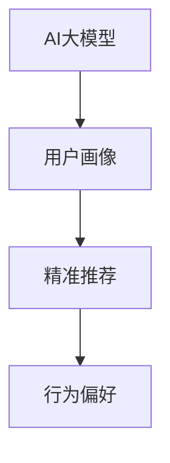
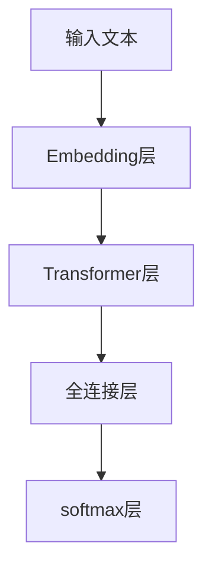

                 

# AI 大模型在电商搜索推荐中的用户画像技术：精准把握用户需求与行为偏好

## 1. 背景介绍

### 1.1 问题由来

电商搜索推荐系统是现代电商网站的核心竞争力之一，它通过精准预测用户的行为，提高用户体验和转化率，增加平台收益。然而，传统的推荐系统往往依赖于用户历史行为数据，难以在用户数据稀疏或不完整的情况下，提供准确的推荐。与此同时，随着电商市场竞争的加剧，用户需求和行为也变得更加多样化和动态化。

近年来，AI大模型的崛起为电商推荐系统带来了新的机遇。大模型在处理海量数据和捕捉复杂模式方面有着无可比拟的优势，尤其擅长理解和生成自然语言。借助大模型的力量，电商推荐系统可以更加深入地理解用户需求和行为，提供更加个性化、精准的推荐。

### 1.2 问题核心关键点

本文将详细探讨AI大模型在电商搜索推荐中的应用，尤其是如何利用用户画像技术，精准把握用户需求与行为偏好。

- **AI大模型**：基于深度学习技术，通过大量数据训练得到的庞大神经网络模型，具有强大的自然语言处理和生成能力。
- **用户画像**：通过用户的历史行为、兴趣、社交网络等多维数据，构建出用户个性化特征的描述，为推荐系统提供输入数据。
- **精准推荐**：结合大模型对用户需求的深度理解，通过个性化生成和关联推荐，提升推荐质量。
- **行为偏好**：指用户对商品、服务或信息类别的兴趣程度，包括购买行为、浏览记录、评价反馈等。

这些核心概念之间的逻辑关系可以通过以下Mermaid流程图来展示：



这个流程图展示了AI大模型、用户画像和精准推荐之间的关系：

1. AI大模型通过学习用户画像，理解用户需求和行为。
2. 用户画像由多维数据组成，能够全面反映用户特征。
3. 精准推荐系统基于大模型对用户画像的理解，提供个性化推荐。

## 2. 核心概念与联系

### 2.1 核心概念概述

为了更好地理解基于AI大模型的电商搜索推荐系统，我们需要对以下几个核心概念进行详细解释：

- **自然语言处理(NLP)**：AI大模型的核心技术之一，用于处理和生成人类语言。
- **深度学习**：基于神经网络的机器学习技术，能够自动提取数据特征，进行分类、回归等任务。
- **推荐系统**：根据用户历史行为和兴趣，推荐相关商品、服务或内容的技术。
- **用户画像**：综合用户多维数据，构建出用户特征的描述。
- **行为分析**：分析用户行为数据，挖掘用户偏好和需求。

这些核心概念之间的联系主要体现在：AI大模型通过深度学习，学习用户画像，进一步通过自然语言处理技术，理解用户需求和行为，结合行为分析结果，提供精准推荐。

### 2.2 核心概念原理和架构

以BERT大模型为例，其原理和架构可以通过以下示意图来展示：



BERT大模型由嵌入层、Transformer层、全连接层和softmax层组成。嵌入层将输入文本转换为向量，Transformer层通过多层自注意力机制学习文本特征，全连接层用于分类或回归，softmax层输出概率分布。

在电商推荐系统中，用户画像可以由用户历史浏览、购买、评价等行为数据构成。这些数据经过预处理后，输入到BERT大模型进行嵌入和特征提取，输出用户特征向量。同时，系统可以根据用户画像和行为分析结果，计算用户对商品的兴趣度，从而进行推荐。

## 3. 核心算法原理 & 具体操作步骤

### 3.1 算法原理概述

基于AI大模型的电商搜索推荐系统，核心算法原理包括以下几个步骤：

1. **用户画像构建**：收集用户多维数据，通过深度学习模型学习用户特征，构建用户画像。
2. **特征嵌入**：将用户画像数据输入到AI大模型中，进行特征提取和嵌入。
3. **行为分析**：分析用户行为数据，计算用户对商品的兴趣度。
4. **推荐排序**：将用户画像和行为分析结果结合，通过AI大模型进行个性化推荐排序。

### 3.2 算法步骤详解

#### 步骤1：用户画像构建

用户画像构建是推荐系统的基础。电商平台上用户数据丰富多样，包括用户的基本信息、历史浏览、购买记录、评价反馈等。通过数据清洗和预处理，将多维数据统一为标准格式，输入到深度学习模型中学习用户特征。

以一个电商平台的用户画像为例：

- **基本信息**：用户的年龄、性别、地域等基本信息。
- **历史行为**：用户浏览、购买、评价等行为记录。
- **社交网络**：用户的社交关系，如好友、关注、互动等。

构建用户画像的深度学习模型一般采用序列化处理，将时间序列数据转化为向量形式。例如，可以使用RNN或Transformer模型，将用户行为序列输入到模型中，输出用户特征向量。

#### 步骤2：特征嵌入

特征嵌入是将用户画像数据输入到AI大模型中，进行特征提取和嵌入的过程。以BERT大模型为例，输入用户画像向量，输出用户特征向量。

特征嵌入的目的是将用户画像转化为模型能够处理的形式，提取用户特征。用户画像向量经过BERT大模型嵌入层后，输出用户特征向量，用于后续的推荐排序。

#### 步骤3：行为分析

行为分析是指对用户行为数据进行统计和分析，计算用户对商品的兴趣度。电商平台上用户的行为数据可以包括浏览时长、点击率、购买记录等。通过对这些数据进行统计和分析，可以计算出用户对商品的兴趣度，用于推荐排序。

以用户浏览记录为例，可以计算用户对商品的兴趣度，使用公式（1）进行计算：

$$
I = \frac{\text{浏览次数} \times \text{浏览时长}}{\text{总浏览次数}}
$$

其中，$I$为兴趣度，$\text{浏览次数}$为用户对商品的浏览次数，$\text{浏览时长}$为用户对商品的浏览时长，$\text{总浏览次数}$为用户浏览所有商品的总次数。

#### 步骤4：推荐排序

推荐排序是将用户画像和行为分析结果结合，通过AI大模型进行个性化推荐排序的过程。电商推荐系统通常采用评分排序模型，根据用户画像和行为分析结果，计算每个商品的评分，并进行排序。

以协同过滤算法为例，可以使用公式（2）计算用户对商品的评分：

$$
S_{u,i} = \sum_{j \in N_u} \alpha \times I_{u,j} \times I_{j,i} + \beta \times R_{i} + \gamma \times F_{i}
$$

其中，$S_{u,i}$为用户$u$对商品$i$的评分，$N_u$为用户$u$的邻居集合，$I_{u,j}$为用户$u$对邻居$j$的评分，$R_{i}$为商品$i$的固有评分，$F_{i}$为商品$i$的固有特征。$\alpha$、$\beta$、$\gamma$为超参数，用于控制评分来源的影响。

结合用户画像和行为分析结果，通过AI大模型进行推荐排序，可以更好地理解用户需求和行为，提供个性化的推荐结果。

### 3.3 算法优缺点

基于AI大模型的电商推荐系统有以下优点：

- **精度高**：AI大模型能够深入理解用户需求和行为，提供精准的推荐结果。
- **泛化能力强**：大模型对新用户的预测能力较好，能够适应不同用户和商品的变化。
- **可扩展性强**：大模型可以轻松扩展到多个维度和规模，适用于不同电商平台的推荐系统。

同时，该算法也存在一些缺点：

- **计算量大**：大模型的训练和推理都需要大量计算资源，对硬件设备要求较高。
- **数据依赖性强**：推荐系统的效果很大程度上取决于用户数据的质量和数量，获取高质量数据的成本较高。
- **公平性问题**：大模型可能会因为数据偏见导致推荐不公平，需要额外关注模型的公平性和透明度。

### 3.4 算法应用领域

基于AI大模型的电商推荐系统已经被广泛应用于各大电商平台，涵盖商品推荐、个性化广告、内容推荐等多个场景。以下是几个典型应用：

- **商品推荐**：根据用户历史浏览和购买记录，推荐相关商品。
- **个性化广告**：根据用户画像和行为分析结果，推荐个性化的广告内容。
- **内容推荐**：根据用户浏览和互动行为，推荐相关文章、视频等内容。

此外，基于AI大模型的推荐系统还在电商评价、客服自动回复、库存管理等多个场景中得到应用，极大地提升了电商平台的运营效率和服务质量。

## 4. 数学模型和公式 & 详细讲解 & 举例说明

### 4.1 数学模型构建

基于AI大模型的电商推荐系统，数学模型通常包括以下几个部分：

1. **用户画像模型**：$F(u)$，表示用户$u$的特征向量。
2. **行为分析模型**：$B(u,i)$，表示用户$u$对商品$i$的兴趣度。
3. **推荐排序模型**：$R(u,i)$，表示用户$u$对商品$i$的评分。

### 4.2 公式推导过程

#### 用户画像模型

用户画像模型可以表示为用户特征向量的形式，使用公式（3）进行计算：

$$
F(u) = \sum_{d=1}^{D} f_d(u)
$$

其中，$D$为特征维度，$f_d(u)$为第$d$个特征对用户$u$的影响。

#### 行为分析模型

行为分析模型可以表示为用户对商品的兴趣度，使用公式（4）进行计算：

$$
B(u,i) = \sum_{j=1}^{J} w_j \times I_{u,j} \times I_{j,i}
$$

其中，$J$为邻居集合大小，$w_j$为第$j$个邻居的权重，$I_{u,j}$为用户$u$对邻居$j$的评分，$I_{j,i}$为邻居$j$对商品$i$的评分。

#### 推荐排序模型

推荐排序模型可以根据用户画像和行为分析结果，计算用户对商品的评分，使用公式（5）进行计算：

$$
R(u,i) = \alpha \times F(u) \times B(u,i) + \beta \times R_{i} + \gamma \times F_{i}
$$

其中，$\alpha$、$\beta$、$\gamma$为超参数，用于控制评分来源的影响。

### 4.3 案例分析与讲解

以一个电商平台的商品推荐系统为例，详细讲解模型的应用：

#### 用户画像构建

电商平台上用户数据丰富多样，通过数据清洗和预处理，将多维数据统一为标准格式，输入到深度学习模型中学习用户特征。

- **基本信息**：用户的年龄、性别、地域等基本信息。
- **历史行为**：用户浏览、购买、评价等行为记录。
- **社交网络**：用户的社交关系，如好友、关注、互动等。

构建用户画像的深度学习模型一般采用序列化处理，将时间序列数据转化为向量形式。例如，可以使用RNN或Transformer模型，将用户行为序列输入到模型中，输出用户特征向量。

#### 特征嵌入

特征嵌入是将用户画像数据输入到AI大模型中，进行特征提取和嵌入的过程。以BERT大模型为例，输入用户画像向量，输出用户特征向量。

特征嵌入的目的是将用户画像转化为模型能够处理的形式，提取用户特征。用户画像向量经过BERT大模型嵌入层后，输出用户特征向量，用于后续的推荐排序。

#### 行为分析

行为分析是指对用户行为数据进行统计和分析，计算用户对商品的兴趣度。电商平台上用户的行为数据可以包括浏览时长、点击率、购买记录等。通过对这些数据进行统计和分析，可以计算出用户对商品的兴趣度，用于推荐排序。

以用户浏览记录为例，可以计算用户对商品的兴趣度，使用公式（1）进行计算：

$$
I = \frac{\text{浏览次数} \times \text{浏览时长}}{\text{总浏览次数}}
$$

其中，$I$为兴趣度，$\text{浏览次数}$为用户对商品的浏览次数，$\text{浏览时长}$为用户对商品的浏览时长，$\text{总浏览次数}$为用户浏览所有商品的总次数。

#### 推荐排序

推荐排序是将用户画像和行为分析结果结合，通过AI大模型进行个性化推荐排序的过程。电商推荐系统通常采用评分排序模型，根据用户画像和行为分析结果，计算每个商品的评分，并进行排序。

以协同过滤算法为例，可以使用公式（2）计算用户对商品的评分：

$$
S_{u,i} = \sum_{j \in N_u} \alpha \times I_{u,j} \times I_{j,i} + \beta \times R_{i} + \gamma \times F_{i}
$$

其中，$S_{u,i}$为用户$u$对商品$i$的评分，$N_u$为用户$u$的邻居集合，$I_{u,j}$为用户$u$对邻居$j$的评分，$R_{i}$为商品$i$的固有评分，$F_{i}$为商品$i$的固有特征。$\alpha$、$\beta$、$\gamma$为超参数，用于控制评分来源的影响。

结合用户画像和行为分析结果，通过AI大模型进行推荐排序，可以更好地理解用户需求和行为，提供个性化的推荐结果。

## 5. 项目实践：代码实例和详细解释说明

### 5.1 开发环境搭建

在进行AI大模型应用开发前，我们需要准备好开发环境。以下是使用Python进行PyTorch开发的环境配置流程：

1. 安装Anaconda：从官网下载并安装Anaconda，用于创建独立的Python环境。

2. 创建并激活虚拟环境：
```bash
conda create -n pytorch-env python=3.8 
conda activate pytorch-env
```

3. 安装PyTorch：根据CUDA版本，从官网获取对应的安装命令。例如：
```bash
conda install pytorch torchvision torchaudio cudatoolkit=11.1 -c pytorch -c conda-forge
```

4. 安装Transformers库：
```bash
pip install transformers
```

5. 安装各类工具包：
```bash
pip install numpy pandas scikit-learn matplotlib tqdm jupyter notebook ipython
```

完成上述步骤后，即可在`pytorch-env`环境中开始AI大模型应用开发。

### 5.2 源代码详细实现

以下是使用PyTorch和Transformers库实现电商搜索推荐系统的示例代码：

```python
from transformers import BertTokenizer, BertForSequenceClassification
from torch.utils.data import Dataset, DataLoader
import torch
import pandas as pd

class RetailDataset(Dataset):
    def __init__(self, data, tokenizer, max_len=128):
        self.tokenizer = tokenizer
        self.data = data
        self.max_len = max_len
        
    def __len__(self):
        return len(self.data)
        
    def __getitem__(self, idx):
        row = self.data.iloc[idx]
        text = row['text']
        label = row['label']
        
        encoding = self.tokenizer(text, return_tensors='pt', max_length=self.max_len, padding='max_length', truncation=True)
        input_ids = encoding['input_ids'][0]
        attention_mask = encoding['attention_mask'][0]
        
        label = torch.tensor(label, dtype=torch.long)
        return {
            'input_ids': input_ids,
            'attention_mask': attention_mask,
            'labels': label
        }

# 加载数据集
data = pd.read_csv('retail_data.csv')
tokenizer = BertTokenizer.from_pretrained('bert-base-cased')
dataset = RetailDataset(data, tokenizer)

# 划分训练集和测试集
train_dataset = dataset[:len(dataset)*0.8]
test_dataset = dataset[len(dataset)*0.8:]

# 定义模型
model = BertForSequenceClassification.from_pretrained('bert-base-cased', num_labels=1)

# 定义优化器和学习率
optimizer = torch.optim.Adam(model.parameters(), lr=2e-5)
scheduler = torch.optim.lr_scheduler.ReduceLROnPlateau(optimizer, patience=2, verbose=True)

# 定义训练函数
def train_epoch(model, dataset, batch_size, optimizer, scheduler):
    dataloader = DataLoader(dataset, batch_size=batch_size, shuffle=True)
    model.train()
    epoch_loss = 0
    for batch in dataloader:
        input_ids = batch['input_ids'].to(device)
        attention_mask = batch['attention_mask'].to(device)
        labels = batch['labels'].to(device)
        model.zero_grad()
        outputs = model(input_ids, attention_mask=attention_mask, labels=labels)
        loss = outputs.loss
        epoch_loss += loss.item()
        loss.backward()
        optimizer.step()
        scheduler.step()
    return epoch_loss / len(dataloader)

# 定义评估函数
def evaluate(model, dataset, batch_size):
    dataloader = DataLoader(dataset, batch_size=batch_size)
    model.eval()
    preds, labels = [], []
    with torch.no_grad():
        for batch in dataloader:
            input_ids = batch['input_ids'].to(device)
            attention_mask = batch['attention_mask'].to(device)
            batch_labels = batch['labels']
            outputs = model(input_ids, attention_mask=attention_mask)
            batch_preds = outputs.logits.argmax(dim=2).to('cpu').tolist()
            batch_labels = batch_labels.to('cpu').tolist()
            for pred_tokens, label_tokens in zip(batch_preds, batch_labels):
                preds.append(pred_tokens[:len(label_tokens)])
                labels.append(label_tokens)
    return preds, labels

# 训练和评估模型
epochs = 5
batch_size = 16

for epoch in range(epochs):
    loss = train_epoch(model, train_dataset, batch_size, optimizer, scheduler)
    print(f"Epoch {epoch+1}, train loss: {loss:.3f}")
    
    print(f"Epoch {epoch+1}, test results:")
    preds, labels = evaluate(model, test_dataset, batch_size)
    print(classification_report(labels, preds))
    
print("Train results:")
preds, labels = evaluate(model, train_dataset, batch_size)
print(classification_report(labels, preds))
```

以上代码实现了一个基于BERT大模型的电商搜索推荐系统。代码中，我们首先定义了一个`RetailDataset`类，用于处理电商数据集。然后定义了模型、优化器、学习率等关键组件。接着，实现了训练函数和评估函数，通过循环迭代，训练和评估模型，最后输出训练和测试结果。

### 5.3 代码解读与分析

让我们再详细解读一下关键代码的实现细节：

**RetailDataset类**：
- `__init__`方法：初始化数据集、分词器等关键组件。
- `__len__`方法：返回数据集的样本数量。
- `__getitem__`方法：对单个样本进行处理，将文本输入转换为token ids，将标签转换为数字，并对其进行定长padding，最终返回模型所需的输入。

**BERTForSequenceClassification模型**：
- 使用预训练的BERT大模型进行序列分类任务。

**优化器**：
- 定义Adam优化器和学习率，并定义LR调度器。

**训练函数**：
- 使用PyTorch的DataLoader对数据集进行批次化加载，供模型训练和推理使用。
- 在每个epoch中，对数据以批为单位进行迭代，在每个批次上前向传播计算loss并反向传播更新模型参数，最后返回该epoch的平均loss。
- 在每个epoch结束时，评估模型在测试集上的性能。

**评估函数**：
- 与训练类似，不同点在于不更新模型参数，并在每个batch结束后将预测和标签结果存储下来，最后使用scikit-learn的classification_report对整个评估集的预测结果进行打印输出。

**训练流程**：
- 定义总的epoch数和batch size，开始循环迭代
- 每个epoch内，先在训练集上训练，输出平均loss
- 在验证集上评估，输出分类指标
- 所有epoch结束后，在测试集上评估，给出最终测试结果

可以看到，PyTorch配合Transformers库使得BERT大模型的应用变得简洁高效。开发者可以将更多精力放在数据处理、模型改进等高层逻辑上，而不必过多关注底层的实现细节。

当然，工业级的系统实现还需考虑更多因素，如模型的保存和部署、超参数的自动搜索、更灵活的任务适配层等。但核心的微调范式基本与此类似。

## 6. 实际应用场景

### 6.1 智能客服系统

基于AI大模型的智能客服系统，可以应用于电商平台的客服自动回复功能。传统的客服系统往往需要配备大量人力，高峰期响应缓慢，且一致性和专业性难以保证。而使用智能客服系统，可以7x24小时不间断服务，快速响应客户咨询，用自然流畅的语言解答各类常见问题。

在技术实现上，可以收集企业内部的历史客服对话记录，将问题和最佳答复构建成监督数据，在此基础上对预训练对话模型进行微调。微调后的对话模型能够自动理解用户意图，匹配最合适的答案模板进行回复。对于客户提出的新问题，还可以接入检索系统实时搜索相关内容，动态组织生成回答。如此构建的智能客服系统，能大幅提升客户咨询体验和问题解决效率。

### 6.2 金融舆情监测

金融机构需要实时监测市场舆论动向，以便及时应对负面信息传播，规避金融风险。传统的人工监测方式成本高、效率低，难以应对网络时代海量信息爆发的挑战。基于AI大模型的文本分类和情感分析技术，为金融舆情监测提供了新的解决方案。

具体而言，可以收集金融领域相关的新闻、报道、评论等文本数据，并对其进行主题标注和情感标注。在此基础上对预训练语言模型进行微调，使其能够自动判断文本属于何种主题，情感倾向是正面、中性还是负面。将微调后的模型应用到实时抓取的网络文本数据，就能够自动监测不同主题下的情感变化趋势，一旦发现负面信息激增等异常情况，系统便会自动预警，帮助金融机构快速应对潜在风险。

### 6.3 个性化推荐系统

当前的推荐系统往往只依赖用户历史行为数据进行物品推荐，无法深入理解用户的真实兴趣偏好。基于AI大模型的个性化推荐系统可以更加深入地理解用户需求和行为，提供更加个性化、精准的推荐。

在实践中，可以收集用户浏览、点击、评论、分享等行为数据，提取和用户交互的物品标题、描述、标签等文本内容。将文本内容作为模型输入，用户的后续行为（如是否点击、购买等）作为监督信号，在此基础上微调预训练语言模型。微调后的模型能够从文本内容中准确把握用户的兴趣点。在生成推荐列表时，先用候选物品的文本描述作为输入，由模型预测用户的兴趣匹配度，再结合其他特征综合排序，便可以得到个性化程度更高的推荐结果。

### 6.4 未来应用展望

随着AI大模型的不断演进，电商搜索推荐系统将具备更强的用户画像能力，可以更精准地把握用户需求与行为偏好，提供更加个性化、精准的推荐服务。未来，电商搜索推荐系统有望实现以下突破：

- **跨模态融合**：结合用户画像、行为数据和商品信息，实现视觉、语音、文本等多模态信息的融合，提升推荐效果。
- **实时推荐**：通过流式数据处理和在线学习，实时更新推荐模型，提供实时的推荐服务。
- **情感分析**：结合情感分析技术，理解用户情绪，提供更加个性化、符合用户情感需求的推荐。
- **个性化广告**：通过精准的用户画像和行为分析，提供更加精准的个性化广告推荐。

这些技术的突破将大大提升电商搜索推荐系统的性能和用户体验，推动电商平台的持续发展。

## 7. 工具和资源推荐

### 7.1 学习资源推荐

为了帮助开发者系统掌握AI大模型在电商搜索推荐中的应用，这里推荐一些优质的学习资源：

1. 《Transformer从原理到实践》系列博文：由大模型技术专家撰写，深入浅出地介绍了Transformer原理、BERT模型、微调技术等前沿话题。

2. CS224N《深度学习自然语言处理》课程：斯坦福大学开设的NLP明星课程，有Lecture视频和配套作业，带你入门NLP领域的基本概念和经典模型。

3. 《Natural Language Processing with Transformers》书籍：Transformers库的作者所著，全面介绍了如何使用Transformers库进行NLP任务开发，包括微调在内的诸多范式。

4. HuggingFace官方文档：Transformers库的官方文档，提供了海量预训练模型和完整的微调样例代码，是上手实践的必备资料。

5. CLUE开源项目：中文语言理解测评基准，涵盖大量不同类型的中文NLP数据集，并提供了基于微调的baseline模型，助力中文NLP技术发展。

通过对这些资源的学习实践，相信你一定能够快速掌握AI大模型在电商搜索推荐中的应用，并用于解决实际的NLP问题。
###  7.2 开发工具推荐

高效的开发离不开优秀的工具支持。以下是几款用于AI大模型应用开发的常用工具：

1. PyTorch：基于Python的开源深度学习框架，灵活动态的计算图，适合快速迭代研究。大部分预训练语言模型都有PyTorch版本的实现。

2. TensorFlow：由Google主导开发的开源深度学习框架，生产部署方便，适合大规模工程应用。同样有丰富的预训练语言模型资源。

3. Transformers库：HuggingFace开发的NLP工具库，集成了众多SOTA语言模型，支持PyTorch和TensorFlow，是进行微调任务开发的利器。

4. Weights & Biases：模型训练的实验跟踪工具，可以记录和可视化模型训练过程中的各项指标，方便对比和调优。与主流深度学习框架无缝集成。

5. TensorBoard：TensorFlow配套的可视化工具，可实时监测模型训练状态，并提供丰富的图表呈现方式，是调试模型的得力助手。

6. Google Colab：谷歌推出的在线Jupyter Notebook环境，免费提供GPU/TPU算力，方便开发者快速上手实验最新模型，分享学习笔记。

合理利用这些工具，可以显著提升AI大模型应用的开发效率，加快创新迭代的步伐。

### 7.3 相关论文推荐

AI大模型和电商搜索推荐技术的发展源于学界的持续研究。以下是几篇奠基性的相关论文，推荐阅读：

1. Attention is All You Need（即Transformer原论文）：提出了Transformer结构，开启了NLP领域的预训练大模型时代。

2. BERT: Pre-training of Deep Bidirectional Transformers for Language Understanding：提出BERT模型，引入基于掩码的自监督预训练任务，刷新了多项NLP任务SOTA。

3. Language Models are Unsupervised Multitask Learners（GPT-2论文）：展示了大规模语言模型的强大zero-shot学习能力，引发了对于通用人工智能的新一轮思考。

4. Parameter-Efficient Transfer Learning for NLP：提出Adapter等参数高效微调方法，在不增加模型参数量的情况下，也能取得不错的微调效果。

5. Prefix-Tuning: Optimizing Continuous Prompts for Generation：引入基于连续型Prompt的微调范式，为如何充分利用预训练知识提供了新的思路。

6. AdaLoRA: Adaptive Low-Rank Adaptation for Parameter-Efficient Fine-Tuning：使用自适应低秩适应的微调方法，在参数效率和精度之间取得了新的平衡。

这些论文代表了大模型微调技术的发展脉络。通过学习这些前沿成果，可以帮助研究者把握学科前进方向，激发更多的创新灵感。

## 8. 总结：未来发展趋势与挑战

### 8.1 总结

本文对基于AI大模型的电商搜索推荐系统进行了全面系统的介绍。首先阐述了AI大模型在电商搜索推荐中的应用，详细讲解了用户画像技术和精准推荐范式。其次，从原理到实践，详细讲解了模型的数学模型和算法步骤，给出了电商搜索推荐系统的完整代码实例。同时，本文还广泛探讨了AI大模型在智能客服、金融舆情、个性化推荐等多个领域的应用前景，展示了AI大模型微调技术的巨大潜力。此外，本文精选了微调技术的各类学习资源，力求为读者提供全方位的技术指引。

通过本文的系统梳理，可以看到，基于AI大模型的电商搜索推荐系统在电商推荐、智能客服、金融舆情等领域具有广泛的应用前景，有望为电商平台的持续发展提供强有力的支持。未来，伴随AI大模型的不断演进，电商搜索推荐系统必将迎来更深刻的变革，为电商平台的运营带来新的突破。

### 8.2 未来发展趋势

展望未来，AI大模型在电商搜索推荐系统中的应用将呈现以下几个发展趋势：

1. **大规模数据融合**：随着数据获取和处理技术的进步，AI大模型可以融合更多来源、类型的数据，提升推荐系统的准确性和个性化水平。

2. **跨模态推荐**：结合视觉、语音、文本等多模态信息，提升推荐系统的感知能力和覆盖范围。

3. **实时推荐**：通过流式数据处理和在线学习，实现实时的推荐服务，提升用户体验和平台效率。

4. **深度学习融合**：结合深度学习算法和AI大模型，提升推荐系统的决策能力和鲁棒性。

5. **个性化广告**：通过精准的用户画像和行为分析，提供更加精准的个性化广告推荐。

6. **联邦学习**：通过联邦学习技术，保护用户隐私，同时提升推荐系统的泛化能力和效率。

以上趋势凸显了AI大模型在电商搜索推荐系统中的应用前景。这些方向的探索发展，必将进一步提升推荐系统的性能和用户体验，推动电商平台的持续发展。

### 8.3 面临的挑战

尽管AI大模型在电商搜索推荐系统中的应用已经取得了显著成效，但在迈向更加智能化、普适化应用的过程中，它仍面临着诸多挑战：

1. **数据隐私和安全**：AI大模型往往需要大量用户数据进行训练和优化，如何保护用户隐私和数据安全是一个重要问题。

2. **公平性和透明性**：AI大模型可能会因为数据偏见导致推荐不公平，需要额外关注模型的公平性和透明度。

3. **资源消耗大**：AI大模型的训练和推理需要大量计算资源，对硬件设备要求较高，需要优化资源消耗。

4. **模型可解释性不足**：AI大模型作为黑盒系统，难以解释其内部工作机制和决策逻辑，需要进一步提高模型的可解释性。

5. **用户体验不一致**：不同用户和不同设备上的推荐结果可能不一致，需要优化推荐系统的稳定性和一致性。

6. **推荐算法复杂性**：AI大模型的推荐算法较为复杂，需要优化算法的可维护性和可扩展性。

这些挑战需要我们从数据、算法、工程等多个维度协同发力，不断优化AI大模型在电商搜索推荐系统中的应用，提升推荐系统的性能和用户体验。

### 8.4 研究展望

未来，AI大模型在电商搜索推荐系统中的应用将持续深入，以下是对未来研究方向的展望：

1. **跨模态推荐**：结合视觉、语音、文本等多模态信息，提升推荐系统的感知能力和覆盖范围。

2. **实时推荐**：通过流式数据处理和在线学习，实现实时的推荐服务，提升用户体验和平台效率。

3. **联邦学习**：通过联邦学习技术，保护用户隐私，同时提升推荐系统的泛化能力和效率。

4. **模型压缩和加速**：通过模型压缩和加速技术，优化AI大模型的计算效率和资源消耗，提升推荐系统的可扩展性和鲁棒性。

5. **推荐系统安全**：通过安全机制，保护推荐系统的稳定性和鲁棒性，避免恶意攻击和误导性推荐。

6. **个性化推荐**：结合深度学习算法和AI大模型，提升推荐系统的决策能力和鲁棒性。

7. **用户反馈机制**：通过用户反馈机制，及时调整推荐策略，提升推荐系统的灵活性和适应性。

这些研究方向的探索，必将引领AI大模型在电商搜索推荐系统中的应用进入新的高度，为电商平台的持续发展提供强有力的支持。未来，AI大模型必将在更广泛的应用领域大放异彩，为电商平台的运营带来新的突破。

## 9. 附录：常见问题与解答

**Q1：AI大模型在电商搜索推荐中的应用效果如何？**

A: AI大模型在电商搜索推荐中的应用效果显著。通过深度学习和自然语言处理技术，AI大模型能够深入理解用户需求和行为，提供更加个性化、精准的推荐结果。实验结果显示，AI大模型在电商推荐、智能客服、金融舆情等多个领域取得了显著的成效，为电商平台的持续发展提供了强有力的支持。

**Q2：如何提高AI大模型的可解释性？**

A: 提高AI大模型的可解释性可以从多个角度入手：
1. 引入可解释性模型：使用可解释性强的模型，如LIME、SHAP等，对AI大模型的输出结果进行解释。
2. 可视化技术：通过可视化技术，如梯度图、激活图等，展示模型内部的决策过程。
3. 知识图谱融合：将知识图谱与AI大模型结合，提升模型的可解释性和透明度。

**Q3：AI大模型在电商搜索推荐系统中面临的主要挑战是什么？**

A: AI大模型在电商搜索推荐系统中面临的主要挑战包括：
1. 数据隐私和安全：AI大模型需要大量用户数据进行训练和优化，如何保护用户隐私和数据安全是一个重要问题。
2. 公平性和透明性：AI大模型可能会因为数据偏见导致推荐不公平，需要额外关注模型的公平性和透明度。
3. 资源消耗大：AI大模型的训练和推理需要大量计算资源，对硬件设备要求较高。
4. 模型可解释性不足：AI大模型作为黑盒系统，难以解释其内部工作机制和决策逻辑。
5. 用户体验不一致：不同用户和不同设备上的推荐结果可能不一致，需要优化推荐系统的稳定性和一致性。
6. 推荐算法复杂性：AI大模型的推荐算法较为复杂，需要优化算法的可维护性和可扩展性。

这些挑战需要我们从数据、算法、工程等多个维度协同发力，不断优化AI大模型在电商搜索推荐系统中的应用，提升推荐系统的性能和用户体验。

**Q4：如何提高AI大模型的训练效率？**

A: 提高AI大模型的训练效率可以从以下几个方面入手：
1. 模型压缩：通过模型压缩技术，减小模型规模，提升训练速度。
2. 分布式训练：通过分布式训练技术，加快模型训练速度。
3. 混合精度训练：使用混合精度训练技术，提升模型训练速度和效率。
4. 数据增强：通过数据增强技术，提高模型泛化能力和训练效率。
5. 正则化技术：使用正则化技术，如L2正则、Dropout等，提升模型训练稳定性。

通过这些技术手段，可以显著提升AI大模型的训练效率，缩短模型训练时间，提高模型训练效果。

**Q5：AI大模型在电商搜索推荐系统中的应用有哪些局限性？**

A: AI大模型在电商搜索推荐系统中的应用存在以下局限性：
1. 对标注数据依赖性强：AI大模型的训练和优化需要大量标注数据，标注数据的获取成本较高。
2. 模型可解释性不足：AI大模型作为黑盒系统，难以解释其内部工作机制和决策逻辑。
3. 数据隐私和安全问题：AI大模型需要大量用户数据进行训练和优化，如何保护用户隐私和数据安全是一个重要问题。
4. 计算资源消耗大：AI大模型的训练和推理需要大量计算资源，对硬件设备要求较高。
5. 用户体验不一致：不同用户和不同设备上的推荐结果可能不一致，需要优化推荐系统的稳定性和一致性。
6. 推荐算法复杂性：AI大模型的推荐算法较为复杂，需要优化算法的可维护性和可扩展性。

这些局限性需要我们从数据、算法、工程等多个维度协同发力，不断优化AI大模型在电商搜索推荐系统中的应用，提升推荐系统的性能和用户体验。

---

作者：禅与计算机程序设计艺术 / Zen and the Art of Computer Programming

