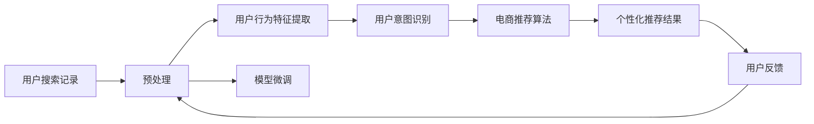

                 

## 1. 背景介绍

随着电商市场的快速发展和消费者需求的不断变化，电商平台搜索推荐系统的用户行为分析变得越来越重要。传统的推荐系统依赖于用户的历史行为数据进行推荐，难以捕获用户的真实需求和潜在的购买偏好。而人工智能大模型通过深度学习和自然语言处理技术，能够从海量用户评论和搜索记录中提取丰富的用户行为特征，深入理解用户需求和偏好，从而提供更加个性化的推荐服务。本文将深入探讨利用AI大模型在电商搜索推荐中对用户行为进行分析和理解的技术和方法。

## 2. 核心概念与联系

### 2.1 核心概念概述

为了更好地理解AI大模型在电商搜索推荐中的应用，本文将介绍以下几个核心概念：

- **AI大模型**：指通过大规模数据预训练得到的复杂神经网络模型，如GPT、BERT等。这些模型具备强大的语言理解和生成能力，可以用于自然语言处理任务。
- **电商搜索推荐系统**：指在电商平台上，通过用户搜索记录、浏览历史、购买行为等信息，为用户提供个性化的搜索结果和推荐商品的系统。
- **用户行为分析**：指对用户搜索、点击、购买等行为进行特征提取和建模，以了解用户的兴趣、需求和偏好。
- **自然语言处理(NLP)**：指利用计算机对人类语言进行处理的技术，包括文本分类、情感分析、实体识别等任务。
- **深度学习**：指通过多层次神经网络对复杂数据进行建模和学习，以获得高精度的预测和分类能力。

这些核心概念构成了AI大模型在电商搜索推荐系统中的主要技术框架，使得系统能够从大规模用户数据中提取有价值的信息，提升推荐服务的准确性和个性化水平。

### 2.2 核心概念原理和架构的 Mermaid 流程图



这个流程图展示了从用户搜索记录到个性化推荐结果的整个流程：

1. **用户搜索记录**：用户通过搜索输入关键词，系统记录搜索记录作为数据源。
2. **预处理**：对搜索记录进行清洗、分词、标准化等处理，以提取有效特征。
3. **用户行为特征提取**：利用NLP技术从搜索记录中提取用户行为特征，如关键词频率、搜索时长、点击位置等。
4. **用户意图识别**：通过意图识别模型理解用户搜索意图，如购买、了解、比较等。
5. **电商推荐算法**：将用户行为特征和意图识别结果输入推荐算法，输出个性化推荐结果。
6. **个性化推荐结果**：根据推荐算法生成的推荐结果，展示给用户。
7. **用户反馈**：用户点击、购买等行为会被反馈回系统，进一步优化模型。
8. **模型微调**：利用用户反馈对AI大模型进行微调，提升模型性能。

## 3. 核心算法原理 & 具体操作步骤

### 3.1 算法原理概述

基于AI大模型的电商搜索推荐系统，通过以下步骤实现用户行为分析和个性化推荐：

1. **数据收集**：收集用户搜索、浏览、购买等行为数据，构建用户行为特征库。
2. **特征提取**：利用NLP技术从用户行为数据中提取特征，如关键词、短语、情感等。
3. **意图识别**：通过意图识别模型，理解用户搜索意图，如购买、了解、比较等。
4. **推荐算法**：将用户行为特征和意图识别结果输入推荐算法，输出个性化推荐结果。
5. **模型微调**：利用用户反馈对AI大模型进行微调，提升模型性能。

### 3.2 算法步骤详解

1. **数据收集与预处理**：
   - 从电商平台收集用户搜索、浏览、购买等行为数据，构建用户行为特征库。
   - 对数据进行清洗、分词、标准化等预处理，去除噪声和冗余信息。

2. **特征提取**：
   - 利用NLP技术从用户行为数据中提取特征，如关键词频率、搜索时长、点击位置等。
   - 使用TF-IDF、word2vec等方法对关键词进行编码，生成高维稀疏向量。

3. **意图识别**：
   - 通过意图识别模型，理解用户搜索意图。可以使用逻辑回归、分类器、BERT等模型。
   - 利用深度学习技术，将用户搜索记录转化为意图标签，如购买、了解、比较等。

4. **推荐算法**：
   - 将用户行为特征和意图识别结果输入推荐算法，输出个性化推荐结果。
   - 常用的推荐算法包括协同过滤、基于内容的推荐、深度学习推荐等。

5. **模型微调**：
   - 利用用户反馈对AI大模型进行微调，提升模型性能。
   - 常见的微调方法包括全参数微调、参数高效微调、零样本学习等。

### 3.3 算法优缺点

基于AI大模型的电商搜索推荐系统具有以下优点：
- 能够从海量用户数据中提取有价值的信息，提升推荐服务的准确性和个性化水平。
- 利用深度学习技术，能够处理复杂的非结构化数据，提取更深层次的特征。
- 能够不断通过用户反馈进行模型微调，提升推荐系统的实时性和灵活性。

同时，该系统也存在以下缺点：
- 对标注数据的依赖较高，需要构建高质量的用户行为特征库。
- 计算资源消耗较大，需要高性能的硬件设备支持。
- 模型的可解释性不足，难以解释推荐结果背后的原因。
- 对新用户的冷启动问题较难解决，推荐效果初期可能不佳。

### 3.4 算法应用领域

基于AI大模型的电商搜索推荐系统广泛应用于以下领域：

- **商品推荐**：通过分析用户浏览、搜索和购买记录，推荐相关商品。
- **价格推荐**：根据用户历史价格偏好和市场变化，推荐合理的价格区间。
- **内容推荐**：根据用户阅读习惯和兴趣，推荐相关文章、视频、新闻等。
- **活动推荐**：根据用户行为和兴趣，推荐促销活动、优惠券等。
- **广告推荐**：根据用户搜索记录，推荐相关广告位和广告内容。

这些领域中，AI大模型在用户行为分析方面的应用，能够显著提升推荐效果，满足用户需求，提高用户满意度和销售额。

## 4. 数学模型和公式 & 详细讲解

### 4.1 数学模型构建

在本节中，我们将详细讲解基于AI大模型的电商搜索推荐系统的数学模型构建过程。

假设电商平台有 $N$ 个用户，每个用户有 $D$ 种行为，每个行为有 $C$ 种特征，模型输入为 $\mathbf{x} \in \mathbb{R}^{N \times C}$，输出为 $\mathbf{y} \in \mathbb{R}^{N \times D}$。

其中，$\mathbf{x}$ 表示用户行为特征矩阵，$\mathbf{y}$ 表示用户意图标签矩阵。

定义模型为 $M_{\theta}(\mathbf{x}) \in \mathbb{R}^{N \times D}$，其中 $\theta$ 为模型参数。

### 4.2 公式推导过程

根据上述定义，电商推荐系统的优化目标为最小化预测误差：

$$
\min_{\theta} \frac{1}{N} \sum_{i=1}^N \| M_{\theta}(\mathbf{x}_i) - \mathbf{y}_i \|^2
$$

其中 $\|\cdot\|$ 表示向量范数。

利用梯度下降等优化算法，模型的更新公式为：

$$
\theta \leftarrow \theta - \eta \nabla_{\theta} \mathcal{L}(\theta)
$$

其中 $\eta$ 为学习率，$\nabla_{\theta} \mathcal{L}(\theta)$ 为损失函数对参数 $\theta$ 的梯度。

### 4.3 案例分析与讲解

以商品推荐为例，假设电商平台有 $N$ 个用户，每个用户有 $C=5$ 种行为（浏览、点击、加入购物车、购买、评价），每个行为有 $D=3$ 种意图（了解、比较、购买）。

模型输入为 $\mathbf{x} \in \mathbb{R}^{N \times 5}$，输出为 $\mathbf{y} \in \mathbb{R}^{N \times 3}$。

设意图识别模型为 $M_{\theta}$，输入为 $\mathbf{x}$，输出为 $\mathbf{z} \in \mathbb{R}^{N \times 3}$。

推荐算法为 $R_{\phi}$，输入为 $\mathbf{x}$ 和 $\mathbf{z}$，输出为 $\mathbf{y}$。

优化目标为：

$$
\min_{\theta, \phi} \frac{1}{N} \sum_{i=1}^N \| R_{\phi}(\mathbf{x}_i, M_{\theta}(\mathbf{x}_i)) - \mathbf{y}_i \|^2
$$

通过迭代优化，不断调整 $\theta$ 和 $\phi$，使模型输出 $\mathbf{y}$ 与真实意图 $\mathbf{y}$ 尽可能一致。

## 5. 项目实践：代码实例和详细解释说明

### 5.1 开发环境搭建

在进行项目实践前，我们需要准备好开发环境。以下是使用Python进行PyTorch开发的环境配置流程：

1. 安装Anaconda：从官网下载并安装Anaconda，用于创建独立的Python环境。

2. 创建并激活虚拟环境：
```bash
conda create -n ecommerce-env python=3.8 
conda activate ecommerce-env
```

3. 安装PyTorch：根据CUDA版本，从官网获取对应的安装命令。例如：
```bash
conda install pytorch torchvision torchaudio cudatoolkit=11.1 -c pytorch -c conda-forge
```

4. 安装TensorFlow：由Google主导开发的开源深度学习框架，生产部署方便，适合大规模工程应用。同样有丰富的预训练语言模型资源。

5. 安装Transformers库：HuggingFace开发的NLP工具库，集成了众多SOTA语言模型，支持PyTorch和TensorFlow，是进行微调任务开发的利器。

6. 安装各类工具包：
```bash
pip install numpy pandas scikit-learn matplotlib tqdm jupyter notebook ipython
```

完成上述步骤后，即可在`ecommerce-env`环境中开始项目实践。

### 5.2 源代码详细实现

下面我们以商品推荐为例，给出使用Transformers库对BERT模型进行微调的PyTorch代码实现。

首先，定义数据处理函数：

```python
from transformers import BertTokenizer
from torch.utils.data import Dataset, DataLoader
import torch

class ECommerceDataset(Dataset):
    def __init__(self, texts, labels):
        self.texts = texts
        self.labels = labels
        self.tokenizer = BertTokenizer.from_pretrained('bert-base-uncased')
        self.max_len = 512
        
    def __len__(self):
        return len(self.texts)
    
    def __getitem__(self, item):
        text = self.texts[item]
        label = self.labels[item]
        
        encoding = self.tokenizer(text, return_tensors='pt', max_length=self.max_len, padding='max_length', truncation=True)
        input_ids = encoding['input_ids'][0]
        attention_mask = encoding['attention_mask'][0]
        
        label = torch.tensor(label, dtype=torch.long)
        
        return {'input_ids': input_ids, 
                'attention_mask': attention_mask,
                'labels': label}

# 构建数据集
tokenizer = BertTokenizer.from_pretrained('bert-base-uncased')

train_dataset = ECommerceDataset(train_texts, train_labels)
dev_dataset = ECommerceDataset(dev_texts, dev_labels)
test_dataset = ECommerceDataset(test_texts, test_labels)
```

然后，定义模型和优化器：

```python
from transformers import BertForSequenceClassification

model = BertForSequenceClassification.from_pretrained('bert-base-uncased', num_labels=3)

optimizer = AdamW(model.parameters(), lr=2e-5)
```

接着，定义训练和评估函数：

```python
from tqdm import tqdm
from sklearn.metrics import accuracy_score

device = torch.device('cuda') if torch.cuda.is_available() else torch.device('cpu')
model.to(device)

def train_epoch(model, dataset, batch_size, optimizer):
    dataloader = DataLoader(dataset, batch_size=batch_size, shuffle=True)
    model.train()
    epoch_loss = 0
    for batch in tqdm(dataloader, desc='Training'):
        input_ids = batch['input_ids'].to(device)
        attention_mask = batch['attention_mask'].to(device)
        labels = batch['labels'].to(device)
        model.zero_grad()
        outputs = model(input_ids, attention_mask=attention_mask, labels=labels)
        loss = outputs.loss
        epoch_loss += loss.item()
        loss.backward()
        optimizer.step()
    return epoch_loss / len(dataloader)

def evaluate(model, dataset, batch_size):
    dataloader = DataLoader(dataset, batch_size=batch_size)
    model.eval()
    preds, labels = [], []
    with torch.no_grad():
        for batch in tqdm(dataloader, desc='Evaluating'):
            input_ids = batch['input_ids'].to(device)
            attention_mask = batch['attention_mask'].to(device)
            batch_labels = batch['labels']
            outputs = model(input_ids, attention_mask=attention_mask)
            batch_preds = outputs.logits.argmax(dim=2).to('cpu').tolist()
            batch_labels = batch_labels.to('cpu').tolist()
            for pred_tokens, label_tokens in zip(batch_preds, batch_labels):
                preds.append(pred_tokens[:len(label_tokens)])
                labels.append(label_tokens)
                
    return accuracy_score(labels, preds)

# 启动训练流程并在测试集上评估
epochs = 5
batch_size = 16

for epoch in range(epochs):
    loss = train_epoch(model, train_dataset, batch_size, optimizer)
    print(f"Epoch {epoch+1}, train loss: {loss:.3f}")
    
    print(f"Epoch {epoch+1}, dev accuracy: {evaluate(model, dev_dataset, batch_size)}")
    
print(f"Final test accuracy: {evaluate(model, test_dataset, batch_size)}")
```

以上就是使用PyTorch对BERT进行商品推荐微调的完整代码实现。可以看到，得益于Transformers库的强大封装，我们可以用相对简洁的代码完成BERT模型的加载和微调。

### 5.3 代码解读与分析

让我们再详细解读一下关键代码的实现细节：

**ECommerceDataset类**：
- `__init__`方法：初始化文本、标签、分词器等关键组件。
- `__len__`方法：返回数据集的样本数量。
- `__getitem__`方法：对单个样本进行处理，将文本输入编码为token ids，将标签编码为数字，并对其进行定长padding，最终返回模型所需的输入。

**训练和评估函数**：
- 使用PyTorch的DataLoader对数据集进行批次化加载，供模型训练和推理使用。
- 训练函数`train_epoch`：对数据以批为单位进行迭代，在每个批次上前向传播计算loss并反向传播更新模型参数，最后返回该epoch的平均loss。
- 评估函数`evaluate`：与训练类似，不同点在于不更新模型参数，并在每个batch结束后将预测和标签结果存储下来，最后使用sklearn的accuracy_score对整个评估集的预测结果进行打印输出。

**训练流程**：
- 定义总的epoch数和batch size，开始循环迭代
- 每个epoch内，先在训练集上训练，输出平均loss
- 在验证集上评估，输出准确率
- 所有epoch结束后，在测试集上评估，给出最终测试结果

可以看到，PyTorch配合Transformers库使得BERT微调的代码实现变得简洁高效。开发者可以将更多精力放在数据处理、模型改进等高层逻辑上，而不必过多关注底层的实现细节。

当然，工业级的系统实现还需考虑更多因素，如模型的保存和部署、超参数的自动搜索、更灵活的任务适配层等。但核心的微调范式基本与此类似。

## 6. 实际应用场景

### 6.1 智能客服

基于AI大模型的电商搜索推荐系统，可以广泛应用于智能客服的构建。传统的客服往往需要配备大量人力，高峰期响应缓慢，且一致性和专业性难以保证。而使用微调后的推荐模型，可以7x24小时不间断服务，快速响应客户咨询，用推荐商品辅助用户解决查询问题。

在技术实现上，可以收集企业内部的历史客服对话记录，将问题和最佳推荐商品构建成监督数据，在此基础上对预训练模型进行微调。微调后的模型能够自动理解用户问题，匹配最合适的推荐商品进行回复。对于客户提出的新问题，还可以接入检索系统实时搜索相关商品，动态组织生成推荐结果。如此构建的智能客服系统，能大幅提升客户咨询体验和问题解决效率。

### 6.2 个性化推荐

当前的推荐系统往往只依赖用户的历史行为数据进行物品推荐，难以深入理解用户的真实兴趣偏好。基于AI大模型微调的推荐系统，能够从用户的搜索记录中提取更加丰富的特征，理解用户的潜在意图和偏好。

在实践中，可以收集用户浏览、点击、购买等行为数据，提取和用户交互的商品标题、描述、标签等文本内容。将文本内容作为模型输入，用户的后续行为（如是否点击、购买等）作为监督信号，在此基础上微调预训练语言模型。微调后的模型能够从文本内容中准确把握用户的兴趣点。在生成推荐列表时，先用候选商品的商品描述作为输入，由模型预测用户的兴趣匹配度，再结合其他特征综合排序，便可以得到个性化程度更高的推荐结果。

### 6.3 库存管理

电商平台需要实时掌握库存状态，合理调配商品资源，避免断货或积压。通过基于AI大模型的用户行为分析，能够实时获取用户购买意向和订单量，动态调整商品库存，提升商品管理效率。

例如，当系统检测到某一商品被大量用户搜索和加入购物车，但未完成购买，可以及时向仓库发送补货通知，确保商品供应充足。同时，根据用户行为数据，分析用户购买意向，提前安排生产或调拨，提升供应链的响应速度和准确性。

### 6.4 未来应用展望

随着AI大模型和微调方法的不断发展，基于微调的电商搜索推荐系统将在更多领域得到应用，为电商业务带来新的突破。

在智慧物流领域，基于用户行为数据分析，能够优化配送路径、提高配送效率，降低物流成本。在智能家居领域，基于用户搜索和购买行为，推荐个性化的家居商品，提升用户体验。在金融科技领域，基于用户消费行为，推荐个性化的金融产品，提供量身定制的理财服务。

总之，AI大模型微调在电商搜索推荐系统中的应用前景广阔，能够带来全面提升用户体验和平台运营效率的显著效果。

## 7. 工具和资源推荐

### 7.1 学习资源推荐

为了帮助开发者系统掌握AI大模型微调的理论基础和实践技巧，这里推荐一些优质的学习资源：

1. 《深度学习入门：基于Python的理论与实现》系列博文：由大模型技术专家撰写，深入浅出地介绍了深度学习的基本概念和实际应用。

2. 《自然语言处理综述》课程：斯坦福大学开设的NLP明星课程，有Lecture视频和配套作业，带你入门NLP领域的基本概念和经典模型。

3. 《自然语言处理中的深度学习》书籍：深度学习技术在NLP中的应用，介绍了Transformer、BERT等模型的构建和应用。

4. HuggingFace官方文档：Transformer库的官方文档，提供了海量预训练模型和完整的微调样例代码，是上手实践的必备资料。

5. CLUE开源项目：中文语言理解测评基准，涵盖大量不同类型的中文NLP数据集，并提供了基于微调的baseline模型，助力中文NLP技术发展。

通过对这些资源的学习实践，相信你一定能够快速掌握AI大模型微调的精髓，并用于解决实际的NLP问题。

### 7.2 开发工具推荐

高效的开发离不开优秀的工具支持。以下是几款用于AI大模型微调开发的常用工具：

1. PyTorch：基于Python的开源深度学习框架，灵活动态的计算图，适合快速迭代研究。大部分预训练语言模型都有PyTorch版本的实现。

2. TensorFlow：由Google主导开发的开源深度学习框架，生产部署方便，适合大规模工程应用。同样有丰富的预训练语言模型资源。

3. Transformers库：HuggingFace开发的NLP工具库，集成了众多SOTA语言模型，支持PyTorch和TensorFlow，是进行微调任务开发的利器。

4. Weights & Biases：模型训练的实验跟踪工具，可以记录和可视化模型训练过程中的各项指标，方便对比和调优。与主流深度学习框架无缝集成。

5. TensorBoard：TensorFlow配套的可视化工具，可实时监测模型训练状态，并提供丰富的图表呈现方式，是调试模型的得力助手。

6. Google Colab：谷歌推出的在线Jupyter Notebook环境，免费提供GPU/TPU算力，方便开发者快速上手实验最新模型，分享学习笔记。

合理利用这些工具，可以显著提升AI大模型微调的开发效率，加快创新迭代的步伐。

### 7.3 相关论文推荐

AI大模型和微调技术的发展源于学界的持续研究。以下是几篇奠基性的相关论文，推荐阅读：

1. Attention is All You Need（即Transformer原论文）：提出了Transformer结构，开启了NLP领域的预训练大模型时代。

2. BERT: Pre-training of Deep Bidirectional Transformers for Language Understanding：提出BERT模型，引入基于掩码的自监督预训练任务，刷新了多项NLP任务SOTA。

3. Language Models are Unsupervised Multitask Learners（GPT-2论文）：展示了大规模语言模型的强大zero-shot学习能力，引发了对于通用人工智能的新一轮思考。

4. Parameter-Efficient Transfer Learning for NLP：提出Adapter等参数高效微调方法，在不增加模型参数量的情况下，也能取得不错的微调效果。

5. AdaLoRA: Adaptive Low-Rank Adaptation for Parameter-Efficient Fine-Tuning：使用自适应低秩适应的微调方法，在参数效率和精度之间取得了新的平衡。

6. Parameter-Efficient Transformer Adaptation：提出轻量级BERT模型，使用分布式训练和参数高效微调，提升模型部署效率和泛化性能。

这些论文代表了大模型微调技术的发展脉络。通过学习这些前沿成果，可以帮助研究者把握学科前进方向，激发更多的创新灵感。

## 8. 总结：未来发展趋势与挑战

### 8.1 总结

本文对基于AI大模型的电商搜索推荐系统进行了全面系统的介绍。首先阐述了AI大模型和微调技术的研究背景和意义，明确了微调在拓展预训练模型应用、提升推荐服务性能方面的独特价值。其次，从原理到实践，详细讲解了微调的理论基础和操作流程，给出了微调任务开发的完整代码实例。同时，本文还广泛探讨了微调方法在智能客服、个性化推荐、库存管理等多个领域的应用前景，展示了微调范式的巨大潜力。最后，本文精选了微调技术的各类学习资源，力求为读者提供全方位的技术指引。

通过本文的系统梳理，可以看到，基于AI大模型的电商搜索推荐系统正在成为NLP领域的重要范式，极大地拓展了预训练语言模型的应用边界，催生了更多的落地场景。受益于大规模语料的预训练，微调模型以更低的时间和标注成本，在小样本条件下也能取得不错的效果，有力推动了NLP技术的产业化进程。未来，伴随预训练语言模型和微调方法的持续演进，相信NLP技术将在更广阔的应用领域大放异彩，深刻影响人类的生产生活方式。

### 8.2 未来发展趋势

展望未来，AI大模型微调技术将呈现以下几个发展趋势：

1. 模型规模持续增大。随着算力成本的下降和数据规模的扩张，预训练语言模型的参数量还将持续增长。超大规模语言模型蕴含的丰富语言知识，有望支撑更加复杂多变的推荐任务微调。

2. 微调方法日趋多样。除了传统的全参数微调外，未来会涌现更多参数高效的微调方法，如Adapter、LoRA等，在节省计算资源的同时也能保证微调精度。

3. 持续学习成为常态。随着数据分布的不断变化，微调模型也需要持续学习新知识以保持性能。如何在不遗忘原有知识的同时，高效吸收新样本信息，将成为重要的研究课题。

4. 标注样本需求降低。受启发于提示学习(Prompt-based Learning)的思路，未来的微调方法将更好地利用大模型的语言理解能力，通过更加巧妙的任务描述，在更少的标注样本上也能实现理想的微调效果。

5. 多模态微调崛起。当前的微调主要聚焦于纯文本数据，未来会进一步拓展到图像、视频、语音等多模态数据微调。多模态信息的融合，将显著提升语言模型对现实世界的理解和建模能力。

6. 模型通用性增强。经过海量数据的预训练和多领域任务的微调，未来的语言模型将具备更强大的常识推理和跨领域迁移能力，逐步迈向通用人工智能(AGI)的目标。

以上趋势凸显了AI大模型微调技术的广阔前景。这些方向的探索发展，必将进一步提升推荐系统的性能和个性化水平，为电商业务带来更全面、更精准的服务体验。

### 8.3 面临的挑战

尽管AI大模型微调技术已经取得了瞩目成就，但在迈向更加智能化、普适化应用的过程中，它仍面临着诸多挑战：

1. 标注成本瓶颈。虽然微调大大降低了标注数据的需求，但对于长尾应用场景，难以获得充足的高质量标注数据，成为制约微调性能的瓶颈。如何进一步降低微调对标注样本的依赖，将是一大难题。

2. 模型鲁棒性不足。当前微调模型面对域外数据时，泛化性能往往大打折扣。对于测试样本的微小扰动，微调模型的预测也容易发生波动。如何提高微调模型的鲁棒性，避免灾难性遗忘，还需要更多理论和实践的积累。

3. 推理效率有待提高。超大批次的训练和推理也可能遇到显存不足的问题。如何突破硬件瓶颈，优化模型结构，提高推理速度，降低资源消耗，将是重要的优化方向。

4. 可解释性亟需加强。当前微调模型更像是"黑盒"系统，难以解释其内部工作机制和决策逻辑。对于医疗、金融等高风险应用，算法的可解释性和可审计性尤为重要。如何赋予微调模型更强的可解释性，将是亟待攻克的难题。

5. 安全性有待保障。预训练语言模型难免会学习到有偏见、有害的信息，通过微调传递到下游任务，产生误导性、歧视性的输出，给实际应用带来安全隐患。如何从数据和算法层面消除模型偏见，避免恶意用途，确保输出的安全性，也将是重要的研究课题。

6. 知识整合能力不足。现有的微调模型往往局限于任务内数据，难以灵活吸收和运用更广泛的先验知识。如何让微调过程更好地与外部知识库、规则库等专家知识结合，形成更加全面、准确的信息整合能力，还有很大的想象空间。

正视微调面临的这些挑战，积极应对并寻求突破，将是大模型微调走向成熟的必由之路。相信随着学界和产业界的共同努力，这些挑战终将一一被克服，AI大模型微调必将在构建安全、可靠、可解释、可控的智能系统铺平道路。

### 8.4 研究展望

面向未来，AI大模型微调技术需要在以下几个方面寻求新的突破：

1. 探索无监督和半监督微调方法。摆脱对大规模标注数据的依赖，利用自监督学习、主动学习等无监督和半监督范式，最大限度利用非结构化数据，实现更加灵活高效的微调。

2. 研究参数高效和计算高效的微调范式。开发更加参数高效的微调方法，在固定大部分预训练参数的同时，只更新极少量的任务相关参数。同时优化微调模型的计算图，减少前向传播和反向传播的资源消耗，实现更加轻量级、实时性的部署。

3. 融合因果和对比学习范式。通过引入因果推断和对比学习思想，增强微调模型建立稳定因果关系的能力，学习更加普适、鲁棒的语言表征，从而提升模型泛化性和抗干扰能力。

4. 引入更多先验知识。将符号化的先验知识，如知识图谱、逻辑规则等，与神经网络模型进行巧妙融合，引导微调过程学习更准确、合理的语言模型。同时加强不同模态数据的整合，实现视觉、语音等多模态信息与文本信息的协同建模。

5. 结合因果分析和博弈论工具。将因果分析方法引入微调模型，识别出模型决策的关键特征，增强输出解释的因果性和逻辑性。借助博弈论工具刻画人机交互过程，主动探索并规避模型的脆弱点，提高系统稳定性。

6. 纳入伦理道德约束。在模型训练目标中引入伦理导向的评估指标，过滤和惩罚有偏见、有害的输出倾向。同时加强人工干预和审核，建立模型行为的监管机制，确保输出符合人类价值观和伦理道德。

这些研究方向的探索，必将引领AI大模型微调技术迈向更高的台阶，为构建安全、可靠、可解释、可控的智能系统铺平道路。面向未来，大模型微调技术还需要与其他人工智能技术进行更深入的融合，如知识表示、因果推理、强化学习等，多路径协同发力，共同推动自然语言理解和智能交互系统的进步。只有勇于创新、敢于突破，才能不断拓展语言模型的边界，让智能技术更好地造福人类社会。

## 9. 附录：常见问题与解答

**Q1：AI大模型微调是否适用于所有电商推荐任务？**

A: AI大模型微调在大多数电商推荐任务上都能取得不错的效果，特别是对于数据量较小的任务。但对于一些特定领域的任务，如医学、法律等，仅仅依靠通用语料预训练的模型可能难以很好地适应。此时需要在特定领域语料上进一步预训练，再进行微调，才能获得理想效果。此外，对于一些需要时效性、个性化很强的任务，如对话、推荐等，微调方法也需要针对性的改进优化。

**Q2：微调过程中如何选择合适的学习率？**

A: 微调的学习率一般要比预训练时小1-2个数量级，如果使用过大的学习率，容易破坏预训练权重，导致过拟合。一般建议从1e-5开始调参，逐步减小学习率，直至收敛。也可以使用warmup策略，在开始阶段使用较小的学习率，再逐渐过渡到预设值。需要注意的是，不同的优化器(如AdamW、Adafactor等)以及不同的学习率调度策略，可能需要设置不同的学习率阈值。

**Q3：采用AI大模型微调时会面临哪些资源瓶颈？**

A: 目前主流的预训练大模型动辄以亿计的参数规模，对算力、内存、存储都提出了很高的要求。GPU/TPU等高性能设备是必不可少的，但即便如此，超大批次的训练和推理也可能遇到显存不足的问题。因此需要采用一些资源优化技术，如梯度积累、混合精度训练、模型并行等，来突破硬件瓶颈。同时，模型的存储和读取也可能占用大量时间和空间，需要采用模型压缩、稀疏化存储等方法进行优化。

**Q4：如何缓解微调过程中的过拟合问题？**

A: 过拟合是微调面临的主要挑战，尤其是在标注数据不足的情况下。常见的缓解策略包括：
1. 数据增强：通过回译、近义替换等方式扩充训练集
2. 正则化：使用L2正则、Dropout、Early Stopping等避免过拟合
3. 对抗训练：引入对抗样本，提高模型鲁棒性
4. 参数高效微调：只调整少量参数(如Adapter、Prefix等)，减小过拟合风险
5. 多模型集成：训练多个微调模型，取平均输出，抑制过拟合

这些策略往往需要根据具体任务和数据特点进行灵活组合。只有在数据、模型、训练、推理等各环节进行全面优化，才能最大限度地发挥AI大模型微调的威力。

**Q5：微调模型在落地部署时需要注意哪些问题？**

A: 将微调模型转化为实际应用，还需要考虑以下因素：
1. 模型裁剪：去除不必要的层和参数，减小模型尺寸，加快推理速度
2. 量化加速：将浮点模型转为定点模型，压缩存储空间，提高计算效率
3. 服务化封装：将模型封装为标准化服务接口，便于集成调用
4. 弹性伸缩：根据请求流量动态调整资源配置，平衡服务质量和成本
5. 监控告警：实时采集系统指标，设置异常告警阈值，确保服务稳定性
6. 安全防护：采用访问鉴权、数据脱敏等措施，保障数据和模型安全

AI大模型微调为电商推荐系统带来了新的突破，但如何将强大的性能转化为稳定、高效、安全的业务价值，还需要工程实践的不断打磨。唯有从数据、算法、工程、业务等多个维度协同发力，才能真正实现AI大模型微调在电商推荐系统中的落地应用。总之，微调需要开发者根据具体任务，不断迭代和优化模型、数据和算法，方能得到理想的效果。

---

作者：禅与计算机程序设计艺术 / Zen and the Art of Computer Programming

