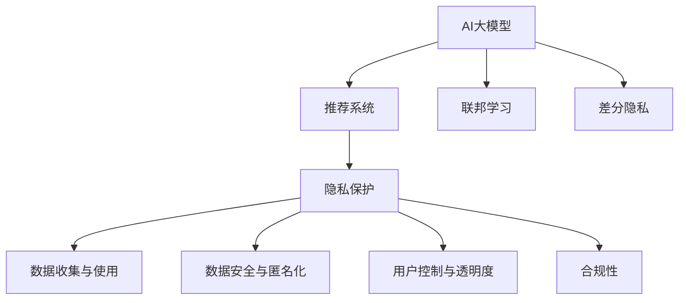

                 

# AI 大模型在电商搜索推荐中的用户隐私保护：尊重用户权利与安全

## 1. 背景介绍

### 1.1 问题由来
随着人工智能（AI）和大数据技术的不断进步，电子商务平台开始在推荐系统中广泛应用大模型技术，以提高用户体验和平台收益。这些大模型往往通过处理大量的用户行为数据，学习用户的兴趣偏好，从而生成个性化的搜索结果和推荐商品。然而，这种做法在提升推荐效果的同时，也引发了用户隐私保护的重大挑战。用户不仅对自己的浏览和点击数据感到担忧，也担心自己的隐私被不当使用或泄露。

### 1.2 问题核心关键点
在大模型推荐系统中，用户隐私保护的核心关键点包括：
1. **数据收集与使用**：推荐系统收集了哪些用户数据？如何使用这些数据进行推荐？
2. **数据安全与匿名化**：如何确保数据的存储和传输安全？如何在数据分析和建模过程中保护用户身份信息？
3. **用户控制与透明度**：用户如何了解和控制自己的数据被如何使用？如何提升数据使用的透明度？
4. **合规性与法律责任**：如何确保推荐系统符合各国数据保护法规？如何合理分配法律责任？

这些关键点不仅涉及技术层面的问题，还需要从法律、伦理和社会层面进行综合考虑。只有在这三个层面上实现平衡，才能真正实现用户隐私保护的全面保障。

### 1.3 问题研究意义
保障用户隐私是构建可信、可持续的AI大模型推荐系统的基础。隐私保护的缺失不仅会导致用户信任度下降，还可能引发法律风险和社会争议，甚至影响社会的公平与正义。因此，从技术、法律和伦理三个维度深入探讨AI大模型在电商搜索推荐中的用户隐私保护，对于推动AI技术的健康发展具有重要意义。

## 2. 核心概念与联系

### 2.1 核心概念概述

为更好地理解AI大模型在电商搜索推荐中的隐私保护，本节将介绍几个密切相关的核心概念：

- **AI大模型**：以自回归（如GPT）或自编码（如BERT）模型为代表的大规模预训练语言模型。通过在大规模无标签文本数据上进行预训练，学习通用语言表示，具备强大的语言理解和生成能力。

- **隐私保护**：在数据处理和分析过程中，保护个人用户身份信息和敏感数据的隐私安全，避免未授权的访问和数据泄露。

- **推荐系统**：通过分析用户历史行为数据，为用户推荐感兴趣的产品或服务，提高用户体验和平台收益。

- **用户数据**：用户在电子商务平台上的浏览、点击、购买等行为数据，是推荐系统进行个性化推荐的基础。

- **联邦学习**：一种分布式机器学习技术，使得模型可以在不共享数据的情况下，通过网络聚合多个节点上的计算结果进行模型更新。

- **差分隐私**：一种数据隐私保护技术，通过对数据集进行添加噪声，保护个体数据隐私，同时保留数据集的统计特性。

- **用户控制**：用户对自身数据的使用和处理有知情权和控制权，能够决定哪些数据可以被收集和使用。

- **合规性**：确保推荐系统符合各国数据保护法规，如GDPR、CCPA等。

这些核心概念之间的逻辑关系可以通过以下Mermaid流程图来展示：



这个流程图展示了大模型、推荐系统、隐私保护之间的关系：

1. 大模型通过预训练获得语言知识，作为推荐系统的基础。
2. 推荐系统利用大模型进行个性化推荐，收集用户数据。
3. 隐私保护技术用于保护用户数据，防止未授权访问和数据泄露。
4. 用户控制与透明度保证用户对自身数据的使用有知情权和控制权。
5. 合规性确保推荐系统符合法规要求。

## 3. 核心算法原理 & 具体操作步骤
### 3.1 算法原理概述

AI大模型在电商搜索推荐中的用户隐私保护，主要通过以下几个方面实现：

- **差分隐私**：在推荐系统数据处理和建模过程中，通过添加噪声保护个体数据隐私，同时保留数据集的统计特性。
- **联邦学习**：在多节点上分布式训练模型，不共享数据的情况下，通过网络聚合计算结果进行模型更新。
- **差分隐私联邦学习**：结合差分隐私和联邦学习，在不共享用户数据的前提下，进行隐私保护的模型训练。
- **用户控制与透明度**：通过接口设计，允许用户查看和控制自己的数据使用情况，提升系统透明度。

这些技术手段的综合应用，能够在保护用户隐私的同时，实现高效的推荐系统。

### 3.2 算法步骤详解

AI大模型在电商搜索推荐中的用户隐私保护，主要包括以下几个关键步骤：

**Step 1: 数据收集与预处理**
- 收集用户的浏览、点击、购买等行为数据。
- 对数据进行清洗、去重、标注等预处理操作。

**Step 2: 差分隐私保护**
- 通过添加噪声对敏感数据进行处理，保护用户隐私。
- 使用差分隐私算法（如Laplace机制、高斯机制等）进行隐私保护。

**Step 3: 联邦学习训练**
- 在多个节点上分布式训练推荐模型，不共享数据。
- 通过网络聚合计算结果，更新模型参数。

**Step 4: 差分隐私联邦学习**
- 结合差分隐私和联邦学习，在不共享数据的情况下，进行隐私保护的模型训练。

**Step 5: 模型评估与部署**
- 在隐私保护的框架下，对训练好的模型进行评估。
- 部署模型到实际推荐系统中。

**Step 6: 用户控制与透明度**
- 设计用户接口，允许用户查看和控制自己的数据使用情况。
- 提供推荐系统的透明度，让用户了解数据使用和模型训练过程。

### 3.3 算法优缺点

差分隐私和联邦学习技术在电商搜索推荐中的用户隐私保护，具有以下优点：
1. 保护用户隐私。通过添加噪声和分布式训练，防止数据泄露和未授权访问。
2. 保护用户控制权。用户可以了解和控制自己的数据使用情况，提升系统透明度。
3. 确保合规性。符合各国数据保护法规，避免法律风险。

同时，这些技术也存在一些缺点：
1. 计算复杂度较高。差分隐私和联邦学习技术需要额外的计算资源和时间。
2. 数据利用效率低。在隐私保护机制下，部分数据的有用信息可能被噪声掩盖。
3. 模型性能下降。隐私保护机制可能会影响模型的训练效果和推荐精度。

尽管存在这些缺点，但差分隐私和联邦学习技术仍是当前保护用户隐私的主要手段，适用于数据量大、分布式场景下的推荐系统。

### 3.4 算法应用领域

AI大模型在电商搜索推荐中的用户隐私保护，主要应用于以下领域：

- **电商推荐系统**：电商平台在收集用户行为数据时，通过差分隐私和联邦学习技术，保护用户隐私，确保合规性。
- **金融推荐系统**：金融公司利用用户交易数据进行推荐，通过隐私保护技术，避免用户敏感信息泄露。
- **医疗推荐系统**：医疗平台在推荐治疗方案时，通过差分隐私和联邦学习技术，保护患者隐私。
- **社交媒体推荐系统**：社交媒体平台在推荐内容时，通过隐私保护技术，保护用户数据安全。

这些领域对用户隐私保护的需求日益增长，AI大模型推荐系统通过隐私保护技术，能够更好地满足用户需求，同时提升系统可信度和合规性。

## 4. 数学模型和公式 & 详细讲解 & 举例说明

### 4.1 数学模型构建

在推荐系统数据隐私保护中，差分隐私和联邦学习是主要技术手段。这里以差分隐私为例，构建数学模型。

假设推荐系统收集的用户行为数据集为 $D$，其中包含 $n$ 个样本 $x_1, ..., x_n$。差分隐私通过在数据集中添加噪声 $ε$，使得个体数据隐私得到保护，同时保留数据集的统计特性。

定义 $x_i$ 的敏感度为 $\Delta$，即数据集 $D$ 和数据集 $D'$ 之间的最大差异。差分隐私保护的目标是：
$$
\mathbb{P}(\mathcal{A}(D) \leq \mathcal{A}(D') + f(\Delta)) = \exp(-ε\Delta)
$$
其中 $\mathcal{A}$ 表示函数（如均值、方差等），$f(\Delta)$ 表示函数对敏感度的依赖关系。

### 4.2 公式推导过程

根据差分隐私的定义，假设推荐系统需要计算的函数为 $f(x_i)$，则差分隐私保护的公式可以表示为：
$$
f(x_i) = f(x_i') + \mathcal{N}(0, σ^2)
$$
其中 $\mathcal{N}(0, σ^2)$ 表示均值为0，方差为 $σ^2$ 的高斯噪声。

在实际应用中，推荐系统通常使用 Laplace 机制或 Gaussian 机制进行差分隐私保护。以 Laplace 机制为例，其公式如下：
$$
\hat{f}(x_i) = f(x_i') + \epsilon_i
$$
其中 $\epsilon_i$ 表示第 $i$ 个样本添加的噪声，通常服从 Laplace 分布，即 $P(\epsilon_i) = \frac{1}{2}\exp(-|\epsilon_i|/\epsilon)$。

### 4.3 案例分析与讲解

以电商推荐系统为例，假设推荐系统需要计算的函数为 $f(x_i) = \text{Average}(x_i)$，即用户行为数据的平均值。使用差分隐私保护的公式可以表示为：
$$
\hat{f}(x_i) = \text{Average}(x_i') + \epsilon_i
$$
其中 $\epsilon_i$ 服从 Laplace 分布。

假设推荐系统需要保护的敏感度为 $\Delta$，期望隐私保护参数为 $ε$，则差分隐私保护的公式可以表示为：
$$
\hat{f}(x_i) = \text{Average}(x_i') + \epsilon_i
$$
其中 $\epsilon_i$ 服从 Laplace 分布，满足 $P(\epsilon_i) = \frac{1}{2}\exp(-|\epsilon_i|/\epsilon)$。

## 5. 项目实践：代码实例和详细解释说明
### 5.1 开发环境搭建

在进行差分隐私和联邦学习实践前，我们需要准备好开发环境。以下是使用Python进行FedML和PySyft开发的环境配置流程：

1. 安装Anaconda：从官网下载并安装Anaconda，用于创建独立的Python环境。

2. 创建并激活虚拟环境：
```bash
conda create -n pytorch-env python=3.8 
conda activate pytorch-env
```

3. 安装PyTorch：根据CUDA版本，从官网获取对应的安装命令。例如：
```bash
conda install pytorch torchvision torchaudio cudatoolkit=11.1 -c pytorch -c conda-forge
```

4. 安装PySyft和FedML：
```bash
pip install pytorch syft fedml
```

5. 安装各类工具包：
```bash
pip install numpy pandas scikit-learn matplotlib tqdm jupyter notebook ipython
```

完成上述步骤后，即可在`pytorch-env`环境中开始差分隐私和联邦学习实践。

### 5.2 源代码详细实现

下面我们以差分隐私联邦学习在电商推荐系统中的应用为例，给出使用PySyft进行差分隐私保护的代码实现。

首先，定义数据处理函数：

```python
import torch
import syft as sy
import syft.special as sp
from syft.special.types import SymmetricTensor

def get_data(sample):
    # 将样本转换为Syft张量
    data = sy.Tensor(sample)
    return data

def add_laplace_noise(data, epsilon, delta):
    # 添加Laplace噪声
    noise = sp.differential_privacy.LaplaceMechanism(epsilon, delta)
    noisy_data = noise.add_noise(data)
    return noisy_data

def get_average(data):
    # 计算数据平均值
    data_mean = torch.mean(data)
    return data_mean
```

然后，定义差分隐私联邦学习的训练函数：

```python
def federated_learning(train_data, model, num_workers, num_epochs, learning_rate, epsilon, delta):
    # 初始化Syft上下文和客户端
    syft_ctx = sy.FederatedCtx()
    clients = [syft.Client() for _ in range(num_workers)]
    
    # 在每个客户端上本地训练模型
    for client in clients:
        client.datasets = train_data
        client.model = model
        
        # 本地训练
        for epoch in range(num_epochs):
            for data in client.datasets:
                data = get_data(data)
                data = add_laplace_noise(data, epsilon, delta)
                loss = client.model(data) - model(data)
                loss.backward()
                optimizer.step()
                optimizer.zero_grad()
    
    # 在中心服务器上聚合模型参数
    model_params = []
    for client in clients:
        model_params.append(client.get_model_params())
    model_params = sp.differential_privacy.AggregatedTensor(model_params)
    model_params = sp.differential_privacy.AddNoise(model_params, epsilon, delta)
    new_model_params = sp.differential_privacy.DecentralizedFedAvg(model_params)
    new_model_params = new_model_params.get()
    
    # 更新模型参数
    model.set_model_params(new_model_params)
```

最后，启动联邦学习流程：

```python
from torch.utils.data import DataLoader
from tqdm import tqdm
from sklearn.metrics import classification_report

# 定义训练集和模型
train_data = ...
model = ...
optimizer = ...

# 设置超参数
num_workers = 4
num_epochs = 10
learning_rate = 1e-3
epsilon = 1e-5
delta = 1e-7

# 启动联邦学习训练
federated_learning(train_data, model, num_workers, num_epochs, learning_rate, epsilon, delta)
```

以上就是使用PySyft进行差分隐私保护的代码实现。可以看到，通过Syft库，我们可以方便地将数据和模型封装成Syft张量和Syft Client，利用联邦学习技术进行隐私保护的模型训练。

### 5.3 代码解读与分析

让我们再详细解读一下关键代码的实现细节：

**get_data函数**：
- 将样本转换为Syft张量，方便后续的隐私保护和分布式计算。

**add_laplace_noise函数**：
- 在数据上添加Laplace噪声，保护个体数据隐私。
- 使用Laplace机制，根据隐私保护参数ε和敏感度Δ进行噪声添加。

**get_average函数**：
- 计算数据的平均值，即推荐系统需要计算的函数。

**federated_learning函数**：
- 初始化Syft上下文和客户端，分布式训练模型。
- 在每个客户端上本地训练模型，添加Laplace噪声保护隐私。
- 在中心服务器上聚合模型参数，更新模型参数。

通过这些关键代码的实现，我们能够将差分隐私和联邦学习技术应用于实际推荐系统，有效保护用户隐私，同时提升模型的训练效果和推荐精度。

## 6. 实际应用场景
### 6.1 智能客服系统

基于差分隐私和联邦学习技术的智能客服系统，能够在不共享用户数据的前提下，进行个性化客服推荐。系统在收集用户对话数据时，通过差分隐私保护用户隐私，确保数据安全。

在技术实现上，可以收集企业内部的客服对话记录，使用差分隐私保护用户对话数据。在此基础上，对预训练语言模型进行联邦学习微调，使其能够自动理解用户意图，匹配最合适的客服答案，从而提供个性化客服推荐。

### 6.2 金融舆情监测

金融机构需要实时监测市场舆论动向，避免未授权访问和数据泄露。基于差分隐私和联邦学习技术的金融舆情监测系统，可以保护用户数据隐私，确保数据安全。

具体而言，可以收集金融领域相关的新闻、报道、评论等文本数据，使用差分隐私保护用户隐私。在此基础上，对预训练语言模型进行联邦学习微调，使其能够自动判断文本属于何种主题，情感倾向是正面、中性还是负面。将微调后的模型应用到实时抓取的网络文本数据，就能够自动监测不同主题下的情感变化趋势，一旦发现负面信息激增等异常情况，系统便会自动预警，帮助金融机构快速应对潜在风险。

### 6.3 个性化推荐系统

当前的个性化推荐系统往往只依赖用户的历史行为数据进行物品推荐，无法深入理解用户的真实兴趣偏好。基于差分隐私和联邦学习技术的个性化推荐系统，能够在不共享用户数据的前提下，保护用户隐私。

在技术实现上，可以收集用户浏览、点击、评论、分享等行为数据，使用差分隐私保护用户隐私。在此基础上，对预训练语言模型进行联邦学习微调，使其能够从文本内容中准确把握用户的兴趣点。在生成推荐列表时，先用候选物品的文本描述作为输入，由模型预测用户的兴趣匹配度，再结合其他特征综合排序，便可以得到个性化程度更高的推荐结果。

### 6.4 未来应用展望

随着差分隐私和联邦学习技术的发展，未来在电商搜索推荐中的隐私保护将更加全面和高效。具体展望如下：

1. **多模态数据融合**：将差分隐私和联邦学习技术应用到多模态数据融合中，实现视觉、语音、文本等多模态信息的协同建模，提升推荐系统的综合能力。
2. **跨平台隐私保护**：利用差分隐私和联邦学习技术，实现跨平台用户数据隐私保护，确保用户数据在不同平台上的隐私安全。
3. **隐私保护算法优化**：进一步优化差分隐私和联邦学习算法，降低计算复杂度和噪声干扰，提升隐私保护的效率和效果。
4. **用户隐私意识提升**：通过宣传和教育，提升用户对隐私保护的意识，鼓励用户积极参与数据治理，共同构建可信的推荐系统。

## 7. 工具和资源推荐
### 7.1 学习资源推荐

为了帮助开发者系统掌握差分隐私和联邦学习技术，这里推荐一些优质的学习资源：

1. 《Differential Privacy》系列博文：由隐私保护专家撰写，深入浅出地介绍了差分隐私的基本概念和应用场景。

2. 《联邦学习》课程：斯坦福大学开设的联邦学习课程，有Lecture视频和配套作业，带你入门联邦学习的基本概念和经典模型。

3. 《Differential Privacy in Practice》书籍：差分隐私领域的经典教材，全面介绍了差分隐私的理论基础和应用实践。

4. 《 federated-learning.org》：联邦学习领域的开源平台，提供了大量联邦学习样例和工具，方便开发者进行实践。

5. 《隐私保护技术入门》书籍：系统介绍了隐私保护的基本原理和实现技术，包括差分隐私、联邦学习等。

通过对这些资源的学习实践，相信你一定能够快速掌握差分隐私和联邦学习技术的精髓，并用于解决实际的隐私保护问题。

### 7.2 开发工具推荐

高效的开发离不开优秀的工具支持。以下是几款用于差分隐私和联邦学习开发的常用工具：

1. PySyft：由Facebook开发的隐私保护框架，支持差分隐私和联邦学习，提供了丰富的隐私保护算法和工具。

2. FLAML：基于FedML的开源框架，支持联邦学习和分布式训练，适用于大规模推荐系统的训练。

3. PyTorch：基于Python的开源深度学习框架，灵活动态的计算图，适合快速迭代研究。

4. TensorFlow：由Google主导开发的开源深度学习框架，生产部署方便，适合大规模工程应用。

5. Weights & Biases：模型训练的实验跟踪工具，可以记录和可视化模型训练过程中的各项指标，方便对比和调优。

6. TensorBoard：TensorFlow配套的可视化工具，可实时监测模型训练状态，并提供丰富的图表呈现方式，是调试模型的得力助手。

合理利用这些工具，可以显著提升差分隐私和联邦学习技术的开发效率，加快创新迭代的步伐。

### 7.3 相关论文推荐

差分隐私和联邦学习技术的发展源于学界的持续研究。以下是几篇奠基性的相关论文，推荐阅读：

1. Differential Privacy: An Introduction (2006)：差分隐私领域的奠基论文，定义了差分隐私的基本概念和形式化定义。

2. A Tutorial on Federated Learning (2021)：联邦学习领域的综述论文，介绍了联邦学习的基本概念和实现方法。

3. Algorithmic Fairness, Transparency, and Interpretability: Foundational Perspectives (2021)：介绍了算法透明性和可解释性的基础理论和实现方法。

4. Learning Privacy-Sensitive Deep Learning Models (2016)：介绍了隐私保护机器学习的基本原理和实现方法。

5. Privacy-Preserving Federated Learning for the Edge of Things (2021)：介绍了联邦学习在物联网场景中的应用，以及隐私保护的方法。

这些论文代表了大模型隐私保护技术的发展脉络。通过学习这些前沿成果，可以帮助研究者把握学科前进方向，激发更多的创新灵感。

## 8. 总结：未来发展趋势与挑战
### 8.1 总结

本文对差分隐私和联邦学习技术在电商搜索推荐中的应用进行了全面系统的介绍。首先阐述了差分隐私和联邦学习技术的基本概念和核心思想，明确了其在保护用户隐私方面的重要价值。其次，从原理到实践，详细讲解了差分隐私和联邦学习的数学原理和关键步骤，给出了联邦学习任务开发的完整代码实例。同时，本文还广泛探讨了差分隐私和联邦学习技术在智能客服、金融舆情、个性化推荐等多个行业领域的应用前景，展示了隐私保护技术的广阔应用空间。此外，本文精选了隐私保护技术的各类学习资源，力求为读者提供全方位的技术指引。

通过本文的系统梳理，可以看到，差分隐私和联邦学习技术在保护用户隐私方面具有巨大的潜力，能够在隐私保护和推荐系统性能之间实现平衡。未来，伴随着隐私保护技术的发展，差分隐私和联邦学习技术必将在更多场景中得到应用，为人工智能技术的健康发展提供重要保障。

### 8.2 未来发展趋势

展望未来，差分隐私和联邦学习技术在电商搜索推荐中的隐私保护，将呈现以下几个发展趋势：

1. **隐私保护算法优化**：进一步优化差分隐私和联邦学习算法，降低计算复杂度和噪声干扰，提升隐私保护的效率和效果。
2. **多模态隐私保护**：将差分隐私和联邦学习技术应用到多模态数据融合中，实现视觉、语音、文本等多模态信息的协同建模，提升推荐系统的综合能力。
3. **跨平台隐私保护**：利用差分隐私和联邦学习技术，实现跨平台用户数据隐私保护，确保用户数据在不同平台上的隐私安全。
4. **隐私保护与业务协同**：在隐私保护机制下，实现隐私保护与推荐系统业务的协同优化，提升系统的整体效能。
5. **用户隐私意识提升**：通过宣传和教育，提升用户对隐私保护的意识，鼓励用户积极参与数据治理，共同构建可信的推荐系统。

以上趋势凸显了差分隐私和联邦学习技术的广阔前景，这些方向的探索发展，必将进一步提升隐私保护的效果，推动人工智能技术的健康发展。

### 8.3 面临的挑战

尽管差分隐私和联邦学习技术在电商搜索推荐中已经取得了显著成果，但在迈向更加智能化、普适化应用的过程中，仍面临诸多挑战：

1. **计算资源瓶颈**：差分隐私和联邦学习技术需要额外的计算资源和时间，如何优化算法，降低计算复杂度，是未来需要重点解决的问题。
2. **数据利用效率**：在隐私保护机制下，部分数据的有用信息可能被噪声掩盖，如何提高数据利用效率，是另一个重要挑战。
3. **模型性能下降**：隐私保护机制可能会影响模型的训练效果和推荐精度，如何在隐私保护和模型性能之间找到平衡，是需要持续探索的问题。
4. **隐私保护与业务协同**：隐私保护机制需要与推荐系统业务进行协同优化，如何在隐私保护与业务目标之间找到平衡，是未来需要解决的重要问题。
5. **用户隐私意识提升**：提升用户对隐私保护的意识，鼓励用户积极参与数据治理，是隐私保护技术推广的重要前提。

正视这些挑战，积极应对并寻求突破，将是大模型隐私保护技术迈向成熟的必由之路。相信随着学界和产业界的共同努力，这些挑战终将一一被克服，差分隐私和联邦学习技术必将在构建安全、可靠、可解释、可控的智能系统方面发挥重要作用。

### 8.4 研究展望

面对差分隐私和联邦学习技术所面临的挑战，未来的研究需要在以下几个方面寻求新的突破：

1. **隐私保护与业务协同**：如何在隐私保护机制下，实现隐私保护与推荐系统业务的协同优化，提升系统的整体效能。
2. **隐私保护算法优化**：进一步优化差分隐私和联邦学习算法，降低计算复杂度和噪声干扰，提升隐私保护的效率和效果。
3. **多模态隐私保护**：将差分隐私和联邦学习技术应用到多模态数据融合中，实现视觉、语音、文本等多模态信息的协同建模，提升推荐系统的综合能力。
4. **跨平台隐私保护**：利用差分隐私和联邦学习技术，实现跨平台用户数据隐私保护，确保用户数据在不同平台上的隐私安全。
5. **隐私保护技术标准化**：推动隐私保护技术标准化，制定隐私保护技术规范和标准，确保不同平台和应用之间的隐私保护一致性。

这些研究方向的探索，必将引领差分隐私和联邦学习技术迈向更高的台阶，为构建安全、可靠、可解释、可控的智能系统铺平道路。面向未来，差分隐私和联邦学习技术还需要与其他人工智能技术进行更深入的融合，如知识表示、因果推理、强化学习等，多路径协同发力，共同推动自然语言理解和智能交互系统的进步。只有勇于创新、敢于突破，才能不断拓展隐私保护技术的边界，让智能技术更好地造福人类社会。

## 9. 附录：常见问题与解答

**Q1：差分隐私和联邦学习是否适用于所有推荐系统？**

A: 差分隐私和联邦学习技术适用于数据量大、分布式场景下的推荐系统，如电商推荐系统、金融推荐系统等。但对于数据量较小、集中式处理的推荐系统，差分隐私和联邦学习的优势可能不明显。此时可以考虑使用其他隐私保护技术，如数据加密、匿名化等。

**Q2：差分隐私和联邦学习是否会影响推荐系统的性能？**

A: 差分隐私和联邦学习技术可能会影响推荐系统的性能，尤其是对于需要精细化推荐的任务。由于隐私保护机制的引入，部分数据的有用信息可能被噪声掩盖，导致推荐精度下降。因此，需要在隐私保护和模型性能之间找到平衡，选择合适的参数和策略。

**Q3：差分隐私和联邦学习是否需要额外的计算资源？**

A: 差分隐私和联邦学习技术需要额外的计算资源和时间，尤其是在模型训练和数据聚合阶段。因此，合理选择隐私保护参数和优化算法，可以有效降低计算复杂度，提升系统的效率。

**Q4：差分隐私和联邦学习是否能够保证数据隐私？**

A: 差分隐私和联邦学习技术能够在不共享数据的前提下，保护用户数据隐私，防止未授权的访问和数据泄露。但需要注意的是，隐私保护机制的强度和效果取决于隐私保护参数的选择和优化算法的性能，需要根据具体任务和数据特点进行设计和调整。

**Q5：差分隐私和联邦学习是否能够满足用户控制权和透明度需求？**

A: 差分隐私和联邦学习技术能够通过用户接口设计，允许用户查看和控制自己的数据使用情况，提升系统透明度。但需要注意的是，用户控制权和透明度需要得到有效的技术支持和用户教育，才能真正实现其价值。

通过对这些问题的回答，相信你对差分隐私和联邦学习技术在电商搜索推荐中的隐私保护有了更深入的了解。未来，随着隐私保护技术的不断发展，差分隐私和联邦学习技术必将在更多场景中得到应用，为人工智能技术的健康发展提供重要保障。

